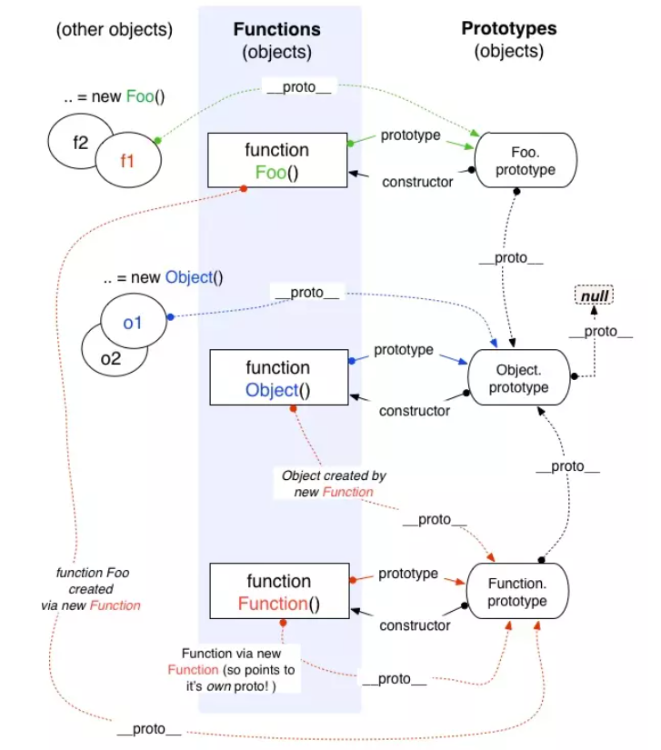
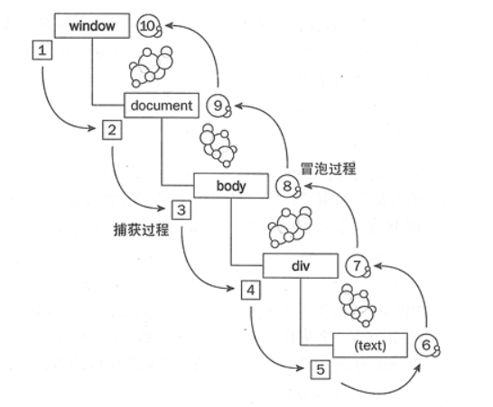
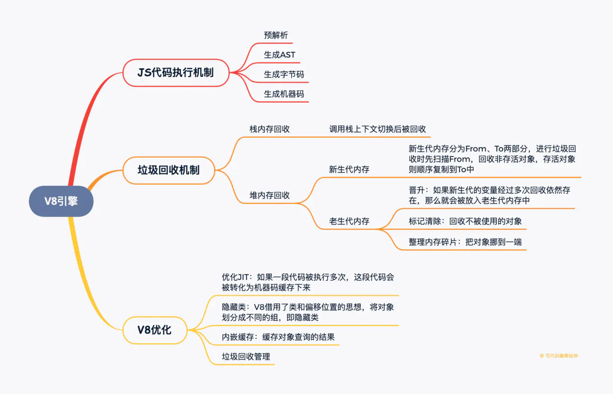
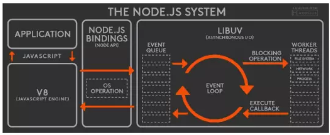
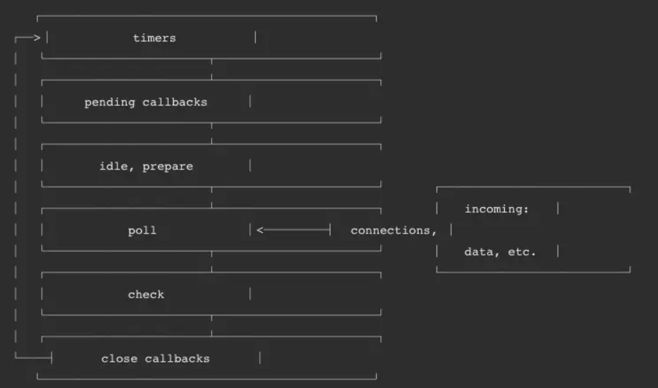

# JS 基础知识点

### [#](https://cchroot.github.io/interview/pages/interview notes/JS 基础知识点.html#_1、js-中存在-7-种原始类型)1、js 中存在 7 种原始类型

boolean,null,undefined,number,string,symbol,bigint；

typeof null 会输出 object,但是这只是 JS 存在的一个悠久 Bug

### [#](https://cchroot.github.io/interview/pages/interview notes/JS 基础知识点.html#_2、判断类型)2、判断类型

typeof 对于原始类型来说，除了 null 都可以显示正确的类型；typeof 对于对象来说，除了函数都会显示 object，所以说 typeof 并不能准确判断变量到底是什么类型。最通用的办法是运用`Object.prototype.toString.call()`

### [#](https://cchroot.github.io/interview/pages/interview notes/JS 基础知识点.html#_3、关于条件判断)3、关于条件判断

在条件判断时，除了 undefined， null， false， NaN， ''， 0， -0，其他所有值都转为 true，包括所有对象

### [#](https://cchroot.github.io/interview/pages/interview notes/JS 基础知识点.html#_4、关于this指向)4、关于this指向

如果用一句话说明 this 的指向，那么即是: 谁调用它，this 就指向谁。

但是仅通过这句话，我们很多时候并不能准确判断 this 的指向。因此我们需要借助一些规则去帮助自己：

this 的指向可以按照以下顺序判断:

**全局环境中的 this**

浏览器环境：无论是否在严格模式下，在全局执行环境中（在任何函数体外部）this 都指向全局对象 window;

node 环境：无论是否在严格模式下，在全局执行环境中（在任何函数体外部），this 都是空对象 {};

**是否是 new 绑定**

如果是 new 绑定，并且构造函数中没有返回 function 或者是 object，那么 this 指向这个新对象。如下:

- 构造函数返回值不是 function 或 object。new Super() 返回的是 this 对象。
- 构造函数返回值是 function 或 object，new Super()是返回的是Super种返回的对象。

```js
function Super(age){
  this.age = age
}

let instance = new Super('26')
console.log(instance.age) // 26
```


```js
function Super(age){
  this.age = age
  let obj = {a:'2'}
  return obj
}

let instance = new Super('26')
console.log(instance) // {a:'2'}
console.log(instance.age) // undefined
```


**函数是否通过 call,apply 调用，或者使用了 bind 绑定，如果是，那么this绑定的就是指定的对象【归结为显式绑定】。**

```js
function info(){
  console.log(this.age)
}
var person= {
  age: 20,
  info
}
var age = 28
var info = person.info
info.call(person) // 20
info.apply(person) // 20
info.bind(person)() // 20
```


这里同样需要注意一种特殊情况，如果 call,apply 或者 bind 传入的第一个参数值是 undefined 或者 null，严格模式下 this 的值为传入的值 null /undefined。非严格模式下，实际应用的默认绑定规则，this 指向全局对象(node环境为global，浏览器环境为window)

```js
function info () {
  // node 环境中：非严格模式 globao,严格模式 null
  // 浏览器环境中：非严格模式 window, 严格模式为 null
  console.log(this)
  console.log(this.age)
}
var person = {
  age: 20,
  info
}
var age = 28
var info = person.info
// 严格模式抛出错误
// 非严格模式，node 下输出 undefined（因为全局的 age 不会挂在 global 上）
// 非严格模式，浏览器环境下输出28（因为全局的 age 回挂在 window 上）
info.call(null)
```


注意：不管我们连续给函数 bind 几次，fn 中的 this 永远由第一次 bind 决定：`fn.bind().bind(a)() // this 指向fn`

**隐式绑定，函数的调用是在某个对象上触发的，即调用位置上存在上下文对象。典型的隐式调用为: xxx.fn()**

```js
function info(){
  console.log(this.age)
}
var person= {
  age: 20,
  info
}
var age = 28
person.info() // 20，执行的是隐式绑定
```


**默认绑定，在不能应用其它绑定规则时使用的默认规则，通常是独立函数调用。**

非严格模式： node环境，指向全局对象 global，浏览器环境，指向全局对象 window。

严格模式：执行 undefined

```js
function info(){
  console.log(this.age)
}

var age = 28
// 严格模式浏览器环境和node环境都抛错
// 非严格模式：node下输出 undefined（因为全局的 age 不会挂在 global 上）
// 非严格模式：浏览器环境下输出 28（因为全局的 age 回挂在 window 上）
info()
```


**箭头函数的情况**

箭头函数没有自己的this，继承外层上下文绑定的this。

```js
let obj = {
  age: 20,
  info: function() {
    return () => {
	  console.log(this.age)
	}
  }
}
let person = {age: 28}
let info = obj.info()
info() // 20

let info2 = obj.info.call(person)
info2() // 28
```


### [#](https://cchroot.github.io/interview/pages/interview notes/JS 基础知识点.html#_5、-和)5、== 和 ===

== 和 === 的区别是：对于 == 来说，如果对比双方的类型不一样的话，就会进行类型转换

### [#](https://cchroot.github.io/interview/pages/interview notes/JS 基础知识点.html#_6、闭包)6、闭包

闭包的定义：函数 A 内部有一个函数 B，函数 B 可以访问到函数 A 中的变量，那么函数 B 就是闭包

### [#](https://cchroot.github.io/interview/pages/interview notes/JS 基础知识点.html#_7、浅拷贝)7、浅拷贝

浅拷贝对象类型在赋值的过程中其实是复制了地址，从而会导致改变了一方其他也都被改变的情况;首先可以通过 `Object.assign` 来解决这个问题，很多人认为这个函数是用来深拷贝的。其实并不是，`Object.assign` 只会拷贝所有的属性值到新的对象中，如果属性值是对象的话，拷贝的是地址，所以并不是深拷贝。

### [#](https://cchroot.github.io/interview/pages/interview notes/JS 基础知识点.html#_8、深拷贝)8、深拷贝

简单的深拷贝可以通过: `JSON.parse(JSON.stringify(object))` 来解决，该方法的局限性在：

1. 会忽略 undefined
2. 会忽略 symbol
3. 不能序列化函数
4. 不能解决循环引用的对象

如果你所需拷贝的对象含有内置类型并且不包含函数，可以使用 MessageChannel，完全的深拷贝只能是采用递归遍历了

### [#](https://cchroot.github.io/interview/pages/interview notes/JS 基础知识点.html#_9、instanceof)9、instanceof

关于 instanceof 其实表示的就是一种继承关系，或者原型链的结构。Instanceof 运算符的第一个变量是一个对象，暂时称为A；第二个变量一般是一个函数，暂时称为 B。Instanceof的判断规则是：沿着 A 的 **proto** 这条线来找，同时沿着 B 的 prototype 这条线来找，如果两条线能找到同一个引用，即同一个对象，那么就返回 true。如果找到终点还未重合，则返回 false。

### [#](https://cchroot.github.io/interview/pages/interview notes/JS 基础知识点.html#_10、关于原型-需要记住这张图)10、关于原型，需要记住这张图



JavaScript对象通过__proto__ 指向父类对象，直到指向Object对象为止，这样就形成了一个原型指向的链条, 即原型链。

### [#](https://cchroot.github.io/interview/pages/interview notes/JS 基础知识点.html#_11、-var、let、const的区别)11、 var、let、const的区别

1. 函数提升优先于变量提升，函数提升会把整个函数挪到作用域顶部，变量提升只会把声明挪到作用域顶部
2. var 存在提升，我们能在声明之前使用。let、const 因为暂时性死区的原因，不能在声明前使用
3. var 在全局作用域下声明变量会导致变量挂载在 window 上，其他两者不会
4. let 和 const 作用基本一致，但是后者声明的变量不能再次赋值

### [#](https://cchroot.github.io/interview/pages/interview notes/JS 基础知识点.html#_12、组合继承)12、组合继承

核心是在子类的构造函数中通过 Parent.call(this) 继承父类的属性，然后改变子类的原型为 new Parent() 来继承父类的函数。

```js
function Parent(value) {
  this.val = value
}
Parent.prototype.getValue = function() {
  console.log(this.val)
}
function Child(value) {
  Parent.call(this, value)
}
Child.prototype = new Parent()

const child = new Child(1)

child.getValue() // 1
child instanceof Parent // true
```


这种继承方式优点在于构造函数可以传参，不会与父类引用属性共享，可以复用父类的函数，但是也存在一个缺点就是在继承父类函数的时候调用了父类构造函数，导致子类的原型上多了不需要的父类属性，存在内存上的浪费。

### [#](https://cchroot.github.io/interview/pages/interview notes/JS 基础知识点.html#_13、寄生组合继承)13、寄生组合继承

这种继承方式对组合继承进行了优化，组合继承缺点在于继承父类函数时调用了构造函数，我们只需要优化掉这点就行了。

```js
function Parent(value) {
  this.val = value
}
Parent.prototype.getValue = function() {
  console.log(this.val)
}

function Child(value) {
  Parent.call(this, value)
}
Child.prototype = Object.create(Parent.prototype, {
  constructor: {
    value: Child,
    enumerable: false,
    writable: true,
    configurable: true
  }
})

// 或者
// Child.prototype = Object.create(Parent.prototype);
// Child.prototype.constructor = Child;

const child = new Child(1)

child.getValue() // 1
child instanceof Parent // true
```


以上继承实现的核心就是将父类的原型赋值给了子类，并且将构造函数设置为子类，这样既解决了无用的父类属性问题，还能正确的找到子类的构造函数。

### [#](https://cchroot.github.io/interview/pages/interview notes/JS 基础知识点.html#_14、class-继承)14、Class 继承

以上两种继承方式都是通过原型去解决的，在 ES6 中，我们可以使用 class 去实现继承：

```js
class Parent {
  constructor(value) {
    this.val = value
  }
  getValue() {
    console.log(this.val)
  }
}
class Child extends Parent {
  constructor(value) {
    super(value)
    this.val = value
  }
}
let child = new Child(1)
child.getValue() // 1
child instanceof Parent // true
```

class 实现继承的核心在于使用 extends 表明继承自哪个父类，并且在子类构造函数中必须调用 super，因为这段代码可以看成 Parent.call(this, value)。不过，之前也说了在 JS 中并不存在类，所以 class 的本质就是函数。

### [#](https://cchroot.github.io/interview/pages/interview notes/JS 基础知识点.html#_15、模块化)15、模块化

1. 模块化带来的好处：解决命名冲突；提供复用性；提高代码可维护性
2. 在早期，使用立即执行函数实现模块化是常见的手段，通过函数作用域解决了命名冲突、污染全局作用域的问题
3. AMD 和 CMD
4. CommonJS：CommonJS 最早是 Node 在使用，目前也仍然广泛使用，比如在 Webpack 中你就能见到它，当然目前在 Node 中的模块管理已经和 CommonJS 有一些区别了
5. ES Module

### [#](https://cchroot.github.io/interview/pages/interview notes/JS 基础知识点.html#_16、proxy)16、Proxy

在 Vue3.0 中将会通过 Proxy 来替换原本的 Object.defineProperty 来实现数据响应式。 Proxy 是 ES6 中新增的功能，它可以用来自定义对象中的操作。如果需要实现一个 Vue 中的响应式，需要我们在 get 中收集依赖，在 set 派发更新，之所以 Vue3.0 要使用 Proxy 替换原本的 API 原因在于 Proxy 无需一层层递归为每个属性添加代理，一次即可完成以上操作，性能上更好，并且原本的实现有一些数据更新不能监听到，但是 Proxy 可以完美监听到任何方式的数据改变，唯一缺陷可能就是浏览器的兼容性不好了。

### [#](https://cchroot.github.io/interview/pages/interview notes/JS 基础知识点.html#_17、事件冒泡与捕获)17、事件冒泡与捕获

浏览器里面的事件都会按照一定的规则去传递，不管 body 上绑定事件、或者 div 甚至 div 的 text 节点上绑定事件，这个事件必须先从根节点开始遍历（即Window对象开始），从上往下，传递的过程中，发现有的元素绑定了事件，也先放着，等全部事件捕获完毕（遍历完毕）， 开始处理事件，处理的顺序为，从最小的根节点上的事件开始，依次向上冒泡，如图：



一句话概括这种机制：

- 捕获：自外而内，从根到叶，从大到小
- 冒泡：自内而外，从叶到根，从小到大

还需要注意的是，并不是所有的事件都会冒泡,以下事件就没有：

- onblur
- onfocus
- onmouseenter
- onmouseleave

### [#](https://cchroot.github.io/interview/pages/interview notes/JS 基础知识点.html#_18、关于事件代理-事件委托)18、关于事件代理（事件委托）

事件代理是通过监听一个父元素，来给不同的子元素绑定事件，减少监听次数，从而提升浏览器速度。需要注意的是：如果元素被阻止冒泡了，千万别去用事件委托的方式监听事件，因为事件委托的原理是利用事件冒泡，当冒泡被阻止，就无法监听了。


# JS 进阶知识点

### [#](https://cchroot.github.io/interview/pages/interview notes/JS 进阶知识点.html#手写-call、apply-及-bind-函数)手写 call、apply 及 bind 函数

首先从以下几点来考虑如何实现这几个函数：

- 不传入第一个参数，那么上下文默认为 window
- 改变了 this 指向，让新的对象可以执行该函数，并能接受参数

那么我们先来实现 call：

```js
Function.prototype.myCall = function(context) {
  if (typeof this !== 'function') {
    throw new TypeError('Error')
  }
  context = context || window
  context.fn = this
  const args = [...arguments].slice(1)
  const result = context.fn(...args)
  delete context.fn
  return result
}
```


以下是对实现的分析：

- 首先 context 为可选参数，如果不传的话默认上下文为 window
- 接下来给 context 创建一个 fn 属性，并将值设置为需要调用的函数
- 因为 call 可以传入多个参数作为调用函数的参数，所以需要将参数剥离出来
- 然后调用函数并将对象上的函数删除

以上就是实现 call 的思路，apply 的实现也类似，区别在于对参数的处理:

```js
Function.prototype.myApply = function(context) {
  if (typeof this !== 'function') {
    throw new TypeError('Error')
  }
  context = context || window
  context.fn = this
  let result
  // 处理参数和 call 有区别
  if (arguments[1]) {
    result = context.fn(...arguments[1])
  } else {
    result = context.fn()
  }
  delete context.fn
  return result
}
```


bind 的实现对比其他两个函数略微地复杂了一点，因为 bind 需要返回一个函数，需要判断一些边界问题，以下是 bind 的实现:

```js
Function.prototype.myBind = function (context) {
  if (typeof this !== 'function') {
    throw new TypeError('Error')
  }
  const _this = this
  const args = [...arguments].slice(1)
  // 返回一个函数
  return function F() {
    // 因为返回了一个函数，我们可以 new F()，所以需要判断
    if (this instanceof F) {
      return new _this(...args, ...arguments)
    }
    return _this.apply(context, args.concat(...arguments))
  }
}
// 测试代码
function fn(a) {
  console.log(this); // { x:100 }
  console.log(a)
}
let say = fn.myBind({ x: 100 }, 1, 2, 3)(4);
```


以下是对实现的分析：

- 前几步和之前的实现差不多，就不赘述了
- bind 返回了一个函数，对于函数来说有两种方式调用，一种是直接调用，一种是通过 new 的方式，我们先来说直接调用的方式
- 对于直接调用来说，这里选择了 apply 的方式实现，但是对于参数需要注意以下情况：因为 bind 可以实现类似这样的代码 f.bind(obj, 1)(2)，所以我们需要将两边的参数拼接起来，于是就有了这样的实现 args.concat(...arguments)

其它简单实现方法：

```js
Function.prototype._bind = function(...args) {
  if (typeof this !== 'function') return;
  // 获取this 数组args的第一项 (要指向的this { x: 100 })
  const _this = args.shift();
  // 获取fn._bind(....)中fn
  const self = this;
  return function() {
    return self.apply(_this, args);
  };
};


// 测试代码
function fn() {
  console.log(this); // { x:100 }
}
let say = fn._bind({ x: 100 }, 1, 2, 3);
say(); 
```


```js
Function.prototype._bind = function() {
  if (typeof this !== 'function') return;
  // 利用Array原型对象上的slice()方法,该方法返回一个新的数组。获取传入的参数arguments
  const args = Array.prototype.slice.call(arguments);
  const _this = args.shift();
  const self = this;
  return function() {
    return self.apply(_this, args);
  };
}; 


// 测试代码
function fn() {
  console.log(this); 
}
let say = fn._bind({ x: 100 }, 1, 2, 3);
say();  // { x:100 }
```


```js
Function.prototype._bind = function() {
  if (typeof this !== 'function') return;
  const args = Array.from(arguments);
  const _this = args.shift();
  const self = this;
  return function() {
    return self.apply(_this, args);
  };
};


// 测试代码
function fn() {
  console.log(this); 
}
let say = fn._bind({ x: 100 }, 1, 2, 3);
say();  // { x:100 }
```


### [#](https://cchroot.github.io/interview/pages/interview notes/JS 进阶知识点.html#new)new

在调用 new 的过程中会发生以上四件事情：

1. 新生成了一个对象
2. 链接到原型
3. 绑定 this
4. 返回新对象

根据以上几个过程，我们也可以试着来自己实现一个 new:

```js
function create() {
  // 创建一个空对象
  let obj = {}
  // 获取构造函数
  let Con = [].shift.call(arguments)
  // 设置空对象的原型
  obj.__proto__ = Con.prototype
  // 绑定 this 并执行构造函数
  let result = Con.apply(obj, arguments)
  // 确保返回值为对象
  return result instanceof Object ? result : obj
}
```


对于对象来说，其实都是通过 new 产生的，无论是 function Foo() 还是 let a = { b : 1 } 。

对于创建一个对象来说，更推荐使用字面量的方式创建对象（无论性能上还是可读性）。因为你使用 new Object() 的方式创建对象需要通过作用域链一层层找到 Object，但是你使用字面量的方式就没这个问题。

```js
function Foo() {}
// function 就是个语法糖
// 内部等同于 new Function()
let a = { b: 1 }
// 这个字面量内部也是使用了 new Object()
```


### [#](https://cchroot.github.io/interview/pages/interview notes/JS 进阶知识点.html#instanceof-的原理)instanceof 的原理

instanceof 可以正确的判断对象的类型，因为内部机制是通过判断对象的原型链中是不是能找到类型的 prototype。

我们也可以试着实现一下 instanceof:

```js
function myInstanceof(left, right) {
  let prototype = right.prototype
  left = left.__proto__
  while (true) {
    if (left === null || left === undefined)
      return false
    if (prototype === left)
      return true
    left = left.__proto__
  }
}
```


以下是对实现的分析：

- 首先获取类型的原型
- 然后获得对象的原型
- 然后一直循环判断对象的原型是否等于类型的原型，直到对象原型为 null，因为原型链最终为 null

### [#](https://cchroot.github.io/interview/pages/interview notes/JS 进阶知识点.html#为什么-0-1-0-2-0-3)为什么 0.1 + 0.2 != 0.3

先说原因，因为 JS 采用 IEEE 754 双精度版本（64位），并且只要采用 IEEE 754 的语言都有该问题。

我们都知道计算机是通过二进制来存储东西的，那么 0.1 在二进制中会表示为:

```js
// (0011) 表示循环
0.1 = 2^-4 * 1.10011(0011)
```


我们可以发现，0.1 在二进制中是无限循环的一些数字，其实不只是 0.1，其实很多十进制小数用二进制表示都是无限循环的。这样其实没什么问题，但是 JS 采用的浮点数标准却会裁剪掉我们的数字。

IEEE 754 双精度版本（64位）将 64 位分为了三段：

- 第一位用来表示符号
- 接下去的 11 位用来表示指数
- 其他的位数用来表示有效位，也就是用二进制表示 0.1 中的 10011(0011)
- 

那么这些循环的数字被裁剪了，就会出现精度丢失的问题，也就造成了 0.1 不再是 0.1 了，而是变成了 0.100000000000000002

### [#](https://cchroot.github.io/interview/pages/interview notes/JS 进阶知识点.html#v8-相关)V8 相关



#### [#](https://cchroot.github.io/interview/pages/interview notes/JS 进阶知识点.html#v8如何执行一段js代码)V8如何执行一段JS代码

1. 预解析：检查语法错误但不生成 AST
2. 生成AST：经过词法/语法分析，生成抽象语法树
3. 生成字节码：基线编译器(Ignition)将 AST 转换成字节码
4. 由解释器逐行执行字节码，遇到热点代码启动编译器进行编译，生成对应的机器码, 以优化执行效率：优化编译器(Turbofan)将字节码转换成优化过的机器码，此外在逐行执行字节码的过程中，如果一段代码经常被执行，那么 V8 会将这段代码直接转换成机器码保存起来，下一次执行就不必经过字节码，优化了执行速度

以上是简单概述，详细请参考:

[V8 是怎么跑起来的 —— V8 的 JavaScript 执行管道 (opens new window)](https://juejin.cn/post/6844903990073753613)[JavaScript 引擎 V8 执行流程概述(opens new window)](https://juejin.cn/post/6844904021451505677)

#### [#](https://cchroot.github.io/interview/pages/interview notes/JS 进阶知识点.html#js相较于c-等语言为什么慢-v8做了哪些优化)JS相较于C++等语言为什么慢，V8做了哪些优化

JS的问题：

- **动态类型**：导致每次存取属性/寻求方法时候，都需要先检查类型；此外动态类型也很难在编译阶段进行优化
- **属性存取**：C++/Java等语言中方法、属性是存储在数组中的，仅需数组位移就可以获取，而JS存储在对象中，每次获取都要进行哈希查询

V8的优化：

- **优化JIT**(即时编译)：相较于C++/Java这类编译型语言，JS一边解释一边执行，效率低。V8对这个过程进行了优化：如果一段代码被执行多次，那么V8会把这段代码转化为机器码缓存下来，下次运行时直接使用机器码。
- **隐藏类**：对于C++这类语言来说，仅需几个指令就能通过偏移量获取变量信息，而JS需要进行字符串匹配，效率低，V8借用了类和偏移位置的思想，将对象划分成不同的组，即隐藏类
- **内嵌缓存**：即缓存对象查询的结果。常规查询过程是：获取隐藏类地址 -> 根据属性名查找偏移值 -> 计算该属性地址，内嵌缓存就是对这一过程结果的缓存
- **垃圾回收管理**：下文马上介绍

详细请看[为什么V8引擎这么快？(opens new window)](https://zhuanlan.zhihu.com/p/27628685)

### [#](https://cchroot.github.io/interview/pages/interview notes/JS 进阶知识点.html#垃圾回收机制)垃圾回收机制

V8 实现了准确式 GC，GC 算法采用了分代式垃圾回收机制。因此，V8 将内存（堆）分为新生代和老生代两部分。新生代就是临时分配的内存，存活时间短， 老生代是常驻内存，存活的时间长。V8 的堆内存，也就是两个内存 之和。

#### [#](https://cchroot.github.io/interview/pages/interview notes/JS 进阶知识点.html#新生代算法)新生代算法

新生代中的对象一般存活时间较短，使用 **Scavenge GC 算法**。

首先是新生代的内存，刚刚已经介绍了调整新生代内存的方法，那它的内存默认限制是多少？在 64 位和 32 位系统下分别为 32MB 和 16MB。够小吧，不过也很好理解，新生代中的变量存活时间短，来了马上就走，不容易产生太大的内存负担，因此可以将它设的足够小。

在新生代空间中，内存空间分为两部分，分别为 From 空间和 To 空间。在这两个空间中，必定有一个空间是使用的，另一个空间是空闲的。新分配的对象会被放入 From 空间中，当 From 空间被占满时，新生代 GC 就会启动了。算法会检查 From 空间中存活的对象并复制到 To 空间中，如果有失活的对象就会销毁。当复制完成后将 From 空间和 To 空间互换，这样 GC 就结束了。

Scavenge GC 算法主要就是解决内存碎片的问题，不过 Scavenge GC 算法的劣势也非常明显，就是内存只能使用新生代内存的一半，但是它只存放生命周期短的对象，这种对象一般很少，因此时间性能非常优秀。

#### [#](https://cchroot.github.io/interview/pages/interview notes/JS 进阶知识点.html#老生代算法)老生代算法

新生代中的变量如果经过多次回收后依然存在，那么就会被放入到老生代内存中，这种现象就叫晋升。

发生晋升其实不只是这一种原因，我们来梳理一下会有那些情况触发晋升:

- 新生代中的对象是否已经经历过一次 Scavenge 算法，如果经历过的话，会将对象从新生代空间移到老生代空间中。
- To 空间的对象占比大小超过 25 %。在这种情况下，为了不影响到内存分配，会将对象从新生代空间移到老生代空间中。

老生代中的对象一般存活时间较长且数量也多，使用了两个算法，分别是**标记清除算法**和**标记压缩算法**。

老生代中的空间很复杂，有如下几个空间

```js
enum AllocationSpace {
  // TODO(v8:7464): Actually map this space's memory as read-only.
  RO_SPACE,    // 不变的对象空间
  NEW_SPACE,   // 新生代用于 GC 复制算法的空间
  OLD_SPACE,   // 老生代常驻对象空间
  CODE_SPACE,  // 老生代代码对象空间
  MAP_SPACE,   // 老生代 map 对象
  LO_SPACE,    // 老生代大空间对象
  NEW_LO_SPACE,  // 新生代大空间对象

  FIRST_SPACE = RO_SPACE,
  LAST_SPACE = NEW_LO_SPACE,
  FIRST_GROWABLE_PAGED_SPACE = OLD_SPACE,
  LAST_GROWABLE_PAGED_SPACE = MAP_SPACE
};
```


在老生代中，以下情况会先启动标记清除算法：

- 某一个空间没有分块的时候
- 空间中被对象超过一定限制
- 空间不能保证新生代中的对象移动到老生代中

标记清除算法分为两步:

1. 第一步，进行标记-清除：主要分成两个阶段，即标记阶段和清除阶段。首先会遍历堆中的所有对象，对它们做上标记，然后对于代码环境中使用的变量以及被强引用的变量取消标记，剩下的就是要删除的变量了，在随后的清除阶段对其进行空间的回收。

在标记大型对内存时，可能需要几百毫秒才能完成一次标记。这就会导致一些性能上的问题。

为了解决这个问题，2011 年，V8 从 stop-the-world 标记切换到增量标志。在增量标记期间，GC 将标记工作分解为更小的模块，可以让 JS 应用逻辑在模块间隙执行一会，从而不至于让应用出现停顿情况。但在 2018 年，GC 技术又有了一个重大突破，这项技术名为并发标记。该技术可以让 GC 扫描和标记对象时，同时允许 JS 运行。

1. 第二步，整理内存碎片：清除对象后会造成堆内存出现碎片的情况，当碎片超过一定限制后会启动压缩算法。在压缩过程中，将活的对象像一端移动，直到所有对象都移动完成然后清理掉不需要的内存。

关于什么是引用计数：给一个变量赋值引用类型，则该对象的引用次数+1，如果这个变量变成了其他值，那么该对象的引用次数-1，垃圾回收器会回收引用次数为0的对象。但是当对象循环引用时，会导致引用次数永远无法归零，造成内存无法释放。

#### [#](https://cchroot.github.io/interview/pages/interview notes/JS 进阶知识点.html#总结概述)总结概述

JS引擎中对变量的存储主要有两种位置，栈内存和堆内存，栈内存存储基本类型数据以及引用类型数据的内存地址，堆内存储存引用类型的数据

栈内存的回收：

栈内存调用栈上下文切换后就被回收，比较简单

堆内存的回收：

V8 的堆内存分为新生代内存和老生代内存，新生代内存是临时分配的内存，存在时间短，老生代内存存在时间长

- 新生代内存回收机制：
  - 新生代内存容量小，64位系统下仅有32M。新生代内存分为From、To两部分，进行垃圾回收时，先扫描From，将非存活对象回收，将存活对象顺序复制到To中，之后调换From/To，等待下一次回收
- 老生代内存回收机制
  - 晋升：如果新生代的变量经过多次回收依然存在，那么就会被放入- 老生代内存中
  - 标记清除：老生代内存会先遍历所有对象并打上标记，然后对正在使用或被强引用的对象取消标记，回收被标记的对象
  - 整理内存碎片：把对象挪到内存的一端

详细请看: [聊聊V8引擎的垃圾回收(opens new window)](https://juejin.cn/post/6844903591510016007#heading-10)

参考链接

[前端面试之道(opens new window)](https://yuchengkai.cn/docs/frontend/#promise-实现)

[前端基础拾遗90问](https://juejin.cn/post/6844904116552990727#heading-21)


# JS 异步编程相关

1、回调函数存在着别的几个缺点，比如不能使用 try catch 捕获错误，不能直接 return

2、回调地狱的根本问题就是：

1. 嵌套函数存在耦合性，一旦有所改动，就会牵一发而动全身
2. 嵌套函数一多，就很难处理错误

3、Generator 最大的特点就是可以控制函数的执行，可以通过 Generator 函数解决回调地狱的问题：

```js
function *fetch() {
    yield ajax(url, () => {})
    yield ajax(url1, () => {})
    yield ajax(url2, () => {})
}
let it = fetch()
let result1 = it.next()
let result2 = it.next()
let result3 = it.next()
```


4、promise：

1. Promise有三种状态，分别是：等待中（pending）、完成了 （resolved）、拒绝了（rejected）
2. 一旦从等待状态变成为其他状态就永远不能更改状态了，也就是说一旦状态变为 resolved 后，就不能再次改变

当我们在构造 Promise 的时候，构造函数内部的代码是立即执行的

```js
new Promise((resolve, reject) => {
  console.log('new Promise')
  resolve('success')
})
console.log('finifsh')
// new Promise -> finifsh
```


Promise 实现了链式调用，也就是说每次调用 then 之后返回的都是一个 Promise，并且是一个全新的 Promise，原因也是因为状态不可变。如果你在 then 中 使用了 return，那么 return 的值会被 Promise.resolve() 包装:

```js
Promise.resolve(1)
  .then(res => {
    console.log(res) // => 1
    return 2 // 包装成 Promise.resolve(2)
  })
  .then(res => {
    console.log(res) // => 2
  })
```


当然了，Promise 也很好地解决了回调地狱的问题，可以把之前的回调地狱例子改写为如下代码:

```js
ajax(url)
  .then(res => {
      console.log(res)
      return ajax(url1)
  }).then(res => {
      console.log(res)
      return ajax(url2)
  }).then(res => console.log(res))
```


前面都是在讲述 Promise 的一些优点和特点，其实它也是存在一些缺点的，比如无法取消 Promise，错误需要通过回调函数捕获

5、手写简单的 promise:

```js
const PENDING = 'pending'
const RESOLVED = 'resolved'
const REJECTED = 'rejected'

function MyPromise(fn) {
  const that = this
  that.state = PENDING
  that.value = null
  that.resolvedCallbacks = []
  that.rejectedCallbacks = []
  
  that.resolve = function (value) {
	if (that.state === PENDING) {
	  that.state = RESOLVED
	  that.value = value
	  that.resolvedCallbacks.map(cb => cb(that.value))
	}
  }
	
  that.reject = function (value) {
	if (that.state === PENDING) {
	  that.state = REJECTED
	  that.value = value
	  that.rejectedCallbacks.map(cb => cb(that.value))
	}
  }

  try {
    fn(that.resolve, that.reject)
  } catch (e) {
    reject(e)
  }
}

MyPromise.prototype.then = function(onFulfilled, onRejected) {
  const that = this
  onFulfilled = typeof onFulfilled === 'function' ? onFulfilled : v => v
  onRejected =
    typeof onRejected === 'function'
      ? onRejected
      : r => {
          throw r
        }
  if (that.state === PENDING) {
    that.resolvedCallbacks.push(onFulfilled)
    that.rejectedCallbacks.push(onRejected)
  }
  if (that.state === RESOLVED) {
    onFulfilled(that.value)
  }
  if (that.state === REJECTED) {
    onRejected(that.value)
  }
}
```


6、async 及 await：

1. 一个函数如果加上 async ，那么该函数就会返回一个 Promise
2. async 就是将函数返回值使用 Promise.resolve() 包裹了下，和 then 中处理返回值一样，并且 await 只能配套 async 使用
3. async 和 await 可以说是异步终极解决方案了，相比直接使用 Promise 来说，优势在于处理 then 的调用链，能够更清晰准确的写出代码，毕竟写一大堆 then 也很恶心，并且也能优雅地解决回调地狱问题。
4. 当然也存在一些缺点，因为 await 将异步代码改造成了同步代码，如果多个异步代码没有依赖性却使用了 await 会导致性能上的降低，这时候可以采用 promise.all()

7、常用定时器函数:异步编程当然少不了定时器了，常见的定时器函数有 setTimeout、setInterval、requestAnimationFrame。

很多人认为 setTimeout 是延时多久，那就应该是多久后执行，其实这个观点是错误的，因为 JS 是单线程执行的，如果前面的代码影响了性能，就会导致 setTimeout 不会按期执行。当然了，我们可以通过代码去修正 setTimeout，从而使定时器相对准确。

```js
let period = 60 * 1000 * 60 * 2
let startTime = new Date().getTime()
let count = 0
let end = new Date().getTime() + period
let interval = 1000
let currentInterval = interval

function loop() {
  count++
  // 代码执行所消耗的时间
  let offset = new Date().getTime() - (startTime + count * interval);
  let diff = end - new Date().getTime()
  let h = Math.floor(diff / (60 * 1000 * 60))
  let hdiff = diff % (60 * 1000 * 60)
  let m = Math.floor(hdiff / (60 * 1000))
  let mdiff = hdiff % (60 * 1000)
  let s = mdiff / (1000)
  let sCeil = Math.ceil(s)
  let sFloor = Math.floor(s)
  // 得到下一次循环所消耗的时间
  currentInterval = interval - offset 
  console.log('时：'+h, '分：'+m, '毫秒：'+s, '秒向上取整：'+sCeil, '代码执行时间：'+offset, '下次循环间隔'+currentInterval) 

  setTimeout(loop, currentInterval)
}

setTimeout(loop, currentInterval)
```


setInterval，其实这个函数作用和 setTimeout 基本一致，只是该函数是每隔一段时间执行一次回调函数。通常来说不建议使用 setInterval。第一，它和 setTimeout 一样，不能保证在预期的时间执行任务。第二，它存在执行累积的问题，请看以下伪代码：

```js
function demo() {
  setInterval(function(){
    console.log(2)
  },1000)
  sleep(2000)
}
demo()
```


以上代码在浏览器环境中，如果定时器执行过程中出现了耗时操作，多个回调函数会在耗时操作结束以后同时执行，这样可能就会带来性能上的问题。

如果你有循环定时器的需求，其实完全可以通过 requestAnimationFrame 来实现:

```js
function setInterval(callback, interval) {
  let timer
  const now = Date.now
  let startTime = now()
  let endTime = startTime
  const loop = () => {
    timer = window.requestAnimationFrame(loop)
    endTime = now()
    if (endTime - startTime >= interval) {
      startTime = endTime = now()
      callback(timer)
    }
  }
  timer = window.requestAnimationFrame(loop)
  return timer
}

let a = 0
setInterval(timer => {
  console.log(1)
  a++
  if (a === 3) cancelAnimationFrame(timer)
}, 1000)
```


首先 requestAnimationFrame 自带函数节流功能，基本可以保证在 16.6 毫秒内只执行一次（不掉帧的情况下），并且该函数的延时效果是精确的，没有其他定时器时间不准的问题，当然你也可以通过该函数来实现 setTimeout。


# 浏览器与Node的事件循环(Event Loop)

Event Loop 即事件循环，是指浏览器或 Node 的一种解决 javaScript 单线程运行时不会阻塞的一种机制，也就是我们经常使用异步的原理。

## [#](https://cchroot.github.io/interview/pages/interview notes/浏览器与Node的事件循环Event Loop.html#进程与线程)进程与线程

上面说了 js 单线程执行的，那什么是线程和进程？

进程是 CPU 资源分配的最小单位；线程是 CPU 调度的最小单位。一个进程由一个或多个线程组成，线程是一个进程中代码的不同执行路线，并且一个进程的内存空间是共享的，每个线程都可用这些共享内存。

进程描述了 CPU 在运行指令及加载和保存上下文所需的时间，放在应用上来说就代表了一个程序。线程是进程中的更小单位，描述了执行一段指令所需的时间

把这些概念拿到浏览器中来说，当你打开一个 Tab 页时，其实就是创建了一个进程，一个进程中可以有多个线程，比如渲染线程、JS 引擎线程、HTTP 请求线程、定时触发器线程、事件触发线程等等。当你发起一个请求时，其实就是创建了一个线程，当请求结束后，该线程可能就会被销毁。

上文说到了 JS 引擎线程和渲染线程，大家应该都知道，在 JS 运行的时候可能会阻止 UI 渲染，这说明了两个线程是互斥的。这其中的原因是因为 JS 可以修改 DOM，如果在 JS 执行的时候 UI 线程还在工作，就可能导致不能安全的渲染 UI。这其实也是一个单线程的好处，得益于 JS 是单线程运行的，可以达到节省内存，节约上下文切换时间。

## [#](https://cchroot.github.io/interview/pages/interview notes/浏览器与Node的事件循环Event Loop.html#事件循环-event-loop)事件循环 Event Loop

在 JavaScript 中，任务被分为两种，一种宏任务（MacroTask）也叫Task，一种叫微任务（MicroTask）。

**MacroTask（宏任务）**

script 全部代码、setTimeout、setInterval、setImmediate（浏览器暂时不支持，只有IE10支持，具体可见MDN）、I/O、UI Rendering。

**MicroTask（微任务）**

Process.nextTick（Node独有）、Promise、Object.observe(废弃)、MutationObserver（具体使用方式查看 [这里 (opens new window)](https://javascript.ruanyifeng.com/dom/mutationobserver.html)）

### [#](https://cchroot.github.io/interview/pages/interview notes/浏览器与Node的事件循环Event Loop.html#浏览器中的-event-loop)浏览器中的 Event Loop

Javascript 有一个 main thread 主线程和 call-stack 调用栈(执行栈)，所有的任务都会被放到调用栈等待主线程执行。

#### [#](https://cchroot.github.io/interview/pages/interview notes/浏览器与Node的事件循环Event Loop.html#js调用栈)JS调用栈

JS调用栈采用的是后进先出的规则，当函数执行的时候，会被添加到栈的顶部，当执行栈执行完成后，就会从栈顶移出，直到栈内被清空。

#### [#](https://cchroot.github.io/interview/pages/interview notes/浏览器与Node的事件循环Event Loop.html#同步任务和异步任务)同步任务和异步任务

Javascript单线程任务被分为同步任务和异步任务，同步任务会在调用栈中按照顺序等待主线程依次执行，异步任务会在异步任务有了结果后（例如 setTimeout 的等待时间结束），将注册的回调函数放入任务队列中等待主线程空闲的时候（调用栈被清空），被读取到栈内等待主线程的执行。

任务队列 Task Queue，即队列，先进先出，即异步任务先进来先执行。

#### [#](https://cchroot.github.io/interview/pages/interview notes/浏览器与Node的事件循环Event Loop.html#任务执行步骤)任务执行步骤

首先要明白：

- JS分为同步任务和异步任务
- 同步任务都在主线程上执行，形成一个执行栈
- 主线程之外，事件触发线程管理着一个任务队列，只要异步任务有了运行结果，就在任务队列之中放置一个事件
- 一旦执行栈中的所有同步任务执行完毕（此时JS引擎空闲），系统就会读取任务队列，将可运行的异步任务添加到可执行栈中，开始执行

具体执行步骤（运行机制）：

- 执行一个宏任务（栈中没有就从事件队列中获取）
- 执行过程中如果遇到微任务，就将它添加到微任务的任务队列中
- 宏任务执行完毕后，立即执行当前微任务队列中的所有微任务（依次执行）
- 当前宏任务执行完毕，开始检查渲染，然后GUI线程接管渲染 渲染完毕后，JS线程继续接管，开始下一个宏任务（从事件队列中获取）

案例一：

```js
console.log('script start');

setTimeout(function() {
  console.log('setTimeout');
}, 0);

Promise.resolve().then(function() {
  console.log('promise1');
}).then(function() {
  console.log('promise2');
});
console.log('script end');

/*
script start
script end
promise1
promise2
setTimeout
*/
```


这题比较简单，就不解析了

案例二：

```js
//请写出输出内容
async function async1() {
    console.log('async1 start');
    await async2();
    console.log('async1 end');
}
async function async2() {
	console.log('async2');
}

console.log('script start');

setTimeout(function() {
    console.log('setTimeout');
}, 0)

async1();

new Promise(function(resolve) {
    console.log('promise1');
    resolve();
}).then(function() {
    console.log('promise2');
});
console.log('script end');


/*
script start
async1 start
async2
promise1
script end
async1 end
promise2
setTimeout
*/
```


解析：

1. 首先，事件循环从宏任务 (macrotask) 队列开始，这个时候，宏任务队列中，只有一个 script(整体代码)任务；当遇到任务源 (task source) 时，则会先分发任务到对应的任务队列中去。
2. 然后我们看到首先定义了两个 async 函数，接着往下看，然后遇到了 console 语句，直接输出 script start。输出之后，script 任务继续往下执行，遇到 setTimeout，其作为一个宏任务源，则会先将其任务分发到对应的队列中：
3. script 任务继续往下执行，执行了async1()函数，前面讲过 async 函数中在 await 之前的代码是立即执行的，所以会立即输出 async1 start。

遇到了 await 时，会将 await 后面的表达式执行一遍，所以就紧接着输出 async2，然后将 await 后面的代码也就是 console.log('async1 end') 加入到 microtask 中的 Promise 队列中，接着跳出async1函数来执行后面的代码。

1. script任务继续往下执行，遇到 Promise 实例。由于Promise中的函数是立即执行的，而后续的 .then 则会被分发到 microtask 的 Promise 队列中去。所以会先输出 promise1，然后执行 resolve，将 promise2 分配到对应队列。
2. script任务继续往下执行，最后只有一句输出了 script end，至此，全局任务就执行完毕了。

根据上述，每次执行完一个宏任务之后，会去检查是否存在 Microtasks；如果有，则执行 Microtasks 直至清空 Microtask Queue。

1. 因而在 script 任务执行完毕之后，开始查找清空微任务队列。此时，微任务中， Promise 队列有的两个任务 async1 end 和 promise2，因此按先后顺序输出 async1 end，promise2。当所有的 Microtasks 执行完毕之后，表示第一轮的循环就结束了。
2. 第二轮循环依旧从宏任务队列开始。此时宏任务中只有一个 setTimeout，取出直接输出即可，至此整个流程结束。

案例三:

```js
const first = () => (new Promise((resolve,reject)=>{
    console.log(3);
    let p = new Promise((resolve, reject)=>{
         console.log(7);
        setTimeout(()=>{
           console.log(5);
           resolve(6); 
        },0)
        resolve(1);
    }); 
    resolve(2);
    p.then((arg)=>{
        console.log(arg);
    });

}));

first().then((arg)=>{
    console.log(arg);
});
console.log(4);
```


简单解析：

第一轮事件循环：

先执行宏任务，主script ，new Promise 立即执行，输出【3】，执行p这个 new Promise 操作，输出【7】，发现 setTimeout，将回调放入下一轮任务队列（Event Queue），p 的 then，姑且叫做then1，放入微任务队列，发现 first 的 then，叫 then2，放入微任务队列。执行 console.log(4)，输出【4】,宏任务执行结束。

再执行微任务，执行 then1，输出【1】，执行 then2，输出【2】。到此为止，第一轮事件循环结束。开始执行第二轮。

第二轮事件循环：

先执行宏任务里面的，也就是 setTimeout 的回调，输出【5】。resovle 不会生效，因为 p 这个 Promise 的状态一旦改变就不会在改变了。 所以最终的输出顺序是：3、7、4、1、2、5。

### [#](https://cchroot.github.io/interview/pages/interview notes/浏览器与Node的事件循环Event Loop.html#node-中的-event-loop)Node 中的 Event Loop

Node 中的 Event Loop 和浏览器中的是完全不相同的东西。



Node.js 采用 V8 作为 js 的解析引擎，而 I/O 处理方面使用了自己设计的 libuv，libuv 是一个基于事件驱动的跨平台抽象层，封装了不同操作系统一些底层特性，对外提供统一的 API（时间，非阻塞的网络，异步文件操作，子进程等等），Event Loop 也是它里面的实现。

Node.js的运行机制如下:

- V8 引擎解析 JavaScript 脚本。
- 解析后的代码，调用 Node API。
- libuv 库负责 Node API 的执行。它将不同的任务分配给不同的线程，形成一个 Event Loop（事件循环），以异步的方式将任务的执行结果返回给 V8 引擎。
- V8 引擎再将结果返回给用户。



Node 的 Event Loop 分为 6 个阶段，它们会按照顺序反复运行。每当进入某一个阶段的时候，都会从对应的回调队列中取出函数去执行。当队列为空或者执行的回调函数数量到达系统设定的阈值，就会进入下一阶段。

#### [#](https://cchroot.github.io/interview/pages/interview notes/浏览器与Node的事件循环Event Loop.html#timer)timer

timers 阶段会执行 setTimeout 和 setInterval 回调，并且是由 poll 阶段控制的。

同样，**在 Node 中定时器指定的时间也不是准确时间，只能是尽快执行**。

#### [#](https://cchroot.github.io/interview/pages/interview notes/浏览器与Node的事件循环Event Loop.html#i-o)I/O

I/O 阶段会处理一些上一轮循环中的少数未执行的 I/O 回调

#### [#](https://cchroot.github.io/interview/pages/interview notes/浏览器与Node的事件循环Event Loop.html#idle-prepare)idle, prepare

idle, prepare 阶段内部实现，仅node内部使用，这里就不详细讲了。

#### [#](https://cchroot.github.io/interview/pages/interview notes/浏览器与Node的事件循环Event Loop.html#poll)poll

poll 是一个至关重要的阶段，这一阶段中，系统会做两件事情

- 回到 timer 阶段执行回调
- 执行 I/O 回调

并且在进入该阶段时如果没有设定了 timer 的话，会发生以下两件事情:

- 如果 poll 队列不为空，会遍历回调队列并同步执行，直到队列为空或者达到系统限制
- 如果 poll 队列为空时，会有两件事发生:
  - 如果有 setImmediate 回调需要执行，poll 阶段会停止并且进入到 check 阶段执行回调
  - 如果没有 setImmediate 回调需要执行，会等待回调被加入到队列中并立即执行回调，这里同样会有个超时时间设置防止一直等待下去

当然设定了 timer 的话且 poll 队列为空，则会判断是否有 timer 超时，如果有的话会回到 timer 阶段执行回调。

#### [#](https://cchroot.github.io/interview/pages/interview notes/浏览器与Node的事件循环Event Loop.html#check)check

check 阶段执行 setImmediate() 的回调

#### [#](https://cchroot.github.io/interview/pages/interview notes/浏览器与Node的事件循环Event Loop.html#close-callbacks)close callbacks

close callbacks 阶段执行 socket 的 close 事件

在以上的内容中，我们了解了 Node 中的 Event Loop 的执行顺序，接下来我们将会通过代码的方式来深入理解这块内容。

首先在有些情况下，定时器的执行顺序其实是随机的:

```js
setTimeout(() => {
    console.log('setTimeout')
}, 0)
setImmediate(() => {
    console.log('setImmediate')
})
```


首先你需要知道：

- setTimeout 和 setImmediate 二者非常相似，区别主要在于调用时机不同。
- setImmediate 设计在poll阶段完成时执行，即check阶段；
- setTimeout 设计在poll阶段为空闲时，且设定时间到达后执行，但它在timer阶段执行

对于以上代码来说，setTimeout 可能执行在前，也可能执行在后:

- setTimeout(fn, 0) === setTimeout(fn, 1)，这是由源码决定的
- 进入事件循环也是需要成本的，如果在准备时候花费了大于 1ms 的时间，那么在 timer 阶段就会直接执行 setTimeout 回调
- 那么如果准备时间花费小于 1ms，那么就是 setImmediate 回调先执行了

当然在某些情况下，他们的执行顺序一定是固定的，比如以下代码：

```js
const fs = require('fs')

fs.readFile(__filename, () => {
    setTimeout(() => {
        console.log('timeout');
    }, 0)
    setImmediate(() => {
        console.log('immediate')
    })
})
```


在上述代码中，setImmediate 永远先执行。因为两个代码写在 IO 回调中，IO 回调是在 poll 阶段执行，当回调执行完毕后队列为空，发现存在 setImmediate 回调，所以就直接跳转到 check 阶段去执行回调了。

上面介绍的都是 macrotask 的执行情况，对于 microtask 来说，它会在以上每个阶段完成前清空 microtask 队列:

```js
setTimeout(() => {
  console.log('timer21')
}, 0)

Promise.resolve().then(function() {
  console.log('promise1')
})
```


对于以上代码来说，其实和浏览器中的输出是一样的，microtask 永远执行在 macrotask 前面。

#### [#](https://cchroot.github.io/interview/pages/interview notes/浏览器与Node的事件循环Event Loop.html#process-nexttick)process.nextTick

最后我们来讲讲 Node 中的 process.nextTick，这个函数其实是独立于 Event Loop 之外的，它有一个自己的队列，当每个阶段完成后，如果存在 nextTick 队列，就会清空队列中的所有回调函数，并且优先于其他 microtask 执行。

```js
setTimeout(() => {
 console.log('timer1')
 Promise.resolve().then(function() {
   console.log('promise1')
 })
}, 0)

process.nextTick(() => {
 console.log('nextTick')
 process.nextTick(() => {
   console.log('nextTick')
   process.nextTick(() => {
     console.log('nextTick')
     process.nextTick(() => {
       console.log('nextTick')
     })
   })
 })
})
// nextTick=>nextTick=>nextTick=>nextTick=>timer1=>promise1
```


对于以上代码，大家可以发现无论如何，永远都是先把 nextTick 全部打印出来。

#### [#](https://cchroot.github.io/interview/pages/interview notes/浏览器与Node的事件循环Event Loop.html#node-中的宏任务-macrotask-和微任务-microtask)node 中的宏任务（MacroTask）和微任务（MicroTask）

Node端事件循环中的异步队列也是这两种：macro（宏任务）队列和 micro（微任务）队列：

- 常见的 macro-task 比如：setTimeout、setInterval、 setImmediate、script（整体代码）、 I/O 操作等
- 常见的 micro-task 比如: process.nextTick、new Promise().then(回调)等

#### [#](https://cchroot.github.io/interview/pages/interview notes/浏览器与Node的事件循环Event Loop.html#案例)案例

案例一：

```js
console.log('start')
setTimeout(() => {
  console.log('timer1')
  Promise.resolve().then(function() {
    console.log('promise1')
  })
}, 0)
setTimeout(() => {
  console.log('timer2')
  Promise.resolve().then(function() {
    console.log('promise2')
  })
}, 0)
Promise.resolve().then(function() {
  console.log('promise3')
})
console.log('end')
//start=>end=>promise3=>timer1=>timer2=>promise1=>promise2
```


1. 一开始执行栈的同步任务（这属于宏任务）执行完毕后（依次打印出 start end，并将 2 个 timer 依次放入 timer 队列）,会先去执行微任务（这点跟浏览器端的一样），所以打印出 promise3
2. 然后进入 timers 阶段，执行 timer1 的回调函数，打印 timer1，并将promise.then回调放入 microtask 队列，同样的步骤执行 timer2，打印 timer2；这点跟浏览器端相差比较大，timers 阶段有几个 setTimeout/setInterval 都会依次执行，并不像浏览器端，每执行一个宏任务后就去执行一个微任务。

案例二：

```js
async function async1() {
    console.log('async1 start');
    await async2();
    console.log('async1 end');
}

async function async2() {
    new Promise(function(resolve) {
        console.log('promise1');
        resolve();
        console.log("promiseResolve")
    }).then(function() {
        setTimeout(function() {
            console.log('setTimeout1');
        })
        console.log('promise2');
    });
}

console.log('script start');

setTimeout(function() {
    console.log('setTimeout2');
}, 0)

async1();

process.nextTick(() => {
    console.log("nextTick");
})

new Promise(function(resolve) {
    console.log('promise3');
    resolve();
    setTimeout(() => {
        console.log('setTimeout3')
    })
}).then(function() {
    console.log('promise4');
})
.then(() => console.log('promise5'))
.then(() => console.log('promise6'))

console.log('script end');

/*
script start
async1 start
promise1
promiseResolve
promise3
nextTick // nextTick有自己的队列，优先于其它微任务先执行
promise2
script end
async1 end
promise4
promise5
promise6
setTimeout2
setTimeout3
setTimeout1
*/
```


这题和平时浏览器执行的顺序一样，多了一个 nextTick

参考文章：

[前端面试之道](https://juejin.cn/book/6844733763675488269/section/6844733763763568654#heading-3)