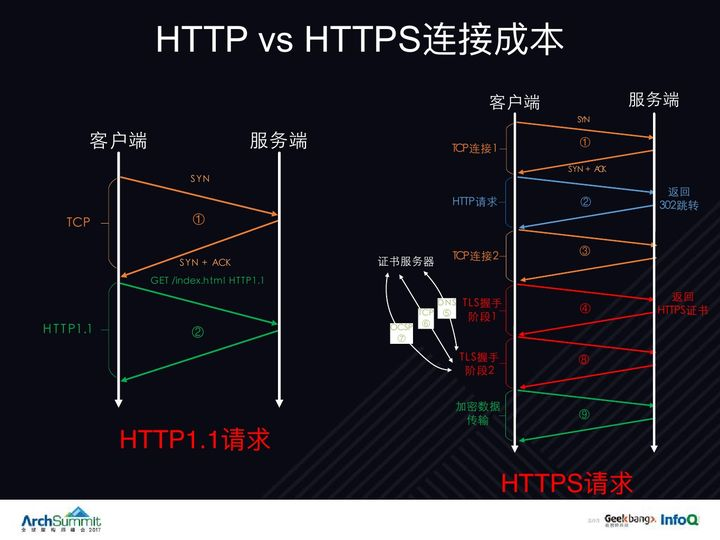
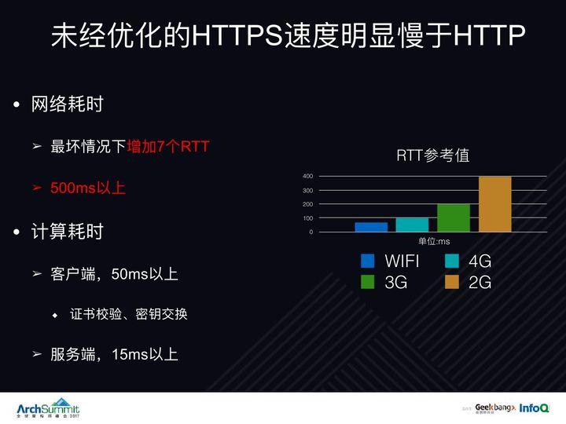
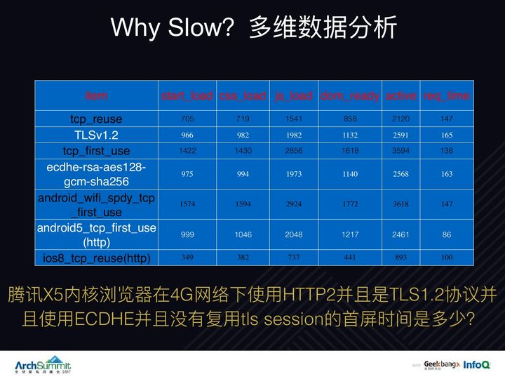
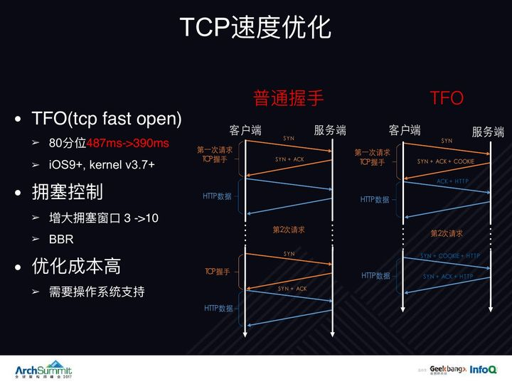
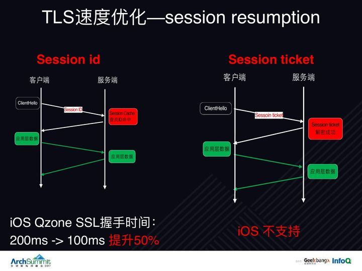
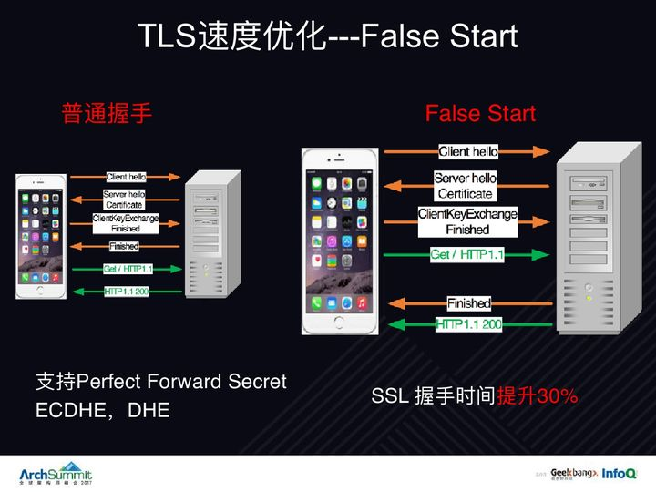
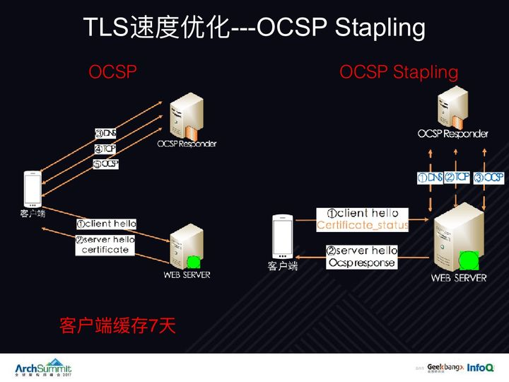
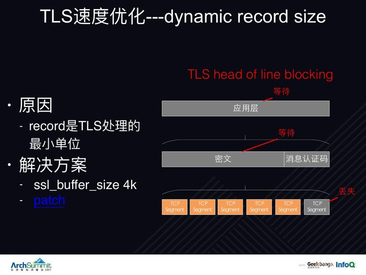
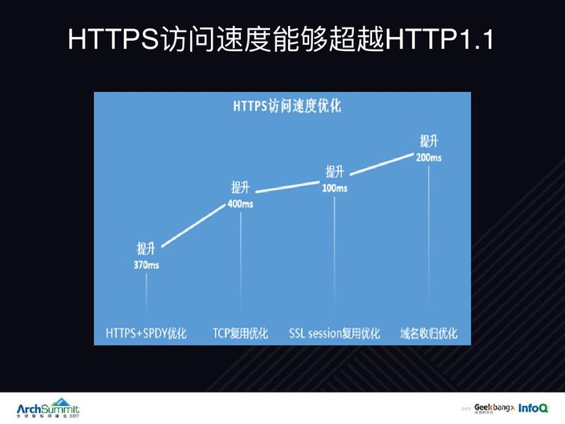
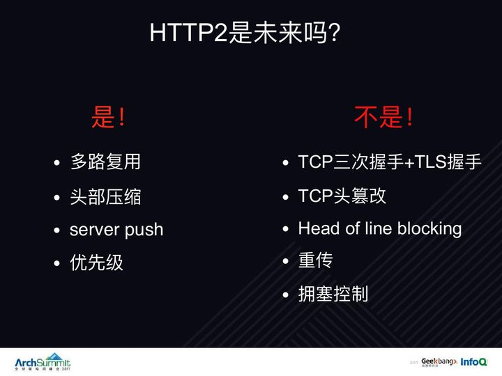

# 手写相关

### [#](https://cchroot.github.io/interview/pages/interview notes/JS 手写相关.html#判断千分位)判断千分位

```js
var a = 222122122.6754;
var b = a.toFixed(2).replace(/(\d)(?=(\d{3})+\.)/g, '$1,');//使用正则替换，每隔三个数加一个','
```


```js
function format(num){  
  num=num+'';//数字转字符串  
  var str="";//字符串累加  
  for(var i=num.length-1,j=1;i>=0;i--,j++){  
      if(j%3==0 && i!=0){//每隔三位加逗号，过滤正好在第一个数字的情况  
          str+=num[i]+",";//加千分位逗号  
          continue;  
      }  
      str+=num[i];//倒着累加数字
  }  
  return str.split('').reverse().join("");//字符串=>数组=>反转=>字符串  
} 
```


### [#](https://cchroot.github.io/interview/pages/interview notes/JS 手写相关.html#洗牌算法-有序数组乱序)洗牌算法（有序数组乱序）

```js
// arr 是一个有序数组
function (arr) {
  for (i = arr.length - 1; i > 0; i--) {  
	//随机数生成器，范围[0, i]  
	int rand = parsetInt(Math.random()*i) + 1;  
		
	let temp = arr[i];  
	arr[i] = arr[rand];  
	arr[rand] = temp;  
  }
}
```


### [#](https://cchroot.github.io/interview/pages/interview notes/JS 手写相关.html#快速排序)快速排序

```js
function quickSortOne(arr, left, right) {
  if (left > right) {
  	return
  }
  let temp = arr[left]
  let i = left, j = right
  while (i !== j) {
  	while (arr[j] >= temp && i < j) { // 顺序很重要，要先从右往左找
      j--
    }
    while (arr[i] <= temp && i < j) { // 再从左往右找
      i++
    }
    if (i < j) { // 说明两者还未相遇，交换位置
      let t = arr[i]
      arr[i] = arr[j]
      arr[j] = t
    }
  }
  arr[left] = arr[i]
  arr[i] = temp
  quickSortOne(arr, left, i-1) // 继续处理左边的
  quickSortOne(arr, i+1, right) // 继续处理右边的
}

// 对arr[l...r]范围内的数组进行插入排序
function insertSort(arr, l, r){
  for (let i = l+1; i <= r; i++) {
      let e = arr[i]
      let j
      for (j = i; j > l && arr[j-1] > e; j--) {
          arr[j] = arr[j-1]
      }
      arr[j] = e
  }
}

// 对arr[l...r]部分进行partition操作
// 返回p,使得arr[l...p-1] < arr[p]; arr[p+1...r] > arr[p]
function __partition(arr, l, r) {

  // 待优化：数据量大，可以取 a[l]到a[r]之间的随机数
  // swap(arr[l],arr[random()%(r-l+1)+l])
  // let tempOne = arr[l]
  // arr[l] = arr[rand()%(r-l+1)+l]
  // arr[rand()%(r-l+1)+l] = tempOne

  let v = arr[l]
  // arr[l+1...j] < v; arr[j+1...i] > v
  let j = l
  for (let i = l + 1; i <= r; i++) {
      if (arr[i] < v) {
          // swap(arr[j+1], arr[i])
          let temp = arr[j+1]
          arr[j+1] = arr[i]
          arr[i] = temp
          j++
      }
  }
  // swap(arr[l],arr[j])
  let tempTwo = arr[l]
  arr[l] = arr[j]
  arr[j] = tempTwo
  return j
}

// 对 arr[l...r]部分进行快速排序
function __quickSort(arr, l, r) {
  if (l >= r) {
      return
  }
  // if (r - l <= 15) { // 优化，当数组范围小于15位采用插入排序
  // 	insertSort(arr, l, r)
  // 	return;
  // }

  let p = __partition(arr, l , r)
  __quickSort(arr, l , p - 1)
  __quickSort(arr, p + 1, r)
}

function quickSort(arr, n) {
  __quickSort(arr, 0, n - 1)
}


// 三路快速排序处理 arr[l...r]
// arr[l...r] 分为 <v ; ==v ; >v 三部分
// 之后递归对 <v ; >v 两部分进行三路快速排序
function __quickSort3Ways(arr, l, r) {
  if (l >= r) {
    	return;
  }
  // if (r - l <= 15) { // 优化，当数组范围小于15位采用插入排序
  //     insertSort(arr, l, r);
  //     return;
  // }

  // partition
  // 优化取 a[l]到a[r]之间的随机数
  // swap(arr[l],arr[random()%(r-l+1)+l]);
  // let tempOne = arr[l];
  // arr[l] = arr[rand()%(r-l+1)+l];
  // arr[rand()%(r-l+1)+l] = tempOne;

  let v = arr[l];

  let lt = l; // arr[l+1...lt] < v
  let gt = r + 1; // arr[gt...r] > v
  let i = l + 1; // arr[lt+1...i) == v
  while(i < gt) {
    if (arr[i] < v) {
        // swap(arr[i], arr[lt + 1]);
        let tempTwo = arr[i];
        arr[i] = arr[lt + 1];
        arr[lt + 1] = tempTwo;
        lt++;
        i++;
    } else if (arr[i] > v) {
        // swap(arr[i], arr[gt - 1]);
        let tempThree = arr[i];
        arr[i] = arr[gt - 1];
        arr[gt - 1] = tempThree;
        gt--;
    } else {
        i++;
    }
  }
  // swap(arr[l],arr[lt]);
  let tempFour = arr[l];
  arr[l] = arr[lt];
  arr[lt] = tempFour;

  __quickSort3Ways(arr, l, lt - 1);
  __quickSort3Ways(arr, gt, r);
}

function quickSort3Ways(arr, n) {
  __quickSort3Ways(arr, 0, n - 1);
}


let testArr = [5,1,6,4,3,8,2,7,10,9]
quickSortOne(testArr, 0, 9)
console.log(testArr)

let arr = [50,30,10,40,60,80,70,100,20,90]
quickSort(arr, 10)  // 快速排序调用
console.log(arr)

let testArr2 = [5,1,6,4,3,8,2,7,10,9,18,15,12,16]
quickSort3Ways(testArr2, 14)
console.log(testArr2)
```


### [#](https://cchroot.github.io/interview/pages/interview notes/JS 手写相关.html#归并排序)归并排序

```js
// 自顶向下的归并排序
function mergeSort(arr, n) {
  __mergeSort(arr, 0, n - 1)
}
// 递归使用归并排序，对arr[l...r]的范围进行排序
function __mergeSort(arr, l, r) {
  if (l >= r) {
  	return
  }
  // if (r - l <= 15) { // 优化，当数组范围小于15位采用插入排序
  //     insertSort(arr, l, r);
  //     return;
  // }
  let mid = l + Math.floor((r - l) / 2) // 防止越界
  __mergeSort(arr, l, mid)
  __mergeSort(arr, mid + 1, r)
  if (arr[mid] > arr[mid + 1]) { // 还未有序则需要归并排序
  	__merge(arr, l, mid, r)
  }
}
// 将arr[l...mid]和arr[mid+1...r]两部分进行归并
function __merge(arr, l, mid, r) {
  // 拷贝一个新数组用于归并操作
  let auxArr = []
  for (let i = l; i <= r; i++) {
    auxArr[i-l] = arr[i]
  }
  // 归并, 利用 auxArr 值进行判断，对原数组 arr 进行赋值操作
  let n = l, m = mid + 1
  for (let k = l; k <= r; k++) {
  	if (n > mid) { // 如果 n 越界
      arr[k] = auxArr[m - l]
      m++
    } else if (m > r) { // 如果 m 越界
      arr[k] = auxArr[n - l]
      n++
    } else if (auxArr[n - l] < auxArr[m - l]) { // 没有越界的情况下判断
      arr[k] = auxArr[n - l]
      n++
    } else {
      arr[k] = auxArr[m - l]
      m++
    }
  }
}
// 对arr[l...r]范围内的数组进行插入排序
function insertSort (arr, l, r){
  for (let i = l+1; i <= r; i++) {
      let e = arr[i]
      let j
      for (j = i; j > l && arr[j-1] > e; j--) {
        arr[j] = arr[j-1]
      }
      arr[j] = e
  }
}

function mergeSortBU (arr, n) { // 自底向上的归并(还未优化)
  for (let sz = 1; sz <= n; sz += sz) { // 第一次看一个元素，第二次看两个元素，第三次看4个元素。。。每次加上自己
    for (let i = 0; i + sz < n; i += sz + sz) { // 对 [0 ~ sz-1] [sz ~ 2sz-1] [2sz ~ 3sz-1]。。。进行归并，i + sz < n 防止越界
      // 对 arr[i...i+sz-1] 和 arr[i+sz+sz-1] 进行归并
      let r = Math.min(i + sz + sz - 1, n - 1) // min取最小值防止越界
      if (arr[i + sz - 1] > arr[i + sz]) { // 还未有序则需要归并排序
	    __merge(arr, i, i + sz - 1, r);
      }
    }
  }
}

let testArr = [5,1,6,4,3,8,2,7,10,9]
mergeSort(testArr, 10);
console.log(testArr)
let testArr2 = [50,10,60,40,30,80,20,70,100,90]
mergeSortBU(testArr2, 10)
console.log(testArr2)
```


### [#](https://cchroot.github.io/interview/pages/interview notes/JS 手写相关.html#数组展平)数组展平

```js
let arr = [[1,2],[[3],4]]

方法一 简单循环递归
function flatten(arr) {
  var result = [];
  for (var i = 0, len = arr.length; i < len; i++) {
    if (Array.isArray(arr[i])) {
      result = result.concat(flatten(arr[i]))
    }
    else {
      result.push(arr[i])
    }
  }
  return result;
}

// 方法二 map 递归
function flatten(arr) {
return [].concat(
　　...arr.map(x =>
　　  Array.isArray(x) ? flatten(x):x
　　)
  )
}
console.log(flatten(arr))// ->[1,2,3,4]

// 方法二 flat api
function flattenDeep(arr, deepLength) {
  return arr.flat(deepLength)
}

// 方法三 利用 reduce
function flattenDeep(arr) {
  return arr.reduct((acc, val) => Array.isArray(val) ? acc.concat(flattenDeep(val)) : acc.concat(val), [])
}
```


### [#](https://cchroot.github.io/interview/pages/interview notes/JS 手写相关.html#对象数组去重)对象数组去重

```js
function flat (array) {
	let stringArray = array.map(item => {
		return JSON.stringify(item)
	})
	return [...new Set(stringArray)].map(item => {
		return JSON.parse(item)
	})
}
```


### [#](https://cchroot.github.io/interview/pages/interview notes/JS 手写相关.html#遍历一颗dom树)遍历一颗DOM树

```js
unction traversal(node) {
  //对node的处理
  if (node && node.nodeType === 1) {
    console.log(node.tagName);
  }
  var i = 0,
    childNodes = node.childNodes,
    item;
  for (; i < childNodes.length; i++) {
    item = childNodes[i];
    if (item.nodeType === 1) {
      //递归先序遍历子节点
      traversal(item);
    }
  }
}
```


### [#](https://cchroot.github.io/interview/pages/interview notes/JS 手写相关.html#使用-reduce-实现数组-map-方法)使用 reduce 实现数组 map 方法

```js
//使用 reduce 实现数组 map 方法
const selfMap2 = function (fn, context){
    let arr = Array.prototype.slice.call(this)
    // 这种实现方法和循环的实现方法有异曲同工之妙，利用reduce contact起数组中每一项
    // 不过这种有个弊端，会跳过稀疏数组中为空的项
    return arr.reduce((pre, cur, index) => {
        return [...pre, fn.call(context, cur, index, this)]
    }, [])
}

Array.prototype.selfMap = selfMap2
var arr1 = [1, 2, 3]
arr1.length = 5

let arrMap = arr1.selfMap(function (x) {
    return x * 2
})
// [2, 4, 6]
```


### [#](https://cchroot.github.io/interview/pages/interview notes/JS 手写相关.html#实现继承)实现继承

```js
// 寄生组合继承
function Parent(value) {
  this.val = value
}
Parent.prototype.getValue = function() {
  console.log(this.val)
}

function Child(value) {
  Parent.call(this, value)
}
Child.prototype = Object.create(Parent.prototype, {
  constructor: {
    value: Child,
    enumerable: false,
    writable: true,
    configurable: true
  }
})

const child = new Child(1)

child.getValue() // 1
child instanceof Parent // true
```


```js
// class 继承
class Parent {
  constructor(value) {
    this.val = value
  }
  getValue() {
    console.log(this.val)
  }
}
class Child extends Parent {
  constructor(value) {
    super(value)
    this.val = value
  }
}
let child = new Child(1)
child.getValue() // 1
child instanceof Parent // true
```


### [#](https://cchroot.github.io/interview/pages/interview notes/JS 手写相关.html#实现一个json-stringify)实现一个JSON.stringify

```js
function jsonStringify(obj) {
  let type = typeof obj;
  if (type !== "object") {
    if (/string|undefined|function/.test(type)) {
      obj = '"' + obj + '"';
    }
    return String(obj);
  } else {
    let json = []
    let arr = Array.isArray(obj)
    for (let k in obj) {
      let v = obj[k];
      let type = typeof v;
      if (/string|undefined|function/.test(type)) {
        v = '"' + v + '"';
      } else if (type === "object") {
        v = jsonStringify(v);
      }
      json.push((arr ? "" : '"' + k + '":') + String(v));
    }
    return (arr ? "[" : "{") + String(json) + (arr ? "]" : "}")
  }
}
jsonStringify({x : 5}) // "{"x":5}"
jsonStringify([1, "false", false]) // "[1,"false",false]"
jsonStringify({b: undefined}) // "{"b":"undefined"}"
```


### [#](https://cchroot.github.io/interview/pages/interview notes/JS 手写相关.html#实现json-parse)实现JSON.parse

```js
var json = '{"name":"cxk", "age":25}';
var obj = eval("(" + json + ")");
```


### [#](https://cchroot.github.io/interview/pages/interview notes/JS 手写相关.html#解析-url-params-为对象)解析 URL Params 为对象

```js
function parseParam(url) {
  const paramsStr = /.+\?(.+)$/.exec(url)[1]; // 将 ? 后面的字符串取出来
  const paramsArr = paramsStr.split('&'); // 将字符串以 & 分割后存到数组中
  let paramsObj = {};
  // 将 params 存到对象中
  paramsArr.forEach(param => {
    if (/=/.test(param)) { // 处理有 value 的参数
      let [key, val] = param.split('='); // 分割 key 和 value
      val = decodeURIComponent(val); // 解码
      val = /^\d+$/.test(val) ? parseFloat(val) : val; // 判断是否转为数字

      if (paramsObj.hasOwnProperty(key)) { // 如果对象有 key，则添加一个值
        paramsObj[key] = [].concat(paramsObj[key], val);
      } else { // 如果对象没有这个 key，创建 key 并设置值
        paramsObj[key] = val;
      }
    } else { // 处理没有 value 的参数
      paramsObj[param] = true;
    }
  })

  return paramsObj;
}

let url = 'http://www.domain.com/?user=anonymous&id=123&id=456&city=%E5%8C%97%E4%BA%AC&enabled';
parseParam(url)
/* 结果
{ user: 'anonymous',
  id: [ 123, 456 ], // 重复出现的 key 要组装成数组，能被转成数字的就转成数字类型
  city: '北京', // 中文需解码
  enabled: true, // 未指定值得 key 约定为 true
}
*/
```


### [#](https://cchroot.github.io/interview/pages/interview notes/JS 手写相关.html#模板引擎实现)模板引擎实现

```js
function render(template, data) {
  const reg = /\{\{(\w+)\}\}/; // 模板字符串正则
  if (reg.test(template)) { // 判断模板里是否有模板字符串
    const name = reg.exec(template)[1]; // 查找当前模板里第一个模板字符串的字段
    template = template.replace(reg, data[name]); // 将第一个模板字符串渲染
    return render(template, data); // 递归的渲染并返回渲染后的结构
  }
  return template; // 如果模板没有模板字符串直接返回
}

let template = '我是{{name}}，年龄{{age}}，性别{{sex}}';
let data = {
  name: '姓名',
  age: 18
}
render(template, data); // 我是姓名，年龄18，性别undefined
```


### [#](https://cchroot.github.io/interview/pages/interview notes/JS 手写相关.html#动手实现一个-repeat-方法)动手实现一个 repeat 方法

```js
function repeat(func, times, wait) {
  times--
  console.log(times)
  let that = this
  let timer = setTimeout(_ => {
  	func.apply(that)
  	clearTimeout(timer)
  	if (times > 0) {
  		repeat(func, times, wait)
  	}
  }, wait)
}
// 调用这个 repeatFunc ("hellworld")，会 alert 4 次 helloworld, 每次间隔3秒
const repeatFunc = repeat(alert, 4, 3000);
```


### [#](https://cchroot.github.io/interview/pages/interview notes/JS 手写相关.html#函数柯里化)函数柯里化

```js
通用方法：
function curry(fn, ...args) {
    var length = fn.length;
    var args = args || [];
    return function(){
        newArgs = args.concat(Array.prototype.slice.call(arguments));
        if (newArgs.length < length) {
            return curry.call(this,fn,...newArgs);
        }else{
            return fn.apply(this,newArgs);
        }
    }
}

function multiFn(a, b, c) {
    return a * b * c;
}

var multi = curry(multiFn);

multi(2)(3)(4);
multi(2,3,4);
multi(2)(3,4);
multi(2,3)(4);
```


```js
// es6
const curry = (fn, ...args) => {
  args.length < fn.length
    // 参数长度不足时，重新柯里化该函数，等待接收新参数
	? (...arguments) => curry(fn, ...args, ...arguments)
	// 参数长度满足时，执行函数
	: fn(...args)
}
let curryTest=curry((a,b,c,d)=>a+b+c+d)
curryTest(1,2,3)(4) //返回10
curryTest(1,2)(4)(3) //返回10
curryTest(1,2)(3,4) //返回10
```


### [#](https://cchroot.github.io/interview/pages/interview notes/JS 手写相关.html#实现一个jsonp)实现一个JSONP

```js
function jsonp(url, jsonpCallback, success) {
  let script = document.createElement('script')
  script.src = url
  script.async = true
  script.type = 'text/javascript'
  window[jsonpCallback] = function(data) {
    success && success(data)
  }
  document.body.appendChild(script)
}
jsonp('http://xxx', 'callback', function(value) {
  console.log(value)
})
```


### [#](https://cchroot.github.io/interview/pages/interview notes/JS 手写相关.html#实现防抖函数-debounce)实现防抖函数（debounce）

什么是防抖：一个事件在触发后，设置定时器，若n秒内该事件没有再次发生，那么执行这个函数，如果n秒内该事件再次发生了，那么定时器重新开始计时。

应用

- 每次 resize / scroll 触发统计事件
- 文本输入的验证 （连续输入文字后发送AJAX请求进行验证，验证一次就好）

```js
// 防抖函数，非立即执行
const debounce = (fn, delay) => {
  let timer = null;
  return (...args) => {
    if(timer) {
	  clearTimeout(timer);
	  timer = null
	}
    timer = setTimeout(() => {
      fn.apply(this, args);
    }, delay);
  };
};
```


```js
//防抖(立即执行)
function debounce(fn, delay = 500) {
  let timer = null;
  let flag = true
  return function (...args) {
    if (timer) {
      clearTimeout(timer);
      timer = null
    }
    if (flag === true) {
      fn.apply(this, args);
      flag = false
    }
    timer = setTimeout(() => {
      flag = true
      timer = null
    }, delay)
  }
}
```


```js
/**
 * 防抖函数
 * 
 * - 立即执行
 * - 非立即执行
 * @param {*} fn 
 * @param {*} delay 
 * @param {*} isImmediate 
 */
function debounce(fn, delay = 500, isImmediate = true) {
  let timer = null;
  let flag = true
  if (isImmediate === true) {
    return function (...args) {
      if (timer) {
        clearTimeout(timer);
        timer = null
      }
      if (flag === true) {
        fn.apply(this, args);
        flag = false
      }
      timer = setTimeout(() => {
        flag = true
        timer = null
      }, delay)
    }
  } else {
    return function (...args) {
      if (timer) {
        clearTimeout(timer);
        timer = null
      }
      timer = setTimeout(() => {
        fn.apply(this, args);
        timer = null;
      }, delay)
    }
  }
}
```


### [#](https://cchroot.github.io/interview/pages/interview notes/JS 手写相关.html#实现节流函数-throttle)实现节流函数（throttle）

什么是节流：一个事件在n秒内被多次触发，但绑定的函数在期间只会执行一次（也就是降低函数的执行频率）

应用

- 与mousemove keyup/keydown 等相密切联系的函数

```js
// 节流函数(非立即执行)
const throttle = (fn, delay = 500) => {
  let flag = true;
  return (...args) => {
    if (flag) {
      flag = false;
      setTimeout(() => {
        fn.apply(this, args);
        flag = true;
      }, delay);
	}
  };
};
```


```js
//节流(立即执行)
function throttle_2(fn,delay = 500){
  var flag = true;
  var timer = null;
  return function(...args){
    if(flag) {
      fn.apply(this,args);
      flag = false;
      timer = setTimeout(() => {
        flag = true
      },delay)
    }
  }
}
```


```js
//节流(合并)
function throttle_merge(fn,delay = 500,isImmediate = false){
  var flag = true;
  var timer = null;
  if(isImmediate){
    return function(...args){
      if(flag) {
        fn.apply(this,args);
        flag = false;
        timer = setTimeout(() => {
          flag = true
        },delay)
      }
    }
  } else {
	return function(...args){
      if(flag == true){
        flag = false
          timer = setTimeout(() => {
          fn.apply(this,args)
          flag = true
        },delay)
      }
    }
  }
}
```


### [#](https://cchroot.github.io/interview/pages/interview notes/JS 手写相关.html#实现event-event-bus)实现Event(event bus)

event bus既是node中各个模块的基石，又是前端组件通信的依赖手段之一，同时涉及了订阅-发布设计模式，是非常重要的基础

简单版：

```js
class EventEmeitter {
  constructor() {
    this._events = this._events || new Map(); // 储存事件/回调键值对
    this._maxListeners = this._maxListeners || 10; // 设立监听上限
  }
}


// 触发名为type的事件
EventEmeitter.prototype.emit = function(type, ...args) {
  let handler;
  // 从储存事件键值对的this._events中获取对应事件回调函数
  handler = this._events.get(type);
  if (args.length > 0) {
    handler.apply(this, args);
  } else {
    handler.call(this);
  }
  return true;
};

// 监听名为type的事件
EventEmeitter.prototype.addListener = function(type, fn) {
  // 将type事件以及对应的fn函数放入this._events中储存
  if (!this._events.get(type)) {
    this._events.set(type, fn);
  }
};
```


面试版：

```js
class EventEmeitter {
  constructor() {
    this._events = this._events || new Map(); // 储存事件/回调键值对
    this._maxListeners = this._maxListeners || 10; // 设立监听上限
  }
}

// 触发名为type的事件
EventEmeitter.prototype.emit = function(type, ...args) {
  let handler;
  // 从储存事件键值对的this._events中获取对应事件回调函数
  handler = this._events.get(type);
  if (args.length > 0) {
    handler.apply(this, args);
  } else {
    handler.call(this);
  }
  return true;
};

// 监听名为type的事件
EventEmeitter.prototype.addListener = function(type, fn) {
  // 将type事件以及对应的fn函数放入this._events中储存
  if (!this._events.get(type)) {
    this._events.set(type, fn);
  }
};

// 触发名为type的事件
EventEmeitter.prototype.emit = function(type, ...args) {
  let handler;
  handler = this._events.get(type);
  if (Array.isArray(handler)) {
    // 如果是一个数组说明有多个监听者,需要依次此触发里面的函数
    for (let i = 0; i < handler.length; i++) {
      if (args.length > 0) {
        handler[i].apply(this, args);
      } else {
        handler[i].call(this);
      }
    }
  } else {
    // 单个函数的情况我们直接触发即可
    if (args.length > 0) {
      handler.apply(this, args);
    } else {
      handler.call(this);
    }
  }

  return true;
};

// 监听名为type的事件
EventEmeitter.prototype.addListener = function(type, fn) {
  const handler = this._events.get(type); // 获取对应事件名称的函数清单
  if (!handler) {
    this._events.set(type, fn);
  } else if (handler && typeof handler === "function") {
    // 如果handler是函数说明只有一个监听者
    this._events.set(type, [handler, fn]); // 多个监听者我们需要用数组储存
  } else {
    handler.push(fn); // 已经有多个监听者,那么直接往数组里push函数即可
  }
};

EventEmeitter.prototype.removeListener = function(type, fn) {
  const handler = this._events.get(type); // 获取对应事件名称的函数清单

  // 如果是函数,说明只被监听了一次
  if (handler && typeof handler === "function") {
    this._events.delete(type, fn);
  } else {
    let postion;
    // 如果handler是数组,说明被监听多次要找到对应的函数
    for (let i = 0; i < handler.length; i++) {
      if (handler[i] === fn) {
        postion = i;
      } else {
        postion = -1;
      }
    }
    // 如果找到匹配的函数,从数组中清除
    if (postion !== -1) {
      // 找到数组对应的位置,直接清除此回调
      handler.splice(postion, 1);
      // 如果清除后只有一个函数,那么取消数组,以函数形式保存
      if (handler.length === 1) {
        this._events.set(type, handler[0]);
      }
    } else {
      return this;
    }
  }
};
```


### [#](https://cchroot.github.io/interview/pages/interview notes/JS 手写相关.html#实现简单的-eventemiter-包含事件绑定-事件触发以及移除)实现简单的 EventEmiter，包含事件绑定，事件触发以及移除

```js
class EventEmiter {
    constructor() {
        this.events = {}
    }
    emit(event, ...args) {
        this.events[event].forEach(fn => {
            fn.apply(this, args)
        })
    }
    on(event, fn) {
        if (this.events[event]) {
            this.events[event].push(fn)
        } else {
            this.events[event] = [fn]
        }
    }
    remove(event) {
        delete this.events[event]
    }
	once (event, fn) {
        this.on(event, (...args) => {
            fn(...args);
            this.off(event)
        })
    }
}

const eventHub = new EventEmiter()

eventHub.on('test', data => {
    console.log(data)
})

eventHub.emit('test', 1)
console.log(2)
```


### [#](https://cchroot.github.io/interview/pages/interview notes/JS 手写相关.html#settimeout实现interval-注意和普通的要无差别体验)settimeout实现interval(注意和普通的要无差别体验)

```js
;(() => {
  const list = new Set();
  function myInterval(fn, ms) {
    const ref = {};
    const exec = () => {
      return setTimeout(() => {
        fn.apply(null);
        const timer = exec();
        ref.current = timer;
      }, ms);
    };
    ref.current = exec();
    list.add(ref);
    return ref;
  }

  function myClearInterval(ref) {
    clearTimeout(ref.current);
    list.delete(ref);
  }
  window.myInterval = myInterval;
  window.myClearInterval = myClearInterval;
})()
```


### [#](https://cchroot.github.io/interview/pages/interview notes/JS 手写相关.html#一堆数字字符串组成最大数是多少-50-2-5-9-95502-字典序-贪心)一堆数字字符串组成最大数是多少[50, 2, 5, 9] => 95502 (字典序+贪心)

```js
function getMaxNumber(arr) {
  return arr.sort().reduce((acc = '', cur) => Math.max(+`${acc}${cur}`, +`${cur}${acc}`));
}
```


### [#](https://cchroot.github.io/interview/pages/interview notes/JS 手写相关.html#深拷贝)深拷贝

简单版：

```js
function deepClone(obj){
    //判断是否是简单数据类型，
    if(typeof obj == "object"){
        //复杂数据类型
        var result = obj.constructor == Array ? [] : {};
        for(let i in obj){
            result[i] = typeof obj[i] == "object" ? deepCopy(obj[i]) : obj[i];
        }
    }else {
        //简单数据类型 直接 == 赋值
        var result = obj;
    }
    return result;
}
let obj = {
  a: [1, 2, 3],
  b: {
    c: 2,
    d: 3
  }
}
let newObj = deepClone(obj)
newObj.b.c = 1
console.log(obj.b.c) // 2
```


面试版：

实现一个 deepClone 函数:

- 如果是基本数据类型，直接返回
- 如果是 RegExp 或者 Date 类型，返回对应类型
- 如果是复杂数据类型，递归。
- 考虑循环引用的问题

```js
// 递归拷贝
function deepClone(obj, hash = new WeakMap()) {
  if (obj instanceof RegExp) return new RegExp(obj)
  if (obj instanceof Date) return new Date(obj)
  if (obj === null || typeof obj !== 'object') {
	// 如果不是复杂数据类型，直接返回	
    return obj
  }
  if(hash.has(obj)) {
	// 如果已经处理过相同的对象，直接获取（解决循环引用）
	return hash.get(obj)
  }
  /**
   * 如果 obj 是数组，那么 obj.constructor 是 [Function: Array]
   * 如果 obj 是对象，那么 obj.constructor 是 [Function: Object]
   */
  let t = new obj.constructor()
  hash.set(obj, t)
  for (let ikey in obj) {
	// 递归
	if (obj.hasOwnProperty(key)) { // 是否是自身的属性
	  t[key] = deepClone(obj[key], hash)
	}  
  }
}
```


深入版：

```js
/**
 * deep clone
 * @param  {[type]} parent object 需要进行克隆的对象
 * @return {[type]}        深克隆后的对象
 */
const clone = parent => {
  // 判断类型
  const isType = (obj, type) => {
    if (typeof obj !== "object") return false;
    const typeString = Object.prototype.toString.call(obj);
    let flag;
    switch (type) {
      case "Array":
        flag = typeString === "[object Array]";
        break;
      case "Date":
        flag = typeString === "[object Date]";
        break;
      case "RegExp":
        flag = typeString === "[object RegExp]";
        break;
      default:
        flag = false;
    }
    return flag;
  };

  // 处理正则
  const getRegExp = re => {
    var flags = "";
    if (re.global) flags += "g";
    if (re.ignoreCase) flags += "i";
    if (re.multiline) flags += "m";
    return flags;
  };
  // 维护两个储存循环引用的数组
  const parents = [];
  const children = [];

  const _clone = parent => {
    if (parent === null) return null;
    if (typeof parent !== "object") return parent;

    let child, proto;

    if (isType(parent, "Array")) {
      // 对数组做特殊处理
      child = [];
    } else if (isType(parent, "RegExp")) {
      // 对正则对象做特殊处理
      child = new RegExp(parent.source, getRegExp(parent));
      if (parent.lastIndex) child.lastIndex = parent.lastIndex;
    } else if (isType(parent, "Date")) {
      // 对Date对象做特殊处理
      child = new Date(parent.getTime());
    } else {
      // 处理对象原型
      proto = Object.getPrototypeOf(parent);
      // 利用Object.create切断原型链
      child = Object.create(proto);
    }

    // 处理循环引用
    const index = parents.indexOf(parent);

    if (index != -1) {
      // 如果父数组存在本对象,说明之前已经被引用过,直接返回此对象
      return children[index];
    }
    parents.push(parent);
    children.push(child);

    for (let i in parent) {
      // 递归
      child[i] = _clone(parent[i]);
    }

    return child;
  };
  return _clone(parent);
};
```


### [#](https://cchroot.github.io/interview/pages/interview notes/JS 手写相关.html#深比较)深比较

```js
function deepCompare(a, b){
  if(a === null
    || typeof a !== 'object'
    || b === null
    || typeof b !== 'object'){
    return a === b
  }

  const propsA = Object.getOwnPropertyDescriptors(a)
  const propsB = Object.getOwnPropertyDescriptors(b)
  if(Object.keys(propsA).length !== Object.keys(propsB).length){
    return false
  }

  return Object.keys(propsA).every( key => deepCompare(a[key], b[key]))

}
```


### [#](https://cchroot.github.io/interview/pages/interview notes/JS 手写相关.html#手写-new)手写 new

```js
function create () {
  // 1. 获取构造函数，并且删除 arguments 中的第一项
  var Con = [].shift.call(arguments);
  // 2. 创建一个空的对象并链接到构造函数的原型，使它能访问原型中的属性
  var obj = Object.create(Con.prototype);
  // 3. 使用apply改变构造函数中this的指向实现继承，使obj能访问到构造函数中的属性
  var ret = Con.apply(obj, arguments);
  // 4. 优先返回构造函数返回的对象
  return ret instanceof Object ? ret : obj;
}
```


```js
function Dog(name){
    this.name = name
}
Dog.prototype.sayName = function(){
    console.log(this.name)
}
// 上面是本身Dog
function _new(fn,...args){   // ...args为ES6展开符,也可以使用arguments
    //先用Object创建一个空的对象,
    const obj = Object.create(fn.prototype)  //fn.prototype代表 用当前对象的原型去创建
    //现在obj就代表Dog了,但是参数和this指向没有修改
    const rel = fn.apply(obj,args)
    //正常规定,如何fn返回的是null或undefined(也就是不返回内容),我们返回的是obj,否则返回rel
    return rel instanceof Object ? rel : obj
}
var _newDog = _new(Dog,'这是用_new出来的小狗')
_newDog.sayName()
```


### [#](https://cchroot.github.io/interview/pages/interview notes/JS 手写相关.html#call)call

ES3:

```js
function fnFactory(context) {
  var unique_fn = "fn";
  while (context.hasOwnProperty(unique_fn)) {
    unique_fn = "fn" + Math.random();
  }
  return unique_fn;
}
Function.prototype.call2 = function(context) {
  // 1. 若是传入的context是null或者undefined时指向window;
  // 2. 若是传入的是原始数据类型, 原生的call会调用 Object() 转换
  context = (context !== null && context !== undefined) ? Object(context) : window;
  // 3. 创建一个独一无二的fn函数的命名
  var fn = fnFactory(context);
  // 4. 这里的this就是指调用call的那个函数
  // 5. 将调用的这个函数赋值到context中, 这样之后执行context.fn的时候, fn里的this就是指向context了
  context[fn] = this;
  // 6. 定义一个数组用于放arguments的每一项的字符串: ['agruments[1]', 'arguments[2]']
  var args = [];
  // 7. 要从第1项开始, 第0项是context
  for (var i = 1, l = arguments.length; i < l; i++) {
    args.push("arguments[" + i + "]");
  }
  // 8. 使用eval()来执行fn并将args一个个传递进去
  var result = eval("context[fn](" + args + ")");
  // 9. 给context额外附件了一个属性fn, 所以用完之后需要删除
  delete context[fn];
  // 10. 函数fn可能会有返回值, 需要将其返回
  return result;
};
```


ES6:

```js
Function.prototype.myCall = function(context) {
  if (typeof this !== 'function') {
    throw new TypeError('Error')
  }
  context = context || window
  context.fn = this
  const args = [...arguments].slice(1)
  const result = context.fn(...args)
  delete context.fn
  return result
}
```


### [#](https://cchroot.github.io/interview/pages/interview notes/JS 手写相关.html#apply)apply

ES3:

```js
function fnFactory(context) {
  var unique_fn = "fn";
  while (context.hasOwnProperty(unique_fn)) {
    unique_fn = "fn" + Math.random();
  }
  return unique_fn;
}
Function.prototype.apply2 = function(context, arr) {
  // 1. 若是传入的context是null或者undefined时指向window;
  // 2. 若是传入的是原始数据类型, 原生的call会调用 Object() 转换
  context = context ? Object(context) : window;
  // 3. 创建一个独一无二的fn函数的命名
  var fn = fnFactory(context);
  // 4. 这里的this就是指调用call的那个函数
  // 5. 将调用的这个函数赋值到context中, 这样之后执行context.fn的时候, fn里的this就是指向context了
  context[fn] = this;

  var result;
  // 6. 判断有没有第二个参数
  if (!arr) {
    result = context[fn]();
  } else {
    // 7. 有的话则用args放每一项的字符串: ['arr[0]', 'arr[1]']
    var args = [];
    for (var i = 0, len = arr.length; i < len; i++) {
      args.push("arr[" + i + "]");
    }
    // 8. 使用eval()来执行fn并将args一个个传递进去
    result = eval("context[fn](" + args + ")");
  }
  // 9. 给context额外附件了一个属性fn, 所以用完之后需要删除
  delete context[fn];
  // 10. 函数fn可能会有返回值, 需要将其返回
  return result;
};
```


ES6:

```js
Function.prototype.myApply = function(context) {
  if (typeof this !== 'function') {
    throw new TypeError('Error')
  }
  context = context || window
  context.fn = this
  let result
  // 处理参数和 call 有区别
  if (arguments[1]) {
    result = context.fn(...arguments[1])
  } else {
    result = context.fn()
  }
  delete context.fn
  return result
}
```


### [#](https://cchroot.github.io/interview/pages/interview notes/JS 手写相关.html#bind)bind

函数内的this表示的就是调用的函数 可以将上下文传递进去, 并修改this的指向 返回一个函数 可以传入参数 柯里化 一个绑定的函数也能使用new操作法创建对象, 且提供的this会被忽略

```js
Function.prototype.bind2 = function(context) {
 if (typeof this !== 'function') {
    throw new TypeError('Error')
  }
  const _this = this
  const args = [...arguments].slice(1)
  // 返回一个函数
  return function F() {
    // 因为返回了一个函数，我们可以 new F()，所以需要判断
    if (this instanceof F) {
      return new _this(...args, ...arguments)
    }
    return _this.apply(context, args.concat(...arguments))
  }
};
```


### [#](https://cchroot.github.io/interview/pages/interview notes/JS 手写相关.html#实现instanceof)实现instanceOf

```js
function myInstanceof(left, right) {
  let prototype = right.prototype
  left = left.__proto__
  while (true) {
    if (left === null || left === undefined)
      return false
    if (prototype === left)
      return true
    left = left.__proto__
  }
}
```


### [#](https://cchroot.github.io/interview/pages/interview notes/JS 手写相关.html#模拟object-create)模拟Object.create

```js
// Object.create()方法创建一个新对象，使用现有的对象来提供新创建的对象的__proto__。
function create(proto) {
  function F() {}
  F.prototype = proto;

  return new F();
}
```


### [#](https://cchroot.github.io/interview/pages/interview notes/JS 手写相关.html#实现简单的-promise)实现简单的 promise

```js
const PENDING = 'pending'
const RESOLVED = 'resolved'
const REJECTED = 'rejected'

function MyPromise(fn) {
  const that = this
  that.state = PENDING
  that.value = null
  that.resolvedCallbacks = []
  that.rejectedCallbacks = []
  
  function resolve(value) {
    if (that.state === PENDING) {
      that.state = RESOLVED
      that.value = value
      that.resolvedCallbacks.map(cb => cb(that.value))
    }
  }

  function reject(value) {
    if (that.state === PENDING) {
      that.state = REJECTED
      that.value = value
      that.rejectedCallbacks.map(cb => cb(that.value))
    }
  }

  try {
    fn(resolve, reject)
  } catch (e) {
    reject(e)
  }
}

MyPromise.prototype.then = function(onFulfilled, onRejected) {
  const that = this
  onFulfilled = typeof onFulfilled === 'function' ? onFulfilled : v => v
  onRejected =
    typeof onRejected === 'function'
      ? onRejected
      : r => {
          throw r
        }
  if (that.state === PENDING) {
    that.resolvedCallbacks.push(onFulfilled)
    that.rejectedCallbacks.push(onRejected)
  }
  if (that.state === RESOLVED) {
    onFulfilled(that.value)
  }
  if (that.state === REJECTED) {
    onRejected(that.value)
  }
}
```


复合 Promise + 规范:

```js
const PENDING = "pending";
const FULFILLED = "fulfilled";
const REJECTED = "rejected";

function Promise(excutor) {
    let that = this; // 缓存当前promise实例对象
    that.status = PENDING; // 初始状态
    that.value = undefined; // fulfilled状态时 返回的信息
    that.reason = undefined; // rejected状态时 拒绝的原因
    that.onFulfilledCallbacks = []; // 存储fulfilled状态对应的onFulfilled函数
    that.onRejectedCallbacks = []; // 存储rejected状态对应的onRejected函数

    function resolve(value) { // value成功态时接收的终值
        if(value instanceof Promise) {
            return value.then(resolve, reject);
        }
        // 实践中要确保 onFulfilled 和 onRejected 方法异步执行，且应该在 then 方法被调用的那一轮事件循环之后的新执行栈中执行。
        setTimeout(() => {
            // 调用resolve 回调对应onFulfilled函数
            if (that.status === PENDING) {
                // 只能由pending状态 => fulfilled状态 (避免调用多次resolve reject)
                that.status = FULFILLED;
                that.value = value;
                that.onFulfilledCallbacks.forEach(cb => cb(that.value));
            }
        });
    }
    function reject(reason) { // reason失败态时接收的拒因
        setTimeout(() => {
            // 调用reject 回调对应onRejected函数
            if (that.status === PENDING) {
                // 只能由pending状态 => rejected状态 (避免调用多次resolve reject)
                that.status = REJECTED;
                that.reason = reason;
                that.onRejectedCallbacks.forEach(cb => cb(that.reason));
            }
        });
    }

    // 捕获在excutor执行器中抛出的异常
    // new Promise((resolve, reject) => {
    //     throw new Error('error in excutor')
    // })
    try {
        excutor(resolve, reject);
    } catch (e) {
        reject(e);
    }
}

Promise.prototype.then = function(onFulfilled, onRejected) {
    const that = this;
    let newPromise;
    // 处理参数默认值 保证参数后续能够继续执行
    onFulfilled =
        typeof onFulfilled === "function" ? onFulfilled : value => value;
    onRejected =
        typeof onRejected === "function" ? onRejected : reason => {
            throw reason;
        };
    if (that.status === FULFILLED) { // 成功态
        return newPromise = new Promise((resolve, reject) => {
            setTimeout(() => {
                try{
                    let x = onFulfilled(that.value);
                    resolvePromise(newPromise, x, resolve, reject); // 新的promise resolve 上一个onFulfilled的返回值
                } catch(e) {
                    reject(e); // 捕获前面onFulfilled中抛出的异常 then(onFulfilled, onRejected);
                }
            });
        })
    }

    if (that.status === REJECTED) { // 失败态
        return newPromise = new Promise((resolve, reject) => {
            setTimeout(() => {
                try {
                    let x = onRejected(that.reason);
                    resolvePromise(newPromise, x, resolve, reject);
                } catch(e) {
                    reject(e);
                }
            });
        });
    }

    if (that.status === PENDING) { // 等待态
        // 当异步调用resolve/rejected时 将onFulfilled/onRejected收集暂存到集合中
        return newPromise = new Promise((resolve, reject) => {
            that.onFulfilledCallbacks.push((value) => {
                try {
                    let x = onFulfilled(value);
                    resolvePromise(newPromise, x, resolve, reject);
                } catch(e) {
                    reject(e);
                }
            });
            that.onRejectedCallbacks.push((reason) => {
                try {
                    let x = onRejected(reason);
                    resolvePromise(newPromise, x, resolve, reject);
                } catch(e) {
                    reject(e);
                }
            });
        });
    }
};
```


### [#](https://cchroot.github.io/interview/pages/interview notes/JS 手写相关.html#手动实现一下相关-api)手动实现一下相关 API

### [#](https://cchroot.github.io/interview/pages/interview notes/JS 手写相关.html#实现maxrequest-成功后resolve结果-失败后重试-尝试超过一定次数才真正的reject)实现maxRequest，成功后resolve结果，失败后重试，尝试超过一定次数才真正的reject

```js
function maxRequest(fn, maxNum) {
    return new Promise((resolve, reject) => {
        if (maxNum === 0) {
            reject('max request number')
            return
        }
        Promise.resolve(fn()).then(value => {
            resolve(value)
        }).catch(() => {
            return maxRequest(fn, maxNum - 1)
        })
    })
}
```


### [#](https://cchroot.github.io/interview/pages/interview notes/JS 手写相关.html#对象扁平化【编程】)对象扁平化【编程】

```js
function flattenObj(data) {
    var result = {};
    function recurse(cur, prop) {
        if (Object(cur) !== cur) {
            result[prop] = cur;
        } else if (Array.isArray(cur)) {
            for (var i = 0, l = cur.length; i < l; i++)
                recurse(cur[i], prop + "[" + i + "]");
            if (l == 0)
                result[prop] = [];
        } else {
            var isEmpty = true;
            for (var p in cur) {
                isEmpty = false;
                recurse(cur[p], prop ? prop + "." + p : p);
            }
            if (isEmpty && prop)
                result[prop] = {};
        }
    }
    recurse(data, "");
    return result;
};
```


### [#](https://cchroot.github.io/interview/pages/interview notes/JS 手写相关.html#实现一个lazyman-可以按照以下方式调用)实现一个LazyMan，可以按照以下方式调用:

```js
LazyMan(“Hank”)输出:
Hi! This is Hank!
 
LazyMan(“Hank”).sleep(10).eat(“dinner”)输出
Hi! This is Hank!
//等待10秒..
Wake up after 10
Eat dinner~
 
LazyMan(“Hank”).eat(“dinner”).eat(“supper”)输出
Hi This is Hank!
Eat dinner~
Eat supper~
 
LazyMan(“Hank”).sleepFirst(5).eat(“supper”)输出
//等待5秒
Wake up after 5
Hi This is Hank!
Eat supper
```


```js
class _LazyMan {
  constructor(name) {
    this.tasks = [];
    const task = () => {
      console.log(`Hi! This is ${name}`);
      this.next();
    }
    this.tasks.push(task);
    setTimeout(() => {               // 把 this.next() 放到调用栈清空之后执行
      this.next();
    }, 0);
  }
 
  next() {
    const task = this.tasks.shift(); // 取第一个任务执行
    task && task();
  }
 
  sleep(time) {
    this._sleepWrapper(time, false);
    return this;                     // 链式调用
  }
 
  sleepFirst(time) {
    this._sleepWrapper(time, true);
    return this;
  }
 
  _sleepWrapper(time, first) {
    const task = () => {
      setTimeout(() => {
        console.log(`Wake up after ${time}`);
        this.next();
      }, time * 1000)
    }
    if (first) {
      this.tasks.unshift(task);     // 放到任务队列顶部
    } else {
      this.tasks.push(task);        // 放到任务队列尾部
    }
  }
 
  eat(name) {
    const task = () => {
      console.log(`Eat ${name}`);
      this.next();
    }
    this.tasks.push(task);
    return this;
  }
}
 
function LazyMan(name) {
  return new _LazyMan(name);
}
```


# 网络协议相关优化

路漫漫其修远兮，以下内容让我感觉打开了性能优化新世界的大门。

## [#](https://cchroot.github.io/interview/pages/interview notes/网络协议相关优化.html#dns-优化)DNS 优化

简单针对 DNS 的优化就是：减少 DNS 解析的时间，由于浏览器缓存机制的存在，我们只需要对首次访问进行优化（虽然我们现在只是请求了一个html文件，但是html文件里还会有我们后续要请求的 css/js/img 等），即适当减少要解析的域名个数，考虑到其他优化机制可以将页面及页面内资源发布到 2-4 个域名上。

DNS优化核心需要解决的问题有两点：

1. 由于DNS劫持或故障造成的服务不可用，进而影响用户体验，影响公司的收入；
2. 由于DNS调度不准确导致的性能退化，进而影响用户体验。

有关移动端DNS劫持等各种疑难杂症，详见文章：[全面了解移动端DNS域名劫持等杂症：原理、根源、HttpDNS解决方案等(opens new window)](http://www.52im.net/thread-2121-1-1.html)

既然我们面临这么严峻的问题，那么我们如何优化DNS呢？答案就是HTTPDNS。

大部分标准DNS都是基于UDP与DNS服务器交互的，HTTPDNS则是利用HTTP协议与DNS服务器交互，绕开了运营商的Local DNS服务，有效防止了域名劫持，提高域名解析效率，下面是相关文章：

[百度APP移动端网络深度优化实践分享(一)：DNS优化篇(opens new window)](http://www.52im.net/thread-2472-1-1.html)

## [#](https://cchroot.github.io/interview/pages/interview notes/网络协议相关优化.html#http1-1-的性能问题)HTTP1.1 的性能问题

接触 Web 开发的同学都知道，HTTP1.1 最大的性能问题就是单链路串行。当一个 TCP 链接上如果有多个请求。如上图所示。请求只能一个接着一个发送，这是它最大的问题。

第二个问题是头部未压缩。头部，尤其当 HTTP 请求 Cookie、Host，其浏览器型号都一样，如果每次请求携带相同的信息，这显然是重复的。这是冗余，浪费带宽，并且从性能问题上会影响用户的访问速度。为什么呢？因为运营商的网络上下行带宽严重不对称，上行带宽很可能只有下行带宽 1/10 甚至小于 1/10，也就是说，若其带宽有十兆或者一兆，那么它上行链路可能只有 100K 甚至几十 K。如果头部平均大小是 1500 个字节，其一次传出可能有十个头部，并且在带宽层面会影响用户访问性能。因此在 3G、4G 的移动网络环境下，头部未压缩问题显得更为重要。

### [#](https://cchroot.github.io/interview/pages/interview notes/网络协议相关优化.html#http1-1-的优化)HTTP1.1 的优化

概括来讲，HTTP1.1 的优化方向主要是两点：

第一点是增加并发连接数量；第二点是减少往外发出的请求数量。不管是单域名多 TCP 连接，还是域名分片，使用多个域名都是为了提升并发连接的数量。需要注意的是并发连接不是并发请求。因为 HTTP1.1 尝试在单链接上实现并发请求，但是失败了。比如 pipelining，因为它存在队头阻塞。所以它只能通过提升并发连接的数量来提升用户的访问性能。

此外，也有其他一些优化策略，包括缓存、CSS Sprite、data uri，图片内联等。其本质都是为了减少发出请求的数量，即将多个响应放在一个响应里面返回，以此减少请求数量。

**HTTPS/HTTP2 加速 HTTP1.1 的淘汰**

随着 HTTPS 的全站趋势越来越明显， HTTP2 正式发布渐成主流，HTTP1.1 的优化策略随之失效了。为什么这么说呢？

HTTPS 性能的一个特点或者说缺点是连接成本非常高，如果 HTTP1.1 使用增加并发连接的方式来提升性能，由于其连接成本很高，那么并发连接的并发成本也就会高，反而降低了性能。

HTTP2 的特性是支持多路复用。在一个链接上允许发出多个请求，允许并发请求。那 HTTP1.1 减少请求数量就显得有点多余，相反地，有可能会降低缓存命中率，降低性能。

所以从这个层面来讲， HTTP1.1 的优化策略有可能行不通，并且产生副作用的。

## [#](https://cchroot.github.io/interview/pages/interview notes/网络协议相关优化.html#http-与-https-的比较)HTTP 与 HTTPS 的比较

### [#](https://cchroot.github.io/interview/pages/interview notes/网络协议相关优化.html#http-vs-https-连接成本)HTTP VS HTTPS 连接成本

接下来我简单介绍一下 HTTPS 的连接成本为什么会高？从协议层面，它的连接成本高在哪里？



如上图，左边图是一次 HTTP1.1 的请求过程或者说是成本。HTTP1.1 请求非常简单，只需要建立 TCP 连接，然后发送 HTTP 请求和响应就完成了。总过程只需要两个 RTT(往返时延) 就可以实现一次 HTTP 请求。

右边图是一次 HTTPS 的请求。首先 HTTPS 通过三次握手建立 TCP 连接；然后发送 HTTP1.1 请求. 这里为什么是 HTTP1.1 的数据呢？因为如果让用户主动输入 URL，大多数用户不会主动输入 HTTPS，比如说，访问腾讯网, 他们不会输入 `https://www.qq.com`, 而是输入 `http://www.qq.com` 或者 `http://www.qq.com`。为了强制用户使用 HTTPS 就会返回一个 302 跳转，关于 302 跳转，HTTPS 使用的端口是 443，HTTP 是 80；新的端口就必须重新建立一个新的 TCP 连接，这样又多了一次 TCP 连接的建立过程；建立 TCP 连接之后，开始进行 TLS 握手阶段。

TLS 握手有两个阶段，完全握手阶段一，协商协议版本、密码套件、请求证书、校验证书；客户端拿到证书之后即使证书的签名没有问题，证书时间也有效，但是仍然需要校验证书的状态，因为有可能存在主动撤销证书的情况，证书的匙钥也有可能被泄露或者说 CA 被攻击，所以查询证书状态是必要的。查询证书状态就是 OCSP，在线证书状态检查，查询证书状态需要解析个 CA 的三点 DNS，又需要建立 TCP 连接，然后又需要建立包括 OCSP 的请求响应，通过 HTTP 请求完成，三次握手、状态没问题之后，开始进行 TLS 完全握手阶段二，协商对称密钥，即非对称密钥交换计算；完成之后，整个 TLS 过程协商完毕，开始发送 HTTP 加密数据。至此达到第九个 RTT，相比 http1.1 多出 7 个 RTT，这是什么概念呢？

### [#](https://cchroot.github.io/interview/pages/interview notes/网络协议相关优化.html#未经优化的-https-速度明显慢于-http)未经优化的 HTTPS 速度明显慢于 HTTP



如上图，现在最好的 WiFi 网络环境下平均 RTT 是 70 毫秒，7 个 RTT 就是 490 毫秒，4G 是 100 毫秒，3G 是 200 毫秒， 7 个 RTT 就是一秒多钟。且这仅仅是一次请求，一个页面一般会有很多个请求，并且请求之间还可能有依赖，产生阻塞。以此情况下，一个页面多出几秒钟是非常正常的现象，且该耗时仅仅为网络耗时；而由于协议的规定，它必须要进行网络交互，还包括很多其他的耗时，比如说计算耗时，证书校验、密钥计算、内容对称的加解密等计算，由于移动端性能相对要弱，所以在这计算层面多出几百毫秒也是非常正常的现象。

经过以上分析，我们可以得出一个基本结论，就是未经优化的 HTTPS 要比 HTTP 慢很多，那么 HTTPS 是不是就是 slow，就是慢的意思呢？

### [#](https://cchroot.github.io/interview/pages/interview notes/网络协议相关优化.html#why-slow-多维数据分析)why slow ? 多维数据分析



如上图，由于数据庞大，仅截取几条进行分析。左边是数据维度，比如 TCP-reuse 表示 TCP 连接复用，TLS1.2 表示 TLS 协议版本是 1.2；右边是与用户性能相关的监控指标，比如说开始加载时间，页面可活动时间，业务处理时间等维度，这些维度也可互相组合并得出三四百个维度。如上图所示，腾讯 X 五内核浏览器在 4G 网络下使用 HTTP2 并且是使用 TLS1.2 协议并且使用 ECDHE 并且没有复用 TLS Session 的首屏时间是多少？通过多维度对比，我们很容易就可以区别出它慢的因素， X5 在 4G 是这么多，那么在 3G 下面是多少，WiFi 下面是多少呢？通过多维度综合的对比就能从表面看出瓶颈在哪里。

因此多维度数据分析，最终目的就是为了找到性能瓶颈以及速度优化方向，那么有哪些优化方向呢？

## [#](https://cchroot.github.io/interview/pages/interview notes/网络协议相关优化.html#web-访问速度优化方向)Web 访问速度优化方向

优化方向有三个。第一个协议；第二个资源；第三个用户行为。

### [#](https://cchroot.github.io/interview/pages/interview notes/网络协议相关优化.html#协议)协议

#### [#](https://cchroot.github.io/interview/pages/interview notes/网络协议相关优化.html#tcp-速度优化)TCP 速度优化



那么协议层面如何进行优化呢？协议的最底层是 TCP，而 TCP 最显而易见的性能问题是需要三次握手才能建立一个 TCP 连接，然后发送应用层数据，与普通握手相比，浪费一个 RTT。如上图左边是普通握手。每个 TCP 的连接需要建立握手，并且发送 SYN 包没有任何运动组数据，RTT 就浪费了。

TFO 是 TCP FAST OPEN。在 SYN 包发出的同时将应用层数据发出来，然而它的前提是第一次建立握手、建立连接的时候也需要发 SYN 包，不同的是，服务器返回 SYN+ACK 时会返回一个 COOKIE，在这之后用户发起 TCP 连接，发出 SYN 包的同时会带上这个 COOKIE，然后可以直接带上 HTTP 数据。换句话说，在 SYN 包发出的同时将应用层数据一起发出来，减少了一个 RTT 对性能的影响。TCP FAST OPEN 性能是一个收益数据，我们发现 80 分的数据提升了将近一百毫秒。然而它的缺点是需要操作系统的支持，需要 IOS9+ 或者 linux kervel3.7+，并且不支持 Windows 系统。另一个优化方案是拥塞控制，将三个拥塞窗口增加到十个。

总的来说，在 TCP 协议层面来提升速度优化的空间有限，因为优化成本非常高，而高在哪里呢？它需要操作系统、需要内核的支持，如果仅仅是服务端升级，我们支持与研发，其成本还能够控制，但是最重要的是需要用户的操作系统升级，需要广大网络设备上的软协议栈或者操作系统升级，而在这个层面部署的压力非常大。所以 TCP 层面优化成本非常高。

#### [#](https://cchroot.github.io/interview/pages/interview notes/网络协议相关优化.html#tls-速度优化-session-reuse)TLS 速度优化 -session reuse

TLS 是加密层，加密层最大的问题是完全握手。关于完全握手，接触过的同学应该很清楚它的 session ID，它的过程我就不做介绍了。



在这里，我主要分享两点。如上图。第一点，关于 IOS Qzone 优化，通过 session id 握手时间大概能够提升 50%；

第二点，session ticket 的机制虽然更加先进，因为它不需要服务端提供缓存去提供内存存储，发送 ticket，服务端进行校验即可。而 session ID 需要提供内存进行存储，然后查找到 session cache 是否命中，由于 IOS 不支持 session ticket，所以大家一定要注意通过分布式 session cache 来提升 IOS 的 session ID 的缓存命中率。很多场景是没有办法实现简化握手的，比如说用户第一次打开 APP、打开浏览器，又比如说用户退出了再重新重启浏览器，或者说把浏览器页面关闭掉，再打开，都可能会导致 session cache 简化握手无法实现，因为 session ticket 都是基于内存的，而不是存储在硬盘里面。

#### [#](https://cchroot.github.io/interview/pages/interview notes/网络协议相关优化.html#tls-速度优化-false-start)TLS 速度优化——False Start



针对完全握手的优化方法是 false start，即抢跑。与 TFO 思路类似，如上图左边是普通握手，必须要进行 TLS 的两个 RTT 四次握手才能建立连接，发送应用层数据。false start 是在 clientKeyExchange 没有交换的时候，即在完全握手的第二个阶段将应用层数据一起发出来，提升了一个 RTT。那怎么启用 false start 呢？其实现在客户端基本都已经支持了，如果服务端要启用需要注意将支持 PFS（完美前向密码）加密的算法配置在前，比如说 ECDHE、DHE 算法配置在前即可，并且其握手时间将提升 30%。

#### [#](https://cchroot.github.io/interview/pages/interview notes/网络协议相关优化.html#tls-速度优化-ocsp-stapling)TLS 速度优化——OCSP Stapling

OCSP Stapling。刚才提到的一些场景就是主动撤销证书，所以一定要进行证书状态的检查，因为在某些情况下，单纯地进行校验证书的签名、校验证书的时间是发现不了证书的状态，它需要更加实时的检查。我们证书颁布 3 年，学校中间可能出问题，所以他会进行周期性的检查。



他普通的过程与之类似， client hello 获取到证书时，③④⑤这过程中增加的 3 个 RTT 需要去 CA 站点请求 OCSP 的状态和内容。如上图，右边是 OCSP Stapling，它的过程相当于服务器代理实现了 CA 的证书状态颁发的功能, 它提前向 CA 站点请求 OCSP 内容，并保存在本地服务器端，然后在握手的同时，将像签名的内容返回给客户端，然后客户端对该内容进行校验。它不需要直接和 CA 站点进行交互，因此这样看来 OCSP Stapling 减少了三个 RTT，效果应该非常明显。

但是，事实上不是这样的，为什么？因为客户端会对 OCSP 进行缓存，没请求一次就可能可以缓存七天，也就是在这七天时期，如果用户访问该网站次数非常多，可能成千上万次，因为一个页面有非常多的请求，所以可能只有 1‰的概率来增加这三个 RTT。大家需要注意的，并不是一定就有这个效果。

#### [#](https://cchroot.github.io/interview/pages/interview notes/网络协议相关优化.html#tls-速度优化-dynamic-record-size)TLS 速度优化——dynamic record size



现在来分析一下 dynamic record size，即记录块大小的动态的调整。

先简单讲解一下 TLS 协议层面的队头阻塞，即 head of line blocking 问题产生的背景，因为 TLS 协议传输的最基本单位是 record，一个记录块最大不能超过 16K，而一些服务端的实现，比如说 Nginx 最早期版本默认大小 16K。那么 16K 会产生什么情况呢？如果你中间丢了一个字节，或者说由于 TCP 的筹码丢了一个 segment，将导致这 16K 没有办法被校验，就算接收到 15.99K 的数据，也没有办法处理，因为一个数据的丢失、一个包的丢失，导致整个 record 没有办法被处理。

那怎么解决呢？方法有两个。

第一个就是适当的调小 buffer，比如说改成 4K，不用实名制，即使丢失了也只影响这 4k 数据，而不是 16K 数据。

第二个，借鉴 TCP 的 slow start 原理。cloud flare 提供一个 patch，在 TLS 连接刚刚建立的时候，由于不知道网络状况以及拥塞情况，将 record 设置缩小，比如变成 1K, 在发送速度提升之后，再将 record size 设置为 16K。它大概是这么个思路，也有开源代码，大家有兴趣的话可以了解一下。

刚才提到这些优化策略都是针对 TLS1.2 以及之前的版本。接下去介绍 TLS1.3 版本，这是一个革命性的、非常创新的、具有里程碑意义的协议。

#### [#](https://cchroot.github.io/interview/pages/interview notes/网络协议相关优化.html#tls1-3-速度优化-ortt-handshake)TLS1.3 速度优化——ORTT Handshake

在性能方面的创新点是它能实现 1RTT 的完全握手，以及实现 0RTT 的简化握手。也就是说，TLS 连接层面没有握手原则不会增加 RTT 的延时。

#### [#](https://cchroot.github.io/interview/pages/interview notes/网络协议相关优化.html#https-速度优化-hsts-减少-302-跳转)HTTPS 速度优化——HSTS 减少 302 跳转

HSTS 其实是 HTTP 的头部，它的作用是服务端告诉客户端，你以后访问我的网站，在指定的时间内，你必须使用 HTTPS，你不要使用 HTTP。然而他存在一个问题是 HSTS 是通过 HTTP 返回的，很有可能被中间者所劫持。也就是说，客户端可能永远不知道服务端曾经发送 HSTS，也就没有办法使用 https。这样的话，有一个薄弱的预加载名单机制，比如说 chrome 浏览器将把你的网站内置在白名单里，当你发出访问请求时，它会默认使用 HTTPS；客户端同理。

#### [#](https://cchroot.github.io/interview/pages/interview notes/网络协议相关优化.html#https-速度优化-spdy-http2)HTTPS 速度优化——SPDY&&HTTP2

SPDY 和 HTTP2。为什么会提到 SPDY？主要有两点。

第一点，因为现在 HTTP2 很流行，并且正式发布了，但是它的所有特性和最主要特性都是沿用于 SPDY，除了头部压缩算法，所以我最开始研究的也是 SPDY 的协议，而且现在可能很多人只知道 HTTP2 而不知道 SPDY。所以也是为了向该协议致敬，因为它是鼻祖。

第二点，大多数老客户端只支持 SPDY，比如说安卓 4.4 以前版本，以及 IOS 现在还支持 SPDY，为了兼容老版本，提升他们性能同时支持 SPDY 和 HTTP2。

关于 HTTP2P 的实践建议以及原理性的知识，在网上资料已经非常多了，所以我主要是告诉大家一些我们自己在实践中遇到的一些经验和心得。

第一，使用一个连接或者说使用更少的链接。不用使用很多连接，为什么？第一，连接少，握手成本就少。第二，压缩比高，因为一个连接上积累的信息很多，压缩比会更高。第三，更好地利用 TCP 的特性，为什么？因为 TCP 的拥塞控制流量控制都是基于单个连接的，如果使用很多个连接，特别是在网络拥塞的情况下，会放大拥塞的系数，加剧网络拥塞，如果使用一个连接，当得知该窗口已经拥塞，响应很慢便不会继续发送了，但是多个连接的情况，可能大家都会尝试发一下，而导致加剧网络拥塞。

第二，使用更少的域名，这也是为了更好地使用连接，并且减少了 DNS 解析时间。

第三，如果一定要使用很多域名，那就尽量将多个域名解析到相同的 ip，使用相同的证书。因为客户端实现的角度标准就是如果多个域名能够复用相同的 ip 和相同的证书，那我就会复用这个连接，我不会新建连接。比如 chrome 浏览器；灵活运用 server push，代替 inlining；关于 TLS1.2, 若其默认使用 TLS1.2 之前的版本，HTPP2 便没有办法使用。TLS1.2 并不是支持所有的密码套件，它有很多密码套件属于黑名单，这也是在 HTPP2 现在的使用率比较低的一个原因；HTPP2 并不能解决所有问题，它适用于多元素、多连接的场景，如果你的页面本身很简单，只有几个请求，就用普通 TLS 也没问题，它并不能提升该场景下的访问性能。但是总的来说肯定还是推荐大家使用。

### [#](https://cchroot.github.io/interview/pages/interview notes/网络协议相关优化.html#用户行为)用户行为

#### [#](https://cchroot.github.io/interview/pages/interview notes/网络协议相关优化.html#预建连接)预建连接

预建连接是一个最简单、最有效的速度优化的方案，为什么？预建连接的思路是在用户发起真正的连接之前，提前建立好连接。这样的话，对于用户而言，由连接所导致的成本和延时是感觉不到的。之前的一系列优化方案，即使是 0 RTT 握手，也存在一些计算，比如 ticket 的校验。

那怎么样来预建连接呢？共有两点方法。

第一点通过 link 头部标签，比如说连接告诉浏览器，即服务端，可以返回；或者告诉浏览器，页面可能需要访问下一个页面，那提前跟我建立好预连接。这是支持 link 头部的浏览器可以实现的。如果不支持该特性，那怎么办呢？

第二点通过控制页面 JS。比如说，后台页面上有个 JS，对于即将访问的页面，可以提前与它建立好连接。当用户发起请求时，JS 已经提前给它预建连接了。还有很多场景，第一个是首页可以提前预建子页面连接，比如说百度首页，百度首页很简单，它的搜索结果千差万别，但是搜索结果的网站也可以固定好 http://AA.com，这样便于建立连接；第二个 QQ 空间，有的用户打开 QQ 空间可能会相册，有些用户会经常访问商城挂件、商城访问礼物，那我们就可以根据用户经常访问的页面给它提前建立好不同的直接预连接，预建好的连接也有可能会超时断开。

那么如何避免呢？可以使用长连接保持。比如说浏览器 HTTP2 超过三分钟就会断掉，HTTP 超过五分钟就会断掉，为了维持住长连接，我们可以使用 JS 周期性给这些页面发起长连接保持的请求，这样的话，连接相当于一直会保持住用户在访问时候建立好的状态，这便是预建连接的一个好处。



关于 HTTPS 速度的一个基本结论是 HTTPS 的访问速度可以超越 HTTP1.1。其最关键、最核心的一点是 HTTPS 可以使用多路复用，而 HTTP1.1 不行。关于优化手段节点，如上图，这是两年前的数据，它们的优化策略是一样的，包括 HTTP2、SPDY 都没有本质区别。

### [#](https://cchroot.github.io/interview/pages/interview notes/网络协议相关优化.html#http2-是未来吗)HTTP2 是未来吗？



之前提到 HTTP2 的一些强特性，对我们非常有帮助。如今 HTTP2 被认为是互联网下一代协议，但是它真的是我们未来吗？或者说，HTTP2 是下一个十年最具有性能权威、最具有统治力的一个协议吗？回答是肯定的。是。因为它的很多特性，比如多路复用、头部压缩、server push、优先级等，设计非常先进，性能也及其优良，解决了很多性能问题。

但回答也可以说不是。为什么？因为现在的 HTTP2 是基于 TCP 协议和 TLS 协议而构建，存在着些问题。 首先 TCP 协议 3 次握手。虽然它可以支持 TFO，但是 TFO 需要操作系统支持。并且 TFO 第一次建立连接获取 COOKIE 时还需要一次额外的 RTT 才能实现握手。此外 TLS1.3 支持 0RTT 握手，但 TLS 对 TCP 头部没有进行验证，可能存在被篡改的风险，比如修改窗口数、修改序列号等，都存在被劫持的可能。

而最大的问题是 TCP 的队头阻塞，比如说当我们传输 segment 时，如果第二个 segment 丢了，那便传输失败，为了保证它的可靠性和有序性，需要等到第二个 segment 到达才能往上传给应用层，而糟糕的是，由于 HTTP2 多路复用的特性，如果将假设的 50 个请求在一个 TCP 平台上发送，它会加剧队头阻塞的问题。关于 TCP 的重传，重传的序列号和最原始的序列号是相同一个序列号，这会导致重传的模糊性问题。关于拥塞控制，需要操作系统升级，但是 TCP 的升级成本高，需要用户、网络设备中间商去升级来支持。

所以从协议层面来讲，HTTP2 不是下一个十年最具有统治力或者最有心的、有权威的一个协议，那什么才是非常具有竞争力的一个协议呢？它就是 QUIC 协议，即使用 UDP 实现 HTTP2。以下是它的特性。

### [#](https://cchroot.github.io/interview/pages/interview notes/网络协议相关优化.html#拥抱-quic-协议)拥抱 QUIC 协议


它支持 HTTP2 的所有特性，比如多路复用、队头阻塞、头部压缩、server push；支持使用 TLS 1.3 的 0RTT 握手；使用 UDP 传输使用；基于 packet 加密，对 packet 头部进行一致性的验证，一旦发生修改即可发现。

以上内容整理自：[【网络协议】Web协议未来优化指南 (opens new window)](https://zhuanlan.zhihu.com/p/33940885)，为了自己方便查阅，以及让更多人看到~

## [#](https://cchroot.github.io/interview/pages/interview notes/网络协议相关优化.html#tcp-和-udp-相关优化总结)Tcp 和 UDP 相关优化总结：

### [#](https://cchroot.github.io/interview/pages/interview notes/网络协议相关优化.html#tcp优化建议)TCP优化建议

要对TCP进行优化，必须要最大限度地利用底层协议的原理，其原理性的东西无非就是以下的几点：

- 三次握手就是一次往返时间
- 慢启动在每个连接中都应用
- 流量控制和拥塞控制会影响到所有连接的吞吐量
- 吞吐量由当前拥塞窗口大小控制

**服务器调优**

- 增大TCP的初始化拥塞窗口
- 慢启动重启
- 窗口缩放
- TCP快速打开

通过进行服务器的最优调整，把主机的操作系统升级到最新版本，可以确保每个 TCP 连接都具有较低的延迟和较高的吞吐量。

**应用程序行为调优**

- 数据能不发就不发
- 使用CDN让传输距离变短
- 复用TCP连接

请求的影响因素就是减少请求与压缩体积，通过减少一些不必要的数据传输和减少传输距离，能够使应用程序的行为最优。

**总结**

- 升级服务器内核版本： 将服务器升级到最新版本，TCP 的最佳实践以及影响其性能的底层算法一直在与时俱进，而且大多数变化都只在最新内核中才有实现
- 拥塞窗口大小为 10：增大 TCP 的初始化拥塞窗口（cwnd），这样TCP一次往返数据就较多，速度提升明显，特别是短暂链接
- 减少慢启动重启，禁用空闲后的慢启动
- 确保启动窗口缩放：开放窗口缩放，增大最大接收窗口（rwnd）大小，提高吞吐量
- 减少传输冗余数据
- 压缩传输的数据
- 服务器放到离用户最近的地方（CDN），减少网络延时
- 重用 TCP 连接：尽可能重用已经建立的TCP链接，减少三次握手，慢启动，拥塞控制对性能的影响
- 如果客户端和服务端都支持TFO（TCP fast open），则可以在三次握手的第个 SYN 分组中发送数据。
- 减少 HTTP 重定向，减少 DNS 查找
- 缓存资源，避免多次请求相同的内容

### [#](https://cchroot.github.io/interview/pages/interview notes/网络协议相关优化.html#udp的优化)UDP的优化

由于 UDP 是一种简单的协议，它的高效性正是因为它忽略了很多 TCP 的特性，但是由于这样的高效性，可能也会造成麻烦。举个例子来说，当你看视频的时候假如没有经过拥塞处理，可能会占用大量的带宽，导致一些正常的 TCP 连接无法发送正常的数据，如网页也可能无法打开。另一种情况也有可能造成视频一直卡顿，无法加载。

所以我们针对这种情况必须进行有效的处理，根据 RFC 的文档，主要有几种优化方案：

- 控制传输速度
- 对所有的流量进行拥塞控制
- 使用与 TCP 相近的带宽
- 处理数据包丢失、重复和重排

其它相关文章:

[百度APP移动端网络深度优化实践分享-网络连接优化篇](http://www.52im.net/thread-2479-1-1.html)