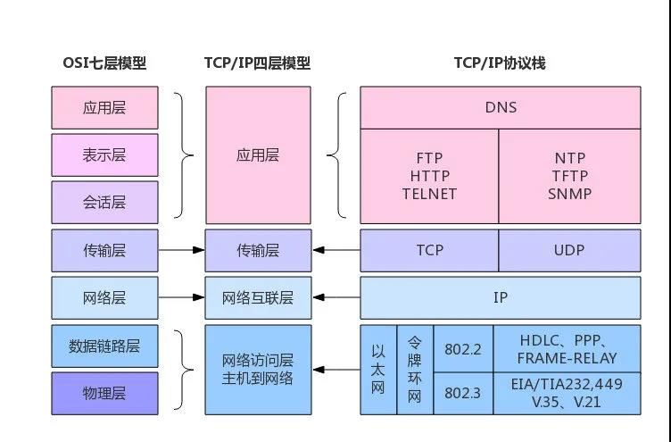
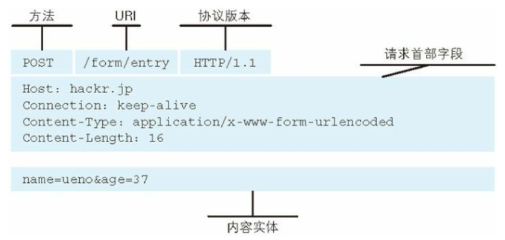
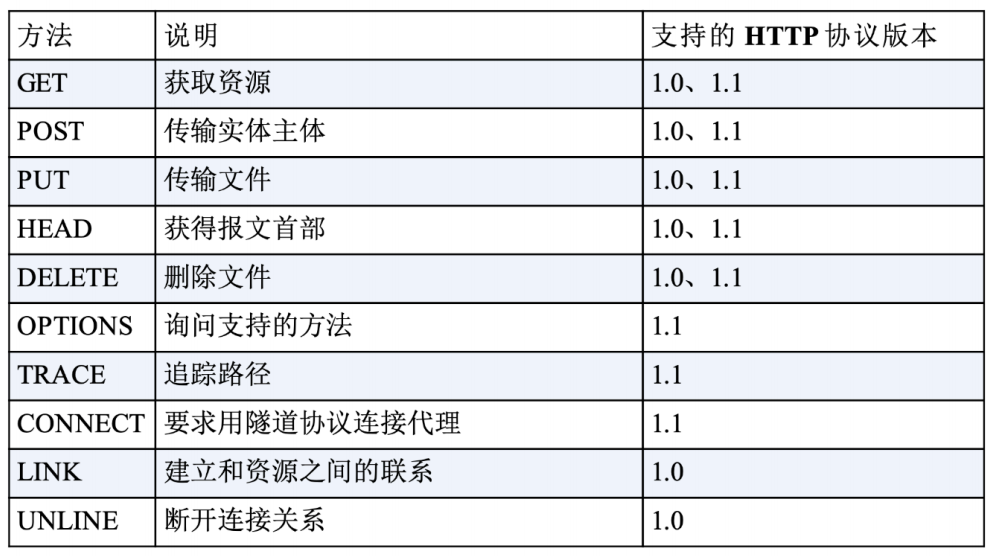
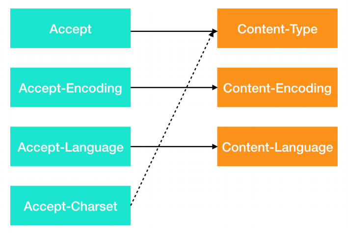
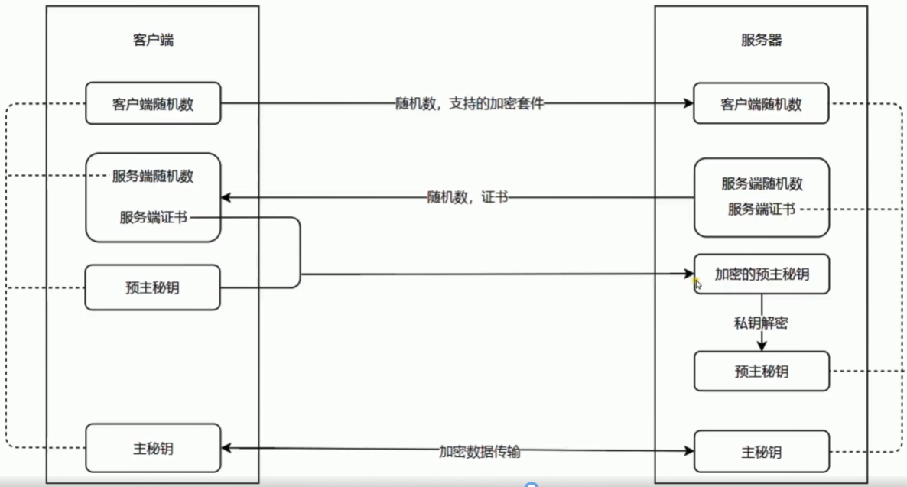
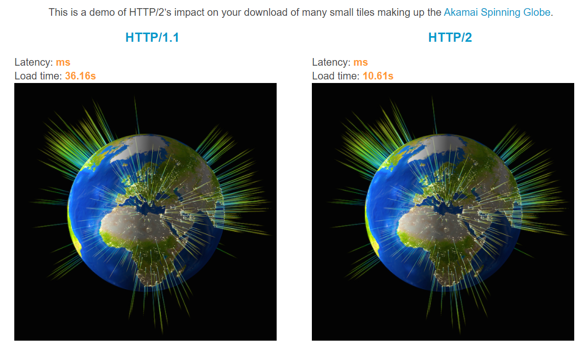
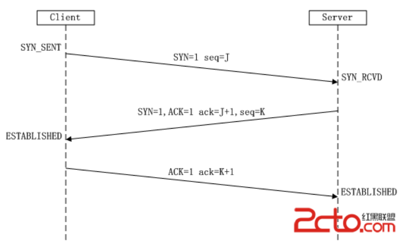
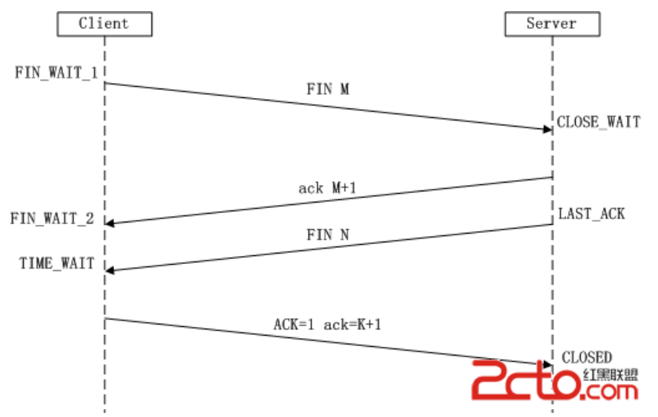
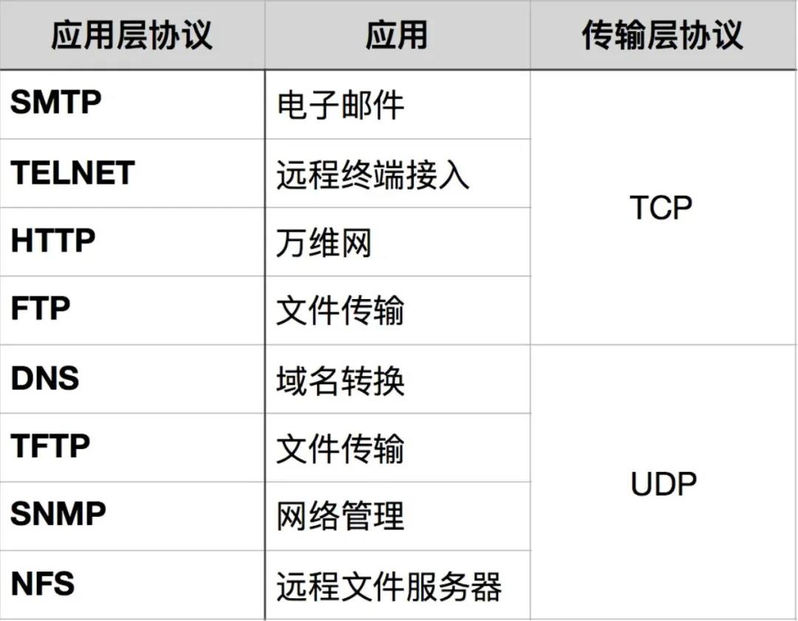
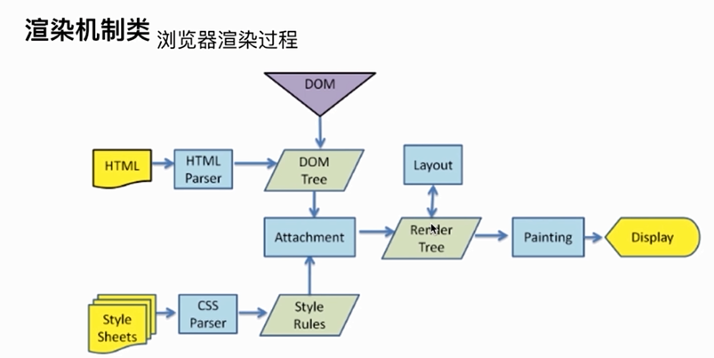

# [#](https://cchroot.github.io/interview/pages/interview notes/http.html#http知识整合)HTTP知识整合

这几天复习整理了一下 HTTP 相关的知识点，把相对重要的知识点都整理了出来，方便查于复习，这里继续分享给大家：

## [#](https://cchroot.github.io/interview/pages/interview notes/http.html#什么是http协议)什么是HTTP协议

HTPP(HyperText Transfer Protocol) 是一种超文本传输协议，用于客户端和服务器，通过请求和响应的交换来达成通信。

HTTP 属于 TCP/IP 协议族，TCP/IP 协议族是互联网相关联的协议集合起来总称（不仅仅指的是 TCP 和 IP 两个协议）。下图可以展示出 ISO 七层模型和 TCP/IP 协议族分层的关系：



从上图可以看到，TCP/IP 模型合并了 OSI 模型的应用层、表示层和会话层，将 OSI 模型的数据链路层和物理层合并为网络访问层。

童鞋们可能还经常听说计算机协议的 5 层模型，即：应用层、运输层、网络层、链路层、物理层，本质都一样。

## [#](https://cchroot.github.io/interview/pages/interview notes/http.html#与http关系密切的协议)与HTTP关系密切的协议

### [#](https://cchroot.github.io/interview/pages/interview notes/http.html#dns协议)DNS协议

DNS 的全称是域名系统，DNS 协议位于应用层，负责将域名解析为 IP 地址，本质是一个将域名和 IP 地址相互映射的分布式数据库，能够让人更方便的访问互联网。

### [#](https://cchroot.github.io/interview/pages/interview notes/http.html#tcp协议)TCP协议

TCP 的全称是传输控制协议，TCP 协议位于传输层，提供可靠的字节流服务，是一种可靠的协议，能保证数据传输不丢失。为确保将数据准确传送至对方，采用了我们熟知的三次握手策略（后面有详细介绍）

### [#](https://cchroot.github.io/interview/pages/interview notes/http.html#ip协议)IP协议

IP的全称是 Internet Portocol，IP 协议位于网络层，主要是解决双方寻址问题，IP 协议用 IP 地址来标识互联网上的每一台机器，计算机网络中的信息交换需要知道对方的 IP 地址（可以想象成电话号码）。

### [#](https://cchroot.github.io/interview/pages/interview notes/http.html#uri-url-urn)URI/URL/URN

你可以通过 www.baidu.com 来访问百度，这个地址是需要满足一定规范的，这个规范就是 URI 规范。

URI 的全称是 Uniform Resource Identifier，即统一资源标识符，使用它就能够唯一的标记互联网上的资源。

URL 的全称是 UNIFORM Resource Locator，即统一资源定位符，也就是我们所说的网址，它是 URI 的一个子集。

URN 的全称是 Uniform Resource Name，即统一资源名称，也是 URI 的一个子集。

### [#](https://cchroot.github.io/interview/pages/interview notes/http.html#https协议)HTTPS协议

HTTP 一般是明文传输，容易被窃取和篡改，所以 HTTPS 应运而生。

HTTPS 在 HTTP 的基础上加入了身份验证和通信加密来保证传输过程的安全性，即我们常说的 SSL。（后面有详细介绍）

## [#](https://cchroot.github.io/interview/pages/interview notes/http.html#http协议的特点)HTTP协议的特点

1、支持客户/服务器模式。

2、简单快速：客户向服务器请求服务时，只需传送请求方法和路径。

3、灵活：HTTP允许传输任意类型的数据对象，正在传输的类型由Content-Type加以标记。

4、无连接：无连接的含义是限制每次连接只处理一个请求。服务器处理完客户的请求，并收到客户的应答后，即断开连接。如果当请求的资源很多时，会造成无谓的 TCP 连接建立和断开，增加通信量的开销。为解决 TCP 连接的问题，产生了 keep-alive 的方法以保持连接，其特点是：只要任意一端没有明确提出断开连接，则保持 TCP 连接状态(在HTTP/1.1中，所有的连接默认都是持久连接)。

5、无状态：HTTP 是无状态协议，即 HTTP 协议自身不具备保存之前发送过的请求或响应的功能。

## [#](https://cchroot.github.io/interview/pages/interview notes/http.html#http报文)HTTP报文

### [#](https://cchroot.github.io/interview/pages/interview notes/http.html#报文格式)报文格式

发送请求时会发送请求报文，其由请求行(含请求方法、请求URI、协议版本)、报文首部和报文实体构成的，且报文首部和报文实体以一空行(CR+LF)分隔，如下图：



### [#](https://cchroot.github.io/interview/pages/interview notes/http.html#请求方法)请求方法



上面我们最长用的为 GET 和 POST 方法，他们的区别为：

- Get 请求能缓存，Post 不能
- Post 相对 Get 安全一点点，因为Get 请求都包含在 URL 里，
- 会被浏览器保存历史纪录，Post 不会，但是在抓包的情况下都是一样的。
- Post 可以通过 request body来传输比 Get 更多的数据，Get 没有这个技术
- URL有长度限制，会影响 Get 请求，但是这个长度限制是浏览器规定的，不是 RFC 规定的
- Post 支持更多的编码类型且不对数据类型限制

### [#](https://cchroot.github.io/interview/pages/interview notes/http.html#uri-url)URI/URL

即前面提到的 URI/URL/URN

### [#](https://cchroot.github.io/interview/pages/interview notes/http.html#协议版本)协议版本

当前常用的为 HTTP/1.1，其它可能会有： HTTP/1.0 和 HTTP/2.0（HTTP/0.9已淘汰，HTTP/3.0还未普及）

### [#](https://cchroot.github.io/interview/pages/interview notes/http.html#报文首部-http请求头)报文首部（HTTP请求头）

|     通用字段      |                     作用                      |
| :---------------: | :-------------------------------------------: |
|   Cache-Control   |                控制缓存的行为                 |
|    Connection     | 浏览器想要优先使用的连接类型，比如 keep-alive |
|       Date        |                 创建报文时间                  |
|      Pragma       |                   报文指令                    |
|        Via        |              代理服务器相关信息               |
| Transfer-Encoding |                 传输编码方式                  |
|      Upgrade      |              要求客户端升级协议               |
|      Warning      |             在内容中可能存在错误              |

|      请求字段       |                作用                |
| :-----------------: | :--------------------------------: |
|       Accept        |        能正确接收的媒体类型        |
|   Accept-Charset    |         能正确接收的字符集         |
|   Accept-Encoding   |      能正确接收的编码格式列表      |
|   Accept-Language   |        能正确接收的语言列表        |
|       Expect        |        期待服务端的指定行为        |
|        From         |           请求方邮箱地址           |
|        Host         |            服务器的域名            |
|      If-Match       |          两端资源标记比较          |
|  If-Modified-Since  | 本地资源未修改返回 304（比较时间） |
|    If-None-Match    | 本地资源未修改返回 304（比较标记） |
|     User-Agent      |             客户端信息             |
|    Max-Forwards     |    限制可被代理及网关转发的次数    |
| Proxy-Authorization |      向代理服务器发送验证信息      |
|        Range        |        请求某个内容的一部分        |
|       Referer       |    表示浏览器所访问的前一个页面    |
|         TE          |            传输编码方式            |

|      响应字段      |            作用            |
| :----------------: | :------------------------: |
|   Accept-Ranges    |   是否支持某些种类的范围   |
|        Age         | 资源在代理缓存中存在的时间 |
|        ETag        |          资源标识          |
|      Location      |   客户端重定向到某个 URL   |
| Proxy-Authenticate |  向代理服务器发送验证信息  |
|       Server       |         服务器名字         |
|  WWW-Authenticate  |   获取资源需要的验证信息   |

|     实体字段     |              作用              |
| :--------------: | :----------------------------: |
|      Allow       |       资源的正确请求方式       |
| Content-Encoding |         内容的编码格式         |
| Content-Language |         内容使用的语言         |
|  Content-Length  |       request body 长度        |
| Content-Location |       返回数据的备用地址       |
|   Content-MD5    | Base64加密格式的内容 MD5检验值 |
|  Content-Range   |         内容的位置范围         |
|   Content-Type   |         内容的媒体类型         |
|     Expires      |         内容的过期时间         |
|  Last_modified   |       内容的最后修改时间       |

### [#](https://cchroot.github.io/interview/pages/interview notes/http.html#报文实体)报文实体

报文实体不是必须的，例如我们采用 get 请求时，经常就没有报文实体。

举个栗子：我们采用 post 方法传输给服务端的数据字符按，以及图片等内容就是报文实体。

## [#](https://cchroot.github.io/interview/pages/interview notes/http.html#数据协商-内容协商)数据协商（内容协商）

在 HTTP 中，数据协商极机制是指客户端和服务器端就响应的资源内容进行交涉，交涉后提供给客户端最为合适的资源。数据协商会以响应资源的语言、字符集、编码等方式作为判断标准。

那么，为什么要数据协商？

HTTP 应用层的协议，数据到达之后需要告诉应用程序这是什么数据，不然应用只能自己不断尝试，这样会非常的低效。

鉴于此，客户端（浏览器）需要和服务器就数据的传输达成一致，客户端需要声明自己希望能够收取什么样的数据，什么样的压缩格式，什么语言，什么字符集，有什么限制等。服务端会根据请求头获取到客户端声明的信息，进而做出判断，返回客户端最合适的数据资源。

主要涉及到的请求头和响应头如下图：



注意其中 Accept-Charset 没有对应的 Content-Charset，而是通过 Content-Type 来表示。

由于篇幅原因，这里就不在解释这些请求头的含义啦，上文也有简单提到过，具体的大家可以查找资料深入学习。

## [#](https://cchroot.github.io/interview/pages/interview notes/http.html#http-cros-跨域)HTTP CROS 跨域

### [#](https://cchroot.github.io/interview/pages/interview notes/http.html#同源策略)同源策略

产生跨越的原因是由于浏览器的同源策略，所谓同源策略，指的是浏览器对不同源的脚本或者文本的访问方式进行的限制。

所谓同源，就是指两个页面具有相同的协议，主机（也常说域名），端口，三个要素缺一不可。例如:

| 实体字段 | 作用 | 实体字段 | 作用 | | :----: | :----: | | Allow | 资源的正确请求方式 |

|            URL1             |              URL2               |                  说明                  | 是否允许通信 |
| :-------------------------: | :-----------------------------: | :------------------------------------: | :----------: |
| http://www.foo.com/js/a.js  |   http://www.foo.com/js/b.js    |         协议、域名、端口都相同         |     允许     |
| http://www.foo.com/js/a.js  | http://www.foo.com:8888/js/b.js |        协议、域名相同，端口不同        |    不允许    |
| https://www.foo.com/js/a.js |   http://www.foo.com/js/b.js    |        主机、域名相同，协议不同        |    不允许    |
| http://www.foo.com/js/a.js  |   http://www.bar.com/js/b.js    |        协议、端口相同，域名不同        |    不允许    |
| http://www.foo.com/js/a.js  |     http://foo.com/js/b.js      | 协议、端口相同，主域名相同，子域名不同 |    不允许    |

同源策略限制了不同源之间的交互，但是有人也许会有疑问，我们以前在写代码的时候也常常会引用其他域名的js文件，样式文件，图片文件什么的，没看到限制啊，这个定义是不是错了。

其实不然，同源策略限制的不同源之间的交互主要针对的是 js 中的 XMLHttpRequest 等请求，下面这些情况是完全不受同源策略限制的：

- 页面中的链接，重定向以及表单提交是不会受到同源策略限制的
- 跨域资源嵌入是允许的，当然，浏览器限制了 Javascript 不能读写加载的内容。

### [#](https://cchroot.github.io/interview/pages/interview notes/http.html#http-cros-跨域的限制)HTTP CROS 跨域的限制

在处理 CROS 跨域的问题上，我们可能经常会让后端加上一个 Header 头：Acces-Control-Allow-Origin 来处理跨域问题，但是这样并不能处理所有限制问题。

在跨域的时候，其实我们默认允许的方法只有简单请求，非简单请求默认是不允许的，非简单请求会触发 CORS 预检操作。

什么是简单请求？

简单请求是满足以下所有条件的请求：

- 只允许 GET、POST 和 HEAD 方法
- 不能自定义请求头，除了代理自动设置的请求头外（Connection,User-Agent等），只允许 CORS 安全列出的请求头，它们是：
  - Accept
  - Accept-Language
  - Content-Language
  - Last-Event-ID
  - Content-Type
  - 其它名称是不区分字节大小写的匹配（DPR、Downdlink、Save-Data、Viewport-Width、Width等，没试过~)
- Content-Type：只限于三个值
  - application/x-www-form-urlencoded
  - multipart/form-data
  - text/plain
- 于XMLHttpRequestUpload：
  - 请求中的任意XMLHttpRequestUpload 对象均没有注册任何事件监听器
  - XMLHttpRequestUpload 对象可以使用XMLHttpRequest.upload 属性访问
- 请求中没有使用 ReadableStream 对象

CORS 预检请求首先通过 OPTIONS 方法向另一个域上的资源发送 HTTP 请求，用来确定实际请求是否跨域安全的发送。预检请求通过后才会发送真实请求。

一些跨域服务器 CROS 规范定义的 HTTP 请求头：

- Access-Control-Allow-Origin
- Access-Control-Allow-Credentials
- Access-Control-Allow-Headers
- Access-Control-Allow-Methods
- Access-Control-Expose-Headers
- Access-Control-Max-Age
- Access-Control-Request-Headers
- Access-Control-Request-Method
- Origin

由于篇幅原因，这里就不一一解释了，童鞋们用到的时候再去详细了解把。

## [#](https://cchroot.github.io/interview/pages/interview notes/http.html#http缓存)HTTP缓存

缓存是性能优化中极其重要的一环，它可以大大减少网络传输所带来的时间成本，节省宽带流量，减少了服务器的负担，大大提高了网站性能。

常见的缓存分类有：

- 浏览器缓存
- 代理服务器缓存
- 服务器缓存
- 数据库缓存
- CDN缓存
- 应用层缓存

我们的 HTTP 缓存即上面的浏览器缓存。

对于一个 HTTP 请求来说，可以分为发起网络请求、服务端处理、浏览器响应三个步骤。浏览器缓存可以帮助我们在第一和第三步骤中优化性能。比如说直接使用缓存而不发起请求就是属于第一步；发起了请求但后端存储的数据和前端一致，那么就没有必要再将数据回传回来，直接利用浏览器本地缓存，属于第三步。

### [#](https://cchroot.github.io/interview/pages/interview notes/http.html#http-缓存位置)HTTP 缓存位置

缓存位置分为四种，并且有优先级之分，当依次查找且都没有命中的时候，才会去发送请求获取资源：

1. Service Worker
2. Memory Cache
3. Disk Cache
4. Push Cache

当上面四个缓存都没有命中，才会发送网络请求。

#### [#](https://cchroot.github.io/interview/pages/interview notes/http.html#service-worker)Service Worker

Service Worker 是运行在浏览器背后的独立线程，使用 Service Worker 时传输协议必须为 HTTPS，因为其中涉及到请求拦截，不使 HTTPS 无法保障安全。

Service Worker 实现缓存功能分为三个步骤：

1. 注册 Service Worker
2. 监听到 install 事件以后就可以缓存需要的文件
3. 下次用户访问时通过拦截请求的方式查询是否存在缓存，存在则使用

如果 Service Worker 没能命中缓存，一般情况会使用 `fetch()` 方法继续获取资源。这时候，浏览器就去 memory cache 或者 disk cache 继续寻找缓存。注意：经过 Service Worker 的 `fetch()` 方法获取的资源，即便它并没有命中 Service Worker 缓存，甚至实际走了网络请求，也会标注为 from ServiceWorker。

Service Worker 的最大特点是灵活直接，可以选择自己想要缓存的文件缓存。

Service Worker 不常用，这里就再详细介绍了，有兴趣可以查找资料继续深入了解。

#### [#](https://cchroot.github.io/interview/pages/interview notes/http.html#memory-cache)Memory Cache

Memory Cache 即内存中的缓存，Memory Cache 读取速度比 Disk Cache 快，但是可是缓存持续性很短，会随着进程的释放而释放。 一旦我们关闭页面，内存中的缓存也就被释放了。在内存极端不够用的情况下，可能在页面还没关闭前排在前面的缓存就失效了。

因为计算机内存一般比较小（相对硬盘来说），操作系统需要精打细算内存的使用，所以能让我们使用的内存并不多，操作系统会根据系统内存使用率来和文件的大小来判断是否使用内存缓存还是硬盘缓存。

#### [#](https://cchroot.github.io/interview/pages/interview notes/http.html#disk-cache)Disk Cache

Disk Cache 即存储在硬盘中的缓存，读取速度相对内存慢点，但是优点是容量大，存储时间也更长。所以绝大部分的缓存都来自 Disk Cache。

大家可能会问，那 Disk Cache 的保存时间是多久呢？

Disk Cache 的保存时间是不确定的，根据用户的使用习惯以及磁盘可用缓存大小来确定。当缓存的内容接近容量上限，浏览器便会采用特定的算法自动清理最不常用或者最老的缓存资源。

#### [#](https://cchroot.github.io/interview/pages/interview notes/http.html#push-cache)Push Cache

Push Cache 是 HTTP/2 中的内容，当以上三种缓存都没有命中时，它才会被使用。并且缓存时间也很短暂（在 Chrome 浏览器中大概只有5分钟），只在会话（Session）中存在，一旦会话结束就被释放，同时它也并非严格执行HTTP头中的缓存指令。

在 Jake Archibald 所写的 [HTTP/2 push is tougher than I thought (opens new window)](https://jakearchibald.com/2017/h2-push-tougher-than-i-thought/)这篇文章中有几个结论：

- 所有的资源都能被推送，并且能够被缓存,但是 Edge 和 Safari 浏览器支持相对比较差
- 可以推送 no-cache 和 no-store 的资源
- 一旦连接被关闭，Push Cache 就被释放
- 多个页面可以使用同一个HTTP/2的连接，也就可以使用同一个Push Cache。这主要还是依赖浏览器的实现而定，出于对性能的考虑，有的浏览器会对相同域名但不同的tab标签使用同一个HTTP连接。
- Push Cache 中的缓存只能被使用一次
- 浏览器可以拒绝接受已经存在的资源推送
- 你可以给其他域名推送资源

如果以上四种缓存都没有命中的话，那么只能发起网络请求来获取资源了。

那么为了性能上的考虑，大部分的接口都应该选择好缓存策略，通常浏览器缓存策略分为两种：强缓存和协商缓存，并且缓存策略都是通过设置 HTTP Header 来实现的。

### [#](https://cchroot.github.io/interview/pages/interview notes/http.html#缓存策略)缓存策略

#### [#](https://cchroot.github.io/interview/pages/interview notes/http.html#强缓存)强缓存

强缓存可以通过设置两种 HTTP 请求头来实现，分别是 Expires 和 Cache-Control 。强缓存表示在缓存期间不需要请求，state code 为 200。

**Expires**

Expires 是 HTTP/1 的产物，Expires 的值为服务端返回的数据到期时间。当再次请求时的请求时间小于返回的此时间，则直接使用缓存数据。

```
Expires: Wed, 16 Nov 2020 10:41:00 GMT
```

上面的 Expires 表示资源会在 `Wed, 16 Nov 2020 10:41:00 GMT` 后过期，需要再次请求。并且 Expires 受限于本地时间，如果修改了本地时间，可能会造成缓存失效。所以限制基本都是使用 Cache-Control 替代 Expires。

**Cache-Control**

Cache-Control有很多属性，不同的属性代表的意义也不同:

- private：客户端可以缓存
- public：客户端和代理服务器都可以缓存
- max-age=x：缓存内容将在 x 秒后失效
- no-cache：需要使用协商缓存来验证缓存数据
- no-store：所有内容都不会缓存。
- s-maxage: 代理服务器使用，在代理服务器（例如Nginx,CDN）中优先于 max-age
- max-stale：能容忍的最大过期时间
- min-fresh：能够容忍的最小新鲜度

Cache-Control 出现于 HTTP/1.1，优先级高于 Expires 。我们可以将多个指令配合起来一起使用，达到不同的缓存目的。

#### [#](https://cchroot.github.io/interview/pages/interview notes/http.html#协商缓存)协商缓存

协商缓存可以通过设置两种 HTTP 请求头实现：Last-Modified 和 ETag 。

服务器会将缓存标识与数据一起响应给客户端，客户端将它们备份至缓存中。再次请求时，客户端会将缓存中的标识发送给服务器，服务器根据此标识判断。若未失效，返回 304 状态码，浏览器拿到此状态码就可以直接使用本地缓存数据了。

**Last-Modified 和 If-Modified-Since**

浏览器在第一次访问资源时，服务器返回资源的同时，在响应头中添加 Last-Modified 的 header，Last-Modified 的值是这个资源在服务器上的最后修改时间，浏览器接收后缓存文件和 header；

当浏览器再次请求服务器的时候，请求头携带 If-Modified-Since 字段来表示前面请求中缓存的 Last-Modified 值发送给服务器。

服务端收到此请求头发现有 if-Modified-Since，则与被请求资源的最后修改时间进行对比，如果一致则返回 304 和空响应体，浏览器只需要从缓存中获取信息即可，否则返回 200 和新的资源文件。

但是 Last-Modified 存在一些弊端：

- 如果本地打开缓存文件，即使没有对文件进行修改，但还是会造成 Last-Modified 被修改，服务端不能命中缓存导致发送相同的资源
- 因为 Last-Modified 只能以秒计时，如果在不可感知的时间内修改完成文件，那么服务端会认为资源还是命中了，不会返回正确的资源。

因为以上这些弊端，所以在 HTTP/1.1 中出现了 ETag 和If-None-Match 。

**ETag 和 If-None-Match**

ETag 是服务器响应请求时，返回当前资源文件的一个唯一标识(由服务器生成)，只要资源有变化，ETag 就会重新生成。ETag 优先级比 Last-Modified 高。

浏览器在下一次向服务器发送请求时，会将上一次返回的 ETag 请求头的 If-None-Match 里，服务器只需比较客户端传来的 If-None-Match 的值跟自己服务器上该资源的 ETag 是否一致。

如果服务器发现 ETag 匹配不上，那么说明资源更新了，直接以常规 GET 200 回包形式将新的资源（也包括了新的 ETag）发给客户端，如果 If-None-Match 的值和 ETag 是一致的，则直接返回 304，告诉客户端直接使用本地缓存即可。

虽然 ETag 更加精准，但是 ETag 要服务器通过算法来计算出一个特定的 Hash 值，会占用服务端计算的资源。所以在性能上ETag 反而要逊于 Last-Modified，所以其实我们反而比较少使用 ETag 。

## [#](https://cchroot.github.io/interview/pages/interview notes/http.html#https)HTTPS

HTTP 的缺点：

1. 无状态，没有记忆能力，从而出现了 Cookie 技术
2. 明文传输，既是优点也是缺点，优点是方便查看、修改和调试，缺点就是不安全，容易被篡改、伪装和窃听

针对第二个问题，HTTPS 出现了，HTTPS 是 HTTP 内核 与 TLS 协议的结合体。那么 HTTPS 做了什么呢？

1. 通信加密，HTTPS 通过 TLS 协议对通讯进行了加密
2. 身份验证，HTTPS 通过数字证书认证机构和其相关机关颁发的公开密钥证书进行身份验证
3. 内容加密，同样通过 TLS 协议进行了内容加密

童鞋们应该听说过 SSL ，其实 TLS 就是 SSL 的后续版本。

在 TLS 中使用了两种加密技术，分别为：对称加密和非对称加密。

### [#](https://cchroot.github.io/interview/pages/interview notes/http.html#对称加密)对称加密

对称加密就是两边使用相同的密钥，两边都知道如何将密文加密解密。如果能确保密钥的安全性，整个过程就是保密的了。

但是问题就在于如何只让通讯的双方知道秘钥。传输数据都是走的网络，如果没有合适的方法将秘钥通过网络安全的传递，一旦秘钥被截获，加密也就成了摆设。

### [#](https://cchroot.github.io/interview/pages/interview notes/http.html#非对称加密)非对称加密

有公钥私钥之分，公钥所有人都可以知道，可以将数据用公钥加密，但是将数据解密必须使用私钥解密，私钥只有分发公钥的一方才知道。

简单流程如下：

1. 首先服务端将公钥公布出去，那么客户端也就知道公钥了
2. 接下来客户端创建一个秘钥，然后通过公钥加密并发送给服务端
3. 服务端接收到密文以后通过只有自己知道的私钥解密出正确的秘钥，这时候两端就都知道秘钥是什么了。

这种加密方式就可以完美解决对称加密存在的问题。假设现在两端需要使用对称加密，那么在这之前，可以先使用非对称加密交换秘钥。

### [#](https://cchroot.github.io/interview/pages/interview notes/http.html#tls-握手过程)TLS 握手过程



如上图：

1、客户端先生成一个随机数，中间会带上客户端这边支持的加密套件（加密协议和加密方式等）

2、服务端收到客户端的随机值，存储并且自己也产生一个随机值，并根据客户端支持的协议和加密方式来选择最合适的加密套件，并且发送自己的证书（也就是我们之前说到的公钥）

3、客户端拿到服务端的随机数，也先存储，并且通过服务端给的证书（公钥），生成一个预主密钥，生成的过程当中也会有一个新的随机数（所以总共有3个随机数），这时候生成的随机数通过公钥加密后传输给服务器（这个过程无法被中间人解析，因为只有服务端有私钥解密）

4、加密的预主密钥被传输到服务器后，服务器通过私钥解密拿到预主密钥。这样客户端和服务端都有三个随机数了，这时候客户端和服务端同时对这三个随机数进行算法处理（用前面说的加密套件处理）生成主密钥

5、最后双方通过这个主密钥进行对称加密和解密进行数据传输，确保数据的安全传输

## [#](https://cchroot.github.io/interview/pages/interview notes/http.html#http2)HTTP2

HTTP/2 对比 HTTP/1.1 大幅度的提高了web性能，并且完全兼容 HTTP1.1。

大家可以通过 [demo (opens new window)](https://http2.akamai.com/demo)来感受一下 HTTP/2 比 HTTP/1.1 到底快了多少：



在 HTTP/1.1 中，我们会引入雪碧图、将小图内联、使用多个资源域名等等的方式来优化性能。这一切都是因为浏览器限制了同一个域名下的请求数量（Chrome 下一般是限制六个连接，每个浏览器不一定相同），当页面中需要请求很多资源的时候，队头阻塞（Head of line blocking）会导致在达到最大请求数量时，剩余的资源需要等待其他资源请求完成后才能发起请求。

HTTP/2 有以下6个新特性：

- 二进制分帧
- 首部压缩
- 多路复用
- 服务器推送
- 请求优先级
- 流量控制

### [#](https://cchroot.github.io/interview/pages/interview notes/http.html#二进制分帧)二进制分帧

HTTP/2 中所有加强性能的核心点在于此。在之前的 HTTP 版本中，我们是通过文本的方式传输数据。在 HTTP/2 中引入了新的编码机制，所有传输的数据都会被分割，并采用二进制格式编码。

同域名下所有通信都在单个连接上完成，该连接可以承载任意数量的双向数据流。每个数据流都以消息的形式发送，而消息又由一个或多个帧组成。多个帧之间可以乱序发送，根据帧首部的流标识可以重新组装。

二进制分帧主要是为下文中的各种特性提供了基础。它能把一个数据划分封装为更小更便捷的数据。首先是在单链接多资源方式中，减少了服务端的链接压力，内存占用更少，链接吞吐量更大。另一方面，由于 TCP 链接的减少而使网络拥塞状态得以改善，同时慢启动时间的减少，使拥塞和丢包恢复的速度更快。

### [#](https://cchroot.github.io/interview/pages/interview notes/http.html#首部压缩)首部压缩

HTTP 每一次通信都会携带一组头部，用于描述这次通信的的资源、浏览器属性、cookie 等，为了减少这块的资源消耗并提升性能，HTTP/2 对这些首部采取了压缩策略。

- 使用了 HPACK 压缩格式对传输的 header 进行编码，减少了 header 的大小
- HTTP/2在客户端和服务器端使用“首部索引表”来跟踪和存储之前发送的键－值对，对于出现过的 header 数据，不再通过每次请求和响应发送
- 首部表在 HTTP/2 的连接存续期内始终存在，由客户端和服务器共同渐进地更新
- 后面在传输过程中就可以传输已经记录过的 header 的键名，对方收到数据后就可以通过键名找到对应的值。
- 每个新的首部键－值对要么被追加到当前表的末尾，要么替换表中之前的值。

首部压缩技术，使报头更紧凑，更快速传输，有利于移动网络环境。减少每次通讯的数据量，使网络拥塞状态得以改善。

### [#](https://cchroot.github.io/interview/pages/interview notes/http.html#多路复用)多路复用

上面提到，在 HTTP/2 中，有两个非常重要的概念，分别是帧（frame）和流（stream）。

帧代表着最小的数据单位，每个帧会标识出该帧属于哪个流，流也就是多个帧组成的数据流。

多路复用，就是在一个 TCP 连接中可以存在多条流，其优势有：

- 使用一个 TCP 链接即可并行发送多个请求和响应
- 可以并行交错的发送请求和响应，这些请求和响应之间互不影响，对端可以通过帧中的标识知道属于哪个请求。
- 通过这个技术，可以避免上面提到的 HTTP 旧版本中的队头阻塞问题，极大的提高传输性能。

### [#](https://cchroot.github.io/interview/pages/interview notes/http.html#服务器推送)服务器推送

在 HTTP/2 中，服务端可以在客户端进行某个请求后，主动推送其他资源给客户端。

如果某些资源客户端是一定会请求的，这时就可以采取服务端 push 的技术，提前给客户端推送必要的资源，这样就可以相对减少一点延迟时间。当然在浏览器兼容的情况下你也可以使用 prefetch 标记资源来实现。

### [#](https://cchroot.github.io/interview/pages/interview notes/http.html#请求优先级)请求优先级

每个流都可以带有一个 31bit 的优先值：0 表示最高优先级；2 的 31 次方 -1 表示最低优先级。

客户端明确指定优先级，服务端可以根据这个优先级作为交互数据的依据，按此顺序返回结果更加有利于高效利用底层连接，提高用户体验。

### [#](https://cchroot.github.io/interview/pages/interview notes/http.html#流量控制)流量控制

HTTP/2 构建于 TCP 之上，TCP 协议已经提供了流量控制机制，不过 HTTP/2 的流量控制的目标是：在不改变协议的情况下允许使用多种流量控制算法。

- 流量控制是特定于一个连接的。每种类型的流量控制都是在单独的一跳的两个端点之间的，并不是在整个端到端的路径上的。（这里的一跳指的是 HTTP 连接的一跳，而不是 IP 路由的一跳）
- 流量控制是基于 WINDOW_UPDATE 帧的。接收方公布自己打算在每个流以及整个连接上分别接收多少字节。这是一个以信用为基础的方案。
- 流量控制是有方向的，由接收者全面控制。接收方可以为每个流和整个连接设置任意的窗口大小。发送方必须尊重接收方设置的流量控制限制。客户方、服务端和中间代理作为接收方时都独立地公布各自的流量控制窗口，作为发送方时都遵守对端的流量控制设置。
- 无论是新流还是整个连接，流量控制窗口的初始值是 65535 字节。
- 帧的类型决定了流量控制是否适用于帧。目前，只有 DATA 帧服从流量控制，所有其它类型的帧并不消耗流量控制窗口的空间。这保证了重要的控制帧不会被流量控制阻塞。
- 流量控制不能被禁用。
- HTTP/2 只定义了 WINDOW_UPDATE 帧的格式和语义，并没有规定接收方如何决定何时发送帧、发送什么样的值，也没有规定发送方如何选择发送包。具体实现可以选择任何满足需求的算法。

重点看第 7 条，HTTP/2 没有提出流量控制的具体算法，实现者可以有最大的自由度，去实现任何算法。

这个功能了解一下，知道有就好啦，太难记了~

## [#](https://cchroot.github.io/interview/pages/interview notes/http.html#http3)HTTP3

虽然 HTTP/2 解决了很多之前旧版本的问题，但是它还是存在一个巨大的问题，虽然这个问题并不是它本身造成的，而是底层支撑的 TCP 协议的问题。即还未能够解决 TCP 队头阻塞。

因为 HTTP/2 使用了多路复用，一般来说同一域名下只需要使用一个 TCP 连接。当这个连接中出现了丢包的情况，那就会导致 HTTP/2 的表现情况反倒不如 HTTP/1.1 了。

因为在出现丢包的情况下，整个 TCP 都要开始等待重传，也就导致了后面的所有数据都被阻塞了。但是对于 HTTP/1.1 来说，可以开启多个 TCP 连接，出现这种情况反到只会影响其中一个连接，剩余的 TCP 连接还可以正常传输数据。

那么可能就会有人考虑到去修改 TCP 协议，其实这已经是一件不可能完成的任务了。因为 TCP 存在的时间实在太长，已经充斥在各种设备中，并且这个协议是由操作系统实现的，更新起来不大现实。

基于这个原因，Google 就更起炉灶搞了一个基于 UDP 协议的 QUIC 协议，并且使用在了 HTTP/3 上，当然 HTTP/3 之前名为 HTTP-over-QUIC，从这个名字中我们也可以发现，HTTP/3 最大的改造就是使用了 QUIC，接下来我们就来学习关于这个协议的内容。

### [#](https://cchroot.github.io/interview/pages/interview notes/http.html#quic)QUIC

QUIC 基于 UDP 实现，是 HTTP/3 中的底层支撑协议，该协议基于 UDP，又取了 TCP 中的精华，实现了即快又可靠的协议。

QUIC 协议虽然效率很高，但是并不是那么的可靠。QUIC 虽然基于 UDP，但是在原本的基础上新增了很多功能，比如多路复用、0-RTT、使用 TLS1.3 加密、流量控制、有序交付、重传等等功能。

## [#](https://cchroot.github.io/interview/pages/interview notes/http.html#cookie和session)Cookie和Session

### [#](https://cchroot.github.io/interview/pages/interview notes/http.html#cookie)Cookie

**Cookie 简介**

HTTP 是一个无状态的协议，每次 http 请求都是独立、无关的，默认不需要保留状态信息。但有时候需要保存一些状态，怎么办呢？

HTTP 为此引入了 Cookie。Cookie 本质上就是浏览器里面存储的一个很小的文本文件，内部以键值对的方式来存储(在 chrome 开发者面板的 Application 这一栏可以看到)。向同一个域名下发送请求，都会携带相同的 Cookie，服务器拿到 Cookie 进行解析，便能拿到客户端的状态。而服务端可以通过响应头中的 `Set-Cookie` 字段来对客户端写入 Cookie。

**生存周期**

Cookie 的有效期可以通过 Expires 和 Max-Age 两个属性来设置。

- Expires即过期时间
- Max-Age用的是一段时间间隔，单位是秒，从浏览器收到报文开始计算。

若 Cookie 过期，则这个 Cookie 会被删除，并不会发送给服务端。

**作用域**

关于作用域也有两个属性: Domain 和 path, 给 Cookie 绑定了域名和路径，在发送请求之前，发现域名或者路径和这两个属性不匹配，那么就不会带上 Cookie。值得注意的是，对于路径来说，/表示域名下的任意路径都允许使用 Cookie。

**安全相关**

如果带上 Secure，说明只能通过 HTTPS 传输 cookie。

如果 cookie 字段带上 HttpOnly，那么说明只能通过 HTTP 协议传输，不能通过 JS 访问，这也是预防 XSS 攻击的重要手段。

相应的，对于 CSRF 攻击的预防，也有 SameSite 属性。

SameSite可以设置为三个值，Strict、Lax和None:

- 在Strict模式下，浏览器完全禁止第三方请求携带Cookie。比如请求sanyuan.com网站只能在sanyuan.com域名当中请求才能携带 Cookie，在其他网站请求都不能。
- 在Lax模式，就宽松一点了，但是只能在 get 方法提交表单况或者a 标签发送 get 请求的情况下可以携带 Cookie，其他情况均不能。
- 在None模式下，也就是默认模式，请求会自动携带上 Cookie。

**Cookie 的缺点**

- 容量缺陷。Cookie 的体积上限只有4KB，只能用来存储少量的信息。
- 性能缺陷。Cookie 紧跟域名，不管域名下面的某一个地址需不需要这个 Cookie ，请求都会携带上完整的 Cookie，这样随着请求数的增多，其实会造成巨大的性能浪费的，因为请求携带了很多不必要的内容。但可以通过 Domain 和 Path 指定作用域来解决。
- 安全缺陷。由于 Cookie 以纯文本的形式在浏览器和服务器中传递，很容易被非法用户截获，然后进行一系列的篡改，在 Cookie 的有效期内重新发送给服务器，这是相当危险的。另外，在HttpOnly为 false 的情况下，Cookie 信息能直接通过 JS 脚本来读取。

### [#](https://cchroot.github.io/interview/pages/interview notes/http.html#session)Session

Session 是另一种记录客户状态的机制，不同的是 Cookie 保存在客户端浏览器中，而 Session 保存在服务器上。

客户端浏览器访问服务器的时候，服务器把客户端信息以某种形式记录在服务器上。这就是 Session。客户端浏览器再次访问时只需要从 该Session 中查找该客户的状态就可以了。

Session 有很多种实现方法，使用 Cookie 实现只是其中常用的一种方式（使用 Cookie 来保存 Session）。

Session 只要能保证定位到当前是哪个用户，它就是一种 Session 的实现方式，例如：可以通过 js 写在 Header 里面。

## [#](https://cchroot.github.io/interview/pages/interview notes/http.html#tcp三次握手和四次挥手)TCP三次握手和四次挥手

在说这两个握手之前，我们先要知道几个概念

| 消息类型 |                描述                |
| :------: | :--------------------------------: |
|   SYN    |  这个消息是用来初始化和建立连接的  |
|   ACK    |    帮助对方确认收到的 SYN 消息     |
| SYN-ACK  | 本地的 SYN 消息和较早的 ACK 数据包 |
|   FIN    |            用来断开连接            |

### [#](https://cchroot.github.io/interview/pages/interview notes/http.html#tcp三次握手)TCP三次握手



第一次握手：客户端 A 将标志位 SYN 置为1,随机产生一个值为 seq=J（J的取值范围为=1234567）的数据包到服务器，客户端 A 进入 SYN_SENT 状态，等待服务端 B 确认；

第二次握手：服务端 B 收到数据包后由标志位 SYN=1 知道客户端 A 请求建立连接，服务端 B 将标志位 SYN 和 ACK 都置为 1，ack=J+1(ACKnum)，随机产生一个值 seq=K，并将该数据包发送给客户端 A 以确认连接请求，服务端 B 进入 SYN_RCVD 状态。

第三次握手：客户端 A 收到确认后，检查 ack 是否为 J+1，ACK 是否为 1，如果正确则将标志位 ACK 置为 1，ack=K+1，并将该数据包发送给服务端 B，服务端 B 检查 ack 是否为 K+1，ACK 是否为 1，如果正确则连接建立成功，客户端 A 和服务端 B 进入 ESTABLISHED 状态，完成三次握手，随后客户端 A 与服务端 B 之间可以开始传输数据了。

有童鞋会问：**为什么 TCP 建立连接需要三次握手，明明两次就可以建立起连接？**

因为这是为了防止出现失效的连接请求报文段被服务端接收的情况，从而产生错误。

书中的例子是这样的，“已失效的连接请求报文段”的产生在这样一种情况下：client 发出的第一个连接请求报文段并没有丢失，而是在某个网络结点长时间的滞留了，以致延误到连接释放以后的某个时间才到达 server 。本来这是一个早已失效的报文段。但 server 收到此失效的连接请求报文段后，就误认为是 client 再次发出的一个新的连接请求。于是就向 client 发出确认报文段，同意建立连接。

假设不采用“三次握手”，那么只要 server 发出确认，新的连接就建立了。由于现在 client 并没有发出建立连接的请求，因此不会理睬 server 的确认，也不会向 server 发送数据。但 server 却以为新的运输连接已经建立，并一直等待 client 发来数据。这样，server 的很多资源就白白浪费掉了。采用“三次握手”的办法可以防止上述现象发生。例如刚才那种情况，client 不会向 server 的确认发出确认。server 由于收不到确认，就知道 client 并没有要求建立连接。主要目的防止 server 端一直等待，浪费资源。

### [#](https://cchroot.github.io/interview/pages/interview notes/http.html#tcp四次挥手)TCP四次挥手



第一次挥手：Client 发送一个 FIN，用来关闭 Client 到 Server 的数据传送，Client 进入 FIN_WAIT_1 状态。

第二次挥手：Server 收到 FIN 后，发送一个 ACK 给 Client，确认序号为收到序号 +1（与 SYN 相同，一个 FIN 占用一个序号），Server 进入 CLOSE_WAIT 状态。

第三次挥手：Server 发送一个 FIN，用来关闭 Server 到 Client 的数据传送，Server 进入 LAST_ACK 状态。

第四次挥手：Client 收到 FIN 后，Client 进入 TIME_WAIT 状态，该状态会持续 2MSL（最大段生存期，指报文段在网络中生存的时间，超时会被抛弃） 时间，若该时间段内没有 B 的重发请求的话，就进入 CLOSED 状态。接着发送一个 ACK 给 Server，确认序号为收到序号 +1，Server 进入 CLOSED 状态，完成四次挥手。

**为什么 A 要进入 TIME-WAIT 状态，等待 2MSL 时间后才进入 CLOSED 状态？**

为了保证 B 能收到 A 的确认应答。若 A 发完确认应答后直接进入 CLOSED 状态，如果确认应答因为网络问题一直没有到达，那么会造成 B 不能正常关闭。

**为什么建立连接是三次握手，而关闭连接却是四次挥手呢？**

这是因为服务端在 LISTEN 状态下，收到建立连接请求的 SYN 报文后，可以把 ACK 和 SYN 放在一个报文里发送给客户端。其中ACK报文是用来应答的，SYN报文是用来同步的。而关闭连接时，当收到对方的 FIN 报文时，仅仅表示对方不再发送数据了但是还能接收数据，己方也未必全部数据都发送给对方了，所以己方可以立即 close，也可以发送一些数据给对方后，再发送 FIN 报文给对方来表示同意现在关闭连接，因此，己方 ACK 和 FIN 一般都会分开发送，故需要四步握手。

由于 TCP 协议是全双工的，也就是说客户端和服务端都可以发起断开连接。两边各发起一次断开连接的申请，加上各自的两次确认，看起来就像执行了四次挥手。

## [#](https://cchroot.github.io/interview/pages/interview notes/http.html#tcp-和-udp)TCP 和 UDP

TCP 和 UDP 都位于计算机网络模型种的运输层，它们负责传输应用层产生的数据。

### [#](https://cchroot.github.io/interview/pages/interview notes/http.html#tcp)TCP

TCP 的全称是 Transmission Control Protocol，传输控制协议，它能够帮助你确定计算机连接到 Internet ，以及它们之间的数据传输，三次握手就是用来启动和确认 TCP 连接的过程。主要特点有：

- TCP 能够确保连接的建立和数据包的发送（利用滑动窗口解决了数据的丢包、顺序不对和流量控制问题）
- TCP 支持错误校验和超时重传机制（利用 ARQ 协议）
- TCP 支持拥塞控制，能够在网络拥堵的情况下延迟发送（拥塞处理包括了四个算法，分别为：慢开始，拥塞避免，快速重传，快速恢复）

### [#](https://cchroot.github.io/interview/pages/interview notes/http.html#udp)UDP

UDP 的全称是 User Datagram Protocol，用户数据报协议。它不需要所谓的握手操作，从而加快了通信熟读，允许网络上的其它主机在接收方同意通信之前进行数据传输。主要特点有：

- UDP 不需要在发送数据前建立连接（面向无连接）
- UDP 能够支持容忍数据包丢书的带宽密集型应用程序（不可靠性）
- UDP 能够发送大量的数据包，具有低延迟的特点（高效）

UDP 可能使用的场景: 直播，王者荣耀等实时竞技游戏

### [#](https://cchroot.github.io/interview/pages/interview notes/http.html#udp与tcp的区别)UDP与TCP的区别

两者都属于传输层协议

TCP（Transmission Control Protocol，传输控制协议）是面向连接的协议，也就是说，在收发数据前，必须和对方建立可靠的连接。一个 TCP 连接必须有三次握手、四次挥手。

UDP（User Data Protocol，用户数据报协议）是一个非连接的协议，传输数据之前源端和终端不建立连接， 当它想传送时就简单地去抓取来自应用程序的数据，并尽可能快地把它扔到网络上

两者对比：

|            |                      TCP                       |                    UDP                     |
| :--------: | :--------------------------------------------: | :----------------------------------------: |
|   连接性   |                    面向连接                    |                 面向非连接                 |
| 传输可靠性 |                      可靠                      |                   不可靠                   |
|    报文    |                   面向字节流                   |                  面向报文                  |
|    效率    |                   传输效率低                   |                 传输效率高                 |
|  流量控制  |                    滑动窗口                    |                     无                     |
|  拥塞控制  |        慢开始、拥塞避免、快重传、快恢复        |                     无                     |
|  传输速度  |                       慢                       |                     快                     |
|  错误处理  |           错误校验，能够进行错误修复           |       错误检查，但会丢弃错误的数据包       |
|  应用场合  | 对效率要求低，对准确性要求高或要求有连接的场景 | 对效率要求高，对准确性要求低（直播、王者） |

TCP 与 UDP 的应用场景：



参考资料:

[https://juejin.im/post/6844903545532071943#heading-18(opens new window)](https://juejin.im/post/6844903545532071943#heading-18)

[https://blog.csdn.net/liujiyong7/article/details/60151838/(opens new window)](https://blog.csdn.net/liujiyong7/article/details/60151838/)

[https://yuchengkai.cn/(opens new window)](https://yuchengkai.cn/)


# [#](https://cchroot.github.io/interview/pages/interview notes/从输入url到页面展示到底发生了什么.html#从输入url到页面展示到底发生了什么)从输入url到页面展示到底发生了什么

## [#](https://cchroot.github.io/interview/pages/interview notes/从输入url到页面展示到底发生了什么.html#主要过程整理)主要过程整理

1. 输入地址
2. 浏览器查找域名的 IP 地址（DNS 查询：具体过程包括浏览器搜索自身的 DNS 缓存、搜索操作系统的 DNS 缓存、读取本地的 Host 文件和向本地 DNS 服务器进行查询等）
3. 浏览器获得域名对应的 IP 地址以后，浏览器向服务器请求建立链接，发起三次握手
4. TCP/IP 链接建立起来后，浏览器向服务器发送 HTTP 请求
5. 服务器的永久重定向响应
6. 浏览器跟踪重定向地址
7. 服务器处理请求
8. 服务器返回一个 HTTP 响应
9. 浏览器获取 HTML 并解析，同时发送请求获取嵌入在 HTML 中的资源（如图片、音频、视频、CSS、JS等等）

## [#](https://cchroot.github.io/interview/pages/interview notes/从输入url到页面展示到底发生了什么.html#_1-输入地址)1. 输入地址

当我们开始在浏览器中输入网址的时候，浏览器其实就已经在智能的匹配可能得 url 了，他会从历史记录，书签等地方，找到已经输入的字符串可能对应的 url，然后给出智能提示，让你可以补全url地址。对于 chrome 浏览器，他甚至会直接从缓存中把网页展示出来。

## [#](https://cchroot.github.io/interview/pages/interview notes/从输入url到页面展示到底发生了什么.html#_2-浏览器查找域名的-ip-地址)2. 浏览器查找域名的 IP 地址

请求一旦发起，浏览器首先要做的事情就是解析这个域名，一般来说，整体查找步骤如下：

1. 浏览器缓存：当用户通过浏览器访问某域名时，浏览器首先会在自己的缓存中查找是否有该域名对应的IP地址（若曾经访问过该域名且没有清空缓存便存在)；
2. 系统缓存(host): 当浏览器缓存中无域名对应IP则会自动检查用户计算机系统Hosts文件DNS缓存是否有该域名对应IP；
3. 路由器缓存(局域网): 当浏览器及系统缓存中均无域名对应IP则进入路由器缓存中检查，以上三步均为客户端的DNS缓存；
4. ISP（互联网服务提供商）DNS缓存（电信、移动）: 当在用户客服端查找不到域名对应IP地址，则将进入ISP DNS缓存中进行查询。比如你用的是电信的网络，则会进入电信的DNS缓存服务器中进行查找；(或者向网络设置中指定的local DNS进行查询，如果在PC指定了DNS的话，如果没有设置比如DNS动态获取，则向ISP DNS发起查询请求)
5. 根域名服务器: 当以上均未完成，则进入根服务器进行查询。全球仅有13台根域名服务器，1个主根域名服务器，其余12为辅根域名服务器。根域名收到请求后会查看区域文件记录，若无则将其管辖范围内顶级域名（如.com）服务器IP告诉本地DNS服务器；
6. 顶级域名服务器: 顶级域名服务器收到请求后查看区域文件记录，若无则将其管辖范围内主域名服务器的IP地址告诉本地DNS服务器；
7. 主域名服务器: 主域名服务器接受到请求后查询自己的缓存，如果没有则进入下一级域名服务器进行查找，并重复该步骤直至找到正确记录；
8. 保存结果至缓存: 本地域名服务器把返回的结果保存到缓存，以备下一次使用，同时将该结果反馈给客户端，客户端通过这个IP地址与web服务器建立链接。

### [#](https://cchroot.github.io/interview/pages/interview notes/从输入url到页面展示到底发生了什么.html#知识扩展)知识扩展

**什么是 DNS？**

DNS（Domain Name System，域名系统），因特网上作为域名和 IP 地址相互映射的一个分布式数据库，能够使用户更方便的访问互联网，而不用去记住能够被机器直接读取的 IP 数串。通过主机名，最终得到该主机名对应的 IP 地址的过程叫做域名解析（或主机名解析）。

通俗的讲，我们更习惯于记住一个网站的名字，比如 www.baidu.com,而不是记住它的 ip 地址，比如：167.23.10.2。而计算机更擅长记住网站的 ip 地址，而不是像 www.baidu.com 等链接。因为，DNS 就相当于一个电话本，比如你要找 www.baidu.com 这个域名，那我翻一翻我的电话本，我就知道，哦，它的电话（ip）是167.23.10.2。

**DNS查询的两种方式：递归查询和迭代查询**

当局部 DNS 服务器（局域网的 DNS 服务器）自己不能回答客户机的 DNS 查询时，它就需要向其他 DNS 服务器进行查询。此时有两种方式：

- 递归方式：局部 DNS 服务器自己负责向其他 DNS 服务器进行查询，一般是先向该域名的根域服务器查询，再由根域名服务器一级级向下查询。最后得到的查询结果返回给局部 DNS 服务器，再由局部 DNS 服务器返回给客户端。
- 迭代查询：局部 DNS 服务器不是自己向其他 DNS 服务器进行查询，而是把能解析该域名的其他 DNS 服务器的 IP 地址返回给客户端 DNS 程序，客户端 DNS 程序再继续向这些 DNS 服务器进行查询，直到得到查询结果为止。也就是说，迭代解析只是帮你找到相关的服务器而已，而不会帮你去查。比如说： baidu.com 的服务器ip地址在 192.168.4.5 这里，你自己去查吧，本人比较忙，只能帮你到这里了。

**DNS 域名称空间的组织方式**

按其功能命名空间中用来描述 DNS 域名称的五个类别的介绍详见下表中，以及与每个名称类型的示例：

|                |                             说明                             |                             示例                             |
| :------------: | :----------------------------------------------------------: | :----------------------------------------------------------: |
|      根域      | 这是表示未命名的等级; 目录树的顶部它有时显示为两个空引号 ("")，表示空值。 DNS 域名中使用时，它规定由尾部句点 (.) 来指定名称位于根或更高级别的域层次结构。 在此情况下，DNS 域名被认为是完整和点到准确的位置在树中的名称。 名称声明这种方式的 Fqdn。 | 单个句点 (.) 或句点用于末尾的名称，如"example.microsoft.com"。 |
|     顶级域     |      用来指示某个国家/地区或组织使用的名称的类型名称。       |  ".com"，表示一个名称注册为在 Internet 上的商业使用的业务。  |
|    第二层域    | 可变长度的个体或组织，以便在 Internet 上使用的注册名称。 这些名称始终基于相应的顶级域，具体取决于组织或地理位置名称使用的位置的类型。 | "microsoft.com。 "，这是由 Internet DNS 域的名称注册向 Microsoft 注册的二级域名称。 |
|      子域      | 其他名称的组织可以创建从已注册的二级域名派生的。 这些功能包括添加到组织中的名称的 DNS 树的增长，并将其分为部门或地理位置的名称。 | "example.microsoft.com"。 "，这是由 Microsoft 指定文档名称示例中用于虚构子域。 |
| 主机或资源名称 | 代表名称的 DNS 树的叶节点并标识特定的资源的名称。 通常情况下，DNS 域名的最左侧的标签标识网络上的特定计算机。 例如，如果主机 (A) 资源记录中使用此级别的名称，则它用于查找基于其主机名的计算机的 IP 地址。 | "主机-a.example.microsoft.com。"，其中第一个标签 （"主机-a"） 是网络上的特定计算机的 DNS 主机名。 |

**DNS 负载均衡**

当一个网站有足够多的用户的时候，假如每次请求的资源都位于同一台机器上面，那么这台机器随时可能会蹦掉。处理办法就是用 DNS 负载均衡技术，它的原理是在 DNS 服务器中为同一个主机名配置多个 IP 地址,在应答 DNS 查询时,DNS 服务器对每个查询将以 DNS 文件中主机记录的 IP 地址按顺序返回不同的解析结果,将客户端的访问引导到不同的机器上去,使得不同的客户端访问不同的服务器,从而达到负载均衡的目的｡例如可以根据每台机器的负载量，该机器离用户地理位置的距离等等。

## [#](https://cchroot.github.io/interview/pages/interview notes/从输入url到页面展示到底发生了什么.html#_3-浏览器获得域名对应的-ip-地址以后-浏览器向服务器请求建立链接-发起三次握手)3. 浏览器获得域名对应的 IP 地址以后，浏览器向服务器请求建立链接，发起三次握手

拿到域名对应的 IP 地址之后，浏览器会以一个随机端口（1024<端口<65535）向服务器的 WEB 程序（常用的有 httpd,nginx 等）80 端口发起 TCP 的连接请求。这个连接请求到达服务器端后（这中间通过各种路由设备，局域网内除外），进入到网卡，然后是进入到内核的 TCP/IP 协议栈（用于识别该连接请求，解封包，一层一层的剥开），还有可能要经过 Netfilter 防火墙（属于内核的模块）的过滤，最终到达 WEB 程序，最终建立了 TCP/IP 的连接。（如果是 HTTPS 还需要建立 TLS 连接）

### [#](https://cchroot.github.io/interview/pages/interview notes/从输入url到页面展示到底发生了什么.html#知识扩展-2)知识扩展

**TCP三次握手和四次挥手**

关于 TCP 三次握手和四次挥手请查看 [TCP三次握手和四次挥手(opens new window)](https://cchroot.github.io/interview/pages/interview notes/http.html#tcp三次握手和四次挥手)

**为什么需要三次握手呢？两次不行吗？**

**为什么连接的时候是三次握手，关闭的时候却是四次握手？**

**为什么 TIME_WAIT 状态需要经过 2MSL(最大报文段生存时间)才能返回到CLOSE状态？**

以上三个问题请查看上一篇文章 [HTTP精选面试题(opens new window)](https://cchroot.github.io/interview/pages/interview questions/HTTP精选面试题.html)

## [#](https://cchroot.github.io/interview/pages/interview notes/从输入url到页面展示到底发生了什么.html#_4-tcp-ip-链接建立起来后-浏览器向服务器发送-http-请求)4. TCP/IP 链接建立起来后，浏览器向服务器发送 HTTP 请求

建立了 TCP 连接之后，发起一个 HTTP 请求。一个典型的 http request header 一般需要包括请求的方法，例如 GET 或者 POST 等，不常用的还有 PUT 和 DELETE 、HEAD、OPTION 以及 TRACE 方法。

发送请求时会发送请求报文，其由请求行(含请求方法、请求URI、协议版本)、报文首部和报文实体构成的，且报文首部和报文实体以一空行(CR+LF)分隔。

更多内容请查看[HTTP知识整合-HTTP报文(opens new window)](https://cchroot.github.io/interview/pages/interview notes/http.html#http报文)

## [#](https://cchroot.github.io/interview/pages/interview notes/从输入url到页面展示到底发生了什么.html#_5-服务器的永久重定向响应)5. 服务器的永久重定向响应

服务器给浏览器响应一个 301 永久重定向响应，这样浏览器就会访问 “http://www.google.com/” 而非 “http://google.com/”。

为什么服务器一定要重定向而不是直接发送用户想看的网页内容呢？其中一个原因跟搜索引擎排名有关。如果一个页面有两个地址，就像 http://www.yy.com /和 http://yy.com/，搜索引擎会认为它们是两个网站，结果造成每个搜索链接都减少从而降低排名。而搜索引擎知道 301 永久重定向是什么意思，这样就会把访问带 www 的和不带 www 的地址归到同一个网站排名下。还有就是用不同的地址会造成缓存友好性变差，当一个页面有好几个名字时，它可能会在缓存里出现好几次。

### [#](https://cchroot.github.io/interview/pages/interview notes/从输入url到页面展示到底发生了什么.html#知识扩展-3)知识扩展

**301和302的区别**

301和302状态码都表示重定向，就是说浏览器在拿到服务器返回的这个状态码后会自动跳转到一个新的 URL 地址，这个地址可以从响应的 Location 首部中获取（用户看到的效果就是他输入的地址A瞬间变成了另一个地址B）——这是它们的共同点。

他们的不同在于。301 表示旧地址A的资源已经被永久地移除了（这个资源不可访问了），搜索引擎在抓取新内容的同时也将旧的网址交换为重定向之后的网址；

SEO 301 好于 302，如果要将内容永久移动到新位置，请使用 301 重定向。如果要暂时移动它，请使用 302 重定向。

**重定向原因**

1. 网站调整（如改变网页目录结构）；
2. 网页被移到一个新地址；
3. 网页扩展名改变(如应用需要把.php改成.Html或.shtml)。

这种情况下，如果不做重定向，则用户收藏夹或搜索引擎数据库中旧地址只能让访问客户得到一个 404 页面错误信息，访问流量白白丧失；再者某些注册了多个域名的网站，也需要通过重定向让访问这些域名的用户自动跳转到主站点等。

## [#](https://cchroot.github.io/interview/pages/interview notes/从输入url到页面展示到底发生了什么.html#_6-浏览器跟踪重定向地址)6. 浏览器跟踪重定向地址

现在浏览器知道了 "http://www.google.com/" 才是要访问的正确地址，所以它会发送另一个 http 请求。

## [#](https://cchroot.github.io/interview/pages/interview notes/从输入url到页面展示到底发生了什么.html#_7-服务器处理请求)7. 服务器处理请求

经过前面的重重步骤，我们终于将我们的 http 请求发送到了服务器这里，其实前面的重定向已经是到达服务器了，那么，服务器是如何处理我们的请求的呢？

后端从在固定的端口接收到 TCP 报文开始，它会对 TCP 连接进行处理，对 HTTP 协议进行解析，并按照报文格式进一步封装成 HTTP Request 对象，供上层使用。

一些大一点的网站会将你的请求到反向代理服务器中，因为当网站访问量非常大，网站越来越慢，一台服务器已经不够用了。于是将同一个应用部署在多台服务器上，将大量用户的请求分配给多台机器处理。此时，客户端不是直接通过 HTTP 协议访问某网站应用服务器，而是先请求到 Nginx 代理服务器，Nginx 再请求应用服务器，然后将结果返回给客户端，这里 Nginx 的作用是提供反向代理功能。同时也带来了一个好处，其中一台服务器万一挂了，只要还有其他服务器正常运行，就不会影响用户使用。

### [#](https://cchroot.github.io/interview/pages/interview notes/从输入url到页面展示到底发生了什么.html#知识拓展)知识拓展

关于 Nginx 的使用和功能，请看 [nginx 最全操作总结(opens new window)](https://cchroot.github.io/interview/pages/interview notes/nginx.html#安装-nginx)

## [#](https://cchroot.github.io/interview/pages/interview notes/从输入url到页面展示到底发生了什么.html#_8-服务器返回一个-http-响应)8. 服务器返回一个 HTTP 响应

经过前面的7个步骤，服务器收到了我们的请求，也处理我们的请求，到这一步，它会把它的处理结果返回，也就是返回一个 HTTP 响应。

HTTP 响应与 HTTP 请求相似，HTTP 响应也由3个部分构成，分别是：

- 状态行
- 响应头(Response Header)
- 响应正文

HTTP 请求需要的内容就放在响应正文，即响应体中

更多内容请查看[HTTP知识整合-HTTP报文(opens new window)](https://cchroot.github.io/interview/pages/interview notes/http.html#http报文)

## [#](https://cchroot.github.io/interview/pages/interview notes/从输入url到页面展示到底发生了什么.html#_9-浏览器获取-html-并解析-解析过程中同时发送请求获取嵌入在-html-中的资源-如图片、音频、视频、css、js等等)9. 浏览器获取 HTML 并解析，解析过程中同时发送请求获取嵌入在 HTML 中的资源（如图片、音频、视频、CSS、JS等等）

### [#](https://cchroot.github.io/interview/pages/interview notes/从输入url到页面展示到底发生了什么.html#解析-html)解析 HTML

在浏览器没有完整接受全部 HTML 文档时，它就已经开始显示这个页面了，浏览器是如何把页面呈现在屏幕上的呢？

解析 html 以构建 dom 树（同时解析 CSS 构建 style Rules） -> 构建render 树(2016删除) -> 布局 render 树 -> 构建图层树 -> 绘制渲染



浏览器在解析html文件时，会”自上而下“加载，并在加载过程中进行解析渲染。在解析过程中，如果遇到请求外部资源时，如图片、外链的CSS、iconfont等，请求过程是异步的，并不会影响html文档进行加载。

解析过程中，浏览器首先会解析HTML文件构建DOM树，然后解析CSS文件构建渲染树，等到渲染树构建完成后，浏览器开始布局渲染树并将其绘制到屏幕上。这个过程比较复杂，涉及到两个概念: reflow(回流)和repain(重绘)。

绘制渲染过程：

1. 建立图层树
2. 生成绘制列表
3. 生产图块并栅格化
4. 显示器显示内容

DOM 节点中的各个元素都是以盒模型的形式存在，这些都需要浏览器去计算其位置和大小等，这个过程称为 relow;当盒模型的位置,大小以及其他属性，如颜色,字体,等确定下来之后，浏览器便开始绘制内容，这个过程称为 repain。

页面在首次加载时必然会经历 reflow 和 repain。reflow 和 repain过程是非常消耗性能的，尤其是在移动设备上，它会破坏用户体验，有时会造成页面卡顿。所以我们应该尽可能少的减少 reflow 和 repain。

当文档加载过程中遇到 js 文件，html 文档会挂起渲染（加载解析渲染同步）的线程，不仅要等待文档中 js 文件加载完毕，还要等待解析执行完毕，才可以恢复 html 文档的渲染线程。因为 JS 有可能会修改 DOM，最为经典的document.write，这意味着，在 JS 执行完成前，后续所有资源的下载可能是没有必要的，这是 js 阻塞后续资源下载的根本原因。所以我明平时的代码中，js 是放在 html 文档末尾的。

JS的解析是由浏览器中的 JS 解析引擎完成的，比如谷歌的是 V8。JS 是单线程运行，也就是说，在同一个时间内只能做一件事，所有的任务都需要排队，前一个任务结束，后一个任务才能开始。但是又存在某些任务比较耗时，如 IO 读写等，所以需要一种机制可以先执行排在后面的任务，这就是：同步任务(synchronous)和异步任务(asynchronous)。

JS的执行机制就可以看做是一个主线程加上一个任务队列(task queue)。同步任务就是放在主线程上执行的任务，异步任务是放在任务队列中的任务。所有的同步任务在主线程上执行，形成一个执行栈;异步任务有了运行结果就会在任务队列中放置一个事件；脚本运行时先依次运行执行栈，然后会从任务队列里提取事件，运行任务队列中的任务，这个过程是不断重复的，所以又叫做事件循环(Event loop)。

### [#](https://cchroot.github.io/interview/pages/interview notes/从输入url到页面展示到底发生了什么.html#获取其它资源并解析)获取其它资源并解析

在浏览器显示 HTML 时，它会注意到需要获取其他地址内容的标签。这时，浏览器会发送一个获取请求来重新获得这些文件。比如我要获取外图片，CSS，JS文件等。

这些地址都要经历一个和 HTML 读取类似的过程。所以浏览器会在 DNS 中查找这些域名，发送请求，重定向等等...

不像动态页面，静态文件会允许浏览器对其进行缓存。有的文件可能会不需要与服务器通讯，而从缓存中直接读取，或者可以放到 CDN 中。

本文主要对 [老生常谈-从输入url到页面展示到底发生了什么 (opens new window)](https://www.cnblogs.com/xianyulaodi/p/6547807.html#_label2)进行的修改完善，记录在这里也方便查阅和分享给大家。


# [#](https://cchroot.github.io/interview/pages/interview notes/从输入url开始能做哪些优化.html#从输入url开始能做哪些优化)从输入url开始能做哪些优化

## [#](https://cchroot.github.io/interview/pages/interview notes/从输入url开始能做哪些优化.html#dns-查询优化)DNS 查询优化

当然针对 DNS 的优化就是减少 DNS 解析的时间，由于浏览器缓存机制的存在，我们只需要对首次访问进行优化（虽然我们现在只是请求了一个html文件，但是html文件里还会有我们后续要请求的 css/js/img 等），即适当减少要解析的域名个数，考虑到其他优化机制可以将页面及页面内资源发布到 2-4 个域名上。

## [#](https://cchroot.github.io/interview/pages/interview notes/从输入url开始能做哪些优化.html#tcp-连接优化)TCP 连接优化

我们要对 TCP 和 SSL/TLS 握手耗时进行优化。有以下几个因素：

- 数据往返延迟：主要受地理位置影响，使用较近的服务器进行数据传输会减少数据往返的时间，我们可以通过在不同的地区部署服务器（如： CDN，其也会用到 DNS 解析，可能在 DNS 解析阶段就完成了对客户端访问域名到距离最近的服务器的映射），将数据放到接近客户端的地方，可以减少网络往返时间。
- 证书链：其实数据往返延迟优化不只是针对 TCP 握手阶段的，后续基于 TCP 的数据传输都会收益，如 SSL/TLS 握手和后续的请求响应。那么证书链是影响 SSL/TLS 握手的一个重要因素，证书链是服务器向客户端发送的证书内的信息，由站点证书、中间证书颁发机构的证书、根证书组成（比较类似 DNS 域名解析服务器之间的关系）。

**原因**：

1. TCP 慢启动：由于 TCP 慢启动（为避免拥塞，TCP 连接初始只能发送较少的分组，然后等待客户端确认，然后翻倍，经过几次往返直至到达阈值）和 TLS/SSL 握手数据发送一般位于TCP连接慢启动阶段的关系，证书数据过多会超过 TCP 连接的初始值，会造成数据往返次数的成倍增加。
2. 证书链验证过长：由于客户端浏览器在验证证书可靠性时，会递归验证链条中的每个节点至根证书，也会增加握手时间。

**方法**：

1. 减少中间证书颁发机构的数量，优化至只有站点证书和一个中间证书颁发机构。
2. 不要添加根证书信息，浏览器内置信任名单中有根证书。

握手次数：前两点优化都是针对的握手时间的优化，握手次数也是影响延迟的重要因素。我们在后面谈到大量请求的时候再说这一点。

初始拥塞窗口：适当增大初始拥塞窗口大小，即增大 TCP 连接初始可发送的分组大小。

## [#](https://cchroot.github.io/interview/pages/interview notes/从输入url开始能做哪些优化.html#获得页面后响应优化)获得页面后响应优化

避免重定向：如果服务器返回了跳转重定向（非缓存重定向），那么浏览器端就会向新的 URL 地址重新走一遍 DNS 解析和建立连接。所以应该避免不必要的重定向。

## [#](https://cchroot.github.io/interview/pages/interview notes/从输入url开始能做哪些优化.html#解析渲染页面优化)解析渲染页面优化

浏览器目前使用的 HTTP 协议版本大多是 1.1 和 2，二者有些不同，但是底层都是使用 TCP 进行数据传输。由于 TCP 握手耗时，和 SSL/TLS 更加耗时，我们需要减少整个加载过程中需要建立的连接的次数和耗时。

复用：针对 HTTP1.1 的最好方法是启用长连接：HTTP 1.1 提供了默认开启长连接功能，相对于短连接（每请求一个资源建立然后断开一次TCP连接），同一客户端 socket（浏览器可能会开多个端口并行请求）针对同一 socket(域名+端口)后续请求都会复用一个 TCP 连接进行传输，直到关闭这个 TCP 连接。

加速：针对 SSL/TLS 握手有会话恢复机制，验证通过后，可以直接使用之前的对话密钥，减少握手往返。

## [#](https://cchroot.github.io/interview/pages/interview notes/从输入url开始能做哪些优化.html#加载优化)加载优化

### [#](https://cchroot.github.io/interview/pages/interview notes/从输入url开始能做哪些优化.html#加载前)加载前

- 增加带宽：但是大部分情况下服务器带宽并不是影响延迟的主要因素。
- 智能 DNS 解析：根据客户端的 IP 地址，将域名解析为最近的或不跨运营商的服务器的 IP 地址，解决地理位置和跨运营商的延迟问题。
- CDN：使用某种分析方式根据节点服务器的地理位置、负载情况、资源匹配情况从遍布各地的节点服务器中找出最合适的静态资源服务器。
- 负载均衡：使用 DNS 负载均衡、IP 负载均衡、反向代理负载均衡等方式从一堆服务器（集群相同职责）或一组服务器（分布式职责区分）中选择最合适的服务器处理请求。
- 这几种技术可能是相互结合的，比如 CDN 会用到 DNS 智能解析和负载均衡等。
- 其中使用了跳转重定向方式的会重新进行 DNS 解析和握手，其中一部分优化实际是在域名的DNS解析部分完成的。

### [#](https://cchroot.github.io/interview/pages/interview notes/从输入url开始能做哪些优化.html#开始加载)开始加载

**HTTP 1.1**

- 减少页面中需要发起的请求总数，如我们常规使用的代码合并，雪碧图（精灵图/Sprite 合并小图标），将图片转为 base64 写入其他文件，避免空的img src属性等。
- 切割拆分数据，让首屏数据优先加载等。
- 增加：增加资源的分布域名，部署在不同域名下，“突破”浏览器并行连接限制（结合 DNS 部分，不易过于分散，且过多连接会共享带宽，且移动端的解析更加缓慢）。

**HTTP 2**

- Gzip：启用 Gzip 可对响应体进行压缩，可减少70%大小的数据体积。
- 减少cookie：去除不必要的 cookie，设置合适过期时间。
- 舍弃cookie：对于静态文件请求我们可以不要 cookie，即 HTTP1.1中提到的，分布在其他域名下，子域名设置合理的 domian（cookie 作用域）。
- 首部压缩：HTTP2 还提供了首部压缩功能，即通过双方共有的一些字典，将首部信息（状态行、请求/响应头）“映射”为更简短的数据。
- 图片：使用合适的图片大小和图片格式，可以节省大小。
- 合理利用缓存

## [#](https://cchroot.github.io/interview/pages/interview notes/从输入url开始能做哪些优化.html#页面解析渲染优化)页面解析渲染优化

### [#](https://cchroot.github.io/interview/pages/interview notes/从输入url开始能做哪些优化.html#问题)问题

资源下载：

- css下载时会阻塞渲染（带有 media 属性除外）。
- 遇到 script 标签时，DOM 构建停止，此时控制权移交至 js，直到脚本（下载）执行完毕，此时浏览器有优化一般会下载其他资源，但是不会解析。如果js中有对 CSSOM 的操作，还会先确保 CSSOM 已经被下载并构建。
- 图片资源下载不会产生阻塞。

重绘重排导致重新进行渲染树的生成：

- 重排（回流）：会重新计算布局，通常由元素的结构、增删、位置、尺寸变化引起，如：img下载成功后，替换填充页面img元素，引起尺寸变化；也会由 js 的属性值读取引起，如读取 offset、scroll、cilent、getComputedStyle 等信息。
- 重绘：简单外观的改变会引起重绘，如颜色变化等。
- 重排一定重绘。

### [#](https://cchroot.github.io/interview/pages/interview notes/从输入url开始能做哪些优化.html#优化)优化

**dom**

- 简化 dom 结构，减少 DOM 树和渲染树构建成本，减少页面元素个数，如使用列表表格数据分页，简单表格不要使用复杂第三方组件等方式。

**js**

- 将js脚本标签放在页面 body 底部，减少对其他过程的阻塞。
- 延迟执行：对不修改页面的外链 script 使用 defer 属性，使脚本并行下载不阻塞，下载后不立刻执行，而在所有元素解析之后执行。
- 减少和合并不必要的 dom 相关操作，如使用 DocumentFragment、修改classname 而不是各项 style 等，减少对重绘和重排的触发。

**css**

- 将 css 放入 head 中，提前加载，并防止html渲染后重新结合css引起页面闪烁。
- 减少 css 层级和 css 选择器复杂度，提高解析速度，虽然浏览器有优化。
- 使用更高性能的 css 样式，如 flex 代替 float。
- 开启复合层，如使用3d变换、opacity 等，使该元素及其子元素不导致外部的重排，但是也有坑。
- 合理使用脱离文档流的样式，减少对外部重排的影响，如 absolute。

**文件数量**

- 减少首次下载的文件数量大小，使用图片懒加载，js 的按需加载等方式，也可以节省用户流量，甚至使用 storage 存储进行 js、css 文件的缓存。
- 拆分页面资源，首屏数据优先加载等。

## [#](https://cchroot.github.io/interview/pages/interview notes/从输入url开始能做哪些优化.html#其他优化措施)其他优化措施

- 使用 PWA，让用户在没有得到数据时也能看到页面。
- 对页面某些 ajax 请求数据进行 storage 存储。
- 加载进度、骨架图、占位图等类似让用户感觉好一点的措施。
- 及时更新升级服务器，优化措施依赖于服务器支持。
- 预渲染
- 优化资源加载顺序

本文转载总结自：

[从输入url开始能做哪些优化(opens new window)](https://cloud.tencent.com/developer/article/1167961)