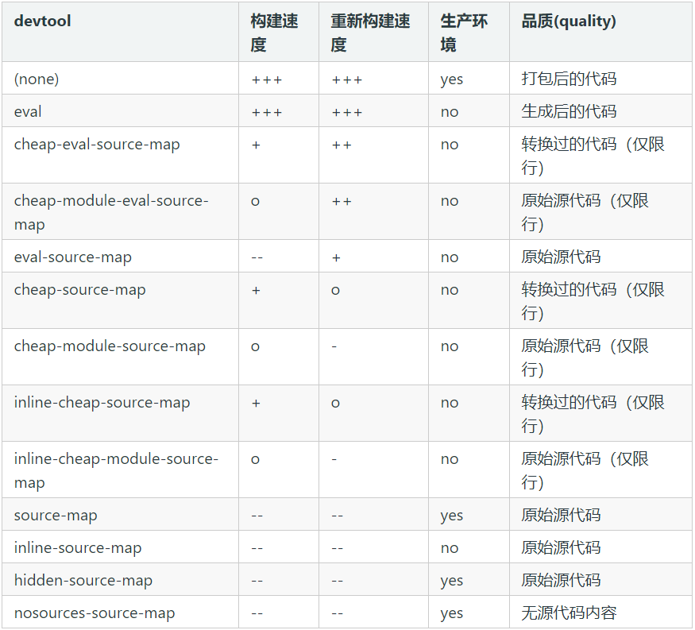

# [#](https://cchroot.github.io/interview/pages/interview notes/Webpack 性能优化.html#webpack-性能优化)Webpack 性能优化

这篇文章的优化内容是建立在 webpack 4.x 上的，后面也会有 webpack 5.x 相关的介绍

## [#](https://cchroot.github.io/interview/pages/interview notes/Webpack 性能优化.html#优化方式总览)优化方式总览

**加快构建速度(打包速度)**

使用 speed-measure-webpack-plugin 插件可以测量各个插件和loader所花费的时间，量化打包速度，判断优化效果

1. 缩小文件的搜索范围(配置include/exclude resolve.modules resolve.mainFields alias noParse extensions)
   1. 通过 exclude、include 配置来确保转译尽可能少的文件
   2. 优化 resolve.modules 配置
   3. 优化 resolve.mainFields 配置
   4. alias
   5. noParse
   6. extensions
2. 在一些性能开销较大的 loader 之前添加 cache-loader，将结果缓存中磁盘中
3. 使用 happypack 开启多进程打包
4. 除了使用 Happypack 外，我们也可以使用 thread-loader 开启多进程打包 loader
5. 使用 HardSourceWebpackPlugin 为模块提供中间缓存，第二次构建可大量节约时间
6. 使用 IgnorePlugin 忽略第三方包指定目录，例如 moment 的本地语言包
7. 使用 webpack-parallel-uglify-plugin 开启 JS 多进程压缩

**减少打包文件体积**

引入 webpack-bundle-analyzer 分析打包后的文件，判断哪些包还可以拆分和优化

1. 使用 externals 配置，然后将 JS 文件、CSS 文件和存储在 CDN
2. 使用 DllPlugin（动态链接库）将 bundles 拆分，使用 DllReferencePlugin(索引链接) 对 manifest.json 引用，让一些基本不会改动的代码先打包成静态资源，避免反复编译浪费时间
3. 使用 optimization.splitChunks 配置抽离公共代码
4. 使用 IgnorePlugin 忽略第三方包指定目录，例如 moment 的本地语言包（重复）
5. 使用 url-loader 或 image-webpack-loader 对图片进行转化或者压缩处理
6. 优化 SourceMap，开发环境推荐： cheap-module-eval-source-map，生产环境推荐： cheap-module-source-map
7. 按需加载，项目中的路由懒加载
8. webpack自身的优化：
   1. tree-shaking，在生产环境下，会自动移除没有使用到的代码
   2. scope hosting 作用域提升，变量提升，可以减少一些变量声明
   3. babel 配置的优化，配置 @babel/plugin-transform-runtime，重复使用 Babel 注入的帮助程序，以节省代码大小的插件。

## [#](https://cchroot.github.io/interview/pages/interview notes/Webpack 性能优化.html#加快-webpack-构建速度-打包速度)加快 Webpack 构建速度(打包速度)

### [#](https://cchroot.github.io/interview/pages/interview notes/Webpack 性能优化.html#使用-speed-measure-webpack-plugin-插件测量打包速度)使用 speed-measure-webpack-plugin 插件测量打包速度

使用 speed-measure-webpack-plugin 插件可以测量各个插件和 loader 所花费的时间，量化打包速度，对比前后的信息，判断优化效果。

使用方式很简单，可以直接用其来包裹 Webpack 的配置:

```js
//webpack.config.js
const SpeedMeasurePlugin = require("speed-measure-webpack-plugin");
const smp = new SpeedMeasurePlugin();

const config = {
    //...webpack配置，不用在写 module.exports
}

module.exports = smp.wrap(config);
```


### [#](https://cchroot.github.io/interview/pages/interview notes/Webpack 性能优化.html#_1-缩小文件的搜索范围-配置include-exclude-resolve-modules-resolve-mainfields-alias-noparse-extensions)1.缩小文件的搜索范围(配置include/exclude resolve.modules resolve.mainFields alias noParse extensions)

#### [#](https://cchroot.github.io/interview/pages/interview notes/Webpack 性能优化.html#exclude-include)exclude/include

在使用 Loader 时可以通过 test 、 include 、 exclude 三个配置项来命中 Loader 要应用规则的文件。 为了尽可能少的让文件被 Loader 处理，可以通过 include 去命中只有哪些文件需要被处理。

exclude 指定要排除的文件，include 指定要包含的文件。exclude 的优先级高于 include，在 include 和 exclude 中使用绝对路径数组，尽量避免 exclude，更倾向于使用 include。

例如在配置 babel-loader 时，可以这样：

```js
const path = require('path');
module.exports = {
  module: {
    rules: [
      {
        // 如果项目源码中只有 js 文件就不要写成 /\.jsx?$/，提升正则表达式性能
        test: /\.js$/,
        // babel-loader 支持缓存转换出的结果，通过 cacheDirectory 选项开启
        use: ['babel-loader?cacheDirectory'],
        // 只对项目根目录下的 src 目录中的文件采用 babel-loader
        include: path.resolve(__dirname, 'src'),
      },
    ]
  },
};
```


#### [#](https://cchroot.github.io/interview/pages/interview notes/Webpack 性能优化.html#优化-resolve-modules-配置)优化 resolve.modules 配置

使用 resolve 配置 webpack 去哪些目录下寻找第三方模块

当安装的第三方模块都放在项目根目录下的 ./node_modules 目录下时，没有必要按照默认的方式去一层层的寻找，可以指明存放第三方模块的绝对路径，以减少寻找，配置如下：

```js
const path = require('path');
module.exports = {
  //...
  resolve: {
  // 使用绝对路径指明第三方模块存放的位置，以减少搜索步骤
  // 其中 __dirname 表示当前工作目录，也就是项目根目录
     modules: [path.resolve(__dirname, 'node_modules')],
  }
}
```


#### [#](https://cchroot.github.io/interview/pages/interview notes/Webpack 性能优化.html#优化-resolve-mainfields-配置)优化 resolve.mainFields 配置

resolve.mainFields 用于配置第三方模块使用哪个入口文件

为了减少搜索步骤，在你明确第三方模块的入口文件描述字段时，你可以把它设置的尽量少。 由于大多数第三方模块都采用 main 或 index 字段去描述入口文件的位置，可以这样配置 Webpack：

```js
module.exports = {
  resolve: {
    // 采用 main 或 index 字段作为入口文件描述字段，以减少搜索步骤
    mainFields: ['main', 'index'],
  },
};
```


这个配置一般很较少用，要注意所有第三方模块的入口文件。

#### [#](https://cchroot.github.io/interview/pages/interview notes/Webpack 性能优化.html#resolve-alias)resolve.alias

resolve.alias 配置项以通过别名的方式来映射一个路径，能让 Webpack 更快找到路径。

例如使用以下配置：

```js
// Webpack alias 配置
resolve:{
  alias:{
    components: './src/components/'
  }
}
```


当你通过 import Button from 'components/button' 导入时，实际上被 alias 等价替换成了 import Button from './src/components/button'。

默认情况下 Webpack 会从入口文件 `./node_modules/react/react.js` 开始递归的解析和处理依赖的几十个文件，这会时一个耗时的操作。 通过配置 resolve.alias 可以让 Webpack 在处理 React 库时，直接使用单独完整的 react.min.js 文件，从而跳过耗时的递归解析操作:

```js
module.exports = {
  resolve: {
    // 使用 alias 把导入 react 的语句换成直接使用单独完整的 react.min.js 文件，
    // 减少耗时的递归解析操作
    alias: {
      'react': path.resolve(__dirname, './node_modules/react/dist/react.min.js'), // react15
      // 'react': path.resolve(__dirname, './node_modules/react/umd/react.production.min.js'), // react16
    }
  },
};
```


除了 React 库外，大多数库发布到 Npm 仓库中时都会包含打包好的完整文件，对于这些库你也可以对它们配置 alias。

但是对于有些库使用本优化方法后会影响到后面要讲的使用 Tree-Shaking 去除无效代码的优化，因为打包好的完整文件中有部分代码你的项目可能永远用不上。 一般对整体性比较强的库采用本方法优化，因为完整文件中的代码是一个整体，每一行都是不可或缺的。 但是对于一些工具类的库，例如 lodash，你的项目可能只用到了其中几个工具函数，你就不能使用本方法去优化，因为这会导致你的输出代码中包含很多永远不会执行的代码。

alias 还支持 $ 符号来缩小范围到只命中以关键字结尾的导入语句：

```js
resolve:{
  alias:{
    'react$': '/path/to/react.min.js'
  }
}
```


react$ 只会命中以 react 结尾的导入语句，即只会把 import 'react' 关键字替换成 import '/path/to/react.min.js'。

#### [#](https://cchroot.github.io/interview/pages/interview notes/Webpack 性能优化.html#noparse)noParse

如果一些第三方模块没有 AMD/CommonJS 规范版本，可以使用 noParse 来标识这个模块，这样 Webpack 会引入这些模块，但是不进行转化和解析，从而提升 Webpack 的构建性能 ，例如：jquery 、lodash。

在上面的 优化 resolve.alias 配置 中讲到单独完整的 react.min.js 文件就没有采用模块化，让我们来通过配置 module.noParse 忽略对 react.min.js 文件的递归解析处理， 相关 Webpack 配置如下：

```js
const path = require('path');

module.exports = {
  module: {
    // 独完整的 `react.min.js` 文件就没有采用模块化，忽略对 `react.min.js` 文件的递归解析处理
	// noParse 属性的值是一个正则表达式或者是一个 function
    noParse: [/react\.min\.js$/] // /jquery|lodash/
  },
};
```


#### [#](https://cchroot.github.io/interview/pages/interview notes/Webpack 性能优化.html#resolve-extensions)resolve.extensions

webpack 会根据 extensions 定义的后缀查找文件(频率较高的文件类型优先写在前面)， 默认是 `extensions: ['.js', '.json']`

也就是说当遇到 require('./data') 这样的导入语句时，Webpack 会先去寻找 ./data.js 文件，如果该文件不存在就去寻找 ./data.json 文件，如果还是找不到就报错。

如果这个列表越长，或者正确的后缀在越后面，就会造成尝试的次数越多，所以 resolve.extensions 的配置也会影响到构建的性能。 在配置 resolve.extensions 时你需要遵守以下几点，以做到尽可能的优化构建性能：

- 后缀尝试列表要尽可能的小，不要把项目中不可能存在的情况写到后缀尝试列表中
- 频率出现最高的文件后缀要优先放在最前面，以做到尽快的退出寻找过程
- 在源码中写导入语句时，要尽可能的带上后缀，从而可以避免寻找过程。例如在你确定的情况下把 require('./data') 写成 require('./data.json')

Webpack 配置如下：

```js
module.exports = {
  resolve: {
    // 尽可能的减少后缀尝试的可能性
    extensions: ['js'],
  },
};
```


### [#](https://cchroot.github.io/interview/pages/interview notes/Webpack 性能优化.html#_2-使用-cache-loader-将结果缓存中磁盘中)2.使用 cache-loader，将结果缓存中磁盘中

在一些性能开销较大的 loader 之前添加 cache-loader，将结果缓存中磁盘中。默认保存在 `node_modueles/.cache/cache-loader` 目录下。它所做的事情很简单，就是 babel-loader 开启 cache 后做的事情，将 loader 的编译结果写入硬盘缓存。再次构建会先比较一下，如果文件较之前的没有发生变化则会直接使用缓存。

安装：

```shell
npm i cache-loader -D
```

1

cache-loader 的配置很简单，放在其他 loader 之前即可。修改Webpack 的配置如下:

```js
module.exports = {
  module: {
    // 例如 babel-loader 耗时比较长，给它配置 cache-loader 放在 loader 之前
    rules: [
      {
        test: /\.jsx?$/,
        use: ['cache-loader','babel-loader']
      }
    ]
  }
}
```


如果只打算给 babel-loader 配置 cache 的话，也可以不使用 cache-loader，给 babel-loader 增加选项 cacheDirectory。

cacheDirectory：默认值为 false。当设置为 true 时，指定的目录将用来缓存 loader 的执行结果。之后的 Webpack 构建，将会尝试读取缓存，来避免在每次执行时，可能产生的、高性能消耗的 Babel 重新编译过程。使用默认缓存目录：`node_modules/.cache/babel-loader`。

使用方法：

```js
loader: 'babel-loader?cacheDirectory=true'
```


### [#](https://cchroot.github.io/interview/pages/interview notes/Webpack 性能优化.html#_3-使用-happypack-开启多进程打包)3.使用 happypack 开启多进程打包

受限于 Node 是单线程运行的，所以 Webpack 在打包的过程中也是单线程的，特别是在执行 Loader 的时候，解析转换以及代码的压缩中的时间很长，这样就会导致构建时间变长。

HappyPack 的基本原理是将这部分任务分解到多个子进程中去并行处理，子进程处理完成后把结果发送到主进程中，从而减少总的构建时间:

安装

```js
npm i happypack -D
```

1置文件：

```js
const Happypack = require('happypack');
module.exports = {
  module: {
    rules: [
      {
        test: /\.js[x]?$/,
        use: 'Happypack/loader?id=js',
        include: [path.resolve(__dirname, 'src')]
      },
      {
        test: /\.css$/,
        use: 'Happypack/loader?id=css',
        include: [
          path.resolve(__dirname, 'src'),
          path.resolve(__dirname, 'node_modules', 'bootstrap', 'dist')
        ]
      }
    ]
  },
  plugins: [
    new Happypack({
      id: 'js', // 和rule中的 id=js 对应
      // 将之前 rule 中的 loader 删除，在此配置
      use: ['babel-loader'] //必须是数组
    }),
    new Happypack({
      id: 'css',// 和rule中的 id=css 对应
      use: ['style-loader', 'css-loader','postcss-loader'],
    })
  ]
}
```


### [#](https://cchroot.github.io/interview/pages/interview notes/Webpack 性能优化.html#_4-thread-loader)4.thread-loader

除了使用 Happypack 外，我们也可以使用 thread-loader ，把 thread-loader 放置在其它 loader 之前，那么放置在这个 loader 之后的 loader 就会在一个单独的 worker 池中运行。

在 worker 池(worker pool)中运行的 loader 是受到限制的。例如：

- 这些 loader 不能产生新的文件。
- 这些 loader 不能使用定制的 loader API（也就是说，通过插件）。
- 这些 loader 无法获取 webpack 的选项设置。

安装：

```shell
npm i thread-loader -D
```


修改配置文件：

```js
module.exports = {
  module: {
    // 配置 thread-loader 放在所有 loader 之前（包括 cache-loader）
    rules: [
      {
        test: /\.jsx?$/,
        use: ['thread-loader', 'cache-loader', 'babel-loader']
      }
    ]
  }
}
```


### [#](https://cchroot.github.io/interview/pages/interview notes/Webpack 性能优化.html#_5-使用-hard-source-webpack-plugin-为模块提供中间缓存)5.使用 hard-source-webpack-plugin 为模块提供中间缓存

HardSourceWebpackPlugin 为模块提供中间缓存，缓存默认的存放路径是: node_modules/.cache/hard-source。

配置 hard-source-webpack-plugin，首次构建时间没有太大变化，但是第二次开始，构建时间大约可以节约 80%。

安装依赖:

```shell
npm i hard-source-webpack-plugin -D
```


修改配置文件：

```js
//webpack.config.js
var HardSourceWebpackPlugin = require('hard-source-webpack-plugin');
module.exports = {
  plugins: [
    new HardSourceWebpackPlugin()
  ]
}
```


需要注意的是 hard-source-webpack-plugin 存在一些坑，如果遇到某些配置不生效了，例如热更新失效，或者某些配置不生效等，可以查看[HardSourceWebpackPlugin文档 (opens new window)](https://www.npmjs.com/package/hard-source-webpack-plugin)，文档中列出了一些你可能会遇到的问题以及如何解决。

### [#](https://cchroot.github.io/interview/pages/interview notes/Webpack 性能优化.html#_6-使用-ignoreplugin-忽略第三方包指定目录)6.使用 IgnorePlugin 忽略第三方包指定目录

IgnorePlugin 是 webpack 的内置插件，作用是忽略第三方包指定目录。例如: moment (2.24.0版本) 会将所有本地化内容和核心功能一起打包，我们就可以使用 IgnorePlugin 在打包时忽略本地化内容。

```js
//webpack.config.js
module.exports = {
  plugins: [
    // 忽略 moment 下的 ./locale 目录
    new webpack.IgnorePlugin(/^\.\/locale$/, /moment$/)
  ]
}
```


忽略 moment 下的 ./locale 目录后，如果我们需要指定语言，那么需要我们手动的去引入语言包，例如，引入中文语言包:

```js
import moment from 'moment';
import 'moment/locale/zh-cn';// 手动引入自己需要的语言包
```


index.js 中只引入 moment，打包出来的 bundle.js 大小和配置了 IgnorePlugin，单独引入 `moment/locale/zh-cn`，构建出来的包大小为大概差距有 200k 左右。

### [#](https://cchroot.github.io/interview/pages/interview notes/Webpack 性能优化.html#_7-关于使用-webpack-parallel-uglify-plugin-增强代码压缩)7.关于使用 webpack-parallel-uglify-plugin 增强代码压缩

在 Webpack3 中，我们一般使用 UglifyJS 来压缩代码，但是这个是单线程运行的，为了加快效率，我们可以使用 webpack-parallel-uglify-plugin 来并行运行 UglifyJS，从而提高效率。

但是在 webpack4.x 内置默认使用 TerserWebpackPlugin，在 mode 设置为 production 就会默认开启 TerserWebpackPlugin，所以可以不用配置 webpack-parallel-uglify-plugin

## [#](https://cchroot.github.io/interview/pages/interview notes/Webpack 性能优化.html#减少打包文件体积)减少打包文件体积

### [#](https://cchroot.github.io/interview/pages/interview notes/Webpack 性能优化.html#引入-webpack-bundle-analyzer-分析打包后的文件)引入 webpack-bundle-analyzer 分析打包后的文件

借助 webpack-bundle-analyzer 可以分析打包后的文件，判断哪些包体积过大，是否可以拆分和优化

安装依赖：

```shell
npm i webpack-bundle-analyzer -D
```


使用也很简单，修改我们的配置文件：

```js
const BundleAnalyzerPlugin = require('webpack-bundle-analyzer').BundleAnalyzerPlugin;
module.exports =  {
  plugins: [
    new BundleAnalyzerPlugin({
	  analyzerHost: '127.0.0.1', // 默认这两个配置都可以不配
	  analyzerPort: 8889 // 默认 8888
	}),
  ]
}
```


接下来在 package.json 里配置启动命令 (不配置也可以，npm run build 打包时，会默认打开： http://127.0.0.1:8888/)

```shell
"analyz": "NODE_ENV=production npm_config_report=true npm run build" 
```


复制代码 windows 请安装 `npm i -D cross-env`

```shell
"analyz": "cross-env NODE_ENV=production npm_config_report=true npm run build"
```


复制代码接下来 npm run analyz 浏览器会自动打开文件依赖图的网页

### [#](https://cchroot.github.io/interview/pages/interview notes/Webpack 性能优化.html#_1-使用-externals-配置-然后将-js-文件、css-文件和存储在-cdn)1.使用 externals 配置，然后将 JS 文件、CSS 文件和存储在 CDN

如果我们想引用一个库，但是又不想让 webpack 打包，并且又不影响我们在程序中以 CMD、AMD 或者 window/global 全局等方式进行使用，那就可以通过配置 Externals。这个功能主要是用在创建一个库的时候用的，但是也可以在我们项目开发中充分使用 Externals 的方式，我们将这些不需要打包的静态资源从构建逻辑中剔除出去，而使用 CDN 的方式，去引用它们。

官方案例:

```html
<script src="https://code.jquery.com/jquery-3.1.0.js"></script>
```


```js
module.exports = {
  //...
  externals: {
    jquery: 'jQuery'
  }
};

// 这里需要注意，’:’ 号后面对应的文件名必须和项目里面 import 引入的文件昵称相同，例如： import Vue from 'vue' 就是上面对应的 'vue': 'Vue'。
// 这里特别注意一下 element-ui 的昵称必须是: ‘ELEMENT’, 如果使用其它昵称将报错。具体看 element-ui 源码导出方式你就懂了~
```


```js
// 项目中也可以正常 import
import $ from 'jquery';
$('.my-element').animate(/* ... */);
```


在项目中经常把各种库文件使用 CDN 加载，然后通过 html-webpack-plugin 插入到模板页面中。

### [#](https://cchroot.github.io/interview/pages/interview notes/Webpack 性能优化.html#_2-使用-dllplugin-动态链接库-将-bundles-拆分)2.使用 DllPlugin（动态链接库）将 bundles 拆分

有些时候，如果所有的JS文件都打成一个JS文件，会导致最终生成的JS文件很大，这个时候，我们就要考虑拆分 bundles。

使用 DllPlugin（动态链接库）将 bundles 拆分，使用 DllReferencePlugin(索引链接) 对 manifest.json 引用，让一些基本不会改动的代码和不会频繁更新的库先打包成静态资源，避免反复编译浪费时间。例如我们将 react 和 react-dom 单独打包成一个动态链接库：

```js
const webpack = require('webpack');
const path = require('path');

module.exports = {
  entry: {
    react: ['react', 'react-dom']
  },
  mode: 'production',
  output: {
    filename: '[name].dll.[hash:6].js',
    path: path.resolve(__dirname, 'dist', 'dll'),
    library: '[name]_dll' // 暴露给外部使用
    // libraryTarget 指定如何暴露内容，缺省时就是 var
  },
  plugins: [
    new webpack.DllPlugin({
      // name 和 library一致
      name: '[name]_dll', 
      path: path.resolve(__dirname, 'dist', 'dll', 'manifest.json') //manifest.json 的生成路径
    })
  ]
}
```


### [#](https://cchroot.github.io/interview/pages/interview notes/Webpack 性能优化.html#_3-使用-optimization-splitchunks-配置抽离公共代码)3.使用 optimization.splitChunks 配置抽离公共代码

抽离公共代码是对于多页应用来说的，如果多个页面引入了一些公共模块，那么可以把这些公共的模块抽离出来，单独打包。公共代码只需要下载一次就缓存起来了，避免了重复下载。

抽离公共代码是 webpack 内置的，在 optimization.splitChunks 中配置：

```js
module.exports = {
  optimization: {
    splitChunks: {// 分割代码块
      cacheGroups: {
        vendor: {
          // 第三方依赖
          priority: 1, // 设置权重，首先抽离第三方模块
          name: 'vendor',
          test: /node_modules/,
          chunks: 'initial',
          minSize: 0,
          minChunks: 3 //最少引入了3次
        },
        //缓存组
        common: {
          // 公共模块
          chunks: 'initial',
          name: 'common',
          minSize: 10, // 大小超过10个字节
          minChunks: 2 // 最少引入了2次
        }
      }
    }
  }
}
```


### [#](https://cchroot.github.io/interview/pages/interview notes/Webpack 性能优化.html#_4-使用-ignoreplugin-忽略第三方包指定目录-例如-moment-的本地语言包-重复)4.使用 IgnorePlugin 忽略第三方包指定目录，例如 moment 的本地语言包（重复）

IgnorePlugin 也有减少打包文件体积的作用，这里也列出来，但是和上加快构建速度一样，就不再重复说明

### [#](https://cchroot.github.io/interview/pages/interview notes/Webpack 性能优化.html#_5-使用-url-loader-和-image-webpack-loader-对图片进行转化和压缩处理)5.使用 url-loader 和 image-webpack-loader 对图片进行转化和压缩处理

如果本地图片比较多的话，采用 image-webpack-loader 压缩后，再对比较小的图片根据 url-loader 来进转化为 base64 格式，可以有效减少打包文件的体积和图片的 http 请求数量。

配置（注意 loader 从上到下，先右后左执行）：

```js
module.exports = {
  module: {
    rules: [
      {
        test: /\.(png|gif|jpe?g|svg)$/i,
    	exclude:[path.resolve(process.cwd(), 'src/assets/css')],
    	use: [
          {
            loader: 'url-loader',
            options: {
              limit: 1024,
              name: '[hash:8].[ext]',
              useRelativePath: false,
              outputPath: function(fileName){
                return 'assets/images/'+fileName
              }
            }
          },
          {
            loader:'image-webpack-loader'
          }
    	]
	  }
    ]
  }
}
```


### [#](https://cchroot.github.io/interview/pages/interview notes/Webpack 性能优化.html#_6-优化-source-map)6.优化 source map

**什么是 source map**？

我们打包，将开发环境中的源代码经过压缩，去空格，babel 编译转化，最终可以得到适用于生产环境的代码。但这样处理后的代码和源代码之间存在很大的差异，难以阅读且无法 debug。

如果压缩等处理过的生产环境中的代码出现 bug，那么调试的时候只能定位到压缩处理后的代码的位置，无法定位到开发环境中源码位置。source map 就是为解决上述的代码定位问题。方便开发人员 debug，定位错误。

在 webpack 中提供了十几种 source map 的组合：



+++ 非常快速, ++ 快速, + 比较快, o 中等, - 比较慢, -- 慢

其中一些值适用于开发环境，一些适用于生产环境。对于开发环境，通常希望更快速的 source map，需要添加到 bundle 中以增加体积为代价，但是对于生产环境，则希望更精准的 source map，需要从 bundle 中分离并独立存在。

**在不同环境中如何选择 source map 的类型**

1. 首先在源代码的列信息是没有意义的，只要有行信息就能完整的建立打包前后代码之间的依赖关系。因此，不管是开发还是生产环境都会增加 cheap 属性来忽略模块打包后的列信息关联
2. 不管是生产环境还是开发环境，我们都需要定位 debug 到最原始的资源，比如定位错误到 jsx，ts 的原始代码，而不是经编译后的 js 代码。所以不可以忽略掉 module 属性
3. 需要生成 .map 文件，所以得有 source-map 属性

所有有:

- 开发环境推荐使用：cheap-module-eval-source-map
- 生产环境推荐使用：cheap-module-source-map

更详细的介绍请看官网：[devtool(opens new window)](https://www.webpackjs.com/configuration/devtool/)

### [#](https://cchroot.github.io/interview/pages/interview notes/Webpack 性能优化.html#_7-按需加载)7.按需加载，

在 vue 和 react 单页面项目中，我们一般会通过路由懒加载来实现按需加载，这里就不再赘述

### [#](https://cchroot.github.io/interview/pages/interview notes/Webpack 性能优化.html#_8-webpack4-x-后版本自身的优化)8. webpack4.x 后版本自身的优化：

#### [#](https://cchroot.github.io/interview/pages/interview notes/Webpack 性能优化.html#tree-shaking)Tree Shaking

Tree Shaking 可以实现删除项目中未被引用的代码，即会自动移除没有使用到的代码

```text
// test.js
export const a = 1
export const b = 2
// index.js
import { a } from './test.js'
```


对于以上情况，test 文件中的变量 b 如果没有在项目中使用到的话，就不会被打包到文件中。

如果你使用 Webpack4.x 的话，生产环境就会自动启动这个优化功能。

#### [#](https://cchroot.github.io/interview/pages/interview notes/Webpack 性能优化.html#scope-hosting-作用域提升-变量提升-可以减少一些变量声明)scope hosting 作用域提升，变量提升，可以减少一些变量声明

Scope Hoisting 会分析出模块之间的依赖关系，尽可能的把打包出来的模块合并到一个函数中去，在生产环境下，默认开启。

比如我们希望打包两个文件

```js
// a.js
export const a = 1
// index.js
import { a } from './a.js'
```


对于这种情况，我们打包出来的代码会类似这样

```js
[
  /* 0 */
  function (module, exports, require) {
    //...
  },
  /* 1 */
  function (module, exports, require) {
    //...
  }
]
```


使用 Scope Hoisting 的话，代码就会尽可能的合并到一个函数中去，也就变成了这样的类似代码

```js
[
  /* 0 */
  function (module, exports, require) {
    //...
  }
]
```


这样的打包方式生成的代码明显比之前的少多了。如果在 Webpack4 中你希望开启这个功能，只需要启用 optimization.concatenateModules 就可以了，生产环境默认开启。

```js
module.exports = {
  optimization: {
    concatenateModules: true
  }
}
```


#### [#](https://cchroot.github.io/interview/pages/interview notes/Webpack 性能优化.html#babel-配置的优化)babel 配置的优化

配置 `@babel/plugin-transform-runtime`，重复使用 Babel 注入的帮助程序，以节省代码大小的插件。

在不配置 ·`@babel/plugin-transform-runtime` 时，babel 会使用很小的辅助函数来实现类似 _createClass 等公共方法。默认情况下，它将被注入(inject)到需要它的每个文件中。但是这样的结果就是导致构建出来的JS体积变大。

我们也并不需要在每个 js 中注入辅助函数，因此我们可以使用 `@babel/plugin-transform-runtime`，`@babel/plugin-transform-runtime` 是一个可以重复使用 Babel 注入的帮助程序，以节省代码大小的插件。

因此我们可以在 `.babelrc` 中增加 `@babel/plugin-transform-runtime` 的配置:

```js
{
  "presets": [],
  "plugins": [
    [
      "@babel/plugin-transform-runtime"
    ]
  ]
}
```


## [#](https://cchroot.github.io/interview/pages/interview notes/Webpack 性能优化.html#关于-webpack-5-x)关于 webpack 5.x

虽然我们在项目中大部分童鞋可能还是使用的 4.x 版本，但是 webpack 当前最新的版本已经是 5.10.1 了，那么 5.x 版本主要更新了什么呢？

### [#](https://cchroot.github.io/interview/pages/interview notes/Webpack 性能优化.html#_1-剔除npm包里面针对node-js模块自动引用的polyfills)1.剔除npm包里面针对Node.js模块自动引用的Polyfills

Webpack 4.x 编译引入 npm 包，有些 npm 包里面包含针对 nodejs 的 polyfills，polyfill 会加到最终的 bundle 中，实际前端浏览器是不需要的，5.x 后的版本会自动剔除

Webpack 5.x 版本编译中，会出现 polyfill 添加提示，如果不需要 node polyfille,按照提示 alias 设置为 false 即可

```js
// webpack.config.js
resolve: {
  // 1.不需要 node polyfilss
  alias: {
    crypto: false
  },
  // 2.若需要，可以手动添加 polyfills
  // fallback: {
  //   "crypto": require.resolve('crypto-browserify')
  // }
}
```


### [#](https://cchroot.github.io/interview/pages/interview notes/Webpack 性能优化.html#_2-长期缓存优化)2.长期缓存优化

Webpack 4.x 是根据代码的结构生成 chunkhash，现在 5.x 根据完全内容生成 chunkhash，比如改了内容的注释或者变量则不会引起 chunkhash 的变化，让浏览器继续使用缓存：

Webpack 5.x 针对 moduleId 和 chunkId 的计算方式进行了优化，增加确定性的 moduleId 和 chunkId 的生成策略。moduleId 根据上下文模块路径，chunkId 根据 chunk 内容计算，最后为 moduleId 和 chunkId 生成 3 ~ 4 位的数字 id，实现长期缓存，生产环境下默认开启。

### [#](https://cchroot.github.io/interview/pages/interview notes/Webpack 性能优化.html#_3-持久缓存优化)3.持久缓存优化

在 Webpack 4.x 我们一般采用 `cache-loader` 或者 `babel-loader` 自带的 `cacheDirectory` 来进行缓存操作，在 Webpack 5.x 中缓存默认是 memory，你可以修改设置写入硬盘：

```js
module.exports = { 
  cache: {
    // 1. 将缓存类型设置为文件系统
    type: 'filesystem', // 默认是memory
    // 2. 将缓存文件夹命名为 .temp_cache,
    // 默认路径是 node_modules/.cache/webpack
    cacheDirectory: path.resolve(__dirname, '.temp_cache')
  }
}
```


第一次构建是一次全量构建，它会利用磁盘模块缓存(以空间换时间)，使得后续的构建从中获利

续构建具体流程是：读取磁盘缓存 -> 校验模块 -> 解封模块内容。

### [#](https://cchroot.github.io/interview/pages/interview notes/Webpack 性能优化.html#_4-更好的tree-shacking-构建优化)4.更好的Tree Shacking(构建优化)

现在有这样一段代码：

```js
// inner.js
export const a = 'aaaaaaaaaa';
export const b = 'bbbbbbbbbb';

// module.js
import * as inner from "./inner";
export { inner };

// index.js
import * as module from "./module";
console.log(module.inner.a);
```


在 Webpack 4.x 中毫无疑问，以上代码 a、b 变量是被全部打包的。但我们只调用了 a 变量，理想情况应该是 b 被识别为 unused，不被打包。这一优化在 Webpack 5.x 中实现了。 在 Webpack 5.x 中会分析模块 export 与 import 之间的依赖关系，最终的代码生成非常简洁：

```js
!function(){"use strict";console.log("aaaaaaaaaa")}();
```


### [#](https://cchroot.github.io/interview/pages/interview notes/Webpack 性能优化.html#_5-module-federation-模板联邦)5.Module Federation(模板联邦)

上面 4 点优化都是对 webpack 常规优化，而 Module Federation 就是 Webpack 5.x 中的重大的变革了

Module Federation 让 Webpack 达到了线上 runtime 的效果，让 chunk 直接在独立应用间利用 CDN 直接共享，不再需要本地安装 NPM 包、构建再发布了

**之前我们希望共享代码是如何做的**？

- NPM

维护一个 CommonComponents 的 NPM 包，在不同项目中安装、使用。如果 NPM 包升级，对应项目都需要安装新版本，本地编译，打包到 bundle 中

- UMD

UMD 优点在 runtime。缺点也明显，体积优化不方便，容易有版本冲突

- 微前端

独立应用间的共享也是问题。一般有两种打包方式：

```
1. 子应用独立打包，模块解耦了，但公共的依赖不易维护处理
2. 整体应用一起打包，能解决公共依赖；但庞大的多个项目又使打包变慢，后续也不好扩展
```

**Webpack 5.x 实现了全新的解决方案**

这个方案是直接将一个应用的 bundle，应用于另一个应用，动态分发 runtime 子模块给其他应用

使用方式如下：

```js
module.exports = {
  // other webpack configs...
  plugins: [
    new ModuleFederationPlugin({
      // 1. name 当前应用名称，需要全局唯一
      name: "app_one_remote",
      // 2. remotes 可以将其他项目的 name 映射到当前项目中
      remotes: {
        app_two: "app_two_remote",
        app_three: "app_three_remote"
      },
      // 3. exposes 表示导出的模块，只有在此申明的模块才可以作为远程依赖被使用
      exposes: {
        AppContainer: "./src/App"
      },
      // 4. shared可以让远程加载的模块对应依赖改为使用本地项目的 React或ReactDOM。
      shared: ["react", "react-dom", "react-router-dom"]
    }),
    new HtmlWebpackPlugin({
      template: "./public/index.html",
      chunks: ["main"]
    })
  ]
};
```


比如设置了 `remotes: { app_two: "app_two_remote" }`，在代码中就可以直接利用以下方式直接从对方应用调用模块:

```js
import { Search } from "app_two/Search";
app_two/Search来自于app_two 的配置:

// app_two的webpack 配置
export default {
  plugins: [
    new ModuleFederationPlugin({
      name: "app_two",
      library: { type: "var", name: "app_two" },
      filename: "remoteEntry.js",
      exposes: {
        Search: "./src/Search"
      },
      shared: ["react", "react-dom"]
    })
  ]
};
```


正是因为 Search 在 exposes 被导出，我们因此可以使用 `[name]/[exposes_name]` 这个模块，这个模块对于被引用应用来说是一个本地模块。

更多请参考官网 [Module Federation(opens new window)](https://webpack.js.org/concepts/module-federation/#root)

参考链接：

[带你深度解锁Webpack系列(优化篇)(opens new window)](https://juejin.cn/post/6844904093463347208)

[深入浅出 Webpack(opens new window)](https://webpack.wuhaolin.cn/)

[Webpack5 上手测评(opens new window)](https://juejin.cn/post/6844904169405415432#heading-3)