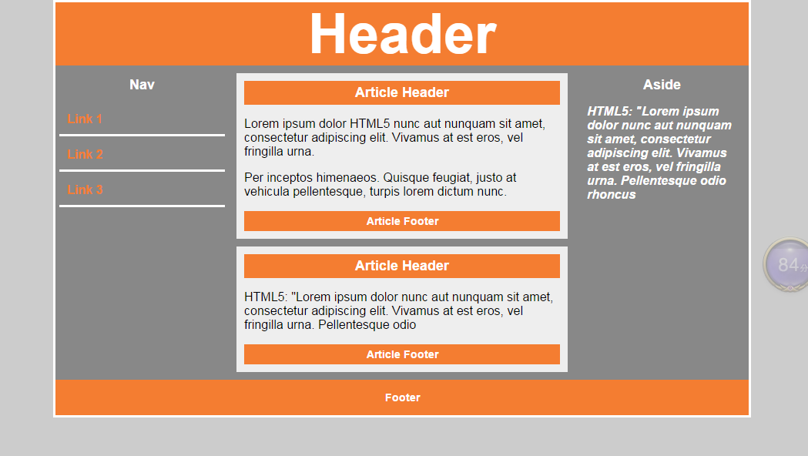

## HTML5发展史

```txt
HTML5草案的前身名为 Web Applications 1.0，于2004年被WHATWG提出，于2007年被W3C接纳，并成立了新的 HTML 工作团队。
	HTML 5 的第一份正式草案已于2008年1月22日公布。HTML5 仍处于完善之中。然而，大部分现代浏览器已经具备了某些 HTML5 支持。

	2012年12月17日，万维网联盟（W3C）正式宣布凝结了大量网络工作者心血的HTML5规范已经正式定稿。根据W3C的发言稿称：“HTML5是开放的Web网络平台的奠基石。”

	2013年5月6日， HTML 5.1正式草案公布。该规范定义了第五次重大版本，第一次要修订万维网的核心语言：超文本标记语言（HTML）。在这个版本中，新功能不断推出，以帮助Web应用程序的作者，努力提高新元素互操作性。

	本次草案的发布，从2012年12月27日至今，进行了多达近百项的修改，包括HTML和XHTML的标签，相关的API、Canvas等，同时HTML5的图像img标签及svg也进行了改进，性能得到进一步提升
```

## 兼容

```txt
支持Html5的浏览器包括Firefox（火狐浏览器），IE9及其更高版本，Chrome（谷歌浏览器），Safari，Opera等；国内的 遨游浏览器（Maxthon），以及基于IE或Chromium（Chrome的工程版或称实验版）所推出的360浏览器、搜狗浏览器、QQ浏览器、猎豹 浏览器等国产浏览器同样具备支持HTML5的能力。
```


## 语法

+ 内容类型（ContentType）

  + HTML5的文件扩展符与内容类型保持不变，仍然为".html"或".htm"

+ DOCTYPE声明

  + <!DOCTYPE html>不区分大小写

+ 指定字符集编码
  
+  <meta charset="UTF-8">
  
+ 可省略标记的元素
  
  + 不允许写结束标记的元素：br、col、embed、hr、img、input、、link、meta	  
+ 可以省略结束标记的元素：
  
  + li、dt、dd、p、option、colgroup、thead、tbody、tfoot、tr、td、th
+  可以省略全部标记的元素：html、head、body、colgroup、tbody
+ 属性值可以使用双引号，也可以使用单引号。


## 语义化标签

```txt
在HTML 5出来之前，我们用div来表示页面章节，但是这些div都没有实际意义。（即使我们用css样式的id和class形容这块内容的意义）。这些标签只是我们提供给浏览器的指令，只是定义一个网页的某些部分。但现在，那些之前没“意义”的标签因为因为html5的出现消失了，这就是我们平时说的“语义”。
```


+ section元素 表示页面中的一个区块
+ article元素 表示一块与上下文无关的独立的内容
+ aside元素 在article之外的，与article内容相关的辅助信息 
+ header元素 表示页面中一个内容区块或整个页面的标题
+ footer元素 表示页面中一个内容区块或整个页面的脚注
+ nav元素 表示页面中导航链接部分
+ figure元素 表示一段独立的内容，使用figcaption元素为其添加标题(第一个或最后一个子元素的位置)
+ main元素 表示页面中的主要的内容(ie不兼容)
+ hgroup标题的一个分组
+ mark定义高亮显示的文本(span)
+ time时间   （目前所有主流浏览器都不支持 <time> 标签。）
+ dialog标记定义一个对话框(会话框)类似微信（  目前只有 Chrome 和 Safari 6 支持 <dialog> 标签。）
+ embed 标记定义外部的可交互的内容或插件 比如flash ；
  	




## 多媒体标签

```html
<video src=""></video> 
<audio src=""></audio>
```

+ 属性
  + controls属性：如果出现该属性，则向用户显示控件，比如播放按钮。
  + autoplay属性：如果出现该属性，则视频在就绪后马上播放。autoplay + muted    可以实现自动播放
  + loop属性：重复播放属性。
  + muted属性：静音属性。
  + poster属性：规定视频正在下载时显示的图像，直到用户点击播放按钮。

+ source
  			<source> 标签为媒介元素（比如 <video> 和 <audio>）定义媒介资源。
        			<source> 标签允许您规定可替换的视频/音频文件供浏览器根据它对媒体类型或者编解码器的支持进行选择。
        			Type属性值：
        				用于视频：video/ogg   video/mp4     video/webm
        				用于音频：audio/ogg   audio/mpeg    audio/mav   

​                           注： object-fit: cover; 可以让视频覆盖整个父容器。

​								

## HTML5表单

+ 新增type类型
  	Type=“email”   限制用户必须输入email类型
    	Type=“url”        限制用户必须输入url类型
    	Type=“range”   产生一个滑动条表单
    	Type=“number”
    	Type=“search”   产生一个搜索意义的表单
    	Type=“color”     生成一个颜色选择的表单
    	Type=“time”      限制用户必须输入时间类型
    	Type=“month”        限制用户必须输入月类型
    	Type=“week”        限制用户必须输入周类型
    	Type=“datetime-local”        选取本地时间
    	type=”date”
+ 新增表单属性
  	 required     监测是否为空。
    	min      最小
    	max      最大
    	step     步幅  确定一个法定值。 -3 0 3 6 9
    	list     必须结合datalist标签，绑定datalist  id名称。
    	autocomplete    是否自动提示信息    属性值   on    off
    	placeholder    文本框的提示信息
    	autofocus      自动聚焦。一个页面只能由一个。
    	pattern    后面的属性值是一个正则表达式。
    	novalidate     取消验证
        multiple     选择（上传）多个

+ 新增表单标签

  + output

  ```html
  <form action="" oninput="x.value=parseInt(a.value)+parseInt(b.value)">
  	<input id="a" type="range" min="0" max="100">100+
  	<input id="b" type="text" value="50">=
  	<output name="x" for="a b"></output>
  </form>
  ```

  + datalist   必须和list属性结合使用。做提示信息。

  ```html
  <input type="url"     list="url_list"    name="link" />
  <datalist    id="url_list"> 
      <option label="W3School" value="http://www.W3School.com.cn" /> 
      <option label="Google" value="http://www.google.com" /> 
      <option label="Microsoft" value="http://www.microsoft.com" /> 
  </datalist>
  ```

  


