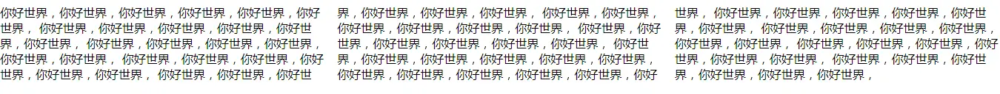

## css3-多列

```txt
多列布局类似报纸或杂志中的排版方式，主要用以控制大篇幅文本。
```



## 多列属性

​	1、column-count

```
属性规定元素应该被分隔的列数
适用于：除table外的非替换块级元素, table cells, inline-block元素
```

​	2、column-gap

```
属性规定列之间的间隔大小
```

​	3、column-rule

```
设置或检索对象的列与列之间的边框。复合属性。
column-rule-color规定列之间规则的颜色。
column-rule-style规定列之间规则的样式。
column-rule-width规定列之间规则的宽度。
```

​	4、column-fill

```
设置或检索对象所有列的高度是否统一
auto：列高度自适应内容
balance：所有列的高度以其中最高的一列统一
```

​	5、column-span

```
设置或检索对象元素是否横跨所有列。
none：不跨列
all：横跨所有列
```

​	6、column-width

```
设置或检索对象每列的宽度
```

​	7、columns

```
设置或检索对象的列数和每列的宽度。复合属性
<' column-width '> || <' column-count '>
```

**注：Internet Explorer 10 和 Opera 支持多列属性。
 	Firefox 需要前缀 -moz-。
 	Chrome 和 Safari 需要前缀 -webkit-。**


## 多列案例（瀑布流）


