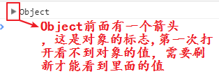
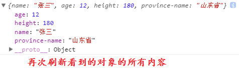
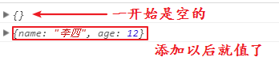
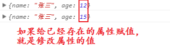

typora-copy-images-to: media

## 函数-下

### 作用域

函数外边的变量叫做全局变量，可以在函数外面和函数里面使用。

```javascript
var num = 1;
function test(){
	num++;
	console.log(num);
}
test(); // 2
console.log(num); // 2
```

函数内部的变量叫做局部变量，只能在函数内部使用。

```javascript
function test(){
	var num1 = 10;
	num1++;
	console.log(num1);
}
test(); // 11
console.log(num1); // 报错，num1未定义
```

有一种情况比较特殊，函数内部声名的变量也是全局变量。

```javascript
function test(){
	num1 = 10;
	num1++;
	console.log(num1);
}
test(); // 11
console.log(num1); // 11
```

总结：

1. 函数外边使用的变量是全局变量，要在全局内找，可以是函数外部声名的变量也可以是函数内部的隐式声名的变量。
2. 函数内部使用的变量是局部变量，先从局部找，如果局部没有，再从全局中找。

### 递归函数

递归函数就是在函数中调用自己。

```javascript
// 求10的阶和，即：10+9+8+...+1
function facSum(num){
	if(num == 1){
		return 1;
	}
	return num + facSum(num-1);
}
var res = facSum(10);
console.log(res); // 55
```

### 事件

#### 概念

事件就是用户在网页上的动作，例如：鼠标点击、鼠标移动、键盘按下。。。

 **事件三要素 :  事件源  + 事件名称 +  事件处理程序** 

- **事件源** : 谁触发这个事件 (按钮  btn)
- **事件名称** : 触发了什么事件 (点击click事件)
- **事件处理程序** : 事件触发后要执行的代码(函数形式)

#### 初体验：

```html
<input type="button" value="按钮" onclick="dian" id="btn">

<script type="text/javascript">
	function dian(){
		alert("点击了按钮！");
	}
</script>
```

<font color="red">**注意：事件处理程序(函数)并不是立马执行，而是当事件触发的时候在会执行（浏览器会自动调用）**</font>

#### 事件列表

| 事件        | 备注                             |
| ----------- | -------------------------------- |
| onclick     | 当鼠标左键单击                   |
| ondblclick  | 当鼠标左键双击                   |
| onmouseover | 当光标在指定的内容上面           |
| onmouseout  | 当光标离开指定的内容             |
| onkeydown   | 当键盘按下的那一刻               |
| onkeyup     | 当键盘抬起的那一刻               |
| onfocus     | 当输入框得到焦点                 |
| onblur      | 当输入框失去焦点                 |
| onchange    | 当指定的标签里面内容有变化的时候 |
| onsubmit    | 提交事件                         |
| onload      | 当整个网页加载完成后             |

通常使用事件来驱动函数：

```shell
对象.事件=function(){}
对象.事件=函数名;// 调用自定义函数，不能加小括号，否则会提前执行
<标签名 事件名="函数调用"></标签名>
```

键盘事件可以区分按下的是哪个键，每个键都由按键码

```javascript
window.onkeydown = function(e){
	var keyNum = e.keyCode
	if(keyNum == "13"){
		alert("回车键");
	}else if(keyNum == "8"){
		alert("BackSpace键");
	}
}
```

#### 事件中的this

当在事件中表示当前元素的时候，可以使用this

```javascript
document.getElementsByTagName("img")[0].onclick=function(){
    this.src="images/2.jpg";
}
```

### 对象

#### 引入

变量是一个容器，可以存储数据。给多个容器中放入商品，就可以得到很多商品，有很多的商品就可以开超市了。

可是超市中的商品都是放在货架上归类存放的，也就需要一个更大的容器来存放很多商品。在js中也有这样的容器，用来存放很多的小容器 -- 对象。

在学习数据类型的时候，学习过对象这种数据类型，他的表现形式：

```js
var arr = [];
var obj = {};
var none = null;
```

这三种不同的表现形式指的都是对象。今天重点学习第二种，使用大括号定义的对象。

#### 定义对象

```js
var obj = {};
var obj = new Object();
```

这是两种定义对象的方式，定义的对象都是空的。要给对象中放入值，需要知道对象存储数据的格式 - 键值对。

语法：

```shell
var obj = {
    键:值,
    键:值,
    ...
};
# 或
var obj = new Object({
    键:值,
    键:值,
    ...
});
```

语法规则：

1. 键，也叫作对象的属性，必须是字符串，但是这个字符串在不包含连字符的时候，可以不加引号 - 建议加上
2. 值可以是任意类型，包括：数字、字符串、布尔、对象、函数...
3. 键值对之间使用逗号隔开
4. 键值对之间没有顺序，先写哪个后写哪个没有关系

例：对象可以用来存储一个人的信息

```js
var obj = {
    "name":"张三",
    age:12,
    height:180,
    "province-name":"山东省"
};
console.log(obj);
```

输出这个对象：

|  |
| ----------------------------------------- |
|  |

#### 访问对象

获取这个对象中的某个属性：

```shell
对象.属性名 # 这种方式的属性名不用加引号
# 或
对象[属性名] # 这种方式的属性名必须加引号
```

例：

```js
var obj = {
    name:"张三",
    age:12
};
console.log(obj.name);
console.log(obj["age"]);
```

对象的属性名类似于变量名，只不过是定义在大括号中的变量，不会被大括号外部的变量名覆盖 - 不会被外部的变量污染。

遍历对象

遍历的意思就是将每一个值都访问一遍。

js提供了专门用来遍历对象的操作语法：

```shell
for(var attr in obj){
    # 这里的attr代表对象属性名
    # obj表示这个对象
}
注只用来遍历对象，遍历数组、伪数组都使用for i=0
```

例：

```shell
var obj = {
    name:"张三",
    age:12,
    height:180
};
for(var i in obj){ // 这里的i表示对象的属性名，是一个字符串
    console.log(obj[i]); // 必须使用中括号来输出
}
```

#### 方法

对象的值可以是任意类型。函数也可以当做一种数据类型来看待。也就是说对象值也可以是函数。

如果对象的某个属性的值是一个函数，就可以将这个属性叫做对象的方法。

```js
var obj2 = {
    name:'王五',
    study:function(){
		console.log("在学习");
    }
}
console.log(obj2);
```

方法的访问和属性是一样的：

```js
obj2.study(); // 因为函数执行需要调用，所以需要加小括号
```

#### 操作

给对象添加属性：

```js
var obj = {};
console.log(obj);
obj.name = '李四';
obj["age"] = 12;
console.log(obj);
```

打印对象的结果：

| 访问结果                                  |
| ----------------------------------------- |
|  |

如果设置的属性名是对象中已经存在的呢？

```js
var obj = {
    name:"张三",
    age:12
}
console.log(obj);
obj.age = 15;
console.log(obj);
```

打印结果：

| 访问结果                                  |
| ----------------------------------------- |
|  |

### 构造函数

#### 引入：

<font color="blue">思考：普通类型的数据能不能添加属性和方法？</font>

```js
var num = 90;
num.index = 12; 
console.log(num.index);
```

报错了，也就是说，普通类型的变量不能添加属性和方法。

我来换一种写法：

```js
var num = new Number(90); // 定义一个数字的另一种方法
num.index = 12; 
console.log(num.index);
```

结果可以访问出来，说明，这种方式定义的数字可以添加属性和方法。

那么，直接定义和new来定义有什么不同？类型不同：

```js
var num = 90;
var num1 = new Number(90);
console.log(typeof num); // number
console.log(typeof num1); // object
```

其实字符串也可以这样来定义，定义后的字符串也可以有属性和方法。

我们发现一个规律，用new创建出来的数据都可以有属性和方法， 因为用new创建出来的变量都是对象。我们把能用new创建对象的这种函数，叫做构造函数。

构造函数没有我们想象中的那个高大上，其实任何函数都可以是构造函数：

```js
function fn(){
	
}
var o = new fn();
console.log(o); // object
```

也就是说，当我们使用new来创建一个对象的时候，这个函数就成了构造函数。

使用new关键来创建对象的函数，叫做构造函数。

我们可以为这个对象添加属性和方法。