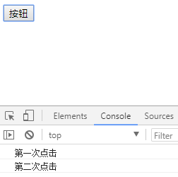
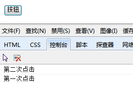

## 事件对象（上）

### 事件复习

事件三要素： 事件源  + 事件名称 +  事件处理程序

- **事件源** : 谁触发这个事件 (按钮  btn)
- **事件名称** : 触发了什么事件 (点击click事件)
- **事件处理程序** : 事件触发后要执行的代码(函数形式)----可以是有名字的函数，要不要加小括号？不加
- 事件有个特点：用完不销毁  -  造成内存

### 事件类型

在事件对象中有个一个属性`type`可以获取到当前事件的类型。

```js
window.onload = function(e){
    var ev = e || window.event;
    console.log(ev.type); // load
}
```


鼠标事件

| 事件        | 描述                             |
| ----------- | -------------------------------- |
| click       | 左键单击                         |
| contextmenu | 右键单击                         |
| dblclick    | 双击                             |
| mousedown   | 左键按下                         |
| mouseup     | 左键弹起                         |
| mouseover   | 鼠标放上去（在子元素上也会触发） |
| mouseout    | 鼠标离开 （同mouseover）         |
| mouseenter  | 鼠标放上去                       |
| mouseleave  | 鼠标离开                         |
| mousemove   | 鼠标移动事件                     |
| mousewheel  | 鼠标滚轮事件                     |

注意：鼠标滚轮事件有兼容性问题，在IE、Chrom中是mousewheel，在FireFox中是DOMMouseScroll，且在FirFox中不能使用on来绑定。在IE和Chrom中向上滚动，事件对象中的wheelDelta是120，向下滚动是-120，在FirFox中向上滚动，事件对象中的e.detail是3，向下滚动是-3。

案例：星星评分

```html
<body>


</body>
<script type="text/javascript">
var imgs = document.querySelectorAll("img");
for(var i=0;i<imgs.length;i++){
    imgs[i].index = i;
    imgs[i].onmouseover=function(){
        for(var j=0;j<=this.index;j++){
            if(j%2==0){
                imgs[j].src = './images/rank_1.gif'
            }else{
                imgs[j].src = './images/rank_2.gif'
            }
        }
        for(var j=this.index+1;j<imgs.length;j++){
            if(j%2==0){
                imgs[j].src = './images/rank_3.gif'
            }else{
                imgs[j].src = './images/rank_4.gif'
            }
        }
    }
}
</script>
```

效果图：

| 星星评分效果图              |
| --------------------------- |
|  |

浏览器事件

| 事件   | 描述     |
| ------ | -------- |
| load   | 加载     |
| unload | 关闭     |
| scroll | 滚动     |
| resize | 大小改变 |

键盘事件

| 事件     | 描述 |
| -------- | ---- |
| keydown  | 按下 |
| keyup    | 弹起 |
| keypress | 敲打 |

键盘事件除了用window可以触发之外，还可以使用document，或者表单元素。总之是可以选中的元素。例如div就不行。

表单事件

| 事件   | 描述               |
| ------ | ------------------ |
| submit | 提交表单           |
| focus  | 获取焦点           |
| blur   | 失去焦点           |
| change | 内容改变并失去焦点 |
| input  | input的value值改变 |

使用说明：input事件在低版本的IE中不兼容，使用`onpropertychange`代替。

### 事件流

每个事件发生的时候，都会有一个触发并执行的过程，也就是事件的传播过程，我们称之为事件流。

简单来说，事件流就是事件从发生到执行结束的流程。

事件流包含3个阶段：捕获阶段、目标阶段、冒泡阶段

事件捕获阶段：事件开始由顶层元素触发，然后逐级向下传播，直到目标元素，依次执行其身上绑定的事件。（由外及内找目标元素）

事件目标阶段(处理阶段)：触发当前自身的事件。（找到目标元素，执行目标元素上的事件）

事件冒泡阶段：事件由目标元素先接收，然后逐级向上传播，达到最顶层元素，依次执行其身上绑定的事件。（离开目标元素 - 其他目标事件默认再冒泡阶段执行）

| 事件流                       |
| ---------------------------- |
|  |

事件执行的流程是先捕获阶段——》再目标元素阶段——》最后冒泡阶段。

目标元素的事件是在目标阶段执行，其他事件会在冒泡阶段执行。每个事件只会执行一次，也就是说如果在冒泡阶段执行了事件，就不会在捕获阶段执行。

例：

```html
<body>
<style>
    #big{
        width: 200px;
        height: 200px;
        border:1px solid #000;
    }
    #middle{
        width: 150px;
        height: 150px;
        background: #abcdef;
    }
    #small{
        width: 100px;
        height: 100px;
        background: red;
    }
</style>
<div id="big">
    大盒子的内容
    <div id="middle">
        中盒子的内容
        <div id="small">
            小盒子的内容
        </div>
    </div>
</div>
</body>
<script type="text/javascript">
big.onclick=function(){
    console.log(this.innerText);
    console.log("大盒子的内容完毕");
}
middle.onclick=function(){
    console.log(this.innerText);
    console.log("中盒子的内容完毕");
}
small.onclick=function(){
    console.log(this.innerText);
    console.log("小盒子的内容完毕");
}
</script>
```

访问效果：

| 冒泡示例图                                |
| ----------------------------------------- |
|  |

点击小盒子，发现小盒子事件完毕后，中盒子的事件也被触发了，接着大盒子的事件也被触发了。这就是说目标元素的事件在目标阶段执行，其他事件会在冒泡阶段执行。

<font color="blue">思考：如何让事件在捕获阶段执行？</font>

需要使用另外一种事件绑定方式。

### 事件的绑定方式

事件可以绑定在行内：

1、行内绑定事件时候必须加小括号

2、行内绑定有个好处 - 能传参数

3、行内获取事件对象 - 传入window.event

```html
<button onclick="alert(123)">按钮1</button>
<button onclick="fn()">按钮2</button>
<script>
    function fn(){
        alert(456)
    }
</script>
```

使用on加事件类型绑定事件：

使用on来绑定事件有弊端：同一个事件只能给一个元素绑定一次。

```html
<body>
<button id="btn">按钮</button>
</body>
<script>
btn.onclick=function(){
    console.log("第一次单击");
}
btn.onclick=function(){
    console.log("第二次单击");
}
</script>
```

访问效果：

| 事件覆盖                                    |
| ------------------------------------------- |
|  |

解决方案：

使用`addEventListener()`

语法：

```shell
obj.addEventListener(type,handle,false);   W3C标准浏览器中
# 参数1：给元素绑定的事件类型，如：click，mouseover。。。
# 参数2：处理事件的函数
# 参数3：是否在冒泡阶段执行，true在捕获阶段执行，false在冒泡阶段执行
```

例：

```html
<body>
<button id="btn">按钮</button>
</body>
<script>
document.getElementById("btn").addEventListener("click",handle,false);
function handle(){
    console.log("第一次点击");
}
document.getElementById("btn").addEventListener("click",handle1,false);
function handle1(){
    console.log("第二次点击");
}
</script>
```

效果：

| 同一类型事件给元素绑定多次                |
| ----------------------------------------- |
|  |

使用说明：这个方法在IE低版本浏览器中不兼容。在IE低版本浏览器中使用`attachEvent()`来代替。

语法：

```shell
obj.attachEvent('on' + type,handle);
# type表示事件类型
# handle表示处理事件的函数
```

使用说明：这种写法，有个特点：顺序注册事件，执行的时候是倒叙执行。

例：

```html
<body>
<button id="btn">按钮</button>
</body>
<script>
document.getElementById("btn").attachEvent("onclick",handle,false);
function handle(){
    console.log("第一次点击");
}
document.getElementById("btn").attachEvent("onclick",handle1,false);
function handle1(){
    console.log("第二次点击");
}
</script>
```

运行结果：

| IE中绑定事件执行                          |
| ----------------------------------------- |
|  |

让事件在捕获阶段执行：

```html
<body>
<style>
    #big{
        width: 200px;
        height: 200px;
        border:1px solid #000;
    }
    #middle{
        width: 150px;
        height: 150px;
        background: #abcdef;
    }
    #small{
        width: 100px;
        height: 100px;
        background: red;
    }
</style>
<div id="big">
    大盒子的内容
    <div id="middle">
        中盒子的内容
        <div id="small">
            小盒子的内容
        </div>
    </div>
</div>
</body>
<script>
document.getElementById("small").addEventListener("click",Click,true);
document.getElementById("middle").addEventListener("click",Click,true);
document.getElementById("big").addEventListener("click",Click,true);
function Click(){
    console.log(this.innerText);
}
</script>
```

执行效果：

| 捕获阶段执行事件                          |
| ----------------------------------------- |
|  |

点击小盒子的时候，先触发大盒子的事件，再触发中盒子的事件，最后触发小盒子的事件。

在IE低版本浏览器中的事件没有捕获阶段，只有冒泡阶段。

### 通用的绑定和解绑事件

将三种方式的绑定和解绑综合起来的兼容写法：

绑定函数

```javascript
function bind(ele,type,callback){
	if(ele.addEventListener){
		ele.addEventListener(type,callback,false);
	}else if(ele.detachEvent){
		ele.attachEvent("on"+type,callback);
    }else{
        ele["on" + type] = callback;
    }
}
```

参数说明：

- ele：将要绑定事件的对象
- type：事件类型
- callback：处理事件的函数

解绑函数：

```javascript
function unbind(ele,type,callback){
	if(ele.addEventListener){
		ele.removeEventListener(type,callback,false);
	}else if(ele.detachEvent){
        ele.detachEvent("on"+type,callback);
    }else{
        ele["on" + type] = null;
    }
}
```

在实际开发中，给父元素和子元素绑定事件的场景是很常见的。例：

```html

```


<font color="blue">思考：如何让事件不冒泡？</font>

需要使用事件对象。

### 事件对象

浏览器为事件提供了一个对象，用来记录事件的各种具体信息，例如，鼠标点击的位置、鼠标按键的信息、键盘的键码。。。

这就是事件对象。

```html
<body>
<button id="btn">按钮</button>
</body>
<script type="text/javascript">
btn.onclick=function(){
    console.log(window.event);
}
</script>
```

点击访问结果：

| 事件对象                                  |
| ----------------------------------------- |
|  |

从结果中可以看出，这个事件对象中包含了事件的类型、鼠标点击的位置，在屏幕中和在浏览器中的位置。点开的话，里面还有很多信息。

还有另外一种写法：

```js
btn.onclick=function(e){
    console.log(e);
}
```

以前的时候，前面的写法是针对IE浏览器的，下面的写法是针对W3C标准浏览器的。上面的写法，现在基本都兼容了；下面这种写法，在IE低版本浏览器中还不兼容。

兼容所有浏览器的写法：

```js
btn.onclick = function(e){
    var ev = e || window.event
    console.log(ev);
}
```

使用的是短路运算法。

```js
var a = 1;
var b;
// 将赋值作为条件，永远是成立的
if(b=2){
    console.log(b); // 2
}
console.log(b); // 2

// 在或者的逻辑中，如果第一个条件为true，则不再执行第二个条件
if(a>0 || (b=3)){
    console.log(b); // 2
}
console.log(b); // 2

// 只有第一个条件是false的时候才会执行第二个条件
if(a>1 || (b=3)){
    console.log(b); // 2
}
console.log(b); // 2

// 逻辑运算符||两边都会转为布尔值进行判断
// 短路运算
var c = 0 || 1;
console.log(c); // 1
// 因为0转为布尔值是false，所以赋值的时候0没有执行

/* 相当于下面这几行代码 */
if(0){
	c = 0;   
}else if(1){
	c = 1;     	    
}else{
    c = undefined;
}

// 当e是false的时候，将window.event赋值给ev
ev = ev || window.event;
```

如果是行内绑定的事件，就将事件对象当做参数传进来即可。<font color="red">且必须是event。</font>

例：

```html
<button onclcik="fn(event)">
    按钮
</button>
<script>
    function fn(e){
        console.log(e);
    }
</script>
```


### 阻止事件冒泡

在事件对象中，有一个方法用来阻止事件冒泡，这个方法叫做stopPropagation。

例：

```html
<body>
<style>
    #big{
        width: 200px;
        height: 200px;
        border:1px solid #000;
    }
    #middle{
        width: 150px;
        height: 150px;
        background: #abcdef;
    }
    #small{
        width: 100px;
        height: 100px;
        background: red;
    }
</style>
<div id="big">
    大盒子的内容
    <div id="middle">
        中盒子的内容
        <div id="small">
            小盒子的内容
        </div>
    </div>
</div>
</body>
<script type="text/javascript">
big.onclick=function(){
    console.log(this.innerText);
    console.log("大盒子的内容完毕");
}
middle.onclick=function(){
    console.log(this.innerText);
    console.log("中盒子的内容完毕");
}
small.onclick=function(e){
    var ev = e || window.event;
    ev.stopPropagation();
    console.log(this.innerText);
    console.log("小盒子的内容完毕");
}
</script>
```

此时，点击小盒子，不再触发父元素的事件。

阻止事件冒泡在IE浏览器中有兼容问题，在低版本IE浏览器中，需要使用另外一种写法：

```shell
ev.cancelBubble=true; # IE低版本浏览器
```

例：

```js
small.onclick=function(e){
    var ev = e || window.event;
    ev.cancelBubble=true;
    console.log(this.innerText);
    console.log("小盒子的内容完毕");
}
```

为了兼容IE低版本浏览器，使用兼容写法：

```js
small.onclick=function(e){
    console.log(this.innerText);
    console.log("小盒子的内容完毕");
    var ev = e || window.event;
    if(ev.stopPropagation){
   		ev.stopPropagation
    }else{
        ev.cancelBubble=true;
    }
}
```

