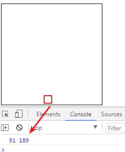
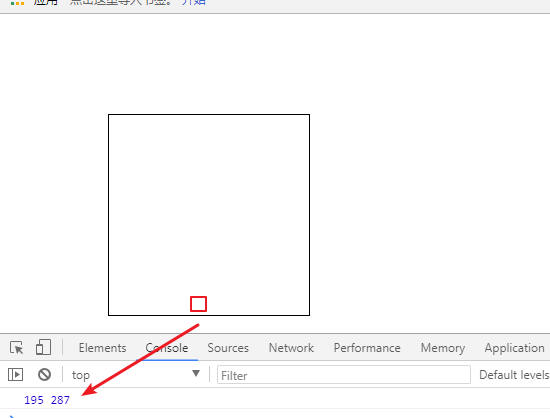
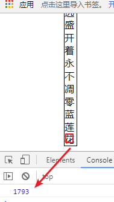

## 事件（下）

### 事件对象

在事件对象中记录了很多事件的信息。。。

#### 事件类型

```js
e.type // 事件的类型
```

例：

```html
<button id="btn">
    按钮
</button>
<script>
    btn.onclick=function(e){
        var e = e || window.event;
        console.log(e.type); // MouseClick
    }
    btn.onmouseover=function(e){
        var e = e || window.event;
        console.log(e.type); // MouseOver
    }
</script>
```


#### 鼠标按键信息

```js
e.button // 鼠标按键的信息
```

0表示左键，1表示鼠标滚轮，2表示右键

```html
<body>
<button id="btn">按钮</button>
</body>
<script type="text/javascript">
btn.onmousedown = function(e){
    var ev = e || window.event;
    var code = ev.button;
    if(code == 0){
       console.log("您点击的是左键");
    }else if(code == 1){
        console.log("您点击的滚轮");
    }else if(code == 2){
        console.log("您点击的是右键");
    }else{
        console.log("不知道你点击的是什么");
    }
}
</script>
```

#### 按键键码

```js
e.keyCode // 键盘的键码
```

常见的按键码：

- 13： 回车键（enter）
- 32： 空格键（space）
- 数字和字母的键码是数字或字母对应的阿斯克码

```html
<body>
<button id="btn">按钮</button>
</body>
<script type="text/javascript">
document.onkeypress=function(e){
    var ev = e || window.event;
    console.log(ev.keyCode);
}
</script>
```

<font color="blue">作业：模拟打字游戏。</font>

组合按键的判断：

- `altKey` ：alt 键按下得到 true，否则得到 false
- `shiftKey` ：shift 键按下得到 true，否则得到 false
- `ctrlKey` ：ctrl 键按下得到 true，否则得到 false

```js
document.onkeyup = function (e) {
  e = e || window.event
  keyCode = e.keyCode || e.which
  
  if (e.shiftKey && keyCode === 97) {
    console.log('你同时按下了 shift 和 a')
  }
}
```

使用说明：火狐firefox2.0和低版本IE中`keyCode`不兼容，可以使用`e.which`来获取

<font color="red">**现在的低版本ie和火狐都能兼容keyCode**</font>

#### 鼠标坐标点

从元素内部开始计算的坐标：`offsetX` 和 `offsetY`

```html
<body>
<style>
#box{
    width: 200px;
    height: 200px;
    border: 1px solid #000;
}
</style>
<div id="box"></div>
</body>
<script type="text/javascript">
box.onclick = function(e){
    var ev = e || window.event;
    console.log(ev.offsetX,ev.offsetY);
}
</script>
```

访问结果：

| 元素内部的点击坐标                        |
| ----------------------------------------- |
|  |

相对于浏览器的坐标，使用：`clientX`和`clientY`

```html
<body>
<style>
    #box{
        width: 200px;
        height: 200px;
        border: 1px solid #000;
        margin: 100px;
    }
</style>
<div id="box"></div>
</body>
<script type="text/javascript">
box.onclick = function(e){
    var ev = e || window.event;
    console.log(ev.clientX,ev.clientY);
}
</script>
```

访问结果：

| 相对于浏览器的坐标                        |
| ----------------------------------------- |
|  |

使用说明：不管页面滚动到哪里，都是根据窗口来计算坐标。（不会随着滚动条的滚动而发生改变）

相对于页面的坐标，会随着滚动条的滚动而加大，使用：`pageX`和`pageY`

```html
<body>
<style>
    #box{
        width: 20px;
        border: 1px solid #000;
        margin: 100px;
    }
</style>
<div id="box">
        没有什么能够阻挡
        你对自由的向往
        天马行空的生涯
        你的心了无牵挂
        穿过幽暗的岁月
        也曾感到彷徨
        当你低头的瞬间
        才发觉脚下的路
        心中那自由的世界
        如此的清澈高远
        盛开着永不凋零
        蓝莲花
</div>
</body>
<script type="text/javascript">
box.onclick = function(e){
    var ev = e || window.event;
    console.log(ev.pageY);
}
</script>
```

访问结果：

|                                           |
| ----------------------------------------- |
|  |

横向坐标也是一样的。

### 拖拽效果

鼠标移动事件：`mousemove`

```html
<body>
<style>
#box{
    width: 100px;
    height: 100px;
    background: pink;
    position:absolute;
    left:0;
    top:0;
}
</style>
<div id="box"></div>
</body>
<script type="text/javascript">
var x,y;
box.onmousedown=function(){
    this.onmousemove=function(e){
        var ev = e || window.event;
        x = ev.clientX - 50;
        y = ev.clientY - 50;
        if(x<0){
            x=0;
        }
        if(y<0){
            y=0;
        }
        // 屏幕宽度和屏幕高度
        var maxWidth = document.documentElement.clientWidth;
        var maxHeight = document.documentElement.clientHeight;
        // 能移动的最大宽度 = 屏幕宽度 - 盒子宽度
        var moveMaxWidth = maxWidth-100;
        var moveMaxHeight = maxHeight-100;
        if(x>moveMaxWidth){
            x = moveMaxWidth;
        }
        if(y>moveMaxHeight){
            y = moveMaxHeight;
        }
        this.style.left = x + "px";
        this.style.top = y + "px";
    }
}
box.onmouseup=function(){
   this.onmousemove=null;
}
</script>
```

<font color="red">**注意：获取鼠标坐标位置的时候，不能使用offset来获取，因为offset获取到的值是鼠标在当前元素上的位置，也就是说一开始获取的是大盒子的位置，但是一旦设置了小盒子的位置，鼠标会出现在小盒子上，获取到的位置就成了鼠标在小盒子上的位置了**</font>

### 默认行为

具有默认行为的常见的两个标签

```html
链接<a href="/index.php">点我</a>  往属性href指定的地址跳转
提交按钮<input type=”submit”>   往form表单属性action指定的地址跳转
```

阻止默认行为的方法：

1. 给链接地址设置为`javascript:;`或 `javascript:void(0)`

2. 在事件中最后`return false`

3. 通过对象阻止，代码如下：

   ```javascript
   function stopDefault(event) {
       var e = event || window.event; 
       if (e.preventDefault){
           e.preventDefault();   // w3c标准浏览器
       }else{
           e.returnValue = false; // IE浏览器
       }
   }
   ```

鼠标右键也有默认行为。

### 事件委托

事件委托也叫事件代理（看站谁的角度），使用事件委托技术能避免对每个子节点添加事件监听,相反把事件监听委托给父元素即可，这样可提高绑定事件的性能。

传统的给每个元素绑定事件：

```html
<ul>
	<li>首页</li>
	<li>公司介绍</li>
	<li>产品中心</li>
</ul>
<script>
var oLis = document.getElementsByTagName("li"); // 获取到所有li
for(var i in oLis){
	oLis[i].onclick = function(){
		alert(this.innerText);
	}
}
</script>
```

代码的缺点：

1. li标签比较多的时候，性能特别差，毕竟使用for循环相当于绑定了多次

2. 当动态给li添加元素的时候，新元素没有事件绑定

   ```html
   ul>
   	<li>首页</li>
   	<li>公司介绍</li>
   	<li>产品中心</li>
   </ul>
   <button id="btn">添加新元素</button>
   <script>
   btn.onclick = function(){
   	var oNewLi = document.createElement("li");
   	oNewLi.innerText = "新闻中心";
   	var oUl = document.getElementsByTagName("ul")[0];
   	oUl.appendChild(oNewLi)	
   }
   var oLis = document.getElementsByTagName("li"); // 获取到所有li
   for(var i in oLis){
   	oLis[i].onclick = function(){
   		alert(this.innerText);
   	}
   }
   </script>
   ```

   分析：当点击按钮给ul添加新元素以后，新元素不具备点击事件，点击没有效果

解决方案：使用事件委托，将所有子元素的点击事件委托给父元素

```html
<ul>
	<li>首页</li>
	<li>公司介绍</li>
	<li>产品中心</li>
</ul>
<button id="btn">添加新元素</button>
<script>
var oUl = document.getElementsByTagName("ul")[0];
btn.onclick = function(){
	var oNewLi = document.createElement("li");
	oNewLi.innerText = "新闻中心";
	oUl.appendChild(oNewLi)	
}
oUl.onclick = function(e){
	var ev = e || window.event;
	// 获取到单击的目标元素dom对象
	var target = ev.target || ev.srcElement;
	// 判断是否是li标签
	if(target.nodeName == "li"){
		// 完成业务逻辑
		alert(target.innerText);
	}
}
</script>
```

**使用事件委托的好处：**

1. 提高性能(事件委托中并没有使用循环给每个节点设置事件，只给一个父元素ul绑定事件)
2. 后续动态添加的节点也有事件的处理

 注意：事件委托底层就是通过事件冒泡来完成的，先触发父元素的事件，在通过事件对象的target属性找到具体的目标元素，进而在处理目标元素要执行的业务逻辑。

### 事件对象总结

在行内绑定的事件，在行内传入event，其他事件驱动函数在定义的时候传入自定义参数。在函数中通过获取参数或者window.event来得到事件对象。

| 名称                | 意义                                                       | 使用方式           | 兼容问题            |
| ------------------- | ---------------------------------------------------------- | ------------------ | ------------------- |
| stopPropagation方法 | 阻止冒泡                                                   | e.propagation()    | e.cancelBubble=true |
| preventDefault方法  | 阻止默认行为                                               | e.preventDefault() | e.returnValue=false |
| clientX             | 鼠标点击坐标（相对于浏览器的坐标）                         | e.clientX          | 无                  |
| offsetX             | 鼠标点击坐标（在事件源上的位置）                           | e.offsetX          | 无                  |
| pageX               | 鼠标点击坐标（相对于页面的坐标，会随着滚动条的滚动而加大） | e.pageX            | 无                  |
| target              | 精准的事件源                                               | e.target           | e.srcElement        |
| keyCode             | 键盘码                                                     | e.keyCode          | e.which             |
| type                | 事件类型                                                   | e.type             | 无                  |
| button              | 鼠标按键信息                                               | e.button           | 无                  |


