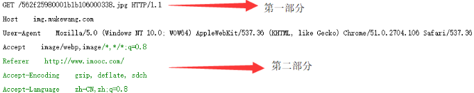
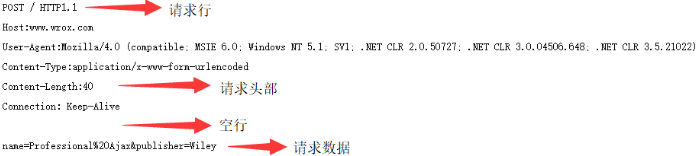
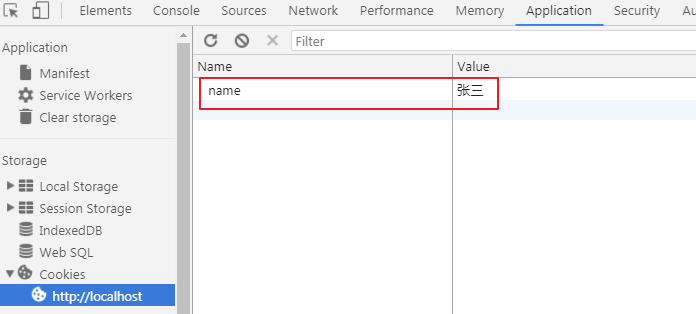

## HTTP协议

为什么要学习http？因为前端和后台进行交互的时候，使用的就是这个协议。

HTTP协议，叫超文本传输协议(Hypertext transfer protocol)。是一个规则，规定了浏览器和万维网服务器之间通信的规则。

<font color="red">HTTP的请求只能是客户端向服务器发起。</font>

### 第一步：建立连接

客户端和服务器进行通信的第一步，就是要有一个连接的状态，也就是要建立一个连接。在建立连接的时候，客户端和服务端分别需要知道一些信息：

客户端：

知道客户端能发消息

知道客户端能收消息

知道服务器能收消息

知道服务器能发消息

服务端：

知道服务端能收消息

知道服务端能发消息

知道客户端能发消息

收到客户端能收消息


每次建立连接的时候，两边都需要知道这些信息，所以会有一个“三次握手”的过程。

第一次：客户端向服务器发送一个消息，服务端收到一个消息。此时，互相知道的消息：

> 客户端知道自己能发消息
>
> 服务端知道自己能收消息
>
> 服务端知道客户端能发消息

第二次：服务端向客户端回复一个消息，客户端接收到一个消息。此时互相知道的消息：

> 服务端知道自己能发消息
>
> 客户端知道服务端能收消息
>
> 客户端知道服务端能发消息
>
> 客户端知道自己能收消息

第三次：客户端给服务端再发一个消息，服务端又收到一个消息。此时，最后一个信息，也就确定了：

> 服务端知道客户端能收消息

这时候，客户端和服务端就能开始通信了

### 第二步：开始通信

通信主要分两个过程，一个是客户端向服务器发起请求（Request），一个是服务器向客户端发起相应（Reponse）。

#### 请求

请求的时候，主要是发送请求报文（请求的说明文档）。这个文档包含4部分内容。

请求行：

```shell
POST /user HTTP/1.1
# POST 请求方式
# /user 请求URL（不包含域名）
# HTTP/1.1 请求协议版本
```

请求头： 

```shell
user-agent: Mozilla/5.0 # 产生请求的浏览器信息
accept: application/json # 表示客户端希望接受的数据类型
Content-Type: application/x-www-form-urlencoded # 客户端发送的实体数据格式
Host: 127.0.0.1 # 请求的主机名（IP）
```

请求头都是键值对。

请求空行：

请求头和请求主体之间要有一个空行。好截取内容。

请求主体：

```shell
# GET 请求是没有请求体数据的
# POST 请求才有请求体数据
```

请求主体就是请求的时候携带的数据。

get请求示例：

| get请求                                   |
| ----------------------------------------- |
|  |

post请求示例：

| post请求                                  |
| ----------------------------------------- |
|  |

常见的请求方式：

1. GET： 查
2. POST： 增
3. PUT： 改
4. DELETE： 删

GET和POST的区别

1. get请求的数据会显示在地址栏，post的数据不显示

2. get请求的数据大小有限制：

   - IE： 2083 个字符
   - FireFox： 65536 个字符
   - Safari： 80000 个字符
   - Opera： 190000 个字符
   - Chrome： 8182 个字符

   post请求的数据没有限制，除非服务器主动设置。

3. get请求的数据类型必须是ASCII，post没有限制

4. get相对不安全，post相对安全

#### 响应

每一个响应，都会有响应报文（响应的说明文档），响应报文包含3部分内容：

响应行：

```shell
HTTP/1.1 200 OK
# HTTP/1.1 服务器使用的 HTTP 协议版本
# 200 响应状态码
# OK 对响应状态码的简单解释
```

响应头：

```shell
Date: Jan, 14 Aug 2019 12:42:30 GMT # 服务器时间
Server: Apache/2.4.23 (Win32) OpenSSL/1.0.2j PHP/5.4.45 # 服务器类型
Content-Type: text/html # 服务端给客户端的数据类型
Content-Length: 11 # 服务端给客户端的数据长度
```

响应主体：

```shell
hello world
# 服务端给客户端的响应数据
```

### 第三步：断开连接

断开连接的过程，我们称之为“四次挥手”。

1. 客户端发送一个我要断开的消息给服务端
2. 服务端接受到以后发送一个消息告诉客户端我已经进入关闭等待状态
3. 服务端再次发送一个消息告诉客户端，这个是我的最后一次消息给你，当我再接受到消息的时候就会关闭
4. 客户端接受到服务端的消息以后，告诉服务器，我已经关闭，这个是给你的最后一个消息

常见的HTTP响应状态码：

1. 100 ~ 199：一般我们看不到，因为表示请求继续

2. 200 ~ 299：请求成功

3. 300 ~ 399：表示重定向

   - 301： 永久重定向
   - 302： 临时重定向

4. 400 ~ 499：客户端错误

   - 401： 未授权（你要登录的网站需要授权登录）

   - 403： 服务器拒绝了你的请求
   - 404： 服务器找不到你请求的 URL

5. 500 ~ 599：服务端错误

   - 500： 服务器内部错误
   - 503： 服务器当前不可用（过载或者维护）

## 会话

http的每一次请求之间是没有联系的。也就是说，你对同一个网页请求两次，这两次之间没有联系，因为每一次请求都会有三次握手四次挥手的过程，所以http协议是一种无状态协议，意思是说不能保持访问的状态。

但在很多时候，保留访问状态是必须要有的一种操作，比如：在首页登陆后，希望在别的页面能保持这种登陆的状态。所以，出现了一个技术，叫做会话技术。会话中首先有了cookie。

### cookie简介

cookie是浏览器提供的一个存储数据的空间。

正常情况下，我们在页面中动态给div添加一个内容，当时可以在div中看到这个内容，但是等刷新页面的时候，这个div中的内容又成了空，也就是说，我们动态添加的数据是不持久的。而cookie这个浏览器提供的空间可以让数据持久。也就是说存在这个空间中的数据等下次刷新页面，数据还是存在的。

js设置cookie

```js
document.cookie = 'name=张三;';
```

通过浏览器查看

| 浏览器查看cookie                          |
| ----------------------------------------- |
|  |

刷新页面也不会发生改变。

cookie是基于http协议的，所以操作cookie的时候，一定要在http协议中访问。

从上图中能看出来，cookie在存储值的时候，使用的是键值对的形式。也就是说在设置cookie的时候也应该用键值对的形式来设置。

这个数据要是一直存在在浏览器中的话，浏览器的内存会崩溃，所以cookie也会有消失的时候。

刚刚设置的cookie在重新打开浏览器的时候就消失了。说明cookie也有生存周期。设置的时候也可以设置cookie的生命周期。

### cookie操作

设置语法：

```shell
document.cookie = '键=值;expires=失效时间;path=能使用当前cookie的路径';
```

例：

```js
var date = new Date();
date.setTime(date.getTime()-1000*60*60*8+8000); // 当前时间的8秒之后
document.cookie = 'age=20;expires='+date+";path=/"; // 斜杠代表服务器的根目录
```

cookie识别的时间是格林威治时间，而我们获取到的时间是东8区的时间，所以需要减去8个小时，才是当前时间。

此时，在等待8秒之后，cookie就失效了。如果不设置失效时间的话，cookie默认是在当前页面关闭的时候失效，也称为“会话级别”。

cookie不能一次性设置多个键值对，要设置多个cookie就设置多次：

```js
document.cookie = 'name=zhangsan';
document.cookie = 'age=30';
```

获取cookie：

```js
var cookie = document.cookie; 
console.log(cookie); // name=zhangsan; age=30
```

获取到的多条cookie中间使用分号和空格隔开。

修改cookie，就是重新设置。

删除cookie，就是将失效时间设置为当前时间以前。

```js
var date = new Date();
date.setTiem(date.getTime()-1000*60*60*8-1); // 当前时间的上一秒
document.cookie = 'name=zhangsan;expires='+date;
```

这时候查看cookie的话，可以看到cookie的失效时间是上一秒。

### cookie特点

1. cookie的最大数据量限制为4kb
2. cookie的最大数量限制在50条（不一定，现在浏览器都比较高端，现在的谷歌可以设置150条左右）
3. cookie有时效性，一般是会话级别（浏览器关闭就过期）
4. 有域名限制，在当前域名下设置的cookie，只能在当前域名下读取

### 封装cookie操作

设置cookie封装

```js
function setCookie (key, value, expires) {
  const time = new Date()
  time.setTime(time.getTime() - 1000 * 60 * 60 * 24 * 8 + expires*1000) // 用于设置过期时间
  document.cookie = `${key}=${value};expires=${time};`
}
```

读取cookie封装：

```js
function getCookie(key) {
  const cookieArr = document.cookie.split(';')

  let value = ''

  cookieArr.forEach(item => {
    if (item.split('=')[0] === key) {
      value = item.split('=')[1]
    }
  })

  return value
}
```

删除cookie封装：

```js
function delCookie(name) {
  setCookie(name, 1, -1)
}
```

### PHP操作cookie

设置cookie：

语法：

```shell
setcookie(键，值，失效时间);
```

例：

```php
setcookie("name","zhangsan",time()+10);
```

读取cookie：

语法：

```shell
$_COOKIE[键]
```

例：

```php
print_r($_COOKIE["name"]);
```

php第一次设置时，访问不到cookie，因为第一次设置是给客户端响应信息，并告诉浏览器要设置cookie，此时的浏览器中并没有cookie，当第二次访问的时候，在请求信息带了cookie，php才能读取出来。

<font color="red">**cookie操作必须依赖http协议，不要直接使用浏览器打开html页面来操作cookie**</font>

## 本地存储

浏览器为了前端攻城狮的数据使用方便，提供了一个存储数据的空间，将数据永久性存储在客户端上，不主动删除就一直在浏览器上。言外之意就是说，存的多了，会导致浏览器很卡。

本地存储也是使用键值对的形式进行存储的。

设置本地存储数据：

```js
localStorage.setItem(键，值);
```

获取本地存储数据：

```js
localStorage.getItem(键);
```

获取本地存储的数据条数：

```js
localStorage.length
```

删除本地存储：

```js
localStorage.removeItem(键);
```

清空本地存储：

```js
localStorage.clear();
```

修改本地存储的数据就是重新设置。

本地存储的特点：

1. 也是按照域名存储的
2. 存储的值是字符串类型，如果是数字，会自动转为字符串存储
3. 键是唯一的（有就修改，没有就增加）
4. 很多情况下需要存储对象，存储对象要先转为字符串存储（使用`JSON.stringify()`），取出来再转为json对象（使用`JSON.parse()`）

