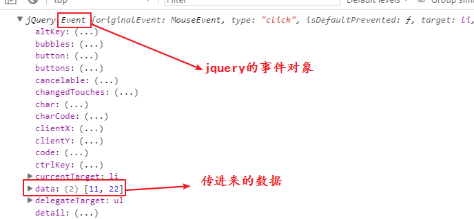

## jQuery

### 介绍

jQuery是js的库。也就是说jQuery是很多js的方法封装在了一个文件中。

jQuery是前端编程中使用最多的库。曾经风靡前端。原因有三：

1. 强大的选择器机制
2. 优质的隐式迭代
3. 无所不能的链式编程

<font color="red">**jquery完全不需要考虑兼容性，因为jquery库将js的兼容都封装好了**</font>

官网：jquery.com

中文方法大全：jquery.cuishifeng.cn

要使用jquery首先需要下载一个jquery文件，然后先引入才能使用。

首先检测一下有没有引入成功，就是输出$或者就jQuery。这是jQuery暴露在全局的唯一的两个函数。

检测引入jquery文件是否成功，弹出$

| jquery引入成功                            |
| ----------------------------------------- |
|  |


### 选择器

在jQuery中选择元素，就是暴露在全局的两个函数：

```js
$div = $("div");
//或者
$div = jQuery("div");
```

其实就相当于使用js获取的dom元素，但是用jQuery获取到的元素，不能使用原生的js方法来操作，必须使用jQuery提供的方法操作。js原生获取到的dom元素也不能使用jQuery的方法来操作。

jquery获取元素获取到的都是伪数组 - jquery对象；jquery对象不能使用原生js操作dom元素的方法来操作，除非将jquery对象<font color="red">取下标</font>拿到精准的dom元素：

```js
$("div")[0] // 取下标
$("div").get(下标); // 下标
```

原生js的dom元素也不能使用jquery提供的方法操作，除非将dom元素转为jquery对象：

```js
var div = document.querySelector("div");
$(div).text();
```

<font color="red">**注意：在原生js中的this，在jquery中是$(this)**</font>


jQuery选择元素可以使用css选择器。

- id选择器

  ```js
  $("#id名")
  ```

  

- 类名选择器

  ```js
  $(".类名")
  ```

  

- 标签选择器

  ```js
  $("标签名")
  ```

  

- 属性选择器

  ```js
  $("[name='username']")
  ```

  

- 伪类选择器（表单的伪类）

  ```js
  $("li:first-child")
  $("li:last-child")
  $("li:nth-child(数字)") // 第一个元素对应数字是1
  $("li:empty") // 空标签
  ```

  

并且jQuery获取元素有个特点，页面中能选到多个元素就会都获取到，也就是说获取到的是集合

### 筛选器

和伪类选择一样，筛选出需要的元素

```js
$("li:first")
$("li:last")
$("li:event")
$("li:odd")
$("li:eq(数字)") // 选择下标是指定数字的元素
$("li:lt(数字)") // 下标小于指定数字的元素
$("li:gt(数字)") // 下标大于指定数字的元素
```

### 表单元素选择器 -- 了解

```js
$(":input") // 匹配所有的表单元素 包括：文本框（input）下拉列表(select)、文本域(textarea)
$(":text") // 	匹配单行文本框type="text"  $("input:text")  $("input[type=text]")
$(":password") // 匹配单行密码框 
$(":radio") //	  匹配单选按钮 
$(":checkbox") // 匹配多选按钮
$(":submit") //	匹配提交按钮
$(":reset") // 匹配重置按钮
$(":image") //  匹配图片按钮
$(":button") // 匹配普通按钮
$(":file") //   匹配文件上传
$(":hidden") // 匹配隐藏域
```


### 表单对象选择器 - 重点

```js
$("input:enabled") // 所有可用表单元素
$("input:disbaled") // 所有禁用表单元素
$("input：checked") // 所有选中的表单元素 -- 重点
$("option:selected") // 被选中的下拉框元素 -- 重点
```

### 筛选器方法 -- 重点

使用方法来筛选元素

```js
$("li").first() // 元素集合中的第一个
$("li").last() // 元素集合中的最后一个
$("div").next() // div的下一个兄弟元素
$("div").prev() // div的上一个兄弟元素
$("div").nextAll() // div后面的所有兄弟元素
$("div").prevAll() // div前面的所有兄弟元素
$("div").parent() // div的父元素
$("div").parents() // div的所有直系祖宗元素
$("div").eq(数字) // 指定下标的div元素
$("div").find(选择器) // div后代中的的指定元素
$("div").siblings() // div的所有兄弟元素
$("div").children() // div下的所有子元素
```

筛选方法可以进行链式筛选

### 事件

jquery中的事件是将事件名作为方法名，传入回调函数即可。

```js
$("div").click(function(){
    
});
$("div").mouseover(function(){

});
```

页面加载事件

在原生js中的页面加载事件是window.onload

在jquery中有两种写法：

```js
$(function(){ 
    
});
$(document).ready(function(){
    
});
```

推荐使用jquery的页面加载事件，jquery的页面加载要比js原生的写法效率高，因为js元素的页面加载事件需要等到页面中的所有资源加载完毕才执行，而jquery的页面加载事件只需要等到页面的标签加载完毕就执行，而不会等待外部文件加载。

标准的事件处理：

on方法用于绑定事件、委托事件、传入参数

```shell
$(元素).on(事件类型[,委托的子元素][,传入的参数],处理的函数)
```

使用说明：

1. 事件类型不用加on
2. 委托元素必须是子元素
3. 传入的参数会传到处理函数中，且在事件对象的data属性中

例：

```html
<body>
<ul>
    <li>1</li>
    <li>2</li>
    <li>3</li>
    <li>4</li>
</ul>
</body>
<script src="./jquery-3.4.1.js"></script>
<script type="text/javascript">
$("ul").on("click","li",[11,22],function(e){
    console.log(e);
});
</script>
```

执行结果：

| jquery中on绑定事件                        |
| ----------------------------------------- |
|  |

off方法用于解绑事件

```shell
$(元素).off(事件类型,处理函数)
```

trigger方法用于手动触发事件：

```shell
$(元素).trigger(事件类型,处理函数)
```

只能触发一次的事件：

```shell
$(元素).one(事件类型,处理函数);
```

特殊事件：

hover事件，包含鼠标放上去和鼠标离开

```shell
$("元素").hover(鼠标放上去的处理函数,鼠标离开的处理函数)
```


### 属性操作

设置属性：

```js
$("div").prop(属性名,属性值);
```

获取属性：

```js
$("div").prop(属性名);
```

设置自定义属性：

```js
$("div").attr(属性名,属性值);
```

获取自定义属性：

```js
$("div").attr(属性名);
```

删除属性：

```js
$("div").removeProp(属性名);
$("div").removeAttr(属性名); // 删除自定义属性
```

案例：全选反选

js写法

```html
<body>
<input type="checkbox">商品1<br>
<input type="checkbox">商品2<br>
<input type="checkbox">商品3<br>
<input type="checkbox">商品4<br>
<input type="checkbox">商品5<br>
<input type="checkbox">商品6<br>
<button class="all">全选</button><button class="reverse">反选</button><button class="allNot">取消</button><br>
<span>删除</span>
</body>
<script src="../js/jquery.js"></script>
<script type="text/javascript">
var checkboxs = document.querySelectorAll("input");
document.querySelector(".all").onclick=function(){
    for(var i=0;i<checkboxs.length;i++){
        if(!checkboxs[i].checked){
            checkboxs[i].checked = true;
        }
    }
}
document.querySelector(".reverse").onclick=function(){
    for(var i=0;i<checkboxs.length;i++){
        if(!checkboxs[i].checked){
            checkboxs[i].checked = true;
        }else{
            checkboxs[i].checked = false;
        }
    }
}
document.querySelector(".allNot").onclick=function(){
    for(var i=0;i<checkboxs.length;i++){
        if(checkboxs[i].checked){
            checkboxs[i].checked = false;
        }
    }
}
</script>
```

jquery写法：

```js
$(".all").click(function(){
    $("input[type='checkbox']").prop("checked",true);
});
$(".reverse").click(function(){
    $("input[type='checkbox']").each(function(i,v){
        $(this).prop("checked",$(this).prop("checked"));
    });
});
$(".allNot").click(function(){
    $("input[type='checkbox']").prop("checked",false);
});
```

当操作jquery对象的时候，不需要遍历操作每一个，直接操作的就是每一个元素。因为在jquery内部自带遍历操作。这就是隐形迭代。

each方法，用来遍历元素，参数有两个，下标和值。

### 样式操作

设置样式：

```js
$("div").css(css属性名,值); // 设置一个样式
$("div").css({ // 设置多个样式
    css属性名:值,
    css属性名:值
})
```

获取样式：

```js
$("div").css(css属性名);
```

### 类名操作

```js
$("div").addClass(类名); // 添加类名
$("div").removeClass(类名); // 删除类名
$("div").toggleClass(类名); // 在添加和删除之间切换
$("div").hasClass(类名); // 判断元素是否有这个类名，有是true，没有是false
```

案例：选项卡

```html
<style>
    *{
        padding: 0;
        margin: 0;
    }
    .box{
        width:600px;
        height:400px;
        border:1px solid #000;
    }
    .title{
        height: 50px;
        display: flex;
        justify-content:space-evenly;
        align-items:center;
        background-color: pink;
    }
    .title span{
        display:block;
        width:150px;
        height: 30px;
        background:#ccc;
        line-height: 30px;
        text-align: center;
    }
    .title span.current{
        background:yellow;
    }
    .content{
        width: 600px;
        height: 350px;
    }
    .content p{
        width:600px;
        height: 350px;
        font-size:200px;
        font-weight:bold;
        color:#fff;
        text-align: center;
        line-height: 350px;
        display:none;
    }
    .content p.current{
        display:block;
    }
    .content p:first-child{
        background:red;
    }
    .content p:nth-child(2){
        background:blue;
    }
    .content p:last-child{
        background:green;
    }
</style>
<body>
<div class="box">
    <div class="title">
        <span class="current">红色</span>
        <span>蓝色</span>
        <span>绿色</span>
    </div>
    <div class="content">
        <p class="current">1</p>
        <p>2</p>
        <p>3</p>
    </div>
</div>
</body>
<script src="../js/jquery.js"></script>
<script type="text/javascript">
$("div>span").click(function(){
	$(this)
        .addClass("current")
        .siblings()
        .removeClass("current")
        .parent()
        .next()
        .find("p")
        .eq($(this).index())
        .addClass("current")
        .siblings()
        .removeClass("current");
});
</script>
```

补充知识点：

```js
$(this).index() // index方法是获取元素的下标
$("li").index(3) // 将li标签的index下标设置为3
```

链式编程在这里体现的淋漓尽致。

在链式编程中，通常需要操作上一个已经操作过的元素对象，这时候使用end方法，可以将当前返回的对象转到上一个操作过的对象

例：

```js
var res = $(this)
	.siblings() // 从$(this)对象转到了兄弟元素对象
	.parent() // 从兄弟元素对象转到了父元素对象
	.end() // 返回上一次操作的对象，也就是从父元素对象转到了兄弟元素对象
	.end() // 返回上一次操作的对象，也就是从兄弟元素对象转到了$(this)对象
// 此时返回的res是$(this)
```

### 元素内容操作

```js
$("div").text(); // 获取元素内容 === 相当于 div.innerText
$("div").text("盒子"); // 设置元素内容 === 相当于 div.innerText = "盒子"
$("div").html(); // 获取元素代标签的内容 === 相当于 div.innerHTML
$("div").html("<b>文字</b>"); // 设置元素带标签的内容 === 相当于 div.innerHTML = "<b>文字</b>"
$("input").val(); // 获取表单元素的值 === 相当于 input.value
$("input").val("请输入用户名"); // 设置表单元素的内容 === 相当于 input.value = "请输入用户名"
```

作业：使用jquery编写简单的轮播图。