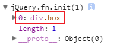

## JQ二

| jquery对象==伪数组                        |
| ----------------------------------------- |
|  |

### 元素节点操作

#### 创建元素：

```js
$("标签和内容") // 创建一个标签并给里面放内容
```

例：

```js
var box = $("<div class='box'>div盒子</box>");
console.log(box);
```

创建的结果：

| 创建的元素                                |
| ----------------------------------------- |
|  |

#### 添加元素

给父元素追加子元素：

```js
父元素.append(子元素)
```

例：

```html
<div>
    <span>span标签</span>
</div>
</body>
<script src="jquery.js"></script>
<script type="text/javascript">
var box = $("div");
var b = $("<b>加粗文字</b>")
box.append(b);
</script>
```

追加的结果：

| 给父元素追加子元素                        |
| ----------------------------------------- |
|  |

给父元素最前面添加子元素：

```js
父元素.prepend(子元素);
```

例：

```html
<div>
    <span>span标签</span>
</div>
</body>
<script src="jquery.js"></script>
<script type="text/javascript">
var box = $("div");
var b = $("<b>加粗文字</b>")
box.prepend(b);
</script>
```

添加结果：

| 父元素最前面添加子元素                    |
| ----------------------------------------- |
|  |

将子元素添加到父元素中

```js
// 将子元素追加到父元素中
子元素.appendTo(父元素);
// 将子元素添加到父元素最前面
子元素.prependTo(父元素);
```

添加兄弟元素：

```js
// 添加下一个兄弟元素
元素.after(下一个兄弟元素);
```

例：

```html
<div>
    <span>span标签</span>
</div>
</body>
<script src="../js/jquery.js"></script>
<script type="text/javascript">
var span = $("span");
var b = $("<b>加粗文字</b>")
span.after(b);
</script>
```

添加结果：

| 添加下一个兄弟元素                        |
| ----------------------------------------- |
|  |

添加上一个兄弟元素：

```shell
元素.before(上一个兄弟元素);
```

例：

```html
<div>
    <span>span标签</span>
</div>
</body>
<script src="../js/jquery.js"></script>
<script type="text/javascript">
var span = $("span");
var b = $("<b>加粗文字</b>")
span.before(b);
</script>
```

添加结果：

| 添加上一个兄弟元素                        |
| ----------------------------------------- |
|  |

将元素添加到某个元素的前面或后面：

```js
// 将元素添加到某个元素前面
要添加的元素.insertBefore(元素);
// 将元素添加到某个元素后面
要添加的元素.insertAfter(元素);
```

#### 替换元素

使用新元素替换某个元素：

```js
某个元素.replaceWith(新元素)
```

例：

```html
<div>
    <span>span标签</span>
</div>
</body>
<script src="../js/jquery.js"></script>
<script type="text/javascript">
var span = $("span");
var b = $("<b>加粗文字</b>")
span.replaceWith(b);
</script>
```

替换结果：

| 将span替换成b                             |
| ----------------------------------------- |
|  |

用新元素替换掉某个元素：

```js
新元素.replaceAll(某个元素)
```

#### 删除元素

删除元素内部所有标签和内容，让自己变成一个空标签

```shell
元素.empty()
```

例：

```html
<div>
    <span>span标签</span>
</div>
</body>
<script src="../js/jquery.js"></script>
<script type="text/javascript">
var box = $("div");
box.empty();
</script>
```

删除结果：

| 删除元素内部所有标签和内容                |
| ----------------------------------------- |
|  |

将当前标签从页面中删除

```js
元素.remove() // 删除自己和自己内部所有内容
```

例：

```html
<div>
    <span>span标签</span>
</div>
</body>
<script src="../js/jquery.js"></script>
<script type="text/javascript">
var box = $("div");
box.remove();
</script>
```

删除结果：

| 删除当前标签                              |
| ----------------------------------------- |
|  |

#### 复制元素

```js
元素.clone([是否复制自身的事件][,是否复制子元素的事件])
```

使用说明：

1. jqueyr中的复制元素是深复制，复制标签结构和内容
2. 这个方法接收两个参数，参数1代表是否把元素的事件也克隆出来，默认为false；参数2代表是否把元素的子元素的事件克隆出来，默认跟随第一个参数的值。
3. 如果不复制父元素的事件，子元素的事件也不能复制

节点操作案例：qq菜单

代码：

```html
<link rel="stylesheet" href="./font/iconfont.css">
<style>
*{
    padding: 0;
    margin: 0;
    list-style:none;
}
ol{
    width:300px;
    background-color: pink;
    padding-left:10px;
    margin:50px auto;
}
h2{
    font-size:20px;
    height:30px;
    line-height:30px;
}
ol ul{
    display:none;
}
ol ul li{
    font-size:18px;
    height:24px;
    line-height:24px;
    padding-left:2em;
    background-color: #666;
    color:#fff;
    margin:5px 0;
}
</style>
</head>
<body>
<ol>
    <li>
        <h2><i class="iconfont icon-arrowRight"></i>我的好友</h2>
        <ul>
            <li>张三</li>
            <li>李四</li>
            <li>王五</li>
        </ul>
    </li>
    <li>
        <h2><i class="iconfont icon-arrowRight"></i>我的坏友</h2>
        <ul>
            <li>张小三</li>
            <li>李小四</li>
            <li>王小五</li>
        </ul>
    </li>
    <li>
        <h2><i class="iconfont icon-arrowRight"></i>黑名单</h2>
        <ul>
            <li>张大三</li>
            <li>李大四</li>
            <li>王大五</li>
        </ul>
    </li>
</ol>
</body>
<script src="./js/jquery.js"></script>
<script type="text/javascript">
$("h2").click(function(){
    var ulStyle = $(this).next().css("display");
    if(ulStyle == "none"){
        $(this)
            .find("i")
            .removeClass("icon-arrowRight")
            .addClass("icon-changyongtubiao-xianxingdaochu-zhuanqu-");
        $(this)
            .next() // ul
            .css("display","block")
            .parent() 
            .siblings()
            .find("ul") 
            .css("display","none")
            .prev() 
            .find("i") 
            .removeClass("icon-changyongtubiao-xianxingdaochu-zhuanqu-")
            .addClass("icon-arrowRight");
    }else{
        $(this).find("i").removeClass("icon-changyongtubiao-xianxingdaochu-zhuanqu-").addClass("icon-arrowRight");
        $(this).next().css("display","none");
    }
});
</script>
```

效果图：

| qq菜单效果                |
| ------------------------- |
|  |

作业：在qq菜单案例的基础上，点击其中的每一个姓名，给其添加背景颜色，将其他姓名的背景颜色去掉

### 元素尺寸

元素内容区域尺寸操作：

```js
元素.height(); // 获取元素内容区域高度
元素.height(高度); // 设置元素内容区域高度
元素.width(); // 获取元素内容区域宽度
元素.width(宽度); // 设置元素内容区域宽度
```

获取元素内部区域尺寸：

```js
元素.innerHeight(); // 获取元素内部的高度，包含padding，但不包含border
元素.innerWidth(); // 获取元素内部的宽度，包含padding，但不包含border
```

获取元素占据页面的尺寸：

```js
元素.outHeight(); // 获取元素占据的高度，包含padding和border，不包含margin
元素.outHeight(true); // 获取元素占据的高度，包含padding和border，包含margin
元素.outWidth(); // 获取元素占据的宽度，包含padding和border，不包含margin
元素.outWidth(true); // 获取元素占据的宽度，包含padding和border，包含margin
```

### 元素位置

元素相对页面的位置操作：

```js
元素.offset(); // 获取到元素在页面中的位置，包含left值和top值，返回一个对象
元素.offset({left:值,top:值}); // 将元素设定到指定的位置，使用relative
```

元素相对父元素的值：

```js
元素.position(); // 获取元素相对于定位的父元素的偏移值，不管设置的是什么，获取到的永远是left和top	
```

获取元素滚动过的距离：

```js
$(window).scrollTop(); // 获取元素滚动过的高度
$(window).scrollLeft(); // 获取元素滚动过的宽度
$(window).scrollTop(值); // 设置元素滚动过的高度
$(window).scrollLeft(值); // 设置元素滚动过的宽度
```

### 动画

#### 基本动画

显示：

```js
元素.show(); // 让元素从隐藏状态变为显示状态（从display:none;变为 display:block;）
可选参数1：时间，毫秒数 == 让元素在规定的时间内显示（操作的属性有很多）
可选参数2：速度方式，匀速或加速或减速
可选参数3：动画结束后执行的回调函数
```

隐藏：

```js
元素.hide()； // 让元素从显示状态切换到显示状态
可选参数和show一样
```

切换显示隐藏：

```js
元素.toggle(); // 让元素在隐藏和显示状态切换
可选参数和show一样
```

元素上下拉动隐藏显示：

```js
元素.slideDown() // 让元素向下拉动显示
元素.slideUp() // 让元素向上拉动隐藏
元素.slideToggle() // 让元素切换上下拉动显示隐藏
参数和show一样
```

元素透明度显示隐藏：

```js
元素.fadeIn() // 让元素从透明度0变为1的显示
元素.fadeOut() // 让元素从透明度1变为0的隐藏
元素.slideToggle() // 让元素切换透明度显示隐藏
参数和show一样
```

让元素切换到指定的透明度：

```js
元素.fadeTo(毫秒数,透明度,速度方式,结束的回调函数) // 让元素在指定的时间内切换到指定的透明度
```

#### 自定义动画

开启动画：

```shell
元素.animate({
    css属性名:属性值,
    css属性名:属性值,
    。。。
}[,毫秒数][,速度方式][,执行结束的回调函数]);
```

停止动画：

```js
元素.stop(); // 将动画停止在当前状态
元素.finish(); // 将动画停止在结束状态
```

动画的链式操作：

通常在一个动画中的所有css属性是同时进行的，想要将所有动画按顺序执行的话，可以将多个动画嵌套在动画结束的回调函数中，但是这样容易造成回调地狱，所以jquery提供了一个动画的链式操作，让所有动画组成一个队列，按顺序执行，例：

```html
<style>
div{
    width: 100px;
    height:100px;
    background-color: red;
    position:absolute;
}
</style>
<body>
<button class="start">按钮</button>
<div></div>
</body>
<script src="./js/jquery.js"></script>
<script type="text/javascript">
$(".start").click(function(){
    $("div").animate({
        left:"300px"
    }).animate({
        top:"300px"
    }).animate({
        width:"300px"
    }).animate({
        height:"50px"
    })
});
</script>
```

效果图：

| 动画队列 - 动画链式操作 |
| ----------------------- |
|  |

