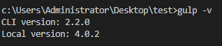
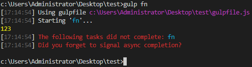
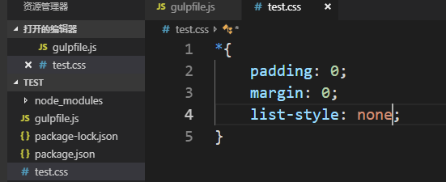
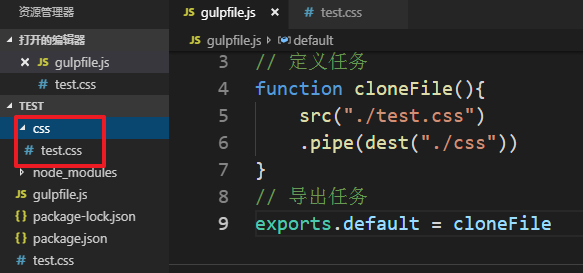
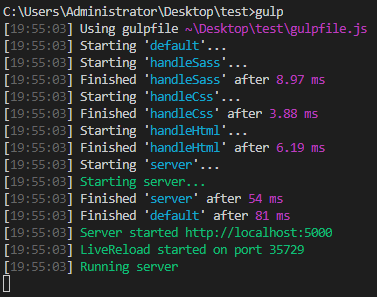
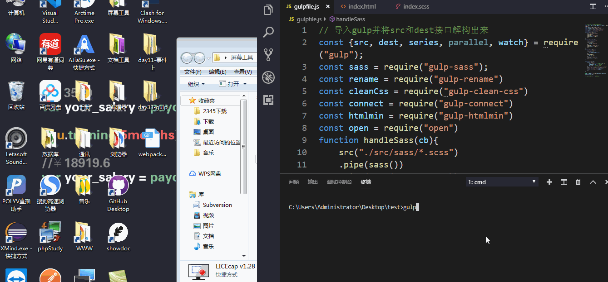

# gulp

## 引入：

项目做好以后，在上线之前还有一些工作需要去做：

- 压缩css
- 压缩js
- 压缩图片
- 编译sass
- 合并文件
- 。。。

等等，在前端工作流出现之前，这些工作都由人力完成，而这些工作往往比写业务本身更加费时，效率非常之低且还容易出错，于是自动化的处理工具也就必然出现了。

前端的构建工具常见的有Grunt、Gulp、Webpack三种，Grunt比较老旧，功能少，更新少，插件少。

## 概念：

gulp是一个自动化构建工具，主要用来设定程序自动处理静态资源的工作。简单的说，gulp就是用来打包项目的。

官网：https://gulpjs.com/

中文官网：https://www.gulpjs.com.cn/docs/

搜索包的使用方法：http://www.npmjs.com

## 安装：

安装gulp工具：

```shell
npm i gulp -g
gulp -v # 测试是否安装成功
```

全局安装表示在当前电脑中可以使用gulp工具了

安装gulp依赖包

```shell
npm i gulp --save-dev # 因为在上线后是不需要这个包的，所以将这个项目安装在开发依赖
```

局部安装表示在当前项目要使用的gulp

| 检测安装好后的版本                        |
| ----------------------------------------- |
|  |

gulp是一个基于任务的工具，也就是说，gulp规定，不管做什么功能，都用统一的接口管理，必须去注册一个任务，然后去执行这个任务，在任务代码中，去做想想做的功能。这是gulp的特点之一：任务化。

gulp的每个功能都是一个任务，压缩css的任务、合并文件的任务。。。gulp规定任务要写在一个叫做glupfile.js的文件中，在这个文件中用来配置所有任务。

首先，gulp和node中的其他模块一样，使用的时候需要引入：

```js
require("gulp");
```

这个gulp是一个对象，gulp提供了很多接口，都是这个对象的方法。

引入后的是一个对象，在这个对象中有很多方法需要解构出来：

```js
const { series,parallel,... } = require('gulp');
```

每个接口都有不同的功能。

## gulp提供的接口：

### 注册任务

gulp的每个任务都是一个函数，最终将这个任务导出的时候，给这个任务定义个名称就行了

```js
// 定义一个任务 - 定义一个函数
function fn(){
    console.log(123);
}
// 导出这个任务即可
exports.fn = fn // 任务名称是fn，执行的函数是fn
```

在命令行中执行这个任务：

```shell
gulp fn
```

执行示例：

| 执行任务                                  |
| ----------------------------------------- |
|  |

如果任务名称定义成default，那么在执行任务的时候就不用输入任务名称了，直接使用gulp就能执行：

```js
// 定义一个任务 - 定义一个函数
function fn(){
    console.log(123);
}
// 导入任务
exports.default = fn // 任务名称是default，执行的函数是fn
```

执行示例：

| 执行默认任务                              |
| ----------------------------------------- |
|  |

### 同步任务

如果希望让多个任务按照顺序执行，需要用到gulp的series接口：

```js
// 导入gulp，并将series方法解构出来
const {series} = require('gulp');
// 定义任务1
function print1(cb){
    console.log('this is print task first');
    cb()
}
// 定义任务2
function print2(cb){
    console.log('this is print task second');
    cb()
}
// 因为两个任务都没有实际的意义，所以需要加回调函数才行
// 将任务导出并按照排好的顺序执行
exports.default = series(print1, print2)
```

执行示例：

| 同步任务执行示例                          |
| ----------------------------------------- |
|  |

从图中可以看出来，当print1开始执行，并执行结束后，print2才开始执行的，也就是同步任务

### 异步任务

如果要让两个任务是异步执行的，需要用到gulp的parallel接口：

```js
// 导入gulp，并将parallel方法解构出来
const {parallel} = require('gulp');
// 定义任务1
function print1(cb){
    console.log('this is print task first');
    cb()
}
// 定义任务2
function print2(cb){
    console.log('this is print task second');
    cb()
}
// 将任务导出并按照排好的顺序执行
exports.default = parallel(print1, print2)
```

执行示例：

| 异步任务执行示例                          |
| ----------------------------------------- |
|  |

从图中可以看出来，当print1开始，但是还没有执行结束的时候，print2就开始了，这就是异步任务。

gulp自己有内存，当我们使用gulp进行项目构建的时候，gulp会将本地文件数据读取到gulp内存中，接下来的操作都在内存中进行，操作完成以后，再从gulp的内存中输出到本地，比如说当我们要合并两个文件的时候，先将这两个文件中的内容读取到内存中，然后在内存中进行合并，最后将合并后的内容从内存中输出到本地的文件中。

这样，对应着两个操作，一个是输入，一个输出，也就是I/O操作。这是gulp的又一个特点之一：基于流。

### 读取文件

将本地文件读取到gulp内存中，需要用到gulp的src接口：

语法：

```js
src(要读取的文件路径)
```

### 输出到文件

将内存中数据输出到本地文件中，需要使用gulp的dest接口

```js
dest(输出文件的文件夹路径)
```

既然gulp的所有操作都是基于流的，就需要将上一步的结果流向下一个操作，中间需要用到管道：

### 管道

管道的方法是pipe，不需要解构，直接就能用：

语法：

```js
上一步的操作
.pipe(下一步的操作)
```

Demo：将test.css读取出来并保存到css文件夹下

新建test.css如下：

| 新建test.css                              |
| ----------------------------------------- |
|  |

gulpfile.js的代码：

```js

```

运行实例：

| demo运行实例                              |
| ----------------------------------------- |
|  |

运行的结果：

| 复制文件的结果                            |
| ----------------------------------------- |
|  |


### 监视文件变化

用来监视某个或某些文件发生变化，可以在变化的时候，执行一个任务函数或者是任务组合

```shell
watch(监视的文件或多个文件组成的数组, [options], [task])
```

## gulp插件

我们要处理文件的合并、压缩等操作，接口中没有提供，都放在了插件中。

插件下载：

```shell
npm install 插件名 --save-dev
```

- gulp-concat : 合并文件(js/css)

- gulp-uglify : 压缩js文件

- gulp-rename : 文件重命名

- gulp-less : 编译less

- gulp-sass：编译sass

- gulp-clean-css : 压缩css

- gulp-htmlmin：压缩html文件

- gulp-connect：热加载，配置一个服务器

  - 每个任务都要添加即时更新

    ```js
    .pipe(connect.reload())
    ```

    

- gulp-load-plugins：打包插件（里面包含了其他所有插件）

- gulp-autoprefixer：给css加前缀，将一些不兼容的css属性添加前缀让各个浏览器兼容

  - 需要配置的兼容哪些浏览器

    ```js
    {
        browsers:["last 5 version","iOS > 3","Firefox > 2"]
    }
    ```

    会出现一个提示，希望将这个配置写在package.json中：

    ```json
    "browsersList":[
        "last 2 version",
        "iOS > 7",
        "Fixefox > 20"
    ]
    ```

    

- es6转es5

  - gulp-babel@7.0.1

  - babel-core

  - babel-preset-es2015

    导入的时候只要导入一个gulp-babel即可，需要配置的选项：

    ```js
    {
        presets: ['es2015'] // 必须要有这个参数，否则会报错
    }
    ```

    

- gulp-clean：清空目标文件夹

- open：自动打开浏览器

## 案例


### 全自动化构建项目

```js
// 导入gulp并将src和dest接口解构出来
const {src, dest, series, parallel, watch} = require("gulp");
const sass = require("gulp-sass");
const rename = require("gulp-rename")
const cleanCss = require("gulp-clean-css")
const connect = require("gulp-connect")
const htmlmin = require("gulp-htmlmin")
const open = require("open")
function handleSass(cb){
    src("./src/sass/*.scss")
    .pipe(sass())
    .pipe(dest("./src/css"))
    .pipe(connect.reload())
    cb()
}

function handleCss(cb){
    src("./src/css/*.css")
    .pipe(cleanCss())
    .pipe(rename({
        extname:".min.css"
    }))
    .pipe(dest("./dist/css"))
    .pipe(connect.reload())
    cb()
}

function handleHtml(cb){
    src("./src/*.html")
    .pipe(htmlmin({
        collapseWhitespace:true
    }))
    .pipe(rename({
        suffix:".min"
    }))
    .pipe(dest("./dist/"))
    .pipe(connect.reload())
    cb()
}

function server(cb){
    connect.server({
        root:'./dist/', // 配置服务器根目录
        livereload:true, // 实时刷新
        port:5000 // 配置服务器端口
    })
    open("http://localhost:5000/index.min.html")
    watch('./src/sass/*.scss',handleSass)
    watch('./src/css/*.css',handleCss)
    watch('./src/*.html',handleHtml)
    cb()
}

exports.default = series(handleSass,handleCss,handleHtml,server)
```

启动任务示例：

| 全自动化启动任务示例                      |
| ----------------------------------------- |
|  |

修改文件自动刷新浏览器：

| 自动刷新浏览器                   |
| -------------------------------- |
|  |

这时候只要我们启动这个任务，就会自动帮我们打开网页，并且只要其中有一个文件发生了改变，都会自动刷新浏览器。

### 扩展

#### 压缩图片

将切好的图片进行压缩，使图片更小，让项目运行起来更快

插件：gulp-imagemin

任务代码：

```js
const imagemin = require("gulp-imagemin");
function compressImage(cb){
    src("./images/*.jpg")
    .pipe(imagemin())
    .pipe(dest("./img"))
    cb()
}
```

Gulp官方插件网站找寻插件。（gulp-sass-china）