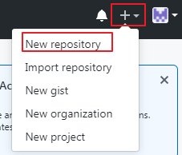

## Git

在实际工作中，我们会遇到很多无法预料的问题：

问题一：频繁改需求。例：

```shell
项目开发好以后，形成版本v1.0
需求改变：
在v1.0的基础上添加功能A，形成版本v1.1 - 在上个版本的基础上添加功能A
在v1.0的基础上添加功能B,形成版本v1.2 - 在上个版本的基础上删除功能A，添加功能B
在v1.1的基础上添加功能C，形成版本v1.3 - 在上个版本的基础上删除功能B，添加功能A，再添加功能C
在v1.2的基础上添加功能D，形成版本v1.4 - 上个版本的基础上删除功能A，删除功能C，添加功能B，添加功能D
```

git可以完美解决这个删除添加的过程。因为git可以将每个版本保存下来，可以很轻松的将当前版本切换到之前的某个版本。

问题二：一不小心将文件删除了，还需要重新写。

使用git的话，如果将某个文件删除，形成新的版本，也可以很轻松的切换到之前的版本，将删除的文件找回来。

问题三：在当前电脑开发好的内容，换了一台电脑，发现代码还需要重新写

使用git的话，将每次写好的代码，上传到github网站，只要有网就能下载，相当于备份

问题四：工作中每个人写好的文件最后需要合并到一个大文件中，需要很繁琐的复制粘贴

使用git可以很轻松的进行文件合并

### git和github简介

git：分布式版本控制工具。其实就是一个软件，来管理文件夹使用的。需要通过命令操作。

github：世界级的开源网站，存储文件使用。使用者都是开发者。文件可以选择加密，只有自己能用，可以选择开源，所有人都能用。还可以和作者沟通。只接受git工具上传。在这个网站上又很多别人写好的各种语言的代码文件，如果有什么插件需要下载，可以在这个网站上搜索。

git可以管理本地文件，也可以管理gitgub的文件。

本地仓库：在自己电脑上被 git 管理的文件夹

远程仓库：在线上管理的文件夹

推送：将本地的内容，上传到远程

同步：将线上的内容和本地内容保持一致

### 本地使用git

下载安装，检测是否安装成功：

```shell
git --version
```

或者点击鼠标右键出现下图也可以

| git安装成功的标志                         |
| ----------------------------------------- |
|  |

首先要在被管理的文件夹中进行初始化，才能在这个文件夹中使用git命令管理：

```shell
git init
```

初始化后，会出现一个隐藏的文件夹`.git`，此时代表当前这个文件夹及其以下内容都被git管理了。git管理文件夹的时候将管理过程分为3个区域：

1. 工作区：自己写的源文件

   | 工作区示意图                              |
   | ----------------------------------------- |
   |  |

   

2. 暂存区：将要保存的文件，暂时存在暂存区

   | 暂存区示意图                              |
   | ----------------------------------------- |
   |  |

   

3. 历史区：生成一个版本，只能将暂存区的内容生成版本。上传的时候只能上传历史区的内容

将源文件添加到暂存区：

```shell
git add 文件 # 将单独一个文件添加到暂存区
git add 文件夹/ # 将整个文件夹添加到暂存区(git不管理空文件夹)
git add --all # 将当前文件夹中所有文件和文件夹都添加到暂存区  -  简写：git add .
```

查看git管理的文件的状态：

```shell
git status
```

将暂存区的文件拉回到源文件：

```shell
git reset HEAD -- 文件 # 将某个文件从暂存区变为源文件
git reset HEAD -- 文件夹/ # 将整个文件夹从暂存区变为源文件
git reset HEAD -- . # 将所有文件从暂存区变为源文件
```

将暂存区的内容生成历史版本：

```shell
git commit -m "版本说明"
```

查看所有版本信息：

```shell
git log
```

查看版本信息：

| 版本信息示意图                            |
| ----------------------------------------- |
|  |

回到指定版本：

```shell
git reset --hard HEAD^ # 有几个上档键就回退几个版本
git reset --hard 历史版本号
```

让git能管理一个空文件夹：

在空文件夹中新建文件：`.gitkeep`，这个文件没有实际意义，这是为了占位，让空文件夹能被管理的标识，以后要在文件夹中写文件的时候，这个文件可以被删除

让某些文件或者文件夹被忽略管理：

在和`.git`同级的位置，新建文件：`.gitignore`，在这个文件中书写要忽略的内容：

```shell
直接写文件名，代表要忽略的是哪个文件
写文件夹路径，表示要忽略的是哪个文件夹
*.后缀，表示要忽略的是所有后缀为指定后缀的文件
```

### 远程仓库

上传到远程仓库：

在github上新建仓库：

|  |
| ----------------------------------------- |
|  |
|  |

使用https上传：

添加上传地址：

```shell
git remote add origin https://github.com/weberWangjie/test.git # 其中的origin是变量名表示上传地址，可以自定义
```

开始上传：

```shell
git push -u origin master # 其中的origin是表示地址的那个变量名
```

首次推送远程需要输入用户名和密码。

第二次上传的时候只需要：`git push`

将远程代码拉取到本地：（要先新建一个文件夹作为git管理的文件夹）

```shell
git clone 远程仓库地址
```

将本地代码和远程代码同步：(在本地仓库使用命令)

```shell
git pull
```


### 分支

一个大项目，会分很多人开发，每个人一个功能，这时候，每个功能作为一个分支，主分支只有目录结构。当所有人将自己负责的功能开发完成的时候，再将所有分支合并到主分支上，形成一个完整的项目。

每次初始化一个git的时候，默认创建一个主要分支：`master`

创建分支：

```shell
git branch 分支名
```

查看当前分支：

```shell
git branch
```

切换分支：

```shell
git checkout 分支名
```

创建并切换到这个分支：

```shell
git checkout -b 新分支名
```

合并分支：(将别的分支合并到自己分支)

```shell
git merge 要合并的分支
```

删除分支：(不能自己删自己)

```shell
git branch -D 要删除的分支
```

### 冲突

两个人同时操作同一个分支，提交的时候会有先后顺序，先提交的人正常提交了，后一个人提交的时候会产生冲突。因为git规定，每次提交必须是在原来的版本基础上，但是第二个人在提交的时候，在远程已经有了第二个版本，所以第二个人相当于从第一个版本向第三个版本提交。如下图：

| git冲突示意图                             |
| ----------------------------------------- |
|  |
|  |

冲突解决：

1. 使用命令让本地和远程同步：

   ```shell
   git pull
   ```

   然后手动解决文件冲突

2. 开辟新的分支，然后进行分支合并

   ```shell
   git fetch origin master:tmp # 使用 fetch 获取远程最新信息并开辟一个临时分支
   git diff tmp # 将当前分支和远程分支进行对比
   git merge tmp # 将临时分支合并到当前分支
   ```


3.2.git clone 指定分支

```java
 git clone -b dev_jk http://10.1.1.11/service/tmall-service.git
```

命令中：多了一个  -b dev-jk,这个dev_jk就是分支，http://10.1.1.11/service/tmall
-service.git为源码的仓库地址