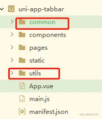
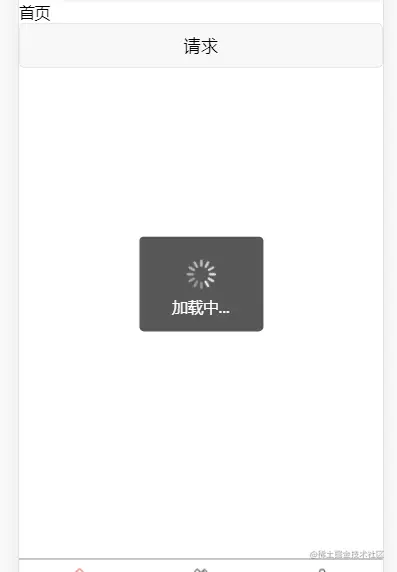

对uni.request的一些共同参数进行简单的封装，减少重复性数据请求代码。方便全局调用。

先在目录下创建 utils 和 common 这2个文件夹



utils 是存放工具类的，common 用来放置常用方法的

之后在utils 中创建 requset.js 用来放置 uni.request 的请求方法，在对其进行简单的封装。

## requset.js 代码

```javascript
import operate from '../common/operate.js'
// vuex 的使用  详情参考官网 https://uniapp.dcloud.io/vue-vuex
import store from '../store/index.js'  

export default class Request {
    http(param) {
        // 请求参数
        var url = param.url,
            method = param.method,
            header = {},
            data = param.data || {},
            token = param.token || "",
            hideLoading = param.hideLoading || false;

        //拼接完整请求地址
        var requestUrl = operate.api + url;
       //拼接完整请求地址（根据环境切换）
       // var requestUrl = operate.api() + url;

        //请求方式:GET或POST(POST需配置
        // header: {'content-type' : "application/x-www-form-urlencoded"},)
        if (method) {
            method = method.toUpperCase(); //小写改为大写
            if (method == "POST") {
                header = {
                    'content-type': "application/x-www-form-urlencoded"
                };
            } else {
                header = {
                    'content-type': "application/json"
                };
            }
        }

        //加载圈
        if (!hideLoading) {
            uni.showLoading({
                title: '加载中...'
            });
        }

        // 返回promise
        return new Promise((resolve, reject) => {
            // 请求
            uni.request({
                url: requestUrl,
                data: data,
                method: method,
                header: header,
                success: (res) => {
                    // 判断 请求api 格式是否正确
                    if (res.statusCode && res.statusCode != 200) {
                        uni.showToast({
                            title: "api错误" + res.errMsg,
                            icon: 'none'
                        });
                        return;
                    }
                    // 将结果抛出
                    resolve(res.data)
                },
                //请求失败
                fail: (e) => {
                    uni.showToast({
                        title: "" + e.data.msg,
                        icon: 'none'
                    });
                    resolve(e.data);
                },
                //请求完成
                complete() {
                    //隐藏加载
                    if (!hideLoading) {
                        uni.hideLoading();
                    }
                    resolve();
                    return;
                }
            })
        })
    }
}
复制代码
```

在common 中分别创建 operate.js 和 api.js

### operate.js 用来放置请求接口 api 地址

```arduino
export default {
    //接口
    api: "http://192.168.208.126:8080",
}
复制代码
```

### 根据小程序环境 切换接口地址

```javascript
export default {
	//接口
	api: function() {
	    let version = wx.getAccountInfoSync().miniProgram.envVersion;
	    switch (version) {
		case "develop": //开发预览版
			return "https://www.baidu.com/"
			break;
		case 'trial': //体验版
			return "https://www.baidu.com/"
			break;
		case 'release': //正式版
			return "https://www.baidu.com/"
			break;
		default: //未知,默认调用正式版
			return "http://www.baidu.com/"
			break;
	}
}
复制代码
```

## 使用方法一（全局请求）

在跟目录创建api文件夹：在创建api.js

api.js 是用来调用我们封装好的 uni.request ,并且统一管理请求接口，在后续开发中只需要在页面中调用 api.js中请求即可

```javascript
import Request from '@/utils/requset.js'
let request = new Request().http

//全局定义请求头
export default {
    // 请求样式
    classifyLeft: function(data) {
        return request({
            url: "/category/list", //请求头
            method: "GET", //请求方式
            data: data, //请求数据
        })
    },
}
/*
请求样式：
    自定义名字: function(data) {
        return request({
            url: "/banner", //请求头
            method: "GET", //请求方式 
            data: data,    //请求数据
            token: token, // 可传  
            hideLoading: false, //加载样式
        })
    },
*/
复制代码
```

api.js的调用可以在main.js 中进行全局调用，也可以在需要的页面中调用，可根据实际情况来决定是否全局 调用。下面只介绍全局调用

### 在mian.js中导入api.js

```javascript
1. 在main.js 中引入api.js
        import api from '@/common/api.js'
        Vue.prototype.$api = api
2. 在页面中调用
        //不传参数
        this.$api.sendRequest().then((res) => {
            console.log(res);
        })
        //传参
        this.$api.sendRequest({参数}).then((res) => {
            console.log(res);
        })
复制代码
```

项目地址：[gitee.com/jielov/uni-…](https://link.juejin.cn?target=https%3A%2F%2Fgitee.com%2Fjielov%2Funi-app-tabbar)

## 使用方法二（页面单独引入）

user.js 是用来调用我们封装好的 uni.request ,并且统一管理请求接口，在后续开发中只需要在页面中调用 user.js中请求即可

```javascript
import Request from '@/utils/requset.js'
import operate from '@/common/operate.js'
let request = new Request().http

// 按需引入的 请求头
export const getUserInfo= function(data) {    
    return request({
	url: "order/user ",		
        method: "POST",
	data: data,
	token: operate.isToken()
    })
}
复制代码
```

### 页面中使用

```javascript
//引入
import {
    getUserInfo
} from '@/api/user.js'

//放入生命周期
init() {
    //用户信息
    getUserInfo().then((res) => {
	console.log(res);
    })
},
复制代码
```




作者：虚乄
链接：https://juejin.cn/post/7023983465892675614
来源：稀土掘金
著作权归作者所有。商业转载请联系作者获得授权，非商业转载请注明出处。