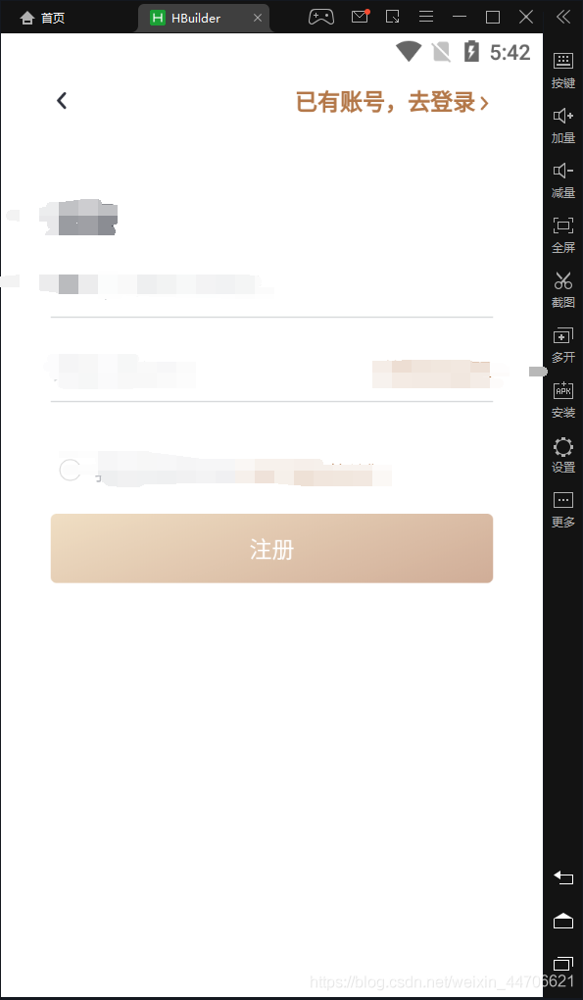

uni-app获取导航栏高度
调用函数uni.getSystemInfoSync()会获取到手机的配置信息，当然了也包括导航栏高度uni.getSystemInfoSync().statusBarHeight，这个方法固然是可以的 但是，调用函数总感觉比较费事，而且还需要自己计算，总之就是比较繁琐。写着写着，我裂开了！！！！
偶然间碰到了一个css计算就能控制方法。
先上图，拿出证据来讲话。。。。。。

上面标题便是自定义顶部导航栏
下面我们来看看关键一行代码
1.先看看vue上面怎么写的

```html
<!-- 注册标标题，这是整个标题类容 --> 
<view class="uni-navbar">
    <view class="title-url">
        <view class="iconfont back">&#xe6e9;</view>
        <view class="right">
            <text class="txt">已有账号，去登录</text>
            <text class="iconfont right-url">&#xe6e9;</text>
        </view>
    </view>
</view>
```

2.下面是css代码

```css
 // 注册标标题-这是整个标题样式布局，当然不涉及头部状态栏适配，可以忽略
    .title-url{
        display: flex;
        height: 45rpx;
        width: 100%;
        justify-content: space-between;
        align-items: center;
        margin-top: 22rpx;
        .back{
            font-size: 32rpx;
            color:#2E313C;
            transform: rotate(180deg);
            margin-left: 70rpx;
        }
        .right{
            display: flex;
            align-items: center;
            margin-right: 70rpx;
            .txt{
                font-size: 32rpx;
                font-family: PingFangSC-Medium, PingFang SC;
                font-weight: bold;
                color: #B37748;
            }
            .right-url{
                font-size: 26rpx;
                color: #B37748;
                display: inline-block;
                padding-top: 8rpx;
            }
        }
    }
    //这是关键代码-适配头部状态栏高度，剩下的只需要自动布局内容高度就可以了，比如上面的-----→注册标标题
    .uni-navbar{width:100%;padding-top:var(--status-bar-height);}

```

下面再说一点，获取同行友友碰到了
同一个页面用var(–status-bar-height)和uni.getSystemInfoSync().statusBarHeight获取的状态栏高度不一致
列入：

```js
var(--status-bar-height)//获取的是25，
uni.getSystemInfoSync().statusBarHeight//获取的是20
```

