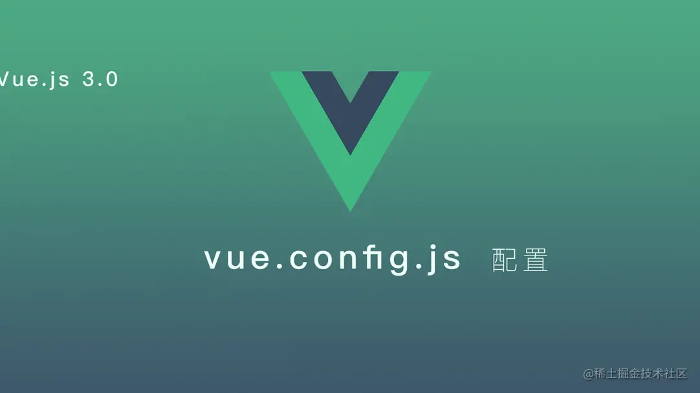

# [vue.config.js 的完整配置（超详细）！](https://www.cnblogs.com/onesea/p/15745040.html)

#  

[UU ](https://juejin.cn/user/1767670429254653)

# 

> 前段时间，对部门的个别项目进行`Vue3.0+ts`框架的迁移，刚开始研究的时候也是踩坑特别多，尤其我们的项目还有些特殊的`webpack`配置，所以，研究`vue.config.js`的配置的时候也是查阅了各种资料文档，最终，完成了项目`webpack`的特殊配置。

今天分享一下，我们项目当中的一些`webpack`配置，希望能给大家有所启发；只要配置多了，你就会发现其实所有的配置的都是相似的，尤其像插件的配置，都是十分相似的。

我们现在开始进入今天的主题啦~~

### 1 介绍

之前，我有提到过，当然大家肯定也都知道，Vue3.0不在有`webpack.config.js`的配置；但是不可避免,在项目开发中我们肯定会存在一些特殊的需求需要调整`webpack`, 这个时候，在Vue3.0的项目当中，我们就需要在根目录创建`vue.config.js`去完成`webpack`的一些特殊配置,默认它会被 `@vue/cli-service` 自动加载。

此刻，你需要创建`vue.config.js`文件。

#### 查看默认的webpack配置

> Vue CLI 官方文档：`vue-cli-service` 暴露了 `inspect` 命令用于审查解析好的 `webpack` 配置。那个全局的 vue 可执行程序同样提供了 `inspect` 命令，这个命令只是简单的把 `vue-cli-service``inspect` 代理到了你的项目中。

被抽象化的`webpack`，我们要想去理解它默认的一些配置的话是比较困难的，所以我们可以通过指令去查看。
该指令会将`webpack`的配置输出到`output.js`文件，这样方便去查看。

```js
vue inspect > output.js
复制代码
```

#### vue.config.js文件

这个文件导出了一个包含了选项的对象：

```java
module.exports = {
  // 选项...
}
复制代码
```

接下来，详细介绍一些选项及配置：

### 2 基本配置

```js
module.exports = {
    productionSourceMap: false,
    publicPath: './',
    outputDir: 'dist',
    assetsDir: 'assets',
    devServer: {
        port: 8090,
        host: '0.0.0.0',
        https: false,
        open: true
    },
    // 其他配置
    ...
复制代码
```

- productionSourceMap：生产环境是否要生成 `sourceMap`

- publicPath：部署应用包时的基本 URL,用法和 

  ```
  webpack
  ```

   本身的 

  ```
  output.publicPath
  ```

   一致

  - 可以通过三元运算去配置`dev`和`prod`环境, `publicPath: process.env.NODE_ENV === 'production' ? '/prod/' : './'`

- outputDir: `build` 时输出的文件目录

- assetsDir: 放置静态文件夹目录

- devServer: dev环境下，

  ```
  webpack-dev-server
  ```

   相关配置

  - port: 开发运行时的端口
  - host: 开发运行时域名，设置成`'0.0.0.0'`,在同一个局域网下，如果你的项目在运行，同时可以通过你的`http://ip:port/...访问你的项目`
  - https: 是否启用 `https`
  - open: `npm run serve` 时是否直接打开浏览器

### 3 插件及规则的配置

在`vue.config.js`如果要`新增/修改` `webpack` 的 `plugins` 或者 `rules` , 有2种方式。

#### `configureWebpack` 方式

configureWebpack 是相对比较简单的一种方式

- 它可以是一个`对象`：和 `webpack` 本身配置方式是一致，该对象将会被 `webpack-merge` 合并入最终的 `webpack` 配置
- 它也可以是一个`函数`：直接在函数内部进行修改配置

```js
configureWebpack: {
    rules:[],
    plugins: []
  }
configureWebpack: (config) => {
    // 例如，通过判断运行环境，设置mode
    config.mode = 'production'
} 
复制代码
```

#### `chainWebpack` 方式

chainWebpack 链式操作 (高级)，接下来所有的配置我都会在该选项中进行配置

### 4 规则rules的配置

关于`rules` 的配置，我会分别从新增/修改进行介绍。

#### 4.1 rules的新增

在`webpack`中 `rules` 是 `module` 的配置项，而所有的配置的都是挂载到 `config` 下的，所以新增一个rule方式：

```js
config.module
  .rule(name)
    .use(name)
      .loader(loader)
      .options(options)
复制代码
```

##### 案例：`style-resources-loader` 来添加`less`全局变量

##### 案例：`svg-sprite-loader` 将svg图片以雪碧图的方式在项目中加载

```js
module.exports = {
    chainWebpack: (config) => {
        // 通过 style-resources-loader 来添加less全局变量
        const types = ['vue-modules', 'vue', 'normal-modules', 'normal'];
        types.forEach(type => {
            let rule = config.module.rule('less').oneOf(type)
            rule.use('style-resource')
                .loader('style-resources-loader')
                .options({
                    patterns: [path.resolve(__dirname, './lessVariates.less')]
                });
        });

        // `svg-sprite-loader`: 将svg图片以雪碧图的方式在项目中加载
        config.module
            .rule('svg')
            .test(/\.svg$/) // 匹配svg文件
            .include.add(resolve('src/svg')) // 主要匹配src/svg
            .end() 
            .use('svg-sprite-loader')
            .loader('svg-sprite-loader') // 使用的loader，主要要npm该插件
            .options({symbolId: 'svg-[name]'}) // 参数配置
    }
}
复制代码
```

#### 4.2 rules的修改

针对已经存在的 `rule` , 如果需要修改它的参数, 可以使用 `tap` 方法：

```js
config.module
  .rule(name)
    .use(name)
      .tap(options => newOptions)

复制代码
```

##### 案例：修改`url-loader`的参数

```js
module.exports = {
    chainWebpack: (config) => {
        // `url-loader`是webpack默认已经配置的，现在我们来修改它的参数
        config.module.rule('images')
            .use('url-loader')
            .tap(options => ({
                name: './assets/images/[name].[ext]',
                quality: 85,
                limit: 0,
                esModule: false,
            }))
    }
}
复制代码
```

### 5 插件plugins 的配置

关于 `plugins` 的配置，我会分别从`新增/修改/删除`进行介绍。

#### 5.1 plugins的新增

- 注意：这里WebpackPlugin不需要通过`new WebpackPlugin()`使用。

```js
config
  .plugin(name)
  .use(WebpackPlugin, args)
复制代码
```

##### 案例：新增`hot-hash-webpack-plugin`

```js
const HotHashWebpackPlugin = require('hot-hash-webpack-plugin');
module.exports = {
    chainWebpack: (config) => {
        // 新增一个`hot-hash-webpack-plugin`
        // 注意：这里use的时候不需要使用`new HotHashWebpackPlugin()`
        config.plugin('hotHash')
              .use(HotHashWebpackPlugin, [{ version: '1.0.0' }]);
    }
}
复制代码
```

#### 5.2 plugins的修改

同理, `plugin` 参数的修改也是通过 `tap` 去修改。

```js
config
    .plugin(name)
    .tap(args => newArgs)
复制代码
```

##### 案例：修改打包后`css`抽离后的`filename`及抽离所属目录

##### 案例：删除`console`和`debugger`

```js
const HotHashWebpackPlugin = require('hot-hash-webpack-plugin');
module.exports = {
    chainWebpack: (config) => {
        // 修改打包时css抽离后的filename及抽离所属目录
        config.plugin('extract-css')
                .tap(args => [{
                    filename: 'css/[name].[contenthash:8].css',
                    chunkFilename: 'css/[name].[contenthash:8].css'
                }]);
        
        // 正式环境下，删除console和debugger
        config.optimization
                .minimize(true)
                .minimizer('terser')
                .tap(args => {
                    let { terserOptions } = args[0];
                    terserOptions.compress.drop_console = true;
                    terserOptions.compress.drop_debugger = true;
                    return args
                });
    }
}
复制代码
```

#### 5.3 plugins的删除

对于一些`webpack`默认的 `plugin` ，如果不需要可以进行删除

```js
config.plugins.delete(name)
复制代码
```

##### 案例：删除 `vue-cli3.X` 模块的自动分割抽离

```js
module.exports = {
    chainWebpack: (config) => {
        // vue-cli3.X 会自动进行模块分割抽离，如果不需要进行分割,可以手动删除
        config.optimization.delete('splitChunks'); 
        
    }
}

复制代码
```

### 6 一些常见的配置

#### 6.1 修改enter文件

```
webpack` 默认的 `entry` 入口是 `scr/main.ts
config.entryPoints.clear(); // 清空默认入口
config.entry('test').add(getPath('./test/main.ts')); // 重新设置
复制代码
```

#### 6.2 DefinePlugin

定义全局全局变量，`DefinePlugin` 是 `webpack` 已经默认配置的，我们可以对参数进行修改

```js
config.plugin('define').tap(args => [{ 
    ...args, 
    "window.isDefine": JSON.stringify(true),
    }]);
复制代码
```

#### 6.3 自定义filename 及 chunkFilename

自定义打包后js文件的路径及文件名字

```js
config.output.filename('./js/[name].[chunkhash:8].js');
config.output.chunkFilename('./js/[name].[chunkhash:8].js');
复制代码
```

#### 6.4 修改html-webpack-plugin参数

`html-webpack-plugin` 是 `webpack` 已经默认配置的，默认的源模版文件是 `public/index.html` ;我们可以对其参数进行修改

```js
 config.plugin('html')
        .tap(options => [{
            template: '../../index.html' // 修改源模版文件
            title: 'test',
        }]);
复制代码
```

#### 6.5 设置别名alias

`webpack`默认是将`src`的别名设置为`@`, 此外，我们可以进行添加

```js
config.resolve.alias
        .set('@', resolve('src')) 
        .set('api', resolve('src/apis'))
        .set('common', resolve('src/common'))
复制代码
```

### 7 附上一份我的vue.config.js的配置

```js
const path = require('path');
const HotHashWebpackPlugin = require('hot-hash-webpack-plugin');
const WebpackBar = require('webpackbar');
const resolve = (dir) => path.join(__dirname, '.', dir);

module.exports = {
    productionSourceMap: false,
    publicPath: './',
    outputDir: 'dist',
    assetsDir: 'assets',
    devServer: {
        port: 9999,
        host: '0.0.0.0',
        https: false,
        open: true
    },

    chainWebpack: (config) => {
        const types = ['vue-modules', 'vue', 'normal-modules', 'normal'];
        types.forEach(type => {
            let rule = config.module.rule('less').oneOf(type)
            rule.use('style-resource')
                .loader('style-resources-loader')
                .options({
                    patterns: [path.resolve(__dirname, './lessVariates.less')]
                });
        });

        config.resolve.alias
            .set('@', resolve('src')) 
            .set('api', resolve('src/apis'))
            .set('common', resolve('src/common'))

        config.module.rule('images').use('url-loader')
            .tap(options => ({
                name: './assets/images/[name].[ext]',
                quality: 85,
                limit: 0,
                esModule: false,
            }));

        config.module.rule('svg')
            .test(/\.svg$/)
            .include.add(resolve('src/svg'))
            .end()
            .use('svg-sprite-loader')
            .loader('svg-sprite-loader');

        config.plugin('define').tap(args => [{
            ...args, 
            "window.isDefine": JSON.stringify(true)
        }]);

        // 生产环境配置
        if (process.env.NODE_ENV === 'production') {
            config.output.filename('./js/[name].[chunkhash:8].js');
            config.output.chunkFilename('./js/[name].[chunkhash:8].js');
            config.plugin('extract-css').tap(args => [{
                filename: 'css/[name].[contenthash:8].css',
                chunkFilename: 'css/[name].[contenthash:8].css'
            }]);
            config.plugin('hotHash').use(HotHashWebpackPlugin, [{ version : '1.0.0'}]);
            config.plugin('webpackBar').use(WebpackBar);

            config.optimization.minimize(true)
                .minimizer('terser')
                .tap(args => {
                    let { terserOptions } = args[0];
                    terserOptions.compress.drop_console = true;
                    terserOptions.compress.drop_debugger = true;
                    return args
                });
            config.optimization.splitChunks({
                cacheGroups: {
                    common: {
                        name: 'common',
                        chunks: 'all',
                        minSize: 1,
                        minChunks: 2,
                        priority: 1
                    },
                    vendor: {
                        name: 'chunk-libs',
                        chunks: 'all',
                        test: /[\\/]node_modules[\\/]/,
                        priority: 10
                    }
                }
            });
        }
    }
};
```