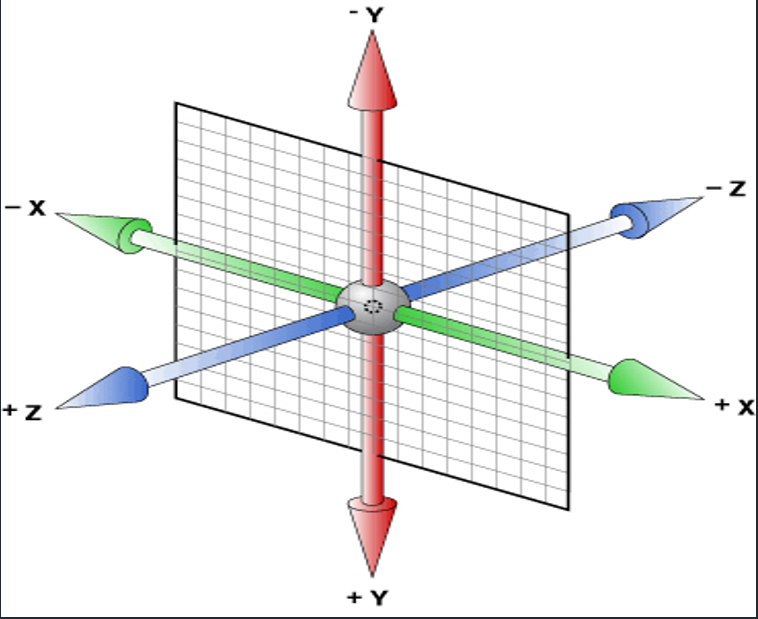
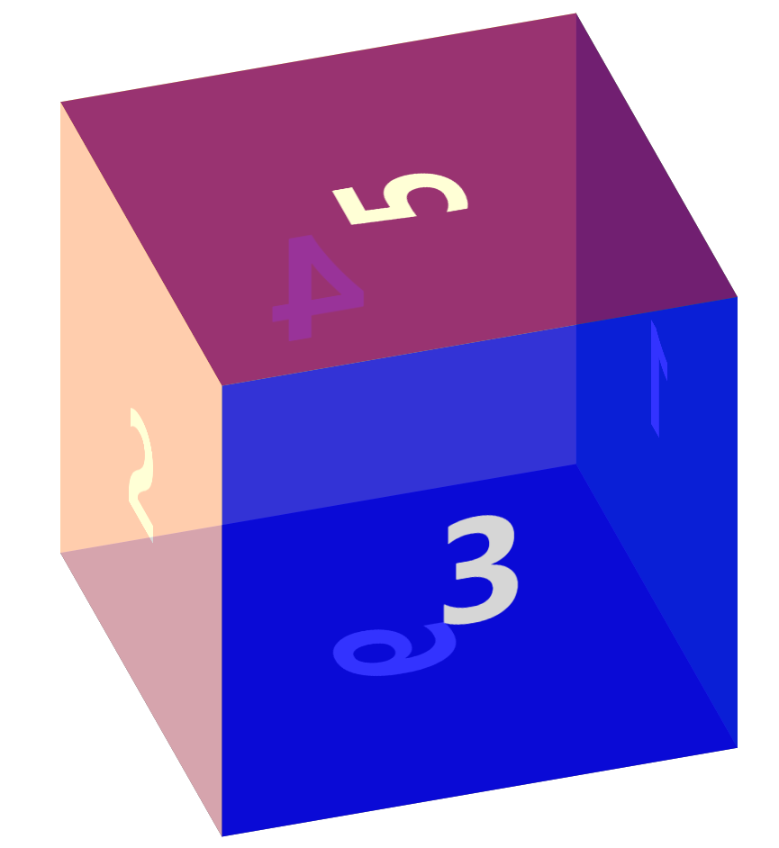

# 3D

```txt
2d场景，在屏幕上水平和垂直的交叉线x轴和y轴
3d场景，在垂直于屏幕的方法，相对于3d多出个z轴
Z轴：靠近屏幕的方向是正向，远离屏幕的方向是反向
```





# 实现3D场景

**transform-style属性**

```txt
transform-style属性是3D空间一个重要属性，指定嵌套元素如何在3D空间中呈现。他主要有两个属性值：flat和preserve-3d

其中flat值为默认值，表示所有子元素在2D平面呈现。preserve-3d表示所有子元素在3D空间中呈现。
也就是说，如果对一个元素设置了transform-style的值为flat，则该元素的所有子元素都将被平展到该元素的2D平面中进行呈现。沿着X轴或Y轴方向旋转该元素将导致位于正或负Z轴位置的子元素显示在该元素的平面上，而不是它的前面或者后面。如果对一个元素设置了transform-style的值为preserve-3d，它表示不执行平展操作，他的所有子元素位于3D空间中。
```

​       景深：离屏幕多远的距离去观察元素，值越大幅度越小。   近大远小

​		perspective: 1200px;（在父元素中使用）

​		transform:perspective(1200px) （在子元素中使用）

​		两个都设置会发生冲突，建议只设置父元素，通常的数值在900-1200之间


​		如果当你的视线距离物体足够远的时候，基本上就不会有近大远小的感觉


​      perspective-origin :  原点设置，基点位置，观察3d元素的（位置）角度


​     transform-origin : x y z  ； 属性允许您改变被转换元素的位置，设置旋转元素的基点位置； z 不能设置%；

​	 transform-origin ：	50% 50% 0；（默认值）

​     transform-style : 3D空间
​	            flat  (默认值2d)、preserve-3d   (3d，产生一个三维空间)

https://developer.mozilla.org/zh-CN/docs/Web/CSS/perspective-origin

### 3D位移

```txt
CSS3中的3D位移主要包括translateZ()和translate3d()两个功能函数；
```

+ translate3d(tx,ty,tz) 
  +  ty：代表纵向坐标位移向量的长度；
  +  tx：代表横向坐标位移向量的长度；
  +  tz：代表Z轴位移向量的长度。此值不能是一个百分比值，如果取值为百分比值，将会认为无效值。
+ translateZ(t)
  + 指的是Z轴的向量位移长度。


### 3D旋转

```txt
CSS3中的3D旋转主要包括rotateX()、rotateY()、rotateZ()和rotate3d()四个功能函数；
```

+ rotateX(a)
  + rotateX()函数指定一个元素围绕X轴旋转，旋转的量被定义为指定的角度；如果值为正值，元素围绕X轴顺时针旋转；反之，如果值为负值，元素围绕X轴逆时针旋转。
+ rotateY(a)
  + rotateY()函数指定一个元素围绕Y轴旋转，旋转的量被定义为指定的角度；如果值为正值，元素围绕Y轴顺时针旋转；反之，如果值为负值，元素围绕Y轴逆时针旋转。
+ rotateZ(a)
  + rotateZ()函数和其他两个函数功能一样的，区别在于rotateZ()函数指定一个元素围绕Z轴旋转
+ rotate3d(x,y,z,a)(建议取值0或1)
  + x：是一个0到１之间的数值，主要用来描述元素围绕X轴旋转的矢量值；
  + y：是一个０到１之间的数值，主要用来描述元素围绕Y轴旋转的矢量值；
  + z：是一个０到１之间的数值，主要用来描述元素围绕Z轴旋转的矢量值；
  + a：是一个角度值，主要用来指定元素在3D空间旋转的角度，如果其值为正值，元素顺时针旋转，反之元素逆时针旋转。


### 3D缩放

```txt
 3D缩放：CSS3中的3D缩放主要包括scaleZ()和scale3d()两个功能函数；
```

```txt
简介： CSS3 3D变形中的缩放主要有scaleZ()和scale3d()两种函数，当scale3d()中X轴和Y轴同时为1，即scale3d(1,1,sz)，其效果等同于scaleZ(sz)。通过使用3D缩放函数，可以让元素在Z轴上按比例缩放。默认值为１，当值大于１时，元素放大，反之小于１大于0.01时，元素缩小
```

+ scale3d()
  + sx：横向缩放比例；
  + sy：纵向缩放比例；
  + sz：Z轴缩放比例；
+ scaleZ(s)
  + s：指定元素每个点在Z轴的比例。

+  注：scaleZ()和scale3d()函数单独使用时没有任何效果，需要配合其他的变形函数一起使用才会有效果


## 3d案例




