## DOM

DOM 就是我们 html 结构中一个一个的节点构成的。不光我们的标签是一个节点，我们写的文本内容也是一个节点，注释，包括空格都是节点。

DOM节点分三种：元素节点、文本节点、属性节点。元素节点就是我们获取到的标签元素；标签里面的文本就是文本节点、标签上的属性就是属性节点。

### 元素节点

就是我们各种获取方法获取到的标签元素

```js
document.getElementById();
document.querySeletor();
document.querySeletorAll();
```

### 属性节点

我们通过获取属性的方法获取到的标签属性

```shell
标签元素.getAttribute();
```

### 文本节点

我们通过`innerText`获取到的文本内容就是文本节点

### 获取节点

- 获取所有子节点childNodes

  ```html
  <body>
      <div id="box">
          <p>
              <span>span标签</span>
          </p>
      </div>
  </body>
  <script type="text/javascript">
  var Odiv = document.getElementById("box");
  console.log(Odiv.childNodes);
  </script>
  ```

  说明：获取到的时所有节点，包含文本节点、元素节点。元素节点只有子元素，不包括子元素里面的内容

  | 获取元素所有子节点                        |
  | ----------------------------------------- |
  | 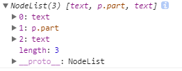 |

  看图得知：第一个节点时文本节点，代表标签中间的换行和空格，第二个节点是元素节点，第三个节点是文本节点，又是标签中间的换行和空格

- 获取所有子元素节点children

  ```html
  <body>
      <div id="box">
          <p class="part">
              <span>span标签</span>
          </p>
      </div>
  </body>
  <script type="text/javascript">
  var Odiv = document.getElementById("box");
  </script>
  ```

  说明：只获取元素节点，不包含文本节点

  | 获取所有子元素节点                        |
  | ----------------------------------------- |
  | 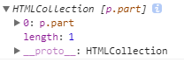 |

  看图得知：获取到的是一个伪数组，是一个集合。

- 获取第一个子节点firstChild

  ```html
  <body>
      <div id="box">
          <p class="part">
              <span>span标签</span>
          </p>
          <a href="#">链接</a>
      </div>
  </body>
  <script type="text/javascript">
  var Odiv = document.getElementById("box");
  console.log(Odiv.firstChild);
  </script>
  ```

  说明：只获取第一个节点，其实就相当于childNodes中的第一个。

  | 获取第一个子节点                          |
  | ----------------------------------------- |
  | 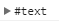 |

  看图得知：第一个节点是文本节点，相当于`Odiv.childNodes[0]`。因为div和p标签中间有换行和空格

- 获取最后一个子节点

  ```html
  <body>
      <div id="box">
          <p class="part">
              <span>span标签</span>
          </p>
          <a href="#">链接</a>
      </div>
  </body>
  <script type="text/javascript">
  var Odiv = document.getElementById("box");
  console.log(Odiv.lastChild);
  </script>
  ```

  说明：只获取最后个节点，其实就相当于childNodes中的最后一个。

  | 获取最后一个子节点                        |
  | ----------------------------------------- |
  |  |

  看图得知：第一个节点是文本节点，相当于`Odiv.childNodes[childNodes.length-1]`。

- 获取第一个<font color="red">子元素</font>节点firstElementChild

  ```html
  <body>
      <div id="box">
          <p class="part">
              <span>span标签</span>
          </p>
          <a href="#">链接</a>
      </div>
  </body>
  <script type="text/javascript">
  var Odiv = document.getElementById("box");
  console.log(Odiv.firstElementChild);
  ```

  说明：只获取元素节点，不会是文本节点。

  | 获取第一个元素节点                        |
  | ----------------------------------------- |
  | 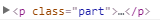 |

  看图得知：获取到的时第一个<font color="red">子元素</font>节点。

- 获取最后一个<font color="red">子元素</font>节点lastElementChild

  ```html
  <body>
      <div id="box">
          <p class="part">
              <span>span标签</span>
          </p>
          <a href="#">链接</a>
      </div>
  </body>
  <script type="text/javascript">
  var Odiv = document.getElementById("box");
  console.log(Odiv.lastElementChild);
  ```

  说明：只获取元素节点，不会是文本节点。

  | 获取第一个元素节点                        |
  | ----------------------------------------- |
  |  |

  看图得知：获取到的时最后一个<font color="red">子元素</font>节点。

- 获取下一个兄弟节点nextSibling

  ```html
  <body>
      <div id="box">
          <p class="part">段落标签</p>
          <a href="#">链接</a>
          <span>span标签</span>
      </div>
  </body>
  <script type="text/javascript">
  var oA = document.querySelector("a");
  console.log(oA.nextSibling);
  </script>
  ```

  说明：获取的是节点，有可能时文本节点。

  | 获取下一个兄弟节点                        |
  | ----------------------------------------- |
  | 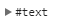 |

  看图得知：获取的是当前节点的下一个节点，不是元素。

- 获取上一个兄弟节点previousSibling，同上。

- 获取当前节点的下一个兄弟<font color="red">元素节点</font>nextElementSibling

  ```html
  <body>
      <div id="box">
          <p class="part">段落标签</p>
          <a href="#">链接</a>
          <span>span标签</span>
      </div>
  </body>
  <script type="text/javascript">
  var oA = document.querySelector("a");
  console.log(oA.nextElementSibling);
  </script>
  ```

  说明：获取是元素节点。

  | 获取下一个兄弟元素节点                    |
  | ----------------------------------------- |
  | 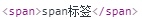 |

  看图得知：获取到的是下一个兄弟，是元素节点

- 获取当前节点的下一个兄弟<font color="red">元素节点</font>previousElementSibling，同上。

- 获取父节点parentNode，和parentElement一样

  ```html
  <body>
      <div id="box">
          <p class="part">段落标签</p>
          <a href="#">链接</a>
          <span>span标签</span>
      </div>
  </body>
  <script type="text/javascript">
  var oA = document.querySelector("a");
  console.log(oA.parentNode);
  </script>
  ```

  说明：获取到的是元素节点。

  | 获取父节点                                |
  | ----------------------------------------- |
  | 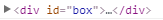 |

  父节点是元素节点。

- 获取元素的属性节点attributes

  ```html
  <body>
      <a href="#" title="跳转百度">链接</a>
  </body>
  <script type="text/javascript">
  var oA = document.querySelector("a");
  console.log(oA.attributes);
  </script>
  ```

  说明：获取到是所有属性的集合。

  | 获取属性节点                              |
  | ----------------------------------------- |
  |  |

  结果是所有属性组成的伪数组。


节点是有不同分类的。获取到节点后，可以通过节点的属性来判断节点的类型。

常用的操作：

​	<font color="red">**获取所有子元素**</font>

​	<font color="red">**获取上一个兄弟元素**</font>

​	<font color="red">**获取下一个兄弟元素**</font>

​	<font color="red">**获取父元素**</font>、

#### 获得节点总结

​	需要重点掌握的 是  获取  标签元素节点

​	所有子元素节点：元素节点.children

​	第一个子元素节点：元素节点.firstElementChild

​	最后一个子元素节点：元素节点.lastElementChild

​	下一个兄弟元素节点：元素节点.nextElementSibling

​	上一个兄弟节点：元素节点.previousElementSibling

​	获取父元素节点：元素.parentElement

​	

### 节点属性

- **nodeType**:  节点类型：元素节点 = 1  属性-2(过时)   注释-8  文本-3  [参考链接](https://developer.mozilla.org/zh-CN/docs/Web/API/Node/nodeType)

  ```html
  <body>
      <div id="box" name="hezi">
          <p class="part" >段落标签</p>
          <a href="#" title="跳转百度">链接</a>
          <span>span标签</span>
          <!-- div结束 -->
      </div>
  </body>
  <script type="text/javascript">
  var Odiv = document.getElementById("box"); // div元素节点
  var text = Odiv.firstChild; // 文本节点（中间的换行和空格）
  var note = Odiv.lastChild.previousSibling; // 换行和空格前面是注释
  var attr = Odiv.attributes[0]; // div的第一个属性，是属性节点
  console.log(Odiv.nodeType); // 1
  console.log(text.nodeType); // 3
  console.log(note.nodeType); // 8
  console.log(attr.nodeType); // 2
  </script>
  ```

  说明：nodeType属性的值不一样，代表节点的类型不同。

- **nodeName**: 节点名称

  ```html
  <body>
      <div id="box" name="hezi">
          <p class="part" >段落标签</p>
          <a href="#" title="跳转百度">链接</a>
          <span>span标签</span>
          <!-- div结束 -->
      </div>
  </body>
  <script type="text/javascript">
  var Odiv = document.getElementById("box"); // div元素节点
  var text = Odiv.firstChild; // 文本节点（中间的换行和空格）
  var note = Odiv.lastChild.previousSibling; // 换行和空格前面是注释
  var attr = Odiv.attributes[0]; // div的第一个属性，是属性节点
  console.log(Odiv.nodeName); // DIV
  console.log(text.nodeName); // #text
  console.log(note.nodeName); // #comment
  console.log(attr.nodeName); // id
  </script>
  ```

  说明：元素节点的节点名称是大写的标签名；文本节点的节点名称是`#text`；注释节点的节点名称是`#comment`；属性节点的节点名称是属性名。

- **nodeValue**: 节点值

  ```html
  <body>
      <div id="box" name="hezi">
          <p class="part" >段落标签</p>
          <a href="#" title="跳转百度">链接</a>
          <span>span标签</span>
          <!-- div结束 -->
      </div>
  </body>
  <script type="text/javascript">
  var Odiv = document.getElementById("box"); // div元素节点
  var text = Odiv.firstChild; // 文本节点（中间的换行和空格）
  var note = Odiv.lastChild.previousSibling; // 换行和空格前面是注释
  var attr = Odiv.attributes[0]; // div的第一个属性，是属性节点
  console.log(Odiv.nodeValue); // null
  console.log(text.nodeValue); // "换行和空格"
  console.log(note.nodeValue); // "div结束" -- 注释内容
  console.log(attr.nodeValue); // "box" -- 属性值
  </script>
  ```

  说明：元素节点没有节点值；文本节点的值就是文本内容；注释节点的内容就是注释的内容；属性节点的内容就是属性的值。

案例：childNodes/过滤空白节点

```js
function delSpaceDom(parentNode) {
      var sub_child = parentNode.childNodes;
      for (var i = 0; i < sub_child.length; i++) {
          if(sub_child[i].nodeType == '3' && sub_child[i].nodeName == '#text' && !/\S/.test(sub_child[i].nodeValue)){//文本节点并且是空的文本节点时，将空文本节点删除
              parentNode.removeChild(sub_child[i]);
          }
      }
      return parentNode.childNodes;
  }
```


### 节点操作

#### 创建节点

| 属性名          | 语法                               | 功能                                             |
| --------------- | ---------------------------------- | ------------------------------------------------ |
| createElement   | document.createElement(元素标签)   | 创建元素节点（创建标签）                         |
| createAttribute | document.createAttribute(元素属性) | 创建属性节点（创建属性，只有属性名，没有属性值） |
| createTextNode  | document.createTextNode(文本内容)  | 创建文本节点（创建了一个内容）                   |

例：

```js
var div = document.createElement("div"); // 创建元素节点
var attr = document.createAttribute("name"); // 创建属性节点
attr.value = 'mybox'; // 给属性节点赋值
div.setAttributeNode(attr); // 将属性节点放入元素节点中
var text = document.createTextNode("内容"); // 创建文本节点
div.appendChild(text); // 将文本节点放入元素中
console.log(div); // 输出元素节点
```

访问效果：

| 创建节点及使用                            |
| ----------------------------------------- |
| 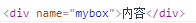 |


#### 插入节点

| 属性名       | 语法                                              | 功能                                 |
| ------------ | ------------------------------------------------- | ------------------------------------ |
| appendChild  | 父节点.appendChild(所添加的新节点)                | 向节点的子节点列表末尾添加新的子节点 |
| insertBefore | 父节点.insertBefore(所要添加的新节点，已知子节点) | 在已知的子节点前插入一个新的子节点   |

例：

```html
<body>
<div id="myid">
	大盒子
	<div>小何字</div>
</div>
<script type="text/javascript">
var p = document.createElement("p");
var a = document.getElementsByTagName("div")[1];
myid.insertBefore(p,a);
// document.getElementById("myid").appendChild(p);
</script>
</body>
```

#### 替换节点

将某个<font color="red">子节点</font>替换为另一个

```shel
语法：
	父节点.replaceChild(要插入的新节点，将被替换的老元素);
```

例：

```html
<body>
<div id="myid">
	大盒子
	<div>小何字</div>
</div>
<script type="text/javascript">
var p = document.createElement("p");
var a = document.getElementsByTagName("div")[1];
myid.replaceChild(p,a);
</script>
</body>
```

#### 复制节点

根据原来的节点复制一个节点出来

```shell
语法：
	需要被复制的节点.cloneNode(param);
```

使用说明：param的值是布尔值，为true时表示复制当前节点及其所有子节点（深复制），为false时，表示仅复制当前节点，缺省值为false（浅复制）

```html
<body>
<div id="myid">
	大盒子
</div>
<script type="text/javascript">
var n = myid.cloneNode(true);
console.log(n);
</script>
</body>
```

#### 删除节点

<font color="red">删除指定元素的某个子节点</font>

```shell
语法：
	父元素.removeChild(要删除的节点);
```

例：

```html
<body>
<div id="myid">
	大盒子
	<p id="part">段落</p>
</div>
<script type="text/javascript">
myid.removeChild(part);
</script>
</body>
```

#### 节点操作总结

​	节点操作总结：

​	创建节点：document.creatElement(标签名 - 字符串) - 返回一个节点对象

​	插入节点：

​		追加：父元素.appendChild(标签元素阶段对象)

​		插入某个元素前：父元素.insertBefore(新的子元素，旧的子元素)

​	替换节点：父元素.replaceChild(新的子元素，旧的子元素)

​	复制节点：

​		深复制---节点.cloneNode(ture) - 返回当前节点及其所有子节点

​		浅复制---节点.cloneNode(false) - 返回一个标签元素节点对象

​	删除节点：父元素.removeChild(子元素)

### 获取元素样式

我们通过元素节点的style属性赋值，就可以给元素添加样式，那能不能通过stlye属性获取元素样式呢？

```html
<body>
<style>
    div{background: #0f0;}
</style>
<div style="width:100px;height:100px;border:1px solid #000;"></div>
</body>
<script type="text/javascript">
var ODiv = document.getElementsByTagName("div")[0]; // 获取到div元素
console.log(ODiv.style.width);
console.log(ODiv.style.background);
</script>
```

访问结果：

| 使用style属性获取元素样式                 |
| ----------------------------------------- |
| 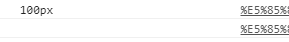 |

看图得知：给元素设置的行内样式获取到了，但是获取不到内联样式。

也就是说，style属性只能获取到元素的行内样式。

那么如何获取元素的内联样式以及外联样式呢？

通过window对象的getComputedStyle方法：

语法：

```shell
window.getComputedStyle(元素).css属性;
```

返回一个对象，这个对象中包含了元素所有的样式。如果访问的对象并不存在属性，返回undefind

获取元素样式的函数

```js
function getStyle(ele,attr){
	if(window.getComputedStyle){
		return getComputedStyle(ele)[sttr]
	}else{
		return ele.currentStyle[sttr]
	}
}
```


例：

```html
<body>
<style>
    div{background: #0f0;}
</style>
<div style="width:100px;height:100px;border:1px solid #000;"></div>
</body>
<script type="text/javascript">
var ODiv = document.getElementsByTagName("div")[0]; // 获取到div元素
var bg = window.getcomputedStyle(ODiv).background;
console.log(bg);
</script>
```

访问结果：

| 获取元素样式                              |
| ----------------------------------------- |
| 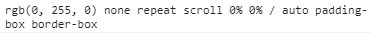 |

这个方法在IE中不起作用，那在IE中用什么获取样式？

使用元素的currentStyle属性：

语法：

```shell
元素.currentStyle;
```

这个对象返回的也是一个包含元素所有样式的对象

例：

```html
<body>
<style>
    div{background: #0f0;}
</style>
<div style="width:100px;height:100px;border:1px solid #000;"></div>
</body>
<script type="text/javascript">
var ODiv = document.getElementsByTagName("div")[0]; // 获取到div元素
var ODivStyles = ODiv.currentStyle;
console.log(ODivStyles);
</script>
```

访问结果：

| IE下获取元素样式                          |
| ----------------------------------------- |
| 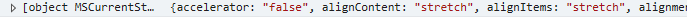 |

节点操作案例：qq菜单案例

```html
<link rel="stylesheet" href="./font/iconfont.css">
<style>
*{
    padding: 0;
    margin: 0;
    list-style:none;
}
ol{
    width:300px;
    background-color: pink;
    padding-left:10px;
    margin:50px auto;
}
h2{
    font-size:20px;
    height:30px;
    line-height:30px;
}
ol ul{
    display:none;
}
ol ul li{
    font-size:18px;
    height:24px;
    line-height:24px;
    padding-left:2em;
    background-color: #666;
    color:#fff;
    margin:5px 0;
}
</style>
</head>
<body>
<ol>
    <li>
        <h2><i class="iconfont icon-arrowRight"></i>我的好友</h2>
        <ul>
            <li>张三</li>
            <li>李四</li>
            <li>王五</li>
        </ul>
    </li>
    <li>
        <h2><i class="iconfont icon-arrowRight"></i>我的坏友</h2>
        <ul>
            <li>张小三</li>
            <li>李小四</li>
            <li>王小五</li>
        </ul>
    </li>
    <li>
        <h2><i class="iconfont icon-arrowRight"></i>黑名单</h2>
        <ul>
            <li>张大三</li>
            <li>李大四</li>
            <li>王大五</li>
        </ul>
    </li>
</ol>
</body>
<script src="./js/jquery.js"></script>
<script type="text/javascript">
var h2 = document.querySelectorAll("h2");
var onOff = true;
for(var i=0;i<h2.length;i++){
    h2[i].onclick=function(){
        var oi = this.querySelector("i");
        var ul = this.nextElementSibling;
        var attr = ul.getAttribute("name");
        // var s = window.getComputedStyle(ul).display;
        // if(s == "none"){
        if(!attr){
            for(var j=0;j<h2.length;j++){
                var oii = h2[j].querySelector("i");
                var ull = h2[j].nextElementSibling;
                oii.className = 'iconfont icon-arrowRight';
                ull.style.display = 'none';
            }
            oi.className = 'iconfont icon-changyongtubiao-xianxingdaochu-zhuanqu-';
            ul.style.display = 'block';
            ul.setAttribute("name","block");
        }else{
            oi.className = 'iconfont icon-arrowRight';
            ul.style.display = 'none';
            ul.removeAttribute("name");
        }
        /*
        用样式判断的时候不要使用颜色的值 - 颜色值在内部有可能会变成rgb，判断不准确
        判断的时候不要使用路径去判断
        */
    }
}
</script>
```

效果图：

| qq菜单案效果              |
| ------------------------- |
| 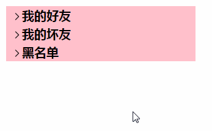 |

### 获取元素的坐标和大小

在DOM中有一些offset开头的属性，在实际开发中用的比较多。他们可以获取元素的大小、元素的位置等。

#### 获取元素的宽度和高度

语法：

```shell
元素.offsetWidth; # 获取元素的宽度
元素.offsetHeight; # 获取元素的高度
```

例：

```html
<style>
    .box{
        width:100px;
        height:50px;
        background:red;
    }
</style>
<div class="box">
    
</div>
<script>
var box = document.querySeletor(".box");
console.log(box.offsetWidth,box.offsetHeight); // 120 70
</script>
```

使用说明：

1. 这两个属性获取到的元素大小是包含边框的。
2. 这两个属性获取到的结果是数字，方便计算。
3. 这个属性只能获取不能设置，是只读属性。

这两个属性其实和通过样式获取到的值是一样的，样式中的宽高是包含单位的，不方便计算，所以在需要使用宽高来计算的时候使用这两个属性更加方便。

#### 获取定位原点参考的父元素

我们知道，当给一个元素设置定位的时候，参考的原点位置需要一个设置定位的父元素，如果父元素没有设置过定位，那就找父元素的父元素，一直往上，直到找到HTML，那就以html作为定位的参考元素。

offset开头的属性中有一个属性就是找这个参考元素的。

语法：

```shell
元素.offsetParent; # 获取定位需要参考的元素
```

例：

```html
<style>
    .box{
        width:300px;
        height:200px;
        background:red;
		position:relative;
    }
	.smallBox{
		width:100px;
		height:100px;
		background:blue;
		position:absolute;
		left:100px;
		top:50px;
	}
</style>
<div class="box">
    <div class="smallBox"></div>
</div>
<script>
var smallBox = document.querySelector(".smallBox");
console.log(smallBox.offsetParent);
</script>
```

效果：

| 设置定位的参考元素                        |
| ----------------------------------------- |
| 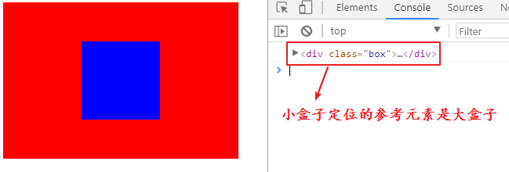 |

当父元素没有设置定位的时候，定位参考的元素应该是html，但在这里输出的是body。

例：

```html
<style>
    .box{
        width:300px;
        height:200px;
        background:red;
    }
	.smallBox{
		width:100px;
		height:100px;
		background:blue;
		position:absolute;
		left:100px;
		top:50px;
	}
</style>
<div class="box">
    <div class="smallBox"></div>
</div>
<script>
var smallBox = document.querySelector(".smallBox");
console.log(smallBox.offsetParent);
</script>
```

效果：

| 父元素没有设置定位的时候，参考元素是body  |
| ----------------------------------------- |
| 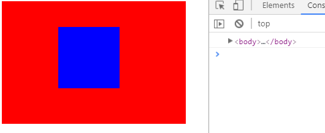 |

#### 获取元素的位置

offset开头的属性中还有有可以获取元素的位置的。

语法：

```shell
元素.offsetLeft; # 获取元素左边的距离
元素.offsetTop; # 获取元素上边的距离
```

例：

```html
<style>
    .box{
        width:300px;
        height:200px;
		margin:atuo;
        background:red;
		position:relative;
    }
	.smallBox{
		width:100px;
		height:100px;
		background:blue;
		position:absolute;
		left:100px;
		top:50px;
        transform:translateX(10px);
		margin-left:20px;
	}
</style>
<div class="box">
    <div class="smallBox"></div>
</div>
<script>
var smallBox = document.querySelector(".smallBox");
console.log(smallBox.offsetLeft,smallBox.offsetTop);
</script>
```

效果：

| 元素左边的距离                            |
| ----------------------------------------- |
| 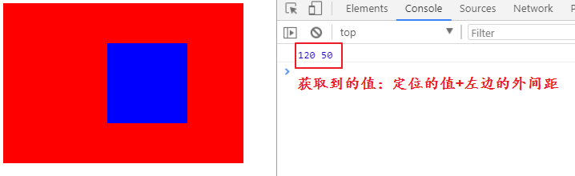 |

使用说明：

1. 获取到的值包括外间距，包括设置过的定位的值。
2. 这个定位过的值其实是自身到offsetParent的距离。

如果父元素没有设置过定位，那得到的值是自身到body的距离。如果自己也没有设置过定位，那就是自己到html的距离。

例：

```html
<style>
    .box{
        width:300px;
        height:200px;
        background:red;
    }
	.smallBox{
		width:100px;
		height:100px;
		background:blue;
	}
</style>
<div class="box">
    <div class="smallBox"></div>
</div>
<script>
var smallBox = document.querySelector(".smallBox");
console.log(smallBox.offsetLeft,smallBox.offsetTop);
</script>
```

效果：“

| 自身到html的距离                          |
| ----------------------------------------- |
| 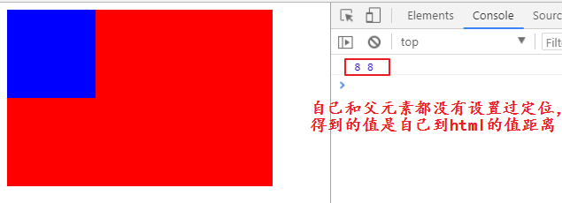 |

也就是说，获取位置的时候，首先是要找到设置过定位的父元素，如果找到了，就是从父元素开始计算。如果没找到，就从body开始计算，如下图所示

| offset系列总结示意图                      |
| ----------------------------------------- |
| 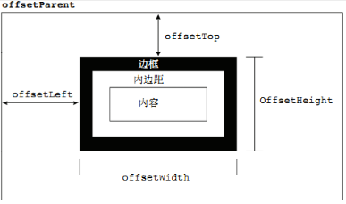 |

#### client获取元素大小

使用元素的clientWidth和属性clientHeight属性也能获取到元素的大小

语法：

```shell
元素.clientWidth; # 获取元素的宽度
元素.clientHeight; # 获取元素的高度
```

例：

```html
<style>
    .box{
        width:100px;
        height:50px;
        background:red;
    }
</style>
<div class="box">
    
</div>
<script>
var box = document.querySeletor(".box");
console.log(box.clientWidth,box.clientHeight); // 100 50
</script>
```

使用说明：使用这两个属性获取到的元素的大小是不包含边框的大小。

和offset获取宽高的比较：

```html
<style>
    .box{
        width:100px;
        height:50px;
        background:red;
        border:10px solid #000;
    }
</style>
<div class="box">
    
</div>
<script>
var box = document.querySelector(".box");
// 不包含边框的宽和高
console.log(box.clientWidth,box.clientHeight); // 100 50
// 包含边框的宽和高
console.log(box.offsetWidth,box.offsetHeight); // 120 70
</script>
```

结果：

| 获取宽高的比较                            |
| ----------------------------------------- |
| 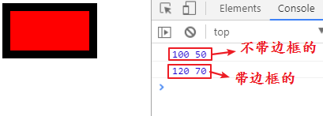 |

总结获取元素的大小

元素.offsetWidth  			元素.offsetHeight    ----包含边框

元素.offsetLeft 				元素.offsetTop         ----位置

元素.clientwidth			  元素.clientHeight     ----不包含边框

### DOM获取窗口大小

BOM有获取浏览器窗口大小的方法：	

```js
window.innerWidth
window.innerHeight
```

这两个获取窗口大小的时候，包含了滚动条的范围。

DOM也有获取窗口大小的方法

```js
document.documentElement.ClientWidth
document.documentElement.clientHeight
```

DOM获取的大小中不包含滚动条的范围。

DOM获取body的尺寸

```js
document.body.clientWidth
document.body.ClientHeight
```


