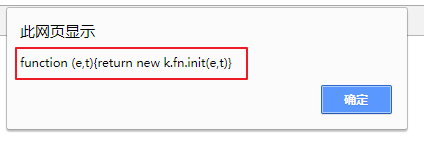
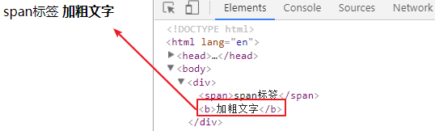
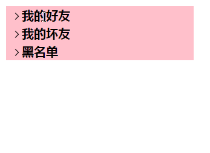
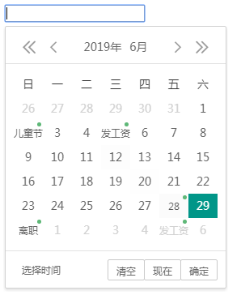
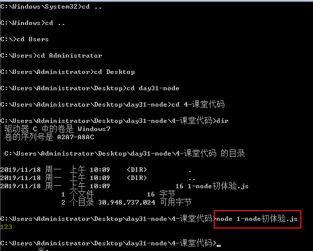
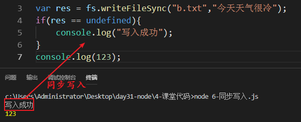
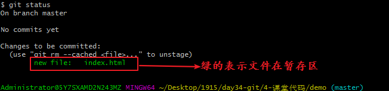
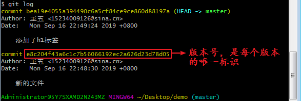
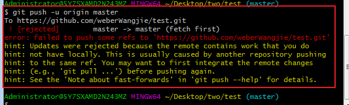

[TOC]


# 一、PHP

## 	1、服务器介绍

### 		a、网页访问过程

| 请求过程                                                     |
| ------------------------------------------------------------ |
| 访问过服务器的标志：访问的时候要有协议（http）。 |

### 	b、程序员工作流程

```js
#用户 => 前端 => 后端 => 数据库

- 用户向前端人员要一个网页
- 前端人员准备一个网页给用户，但是网页中的数据是找后端人员要的
- 后端人员接受到前端人员要数据以后，去数据库里面找到对应的数据，给到前端人员
- 前端人员拿到数据以后渲染在页面上
- 最后把这个页面给到用户看
```

### 		c、服务器的访问细节

```js
#url：表示我们访问的地址
#url的组成部分：
	- 传输协议：：http  https
	- 域名：www.baidu.com
	- 端口号：80 443
#协议：
	规定用户和服务器交互的规则和方式，常见的有http，https，ftp，sftp，tcp。。
#域名：
	本来访问服务器都需要ip地址，但ip地址不方便记忆，万维网就将每个ip都设置一个英文名字
#端口号：
	服务器上只有一个文件夹，里面有256个文件夹，每个文件夹里面又有256个文件夹，共65536个文件夹，通过0-65535作为入口访问。
```

## 2、PHP

### 	a、环境

```
tomact    Apache     nginx
```

| 服务器示例                                |
| ----------------------------------------- |
|  |

### b、基本语法

文件后缀是php，其中的代码放在一个结构中：<?php开头， ？>结尾，

每行结束必须有"<font color="red" size="12"> ;</font>"

#### 	1、输出方式：

```php
echo 1;	//文本方式输出，输出基本类型
$arr = [1,2,3];
var_dump($arr)//基本类型和复杂类型都能输出
```

注释和js中使用一致

#### 	2、变量

使用$来定义变量

```
$a = 10;
```

php中的基本数据类型：

   整型    浮点型    布尔型   字符串   还有数组和null   

运算符合js中一致，字符串拼接使用。

#### 	3、条件语句

和js中的用法一致

#### 	4、循环语句

和js中国的用法一致

没有for in 的语法

```php
foreach($arr as $k=>$v){
	//专门用来遍历关联数组的方法
}
```

​	5、数组

创建数组两种方式

```php
$arr = [1,2,3];
$arr = array(1,2,3);  //索引数组
```

数组类型有两种：

```php
$arr = [1,2,3];
$arr = ["name"=>"张三"，"age"=>20];	//关联数组，理解为js中的对象
```

前端和PHP进行交互的时候，大多数据用的都是数组，但是数组直接传送，需要转换为字符串

PHP将数组转换为字符串：

```php
json_encode(PHP数组);
```

php将json字符串转为数组：

```php
json_decode(json字符串);
```

### c、数据库

​	1、简介

mysql  /  sqlserve  /  oracle  ...

MySQL是最流行的<font color="red">关系型数据库</font>管理系统.

数据库就是用来储存数据库的，结构类似于excl表格。

组成部分：库、表、字段、数据

```
* 关系数据库管理系统(Relational Database Management System)的特点
	* 数据以表格的形式出现
	* 每行为各种记录名称
	* 许多的行和列组成一张表单
	* 若干的表单组成database
* 主键：主键是唯一的。一个数据表中只能包含一个主键。你可以使用主键来查询数据。
```

### d、数据类型

```
* 数值类型

| 类型 | 大小 | 用途 |
| ------ | ------ | ------ |
| TINYINT | 1 字节 | 小整数值 |     -127~127   unsign   0~255
| SMALLINT | 2 字节 | 大整数值 |
| MEDIUMINT | 3 字节 | 大整数值 |
| INT或INTEGER | 4 字节 | 大整数值 |   10位数  
| BIGINT | 8 字节 | 极大整数值 |     
| FLOAT | 4 字节 | 单精度 浮点数值 |
| DOUBLE | 8 字节 | 双精度 浮点数值 |
| DECIMAL |  | 小数值 |

* 日期和时间类型

| 类型 | 格式 | 用途 |
| ------ | ------ | ------ |
| DATE | YYYY-MM-DD | 日期值 |
| TIME | HH:MM:SS | 时间值或持续时间 |
| YEAR | YYYY | 年份值 |
| DATETIME | YYYY-MM-DD HH:MM:SS | 混合日期和时间值 |
| TIMESTAMP | YYYYMMDD HHMMSS | 时间戳 |

* 字符串类型

| 类型 | 大小 | 用途 |
| ------ | ------ | ------ |
| CHAR | 0-255字节 | 定长字符串 |
| VARCHAR | 0-65535 字节 | 变长字符串 |
# char 和 varchar
varchar节省空间 - 根据实际数据的长度占用空开关键
char定长的空间，不管数据有多长，占用的空间都是固定的
| TINYBLOB | 0-255字节 | 不超过 255 个字符的二进制字符串 |
| TINYTEXT | 0-255字节 | 短文本字符串 |
| BLOB | 0-65 535字节 | 二进制形式的长文本数据 |
| TEXT | 0-65 535字节 | 长文本数据 |
| MEDIUMBLOB | 0-16 777 215字节 | 二进制形式的中等长度文本数据 |
| MEDIUMTEXT | 0-16 777 215字节 | 中等长度文本数据 |
| LONGBLOB | 0-4 294 967 295字节 | 二进制形式的极大文本数据 |
| LONGTEXT | 0-4 294 967 295字节 | 极大文本数据 |
```

### e、数据库操作

增

```shell
insert[into] 表名(字段1，字段2，。。。) values(值1，值2，值3，。。。)[,(值1，值2，。。。)];
$res = mysqli_query($con,"insert user(name,pass,tel,email) values('$username','$pass','$tel','$email')");
```

如果是所有字段可以将字段列表省略。

为了避免关键字，在字段名称和表名上面加反引号。


删：

```
delete from 表名 [条件];
```

改：

```
update 表名 set 字段=值[,字段=值] [条件];
```

可以在值中使用字段

查：

```
#查所有
select * from 表名；
#按字段查
select 字段1[,字段2] from 表名；
#按条件查
select * from 表名 where 条件；
#分页查
select * from 表名 limit 开始条数，显示条数；
#排序查
select * from 表名 order by 字段；
#模糊查
select * from 表名 字段 like ‘字段’；
```

条件：

```php
#等于
字段=值
#不等于
字段!=值
#大于
字段>值
#小于
字段<值
#之间
字段 between 开始值 and 结尾值
```


## 3、PHP操作数据库

### 	a、PHP连接数据库

```php
// 创建连接
$con = mysqli_connect(主机名,用户名,密码,数据库名); // 返回连接信息
// 执行语句
$res = mysqli_query(连接信息，sql语句); // 返回查询的表里的信息
// 从结果中将数据取出来
$arr = [];
while($row = mysqli_fetch_assoc($res)){
    $arr[] = $row;
}
```


# 二、HTTP协议和会话

### 第一步：建立通讯

|                                                              |
| ------------------------------------------------------------ |
|  |


### 第二步：开始通讯

​	通讯主要分两个过程，一个是客户端向服务器发起请求（Request），一个是服务器向客户端发起响应（Reponse）

| 请求的时候，主要是发送请求报文                               |
| ------------------------------------------------------------ |
|  |

#### 请求

请求的时候，主要是发送请求报文

请求行：

```shell
POST /user HTTP/1.1
# POST 请求方式
# /user 请求URL（不包含域名）
# HTTP/1.1 请求协议版本
```

请求头： 

```shell
user-agent: Mozilla/5.0 # 产生请求的浏览器信息
accept: application/json # 表示客户端希望接受的数据类型
Content-Type: application/x-www-form-urlencoded # 客户端发送的实体数据格式
Host: 127.0.0.1 # 请求的主机名（IP）
```

请求头都是键值对。

请求空行：

请求头和请求主体之间要有一个空行。好截取内容。

请求主体：

```shell
# GET 请求是没有请求体数据的
# POST 请求才有请求体数据
```

请求主体就是请求的时候携带的数据。

#### 常见的请求方式：

1、GET：查

2、POST：增

3、PUT：改

4、DELETE：删

GET和POST的区别

1. get请求的数据会显示在地址栏，post的数据不显示

2. get请求的数据大小有限制：

   - IE： 2083 个字符
   - FireFox： 65536 个字符
   - Safari： 80000 个字符
   - Opera： 190000 个字符
   - Chrome： 8182 个字符

   post请求的数据没有限制，除非服务器主动设置。

3. get请求的数据类型必须是ASCII，post没有限制

4. get相对不安全，post相对安全

#### 响应

每一个响应，都会有响应报文（包含3部分内容）

响应行：

```shell
HTTP/1.1 200 OK
# HTTP/1.1 服务器使用的 HTTP 协议版本
# 200 响应状态码
# OK 对响应状态码的简单解释
```

响应头：

```shell
Date: Jan, 14 Aug 2019 12:42:30 GMT # 服务器时间
Server: Apache/2.4.23 (Win32) OpenSSL/1.0.2j PHP/5.4.45 # 服务器类型
Content-Type: text/html # 服务端给客户端的数据类型
Content-Length: 11 # 服务端给客户端的数据长度
```

响应主体：

```shell
hello world
# 服务端给客户端的响应数据
```

### 第三步：断开连接

| 断开连接的过程，我们称之为“四次挥手”。                       |
| ------------------------------------------------------------ |
|  |

#### 常见的HTTP响应状态码：

1. 100 ~ 199：一般我们看不到，因为表示请求继续

2. 200 ~ 299：请求成功

3. 300 ~ 399：表示重定向

   - 301： 永久重定向
   - 302： 临时重定向

4. 400 ~ 499：客户端错误

   - 401： 未授权（你要登录的网站需要授权登录）

   - 403： 服务器拒绝了你的请求
   - 404： 服务器找不到你请求的 URL

5. 500 ~ 599：服务端错误

   - 500： 服务器内部错误
   - 503： 服务器当前不可用（过载或者维护）

# 三、会话（cookie）

## 	1、cookie简介

cookie是浏览器提供的一个储存数据的空间。

## 	2、js设置cookie

```
document.cookie = 'name=张三；'；
```

## 	3、cookie操作

#### 			a、设置语法:

```
document.cookie = '键=值；expires=失效时间；path=能使用当前cookie的路径‘；
```

cooKie不能一次性设置多个键值对，要设置多个cookie就设置多次；

获取cookie;

var cookie = document.cookie;

获取到的多条cookie中间使用分号和空格隔开。

修改cookie，就是重新设置。

删除cookie，就是，将失效时间设置为当前时间以前。

```js
var date = new Date();
date.setTiem(date.getTime()-1000*60*60*8-1); // 当前时间的上一秒
document.cookie = 'name=zhangsan;expires='+date;
```

#### 		b、cookie特点（基于http协议的）

1、cookie的最大数据量限制为4kb

2、cookie最大数量限制在50条（不一定，现在谷歌可以设置150条左右）

3、cookie有时效性，一般是会话级别（浏览器关闭就过期）

4、cookie是基于域名储存的 -  当前域名下设置的cookie，只能在当前域名下访问

5、cookie是预计路径储存的 -  当前路径下设置的cookie，之能在当前路径下使用，别的路径中无法使用


#### 		c、封装cookie操作

设置cookie封装

```js
function setCookie(key,value,second,path="/"){
    var date = new Date(); // 失效时间
    date.setTime(date.getTime() + second*1000 - 8*3600*1000);
    document.cookie = `${key}=${value};expires=${date};path=${path}`;
}
```

#### 		d、取cookie封装

```js
function getCookie(key){
    var res = document.cookie;
    var arr = res.split("; ");
    for(var i=0;i<arr.length;i++){
        var brr = arr[i].split("=");
        if(brr[0]==key){
            return brr[1];
        }
    }
}
```

#### 		e、删除cookie封装：

```js
function delCookie(name) {
  setCookie(name, 1, -1)
}
```

## 4、PHP操作cookie

### 		a、设置cookie：

```shell
语法：
setcookie(键，值，失效时间);
```

```php
例：
setcookie("name","zhangsan",time()+10);
```

### 	b、读取cookie：

```shell
语法：
$_COOKIE[键]
```

```php
例：
print_r($_COOKIE["name"]);
```

php第一次设置时，访问不到cookie，因为第一次设置是给客户端响应信息，并告诉浏览器要设置cookie，此时的浏览器中并没有cookie，当第二次访问的时候，在请求信息带了cookie，php才能读取出来。

cookie操作必须依赖http协议，不要直接使用浏览器打开html页面来操作cookie

## 5、本地存储

浏览器为了前端攻城狮的数据使用方便，提供了一个存储数据的空间，将数据永久性存储在客户端上，不主动删除就一直在浏览器上。言外之意就是说，存的多了，会导致浏览器很卡。

本地存储也是使用键值对的形式进行存储的。

设置本地存储数据：

```js
localStorage.setItem(键，值);
```

获取本地存储数据：

```js
localStorage.getItem(键);
```

获取本地存储的数据条数：

```js
localStorage.length
```

删除本地存储：

```js
localStorage.removeItem(键);
```

清空本地存储：

```js
localStorage.clear();
```

修改本地存储的数据就是重新设置。

本地存储的特点：

1. 也是按照域名存储的
2. 存储的值是字符串类型，如果是数字，会自动转为字符串存储
3. 键是唯一的（有就修改，没有就增加）
4. 很多情况下需要存储对象，存储对象要先转为字符串存储（使用`JSON.stringify()`），取出来再转为json对象（使用`JSON.parse()`）


# 四、AJAX

## 1、概念

可以不刷新页面发送http请求，接受到服务器给客户端的数据。

AJAX，全称`async javascript and XML`，是一个异步执行的和后台交互的技术。

<font color="red">**ajax最大的特点：不刷新页面发送http请求**</font>


## 2、AJAX的优势

a、不需要插件主持（一般浏览器且默认开启JavaScript即可）

b、用户体验极佳（不刷新页面即可获取可更新的数据）

c、提升Web程序的性能（在传递数据方面做到按需放松，不必整体提交）

d、减轻服务器和宽带的负担

e、缺点：搜索引擎的支持度不够


## 3、AJAX的书写

​	a、创建ajax对象，相当于要打电话了，先要安装一部电话

```js
vavar AJAX=new XMLHttpRequest(); // 这种写法在ie下是不能兼容的
var AJAX = new ActiveXObject("Microsoft.XMLHTTP"); // 兼容ie678
var AJAX = new ActiveXObject("Msxml2.XMLHTTP"); // 更低版本ie
```

​	兼容所有浏览器的兼容写法

```js
function createAJAX(){
	var AJAX = null;
    if(window.XMLHttpRequest){
        AJAX=new XMLHttpRequest();
    }else if(window.ActiveXObject){
        AJAX = new ActiveXObject("Microsoft.XMLHTTP");
    }else{
        alert("请升级浏览器");
    }
    return AJAX;
}
```

b、建立一个http请求，，相当于打电话的时候开始拨号

```
AJAX.open(请求方式，请求地址，true);
参数1：请求方式：get/post
参数2：请求地址
参数3：true是异步请求，false是同步请求
```

​	c、监听ajax请求状态，绑定事件处理程序，等待对方接起电话

```
AJAX，onreadystatechange = function(){
	if(AJAX.readyState == 4 && AJAX.status == 200){
		AJAX.responsetText;//从服务器返回的文本信息
	}
}
```

说明：

- onreadystatechange是状态改变事件，只要ajax状态发生改变就会触发这个事件

- readyState是ajax对象请求的状态

  - ​	0：未初始化，对象已经建立，但是还未初始化，就是还未调用send方法

    ​	1：已经初始化，但是还没有调用send方法

    ​	2：发送数据，send方法已经调用，但是http头未知

    ​	3：数据接收中，已经接收部分数据，因为响应以及http头不全，这是通过responseText获取少部分数据会出现错误

    ​	4：请求完成，数据接收完毕，此时可以通过responseText获取完整的相应数据

#responseText是接收服务器响应的字符串数据，如果是xml数据使用responseXML来接收，如果是json数据，其实也是使用字符串形式相应回来的，使用responseText接收以后，使用JSON.parse(str)或str.parseJSON()转为json对象处理

​	d、发送请求，拨出号码

```
ajax.send(null);
```

如果是post请求的话，需要在发送请求前，设置post请求头，模拟表单来传递数据给服务端（否则获取不到send中的参数）

```js
ajax.setRequestHeader('content-type', 'application/x-www-form-urlencoded')
```

send发送请求的时候要携带请求参数（键1=值1&键2=值2）

```js
ajax.send('name=Jack&age=18&gender=男')
```

## 4、接受的数据

a、接收的文本

```
var response = ajax.responseText;
```

b、接收xml

```
var xml = ajax.responseXML
```

c、接收json

```
var json = ajax.respponseText;
var obj = JSON,parse(json);
```

## 封装通用的ajax


# 五、AJAX和Promise

## 1、回调函数

概念：将一个函数当做参数传入另一个函数的时候，这个函数就叫回调函数。

| 回调地狱                                  |
| ----------------------------------------- |
|  |

这样的代码难以阅读和维护，这是著名的”回调地狱“

## 2、Promise（地狱）

Promise是承诺的意思，表示他承诺帮你做这件事，然后将结果给你

```js
#语法
new Promise(function(resolve, reject){
	//resolve 表示成功的回调
	//reject 表示失败的回调
}).then(function(res){
	//成功的函数
}).catch(function(err){
	//失败的函数
})
```


在Promise构造函数中，提供了两个参数，分别表示执行成功和失败的回调函数，执行成功都调用resolve，失败调用reject即可，具体resolve和reject的执行，分别在then和catch中

这样可以将回调函数变成链式结构，从而解决了回调地狱的问题。

使用说明：

1、Promise的then可以直接写在对象后面

2、如果在Promise的then里面返回一个Promise对象，那么里面的Promise的then可以跟在外面的Promise的then后面

补充：then和catch不会同时触发，，也就是说只要一个then出错，执行最底下的catch就行，所以也就可以连续写多个then每一个catch就行。

Promise优化

​		封装Promise


## 3、ASYNC/AWAIT

es7提供了async/await来编写异步代码，是回调地狱的终极解决方案。

他可以将异步代码写的和同步代码一样。

语法：

```
async function fn(){
	const res = await promise对象
}
```

只要是Promise对象，那么我们就可以使用async、await来书写

使用说明：

a、async修饰的函数，需要调用的话，就正常调用

b、await必须包在async修饰的函数中

c、await后面必须是一个promise对象且Promise调用了resolve，且传入了数据 - await等待的就是这个数据


## 4、跨域

浏览器有同源策略的限制  -  不同源不允许请求

同源策略：所谓同源，就是指域名、协议、端口都相同。

跨域：就是通过各种手段获取不同源的数据

设置虚拟主机

// C:\Windows\System32\drivers\etc


1、使用php做代理

也就是说跨域请求只是限制客户端向服务端，如果是服务端向服务端请求的话就不存在这个问题，也就是说需要跨域的请求交给php服务端来做，有了结果再响应给ajax即可。

原理上利用的php的爬虫技术。有`file_get_contents()`、`curl`、`ob_get_contents()`

2、在服务端设置响应头，允许跨域请求

如果请求的服务端是自己可操作的话，可以在php端设置允许跨域的响应头，代码如下

```js
header("Access-Control-Allow-Origin:*");
```

3、使用服务器代理（nginx）

在nginx配置文件中配置代理，具体配置如下：

```
localhost = 自定义url {
	proxy_pass 待跨域请求的地址
}
```

4、通过jsonp来实现

利用标签可以跨域（当前网页的图片链接可以是别的网站上的图片）的特性、制作标签进行跨域


# 六、ajax和bootstrap

bootstrap是一个前端框架。在这个框架中别人已经将很多样式写好了，我们只需要拿标签选择使用类型即可。

使用步骤：

下载：https://v3.bootcss.com/

引入包：`<link rel="stylesheet" href="bootstrap.css"`

使用：写标签，加类名


# 七、闭包和继承

## 1、闭包

闭包：

```js
function fun(){
    var num=1;
    return function(){
        return ++num;
    }
}
var fn = fun();
fn(); // 2
fn(); // 3
```

调用fun的时候，在执行空间中，创建了一个空间，里面存储小函数的地址，这个地址在全局中被fn变量接收。只要在全局中能使用fn，那么执行空间就不能销毁，否则fn就不能用了。所以每次调用fn后，执行空间都没有销毁。

函数嵌套，小函数内部使用大函数的变量，大函数就形成了闭包。

优点：

​	a、作用域空间不销毁，所以变量也不会被销毁，增加了变量的生命周期

​	b、在函数外部可以访问内部的变量

​	c、保护私有变量，将变量定义在函数内部，不会污染全局

缺点：

​	a、因为函数外部可以访问函数内部的变量，导致变量和内部的函数引用关系一直存在，内存不能销毁，会一直占用，使用量较大时会导致内存溢出

## 2、继承

### a、原型继承

将父类的对象赋值给子类的原型

### b、借用函数继承

把父类构造函数体借用过来使用一下

父类.call(this)

借用函数继承有个缺点：不能继承父类原型上的方法，所以在借用函数的基础上再进行原型的方式继承

### c、混合继承

就是把原型继承和借用构造函数继承两个方式组合在一起

```js
function Animal(){
    this.name = "动物";
}
Animal.prototype.dong=function(){ // 将父类方法绑定到子类上
    console.log("能动");
}
function Dog(){
    Animal.call(this); // 将父类借用一下，并将函数的this原来是父类改变成子类
    this.jiao = '汪汪';
}
Dog.prototype=new Animal();  //原型继承
var ergou = new Dog();
console.log(ergou.name); // 访问子类的name属性- 动物、
ergou.dong(); // 调用dong方法，也能访问了
```


### d、es6继承（class）

es6中新增了定义类（构造函数的方式）

```
#语法：
class aaa{

}
var aaa = new aaa（）；
console.log(aaa)  //aaa{}
```

这种方式定义的类，也必须和new配合使用。

如果在实例化需要传参数的话吗，就在这个类中，写一个函数，名字必须是constructor

```
class Animal{
    constructor(name){
        this.name = name;
    }
}
var animal = new Animal("动物");
console.log(animal); // Animal {name: "动物"}
```

这种方式的类继承很容易，而且是固定语法：

```shell
class 子类 extends 父类{
    constructor(){
		super();
	}
}
```

<font color="red">**总结：继承就是让一个类拥有另一个类的属性和方法。**</font>


# 七、设计模式

## 1、概念

设计模式是为了解决某种问题，而设计的一套最佳解决方案。

## 2、单例模式

让一个类创建出来的所有对象，里面的所有属性和方法都一模一样。

及就是让这两个对象是一样的，也就是说，一个类永远只有一个实例对象

```js
var single = (function(){
    class Carousel{
       
    }
    var res = undefined;
    return function(){
        if(!res){
           res = new Carousel();
        }
        return res;
    }
})();
var s1 = single();
var s2 = single();
console.log(s1 === s2); // true
```

单例模式的应用场景在封装工具库

## 3、组合模式

组合模式就是制作启动器。多个类在实例化以后，执行起来使用一个同名的方法来启动，这时候可以做一个启动器，让多个类一起启动

```
#组合模式制作启动器
class	Starter{
	constructor(){
	this.arr = [];  //定义一个数组
	}
	add(className){
		this.arr.push(className);  // 将这个多类放进数组
	}
	run(){
		for(var i =0;i<this.arr.length;i++){
			arr[i].init();  //让数组中的每个类都调用init方法
		}
	}
}
//做一个启动器一次性将所有效果启动起来
var starts = new Starter();
//构造函数如果不需要传参数的话，构造函数后面的小括号可以省略
starts.add(new Carousel);
starts.add(new Tab)
starts.run();
```


## 4、观察者模式

观察者模式，又称发布-订阅模式。意思是让一个人不停的监控，某件东西，当这个东西要发生某种行为的时候，这个人就通知一个函数执行这个行为的操作。

```
div.addEventListener("click",function(){});
//这个事件写好以后，就一直在页面中监控用户行为，用户点击这个元素的时候，就调用函数
```


观察者模式就是类似的操作，写观察者模式的目的，是为了给一个非元素的数据绑定一个自定义事件。

分析：给一个obj绑定一个abc的事件

给一个 元素绑定事件，有绑定方法，有触发条件，有取消绑定。

要给一个对象绑定一个自定义事件

​	a、需要一个方法处理事件的绑

​	b、需要一个方法处理如何触发这个事件

​	c、需要一个方法处理如何解绑多个处理函数

对象的自定义事件如何让一个事件类型绑定多个函数

#### 雏形

```js
class watch{
	bind(){
	
	}
	touch(){
	
	}
	unbind(){
	
	}
}
var w = new watch();
```

此时，如果要给这个对象绑定事件和处理函数的话，需要事件和处理函数作为参数，所以调用是要传入实参

```js
var w = new watch();
w.bind("cl",a);//给w对象绑定cl事件类型，执行a函数
w.bind("cl",b);//给w对象绑定cl事件类型，执行b函数
function a(){
console.log("事件处理函数a")
}
function b(){
	console.log("事件处理函数b");
}
```

#### 绑定

在bind方法中接收参数，并将事件类型和处理函数对应存储起来：

```js
constructor(){
    this.obj = {} // 存储格式：{事件类型：[函数1,函数2]}
}
bind(type,handle){
    this.obj[type] = [handle]; // 对象存储方式{"cl":[a]}
}
```

如果给这个事件再绑定一个函数b的话，会将原来的a覆盖掉，所以，应该先判断，如果对应的这个数组中没有数据就直接放进去，如果有了就应该追加

```js
bind(type,handle){
    if(!this.obj[type]){
        this.obj[type] = [handle]; // 对象存储方式{"cl":[a]}
    }else{
        this.obj[type].push(handle);
    }  
}
```


#### 触发

触发这个事件需要传入触发哪个事件类型

```
touch(type){
	//首先要判断，这个事件类型是否绑定，没有绑定不能触发
	if(!this.obj[type]){
	return false;
	}else{
	//将这个事件的所有绑定的处理函数一起调用
        for(var i=0;i<this.obj[type].length;i++){
            this.obj[type][i]();
        }
	}
}
```

这两个处理函数都没有参数，如果要传入参数的时候该怎么处理？

触发事件的时候就要传入实参

```js
w.touch("cl","张三",20);
```

触发事件的方法就应该处理这些参数

```js
touch(type,...arr){ // 因为参数不定长，所以使用合并运算符
    // 首先要判断，这个事件类型是否绑定，没有绑定不能触发
    if(!this.obj[type]){
        return false;
    }else{
        // 处理参数：模拟系统事件的参数事件对象，将所有参数都集中在一个对象中
        var e = {
            type:type,
            args:arr
        }
        // 将这个事件的所有绑定的处理函数一起调用
        for(var i=0;i<this.obj[type].length;i++){
            this.obj[type][i](e);
        }
    }
}
```

添加一个带参数的处理函数，并触发事件执行：

```js
w.bind("cl",c); // 给w对象绑定cl事件类型，执行c函数
w.touch("cl","张三",20);
function c(e){
    console.log("我是处理函数c，打印：姓名"+e.name+"，年龄"+e.age);
}
```

#### 解绑

解绑也需要知道解绑的事件类型和处理函数

```js
unbind(type,handle){
    // 先判断是否绑定了这个事件
    if(!this.obj[type]){
        return false;
    }else{
        // 从数组中将这个处理函数删除
        for(var i=0;i<this.obj[type].length;i++){
            if(this.obj[type][i] === type){
                this.obj[type].splice(i,1);
                i--; // 放置数组塌陷
            }
        }
    }
}
```

如果绑定事件的时候使用的匿名函数，就无法进行解绑了，所以再添加一个解绑事件所有处理函数的方法：

```js
clear(type){
    if(!this.obj[type]){
        return false;
    }else{
        // 直接从对象中将这个属性删除
        delete this.obj[type];
    } 
}
```

### 数组塌陷

例：删除数组中的所有元素

```js
var arr = [1,2,3,4,5];
for(var i=0;i<arr.length;i++){
    arr.splice(i,1);
}
console.log(arr); // [2,4]
```

上面的代码没能将数组中的元素都删掉，原因是：第一次删除第一个元素以后，数组的长度剩下了4，且第二个元素的下标变成了0，当i++以后，变成1，删除的是当前这个数组中的第二个元素，也就是原来的数组中的第三个元素，但是第二个元素没有被删除，所以就这样剩下了2和4。这种现象就叫做数组塌陷。

解决方法：

1.倒着删

```js
for(var i=arr.length-1;i>=0;i--){
    arr.splice(i,1);	
}
```

2.让变量不递增

```js
for(var i=0;i<arr.length;i++){
    arr.splice(i,1);
    i--;
}
```

3.每次删除第一个元素

```js
var length = arr.length;
for(var i=0;i<length;i++){
    arr.splice(0,1);
}
```

4.使用while循环删

```js
while(arr.legnth>0){
      arr.splice(0,1);
}
```

### 数据劫持

```html
<body>
<div></div>
</body>
<script type="text/javascript">
function edit(val){
    document.querySelector("div").innerText = val;
}
var obj = {
    name:"张三",
    age:12
}
edit(obj.age);
Object.defineProperty(obj,"age",{
    configurable:true, // 允许配置
    get(){ // 设置值
        return 18;
    },
    set(val){ // 值发生改变的时候要做的事情
        console.log("正在将obj的age属性修改为"+val);
        edit(val);
    }
});
obj.age = 20;
console.log(obj);
</script>
```


# 八、Jquery

## 1、介绍

jQuery是js的库。也就是说jQuery是很多js的方法封装在了一个文件中。

jQuery是前端编程中使用最多的库。曾经风靡前端。原因有三：

1. 强大的选择器机制
2. 优质的隐式迭代
3. 无所不能的链式编程

<font color="red">**jquery完全不需要考虑兼容性，因为jquery库将js的兼容都封装好了**</font>

官网：jquery.com

中文方法大全：jquery.cuishifeng.cn

要使用jquery首先需要下载一个jquery文件，然后先引入才能使用。

首先检测一下有没有引入成功，就是输出$或者就jQuery。这是jQuery暴露在全局的唯一的两个函数。

检测引入jquery文件是否成功，弹出$

| jquery引入成功                            |
| ----------------------------------------- |
|  |


## 2、选择器

在jQuery中选择元素，就是暴露在全局的两个函数：

```js
$div = $("div");
//或者
$div = jQuery("div");
```

其实就相当于使用js获取的dom元素，但是用jQuery获取到的元素，不能使用原生的js方法来操作，必须使用jQuery提供的方法操作。js原生获取到的dom元素也不能使用jQuery的方法来操作。

jquery获取元素获取到的都是伪数组 - jquery对象；jquery对象不能使用原生js操作dom元素的方法来操作，除非将jquery对象<font color="red">取下标</font>拿到精准的dom元素：

```js
$("div")[0] // 取下标
$("div").get(下标); // 下标
```

原生js的dom元素也不能使用jquery提供的方法操作，除非将dom元素转为jquery对象：

```js
var div = document.querySelector("div");
$(div).text();
```

<font color="red">**注意：在原生js中的this，在jquery中是$(this)**</font>


jQuery选择元素可以使用css选择器。

- id选择器

  ```js
  $("#id名")
  ```

  

- 类名选择器

  ```js
  $(".类名")
  ```

  

- 标签选择器

  ```js
  $("标签名")
  ```

  

- 属性选择器

  ```js
  $("[name='username']")
  ```

  

- 伪类选择器（表单的伪类）

  ```js
  $("li:first-child")
  $("li:last-child")
  $("li:nth-child(数字)") // 第一个元素对应数字是1
  $("li:empty") // 空标签
  ```

  

并且jQuery获取元素有个特点，页面中能选到多个元素就会都获取到，也就是说获取到的是集合

## 3、筛选器

和伪类选择一样，筛选出需要的元素

```js
$("li:first")
$("li:last")
$("li:event")
$("li:odd")
$("li:eq(数字)") // 选择下标是指定数字的元素
$("li:lt(数字)") // 下标小于指定数字的元素
$("li:gt(数字)") // 下标大于指定数字的元素
```

## 4、表单元素选择器 -- 了解

```js
$(":input") // 匹配所有的表单元素 包括：文本框（input）下拉列表(select)、文本域(textarea)
$(":text") // 	匹配单行文本框type="text"  $("input:text")  $("input[type=text]")
$(":password") // 匹配单行密码框 
$(":radio") //	  匹配单选按钮 
$(":checkbox") // 匹配多选按钮
$(":submit") //	匹配提交按钮
$(":reset") // 匹配重置按钮
$(":image") //  匹配图片按钮
$(":button") // 匹配普通按钮
$(":file") //   匹配文件上传
$(":hidden") // 匹配隐藏域
```


## 5、表单对象选择器 - 重点

```js
$("input:enabled") // 所有可用表单元素
$("input:disbaled") // 所有禁用表单元素
$("input：checked") // 所有选中的表单元素 -- 重点
$("option:selected") // 被选中的下拉框元素 -- 重点
```

## 6、筛选器方法 -- 重点

使用方法来筛选元素

```js
$("li").first() // 元素集合中的第一个
$("li").last() // 元素集合中的最后一个
$("div").next() // div的下一个兄弟元素
$("div").prev() // div的上一个兄弟元素
$("div").nextAll() // div后面的所有兄弟元素
$("div").prevAll() // div前面的所有兄弟元素
$("div").parent() // div的父元素
$("div").parents() // div的所有直系祖宗元素
$("div").eq(数字) // 指定下标的div元素
$("div").find(选择器) // div后代中的的指定元素
$("div").siblings() // div的所有兄弟元素
$("div").children() // div下的所有子元素
```

筛选方法可以进行链式筛选

## 7、事件

jquery中的事件是将事件名作为方法名，传入回调函数即可。

```js
$("div").click(function(){
    
});
$("div").mouseover(function(){

});
```

页面加载事件

在原生js中的页面加载事件是window.onload

在jquery中有两种写法：

```js
$(function(){ 
    
});
$(document).ready(function(){
    
});
```

推荐使用jquery的页面加载事件，jquery的页面加载要比js原生的写法效率高，因为js元素的页面加载事件需要等到页面中的所有资源加载完毕才执行，而jquery的页面加载事件只需要等到页面的标签加载完毕就执行，而不会等待外部文件加载。

标准的事件处理：

on方法用于绑定事件、委托事件、传入参数

```shell
$(元素).on(事件类型[,委托的子元素][,传入的参数],处理的函数)
```

使用说明：

1. 事件类型不用加on
2. 委托元素必须是子元素
3. 传入的参数会传到处理函数中，且在事件对象的data属性中

例：

```html
<body>
<ul>
    <li>1</li>
    <li>2</li>
    <li>3</li>
    <li>4</li>
</ul>
</body>
<script src="./jquery-3.4.1.js"></script>
<script type="text/javascript">
$("ul").on("click","li",[11,22],function(e){
    console.log(e);
});
</script>
```

执行结果：

| jquery中on绑定事件                        |
| ----------------------------------------- |
|  |

off方法用于解绑事件

```shell
$(元素).off(事件类型,处理函数)
```

trigger方法用于手动触发事件：

```shell
$(元素).trigger(事件类型,处理函数)
```

只能触发一次的事件：

```shell
$(元素).one(事件类型,处理函数);
```

特殊事件：

hover事件，包含鼠标放上去和鼠标离开

```shell
$("元素").hover(鼠标放上去的处理函数,鼠标离开的处理函数)
```


## 8、属性操作

设置属性：

```js
$("div").prop(属性名,属性值);
```

获取属性：

```js
$("div").prop(属性名);
```

设置自定义属性：

```js
$("div").attr(属性名,属性值);
```

获取自定义属性：

```js
$("div").attr(属性名);
```

删除属性：

```js
$("div").removeProp(属性名);
$("div").removeAttr(属性名); // 删除自定义属性
```

案例：全选反选

js写法

```html
<body>
<input type="checkbox">商品1<br>
<input type="checkbox">商品2<br>
<input type="checkbox">商品3<br>
<input type="checkbox">商品4<br>
<input type="checkbox">商品5<br>
<input type="checkbox">商品6<br>
<button class="all">全选</button><button class="reverse">反选</button><button class="allNot">取消</button><br>
<span>删除</span>
</body>
<script src="../js/jquery.js"></script>
<script type="text/javascript">
var checkboxs = document.querySelectorAll("input");
document.querySelector(".all").onclick=function(){
    for(var i=0;i<checkboxs.length;i++){
        if(!checkboxs[i].checked){
            checkboxs[i].checked = true;
        }
    }
}
document.querySelector(".reverse").onclick=function(){
    for(var i=0;i<checkboxs.length;i++){
        if(!checkboxs[i].checked){
            checkboxs[i].checked = true;
        }else{
            checkboxs[i].checked = false;
        }
    }
}
document.querySelector(".allNot").onclick=function(){
    for(var i=0;i<checkboxs.length;i++){
        if(checkboxs[i].checked){
            checkboxs[i].checked = false;
        }
    }
}
</script>
```

jquery写法：

```js
$(".all").click(function(){
    $("input[type='checkbox']").prop("checked",true);
});
$(".reverse").click(function(){
    $("input[type='checkbox']").each(function(i,v){
        $(this).prop("checked",$(this).prop("checked"));
    });
});
$(".allNot").click(function(){
    $("input[type='checkbox']").prop("checked",false);
});
```

当操作jquery对象的时候，不需要遍历操作每一个，直接操作的就是每一个元素。因为在jquery内部自带遍历操作。这就是隐形迭代。

each方法，用来遍历元素，参数有两个，下标和值。

## 9、样式操作

设置样式：

```js
$("div").css(css属性名,值); // 设置一个样式
$("div").css({ // 设置多个样式
    css属性名:值,
    css属性名:值
})
```

获取样式：

```js
$("div").css(css属性名);
```

## 10、类名操作

```js
$("div").addClass(类名); // 添加类名
$("div").removeClass(类名); // 删除类名
$("div").toggleClass(类名); // 在添加和删除之间切换
$("div").hasClass(类名); // 判断元素是否有这个类名，有是true，没有是false
```

案例：选项卡

```html
<style>
    *{
        padding: 0;
        margin: 0;
    }
    .box{
        width:600px;
        height:400px;
        border:1px solid #000;
    }
    .title{
        height: 50px;
        display: flex;
        justify-content:space-evenly;
        align-items:center;
        background-color: pink;
    }
    .title span{
        display:block;
        width:150px;
        height: 30px;
        background:#ccc;
        line-height: 30px;
        text-align: center;
    }
    .title span.current{
        background:yellow;
    }
    .content{
        width: 600px;
        height: 350px;
    }
    .content p{
        width:600px;
        height: 350px;
        font-size:200px;
        font-weight:bold;
        color:#fff;
        text-align: center;
        line-height: 350px;
        display:none;
    }
    .content p.current{
        display:block;
    }
    .content p:first-child{
        background:red;
    }
    .content p:nth-child(2){
        background:blue;
    }
    .content p:last-child{
        background:green;
    }
</style>
<body>
<div class="box">
    <div class="title">
        <span class="current">红色</span>
        <span>蓝色</span>
        <span>绿色</span>
    </div>
    <div class="content">
        <p class="current">1</p>
        <p>2</p>
        <p>3</p>
    </div>
</div>
</body>
<script src="../js/jquery.js"></script>
<script type="text/javascript">
$("div>span").click(function(){
	$(this)
        .addClass("current")
        .siblings()
        .removeClass("current")
        .parent()
        .next()
        .find("p")
        .eq($(this).index())
        .addClass("current")
        .siblings()
        .removeClass("current");
});
</script>
```

补充知识点：

```js
$(this).index() // index方法是获取元素的下标
$("li").index(3) // 将li标签的index下标设置为3
```

链式编程在这里体现的淋漓尽致。

在链式编程中，通常需要操作上一个已经操作过的元素对象，这时候使用end方法，可以将当前返回的对象转到上一个操作过的对象

例：

```js
var res = $(this)
	.siblings() // 从$(this)对象转到了兄弟元素对象
	.parent() // 从兄弟元素对象转到了父元素对象
	.end() // 返回上一次操作的对象，也就是从父元素对象转到了兄弟元素对象
	.end() // 返回上一次操作的对象，也就是从兄弟元素对象转到了$(this)对象
// 此时返回的res是$(this)
```

## 11、元素内容操作

```js
$("div").text(); // 获取元素内容 === 相当于 div.innerText
$("div").text("盒子"); // 设置元素内容 === 相当于 div.innerText = "盒子"
$("div").html(); // 获取元素代标签的内容 === 相当于 div.innerHTML
$("div").html("<b>文字</b>"); // 设置元素带标签的内容 === 相当于 div.innerHTML = "<b>文字</b>"
$("input").val(); // 获取表单元素的值 === 相当于 input.value
$("input").val("请输入用户名"); // 设置表单元素的内容 === 相当于 input.value = "请输入用户名"
```

作业：使用jquery编写简单的轮播图。


## 12、元素节点操作

### a、创建元素：

```js
$("标签和内容") // 创建一个标签并给里面放内容
```

例：

```js
var box = $("<div class='box'>div盒子</box>");
console.log(box);
```

创建的结果：

| 创建的元素                                |
| ----------------------------------------- |
|  |

### b、添加元素

给父元素追加子元素：

```js
父元素.append(子元素)
```

例：

```html
<div>
    <span>span标签</span>
</div>
</body>
<script src="jquery.js"></script>
<script type="text/javascript">
var box = $("div");
var b = $("<b>加粗文字</b>")
box.append(b);
</script>
```

追加的结果：

| 给父元素追加子元素                        |
| ----------------------------------------- |
|  |

给父元素最前面添加子元素：

```js
父元素.prepend(子元素);
```

例：

```html
<div>
    <span>span标签</span>
</div>
</body>
<script src="jquery.js"></script>
<script type="text/javascript">
var box = $("div");
var b = $("<b>加粗文字</b>")
box.prepend(b);
</script>
```

添加结果：

| 父元素最前面添加子元素                    |
| ----------------------------------------- |
|  |

将子元素添加到父元素中

```js
// 将子元素追加到父元素中
子元素.appendTo(父元素);
// 将子元素添加到父元素最前面
子元素.prependTo(父元素);
```

添加兄弟元素：

```js
// 添加下一个兄弟元素
元素.after(下一个兄弟元素);
```

例：

```html
<div>
    <span>span标签</span>
</div>
</body>
<script src="../js/jquery.js"></script>
<script type="text/javascript">
var span = $("span");
var b = $("<b>加粗文字</b>")
span.after(b);
</script>
```

添加结果：

| 添加下一个兄弟元素                        |
| ----------------------------------------- |
|  |

添加上一个兄弟元素：

```shell
元素.before(上一个兄弟元素);
```

例：

```html
<div>
    <span>span标签</span>
</div>
</body>
<script src="../js/jquery.js"></script>
<script type="text/javascript">
var span = $("span");
var b = $("<b>加粗文字</b>")
span.before(b);
</script>
```

添加结果：

| 添加上一个兄弟元素                        |
| ----------------------------------------- |
|  |

将元素添加到某个元素的前面或后面：

```js
// 将元素添加到某个元素前面
要添加的元素.insertBefore(元素);
// 将元素添加到某个元素后面
要添加的元素.insertAfter(元素);
```

### c、替换元素

使用新元素替换某个元素：

```js
某个元素.replaceWith(新元素)
```

例：

```html
<div>
    <span>span标签</span>
</div>
</body>
<script src="../js/jquery.js"></script>
<script type="text/javascript">
var span = $("span");
var b = $("<b>加粗文字</b>")
span.replaceWith(b);
</script>
```

替换结果：

| 将span替换成b                             |
| ----------------------------------------- |
|  |

用新元素替换掉某个元素：

```js
新元素.replaceAll(某个元素)
```

### d、删除元素

删除元素内部所有标签和内容，让自己变成一个空标签

```shell
元素.empty()
```

例：

```html
<div>
    <span>span标签</span>
</div>
</body>
<script src="../js/jquery.js"></script>
<script type="text/javascript">
var box = $("div");
box.empty();
</script>
```

删除结果：

| 删除元素内部所有标签和内容                |
| ----------------------------------------- |
|  |

将当前标签从页面中删除

```js
元素.remove() // 删除自己和自己内部所有内容
```

例：

```html
<div>
    <span>span标签</span>
</div>
</body>
<script src="../js/jquery.js"></script>
<script type="text/javascript">
var box = $("div");
box.remove();
</script>
```

删除结果：

| 删除当前标签                              |
| ----------------------------------------- |
|  |

### e、复制元素

```js
元素.clone([是否复制自身的事件][,是否复制子元素的事件])
```

使用说明：

1. jqueyr中的复制元素是深复制，复制标签结构和内容
2. 这个方法接收两个参数，参数1代表是否把元素的事件也克隆出来，默认为false；参数2代表是否把元素的子元素的事件克隆出来，默认跟随第一个参数的值。
3. 如果不复制父元素的事件，子元素的事件也不能复制

节点操作案例：qq菜单

代码：

```html
<link rel="stylesheet" href="./font/iconfont.css">
<style>
*{
    padding: 0;
    margin: 0;
    list-style:none;
}
ol{
    width:300px;
    background-color: pink;
    padding-left:10px;
    margin:50px auto;
}
h2{
    font-size:20px;
    height:30px;
    line-height:30px;
}
ol ul{
    display:none;
}
ol ul li{
    font-size:18px;
    height:24px;
    line-height:24px;
    padding-left:2em;
    background-color: #666;
    color:#fff;
    margin:5px 0;
}
</style>
</head>
<body>
<ol>
    <li>
        <h2><i class="iconfont icon-arrowRight"></i>我的好友</h2>
        <ul>
            <li>张三</li>
            <li>李四</li>
            <li>王五</li>
        </ul>
    </li>
    <li>
        <h2><i class="iconfont icon-arrowRight"></i>我的坏友</h2>
        <ul>
            <li>张小三</li>
            <li>李小四</li>
            <li>王小五</li>
        </ul>
    </li>
    <li>
        <h2><i class="iconfont icon-arrowRight"></i>黑名单</h2>
        <ul>
            <li>张大三</li>
            <li>李大四</li>
            <li>王大五</li>
        </ul>
    </li>
</ol>
</body>
<script src="./js/jquery.js"></script>
<script type="text/javascript">
$("h2").click(function(){
    var ulStyle = $(this).next().css("display");
    if(ulStyle == "none"){
        $(this)
            .find("i")
            .removeClass("icon-arrowRight")
            .addClass("icon-changyongtubiao-xianxingdaochu-zhuanqu-");
        $(this)
            .next() // ul
            .css("display","block")
            .parent() 
            .siblings()
            .find("ul") 
            .css("display","none")
            .prev() 
            .find("i") 
            .removeClass("icon-changyongtubiao-xianxingdaochu-zhuanqu-")
            .addClass("icon-arrowRight");
    }else{
        $(this).find("i").removeClass("icon-changyongtubiao-xianxingdaochu-zhuanqu-").addClass("icon-arrowRight");
        $(this).next().css("display","none");
    }
});
</script>
```

效果图：

| qq菜单效果                |
| ------------------------- |
|  |

作业：在qq菜单案例的基础上，点击其中的每一个姓名，给其添加背景颜色，将其他姓名的背景颜色去掉

## 13、元素尺寸

元素内容区域尺寸操作：

```js
元素.height(); // 获取元素内容区域高度
元素.height(高度); // 设置元素内容区域高度
元素.width(); // 获取元素内容区域宽度
元素.width(宽度); // 设置元素内容区域宽度
```

获取元素内部区域尺寸：

```js
元素.innerHeight(); // 获取元素内部的高度，包含padding，但不包含border
元素.innerWidth(); // 获取元素内部的宽度，包含padding，但不包含border
```

获取元素占据页面的尺寸：

```js
元素.outHeight(); // 获取元素占据的高度，包含padding和border，不包含margin
元素.outHeight(true); // 获取元素占据的高度，包含padding和border，包含margin
元素.outWidth(); // 获取元素占据的宽度，包含padding和border，不包含margin
元素.outWidth(true); // 获取元素占据的宽度，包含padding和border，包含margin
```

## 14、元素位置

元素相对页面的位置操作：

```js
元素.offset(); // 获取到元素在页面中的位置，包含left值和top值，返回一个对象
元素.offset({left:值,top:值}); // 将元素设定到指定的位置，使用relative
```

元素相对父元素的值：

```js
元素.position(); // 获取元素相对于定位的父元素的偏移值，不管设置的是什么，获取到的永远是left和top	
```

获取元素滚动过的距离：

```js
$(window).scrollTop(); // 获取元素滚动过的高度
$(window).scrollLeft(); // 获取元素滚动过的宽度
$(window).scrollTop(值); // 设置元素滚动过的高度
$(window).scrollLeft(值); // 设置元素滚动过的宽度
```

## 15、动画

### a、基本动画

显示：

```js
元素.show(); // 让元素从隐藏状态变为显示状态（从display:none;变为 display:block;）
可选参数1：时间，毫秒数 == 让元素在规定的时间内显示（操作的属性有很多）
可选参数2：速度方式，匀速或加速或减速
可选参数3：动画结束后执行的回调函数
```

隐藏：

```js
元素.hide()； // 让元素从显示状态切换到显示状态
可选参数和show一样
```

切换显示隐藏：

```js
元素.toggle(); // 让元素在隐藏和显示状态切换
可选参数和show一样
```

元素上下拉动隐藏显示：

```js
元素.slideDown() // 让元素向下拉动显示
元素.slideUp() // 让元素向上拉动隐藏
元素.slideToggle() // 让元素切换上下拉动显示隐藏
参数和show一样
```

元素透明度显示隐藏：

```js
元素.fadeIn() // 让元素从透明度0变为1的显示
元素.fadeOut() // 让元素从透明度1变为0的隐藏
元素.slideToggle() // 让元素切换透明度显示隐藏
参数和show一样
```

让元素切换到指定的透明度：

```js
元素.fadeTo(毫秒数,透明度,速度方式,结束的回调函数) // 让元素在指定的时间内切换到指定的透明度
```

### b、自定义动画

开启动画：

```shell
元素.animate({
    css属性名:属性值,
    css属性名:属性值,
    。。。
}[,毫秒数][,速度方式][,执行结束的回调函数]);
```

停止动画：

```js
元素.stop(); // 将动画停止在当前状态
元素.finish(); // 将动画停止在结束状态
```

动画的链式操作：

通常在一个动画中的所有css属性是同时进行的，想要将所有动画按顺序执行的话，可以将多个动画嵌套在动画结束的回调函数中，但是这样容易造成回调地狱，所以jquery提供了一个动画的链式操作，让所有动画组成一个队列，按顺序执行，例：

```html
<style>
div{
    width: 100px;
    height:100px;
    background-color: red;
    position:absolute;
}
</style>
<body>
<button class="start">按钮</button>
<div></div>
</body>
<script src="./js/jquery.js"></script>
<script type="text/javascript">
$(".start").click(function(){
    $("div").animate({
        left:"300px"
    }).animate({
        top:"300px"
    }).animate({
        width:"300px"
    }).animate({
        height:"50px"
    })
});
</script>
```

效果图：

| 动画队列 - 动画链式操作 |
| ----------------------- |
|  |


# 九、JQ高级

## 1、jquery发送ajax请求

### a、get请求

语法：

```js
$.get('请求地址', 参数, 成功的回调函数, 'json');
参数1：请求地址
参数2：请求携带的数据，可以是拼接的字符串形式，也可以是对象形式
参数3：成功的回调函数，参数为响应回来的的数据
参数4：希望返回的数据格式
```

例：

```js
$.get("get.php",{id:1},function(res){console.log(res);},"json");
```

### b、post请求

语法：

```js
$.post('请求地址', 参数, 成功的回调函数, 'json');
参数1：请求地址
参数2：请求携带的数据，可以是拼接的字符串形式，也可以是对象形式
参数3：成功的回调函数，参数为响应回来的的数据
参数4：希望返回的数据格式
```

例：

```js
$.post("post.php",{id:1},function(res){console.log(res);},"json");
```

### c、ajax请求

语法：

```js
$.ajax({
    url: 请求地址,   // 必填，请求的地址
    type: 请求方式,   // 选填，请求方式，默认是 GET（忽略大小写）
    data: {},   // 选填，发送请求是携带的参数
    dataType: 'json',   // 选填，期望返回值的数据类型，默认是 string
    async: true,   // 选填，是否异步，默认是 true
    success () {},   // 选填，成功的回调函数
    error () {},   // 选填，失败的回调函数，参数有xhr，是ajax对象，status状态，err错误信息
    cache: true,   // 选填，是否缓存，默认是 true
    timeout: 1000,   // 选填，超时时间，单位毫秒
    context: div,   // 选填，回调函数中的 this 指向，默认是 ajax 对象
})
```

例：

```js
$.ajax({
    type:"post",
    url:"ajax.php",
    dataType:"json",
    success:function(res){
        console.log(res);
    }
});
```

### d、jsonp请求

语法：

```js
$.ajax({
    url: 请求地址,
    dataType: 'jsonp',
    data: { name: 'Jack', age: 18 },
    success (res) {
        console.log(res)
    },
    jsonp: 'cb',  // jsonp 请求的时候回调函数的 key
    jsonpCallback: 'fn'   // jsonp 请求的时候回调函数的名称
})
```

### e、全局ajax函数

全局ajax函数指的ajax的钩子函数。钩子函数指的是一件事情执行到某个阶段的时候自动调用的函数。

第一个请求在开始的时候就会触发这个函数：

```js
$(window).ajaxStart(function () {
    console.log('有一个请求开始了')
})
```

任意一个请求在 准备 send 之前 会触发这个函数：

```js
$(window).ajaxSend(function () {
    console.log('有一个要发送出去了')
})
```

任意一个请求在 成功 的时候就会触发这个函数：

```js
$(window).ajaxSuccess(function () {
    console.log('有一个请求成功了')
})
```

任意一个请求在 失败 的时候就会触发这个函数：

```js
$(window).ajaxError(function () {
    console.log('有一个请求失败了')
})
```

任意一个请求在 完成 的时候就会触发这个函数：

```js
$(window).ajaxComplete(function () {
    console.log('有一个请求完成了')
})
```

任意一个请求在 结束 的时候就会触发这个函数：

```js
$(window).ajaxStop(function () {
    console.log('有一个请求结束了')
})
```

### f、jquery的标识符

jquery的开头都是$获取时jQuery。如果在页面引入别人的插件，别人的插件写的也是要用$或jQuery开头的，那么会和引入的jquery产生冲突。jquery早已预料到了这种情况，所以jquery可以将$或jQuery的使用权交出，或换成其他的操作符。

```js
jQuery.noConflict()； // 交出了$使用权，$符号不能使用了，只能使用jQuery
jQuery.noConflict(true)； // 交出了$和jQuery的使用权，$符号和jQuery都不能使用了
var 变量 = jQuery.noConflict(true); // 使用自定义的变量代替$和jQuery
```

### g、jquery扩展

jquery总共提供了两类方法，一类是元素集合调用，一类是自己调用：

```js
$("div").css();
$.get();
```

jquery提供的方法在情况下，会写的很复杂，所以提供了一个插件机制，可以向jquery中扩展自己的方法。

向元素集合扩展方法：

```js
jQuery.fn.extend({
    fn:function(){
        console.log(123);
    }
})
// 参数是一个对象，对象中的方法是对每个元素集合扩展的方法
```

这样写好以后，就可以使用元素集合调用这个方法了：

```js
$("div").fn(); // 123
```

向jquery自身扩展方法：

```js
jQuery.extend({
    fn:function(){
        console.log(456);
    }
});
// 参数是一个对象，对象中的方法是对自身扩展的方法
```

调用：

```js
$.fn();
```

### h、jquery插件

网址：

jquery之家：http://www.htmleaf.com/jQuery

jq22:www.jq22.com

#### 表单验证插件

jquery-validation

下载地址：http://static.runoob.com/download/jquery-validation-1.14.0.zip

使用：

1.引入jquery

2.引入jquery.validate.js

3.引入语言包

4.form标签调用validate方法

```js
$("form").validate(function(){
    rules:{ // 定义规则
        // 键是表单元素name属性值，值是规则项 -- 单一规则
        uname:"required",
        // 键是表单元素name属性值，值是对象
        pass:{
			// 键是规则名称，值是规则的值
            maxlength:12,
            minlength:6
            required:true
        }
    },
    messages:{ // 自定义提示内容，要和上面的规则对应
        uname:"用户名必填",
        pass:{
			maxlength:"不能大于12位",
            minlength:"不能小于6位",
            required:"密码必填", // 如果要使用插件默认的提示信息则可以省略
        }
    },
    submitHandler:function(form){ // 处理表单提交
         // jQuery序列化表单数据
        var data = $(form).serialize();
        /* 
        	手动提交表单或发送ajax
        	form.submit()
        	ajax
        	
        */
    }
});
```

5.自定义错误信息样式，使用类名error

6.自定义验证方法：

```js
jQuery.validator.addMethod("checkTel",function(v){ 
    var reg = /^[1][345789]\d{9}$/;
    if(!reg.test(v)){
    	return false;   
    }else{
        return true;
    }
},"手机号不正确");
// 验证规则是checkTel，提示信息是固定的
```


#### 颜色动画插件

下载网址：https://github.com/jquery/jquery-color

jquery.color.js

引入插件即可，写颜色动画就好了

#### 图片懒加载

下载网址：https://github.com/pedromenezes/jQuery-lazyload

jquery.lazyload

1. 引入jquery
2. 引入插件名
3. 将图片的src属性换成data-original属性，给图片标签加宽高
4. 给图片加类名，用于控制
5. js代码中调用方法：`$("img.类名").lazyload();`

自定义占位图片：

```javascript
$("img.lazy").lazyload(function(){
    placeholder:"image/1.gif",
});
```

#### laydate时间插件

官网：<http://www.layui.com/laydate/>

下载插件，引入核心的js文件

```html
<body>
	<input type="text" id="time">
</body>
<script src="laydate.js"></script>
<script>
// 初始化时间，执行一个laydate实例
laydate.render({
	elem:"#time",
	type:"datetime", // 可以指定类型：month,year,datetime,time
	mark:{ // 标记
		'0-6-2':"儿童节",
		'0-0-5':'发工资',
		'2019-6-30':'离职',
		'2019-6-28':'',
	},
});
</script>
```

效果：

| 时间插件效果                              |
| ----------------------------------------- |
|  |

#### layer弹出层插件

弹出层网址：<http://layer.layui.com/> 

加载层

```html
<body>
	<button id="loading">加载</button>
</body>
<script src="jquery.js"></script>
<script src="layer.js"></script>
<script>
// loading层
$("#loading").click(function(){
		var index1 = layer.load(1,{
		shade:[0.1,'#666'], // 0.1表示透明度，#666表示背景颜色
		shadeClose:true, // 表示点击遮罩关闭弹出层，默认为false
	});
	// 关闭指定的弹出层:layer.close(弹出层id);
	setTimeout(function(){layer.close(index1);},3000);
});
</script>
```

效果：

| 效果图                |
| --------------------- |
|  |

提示层：

```html
<body>
	<button id="tip">提示</button>
</body>
<script src="jquery.js"></script>
<script src="layer.js"></script>
<script>
// 提示层
$("#tip").click(function(){
	layer.msg("提交失败！！！",{time:2000}); // 设置2秒钟之后自动关闭
});
</script>
```

效果：

| 效果图               |
| -------------------- |
|  |


# 十、node

## 1、简介

node.js是浏览器的js引擎。

浏览器中有一个js引擎用来解析js代码，只能解析js代码中的ECMAScript，dom和bom的解析依赖的是浏览器本身。

将这个js引擎单独拿出来，就是node了。

node.js和js的关系

| node.js和js的关系                         |
| ----------------------------------------- |
|  |

要让这个引擎运行起来，有人将他做成了一个软件，安装在电脑上，js代码就不用依赖浏览器运行了，在电脑的命令行也能运行js代码。

为什么要这么做？因为这样的话，js就能写后台了。

官网：https://nodejs.org/en/

中文网：http://nodejs.cn/

## 2、初体验

在命令行运行js代码：

```js
node
console.log(123);
Math.max(1,3,6,9,3,2,5,8);
```

运行结果和浏览器的控制台中的结果是一致的。

退出命令行：

```js
.exit // 或者按两次ctrl+c
```

在命令行运行js文件：

新建test.js文件写入下面代码：

```js
for(let i=1;i<=3;i++){
    console.log(i);
}
```

在命令行中输入：

```js
node 文件路径
```

执行结果：

| 运行一个文件                              |
| ----------------------------------------- |
|  |


## 3、简单的命令

```shell
盘符: # 进入某个盘符
cd 目录 # 进入某个目录  -  cd /
cd .. # 回到上一级目录 - 一样
dir # 查看当前文件夹中的文件和文件夹 - ls  
tree # 查看当前文件夹中的所有文件和文件夹包括子文件夹及其文件，树状结构
cls # 清屏 - clear
ipconfig # 查看当前电脑的网管信息 - ifconfig
systeminfo # 查看当前电脑的配置信息
md 文件夹名 # 新建文件夹 - mkdir   make directory
rd 文件夹名 # 删除文件夹 - rm -rf 文件夹   remove  directory
xcopy 文件夹 新文件夹名 # 复制文件夹，并起新的名字 - cp 源文件 目标文件
type nul> 文件名 # 新建文件 - touch  文件名
copy 文件名 新文件名 # 复制文件，并起新的名字
echo 内容 > 文件名 # 给文件中写入内容
move 文件路径 新的路径 # 将文件移动到新的路径
ren 文件名 新的文件名 # 将文件重命名
del 文件名 # 删除一个文件 - rm -rf 文件名
```

在vscode中，自带了命令行，可以直接在编辑器中执行命令：

```shell
ctrl+` # 打开编辑器的命令行
或者： 在文件上右击 “用命令打开”
```

## 4、导入导出

在实际开发中，一般是每个人完成一个功能，然后将多个功能组合在一起，从而完成整个项目。我们将这个过程叫做模块化开发。每个文件都是一个单独的模块。

每个人开发的功能都是一个单独的文件，要将多个文件组合在一起，需要将这多个文件导出，然后在一个最终的项目文件中导入。

导出：

每个文件都有一个对象：module。这个对象中有一个属性叫做exports，值也是一个对象，默认是一个空对象。当前文件默认导出的就是这个exports对象，导出的内容都写在这个对象中。

```js
module = {
    exports:{
        name:"张三"
    }
}
```

这个对象默认是存在的，所以不用重新赋值，直接添加内容即可。例：

```js
module.exports.name = '张三';
module.exports.age = 20;
```

导入：

将另一个文件中导出的内容接收起来。

```js
var res = require(要导入的文件); // 返回值就是文件导出的内容：module.exports对象
```

## 5、内置模块

在node中，模块分三种：

1. 内置模块，node系统自带的一些文件模块
2. 自定义模块，自己的一些文件
3. 第三方模块，雷锋写好的，下载来使用

#### a、fs模块

这个模块主要用来操作文件：读取、写入文件。

node系统自带的，直接引入进来使用。

```js
const fs = require("fs");
```

##### 写入文件

###### 异步写入

```js
fs.writeFile(被写入的文件，写入的内容，写入完成后执行的回调函数); // 这个操作是异步的
```

使用说明：

1. 文件存在则写入，文件不存在则创建文件写入。
2. 文件中没内容就直接写，有内容会覆盖写入。

例：

```js
const fs = require("fs");
fs.writeFile("./test.txt","hello node",function(){
    console.log("写入完成！");
});
console.log(123);
```

执行结果：

| 异步写入结果                              |
| ----------------------------------------- |
|  |

###### 同步写入

```js
fs.writeFileSync(被写入的文件，写入的内容); // 这个操作是同步的
```

例：

```js
const fs = require("fs");
fs.writeFileSync("./test.txt","hello node",function(){
    console.log("写入完成！");
});
console.log(123);
```

执行结果：

| 同步写入结果                              |
| ----------------------------------------- |
|  |

##### 读取文件

###### 异步读取

```js
fs.readFile(要读取的文件，[读取文件编码方式],读取成功后执行的回调函数);
```

使用说明：

1. 可选项参数是读取文件使用的编码方式，可以写utf-8
2. 回调函数中需要两个参数，参数1为错误对象，读取成功为undefined，读取失败为错误信息；参数2为读取的结果。如果没有编码方式，读取的是一个buffer，使用16进制来描述二进制数据，需要转为字符串查看。

例：

```js
var fs = require("fs");
/*fs.readFile("./a.txt",(err,data)=>{
	if(err){
		console.log("读取失败，错误为：",err);
		return 
	}
	console.log("读取成功，数据为：",data.toString());
});*/
fs.readFile("./a.txt","utf-8",(err,data)=>{
	if(err){
		console.log("读取失败，错误为：",err);
		return 
	}
	console.log("读取成功，数据为：",data);
});
console.log(123);
```

读取结果：

| 异步读取文件结果                          |
| ----------------------------------------- |
|  |

###### 同步读取

```js
fs.readFileSync(要读取的文件[,读取文件的编码]);
```

使用说明：返回读取的结果

例：

```js
var fs = require("fs");
/*
var data = fs.readFileSync("./a.txt");
console.log("读取成功，数据为：",data);
*/
var data = fs.readFileSync("./a.txt","utf-8");
console.log("读取成功，数据为：",data);
console.log(123);
```

读取结果：

| 同步读取文件结果                          |
| ----------------------------------------- |
|  |

#### b、http模块

node做后端，没有现成的服务器，需要使用http这个模块。

引入模块：

```js
const http = require("http");
```

利用这个模块做服务器：

```js
// 创建服务器，返回这个服务的名称
var server = http.createServer(function(){
    // 处理客户端的请求
    console.log("有请求");
});
// 监听端口
server.listen(9988); // 端口号要大于5000，不要使用6661~6669
```

启动文件，服务器就启动了，一直是阻塞状态，等待客户端的请求进来：

| 启动服务器结果                            |
| ----------------------------------------- |
|  |

创建服务器的回调函数有两个参数：参数1是请求的信息，参数2是响应信息：

```js
http.createServer(function(request,response){
    // 处理客户端的请求
    console.log(request);
    response.end("你的请求成功");
});
```

request中包含所有请求的信息，请求行，请求头，请求空行，请求主体，如下图：

| 请求信息                                  |
| ----------------------------------------- |
|  |

response是服务器给客户端响应的信息，可以自己设置，常用的属性和方法：

```shell
res.write(data): 给浏览器发送请求体，可以调用多次，从而提供连续的请求体
res.end();   通知服务器，所有响应头和响应主体都已被发送，即服务器将其视为已完成。
res.end(data); 结束请求，并且响应一段内容，相当于res.write(data) + res.end()
res.statusCode: 响应的的状态码 200 404 500
res.statusMessage: 响应的状态信息， OK Not Found ,会根据statusCode自动设置。不能赋值中文
res.setHeader(name, value); 设置响应头信息， 比如content-type
res.writeHead(statusCode, statusMessage, options); 设置响应头，同时可以设置状态码和状态信息。
```

<font color="red">**注意：必须先设置状态码，再设置响应头，最后设置响应主体，顺序不能乱。** </font>

例：

```js
const http = require("http");
const server = http.createServer();
server.on("request",function(req,res){
	// 设置状态行和响应头
	// 语法：res.writeHead(状态码，状态文本，{响应头});
	res.writeHead(404,'ccc',{'content-type':'text/html'});
	res.end("ok");
});
server.listen(9988,function(){
	console.log("服务器启动成功");
});
```

查看响应信息：

| 自定义的响应结果                          |
| ----------------------------------------- |
|  |

#### c、npm

第三方模块是别人写好的一些文件，我们要使用这些文件，就需要下载。

node提供了一个工具，叫做npm，专门用来管理这些模块。可以下载，可以更新。。。，npm除了可以管理第三方模块，还可以管理一些框架、插件和库。所以npm叫做包管理器，我们将模块、插件、库统称为包。

npm这个工具在安装node的时候会自带npm。

npm可以连接到各个插件、框架、模块、库的下载地址，使用的时候需要在命令执行命令。

下载命令：

```shell
npm install 包名 # 下载一个包
```

例：下载jquery

```shell
npm install jquery # 下载jquery
```


下载完成后，会在当前文件夹中新建一个文件叫`node_modules`，在这个文件夹中有一个文件夹叫做jquery，这就是下载成功的包。

| 下载jquery的示意图                        |
| ----------------------------------------- |
|  |

使用说明：

1. `install`关键字可以简写为`i`
2. 默认下载的是最新版本，要下载指定版本可以在包名后面加@版本号
3. 可以同时下载多个包，多个包名中间用空格隔开
4. 每次下载会自动生成一个文件：`package-lock.json`，里面下载的各种信息

如果某个包不想使用了，可以使用命令进行卸载：

```shell
npm uninstall 包名
```

`package.json`这个文件用来描述当前项目的各种信息。通常一个项目中会使用到很多的包、库、模块、插件等等，到项目完成的时候，`node_modules`这个文件夹会很大，如果要上线了或者要放到别的地方运行，将这个文件夹复制的话，会很大。解决这个问题，可以使用`package.json`。在这个文件中可以将项目依赖的包的信息，写进去，以后别人拿到这个文件就能知道，这个项目依赖的包有哪些。

如何使用这个文件：

```shell
npm init
```

命令执行后，需要根据提示输入项目的信息。

如果不想输入很多信息，可以全部使用默认值：

```shell
npm init -y
```

<font color="red">如果要使用默认的话，当前文件夹名不能是中文</font>

有了这个文件后，再下载包的话，文件中就会添加依赖的包的信息：

```json
{
  "name": "03-npm",  //描述了包的名字，不能有中文
  "version": "1.0.0",  //描述了包的的版本信息， x.y.z  如果只是修复bug，需要更新Z位。如果是新增了功能，但是向下兼容，需要更新Y位。如果有大变动，向下不兼容，需要更新X位。
  "description": "", //包的描述信息
  "main": "index.js", //入口文件（模块化加载规则的时候详细的讲）
  "scripts": {  //配置一些脚本，在vue的时候会用到，现在体会不到
    "test": "echo \"Error: no test specified\" && exit 1"
  },
  "keywords": [],  //关键字（方便搜索）
  "author": "",  //作者的信息
  "license": "ISC",  //许可证，开源协议
  "dependencies": {   //重要，项目的依赖， 方便代码的共享  通过 npm install可以直接安装所有的依赖项
    "bootstrap": "^3.3.7",
    "jquery": "^3.3.1"
  }
}
```

别人拿到这个文件，只需要执行命令就可以将项目依赖的包都下载下来：

```js
npm i
```

如果安装失败， 可以通过以下命令清除npm缓存：

```shell
npm cache clean -f  // -f 强制清除
# 或者在执行完命令再删除缓存文件夹
```

上面安装的包，都是只能在当前文件夹使用，如果将项目文件放到别的地方，就找不到安装的依赖包了，我们将这种安装方式叫做局部安装。

还有一种安装方式叫做全局安装，只需要在当前电脑上安装一次，在电脑的任何地方都能使用。

局部安装只是在当前文件夹中安装，全局安装是安装在当前电脑上。

全局安装命令：

```shell
npm install --global 包名;
npm install -g 包名;
```

#### d、nrm

npm在下载包的时候，默认下载地址在国外，有时候网速不太好。所以node提供了一个工具用来管理npm下载工具，可以改变npm的下载地址，这个工具就是nrm。

nrm这个工具不自带，需要手动下载安装：

```shell
npm i -g nrm
```

检测是否安装成功：

```shell
nrm --version
```

nrm的使用：

```shell
nrm test # 用来检测哪个地址下载速度快一些，当前使用地址前面会带*
```

现在有很多网址，将常用的工具放上去，供人们下载，我们将这些网址叫做镜像源。

测试出来的结果：`镜像源名称 ---- 网速`，我们挑选网速最快的镜像源地址使用：

```shell
nrm use taobao # 将下载地址切换成taobao的镜像源
```


# 十一、SASS

## 1、简介

css编写时权重难以控制，嵌套层级多导致代码编写不方便。sass的出现就是为了解决css的缺点。

sass是世界上最好的css扩展语言。在正常的编写css的基础上，增加了很多变量，函数，循环，判断等类似编程语言的代码模式。极大的提高了编写样式的效率。还有许多的内置函数（如颜色加深，颜色淡化）用于高效的属性设置。使得css也可以用类似脚本的方式进行编写。

sass不能直接被浏览器识别，所以需要进行编译成正常的css文件才能被浏览器使用。

## 2、初体验

html结构：

```html
<div id="wrap">
    <div class="content">
        <div class="article">
            <p>
                <span>文字</span>
            </p>
        </div>
    </div>
</div>
```

css代码：

```css
#wrap .content{}
#wrap .content .article{}
#wrap .content .article p{}
#wrap .content .article p span{}
```

使用sass编写：

```scss
#wrap{
    width: 300px;
    height: 300px;
    border:3px solid #ccc;
    .content{
        width: 250px;
        height: 250px;
        background-color: pink;
        .article{
            width: 200px;
            height: 200px;
            background-color: skyblue;
            p{
                width: 150px;
                height: 150px;
                border:5px solid purple;
                span{
                    font-size: 20px;
                } 
            }
        }
    } 
}
```

编译sass成css：

```shell
npm i -g sass
sass test.sass index.css
```

编译后css文件和自己写的一模一样，但是在写的时候，就不会存在权重等问题了。

## 3、sass的编译

sass的编译，最早的时候需要使用ruby语言的环境，后来使用python语言的环境也可以，现在，有很多工具都可以编译sass。我们选用node。

使用node进行编译sass的时候，首先要安装sass包。为了使用方便，直接在全局安装：

```shell
npm i -g sass

sass --version
```

使用sass包来编译文件：

```shell
sass 待编译的sass文件路径 编译后的文件路径
```

我们每一次修改sass文件就需要重新编译一次，所以，node中的sass提供了一种实时编译，每次修改文件，自动进行编译：

```shell
sass --watch 待编译的sass文件路径:编译后的文件路径
```

这样我们就和平常写css一样了，写好后随时可以在浏览器查看，不用每次都进行编译了。

如果写的文件比较多的话，每次写一个文件还需要重新实时编译一个文件，也不是特别方便，所以还有一种操作，直接实时监控文件夹：

```shell
$ sass --watch 待编译的sass文件夹:编译后的文件夹
```


## 4、sass的学习

SASS官网：https://www.sass.hk/

sass文件的后缀分两种：`.sass`和`.scss`，相对来说，`.scss`使用的比较多。

`.scss`的文件写法：

```scss
#wrap{
    width:100px;
}
```

`.sass`的文件写法：

```scss
#wrap
	width:100px
```

他们的区别在于有没有大括号和分号。我们已经习惯了写大括号和分号了，所以使用`.scss`的比较多。

## 5、sass的注释

```scss
// 单行注释，但是在编译的时候不保留
/*
多行注释
编译的时候可以保留
压缩的时候不保留
*/
/*!
多行注释
编译和压缩的时候都会保留
*/
```

## 6、变量

在sass中`$`来定义变量：

```scss
$color:red;
$font_size:12px;
.header{
    background-color: $color;
    font-size:$font_size*2;
}
```

一般用来定义颜色或者一些常用的像素值

## 7、嵌套

```scss
/*后代关系*/
.wrap{
    div{
        width:$font_size*10;
    }
}
/*子类关系*/
ul{
    >li{
        padding:12px;
    }
}
/*大括号中表示自己*/
.nav{
    &:hover{
        background-color: $color;
    }
    li{
        &:hover{
            color:$color;
        }
    }
}
/*群组嵌套按正常写即可*/
/* 属性嵌套 */
.content{
    border: {
        style:solid;
        color:$color;
        width:2px;
    }
}
.left{
    border:1px solid #000{
        left:none;
        bottom:{
            width:3px;
        }
    };
}
```

编译结果：

```css
/*后代关系*/
.wrap div {
  width: 120px;
}

/*子类关系*/
ul > li {
  padding: 12px;
}

/*大括号中表示自己*/
.nav:hover {
  background-color: red;
}
.nav li:hover {
  color: red;
}

/*群组嵌套按正常写即可*/
/* 属性嵌套 */
.content {
  border-style: solid;
  border-color: red;
  border-width: 2px;
}

.left {
  border: 1px solid #000;
  border-left: none;
  border-bottom-width: 3px;
}
```

## 8、混合器

混合器可以理解为一个函数

定义混合器：

```scss
/* 定义混合器 */
@mixin bor{
    border:1px solid #000;
}
/* 使用混合器 */
.box{
    @include bor;
}
/* 带参数的混合器 */
@mixin bac($path,$color,$repeat){
    background:url($path) $color $repeat;
}
/* 使用混合器 */
.box1{
    @include bac("img/1.jpg",red,no-repeat);
}
/* 带有默认值的参数 */
@mixin bac($path:"img/1.jpg",$color:blue,$repeat:no-repeat){
    background:url($path) $color $repeat;
}
/* 使用混合器 */
.box2{
    @include bac("img/2.jpg",green);
}
```

编译结果：

```css
/* 定义混合器 */
/* 使用混合器 */
.box {
  border: 1px solid #000;
}

/* 带参数的混合器 */
/* 使用混合器 */
.box1 {
  background: url("img/1.jpg") red no-repeat;
}

/* 带有默认值的参数 */
/* 使用混合器 */
.box2 {
  background: url("img/2.jpg") green no-repeat;
}
```

## 9、继承

当下面的选择器中需要使用到上面选择器的样式，就可以使用继承将上面拿下来使用，而省掉再写：

```scss
/* 继承 */
.box1{
    width: 100px;
    height: 100px;
}
.box2{
    @extend .box1;
    border:1px solid #000;
}
```

编译结果：

```css
/* 继承 */
.box1, .box2 {
  width: 100px;
  height: 100px;
}

.box2 {
  border: 1px solid #000;
}
```

## 10、导入

在一个文件中定义变量和混合器，在写css的时候文件比较混乱，所以通常会将变量和混合器放在单独的文件中，通过命令导入进来，这样每个文件中的代码都是同一类

变量文件

```scss
$orange:orange;
$red:red;
```

混合器文件：

```scss
@mixin bor($style,$width,$color){
    border:$style $width $color;
}
@mixin bac($path,$color,$repeat){
    background:url($path) $color $repeat;
}
```

样式文件：

```scss
@import "./variable.scss";
@import "./mixin.scss";

.box{
    @include bor(solid,1px,$red);
}
```

编译后的css：

```scss
.box {
  border: solid 1px red;
}
```


<font color="blue">**作业：使用sass写一个轮播图布局，京东导航**</font>


# 十二、gulp

## 1、引入：

项目做好以后，在上线之前还有一些工作需要去做：

- 压缩css
- 压缩js
- 压缩图片
- 编译sass
- 合并文件
- 。。。

等等，在前端工作流出现之前，这些工作都由人力完成，而这些工作往往比写业务本身更加费时，效率非常之低且还容易出错，于是自动化的处理工具也就必然出现了。

前端的构建工具常见的有Grunt、Gulp、Webpack三种，Grunt比较老旧，功能少，更新少，插件少。

## 2、概念：

gulp是一个自动化构建工具，主要用来设定程序自动处理静态资源的工作。简单的说，gulp就是用来打包项目的。

官网：https://gulpjs.com/

中文官网：https://www.gulpjs.com.cn/docs/

搜索包的使用方法：http://www.npmjs.com

## 3、安装：

安装gulp工具：

```shell
npm i gulp -g
gulp -v # 测试是否安装成功
```

全局安装表示在当前电脑中可以使用gulp工具了

安装gulp依赖包

```shell
npm i gulp --save-dev # 因为在上线后是不需要这个包的，所以将这个项目安装在开发依赖
```

局部安装表示在当前项目要使用的gulp

| 检测安装好后的版本                        |
| ----------------------------------------- |
|  |

gulp是一个基于任务的工具，也就是说，gulp规定，不管做什么功能，都用统一的接口管理，必须去注册一个任务，然后去执行这个任务，在任务代码中，去做想想做的功能。这是gulp的特点之一：任务化。

gulp的每个功能都是一个任务，压缩css的任务、合并文件的任务。。。gulp规定任务要写在一个叫做glupfile.js的文件中，在这个文件中用来配置所有任务。

首先，gulp和node中的其他模块一样，使用的时候需要引入：

```js
require("gulp");
```

这个gulp是一个对象，gulp提供了很多接口，都是这个对象的方法。

引入后的是一个对象，在这个对象中有很多方法需要解构出来：

```js
const { series,parallel,... } = require('gulp');
```

每个接口都有不同的功能。

## 4、gulp提供的接口：

### a、注册任务

gulp的每个任务都是一个函数，最终将这个任务导出的时候，给这个任务定义个名称就行了

```js
// 定义一个任务 - 定义一个函数
function fn(){
    console.log(123);
}
// 导出这个任务即可
exports.fn = fn // 任务名称是fn，执行的函数是fn
```

在命令行中执行这个任务：

```shell
gulp fn
```

执行示例：

| 执行任务                                  |
| ----------------------------------------- |
|  |

如果任务名称定义成default，那么在执行任务的时候就不用输入任务名称了，直接使用gulp就能执行：

```js
// 定义一个任务 - 定义一个函数
function fn(){
    console.log(123);
}
// 导入任务
exports.default = fn // 任务名称是default，执行的函数是fn
```

执行示例：

| 执行默认任务                              |
| ----------------------------------------- |
|  |

### b、同步任务

如果希望让多个任务按照顺序执行，需要用到gulp的series接口：

```js
// 导入gulp，并将series方法解构出来
const {series} = require('gulp');
// 定义任务1
function print1(cb){
    console.log('this is print task first');
    cb()
}
// 定义任务2
function print2(cb){
    console.log('this is print task second');
    cb()
}
// 因为两个任务都没有实际的意义，所以需要加回调函数才行
// 将任务导出并按照排好的顺序执行
exports.default = series(print1, print2)
```

执行示例：

| 同步任务执行示例                          |
| ----------------------------------------- |
|  |

从图中可以看出来，当print1开始执行，并执行结束后，print2才开始执行的，也就是同步任务

### c、异步任务

如果要让两个任务是异步执行的，需要用到gulp的parallel接口：

```js
// 导入gulp，并将parallel方法解构出来
const {parallel} = require('gulp');
// 定义任务1
function print1(cb){
    console.log('this is print task first');
    cb()
}
// 定义任务2
function print2(cb){
    console.log('this is print task second');
    cb()
}
// 将任务导出并按照排好的顺序执行
exports.default = parallel(print1, print2)
```

执行示例：

| 异步任务执行示例                          |
| ----------------------------------------- |
|  |

从图中可以看出来，当print1开始，但是还没有执行结束的时候，print2就开始了，这就是异步任务。

gulp自己有内存，当我们使用gulp进行项目构建的时候，gulp会将本地文件数据读取到gulp内存中，接下来的操作都在内存中进行，操作完成以后，再从gulp的内存中输出到本地，比如说当我们要合并两个文件的时候，先将这两个文件中的内容读取到内存中，然后在内存中进行合并，最后将合并后的内容从内存中输出到本地的文件中。

这样，对应着两个操作，一个是输入，一个输出，也就是I/O操作。这是gulp的又一个特点之一：基于流。

### d、读取文件

将本地文件读取到gulp内存中，需要用到gulp的src接口：

语法：

```js
src(要读取的文件路径)
```

### e、输出到文件

将内存中数据输出到本地文件中，需要使用gulp的dest接口

```js
dest(输出文件的文件夹路径)
```

既然gulp的所有操作都是基于流的，就需要将上一步的结果流向下一个操作，中间需要用到管道：

### f、管道

管道的方法是pipe，不需要解构，直接就能用：

语法：

```js
上一步的操作
.pipe(下一步的操作)
```

Demo：将test.css读取出来并保存到css文件夹下

新建test.css如下：

| 新建test.css                              |
| ----------------------------------------- |
|  |

gulpfile.js的代码：

```js

```

运行实例：

| demo运行实例                              |
| ----------------------------------------- |
|  |

运行的结果：

| 复制文件的结果                            |
| ----------------------------------------- |
|  |


### j、监视文件变化

用来监视某个或某些文件发生变化，可以在变化的时候，执行一个任务函数或者是任务组合

```shell
watch(监视的文件或多个文件组成的数组, [options], [task])
```

## 5、gulp插件

我们要处理文件的合并、压缩等操作，接口中没有提供，都放在了插件中。

插件下载：

```shell
npm install 插件名 --save-dev
```

- gulp-concat : 合并文件(js/css)

- gulp-uglify : 压缩js文件

- gulp-rename : 文件重命名

- gulp-less : 编译less

- gulp-sass：编译sass

- gulp-clean-css : 压缩css

- gulp-htmlmin：压缩html文件

- gulp-connect：热加载，配置一个服务器

  - 每个任务都要添加即时更新

    ```js
    .pipe(connect.reload())
    ```

    

- gulp-load-plugins：打包插件（里面包含了其他所有插件）

- gulp-autoprefixer：给css加前缀，将一些不兼容的css属性添加前缀让各个浏览器兼容

  - 需要配置的兼容哪些浏览器

    ```js
    {
        browsers:["last 5 version","iOS > 3","Firefox > 2"]
    }
    ```

    会出现一个提示，希望将这个配置写在package.json中：

    ```json
    "browsersList":[
        "last 2 version",
        "iOS > 7",
        "Fixefox > 20"
    ]
    ```

    

- es6转es5

  - gulp-babel@7.0.1

  - babel-core

  - babel-preset-es2015

    导入的时候只要导入一个gulp-babel即可，需要配置的选项：

    ```js
    {
        presets: ['es2015'] // 必须要有这个参数，否则会报错
    }
    ```

    

- gulp-clean：清空目标文件夹

- open：自动打开浏览器

## 6、案例


### 全自动化构建项目

```js
// 导入gulp并将src和dest接口解构出来
const {src, dest, series, parallel, watch} = require("gulp");
const sass = require("gulp-sass");
const rename = require("gulp-rename")
const cleanCss = require("gulp-clean-css")
const connect = require("gulp-connect")
const htmlmin = require("gulp-htmlmin")
const open = require("open")
function handleSass(cb){
    src("./src/sass/*.scss")
    .pipe(sass())
    .pipe(dest("./src/css"))
    .pipe(connect.reload())
    cb()
}

function handleCss(cb){
    src("./src/css/*.css")
    .pipe(cleanCss())
    .pipe(rename({
        extname:".min.css"
    }))
    .pipe(dest("./dist/css"))
    .pipe(connect.reload())
    cb()
}

function handleHtml(cb){
    src("./src/*.html")
    .pipe(htmlmin({
        collapseWhitespace:true
    }))
    .pipe(rename({
        suffix:".min"
    }))
    .pipe(dest("./dist/"))
    .pipe(connect.reload())
    cb()
}

function server(cb){
    connect.server({
        root:'./dist/', // 配置服务器根目录
        livereload:true, // 实时刷新
        port:5000 // 配置服务器端口
    })
    open("http://localhost:5000/index.min.html")
    watch('./src/sass/*.scss',handleSass)
    watch('./src/css/*.css',handleCss)
    watch('./src/*.html',handleHtml)
    cb()
}

exports.default = series(handleSass,handleCss,handleHtml,server)
```

启动任务示例：

| 全自动化启动任务示例                      |
| ----------------------------------------- |
|  |

修改文件自动刷新浏览器：

| 自动刷新浏览器                   |
| -------------------------------- |
|  |

这时候只要我们启动这个任务，就会自动帮我们打开网页，并且只要其中有一个文件发生了改变，都会自动刷新浏览器。

### 扩展

#### 压缩图片

将切好的图片进行压缩，使图片更小，让项目运行起来更快

插件：gulp-imagemin

任务代码：

```js
const imagemin = require("gulp-imagemin");
function compressImage(cb){
    src("./images/*.jpg")
    .pipe(imagemin())
    .pipe(dest("./img"))
    cb()
}
```

Gulp官方插件网站找寻插件


# 十三、Git

在实际工作中，我们会遇到很多无法预料的问题：

问题一：频繁改需求。例：

```shell
项目开发好以后，形成版本v1.0
需求改变：
在v1.0的基础上添加功能A，形成版本v1.1 - 在上个版本的基础上添加功能A
在v1.0的基础上添加功能B,形成版本v1.2 - 在上个版本的基础上删除功能A，添加功能B
在v1.1的基础上添加功能C，形成版本v1.3 - 在上个版本的基础上删除功能B，添加功能A，再添加功能C
在v1.2的基础上添加功能D，形成版本v1.4 - 上个版本的基础上删除功能A，删除功能C，添加功能B，添加功能D
```

git可以完美解决这个删除添加的过程。因为git可以将每个版本保存下来，可以很轻松的将当前版本切换到之前的某个版本。

问题二：一不小心将文件删除了，还需要重新写。

使用git的话，如果将某个文件删除，形成新的版本，也可以很轻松的切换到之前的版本，将删除的文件找回来。

问题三：在当前电脑开发好的内容，换了一台电脑，发现代码还需要重新写

使用git的话，将每次写好的代码，上传到github网站，只要有网就能下载，相当于备份

问题四：工作中每个人写好的文件最后需要合并到一个大文件中，需要很繁琐的复制粘贴

使用git可以很轻松的进行文件合并

### git和github简介

git：分布式版本控制工具。其实就是一个软件，来管理文件夹使用的。需要通过命令操作。

github：世界级的开源网站，存储文件使用。使用者都是开发者。文件可以选择加密，只有自己能用，可以选择开源，所有人都能用。还可以和作者沟通。只接受git工具上传。在这个网站上又很多别人写好的各种语言的代码文件，如果有什么插件需要下载，可以在这个网站上搜索。

git可以管理本地文件，也可以管理gitgub的文件。

本地仓库：在自己电脑上被 git 管理的文件夹

远程仓库：在线上管理的文件夹

推送：将本地的内容，上传到远程

同步：将线上的内容和本地内容保持一致

### 本地使用git

下载安装，检测是否安装成功：

```shell
git --version
```

或者点击鼠标右键出现下图也可以

| git安装成功的标志                         |
| ----------------------------------------- |
|  |

首先要在被管理的文件夹中进行初始化，才能在这个文件夹中使用git命令管理：

```shell
git init
```

初始化后，会出现一个隐藏的文件夹`.git`，此时代表当前这个文件夹及其以下内容都被git管理了。git管理文件夹的时候将管理过程分为3个区域：

1. 工作区：自己写的源文件

   | 工作区示意图                              |
   | ----------------------------------------- |
   |  |

   

2. 暂存区：将要保存的文件，暂时存在暂存区

   | 暂存区示意图                              |
   | ----------------------------------------- |
   |  |

   

3. 历史区：生成一个版本，只能将暂存区的内容生成版本。上传的时候只能上传历史区的内容

将源文件添加到暂存区：

```shell
git add 文件 # 将单独一个文件添加到暂存区
git add 文件夹/ # 将整个文件夹添加到暂存区(git不管理空文件夹)
git add --all # 将当前文件夹中所有文件和文件夹都添加到暂存区  -  简写：git add .
```

查看git管理的文件的状态：

```shell
git status
```

将暂存区的文件拉回到源文件：

```shell
git reset HEAD -- 文件 # 将某个文件从暂存区变为源文件
git reset HEAD -- 文件夹/ # 将整个文件夹从暂存区变为源文件
git reset HEAD -- . # 将所有文件从暂存区变为源文件
```

将暂存区的内容生成历史版本：

```shell
git commit -m "版本说明"
```

查看所有版本信息：

```shell
git log
```

查看版本信息：

| 版本信息示意图                            |
| ----------------------------------------- |
|  |

回到指定版本：

```shell
git reset --hard HEAD^ # 有几个上档键就回退几个版本
git reset --hard 历史版本号
```

让git能管理一个空文件夹：

在空文件夹中新建文件：`.gitkeep`，这个文件没有实际意义，这是为了占位，让空文件夹能被管理的标识，以后要在文件夹中写文件的时候，这个文件可以被删除

让某些文件或者文件夹被忽略管理：

在和`.git`同级的位置，新建文件：`.gitignore`，在这个文件中书写要忽略的内容：

```shell
直接写文件名，代表要忽略的是哪个文件
写文件夹路径，表示要忽略的是哪个文件夹
*.后缀，表示要忽略的是所有后缀为指定后缀的文件
```

### 远程仓库

上传到远程仓库：

在github上新建仓库：

|  |
| ----------------------------------------- |
|  |
|  |

使用https上传：

添加上传地址：

```shell
git remote add origin https://github.com/weberWangjie/test.git # 其中的origin是变量名表示上传地址，可以自定义
```

开始上传：

```shell
git push -u origin master # 其中的origin是表示地址的那个变量名
```

首次推送远程需要输入用户名和密码。

第二次上传的时候只需要：`git push`

将远程代码拉取到本地：（要先新建一个文件夹作为git管理的文件夹）

```shell
git clone 远程仓库地址
```

将本地代码和远程代码同步：(在本地仓库使用命令)

```shell
git pull
```


### 分支

一个大项目，会分很多人开发，每个人一个功能，这时候，每个功能作为一个分支，主分支只有目录结构。当所有人将自己负责的功能开发完成的时候，再将所有分支合并到主分支上，形成一个完整的项目。

每次初始化一个git的时候，默认创建一个主要分支：`master`

创建分支：

```shell
git branch 分支名
```

查看当前分支：

```shell
git branch
```

切换分支：

```shell
git checkout 分支名
```

创建并切换到这个分支：

```shell
git checkout -b 新分支名
```

合并分支：(将别的分支合并到自己分支)

```shell
git merge 要合并的分支
```

删除分支：(不能自己删自己)

```shell
git branch -D 要删除的分支
```

### 冲突

两个人同时操作同一个分支，提交的时候会有先后顺序，先提交的人正常提交了，后一个人提交的时候会产生冲突。因为git规定，每次提交必须是在原来的版本基础上，但是第二个人在提交的时候，在远程已经有了第二个版本，所以第二个人相当于从第一个版本向第三个版本提交。如下图：

| git冲突示意图                             |
| ----------------------------------------- |
|  |
|  |

冲突解决：

1. 使用命令让本地和远程同步：

   ```shell
   git pull
   ```

   然后手动解决文件冲突

2. 开辟新的分支，然后进行分支合并

   ```shell
   git fetch origin master:tmp # 使用 fetch 获取远程最新信息并开辟一个临时分支
   git diff tmp # 将当前分支和远程分支进行对比
   git merge tmp # 将临时分支合并到当前分支
   ```

   


