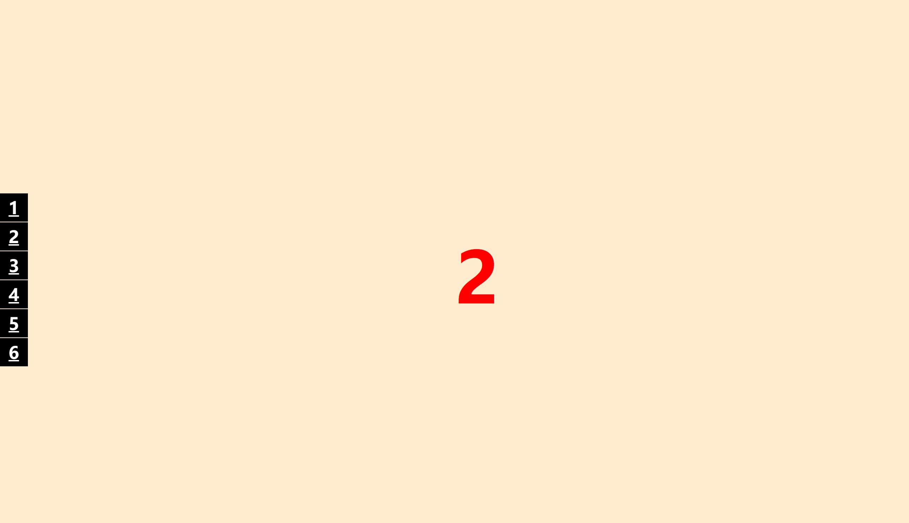

## **CSS**文档流

- CSS 有三种基本的定位机制：**普通流、浮动流、定位流**。


## POSTION

+ position定位属性，检索或设置对象的定位方式


## position属性值

| s**tatic**   | **默认值。位置设置为 static 的元素会正常显示，它始终会处于文档流给予的位置（static元素会忽略任何 top、bottom、left或 right 声明）** |
| ------------ | ------------------------------------------------------------ |
| **absolute** | **相对于父级元素、的绝对定位，浮出、脱离布局流，它不占据空间，就是我们所说的层，其位置相对于最近的已定位父元素而言的位置，可直接指定“left”、“top”、“right” 以及 “bottom”属性。若父级都没有定位，则以html（根元素）。(层叠的顺序z-index:value)** |
| **relative** | **是相对于默认位置的相对定位，通过设置left、top、right、bottom值可将其移至相对于其正常位置的地方（相对于自己的开始的位置发生的位置上的移动，【不会破坏正常的布局流，占据空间】）** |
| **fixed**    | **相对浏览器的绝对定位，是相对于浏览器窗口的指定坐标进行定位。此元素的位置可通过 "left"、"top"、"right" 以及"bottom" 属性来规定。不论窗口滚动与否，元素都会留在那个位置。** |
| **sticky**   | **可以看出是`position:relative`和`position:fixed`的结合体——当元素在屏幕内，表现为relative，就要滚出显示器屏幕的时候，表现为fixed。** |


3. position 定位？     规定元素的定位类型。

    普通流：上下排列
    
    浮动：解决左右排列的问题。（主要去做的）
    定位：解决叠加排列的问题。（主要去做的） 

  position取值
        static（默认）
        relative : 相对定位
            如果没有定位偏移量，对元素本身没有任何影响
            不使元素脱离文档流，空间是会被保留。
            不影响其他元素布局
            left、top、right、bottom是相对于当前元素自身进行偏移的
        absolute : 绝对定位
            使元素完全脱离文档流
            使内联元素支持宽高 （让内联具备块特性）
            使块元素默认宽根据内容决定（让块具备内联的特性）
            如果有定位祖先元素相对于定位祖先元素发生偏移，没有定位祖先元素相对于整个文档发生偏移（绝对、相对、固定）
            注：如果祖先元素中有多个元素具备定位模式，那么是已离自己最近的祖先元素进行偏移。

        fixed : 固定定位
            使元素完全脱离文档流
            使内联元素支持宽高 （让内联具备块特性）
            使块元素默认宽根据内容决定（让块具备内联的特性）
            相对于整个浏览器窗口进行偏移，不受浏览器滚动条的影响
                不会受到祖先元素的影响。
    
        sticky : 黏性定位
            在没有到达指定位置的时候，是没有定位效果的，到达了指定位置，就变成了固定模式。
    
        定位偏移量 : left top right bottom , 不能单独使用，必须得配合定位模式。
```txt
二、绝对定位和相对定位的区别

1、参照物不同，绝对定位的参照物是包含块（已定位的父元素），相对定位的参照物是元素本身默认的位置；

2、绝对定位将对象从文档流中拖离出来因此不占据空间，相对定位不破坏正常的文档流顺序无论是否进行移动，元素仍然占据原来的空间。
```


### 包含块

```txt
包含块是绝对定位的基础，包含块就是为定位元素提供坐标，偏移和显示范围的参照物，即确定绝对定位的偏移起点和百分比 长度的参考；

默认状态下，html是一个大的包含块，所有绝对定位的元素都是根据窗口来定自己所处的位置和百分比大小的显示的，如果我们定义了包含元素为包含元素块以后，对于被包含的绝对定位元素来说，就会根据最接近的具有定位功能的上级包含元素来定位自己的显示位置。

定义元素为包含块：给绝对定位元素的父元素添加声明position：relative；
```


### 定位元素层次关系

```txt
z-index : auto |number

检索或设置对象的层叠顺序。
auto：默认值。
number:无单位的整数值。可为负数
没有设置z-index时，最后写的对象优先显示在上层，设置后，数值越大，层越靠上；
```


### 定位案例


### 元素在浏览器窗口居中的方法

```txt
让一个元素始终在窗口水平、垂直位置居中：
1、div{width:200px;height:200px;background:#f00;position:fixed;left:0;right:0;top:0;bottom:0;margin:auto;}
2、
div{width:200px;height:200px;background:#f00;position:fixed;left:50%;top:50%;margin:-100px 0 0 -100px;}
```


## 锚点

```
命名锚点链接的应用：

命名锚点的作用：在同一页面内的不同位置进行跳转。
制作锚标记：
1)给元素定义命名锚记名
语法：<标记   id="命名锚记名">    </标记>

2)命名锚记连接
语法：<a href="#命名锚记名称"></a>
```

