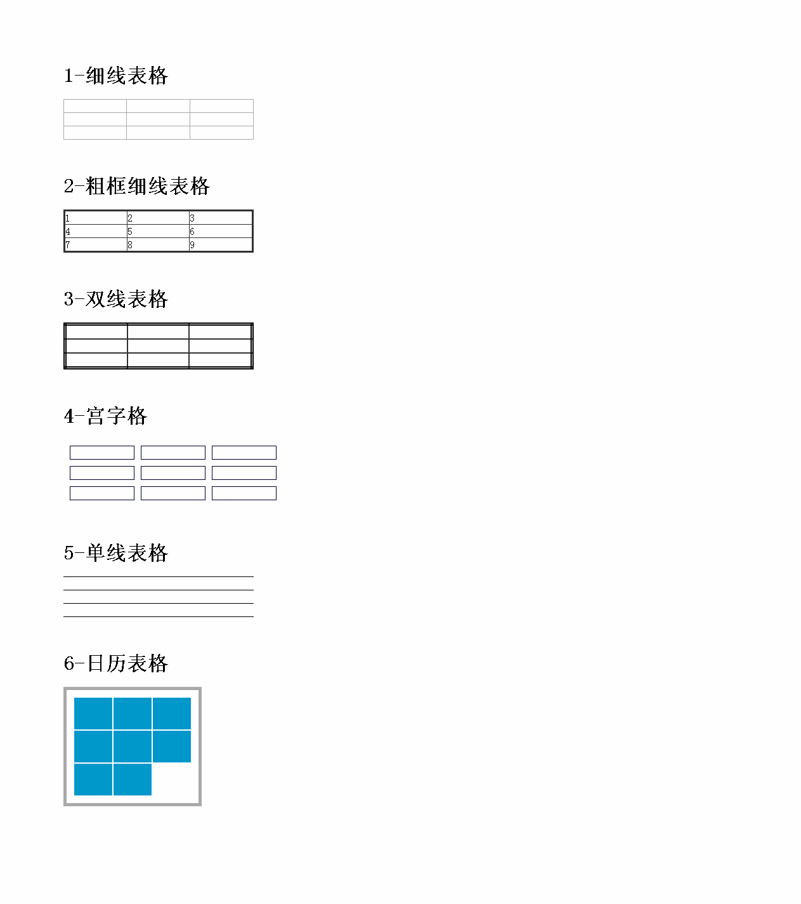
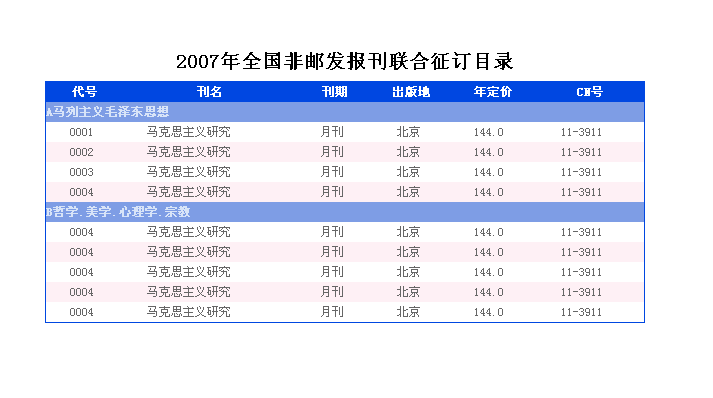
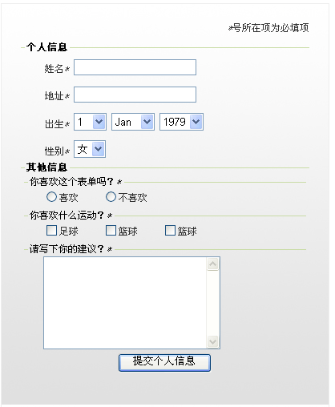

# 表格补充

#### 1 ： 数据行分组

```html
<thead></thead>
<tbody></tbody>
<tfoot></tfoot>
```

#### 2 ： 数据列分组

```html
<colgroup span="value"></colgroup>
<!--span属性为把几列分为一组-->
```

#### 3 ： 列标题

```html
<th></th>
```

#### 4 : 表格标题

```html
<caption></caption>
```

#### 表格属性

**1、单元格间距：border-spacing:value;**

​			说明：单元格间距(该属性必须给table添加) 表示单元格边框之间的距离， 不可取负值

**2、合并相邻单元格边框：border-collapse:separate/collapse;**

​			说明：合并相邻单元格边框 (该属性必须给table添加) separate(边框分开)默认值； collapse(边框合并)

**3、无内容时单元格的设置：empty-cells:show/hide;**

​		   说明：定义当单元格无内容时，是否显示该单元格的边框区域；show：显示 ；hide：隐藏；

**4、显示单元格行和列的算法(加快运行的速度)： table-layout:auto/fixed;**






# 表单补充

```
1）单选按钮组
    <input type=“radio” name=“ral” />男
    <input type=“radio” name=“ral”
    checked=“checked”/>(默认选中)女
2）复选框组
    <input type="checkbox" name="" />
    <input type="checkbox" name="" disabled="disabled" />
     *  disabled="disabled" (禁用)
     *  checked="checked"   (默认选中)
3）下拉列表（菜单）：
	<select >
   		<option>下拉选项1</option>
   		<option>下拉选项2</option>
   		…………
	</select>
	表示下拉列表，name属性不是必须的
	默认选择项用selected属性；
4）表单域多行文本定义：
	语法:	<textarea name=""  cols=""  rows="" ></textarea>
	多行文本。rows属性和cols属性用来设置文本输入窗口的高度和宽度，单位是字符。
	阻止浏览器对窗口的拖动设置:{resize:none;}（css属性）
5)上传文件：
	语法：<input type="file">
```

#### 表单标签

```txt
1）表单字段集
语法：<fieldset></fieldset>

说明：相当于一个方框，在字段集中可以包含文本和其他元素。该元素用于对表单中的元素进行分组并在文档中区别标出文本。fieldset元素可以嵌套，在其内部可以在设置多个fieldset对象。disabled定义空间禁制可用；

2）字段级标题：
语法：<legend align="left/center/right/justify"></legend>
说明：legend元素可以在fieldset对象绘制的方框内插入一个标题。legend元素必须是fieldset内的唯一个元素。
3)提示信息标签：
语法：<label for="绑定控件id名"></label>

说明：label元素用来定义标签，为页面上的其他元素指定提示信息。要将label元素绑定到其他的控件上，可以将label元素的for属性设置为与该控件的id属性值相同。
```



