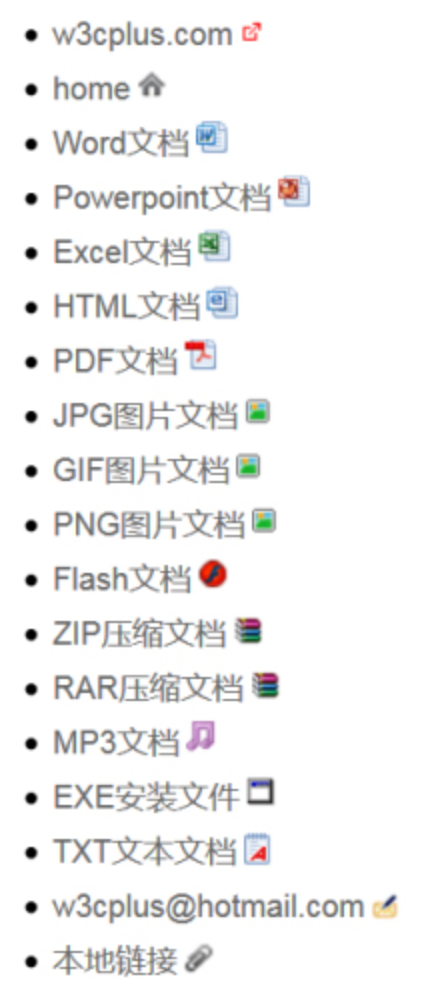
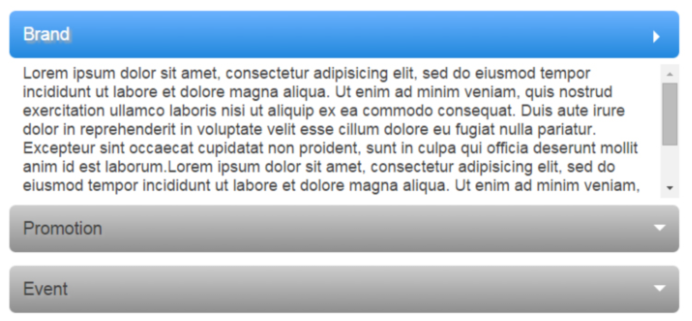

## CSS3

```txt
CSS3是css技术的升级版本，CSS3语言开发是朝着模块化发展的。以前的规范作为一个模块实在是太庞大而且比较复杂，所以，把它分解为一些小的模块，更多新的模块也被加入进来。这些模块包括： 盒子模型、列表模块、超链接方式 、语言模块 、背景和边框 、文字特效 、多栏布局等。

css3的优点：CSS3将完全向后兼容，所以没有必要修改现在的设计来让它们继续运作。网络浏览器也还将继续支持CSS2。对我们来说，CSS3主要的影响是将可以使用新的可用的选择器和属性，这些会允许实现新的设计效果（譬如动态和渐变），而且可以很简单的设计出现在的设计效果（比如说使用分栏）

```

#### 渐进增强

```txt
渐进增强 progressive enhancement：针对低版本浏览器进行构建页面，保证最基本的功能，然后再针对高级浏览器进行效果、交互等改进和追加功能达到更好的用户体验
```

#### 优雅降级

```txt
渐进增强 progressive enhancement：针对低版本浏览器进行构建页面，保证最基本的功能，然后再针对高级浏览器进行效果、交互等改进和追加功能达到更好的用户体验
```

##### 渐进增强 & 优雅降级

```txt
区别：优雅降级是从复杂的现状开始，并试图减少用户体验的供给，而渐进增强则是从一个非常基础的，能够起作用的版本开始，并不断扩充，以适应未来环境的需要。降级（功能衰减）意味着往回看；而渐进增强则意味着朝前看，同时保证其根基处于安全地带。
```


## CSS3选择符

+ 属性选择器
  	1、E[attr]：只使用属性名，但没有确定任何属性值
    	2、E[attr=“value”]：指定属性名，并指定了该属性的属性值
    	3、E[attr~=“value”]：指定属性名，并且具有属性值，此属性值是一个词列表，并且以空格隔开，其中词列表中包含了一个value词，而且等号前面的“〜”必须的
    	4、E[attr^=“value”]：指定了属性名，并且有属性值，属性值是以value开头的
    	5、E[attr$=“value”]：指定了属性名，并且有属性值，而且属性值是以value结束的
    	6、E[attr*=“value”]：指定了属性名，并且有属性值，而且属值中包含了value

  ​      7、E[attr|=“value”]：指定了属性名，并且属性值仅是value或者以“value-”开头的值（比如说left-con）

+ 
  
  
+ 伪类选择器

  + 结构性伪类选择器
    	**X:first-child** 匹配子集的第一个元素。IE7就可以支持
  + **X:last-child**匹配父元素中最后一个X元素 
  +  **X:nth-child(n)**用于匹配索引值为n的子元素。索引值从1开始
      	 **X:only-child**这个伪类一般用的比较少，比如上述代码匹配的是div下的有且仅有一个的p，也就是说，如果div内有多个p，将不匹配。
  + **X:nth-last-child(n)**从最后一个开始算索引。
  + 

    ​    **X:first-of-type**匹配同级兄弟元素中的第一个X元素
    ​    **X:last-of-type**匹配同级兄弟元素中的最后一个X元素
    ​    **X:nth-of-type(n)**匹配同类型中的第n个同级兄弟元素X
    ​    **X:only-of-type**匹配属于同类型中唯一兄弟元素的X
    ​    **X:nth-last-of-type(n)** 匹配同类型中的倒数第n个同级兄弟元素X

       **:root**匹配文档的根元素。在HTML（标准通用标记语言下的一个应用）中，根元素永远是HTML
       **x:empty**匹配没有任何子元素（包括包含文本）的元素X

    

  + 目标伪类

    + 目标伪类选择器
      	E:target		选择匹配E的所有元素，且匹配元素被相关URL指向
        	

  + UI 元素状态伪类选择器
    	E:**enabled**
      		匹配所有用户界面（form表单）中处于可用状态的E元素
      	E:**disabled**
      		匹配所有用户界面（form表单）中处于不可用状态的E元素
      	E:**checked**
      		匹配所有用户界面（form表单）中处于选中状态的元素E
      	E::**selection**
      		匹配E元素中被用户选中或处于高亮状态的部分

    

  + 动态伪类选择器
    	E**:link**
      		链接伪类选择器  
      		选择匹配的E元素，而且匹配元素被定义了超链接并未被访问过。常用于链接描点上
      	E**:visited**  
      		链接伪类选择器
      		选择匹配的E元素，而且匹配元素被定义了超链接并已被访问过。常用于链接描点上
      	E**:active**
      		用户行为选择器
      		选择匹配的E元素，且匹配元素被激活。常用于链接描点和按钮上
      	E:**hover**
      		用户行为选择器
      		选择匹配的E元素，且用户鼠标停留在元素E上。IE6及以下浏览器仅支持a:hover
      	E:**focus**
      		用户行为选择器
      		选择匹配的E元素，而且匹配元素获取焦点

  

+ 层级选择器
  	** E>F**
    		子选择器
    		选择匹配的F元素，且匹配的F元素所匹配的E元素的子元素
    	**E+F**
    		相邻兄弟选择器
    		选择匹配的F元素，且匹配的F元素紧位于匹配的E元素的后面
    	**E~F**
    		通用选择器
    		选择匹配的F元素，且位于匹配的E元素后的所有匹配的F元素


