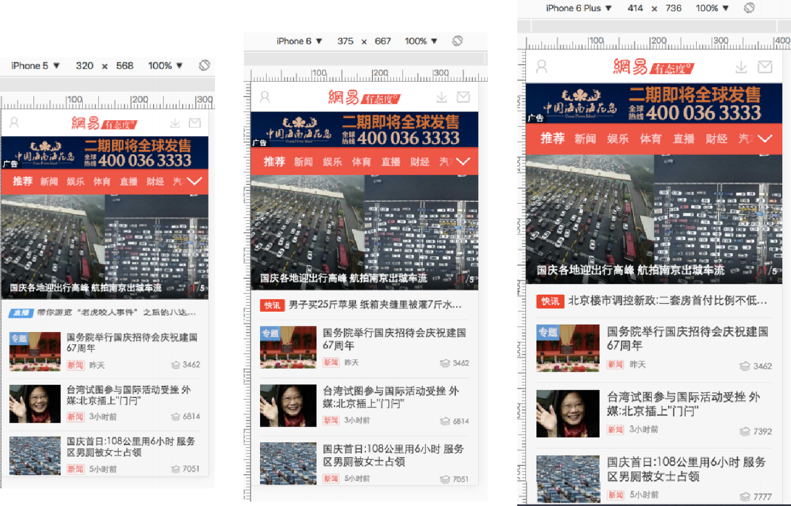
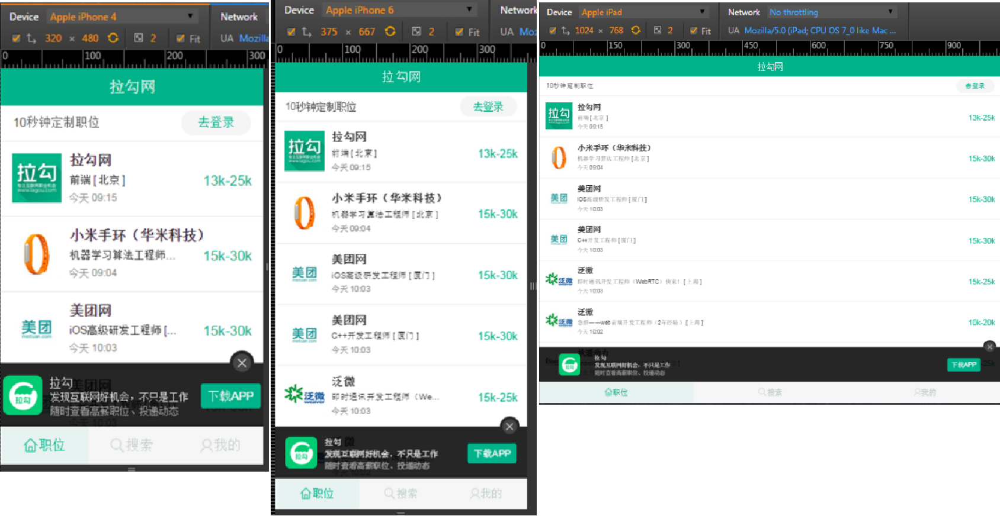
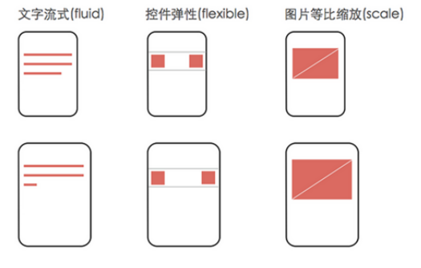
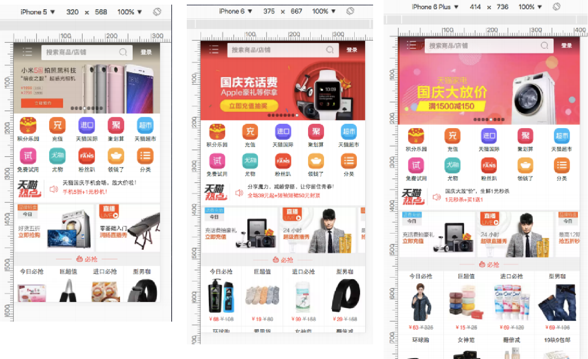

# 移动端项目布局类型

#### rem布局（等比缩放布局、百分比布局）




#### 弹性布局（100%布局、流式布局）



```txt
弹性布局特点：

顶部与底部的bar不管分辨率怎么变，它的⾼度和位置都不变；  中间每条招聘信息不管分辨率怎么变，招聘公司的图标等信息 都位于条目的左边，薪资都位于右边.

特点：关键元素高宽和位置都不变，只有容器元素在做伸缩变换。对于这类app，记住一个开发原则就好：文字流式，控件弹性，图片等比缩放
```




#### 混合布局案例 （ rem布局结合弹性布局 ）

