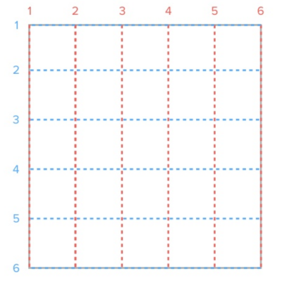

# GRID布局

```txt
它将网页划分成一个个网格，可以任意组合不同的网格，做出各种各样的布局

Grid 布局与 Flex 布局有一定的相似性，都可以指定容器内部多个项目的位置。但是，它们也存在重大区别。
Flex 布局是轴线布局，只能指定"项目"针对轴线的位置，可以看作是一维布局。
Grid 布局则是将容器划分成"行"和"列"，产生单元格，然后指定"项目所在"的单元格，可以看作是二维布局。
```


## grid布局预热

+ 容器和项目

  ```html
  <section>
      <div>
          <p></p>
      </div>
      <div>
          <p></p>
      </div>
      <div>
          <p></p>
      </div>
  </section>
  
  <!-- 以上代码section为容器、div为项目 （项目不包括p标签） -->
  ```

+ 行和列

  

  ```txt
  容器里面的水平区域称为"行"，垂直区域称为"列"。
  ```

+ 单元格

  

  ```txt
  行和列的交叉区域，称为"单元格"。
  ```

+ 网格线

  

  ```txt
  划分网格的线，称为"网格线"。水平网格线划分出行，垂直网格线划分出列。
  ```


## GRID属性

#### 容器属性:添加在容器元素

1. 启动网格布局

   ```css
   display:grid
   /*
   	属性值：
   		grid  为块状网格容器 （容器自上而下排列）
   		inline-grid  为内联网格容器（容器横向排列）
   */
   ```

2. 划分行和列

   ```css
   grid-template-columns:   列数及列宽
   grid-template-rows:      行数及行高
   ```

   + 属性值：绝对大小(根据列数或者行数确定值的个数) 例：200px  200px  200px 

     ```css
     grid-template-columns:200px 200px 200px
     grid-template-rows:200px 200px 200px
     ```

     

   + 属性值：百分比（根据列数或者行数确定值的个数） 例：33.33% 33.33%  33.33%

     ```css
     grid-template-columns:33.33% 33.33% 33.33%
     grid-template-rows:33.33% 33.33% 33.33%
     ```

     

   + 功能函数：repeat()

     ```css
     repeat(参数1，参数2)
     /* 
     	参数1 ： 重复的次数
     	参数2 ： 重复的数值或者重复的模式
     
     	eg:
     		grid-template-columns：repeat(3,33.33%);
     		等同
     		grid-template-columns:33.33% 33.33% 33.33%
     */
     ```

   + auto-fill关键字( 自动填充 )

     ```css
     display: grid;
     grid-template-columns: repeat(auto-fill, 100px);
     /*
     	当项目宽高固定，容器不固定的情况下，自动填充网格列数；
         表示每列宽度100px，然后自动填充，直到容器不能放置更多的列。
     */
     ```

     

   + fr关键字(列宽片段)

     ```txt
     为了方便表示比例关系，网格布局提供了fr关键字（fraction 的缩写，意为"片段"）。如果两列的宽度分别为1fr和2fr，就表示后者是前者的两倍。
     
     ```

     ```css
     grid-template-columns:1fr 3fr 1fr;
     grid-template-rows:repeat(3,100px);
     ```

     

     

   + minmax() 功能函数

     ```css
     grid-template-columns: 1fr 1fr minmax(100px, 1fr);
     /*
     	minmax(100px, 1fr)表示列宽不小于100px，不大于1fr
     */
     ```

   + auto 关键字  自动填充

     ```css
     grid-template-columns:30px auto 20px;
     grid-template-rows:repeat(3,100px);
     ```

     

   + 网格线名称

     ```css
     grid-template-columns: [c1] 100px [c2] 100px [c3] auto [c4];
     grid-template-rows: [r1] 100px [r2] 100px [r3] auto [r4];
     /*
     指定网格布局为3行x3列，因此有4根垂直网格线和4根水平网格线。方括号里面依次是这八根线的名字。
     */
     ```

3. 设置行间距 || 列间距

   ```css
   grid-row-gap:20px  /* 行间距 */
   grid-column-gap:20px /* 列间距 */
   grid-gap:30px 30px   /* 复合式写法 */
   
   /*注：新版本已经省略 grid- 前缀    row-gap \  column-gap  \  gap*/
   ```

   

4. 指定"区域"（area），一个区域由单个或多个单元格组成。

   ```css
   display: grid;
   grid-template-columns: 100px 100px 100px;
   grid-template-rows: 100px 100px 100px;
   grid-template-areas: 'a b c'
                        'd e f'
                        'g h i';
   
   /*
   	将整个网格容器分为9个区域，每个区域对应一个单元格
   	通过grid-area 指定项目名称。
   */
   ```

   ```css
   display:grid;
   grid-template-columns:repeat(3,100px);
   grid-template-rows:repeat(3,100px);
   grid-template-areas: 'a a a'
   					 '. . b'
   					 '. c c';
   ```

   

   

5. 规划子元素放置的顺序（默认为先排行后排列）

   ```css
   grid-auto-flow: column | row;
   /*
   	grid-auto-flow属性除了设置成row和column，还可以设成row dense和column dense。这两个值主要用于，某些项目指定位置以后，剩下的项目怎么自动放置。
   */
   ```
   
6. 设置单元格内容在单元格内 水平 | 垂直 的对齐方式

   ```css
   align-items: start | end | center | stretch;
   justify-items: start | end | center | stretch;
   place-items: <align-items>  <justify-items>    /*复合式写法*/
   /*
   	start：对齐单元格的起始边缘。
       end：对齐单元格的结束边缘。
       center：单元格内部居中。
       stretch：拉伸，占满单元格的整个宽度（默认值）。
   */
   ```

   

7. 设置整个内容区域在容器里面的  垂直| 水平 对齐方式

   ```css
   align-content: start | end | center | stretch | space-around | space-between | space-evenly;
   justify-content:start | end | center | stretch | space-around | space-between | space-evenly;
   place-content: <align-content> <justify-content>  /* 复合式写法 */
   					Y               X
   /*
   	start - 对齐容器的起始边框。
   	end - 对齐容器的结束边框。
   	center - 容器内部居中。
   	stretch - 项目大小没有指定时，拉伸占据整个网格容器。
   	space-around - 每个项目两侧的间隔相等。所以，项目之间的间隔比项目与容器边框的间隔大一倍。
   	space-between - 项目与项目的间隔相等，项目与容器边框之间没有间隔。
   	space-evenly - 项目与项目的间隔相等，项目与容器边框之间也是同样长度的间隔。
   */
   ```

   


#### 项目属性：添加在子元素上面

1. 指定项目的四个边框，分别定位在哪根网格线。

   ```css
   grid-column-start
   grid-column-end
   grid-row-start
   grid-row-end
   
   /*
   	grid-column-start属性：左边框所在的垂直网格线
   	grid-column-end属性：右边框所在的垂直网格线
   	grid-row-start属性：上边框所在的水平网格线
   	grid-row-end属性：下边框所在的水平网格线
   */
   ```

   ```css
   grid-column-start:1;
   grid-column-end:3;
   grid-row-start: 2;
   grid-row-end:4;
   ```

   

2. grid-column ， grid-row 

   ```txt
   grid-column属性是grid-column-start和grid-column-end的合并简写形式
   grid-row属性是grid-row-start属性和grid-row-end的合并简写形式。
   ```

   ```css
   grid-column: 1 / 3;
   grid-row: 1 / 2;
   ```

   

​      http://www.ruanyifeng.com/blog/2019/03/grid-layout-tutorial.html