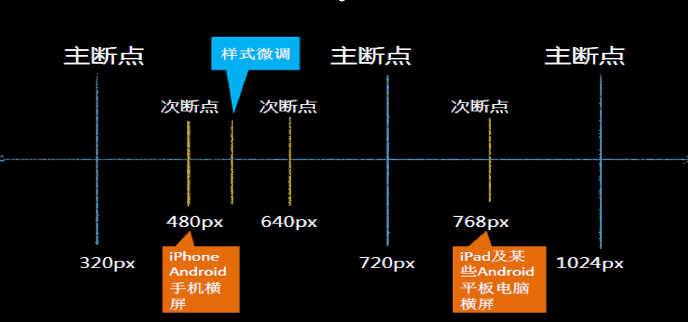

[TOC]


# 一、html

## 1、网站的建站流程


## 2、网页的结构


## 3、WEB标准

```txt
WEB标准是网页制作的标准，它不是一个标准，它是根据网页的不同组成部分生成的一系列标准。这些标准大部分由W3C起草发布，也有部分标准由ECMA起草发布
```


```txt
（1）W3C( World Wide Web Consortium )万维网联盟，创建于1994年是Web技术领域最具权威和影响力的国际中立性技术标准机构；是专门负责网络标准制定的非赢利组织。制定了结构标准和样式标准；
（2）ECMA：欧洲电脑网商联合会（厂商协会），制定了行为标准；
```

## 4、计算机语言


## 5、HTML

```txt
HTML 指的是超文本标记语言 (Hyper Text Markup Language) www万维网的描述性语言。

XHTML指可扩展超文本标记语言（标识语言）（EXtensible HyperText Markup Language）是一种置标语言，表现方式与超文本标记语言（HTML）类似，不过语法上更加严格。

HTML5指的是HTML的第五次重大修改（第5个版本）
```


### a、HTML发展


### b、编辑器


### c、建立站点

```txt	
规划网站的所有内容和代码
整合资源
```

#### 文件的命名规范

+ 小写英文字母、数字、下划线的组合，
+ 其中不得包含汉字、空格和特殊字符；
+ 必须以英文字母开头。


## 6、HTML开始

### 1：HTML架构

```txt
<!DOCTYPE html PUBLIC "-//W3C//DTD XHTML 1.0 Strict//EN"
"http://www.w3.org/TR/xhtml1/DTD/xhtml1-strict.dtd">

有三种：  Strict（严格型)、 
         Trasitional（过渡型）、 
         Frameset（框架型）
```

### 2：HTML5基本结构


### 3:HTML语言

+ HTML语言组成

  + 标签

    + ```txt
      写在尖角号<>里的第一个单词，叫做标记，也叫做标签，也称作元素；
      ```

  + 属性

    + ```
      标记和属性用空格隔开，属性和属性值用等号连接，属性值必须放在双引号内
      一个标记可以有多个属性，属性和属性之间用空格隔开，属性不分先后顺序
      ```

+ **HTML语法**

  + 常规标记(双标记)：
    <标记名称 属性1名="属性1值" 属性2名="属性2值" ………… ></标记名>
  + 空标记（单标记）：<标记名 属性1名="属性1值" />


## 7、常用标签

### 1 ： 文本标题标签

```txt
文本标题共有6个（h1-h6）
<h1>一级标题</h1>(唯一性,放网站LOGO)
<h2>二级标题</h2>
...
<h6>六级标题</h6> 
```


### 2:字体倾斜&加粗标记

```
文本倾斜:
	<i></i>
	<em></em>
	
文本加粗：
	<b></b>
	<strong></strong>
	
```

### 3：下划线

```txt
<u></u>
```

### 4 : 换行&水平线

```txt
<br>
<hr>
```

### 5：上标&下标

```txt
<sup></sup>
<sub></sub>
```

### 6 : 段落标记

```
<p></p>
```

### 7 : 字符 （ 小段文本 ）

```txt
<span></span>
```

### 8 : 常用转义字符

```txt
&nbsp;     不换行空格
&gt;       >右尖括号
&lt;       <左尖括号
&copy;     备案中图标版权 ©
&reg;       注册商标 ®
```

### 8 ：列表

​		（1） 无序列表

```txt	
	<ul>
          <li>列表项内容</li>
          <li>列表项内容</li>
          <li>列表项内容</li>
			   ........   
    </ul>
```

​		（2）有序列表

```txt
	<ol>
          <li>列表项内容</li>
          <li>列表项内容</li>
          <li>列表项内容</li>
			   ........   
    </ol>
```

```txt
type:规定列表中的列表项目的项目符号的类型
语法：<ol       type=“ a"></ol>
1 数字顺序的有序列表（默认值）（1, 2, 3, 4）。
a 字母顺序的有序列表，小写（a, b, c, d）。
A 字母顺序的有序列表，大写（A,B,C,D)
i 罗马数字，小写（i, ii, iii, iv）。
I 罗马数字，大写（i, ii, iii, iv）。

start 属性规定有序列表的开始点。(start的属性值必须是数字)
语法：<ol start="5"></ol>

```

​		（3）自定义列表

```txt	
	<dl>
		<dt></dt>
		<dd></dd>
	</dl>
```

### 9 : 超链接

```txt
<a></a>
	属性：
		href = 'url'
		target = "_black  /  _self";
		title = '文本提示'
		
	拓展1：
		rel = 'nofollow';  告诉搜索引擎“不要追踪此网页上的链接”或”不要追踪此特定链接”；
		
		例：<a href="signin.php" rel="nofollow">用户注册</a>
		
		以下是经常用到nofollow的几种情况：
	       1、不可信赖的内容
           2、付费链接
           3、按优先级别进行抓取
           
		
	拓展2：	
		 <base />   标签为页面上的所有链接规定默认地址或默认目标。
		 
		 例：<base target="_blank" />
		 
		 注：<base> 标签必须位于 head 元素内部。
```

### 10 : 图片

```

	属性：
		src = 'url';
		alt = ' 标签 实例 带有指定替代文本的图像'  
        title = '文本提示'
		width = ''
		height = ''
		border = ''
```

##### 图片 title 和 alt区别：

```txt
	alt:
        1、alt属性是考虑到不支持图像显示或者图像显示被关闭的浏览器的用户，以及视觉障碍的用户和使用屏幕阅读器的用户。当图片不显示的时候，图片的替换文字。
        2、alt属性值得长度必须少于100个英文字符
        3、alt属性是img标签的必须属性，如果没有特别意义的图片，可以写alt=""
        4、alt属性是搜索引擎判断图片与文字是否相关的重要依据，alt属性添加到img主要的目的是为了SEO
        
    title:
    	1、title属性并不是必须的。
        2、title属性规定元素的额外信息，有视觉效果，当鼠标放到文字或是图片上时有文字显示。
        3、title属性并不作为搜索引擎抓取图片的参考，更多倾向于用户体验的考虑。
```

### 11 : 相对路径

```txt
（同级）
	1)当当前文件与目标文件在同一目录下，直接书写目标文件的文件名+扩展名；
（上级找下级）
	2)当当前文件与目标文件所处的文件夹在同一目录下，写法如下：
	文件夹名/目标文件全称+扩展名；
（下级找上级）
	3)当当前文件所处的文件夹和目标文件在同一目录下，写法如下：
	../目标文件文件名+扩展名；
```

### 12 ： DIV

### 13 : HTML注释

```html
<!-- 注释 -->
```


### 14、表格

### 

#### 1 : 表格基本结构

```html
<table>
	<tr>
		<td></td>
		<td></td>
	</tr>
</table>

<!-- 
	table 为表格
	tr 行
	td 列（每一个单元格）
-->
```

#### 2：表格的html属性

```txt
1）width="表格的宽度"
2）height="表格的高度"
3）border="表格的边框"
4）bordercolor="边框色"
5）cellspacing="单元格与单元格之间的间距"
6）cellpadding=“单元格与内容之间的距离"
7）align="表格水平对齐方式"
   取值：left、right、center、
   valign=“垂直对齐” top\bottom\middle
8）合并单元格属性：(td)
  合并列： colspan=“所要合并的单元格的列数"
  合并行： rowspan=“所要合并单元格的行数”
```

### 15、表单

#### 1 ： 表单标签

```html
<form></form>
	属性 ： 
		action = '接口地址'
		method = 'get / post'
		name = '表单名称'
```

#### 2 ： 表单控件

```txt
<input>
	属性：
		type = '控件类型'
		name：属性标识表单域的名称；
		Value：属性定义表单域的默认值，其他属性根据type的不同而有所变化。
		maxlength：控制最多输入的字符数，
		Size：控制框的宽度（以字符为单位）
```

```txt
1）文本框
	<input type="text" value="默认值"/>
2)密码框
	<input type="password" />
3)提交按钮
	<input type="submit" value="按钮内容" />
4)重置按钮
	<input type="reset" value="按钮内容" />
5)空按钮
	<input type="button" value="按钮内容" />
```


## 16、拓展：post/get

- (1). 从功能上讲，GET一般用来从服务器上获取资源，POST一般用来更新服务器上的资源；
- (2). 从REST服务角度上说，GET是幂等的，即读取同一个资源，总是得到相同的数据，而POST不是幂等的，因为每次请求对资源的改变并不是相同的；进一步地，GET不会改变服务器上的资源，而POST会对服务器资源进行改变；
- (3). 从请求参数形式上看，GET请求的数据会附在URL之后，即将请求数据放置在HTTP报文的 请求头 中，以?分割URL和传输数据，参数之间以&相连。特别地，如果数据是英文字母/数字，原样发送；否则，会将其编码为 application/x-www-form-urlencoded MIME 字符串(如果是空格，转换为+，如果是中文/其他字符，则直接把字符串用BASE64加密，得出如：%E4%BD%A0%E5%A5%BD，其中％XX中的XX为该符号以16进制表示的ASCII)；而POST请求会把提交的数据则放置在是HTTP请求报文的 请求体 中。
- (4). 就安全性而言，POST的安全性要比GET的安全性高，因为GET请求提交的数据将明文出现在URL上，而且POST请求参数则被包装到请求体中，相对更安全。
- (5). 从请求的大小看，GET请求的长度受限于浏览器或服务器对URL长度的限制，允许发送的数据量比较小，而POST请求则是没有大小限制的。


# 二、CSS

## 1、css

```txt
CSS(cascading style sheet) 汉译为层叠样式表,是用于控制网页样式

WEB标准中的表现标准语言,在网页中主要对网页信息的显示进行控制。
目前推荐遵循的是W3C发布的CSS3.0版本；
用来表现HTML或者XHTML等样式文件的计算机语言。
1998年5月21日由w3C正式推出的css2.0
```

#### 2、HTML + CSS

```txt
弥补html语言的不足
缩减页面代码，提高访问速度;
代码减少，页面文件就会小，占用网络带宽就少，客户端打开速度就快，用户体验就会更好
结构清晰，有利于seo优化
有利于搜索引擎优化
缩短改版时间
对网站的重构有很好的支持
```

## 3、CSS语法

```txt
CSS语法由两部分组成：选择符、声明。
	声明包括：属性和属性值
选择符 {属性: 属性值 ;属性:属性值}


选择符说明：CSS选择符（选择器）
选择符表示要定义样式的对象(标签名字)，可以是元素本身，也可以是一类元素或者制定名称的元素,简单来说就是给对应的元素起个名称。
```

```txt
1）每个CSS样式由两部分组成，即选择符和声明，声明又分为属性和属性值；
2）属性必须放在花括号中，属性与属性值用冒号连接。
3）每条声明用分号结束。
4）当一个属性有多个属性值的时候，属性值与属性值不分先后顺序,用空格隔开。
5）在书写样式过程中，空格、换行等操作不影响属性显示。
```


## 4、CSS样式表

### 1:内部样式表

```txt
语法：
    <style type="text/css">
         css语句 
    </style>

注：使用style标记创建样式时，最好将该标记写在<head></head>;
```

### 2:外部样式

```txt
(1)  语法：<link rel="stylesheet" type="text/css" href="目标文件的路径及文件名全称" />

说明：使用link元素导入外部样式表时，需将该元素写在文档头部，即<head>与</head>之间。
      rel：用于定义文档关联，表示关联样式表；
      type：定义文档类型；
      
      
(2)、导入外部样式表
      <style type="text/css">
			@import  url("目标文件的路径及文件名全称");
	  </style>

说明：@和import之间没有空格 url和小括号之间也没有空格；括号内部加引号，必须结尾以分号结束；
```

##### link     @import区别

```txt
差别1：老祖宗的差别：link属于XHTML标签，而@import完全是CSS提供的一种方式。 link标签除了可以加载CSS外，还可以做很多其它的事情，比如定义RSS，定义rel连接属性等，@import就只能加载CSS。

差别2：加载顺序的差别：当一个页面被加载的时候（就是被浏览者浏览的时候），link引用的CSS会同时被加载，而@import引用的CSS 会等到页面全部被下载完再被加载。所以有时候浏览@import加载CSS的页面时开始会没有样式。

差别3：兼容性的差别。：@import是CSS2.1提出的，所以老的浏览器不支持，@import只在IE5以上的才能识别，而link标签无此问题。

差别4：使用dom控制样式时的差别：当使用javascript控制dom去改变样式的时候，只能使用link标签，因为@import不是dom可以控制的.
```

### 3:内联样式表

```txt
<标签    style="属性1:值1;属性2:值2; ……"></标签>
```


## 5、CSS样式表的权重关系

```txt
1）内联样式表的优先级别最高
2）内部样式表与外部样式表的优先级和书写的顺序有关，后书写的优先级别高。
3）同在一个样式表中的优先级和书写的顺序也有关，后书写的优先级别高。(被覆盖的只是相同属性的样式)
```


## 6、CSS选择符

```txt
CSS基本选择符：类型选择符、id选择符、class选择符(类选择符)

Css选择符分类：
    类型选择符（标记选择器）
    类选择符 （class选择符）
    ID选择符 （id选择器）
    伪类选择器
    通配符（*）设置全局属性
    群组选择符（集合选择器）
    包含选择符（后代选择器）
    属性选择符
    伪对象选择符
```

##### 类型选择符

```txt
类型选择符是根据html语言中的标记来直接定义
语法：标签名称 {属性：属性值；}

a)类型选择符就是以文档对象html中的标签作为选择符，即使用结构中元素名称作为选择符。例如body、div、p,img,em,strong,span......等。
b)所有的页面元素都可以作为选择符;
用法：
（1）如果想改变某个元素的默认样式时，可以使用类型选择符；（如：改变一个p段落样式）
（2）当统一文档某个元素的显示效果时，可以使用类型选择符；（如：改变文档所有p段落样式）
```


##### 类（class）选择符


```txt
语法 ：  .class名{属性：属性值;}

用法：class选择符更适合定义一类样式；
(1)当我们使用类选择符时，应先为每个元素定义一个类名称，
(2)类选择符的语法格式：
        如：<div class="top"></div>
               .top{属性:属性值;}
```


##### ID选择符

```txt
语法： <标签 id=“名”></标签>
      #id名{属性：属性值;}

（1）可以给每个元素使用id选择符，但id是元素的唯一标识符，不可出现重复的id名；
      如：<div id="top"></div>
（2）id选择符的语法格式是“#”加上自定义的id名
      如：#box{width:300px; height:300px;}
 (3) 起名时要取英文名，不能用关键字：(所有的标记和属性都是关键字)
      如：div标记
 (4)一个id名称只能在文档中出现一次，因为id是唯一的
 (5) 最大的用处：创建网页的外围结构。(唯一性、起名字不能使用关键字)
```


##### 伪类选择器

```txt
a:link {color: red;}                    /* 未访问的链接状态 */
a:visited {color: green;}				/* 已访问的链接状态 */
a:hover {color: blue;}                  /* 鼠标滑过链接状态 */
a:active {color: yellow;}               /* 鼠标按下去时的状态 */

说明：
1）当这4个超链接伪类选择符联合使用时，应注意他们的顺序，正常顺序为：
a，a:link,a:visited,a:hover,a:active,错误的顺序有时会使超链接的样式失效；
2）为了简化代码，可以把伪类选择符中相同 的声明提出来放在a选择符中；
例如：a{color:red;}     a:hover{color:green;} 
表示超链接的三种状态都相同，只有鼠标划过变化颜色
```


##### 通配符

```txt
语法：*{属性：属性值;}

说明：通配选择符的写法是“*”，其含义就是所有标签；    
		表示该样式适用所有网页元素；

用法：常用来重置样式。
例：*{margin:0;padding:0;}
```


##### 群组选择符

```txt
语法：选择符1，……，选择符5 {属性：属性值;}

说明：当有多个选择符应用相同的样式时，可以将选择符用“，”分隔的方式，合并为一组。
   
     实例：.top, #nav, p{width:100px;}
```


##### 包含选择器（后代选择器）

```txt
语法：选择符1(父)  选择符2（后代）{属性：属性值;} 
                   选择符父级  选择符子级{属性：属性值;}

说明：选择符1和选择符2用空格隔开，含义就是选择符1中包含的所有选择符2;
	实例： div   ul  li{height:200px;}
```

### 选择符权重

```txt
css中用四位数字表示权重，
权重的表达方式如：0，0，0，0；
    权重规则：HTML标签(类型选择符)的权重是1，class的权重是10，id的权重是100。
    类型选择符的权重为0001
    class选择符的权重为0010
    id选择符的权重为0100
    属性选择符的权重为0010
    伪类选择符的权重为0010
    伪元素（对象）选择符的权重为0001
    包含选择符的权重：为包含选择符的权重之和
    内联样式的权重为1000
    继承样式的权重为0000
    群组集合选择符权重为他本身
     注：如果权重相同时，则执行后写的样式；
```


## 7、css层叠性

```txt
css层叠指的是样式的优先级，当产生冲突时以优先级高的为准。

1. 开发者样式>读者样式>浏览器样式（除非使用!important标记 ）
2. id选择符>（伪）类选择符>元素选择符
3. 权重相同时取后面定义的样式

```


# 三、CSS属性

```txt
属性：属性是指定选择符所具有的属性，它是css的核心，css2共有150多个属性
属性值：属性值包括法定属性值及常见的数值加单位，如25px，或颜色值等。
```


## 1、文本属性

##### 1:文本大小 font-size

```txt
说明：
	1） 属性值为数值型时，必须给属性值加单位，属性值为0时除外。
	2）单位还可以是pt，9pt=12px;
	3）为了减小系统间的字体显示差异，IE Netscape Mozilla的浏览器制作商于1999年召开会议，共同确定16px/ppi为标准字体大小默认值,即1em.默认情况下，1em=16px,0.75em=12px; rem
	4）使用绝对大小关键字
         xx-small =9px
         x-small =11px
         small =13px
         medium =16px
         large =19px
         x-large =23px
         xx-large =27px
```

##### 2:文本颜色  color

```txt
说明：

用十六进制(是计算机中数据的一种表示方法)表示颜色值：
	0 1 2 3 4 5 6 7 8 9
	0 1 2 3 4 5 6 7 8 9 A B C D E F
颜色模式：光色模式
	R G B
	FF 00 00
颜色值的缩写：
	当表示三原色的三组数字同时相同时，可以缩写为三位;
	当用十六进制表示颜色值时，需要在颜色值前加“#”
	# fa 00 00
```

##### 3:文本类型 

 font-**family**:字体1，字体2，字体3......

```txt
说明：
	浏览器首先会寻找字体1、如存在就使用改字体来显示内容，如在字体1不存在的情况下，则会寻找字体2，如字体2也不存在，按字体3显示内容，如果字体3 也不存在；则按系统默认字体显示；
	当字体是中文字体时，需加双引号；
	当英文字体中有空格时，需加双引号如（“Times New Roman”）
	当英文字体只有一个单词组成是不加双引号；如：（Arial）；
	Windows中文版本操作系统下，中文默认字体为宋体或者新宋体，英文字体默认为Arial.
```

##### 4:**文字加粗**

**font-weight:bolder(更粗的)/bold（加粗）/normal（常规）/100—900;**

```txt
说明：
在css规范中，把字体的粗细分为9个等级，分别为100——900，其中100对应最轻的字体变形，而900对应最重的字体变形，
100-400 一般 500常规字体 600-900加粗字体
```

##### 5:**font-style：**

**italic/oblique/normal（取消倾斜，常规显示）;**

```txt
说明：
italic和oblique都是向右倾斜的文字, 但区别在于Italic是指斜体字，而Oblique是倾斜的文字，对于没有斜体的字体应该使用Oblique属性值来实现倾斜的文字效果.
```

##### 7:**文字行高**

line-height:normal/value;

```txt
说明：
当单行文本的行高等于容器高时，可实现单行文本在容器中垂直方向居中对齐；
当单行文本的行高小于容器高时，可实现单行文本在容器中垂直中齐以上；
当单行文本的行高大于容器高时，可实现单行文本在容器中垂直中齐以下（IE6及以下版本存在浏览器兼容问题）
*文字属性简写：font:12px/24px "宋体";
font属性的简写：字号，行高，字体
font-size:12px; line-height:24px; font-family:”宋体”；

font属性的简写：
说明:font的属性值应按以下次序书写(各个属性之间用空格隔开)
顺序: font-style font-weight font-size / line-height font-family
注意： 

(1)简写时 , font-size和line-height只能通过斜杠/组成一个值，不能分开写。
(2) 顺序不能改变 ,这种简写法只有在同时指定font-size和font-family属性时才起作用,而且,你没有设定font-weight , font-style , 他们会使用缺省值（默认值）。
```

##### 8：水平对齐方式

```txt
text-align:left/right/center/justify
```

##### 9:**文本修饰**

```txt
text-decoration:
说明：
	none:没有修饰
	underline:添加下划线
	overline:添加上划线
	line-through:添加删除线
```

##### 10:**首行缩进**

```txt
1）text-indent可以取负值；
2）text-indent属性只对第一行起作用。
```

##### 11:字间距、词间距

```txt
字间距{letter-spacing:value;}控制英文字母或汉字的字距。

词间距{word-spacing:value;}控制英文单词词距。
```


## 2、列表属性

##### 1、定义列表符号样式

list-style-type：disc(实心圆)/circle(空心圆)/square(实心方块)/none(去掉列表符号)；

list-style-type:none===list-style:none;

##### 2、使用图片作为列表符号

list-style-image：url(所使用图片的路径及全称)；

##### 3、定义列表符号的位置

list-style-position:outside(外边)/inside(里边)；

*list-style:none;去掉列表符号*


## 3、边框属性

```txt
border:边框宽度 边框风格 边框颜色;
	例如：border:5px solid #ff0000


边框：border,网页中很多修饰性线条都是由边框来实现的。
边框宽度：border-width:
边框颜色：border-color:
边框样式：border-style:solid(实线)/dashed(虚线)dotted(点划线)double(双线)/none可单独设置一方向边框，


可单独设置一方向边框，
    border-bottom:边框宽度 边框风格 边框颜色;底边框
    border-left:边框宽度 边框风格 边框颜色;左边框
    border-right:边框宽度 边框风格 边框颜色;右边框
    border-top:边框宽度 边框风格 边框颜色;上边框
```


## 4、背景属性

#### 1、背景颜色

 {background-color:颜色值;}**

#### 2、背景图片的设置

 background-image：url(背景图片的路径及全称)；**背景图片的显示原则

​	1）容器尺寸等于图片尺寸，背景图片正好显示在容器中
​	2）容器尺寸大于图片尺寸，背景图片将默认平铺，直至铺满元素；
​	3）容器尺寸小于图片尺寸，只显示元素范围以内的背景图。

网页上有两种图片形式：插入图片、背景图；
*插入图片：*属于网页内容，也就是结构。
*背景图：*属于网页的表现，背景图上可以显示文字、插入图片、表格等。

#### 3、背景图片平铺属性

{background-repeat:no-repeat/repeat/repeat-x/repeat-y }**

#### 4、背景图的位置性

{background-position:left/center/right/数值 top/center/bottom/数值;}**水平方向上的对齐方式（left/center/right）或值
垂直方向上的对齐方式(top/center/bottom)或值
background-position:值1 值2;
两个值 ：第一个值表示水平位置的值，第二个值：表示垂直的位置。
当两个值都是center的时候写一个值就可以代表的是水平位置和垂直位置
说明：向左方向，向上方向是负值
*背景属性的缩写语法：*
background:属性值1 属性值2 属性值3；
背景缩写：background:url（背景图片的路径及全称） no-repeat center top #f00；

*网页上常用的图片格式（压缩图片）*
1)jpg :有损压缩格式，靠损失图片本身的质量来减小图片的体积，适用于颜色丰富的图像;(像素点组成的，像素点越多会越清晰 )如果网页中
2）gif：有损压缩格式，靠损失图片的色彩数量来减小图片的体积，支持透明，支持动画，适用于颜色数量较少的图像;
3)png:有损压缩格式，损失图片的色彩数量来减小图片的体积，支持透明，不支持动画，是fireworks的 源文件格式，适用于颜色数量较少的图像;

#### 5、背景图的固定性

{{background-attachment:scroll(滚动)/fixed(固定);}**fixed 固定，不随内容一块滚动；
scroll:随内容一块滚动。

视觉差效果页面   https://divups.com/


## 3、浮动

float：left/right/none;

### 1、浮动属性 

文档流，在页面中独占一行，自上而下排列，也就是传说中的流

*无论多么复杂的布局，其基本出发点均是：“如何在一行显示多个div元素”。*

显然标准流已经无法满足需求，这就要用到浮动。

浮动可以理解为让某个div元素脱离标准流，漂浮在标准流之上，和标准流不是一个层次。


**页面浮动多个DIV的规律：**

假如某个div元素A是浮动的，如果A元素上一个元素也是浮动的，那么A元素会跟随在上一个元素的后边(如果一行放不下这两个元素，那么A元素会被挤到下一行)；如果A元素上一个元素是标准流中的元素，那么A的相对垂直位置不会改变，也

就是说A的顶部总是和上一个元素的底部对齐。

div的顺序是HTML代码中div的顺序决定的。

靠近页面边缘的一端是前，远离页面边缘的一端是后。

经过上边的学习，可以看出：元素浮动之前，也就是在标准流中，是竖向排列的，而浮动之后可以理解为横向排列

 

### 2、语法：float:none/left/right;

有三个取值：

left:元素左浮动 

right:元素右浮动 

none:默认值，不浮动。

 

 浮动的目的：就是让竖着的元素进行横向排列，也就是能让元素和元素并排显示

 

浮动的显示规则：浮动对象会像左或者右移动直到遇到边框（border）、填充值（padding）、外边界（margin）或者另一个块元素为止。

 

float:定义网页中其它文本如何环绕该元素显示


####  ***清除浮动语法：***

clear : none | left | right | both

none：默认值。允许两边都可以有浮动对象

left：不允许左边有浮动对象

right : 不允许右边有浮动对象

both : 不允许有浮动对象

 

*有一点是要记住的那就是*

对于CSS的清除浮动(clear)，一定要牢记：这个规则只能影响使用清除的元素本身，不能影响其他元素

*清除浮动可以理解为打破横向排列*。

###  3、文本换行属性：

 Word-wrap：break-word  说明：只在允许的断字点换行（浏览器保持默认处理），属性允许长单词或 URL 地址换行到下一行。当一个字符串太长而找不到它的自然断句点时产生溢出现象

Word-break：break-all   说明：它断句的方式非常粗暴，它不会尝试把长单词挪到下一行，而是直接进行单词内的断句；


## 4、css属性继承

```txt
不可继承的：display、margin、border、padding、background、height、min-height、max- height、、min-width、max-width、overflow、position、left、right、top、 bottom、z-index、float、clear、table-layout、vertical-align

所有元素可继承：visibility和cursor。
内联元素可继承：letter-spacing、word-spacing、line-height、color、font、 font-family、font-size、font-style、font-variant、font-weight、text- decoration、text-transform。
块状元素可继承：text-indent和text-align
列表元素可继承：list-style、list-style-type、list-style-position、list-style-image。
表格元素可继承：border-collapse。
```


# 四、盒模型

```txt
盒模型是css布局的基石，它规定了网页元素如何显示以及元素间相互关系。css定义所有的元素都可以拥有像盒子一样的外形和平面空间。即都包含内容区、补白（填充）、边框、边界(外边距)这就是盒模型。
```


## 1、PADDING

| padding用法: |                                                              |
| :----------: | :----------------------------------------------------------- |
|              | 1:padding是在盒子里面，在盒子与内容之间。                    |
|              | 2：padding的作用：控制子元素在父元素里面的位置关系。         |
|              | 3：padding会把盒子撑大。                                     |
|              | 4：如果想让盒子保持原有的大小：在宽高基础上减掉。（ 如果一个元素是被内容撑开的，没有设置固定的宽高，padding直接撑开。不用减掉 ） |
|              | 5:如果给单一方向添加padding                                  |
|              | padding-top/bottom/left/right                                |
|              | 6:padding的设置特点：                                        |
|              | padding:30px;    四周                                        |
|              | padding:10px 30px;     上下     左右                         |
|              | padding:10px 30px 50px    上   左右    下                    |
|              | padding:10px 30px 50px 100px     上右下左                    |
|              | 7:padding不会对背景图的位置造成影响。                        |

## 2、MARGIN

| margin用法    （外边距、边界） |                                                              |
| ------------------------------ | ------------------------------------------------------------ |
|                                | 1:margin在元素外围，不会撑大元素的大小                       |
|                                | 2:作用:控制元素与元素之间的间距。                            |
|                                | 3：给单一方向添加margin                                      |
|                                | margin-left/right/top/bottom                                 |
|                                | 4 :margin设置方法：                                          |
|                                | margin:30px;    四周                                         |
|                                | margin:10px 30px;     上下     左右                          |
|                                | margin:10px 30px 50px    上   左右    下                     |
|                                | margin:10px 30px 50px 100px     上右下左                     |
|                                |                                                              |
|                                | 5:margin:0 auto;                                             |
|                                | 让当前元素在父元素里面左右居中。                             |
|                                | 6:margin常出现的bug                                          |
|                                | a:两个相邻元素上下的margin值 不会叠加 按照较大值设置。       |
|                                | b:如果父元素和第一个子元素没有浮动的情况下，给第一个子元素添加margin-top,会错误放在父元素上面。 |


## 3、盒子大小计算


## 4、文本溢出

### a、overflow

```txt
visible:默认值，内容不会被修剪，会呈现在元素框之外；
hidden：内容会被修剪，并且其余内容是不可见的；
scroll：内容会被修剪，但是浏览器会显示滚动条，以便查看其余的内容;
auto：如果内容被修剪，则浏览器会显示滚动条，以便查看其他的内容;
inherit：规定应该从父元素继承overflow属性的值。
```


### b、white-space

```txt
normal：默认值，多余空白会被浏览器忽略只保留一个；
pre：空白会被浏览器保留；
pre-wrap：保留一部分空白符序列，但是正常的进行换行；
pre-line:合并空白符序列，但是保留换行符；
nowrap:文本不会换行，文本会在同一行上继续，直到遇到<br/>标签为止;
```


### c、text-overflow

```txt
clip：不显示省略号（...），而是简单的裁切;
ellipsis：当对象内文本溢出时，显示省略标记；
```


#### d、文本溢出变省略号设置

```txt
省略号设置：
text-overflow属性仅是：当文本溢出时是否显示省略标记，并不具备其它的样式属性定义，要实现溢出时产生省略号的效果还需定义：
1、容器宽度：width：value；（px、%，都可以）
2、强制文本在一行内显示:white-space：nowrap;
3、溢出内容为隐藏：overflow：hidden；
4、溢出文本显示省略号：
     text-overflow：ellipsis;
                        
注：必须是单行文本才能设置本文溢出！！！
```


###  5、文本换行属性：

 Word-wrap：break-word  说明：只在允许的断字点换行（浏览器保持默认处理），属性允许长单词或 URL 地址换行到下一行。当一个字符串太长而找不到它的自然断句点时产生溢出现象


Word-break：break-all   说明：它断句的方式非常粗暴，它不会尝试把长单词挪到下一行，而是直接进行单词内的断句；

 


# 五、元素类型

```txt
根据css显示分类，XHTML元素被分为

三种类型:
	块状元素，内联元素，可变元素

&&

三种类型：	
	块状元素，内联元素，内联块元素(css2.1增加)
```


## 1、块状元素的特点

```txt
A:块状元素在网页中就是以块的形式显示，所谓块状就是元素显示为矩形区域，
B:默认情况下，块状元素都会占据一行，通俗地说，两个相邻块状元素不会出现并列显示的现象；默认情况下，块状元素会按顺序自上而下排列。
C:块状元素都可以定义自己的宽度和高度。 
D:块状元素一般都作为其他元素的容器，它可以容纳其它内联元素和其它块状元素。我们可以把这种容器比喻为一个盒子。
```


## 2、内联元素的特点

```txt
A:内联元素的表现形式是始终以行内逐个进行显示；
B:内联元素没有自己的形状，不能定义它的宽和高,它显示的宽度、高度只能根据所包含内容的高度和宽度来确定，它的最小内容单元也会呈现矩形形状；
C:内联元素也会遵循盒模型基本规则，如可以定义padding,border,margin,background等属性，但个别属性不能正确显示;(padding-top:;margin-top/bottom:;)
```


## 3、可变元素

```txt
需要根据上下文关系确定该元素是块元素或者内联元素。
```


## 4、常见的标签

#### 块

```txt
div -最常用的块级元素
dl - 和dt-dd 搭配使用的块级元素
form - 交互表单
h1 -h6- 大标题
hr - 水平分隔线
ol – 有序列表
p - 段落
ul - 无序列表
li
fieldset - 表单字段集
colgroup-col - 表单列分组元素
table-tr  表格及行-单元格
...
```

####  内联

```txt
a –超链接（锚点）                               
b - 粗体(不推荐) 
br - 换行                             
i - 斜体
em - 强调                             
img - 图片                         
input - 输入框               
label - 表单标签                  
span - 常用内联容器，定义文本内区块
strong - 粗体强调
sub - 下标   
sup - 上标
textarea - 多行文本输入框
u - 下划线
select - 项目选择  
...
```


## 5、元素类型的转换

### a、display属性

```txt
盒子模型可通过display属性来改变默认的显示类型
```


### b、display的属性值

| none               | 此元素不会被显示。                                           |
| ------------------ | ------------------------------------------------------------ |
| **block**          | **此元素将显示为块级元素，此元素前后会带有换行符。**         |
| **inline**         | 此元素会被显示为内联元素，元素前后没有换行符。**             |
| **inline-block**   | **行内块元素。（CSS2.1 新增的值）**                          |
| **list-item**      | **此元素会作为列表显示。**                                   |
| run-in             | 此元素会根据上下文作为块级元素或内联元素显示。               |
| compact            | CSS 中有值 compact，不过由于缺乏广泛支持，已经从 CSS2.1 中删除。 |
| marker             | CSS 中有值 marker，不过由于缺乏广泛支持，已经从 CSS2.1 中删除。 |
| table              | 此元素会作为块级表格来显示（类似 <table>），表格前后带有换行符。 |
| inline-table       | 此元素会作为内联表格来显示（类似 <table>），表格前后没有换行符。 |
| table-row-group    | 此元素会作为一个或多个行的分组来显示（类似 <tbody>）。       |
| table-header-group | 此元素会作为一个或多个行的分组来显示（类似 <thead>）。       |
| table-footer-group | 此元素会作为一个或多个行的分组来显示（类似 <tfoot>）。       |
| table-row          | 此元素会作为一个表格行显示（类似 <tr>）。                    |
| table-column-group | 此元素会作为一个或多个列的分组来显示（类似 <colgroup>）。    |
| table-column       | 此元素会作为一个单元格列显示（类似 <col>）                   |
| table-cell         | 此元素会作为一个表格单元格显示（类似 <td> 和 <th>）          |
| table-caption      | 此元素会作为一个表格标题显示（类似 <caption>）               |
| inherit            | 规定应该从父元素继承 display 属性的值。                      |


```txt
A、大部分块元素display属性值默认为block，其中列表li的默认值为list-item。
B、大部分内联元素的display属性值默认为inline,其中img,input，默认为inline-block（行内块元素）。
```


### c、inline-block ( 行内块元素 )

**设置一个元素在一个容器中垂直居中，必须更改默认的display属性值为inline-block;并加上同级元素（标尺）（同级元素[标尺]样式设置为vertical-align:middle;width:0;height:100%;display:inline-block;）**
	三个条件：
		1：必须给容器（父元素）加上text-align:center;
		2:必须给当前元素转成行内块元素（display:inline-block;）再给当前元素加上vertical-align:middle;
		3：在当前元素的后面（没有回车）加上同级元素span;并对span进行vertical-align:middle;width:0;height:100%;display:inline-block 


### 元素类型案例


选项卡效果链接：http://demo.lanrenzhijia.com/demo/51/5158/demo/

## 6、置换元素(替换元素)

```txt
一、引题
在之前的浅谈HTML中的块级元素和内联元素中了解到了内联元素一般是不能设置宽高的，但是也有特殊。比如img是内联元素，但可以设置宽高，这肯定让不少人迷惑。这样我们就要引入HTML中置换元素的概念（非置换元素在w3c中没有给出明确的解释，姑且我们就把除置换元素外的元素当作非置换元素吧）。

二、置换元素与非置换元素
a) 置换元素：浏览器根据元素的标签和属性，来决定元素的具体显示内容。 
例如：浏览器会根据标签的src属性的值来读取图片信息并显示出来，而如果查看(x)html代码，则看不到图片的实际内容；<input>标签的type属性来决定是显示输入框，还是单选按钮等。 (x)html中的、<input>、<textarea>、<select>都是置换元素。这些元素往往没有实际的内容，即是一个空元素。

置换元素在其显示中生成了框，这也就是有的内联元素（img,input）能够设置宽高的原因。

b) 不可替换元素（非置换元素）：(x)html 的大多数元素是不可替换元素，即其内容直接表现给用户端（如浏览器）。
```


# 六、定位与锚点

## **1、CSS**文档流

- CSS 有三种基本的定位机制：**普通流、浮动流、定位流**。


## 2、POSTION

+ position定位属性，检索或设置对象的定位方式


## 3、position属性值

| s**tatic**   | **默认值。位置设置为 static 的元素会正常显示，它始终会处于文档流给予的位置（static元素会忽略任何 top、bottom、left或 right 声明）** |
| ------------ | ------------------------------------------------------------ |
| **absolute** | **相对于父级元素、的绝对定位，浮出、脱离布局流，它不占据空间，就是我们所说的层，其位置相对于最近的已定位父元素而言的位置，可直接指定“left”、“top”、“right” 以及 “bottom”属性。若父级都没有定位，则以html（根元素）。(层叠的顺序z-index:value)** |
| **relative** | **是相对于默认位置的相对定位，通过设置left、top、right、bottom值可将其移至相对于其正常位置的地方（相对于自己的开始的位置发生的位置上的移动，【不会破坏正常的布局流，占据空间】）** |
| **fixed**    | **相对浏览器的绝对定位，是相对于浏览器窗口的指定坐标进行定位。此元素的位置可通过 "left"、"top"、"right" 以及"bottom" 属性来规定。不论窗口滚动与否，元素都会留在那个位置。** |
| **sticky**   | **可以看出是`position:relative`和`position:fixed`的结合体——当元素在屏幕内，表现为relative，就要滚出显示器屏幕的时候，表现为fixed。** |


3. position 定位？     规定元素的定位类型。

   普通流：上下排列

   浮动：解决左右排列的问题。（主要去做的）
   定位：解决叠加排列的问题。（主要去做的） 

  position取值
        static（默认）
        relative : 相对定位
            如果没有定位偏移量，对元素本身没有任何影响
            不使元素脱离文档流，空间是会被保留。
            不影响其他元素布局
            left、top、right、bottom是相对于当前元素自身进行偏移的
        absolute : 绝对定位
            使元素完全脱离文档流
            使内联元素支持宽高 （让内联具备块特性）
            使块元素默认宽根据内容决定（让块具备内联的特性）
            如果有定位祖先元素相对于定位祖先元素发生偏移，没有定位祖先元素相对于整个文档发生偏移（绝对、相对、固定）
            注：如果祖先元素中有多个元素具备定位模式，那么是已离自己最近的祖先元素进行偏移。

        fixed : 固定定位
            使元素完全脱离文档流
            使内联元素支持宽高 （让内联具备块特性）
            使块元素默认宽根据内容决定（让块具备内联的特性）
            相对于整个浏览器窗口进行偏移，不受浏览器滚动条的影响
                不会受到祖先元素的影响。
    
        sticky : 黏性定位
            在没有到达指定位置的时候，是没有定位效果的，到达了指定位置，就变成了固定模式。
    
        定位偏移量 : left top right bottom , 不能单独使用，必须得配合定位模式。

```txt
二、绝对定位和相对定位的区别

1、参照物不同，绝对定位的参照物是包含块（已定位的父元素），相对定位的参照物是元素本身默认的位置；

2、绝对定位将对象从文档流中拖离出来因此不占据空间，相对定位不破坏正常的文档流顺序无论是否进行移动，元素仍然占据原来的空间。
```


### 包含块

```txt
包含块是绝对定位的基础，包含块就是为定位元素提供坐标，偏移和显示范围的参照物，即确定绝对定位的偏移起点和百分比 长度的参考；

默认状态下，html是一个大的包含块，所有绝对定位的元素都是根据窗口来定自己所处的位置和百分比大小的显示的，如果我们定义了包含元素为包含元素块以后，对于被包含的绝对定位元素来说，就会根据最接近的具有定位功能的上级包含元素来定位自己的显示位置。

定义元素为包含块：给绝对定位元素的父元素添加声明position：relative；
```


### 定位元素层次关系

```txt
z-index : auto |number

检索或设置对象的层叠顺序。
auto：默认值。
number:无单位的整数值。可为负数
没有设置z-index时，最后写的对象优先显示在上层，设置后，数值越大，层越靠上；
```


### 定位案例


### 元素在浏览器窗口居中的方法

```txt
让一个元素始终在窗口水平、垂直位置居中：
1、div{width:200px;height:200px;background:#f00;position:fixed;left:0;right:0;top:0;bottom:0;margin:auto;}
2、
div{width:200px;height:200px;background:#f00;position:fixed;left:50%;top:50%;margin:-100px 0 0 -100px;}
```


## 4、锚点

```
命名锚点链接的应用：

命名锚点的作用：在同一页面内的不同位置进行跳转。
制作锚标记：
1)给元素定义命名锚记名
语法：<标记   id="命名锚记名">    </标记>

2)命名锚记连接
语法：<a href="#命名锚记名称"></a>
```


# 七、宽高自适应

```txt
	网页布局中经常要定义元素的宽和高。但很多时候我们希望元素的大小能够根据窗口或子元素自动调整，这就是pc自适应。
自适应的优点：
	元素自适应在网页布局中非常重要，它能够使网页显示更灵活，可以适应在不同设备、不同窗口和不同分辨率下显示。

```

### 1、宽度自适应

```txt
 元素宽度设置为100%。（块元素宽度默认为100%）
 或者不设置宽度（width）;（宽度是父元素的宽度）
```

### 2、高度自适应

```txt
1)自适应元素高度：height:auto;或者不设置;（是子元素撑开父元素的高度）

2)元素高度自适应窗口高度
   	设置方法：html,body{height:100%;}
	注：如果设置子元素的高度跟随父元素的高度变化而变化，那么父元素必须有高度。
```


### 3、最小高度的自适应

```txt
min-height属性：最小高度；(IE6浏览器不识别该属性)

hack1:min-height:value;_height:value;

hack2:min-height:value;  height:auto!important;height:value; 
```


### 4、浮动元素父元素高度自适应（高度塌陷）

```txt
当子元素有浮动并且父元素没有高度的情况下父元素会出现高度塌陷
```

##### 高度塌陷的解决方法

```txt
hack1：给父元素添加声明overflow:hidden;(触发一个BFC)

hack2:在浮动元素下方添加空div,并给该元素添加
        声明：div{clear:both; height:0; overflow:hidden;}
        
hack3:万能清除浮动法
选择符:after{content:“";clear:both;display:block;height:0;overflow:hidden;visibility:hidden;}
```


##### visibility:hidden/隐藏

```txt
visibility:hidden;和display:none;的区别：
visibility:hidden;属性会使对象不可见，但该对象在网页所占的空间没有改变，等于留出了一块空白区域，而 display:none属性会使这个对象彻底消失不显示，也不再占用位置。
```


### 5、伪对象选择符

```txt
1）、::after :  与content属性一起使用，定义在对象后的内容。

语法：选择符:：after{content:”文字”;}
	 选择符:：after{content:url(图片路径)；}
	
如：div::after{content:url(logo.jpg);}
   div::after{content:"文本内容";} 
```

```txt
2）、::before:     与content属性一起使用,定义在对象前 的内容。

div::before{content:"在其前放内容";}
```

```txg
3）、::first-letter 定义对象内第一个字符的样式。
    说明：
     
    *(该伪元素只能用于块级元素)
```

```txt
4）、::first-line:定义对象内第一行的样式。
	*(该伪元素只能用于块级元素。)
```

### 全屏页面


# 八、表格补充

#### 1 ： 数据行分组

```html
<thead></thead>
<tbody></tbody>
<tfoot></tfoot>
```

#### 2 ： 数据列分组

```html
<colgroup span="value"></colgroup>
<!--span属性为把几列分为一组-->
```

#### 3 ： 列标题

```html
<th></th>
```

#### 4 : 表格标题

```html
<caption></caption>
```

#### 5、表格属性

**1、单元格间距：border-spacing:value;**

​			说明：单元格间距(该属性必须给table添加) 表示单元格边框之间的距离， 不可取负值

**2、合并相邻单元格边框：border-collapse:separate/collapse;**

​			说明：合并相邻单元格边框 (该属性必须给table添加) separate(边框分开)默认值； collapse(边框合并)

**3、无内容时单元格的设置：empty-cells:show/hide;**

​		   说明：定义当单元格无内容时，是否显示该单元格的边框区域；show：显示 ；hide：隐藏；

**4、显示单元格行和列的算法(加快运行的速度)： table-layout:auto/fixed;**


# 九、表单补充

```
1）单选按钮组
    <input type=“radio” name=“ral” />男
    <input type=“radio” name=“ral”
    checked=“checked”/>(默认选中)女
2）复选框组
    <input type="checkbox" name="" />
    <input type="checkbox" name="" disabled="disabled" />
     *  disabled="disabled" (禁用)
     *  checked="checked"   (默认选中)
3）下拉列表（菜单）：
	<select >
   		<option>下拉选项1</option>
   		<option>下拉选项2</option>
   		…………
	</select>
	表示下拉列表，name属性不是必须的
	默认选择项用selected属性；
4）表单域多行文本定义：
	语法:	<textarea name=""  cols=""  rows="" ></textarea>
	多行文本。rows属性和cols属性用来设置文本输入窗口的高度和宽度，单位是字符。
	阻止浏览器对窗口的拖动设置:{resize:none;}（css属性）
5)上传文件：
	语法：<input type="file">
```

#### 1、表单标签

```txt
1）表单字段集
语法：<fieldset></fieldset>

说明：相当于一个方框，在字段集中可以包含文本和其他元素。该元素用于对表单中的元素进行分组并在文档中区别标出文本。fieldset元素可以嵌套，在其内部可以在设置多个fieldset对象。disabled定义空间禁制可用；

2）字段级标题：
语法：<legend align="left/center/right/justify"></legend>
说明：legend元素可以在fieldset对象绘制的方框内插入一个标题。legend元素必须是fieldset内的唯一个元素。
3)提示信息标签：
语法：<label for="绑定控件id名"></label>

说明：label元素用来定义标签，为页面上的其他元素指定提示信息。要将label元素绑定到其他的控件上，可以将label元素的for属性设置为与该控件的id属性值相同。
```


# 十、BFC

```txt
BFC(Block formatting context)直译为“块级格式化上下文”。它是一个独立的渲染区域，只有Block-level box（块）参与， 它规定了内部的Block-level Box如何布局，并且与这个区域外部毫不相干。
```


## 1、BFC的布局规则

```txt
一、内部的Box会在垂直方向，一个接一个地放置。
二、Box垂直方向的距离由margin决定。属于同一个BFC的两个相邻Box的margin会发生重叠（按照最大margin值设置）
三、每个元素的margin box的左边， 与包含块border box的左边相接触
四、BFC的区域不会与float box重叠。
五、BFC就是页面上的一个隔离的独立容器，容器里面的子元素不会影响到外面的元素。
六、计算BFC的高度时，浮动元素也参与计算
```


## 2、哪些元素或属性能触发BFC

```
根元素(html)
float属性不为none
position为absolute或fixed
display为inline-block, table-cell, table-caption, flex, inline-flex
overflow不为visible
```


## 3、BFC的应用

```txt
1、自适应两栏布局
2、清除内部浮动
3、防止margin上下重叠
```


# 十一、重置样式

```css
@charset "utf-8";
html,body,ol,ul,li,h1,h2,h3,h4,h5,h6,p,th,td,dl,dd,form,fieldset,legend,input,textarea,select{margin:0;padding:0;}
body{
    font-size:16px;
    font-family: '微软雅黑';
}
ul,ol,li{
    list-style:none;
}
h1,h2,h3,h4,h5,h6{
    font-size:16px;
    font-weight: normal;
}
b,strong{
    font-weight: normal;
}
i,em{
    font-style: normal;
}
a,u{
    text-decoration: none;
}
img{
    border:0;
    display:block;
}
input,fieldset{
    outline: none;
    border:0;
}
.clear_fix:after{
    content:'.';
    clear:both;
    height:0;
    overflow:hidden;
    display:block;
    visibility: hidden;
}
.clear_fix{
    zoom:1;
}
```


# 十二、CSS3渐变

## 1、浏览器前缀

```txt
-ms-	   -ms-box-shadow	IE浏览器专属的CSS属性需添加-ms-前缀
-moz-	   -moz-box-shadow	所有基于Gecko引擎的浏览器（如Firefox）专属的CSS属性需添加-moz-前缀
-o-	       -o-box-shadow	Opera浏览器专属的CSS属性需添加-o-前缀
-webkit-   -webkit-box-shadow	所有基于Webkit引擎的浏览器（如Chrome、Safari）专属的CSS需添加-webkit-前缀
```

## 2、 渐变

```txt
CSS3 渐变（gradient）可以让你在两个或多个指定的颜色之间显示平稳的过渡。 以前，你必须使用图像来实现这些效果，现在通过使用 CSS3 的渐变（gradients）即可实现。此外，渐变效果的元素在放大时看起来效果更好，因为渐变（gradient）是由浏览器生成的。
```

#### a、线性渐变

```txt
语法：
background: linear-gradient(direction, color-stop1, color-stop2, ...);
background-image:
说明：
direction：默认为to bottom，即从上向下的渐变；
stop：颜色的分布位置，默认均匀分布，例如有3个颜色，各个颜色的stop均为33.33%。
```

+ 示例1：to left、top right、to bottom、to top


+ 示例2：to right bottom、top right top、top left bottom、top left top


+ 示例3：使用角度渐变linear-gradient(10deg, red, blue)

```txt
角度是指水平线和渐变线之间的角度，逆时针方向计算。换句话说，0deg 将创建一个从下到上的渐变，90deg 将创建一个从左到右的渐变。
但是，请注意很多浏览器(Chrome,Safari,fiefox等)的使用了旧的标准，即 0deg 将创建一个从左到右的渐变，90deg 将创建一个从下到上的渐变。换算公式 90 - x = y 其中 x 为标准角度，y为非标准角度。
```


#### b、径向渐变

```txt
 径向渐变不同于线性渐变，线性渐变是从“一个方向”向“另一个方向”的颜色渐变，而径向渐变是从“一个点”向四周的颜色渐变
```

```txt
语法一：
     background-image: -webkit-radial-gradient(position, shape, size, start-color, ..., last-color);
语法二：
     background-image: radial-gradient(shape size at position, start-color, ..., last-color);
说明：
position：渐变起点的位置，可以为百分比，默认是图形的正中心。
shape：渐变的形状，ellipse表示椭圆形，circle表示圆形。默认为ellipse，如果元素形状为正方形的元素，则ellipse和circle显示一样。
size：渐变的大小，即渐变到哪里停止，它有四个值。 closest-side：最近边； farthest-side：最远边； closest-corner：最近角； farthest-corner：最远角。
```

+ 示例1：多颜色节点均匀分布

```css
div { background: -webkit-radial-gradient(50% 50%, farthest-corner, red, green, blue); } 
div { background: -webkit-radial-gradient(center, farthest-corner, red, green, blue); }
```

+ 示例2：多颜色节点均匀分布

```css
div { background: radial-gradient(circle, red, yellow, green); } 
div { background: radial-gradient(ellipse, red, yellow, green); }
```

+ 示例3：设置渐变形状

```txt
circle：渐变为最大的圆形； ellipse：根据元素形状渐变，元素为正方形是显示效果与circle无异
```

​		

+ 示例4：不同尺寸的渐变

```css
div { background: radial-gradient(60% 40%, closest-side, blue, green, yellow, black); } 
div { background: radial-gradient(60% 40%, farthest-side, blue, green, yellow, black); }
div { background: radial-gradient(60% 40%, closest-corner, blue, green, yellow, black); }
div { background: radial-gradient(60% 40%, farthest-corner, blue, green, yellow, black);}
```


#### c、重复性渐变

1.重复性线性渐变

```css
div { background: repeating-linear-gradient(red, yellow 10%, green 20%); }
```


2.重复性径向渐变

```css
div { background: repeating-radial-gradient(red, yellow 10%, green 20%); }
```


# 十三、CSS3过渡

```txt
css3的transition允许css的属性值在一定的时间区间内平滑地过渡。这种效果可以在鼠标单击、获得焦点、被点击或对元素任何改变中触发，并圆滑地以动画效果改变CSS的属性值
```

1. transition-property：检索或设置对象中的参与过渡的属性

2. transition-duration：检索或设置对象过渡的持续时间

3. transition-delay：检索或设置对象延迟过渡的时间

4. transition-timing-function：检索或设置对象中过渡的动画类型

   ```txt
   检索或设置对象中过渡的动画类型
   http://cubic-bezier.com/
   ```

   


**简写**：transition:all/具体属性值    运动时间s/ms   延迟时间s/ms   动画类型


# 十四、CSS3-2d

## 1、变形属性：transform

```txt
transform翻译成汉语具有"变换"或者"改变"的意思。
通过此属性具有非常强大的功能，比如可以实现元素的位移、拉伸或者旋转等效果
最能体现transform 属性强大实力的是实现元素的3D变换效果。
```


## 2、2D

```txt
2D变换，是在一个平面对元素进行的操作。
可以对元素进行水平或者垂直位移、旋转或者拉伸.
```

+ 明确一下坐标系

  

```txt
对上面坐标系简单分析如下：
（1）.默认状态下，x轴是水平的，向右为正。
（2）.默认状态下，y轴是垂直的，向下为正，这与传统的数学坐标系不同。
```


## 3、2D功能函数

### 	2D位移 translate()

+ 将元素向指定的方向移动，类似于position中的relative。
+ 水平移动：向右移动translate(tx,0)和向左移动translate(-tx,0)；
+ 垂直移动：向上移动translate(0,-ty)和向下移动translate(0,ty);
+ 对角移动：右下角移动translate(tx,ty)、右上角移动translate(tx,-ty)、左上角移动translate(-tx,-ty)和左下角移动translate(-tx,ty)。


### 	2D缩放scale()

+ 让元素根据中心原点对对象进行缩放。默认的值1。因此0.01到0.99之间的任何值，使一个元素缩小；而任何大于或等于1.01的值，让元素显得更大。

+ 缩放scale()函数和translate()函数的语法非常相似，他可以接受一个值，也可以同时接受两个值，如果只有一个值时，其第二个值默认与第一个值相等。例如，scale(1,1)元素不会有任何变化，而scale(2,2)让元素沿X轴和Y轴放大两倍。

+ scaleX()：相当于scale(sx,1)。表示元素只在X轴（水平方向）缩放元素，其默认值是1。

+ scaleY()：相当于scale(1,sy)。表示元素只在Y轴（纵横方向）缩放元素，其默认值是１。


### 旋转rotate()

	旋转rotate()函数通过指定的角度参数对元素根据对象原点指定一个2D旋转。它主要在二维空间内进行操作，接受一个角度值，用来指定旋转的幅度。如果这个值为正值，元素相对原点中心顺时针旋转；如果这个值为负值，元素相对原点中心逆时针旋转。
	 rotateX() 方法，元素围绕其 X 轴以给定的度数进行旋转
	 rotateY() 方法，元素围绕其 Y 轴以给定的度数进行旋转


### 倾斜skew()

	倾斜skew()函数能够让元素倾斜显示。它可以将一个对象以其中心位置围绕着X轴和Y轴按照一定的角度倾斜。
	一个参数时：表示水平方向的倾斜角度；
	两个参数时：第一个参数表示水平方向的倾斜角度，第二个参数表示垂直方向的倾斜角度


## 4、变形原点transform-origin

```txt
transform-origin
	transform-origin是变形原点，也就是该元素围绕着那个点变形或旋转，该属性只有在设置了transform属性的时候起作用；
	因为我们元素默认基点就是其中心位置，换句话说我们没有使用transform-origin改变元素基点位置的情况下，transform进行的rotate,translate,scale,skew等操作都是以元素自己中心位置进行变化的。
```


backface-visibility   ：隐藏被旋转的 div 元素的背面

backface-visibility:visible;可见
backface-visibility:hidden;不可见


# 十五、3D

```txt
2d场景，在屏幕上水平和垂直的交叉线x轴和y轴
3d场景，在垂直于屏幕的方法，相对于3d多出个z轴
Z轴：靠近屏幕的方向是正向，远离屏幕的方向是反向
```


## 1、实现3D场景

**transform-style属性**

```txt
transform-style属性是3D空间一个重要属性，指定嵌套元素如何在3D空间中呈现。他主要有两个属性值：flat和preserve-3d

其中flat值为默认值，表示所有子元素在2D平面呈现。preserve-3d表示所有子元素在3D空间中呈现。
也就是说，如果对一个元素设置了transform-style的值为flat，则该元素的所有子元素都将被平展到该元素的2D平面中进行呈现。沿着X轴或Y轴方向旋转该元素将导致位于正或负Z轴位置的子元素显示在该元素的平面上，而不是它的前面或者后面。如果对一个元素设置了transform-style的值为preserve-3d，它表示不执行平展操作，他的所有子元素位于3D空间中。
```

​       景深：离屏幕多远的距离去观察元素，值越大幅度越小。   近大远小

​		perspective: 1200px;（在父元素中使用）

​		transform:perspective(1200px) （在子元素中使用）

​		两个都设置会发生冲突，建议只设置父元素，通常的数值在900-1200之间


​		如果当你的视线距离物体足够远的时候，基本上就不会有近大远小的感觉


​      perspective-origin :  原点设置，基点位置，观察3d元素的（位置）角度


​     transform-origin : x y z  ； 属性允许您改变被转换元素的位置，设置旋转元素的基点位置； z 不能设置%；

​	 transform-origin ：	50% 50% 0；（默认值）

​     transform-style : 3D空间
​	            flat  (默认值2d)、preserve-3d   (3d，产生一个三维空间)

https://developer.mozilla.org/zh-CN/docs/Web/CSS/perspective-origin

### 3D位移

```txt
CSS3中的3D位移主要包括translateZ()和translate3d()两个功能函数；
```

+ translate3d(tx,ty,tz) 
  +  ty：代表纵向坐标位移向量的长度；
  +  tx：代表横向坐标位移向量的长度；
  +  tz：代表Z轴位移向量的长度。此值不能是一个百分比值，如果取值为百分比值，将会认为无效值。
+ translateZ(t)
  + 指的是Z轴的向量位移长度。


### 3D旋转

```txt
CSS3中的3D旋转主要包括rotateX()、rotateY()、rotateZ()和rotate3d()四个功能函数；
```

+ rotateX(a)
  + rotateX()函数指定一个元素围绕X轴旋转，旋转的量被定义为指定的角度；如果值为正值，元素围绕X轴顺时针旋转；反之，如果值为负值，元素围绕X轴逆时针旋转。
+ rotateY(a)
  + rotateY()函数指定一个元素围绕Y轴旋转，旋转的量被定义为指定的角度；如果值为正值，元素围绕Y轴顺时针旋转；反之，如果值为负值，元素围绕Y轴逆时针旋转。
+ rotateZ(a)
  + rotateZ()函数和其他两个函数功能一样的，区别在于rotateZ()函数指定一个元素围绕Z轴旋转
+ rotate3d(x,y,z,a)(建议取值0或1)
  + x：是一个0到１之间的数值，主要用来描述元素围绕X轴旋转的矢量值；
  + y：是一个０到１之间的数值，主要用来描述元素围绕Y轴旋转的矢量值；
  + z：是一个０到１之间的数值，主要用来描述元素围绕Z轴旋转的矢量值；
  + a：是一个角度值，主要用来指定元素在3D空间旋转的角度，如果其值为正值，元素顺时针旋转，反之元素逆时针旋转。


### 3D缩放

```txt
 3D缩放：CSS3中的3D缩放主要包括scaleZ()和scale3d()两个功能函数；
```

```txt
简介： CSS3 3D变形中的缩放主要有scaleZ()和scale3d()两种函数，当scale3d()中X轴和Y轴同时为1，即scale3d(1,1,sz)，其效果等同于scaleZ(sz)。通过使用3D缩放函数，可以让元素在Z轴上按比例缩放。默认值为１，当值大于１时，元素放大，反之小于１大于0.01时，元素缩小
```

+ scale3d()
  + sx：横向缩放比例；
  + sy：纵向缩放比例；
  + sz：Z轴缩放比例；
+ scaleZ(s)
  + s：指定元素每个点在Z轴的比例。

+ 注：scaleZ()和scale3d()函数单独使用时没有任何效果，需要配合其他的变形函数一起使用才会有效果


css3动画

```txt
通过 CSS3，我们能够创建动画，这可以在许多网页中取代动画图片、Flash 动画以及 JavaScript。
```


## 2、关键帧的定义

```txt
不同于过渡动画只能定义首尾两个状态，关键帧动画可以定义多个状态，或者用关键帧的话来说，过渡动画只能定义第一帧和最后一帧这两个关键帧，而关键帧动画则可以定义任意多的关键帧，因而能实现更复杂的动画效果。
```

```css
@keyframes mymove{
 from{初始状态属性}
to{结束状态属性}
}
或
@keyframes mymove{
 0%{初始状态属性}
50%（中间再可以添加关键帧）
100%{结束状态属性}
}
```



## 3、animation  vs  transition

+ 相同点：都是随着时间改变元素的属性值。
+ 不同点：transition需要触发一个事件(hover事件或click事件等)才会随时间改变其css属性；
  而animation在不需要触发任何事件的情况下也可以显式的随着时间变化来改变元素css的属性值，从而达到一种动画的效果，css3的animation就需要明确的动画属性值


### animation

+ animation-name
  + 检索或设置对象所应用的动画名称
  + 必须与规则@keyframes配合使用，
    eg:@keyframes mymove{}  animation-name:mymove;
+ animation-duration 
  - 检索或设置对象动画的持续时间
  - 说明：animation-duration:3s;    动画完成使用的时间为3s
+ animation-timing-function 
  - 检索或设置对象动画的过渡类型
  - 属性值
    - linear：线性过渡。等同于贝塞尔曲线(0.0, 0.0, 1.0, 1.0)
    - ease：平滑过渡。等同于贝塞尔曲线(0.25, 0.1, 0.25, 1.0)
    - ease-in：由慢到快。等同于贝塞尔曲线(0.42, 0, 1.0, 1.0)
    - ease-out：由快到慢。等同于贝塞尔曲线(0, 0, 0.58, 1.0)
    - ease-in-out：由慢到快再到慢。等同于贝塞尔曲线(0.42, 0, 0.58, 1.0)
    - step-start:马上跳到动画每一结束桢的状态
    - 
    - 扩展：
      step-start:在变化过程中，是以下一帧的显示效果来填充间隔动画
      step-end与上面相反，都是以上一帧的显示效果来填充间隔动画
+ animation-delay
  + 检索或设置对象动画延迟的时间
  + 说明：animation-delay:0.5s;     动画开始前延迟的时间为0.5s)
+ animation-iteration-count 
  + 检索或设置对象动画的循环次数
  + 属性值
    + animation-iteration-count: infinite | number;
    + infinite：无限循环
    + number: 循环的次数
+ animation-direction 
  + 检索或设置对象动画在循环中是否反向运动
  + 属性值
    + normal：正常方向
    + reverse：反方向运行
    + alternate：动画先正常运行再反方向运行，并持续交替运行
    + alternate-reverse：动画先反运行再正方向运行，并持续交替运行
+ animation-fill-mode : 规定动画播放之前或之后，其动画效果是否可见。
      none (默认值) : 在运动结束之后回到初始位置，在延迟的情况下，让0%在延迟后生效
     		 backwards  :  在延迟的情况下，让0%在延迟前生效
         	 	  forwards  :  在运动结束的之后，停到结束位置
         	 	  both  :  backwards和forwards同时生效
+ animation-play-state 
  + 检索或设置对象动画的状态
  + 属性值
   + animation-play-state:running | paused;
   + running:运动
   + paused: 暂停
   + animation-play-state:paused;       当鼠标经过时动画停止，鼠标移开动画继续执行


#### 简写


  **扩展：**   css3动画库		

    一款强大的预设css3动画库。
          	官网地址：https://daneden.github.io/animate.css/
    基本使用：
    animated : 基类(基础的样式，每个动画效果都需要加)
    infinite : 动画的无限次数


​    


# 十六、HTML5基础

## 1、HTML5发展史

```txt
HTML5草案的前身名为 Web Applications 1.0，于2004年被WHATWG提出，于2007年被W3C接纳，并成立了新的 HTML 工作团队。
	HTML 5 的第一份正式草案已于2008年1月22日公布。HTML5 仍处于完善之中。然而，大部分现代浏览器已经具备了某些 HTML5 支持。

	2012年12月17日，万维网联盟（W3C）正式宣布凝结了大量网络工作者心血的HTML5规范已经正式定稿。根据W3C的发言稿称：“HTML5是开放的Web网络平台的奠基石。”

	2013年5月6日， HTML 5.1正式草案公布。该规范定义了第五次重大版本，第一次要修订万维网的核心语言：超文本标记语言（HTML）。在这个版本中，新功能不断推出，以帮助Web应用程序的作者，努力提高新元素互操作性。

	本次草案的发布，从2012年12月27日至今，进行了多达近百项的修改，包括HTML和XHTML的标签，相关的API、Canvas等，同时HTML5的图像img标签及svg也进行了改进，性能得到进一步提升
```

## 2、兼容

```txt
支持Html5的浏览器包括Firefox（火狐浏览器），IE9及其更高版本，Chrome（谷歌浏览器），Safari，Opera等；国内的 遨游浏览器（Maxthon），以及基于IE或Chromium（Chrome的工程版或称实验版）所推出的360浏览器、搜狗浏览器、QQ浏览器、猎豹 浏览器等国产浏览器同样具备支持HTML5的能力。
```


## 3、语法

+ 内容类型（ContentType）

  + HTML5的文件扩展符与内容类型保持不变，仍然为".html"或".htm"

+ DOCTYPE声明

  + <!DOCTYPE html>不区分大小写

+ 指定字符集编码

+ <meta charset="UTF-8">

+ 可省略标记的元素

  + 不允许写结束标记的元素：br、col、embed、hr、img、input、、link、meta	  

+ 可以省略结束标记的元素：

  + li、dt、dd、p、option、colgroup、thead、tbody、tfoot、tr、td、th

+ 可以省略全部标记的元素：html、head、body、colgroup、tbody

+ 属性值可以使用双引号，也可以使用单引号。


## 4、语义化标签

```txt
在HTML 5出来之前，我们用div来表示页面章节，但是这些div都没有实际意义。（即使我们用css样式的id和class形容这块内容的意义）。这些标签只是我们提供给浏览器的指令，只是定义一个网页的某些部分。但现在，那些之前没“意义”的标签因为因为html5的出现消失了，这就是我们平时说的“语义”。
```


+ section元素 表示页面中的一个区块
+ article元素 表示一块与上下文无关的独立的内容
+ aside元素 在article之外的，与article内容相关的辅助信息 
+ header元素 表示页面中一个内容区块或整个页面的标题
+ footer元素 表示页面中一个内容区块或整个页面的脚注
+ nav元素 表示页面中导航链接部分
+ figure元素 表示一段独立的内容，使用figcaption元素为其添加标题(第一个或最后一个子元素的位置)
+ main元素 表示页面中的主要的内容(ie不兼容)
+ hgroup标题的一个分组
+ mark定义高亮显示的文本(span)
+ time时间   （目前所有主流浏览器都不支持 <time> 标签。）
+ dialog标记定义一个对话框(会话框)类似微信（  目前只有 Chrome 和 Safari 6 支持 <dialog> 标签。）
+ embed 标记定义外部的可交互的内容或插件 比如flash ；
  	


## 5、多媒体标签

```html
<video src=""></video> 
<audio src=""></audio>
```

+ 属性
  + controls属性：如果出现该属性，则向用户显示控件，比如播放按钮。
  + autoplay属性：如果出现该属性，则视频在就绪后马上播放。autoplay + muted    可以实现自动播放
  + loop属性：重复播放属性。
  + muted属性：静音属性。
  + poster属性：规定视频正在下载时显示的图像，直到用户点击播放按钮。

+ source
  <source> 标签为媒介元素（比如 <video> 和 <audio>）定义媒介资源。
     			<source> 标签允许您规定可替换的视频/音频文件供浏览器根据它对媒体类型或者编解码器的支持进行选择。
     			Type属性值：
     				用于视频：video/ogg   video/mp4     video/webm
     				用于音频：audio/ogg   audio/mpeg    audio/mav   

​                           注： object-fit: cover; 可以让视频覆盖整个父容器。

​								

## 6、HTML5表单

+ 新增type类型
  Type=“email”   限制用户必须输入email类型
   	Type=“url”        限制用户必须输入url类型
   	Type=“range”   产生一个滑动条表单
   	Type=“number”
   	Type=“search”   产生一个搜索意义的表单
   	Type=“color”     生成一个颜色选择的表单
   	Type=“time”      限制用户必须输入时间类型
   	Type=“month”        限制用户必须输入月类型
   	Type=“week”        限制用户必须输入周类型
   	Type=“datetime-local”        选取本地时间
   	type=”date”

+ 新增表单属性
  required     监测是否为空。
  	min      最小
  	max      最大
  	step     步幅  确定一个法定值。 -3 0 3 6 9
  	list     必须结合datalist标签，绑定datalist  id名称。
  	autocomplete    是否自动提示信息    属性值   on    off
  	placeholder    文本框的提示信息
  	autofocus      自动聚焦。一个页面只能由一个。
  	pattern    后面的属性值是一个正则表达式。
  	novalidate     取消验证
      multiple     选择（上传）多个

+ 新增表单标签

  + output

  ```html
  <form action="" oninput="x.value=parseInt(a.value)+parseInt(b.value)">
  	<input id="a" type="range" min="0" max="100">100+
  	<input id="b" type="text" value="50">=
  	<output name="x" for="a b"></output>
  </form>
  ```

  + datalist   必须和list属性结合使用。做提示信息。

  ```html
  <input type="url"     list="url_list"    name="link" />
  <datalist    id="url_list"> 
      <option label="W3School" value="http://www.W3School.com.cn" /> 
      <option label="Google" value="http://www.google.com" /> 
      <option label="Microsoft" value="http://www.microsoft.com" /> 
  </datalist>
  ```

  


# 十七、CSS3选择器

```txt
CSS3是css技术的升级版本，CSS3语言开发是朝着模块化发展的。以前的规范作为一个模块实在是太庞大而且比较复杂，所以，把它分解为一些小的模块，更多新的模块也被加入进来。这些模块包括： 盒子模型、列表模块、超链接方式 、语言模块 、背景和边框 、文字特效 、多栏布局等。

css3的优点：CSS3将完全向后兼容，所以没有必要修改现在的设计来让它们继续运作。网络浏览器也还将继续支持CSS2。对我们来说，CSS3主要的影响是将可以使用新的可用的选择器和属性，这些会允许实现新的设计效果（譬如动态和渐变），而且可以很简单的设计出现在的设计效果（比如说使用分栏）

```

#### 渐进增强

```txt
渐进增强 progressive enhancement：针对低版本浏览器进行构建页面，保证最基本的功能，然后再针对高级浏览器进行效果、交互等改进和追加功能达到更好的用户体验
```

#### 优雅降级

```txt
渐进增强 progressive enhancement：针对低版本浏览器进行构建页面，保证最基本的功能，然后再针对高级浏览器进行效果、交互等改进和追加功能达到更好的用户体验
```

##### 渐进增强 & 优雅降级

```txt
区别：优雅降级是从复杂的现状开始，并试图减少用户体验的供给，而渐进增强则是从一个非常基础的，能够起作用的版本开始，并不断扩充，以适应未来环境的需要。降级（功能衰减）意味着往回看；而渐进增强则意味着朝前看，同时保证其根基处于安全地带。
```


# 十八、CSS3选择符

#### 属性选择器

1、E[attr]：只使用属性名，但没有确定任何属性值
 	2、E[attr=“value”]：指定属性名，并指定了该属性的属性值
 	3、E[attr~=“value”]：指定属性名，并且具有属性值，此属性值是一个词列表，并且以空格隔开，其中词列表中包含了一个value词，而且等号前面的“〜”必须的
 	4、E[attr^=“value”]：指定了属性名，并且有属性值，属性值是以value开头的
 	5、E[attr$=“value”]：指定了属性名，并且有属性值，而且属性值是以value结束的
 	6、E[attr*=“value”]：指定了属性名，并且有属性值，而且属值中包含了value

​      7、E[attr|=“value”]：指定了属性名，并且属性值仅是value或者以“value-”开头的值（比如说left-con）

#### 伪类选择器

+ 结构性伪类选择器
  **X:first-child** 匹配子集的第一个元素。IE7就可以支持

+ **X:last-child**匹配父元素中最后一个X元素 

+ **X:nth-child(n)**用于匹配索引值为n的子元素。索引值从1开始
  **X:only-child**这个伪类一般用的比较少，比如上述代码匹配的是div下的有且仅有一个的p，也就是说，如果div内有多个p，将不匹配。

+ **X:nth-last-child(n)**从最后一个开始算索引。

+ 

  ​    **X:first-of-type**匹配同级兄弟元素中的第一个X元素
  ​    **X:last-of-type**匹配同级兄弟元素中的最后一个X元素
  ​    **X:nth-of-type(n)**匹配同类型中的第n个同级兄弟元素X
  ​    **X:only-of-type**匹配属于同类型中唯一兄弟元素的X
  ​    **X:nth-last-of-type(n)** 匹配同类型中的倒数第n个同级兄弟元素X

     **:root**匹配文档的根元素。在HTML（标准通用标记语言下的一个应用）中，根元素永远是HTML
     **x:empty**匹配没有任何子元素（包括包含文本）的元素X

  

+ 目标伪类

  + 目标伪类选择器
    E:target		选择匹配E的所有元素，且匹配元素被相关URL指向
     	

+ UI 元素状态伪类选择器
  E:**enabled**
   		匹配所有用户界面（form表单）中处于可用状态的E元素
   	E:**disabled**
   		匹配所有用户界面（form表单）中处于不可用状态的E元素
   	E:**checked**
   		匹配所有用户界面（form表单）中处于选中状态的元素E
   	E::**selection**
   		匹配E元素中被用户选中或处于高亮状态的部分

  

+ 动态伪类选择器
  E**:link**
   		链接伪类选择器  
   		选择匹配的E元素，而且匹配元素被定义了超链接并未被访问过。常用于链接描点上
   	E**:visited**  
   		链接伪类选择器
   		选择匹配的E元素，而且匹配元素被定义了超链接并已被访问过。常用于链接描点上
   	E**:active**
   		用户行为选择器
   		选择匹配的E元素，且匹配元素被激活。常用于链接描点和按钮上
   	E:**hover**
   		用户行为选择器
   		选择匹配的E元素，且用户鼠标停留在元素E上。IE6及以下浏览器仅支持a:hover
   	E:**focus**
   		用户行为选择器
   		选择匹配的E元素，而且匹配元素获取焦点


#### 层级选择器

** E>F**
 		子选择器
 		选择匹配的F元素，且匹配的F元素所匹配的E元素的子元素
 	**E+F**
 		相邻兄弟选择器
 		选择匹配的F元素，且匹配的F元素紧位于匹配的E元素的后面
 	**E~F**
 		通用选择器
 		选择匹配的F元素，且位于匹配的E元素后的所有匹配的F元素


# 十九、CSS3属性

#### 文本阴影属性

+ text-shadow:x    y     2px     red, 
+ 说明：水平、垂直阴影的位置允许负值
      可进行多阴影设置(逗号分隔的方式)


#### 文本换行

+ Word-wrap

  ```txt
  属性用来标明是否允许浏览器在单词内进行断句，这是为了防止当一个字符串太长而找不到它的自然断句点时产生溢出现象。
  属性值：
  	normal
  	说明：只在允许的断字点换行（浏览器保持默认处理）
  	break-word
  	说明：属性允许长单词或 URL 地址换行到下一行
  ```

+ Word-break

  ```txt
  属性值：
  	break-all
  	说明：它断句的方式非常粗暴，它不会尝试把长单词挪到下一行，而是直接进行单词内的断句
  	Keep-all
  	说明：文本不会换行，只能在半角空格或连字符处换行
  ```


#### @font-face

```txt
@font-face是CSS3中的一个模块，他主要是把自己定义的Web字体嵌入到你的网页中，随着@font-face模块的出现，我们在Web的开发中使用字体不怕只能使用Web安全字体（@font-face这个功能早在IE4就支持）
@font-face的语法规则:

```

```css
@font-face { 
	font-family: <YourWebFontName>;
	 src: <source> [<format>][, []]*; 
	[font-weight: <weight>]; 
	[font-style: <style>]; 
}
```

	iconfont字体图标库的使用

#### 背景属性

	Background-origin 背景原点
		说明：指定background-origin属性应该是相对位置
		属性值
			padding-box	背景图像填充框的相对位置
			border-box	背景图像边界框的相对位置
			content-box	背景图像的相对位置的内容框     默认值
			
	Background-clip 背景裁切
		说明：background-clip 属性规定背景的绘制区域。
		属性值
			border-box	背景被裁剪到边框盒。
			padding-box	背景被裁剪到内边距框。
			content-box	背景被裁剪到内容框。     默认值
			
	Background-size 背景尺寸
		说明：background-size 规定背景图像的尺寸
		属性值
			length	(10px)
				规定背景图的大小。第一个值宽度，第二个值高度。
			Percentage(%)
				以百分比为值设置背景图大小
			cover
				把背景图像扩展至足够大，以使背景图像完全覆盖背景区域
			contain
				把图像图像扩展至最大尺寸，以使其宽度或高度完全适应内容区域。
	
	扩展：
	文字渐变：background: linear-gradient(to right, red, blue);
		    -webkit-background-clip: text;
		     color: transparent;


​		     
​	css3多背景图的设置
​		eg：background:url(),url()


​		
​	模糊：blur
​		filter : blur(value)

#### 颜色模式

```txt
	1、rgba 颜色模式
	2、 Hsl 颜色模式（了解） 
	3、 Hsla 颜色模式（了解）
	就是色调(Hue)、饱和度(Saturation)、亮度(Lightness)三个颜色通道的改变以及它们相互之间的叠加来获得各种颜色，色调(Hue)色调最大值360，饱和度和亮度有百分比表示0-100%之间。
```


#### 图片边框

```txt
图片边框
	border-image 属性是一个简写属性，用于设置以下属性:
		border-image-source	用在边框的图片的路径。
		border-image-slice	图片边框向内偏移(不加单位)。
		border-image-repeat	图像边框是否应平铺(repeat)、铺满(round)或拉伸(stretch)
		border-image-outset	边框图像区域超出边框的量(值是一个倍数)
```


#### CSS圆角

Border-radius

+ border-radius: 5px 10px 20px 50px 

  

+ border-radius: 2em/1em	

  

+ border-radius:10px 20px 30px 40px/40px 30px 20px 10px

  

#### 盒子阴影

box-shadow 盒子阴影

```txt
	h-shadow	必需的。水平阴影的位置。允许负值
	v-shadow	必需的。垂直阴影的位置。允许负值
	blur	可选。模糊距离
	spread	可选。阴影的大小
	color	可选。阴影的颜色。
	inset	可选。从外层的阴影（开始时）改变阴影内侧阴影
	box-shadow: 10px 10px 5px 10px #888888 inset;
```

+ box-shadow: 10px 10px 5px 10px #888888 inset;


#### width的属性值

```txt
width的属性值
	fill-available、fit-content、max-content、min-content
```


#### css3 calc()方法详解 （四则运算）

```txt
什么是calc()?
	学习calc()之前，我们有必要先知道calc()是什么？只有知道了他是个什么东东？在实际运用中更好的使用他。
	calc()从字面我们可以把他理解为一个函数function。其实calc是英文单词calculate(计算)的缩写，是css3的一个新增的功能，用来指定元素的长度。比如说，你可以使用calc()给元素的border、margin、pading、font-size和width等属性设置动态值。为何说是动态值呢?因为我们使用的表达式来得到的值。不过calc()最大的好处就是用在流体布局上，可以通过calc()计算得到元素的宽度。


calc()能做什么？
	calc()能让你给元素的做计算，你可以给一个div元素，使用百分比、em、px和rem单位值计算出其宽度或者高度，比如说“width:calc(50% + 2em)”，这样一来你就不用考虑元素DIV的宽度值到底是多少，而把这个烦人的任务交由浏览器去计算。

calc()语法
	calc()语法非常简单，就像我们小时候学加 （+）、减（-）、乘（*）、除（/）一样，使用数学表达式来表示：

	.elm {
  		width: calc(expression);
	}
	其中"expression"是一个表达式，用来计算长度的表达式。

calc()的运算规则
	calc()使用通用的数学运算规则，但是也提供更智能的功能：

	使用“+”、“-”、“*” 和 “/”四则运算；
	可以使用百分比、px、em、rem等单位；
	可以混合使用各种单位进行计算；
	表达式中有“+”和“-”时，其前后必须要有空格，如"widht: calc(12%+5em)"这种没有空格的写法是错误的；
	表达式中有“*”和“/”时，其前后可以没有空格，但建议留有空格。

浏览器的兼容性
	浏览器对calc()的兼容性还算不错，在IE9+、FF4.0+、Chrome19+、Safari6+都得到较好支持，同样需要在其前面加上各浏览器厂商的识别符，不过可惜的是，移动端的浏览器还没仅有“firefox for android 14.0”支持，其他的全军覆没。
大家在实际使用时，同样需要添加浏览器的前缀
 .elm {
	/*Firefox*/
	-moz-calc(expression);
	/*chrome safari*/
	-webkit-calc(expression);
	/*Standard */
	calc();
 }
```


#### pointer-events：

	阻止用户的点击动作产生任何效果
	阻止缺省鼠标指针的显示
	阻止CSS里的 hover 和 active 状态的变化触发事件
	阻止JavaScript点击动作触发的事件
	提交页面，提交按钮点击后，添加这个样式属性（style="pointer-events"），来防止重复提交。
	一些层的绝对定位，覆盖按钮，穿透可以点击它。


## 怪异盒模型

+  box-sizing

```txt
content-box
		这是由 CSS2.1 规定的宽度高度行为。宽度和高度分别应用到元素的内容框。在宽度和高度之外绘制元素的内边距和边框。
```


	border-box
		为元素设定的宽度和高度决定了元素的边框盒。就是说，为元素指定的任何内边距和边框都将在已设定的宽度和高度内进行绘制。通过从已设定的宽度和高度分别减去边框和内边距才能得到内容的宽度和高度。


## Flex布局

```txt
Flex容器：采用 Flex 布局的元素的父元素；
Flex项目：采用 Flex 布局的元素的父元素的子元素；
容器默认存在两根轴：水平的主轴（main axis）和垂直的交叉轴（cross axis）。主轴的开始位置（与边框的交叉点）叫做main start，结束位置叫做main end；交叉轴的开始位置叫做cross start，结束位置叫做cross end。
项目默认沿主轴排列。单个项目占据的主轴空间叫做main size，占据的交叉轴空间叫做cross size。
```


#### flex容器属性

​	1、display:flex、inline-flex

```txt
注意，设为 Flex 布局以后，子元素的float、clear和vertical-align属性将失效。
```

​	2、flex-direction属性 决定主轴的方向（即项目的排列方向）

```
flex-direction: row | row-reverse | column | column-reverse;
```

​	3、flex-wrap属性，定义子元素是否换行显示

```
flex-wrap: nowrap | wrap | wrap-reverse;
```

​	4、 flex-flow 

```
flex-flow属性是flex-direction属性和flex-wrap属性的简写形式，默认值为row nowrap;
```

​	5、 justify-content属性 定义了项目在主轴（）上的对齐方式。

```
justify-content: flex-start | flex-end | center | space-between | space-around;
```

​	6、align-items属性定义项目在交叉轴上如何对齐。

```
align-items: flex-start | flex-end | center | baseline | stretch（默认值）;
```

​	7、align-content属性定义了多根轴线的对齐方式。对于单行子元素，该属性不起作用。

```
align-content: flex-start | flex-end | center | space-between | space-around | stretch;
align-content在侧轴上执行样式的时候，会把默认的间距给合并。对于单行子元素，该属性不起作用
```


#### flex项目属性

1、align-self属性

```txt
Internet Explorer 和 Safari 浏览器不支持 align-self 属性
说明：
	align-self 属性规定灵活容器内被选中项目的对齐方式。
	注意：align-self 属性可重写灵活容器的 align-items 属性。
	属性值
		auto 		默认值。元素继承了它的父容器的 align-items 属性。如果没有父容器则为 "stretch"。
		Stretch		元素被拉伸以适应容器。
		Center		元素位于容器的中心。
		flex-start		元素位于容器的开头。
		flex-end		元素位于容器的结尾。
```

2、order

```
说明：
	number排序优先级，数字越大越往后排，默认为0，支持负数。
```

3、flex

```
说明：
	复合属性。设置或检索弹性盒模型对象的子元素如何分配空间
	详细属性值：
		缩写「flex: 1」, 则其计算值为「1 1 0%」
		缩写「flex: auto」, 则其计算值为「1 1 auto」
		flex: none」, 则其计算值为「0 0 auto」
		flex: 0 auto」或者「flex: initial」, 则其计算值为「0 1 auto」，即「flex」初始值
```

4、flex-xxx

```
flex-grow
	一个数字，规定项目将相对于其他灵活的项目进行扩展的量。
flex-shrink
	一个数字，规定项目将相对于其他灵活的项目进行收缩的量。
flex-basis
	项目的长度
```


## css3-多列

```txt
多列布局类似报纸或杂志中的排版方式，主要用以控制大篇幅文本。
```


### 多列属性

​	1、column-count

```
属性规定元素应该被分隔的列数
适用于：除table外的非替换块级元素, table cells, inline-block元素
```

​	2、column-gap

```
属性规定列之间的间隔大小
```

​	3、column-rule

```
设置或检索对象的列与列之间的边框。复合属性。
column-rule-color规定列之间规则的颜色。
column-rule-style规定列之间规则的样式。
column-rule-width规定列之间规则的宽度。
```

​	4、column-fill

```
设置或检索对象所有列的高度是否统一
auto：列高度自适应内容
balance：所有列的高度以其中最高的一列统一
```

​	5、column-span

```
设置或检索对象元素是否横跨所有列。
none：不跨列
all：横跨所有列
```

​	6、column-width

```
设置或检索对象每列的宽度
```

​	7、columns

```
设置或检索对象的列数和每列的宽度。复合属性
<' column-width '> || <' column-count '>
```

**注：Internet Explorer 10 和 Opera 支持多列属性。
 	Firefox 需要前缀 -moz-。
 	Chrome 和 Safari 需要前缀 -webkit-。**


## 常见的布局方案

```txt
固定布局：以像素作为页面的基本单位，不管设备屏幕及浏览器宽度，只设计一套尺寸；

可切换的固定布局：同样以像素作为页面单位，参考主流设备尺寸，设计几套不同宽度的布局。通过识别的屏幕尺寸或浏览器宽度，选择最合适的那套宽度布局；

弹性布局：以百分比作为页面的基本单位，可以适应一定范围内所有尺寸的设备屏幕及浏览器宽度，并能完美利用有效空间展现最佳效果；

混合布局：同弹性布局类似，可以适应一定范围内所有尺寸的设备屏幕及浏览器宽度，并能完美利用有效空间展现最佳效果；只是混合像素、和百分比两种单位作为页面单位。


响应布局：对页面进行响应式的设计实现，需要对相同内容进行不同宽度的布局设计，有两种方式：pc优先（从pc端开始向下设计）；移动优先（从移动端向上设计）；无论基于那种模式的设计，要兼容所有设备，布局响应时不可避免地需要对模块布局做一些变化（发生布局改变的临界点称之为断点），
```

## 常见响应式布局方案

（1）模块中内容：挤压－拉（布局不变）

（2）模块中内容：换行－平铺（布局不变）

（3）模块中内容：删减－增加（布局不变）

（4）模块位置变换（布局改变）

（5）模块展示方式改变：隐藏－展开（布局改变）

（6）模块数量改变：删减－增加（布局改变）


## 响应式开发的特点

```txt
设计特点：
	面对不同分辨率设备灵活性强 
	能够快捷解决多设备显示适应问题
```

```
缺点：
	兼容各种设备工作量大，效率低下
	代码累赘，会出现隐藏无用的元素，加载时间加长
	其实这是一种折中性质的设计解决方案，多方面因素影响而达不到最佳效果
	一定程度上改变了网站原有的布局结构，会出现用户混淆的情况
```


# 二十、媒体查询

```txt
媒体查询可以让我们根据设备显示器的特性（如视口宽度、屏幕比例、设备方向：横向或纵向）为其设定CSS样式，媒体查询由媒体类型和一个或多个检测媒体特性的条件表达式组成。媒体查询中可用于检测的媒体特性有 width 、 height 和 color （等）。使用媒体查询，可以在不改变页面内容的情况下，为特定的一些输出设备定制显示效果。
```

### 语法

```css
@media all and (min-width:320px) { 
	body { background-color:blue;}
 }
```

#### 设备类型(默认值为all)


#### 关键字

```
screen 是媒体类型里的一种，CSS2.1定义了10种媒体类型
and 被称为关键字，其他关键字还包括 not(排除某种设备)，only(限定某种设备)
(min-width: 400px) 就是媒体特性，其被放置在一对圆括号中。
```

#### 常见适配范围

```txt
设备范围
	默认样式    注意：默认样式要写在最前面
	/* 打印样式 */
		@media print {}
	/* 手机等小屏幕手持设备 */
		@media screen and (min-width: 320px) and (max-width: 480px) {}
	/* 平板之类的宽度 1024 以下设备 */
		@media only screen and (min-width: 321px) and (max-width: 1024px) {}
	/* PC客户端或大屏幕设备: 1028px 至更大 */
		@media only screen and (min-width: 1029px) {}
	/* 竖屏 */
		@media screen and (orientation:portrait) {对应样式}
	/* 横屏 */
		@media screen and (orientation:landscape){对应样式}
```




# 二十一、移动端项目准备工作

### meta标签的设置

```txt
H5页面窗口自动调整到设备宽度，并禁止用户缩放页面
<meta name="viewport" content="width=device-width,initial-scale=1.0,minimum-scale=1.0,maximum-scale=1.0,user-scalable=no" />


忽略将页面中的数字识别为电话号码
<meta name="format-detection" content="telephone=no" />


忽略Android平台中对邮箱地址的识别
<meta name="format-detection" content="email=no" />


当网站添加到主屏幕快速启动方式，可隐藏地址栏，仅针对ios的safari
<meta name="apple-mobile-web-app-capable" content="yes" />


<!-- ios7.0版本以后，safari上已看不到效果 -->
将网站添加到主屏幕快速启动方式，仅针对ios的safari顶端状态条的样式
<meta name="apple-mobile-web-app-status-bar-style" content="black" />
<!-- 可选default、black、black-translucent -->

```

### 重点设置

```html
在移动端viewport视口就是浏览器显示页面内容的屏幕区域。在viewport中有两种视口，分别表示为， visual viewport（可视视口）和layout viewport（布局视口）。

<meta name="viewport" content="width=device-width, initial-scale=1.0, maximum-scale=1.0, user-scalable=no">
	width = device-width：宽度等于当前设备的宽度
	initial-scale： 初始的缩放比例（默认设置为1.0）
	minimum-scale：允许用户缩放到的最小比例（默认设置为1.0）
	maximum-scale：允许用户缩放到的最大比例（默认设置为1.0）
	user-scalable：用户是否可以手动缩放（默认设置为no，因为我们不希望用户放大缩小页面）
```


#### 分辨率，PPi,DPI,DPR,物理像素，逻辑像素区别

```txt
1、屏幕尺寸：指的是屏幕对角线的长度

2、分辨率：是指宽度上和高度上最多能显示的物理像素点个数

3、点距：像素与像素之间的距离，点距和屏幕尺寸决定了分辨率大小

4、PPI:屏幕像素密度，即每英寸(1英寸=2.54厘米)聚集的像素点个数，这里的一英寸还是对角线长度

5、DPI:每英寸像素点，印刷行业术语。对于电脑屏幕而言和PPI是一个意思

6、设备像素(又称为物理像素): 指设备能控制显示的最小物理单位，意指显示器上一个个的点。从屏幕在工厂生产出的那天起，它上面设备像素点就固定不变了，和屏幕尺寸大小有关。 ppi  1px = 4 ppi;（750px）
						
7、设备独立像素(也叫密度无关像素或逻辑像素)：可以认为是计算机坐标系统中得一个点，这个点代表一个可以由程序使用的虚拟像素(比如: css像素)，这个点是没有固定大小的，越小越清晰，然后由相关系统转换为物理像素。 (375px)
8、css像素(也叫虚拟像素)：指的是 CSS 样式代码中使用的逻辑像素，在 CSS 规范中，长度单位可以分为两类，绝对(absolute)单位以及相对(relative)单位。px 是一个相对单位，相对的是设备像素(device pixel)

9、DPR(设备像素比)：设备像素比 = 设备像素 / 设备独立像素。(在Retina屏的iphone上，DPR为2，1个css像素相当于2个物理像素)
```


```txt
以iphone6为例：
设备宽高为375×667，可以理解为设备独立像素(或css像素)。
dpr为2，根据上面的计算公式，其物理像素就应该×2，为750×1334。


对于这样的css样式：
width: 2px;
height: 2px;

在不同的屏幕上(普通屏幕 vs retina屏幕)，css像素所呈现的大小(物理尺寸)是一致的，不同的是1个css像素所对应的物理像素个数是不一致的。

在普通屏幕下，1个css像素 对应 1个物理像素(1:1)。
在retina 屏幕下，1个css像素对应 4个物理像素(1:4)


```


#### 常见单位

1、px

```
px其实就是像素的意思，全称pixel，也就是图像的基本采样单位。对于不同的设备，它的图像基本单位是不同的，比如显示器和打印机。而我们通常所说的显示器分辨率是指桌面设定的分辨率，不是显示器的物理分辨率，但是现在我们的桌面分辨率和物理分辨率几乎是一致的，因为这样显示效果最佳。所以总的来说px就是对应我们显示器的分辨率。这样就会有个问题就是如果使用px的话我们就要根据不同电脑的分辨率来做自适应，有点麻烦。
```

2、em

```
em是相对长度单位。相对于当前对象内本文的字体尺寸（如果没有设置本文尺寸，那就是相对于浏览器默认的字体尺寸，也就是16px），这样计算的话。如果没有设置字体尺寸就是1em = 16px。如果使用em的话，有个好的建议，就是将body的font-size设置成62.5%，也就是16px * 62.5% = 10px。这样的话1em = 10px，方便我们计算。
```

3、rem

```
rem和em一样也是相对长度单位，但是不一样的是rem始终都是相对html根元素。这样有个很大的有点就是使用rem后不会受到对象内文本字体尺寸的影响，而且只需要改变根元素就能改变所有的字体大小。兼容性也是不错的，IE8以上版本和其他浏览器都已经支持，是个做响应式页面的好选择
```

4、vw  vh  

```  
vw和vh是视口（viewport units）单位，何谓视口，就是根据你浏览器窗口的大小的单位，不受显示器分辨率的影响，是不是很神奇，这就代表了，我们不需要顾虑到现在那么多不同电脑有关分辨率的自适应问题。

vw是可视窗口的宽度单位，和百分比有点一样，1vw = 可视窗口的宽度的百分之一。比如窗口宽度大小是1800px，那么1vw = 18px。和百分比不一样的是，vw始终相对于可视窗口的宽度，而百分比和其父元素的宽度有关。

vh就是可视窗口的高度了。

这边顺便提一下vmin和vmax，vmin是指选择vw和vh中最小的那个，而vmax是选择最大的那个
```


# 二十二、媒体查询 + rem

##### 计算方法

```txt
 计算rem方法：
        结合媒体查询   -》   随着设备的改变 更改html  font-size的值。

        媒体查询确定范围？？

        移动端设计图 ： 640px   750px   1080px;
        dpr              2       2         3
        范围            320px   375px     
```

```css
@media screen and (max-width:320px){
    html{
        font-size:12px;
    }
}
@media screen and (min-width:321px) and (max-width:375px){
    html{
        font-size:14px;
    }
}
@media screen and (min-width:376px){
    html{
        font-size:16px;
    }
}
```

##### 实现流程

```txt
ui设计图   640px

dpr    2

ps量出height   88px;

88px / 2 ==  44px;

设计图640px    dpr  2

640px  /  2 == 320px

44px / 12px == rem
```


## vw + rem

```txt
为了方便计算，可以把html的font-size值 设置成100px;        1rem == 100px;
100px是一个固定值，没办法随着设备的改变而改变。
能跟随设备发生改变 
vw 根据视口大小进行改变。
100px == ?vw   
```

##### 根据设计图分配情况

```
第一种情况：
        如果UI设计图为 640px 
        考虑的dpr    2
        适配的核心设备   320px;

        100vw == 320px
        1vw == 3.2px
        ?vw == 100px
        31.25vw == 100px
```

```
第二种情况
        如果设计图为750px
        考虑dpr    2
        适配的核心设备   375px
        100vw == 375px
        1vw == 3.75px
        ?vw == 100px
        26.67vw == 100px;
```

##### 设置方法

```
如果设计图为 640px    html设置{font-size:31.25vw}
如果设计图为 750px    html设置{font-size:26.67vw}
```

##### 计算流程

```
vw  结合 rem   计算流程
因为设计图 640px
所以html设置{font-size:31.25vw;}
ps中获取height 88px
dpr     2
88 / 2 == 44px
44 / 100 == 0.44rem;
```


## flxible.js  插件 

##### 计算流程

```
1：引入flxible.js插件
        <script src=""></script>
2:去掉html里面默认的meta标签
        <meta name="viewport" content="width=device-width, initial-scale=1.0">
```

##### flxible.js原理

```
在页面中引入flexible.js后，flexible会在<html>标签上增加一个data-dpr属性和font-size样式（如下图）。
为了方便计算可以设置成100px;
```


```js
//js首先会获取设备型号，然后根据不同设备添加不同的data-dpr值，比如说1、2或者3，从源码中我们可以看到。
if (!dpr && !scale) {
    var isAndroid = win.navigator.appVersion.match(/android/gi);
    var isIPhone = win.navigator.appVersion.match(/iphone/gi);
    var devicePixelRatio = win.devicePixelRatio;
    if (isIPhone) {
        // iOS下，对于2和3的屏，用2倍的方案，其余的用1倍方案
        if (devicePixelRatio >= 3 && (!dpr || dpr >= 3)) {
            dpr = 3;
        } else if (devicePixelRatio >= 2 && (!dpr || dpr >= 2)) {
            dpr = 2;
        } else {
            dpr = 1;
        }
    } else {
        // 其他设备下，仍旧使用1倍的方案
        dpr = 1;
    }
    scale = 1 / dpr;
}
```

```
页面中的元素用rem单位来设置，rem就是相对于根元素<html>的font-size来计算的，flexible.js能根据<html>的font-size计算出元素的盒模型大小。这样就意味着我们只需要在根元素确定一个px字号，因此来算出各元素的宽高，从而实现屏幕的适配效果
```

##### 把视觉稿中的px转换成rem

工作中我们常见的视觉稿大小大至可为640、750、1125三种。不过flexible.js并没有限制只能用这三种，所以你还可以根据自身情况来调整，具体如何转换，我们以视觉稿为640px的宽来举例子，把640px分为100份，每一份称为一个单位a，那么每个a就是6.4px，而1rem单位被认定为10a，此时，1rem=1(a)X10X6.4(px)即64px。

```
640px/100=6.4px                              1个单位a为6.4px
1rem = 10a                                   1rem单位被认定为10a
1rem = 1(a)*10*6.4(px) = 64px
```


# 二十三、移动端项目布局类型

#### rem布局

​		（等比缩放布局、百分比布局）


#### 弹性布局

​		（100%布局、流式布局）


```txt
弹性布局特点：

顶部与底部的bar不管分辨率怎么变，它的⾼度和位置都不变；  中间每条招聘信息不管分辨率怎么变，招聘公司的图标等信息 都位于条目的左边，薪资都位于右边.

特点：关键元素高宽和位置都不变，只有容器元素在做伸缩变换。对于这类app，记住一个开发原则就好：文字流式，控件弹性，图片等比缩放
```


#### 混合布局案例 

​		（ rem布局结合弹性布局 ）


#### GRID布局

```txt
它将网页划分成一个个网格，可以任意组合不同的网格，做出各种各样的布局

Grid 布局与 Flex 布局有一定的相似性，都可以指定容器内部多个项目的位置。但是，它们也存在重大区别。
Flex 布局是轴线布局，只能指定"项目"针对轴线的位置，可以看作是一维布局。
Grid 布局则是将容器划分成"行"和"列"，产生单元格，然后指定"项目所在"的单元格，可以看作是二维布局。
```


#### grid布局预热

+ 容器和项目

  ```html
  <section>
      <div>
          <p></p>
      </div>
      <div>
          <p></p>
      </div>
      <div>
          <p></p>
      </div>
  </section>
  
  <!-- 以上代码section为容器、div为项目 （项目不包括p标签） -->
  ```

+ 行和列

  

  ```txt
  容器里面的水平区域称为"行"，垂直区域称为"列"。
  ```

+ 单元格

  

  ```txt
  行和列的交叉区域，称为"单元格"。
  ```

+ 网格线

  

  ```txt
  划分网格的线，称为"网格线"。水平网格线划分出行，垂直网格线划分出列。
  ```


## GRID属性

#### 容器属性:添加在容器元素

1. 启动网格布局

   ```css
   display:grid
   /*
   	属性值：
   		grid  为块状网格容器 （容器自上而下排列）
   		inline-grid  为内联网格容器（容器横向排列）
   */
   ```

2. 划分行和列

   ```css
   grid-template-columns:   列数及列宽
   grid-template-rows:      行数及行高
   ```

   + 属性值：绝对大小(根据列数或者行数确定值的个数) 例：200px  200px  200px 

     ```css
     grid-template-columns:200px 200px 200px
     grid-template-rows:200px 200px 200px
     ```

     

   + 属性值：百分比（根据列数或者行数确定值的个数） 例：33.33% 33.33%  33.33%

     ```css
     grid-template-columns:33.33% 33.33% 33.33%
     grid-template-rows:33.33% 33.33% 33.33%
     ```

     

   + 功能函数：repeat()

     ```css
     repeat(参数1，参数2)
     /* 
     	参数1 ： 重复的次数
     	参数2 ： 重复的数值或者重复的模式
     
     	eg:
     		grid-template-columns：repeat(3,33.33%);
     		等同
     		grid-template-columns:33.33% 33.33% 33.33%
     */
     ```

   + auto-fill关键字( 自动填充 )

     ```css
     display: grid;
     grid-template-columns: repeat(auto-fill, 100px);
     /*
     	当项目宽高固定，容器不固定的情况下，自动填充网格列数；
         表示每列宽度100px，然后自动填充，直到容器不能放置更多的列。
     */
     ```

     

   + fr关键字(列宽片段)

     ```txt
     为了方便表示比例关系，网格布局提供了fr关键字（fraction 的缩写，意为"片段"）。如果两列的宽度分别为1fr和2fr，就表示后者是前者的两倍。
     
     ```

     ```css
     grid-template-columns:1fr 3fr 1fr;
     grid-template-rows:repeat(3,100px);
     ```

     

     

   + minmax() 功能函数

     ```css
     grid-template-columns: 1fr 1fr minmax(100px, 1fr);
     /*
     	minmax(100px, 1fr)表示列宽不小于100px，不大于1fr
     */
     ```

   + auto 关键字  自动填充

     ```css
     grid-template-columns:30px auto 20px;
     grid-template-rows:repeat(3,100px);
     ```

     

   + 网格线名称

     ```css
     grid-template-columns: [c1] 100px [c2] 100px [c3] auto [c4];
     grid-template-rows: [r1] 100px [r2] 100px [r3] auto [r4];
     /*
     指定网格布局为3行x3列，因此有4根垂直网格线和4根水平网格线。方括号里面依次是这八根线的名字。
     */
     ```

3. 设置行间距 || 列间距

   ```css
   grid-row-gap:20px  /* 行间距 */
   grid-column-gap:20px /* 列间距 */
   grid-gap:30px 30px   /* 复合式写法 */
   
   /*注：新版本已经省略 grid- 前缀    row-gap \  column-gap  \  gap*/
   ```

   

4. 指定"区域"（area），一个区域由单个或多个单元格组成。

   ```css
   display: grid;
   grid-template-columns: 100px 100px 100px;
   grid-template-rows: 100px 100px 100px;
   grid-template-areas: 'a b c'
                        'd e f'
                        'g h i';
   
   /*
   	将整个网格容器分为9个区域，每个区域对应一个单元格
   	通过grid-area 指定项目名称。
   */
   ```

   ```css
   display:grid;
   grid-template-columns:repeat(3,100px);
   grid-template-rows:repeat(3,100px);
   grid-template-areas: 'a a a'
   					 '. . b'
   					 '. c c';
   ```

   

   

5. 规划子元素放置的顺序（默认为先排行后排列）

   ```css
   grid-auto-flow: column | row;
   /*
   	grid-auto-flow属性除了设置成row和column，还可以设成row dense和column dense。这两个值主要用于，某些项目指定位置以后，剩下的项目怎么自动放置。
   */
   ```

6. 设置单元格内容在单元格内 水平 | 垂直 的对齐方式

   ```css
   align-items: start | end | center | stretch;
   justify-items: start | end | center | stretch;
   place-items: <align-items>  <justify-items>    /*复合式写法*/
   /*
   	start：对齐单元格的起始边缘。
       end：对齐单元格的结束边缘。
       center：单元格内部居中。
       stretch：拉伸，占满单元格的整个宽度（默认值）。
   */
   ```

   

7. 设置整个内容区域在容器里面的  垂直| 水平 对齐方式

   ```css
   align-content: start | end | center | stretch | space-around | space-between | space-evenly;
   justify-content:start | end | center | stretch | space-around | space-between | space-evenly;
   place-content: <align-content> <justify-content>  /* 复合式写法 */
   					Y               X
   /*
   	start - 对齐容器的起始边框。
   	end - 对齐容器的结束边框。
   	center - 容器内部居中。
   	stretch - 项目大小没有指定时，拉伸占据整个网格容器。
   	space-around - 每个项目两侧的间隔相等。所以，项目之间的间隔比项目与容器边框的间隔大一倍。
   	space-between - 项目与项目的间隔相等，项目与容器边框之间没有间隔。
   	space-evenly - 项目与项目的间隔相等，项目与容器边框之间也是同样长度的间隔。
   */
   ```

   


#### 项目属性：添加在子元素上面

1. 指定项目的四个边框，分别定位在哪根网格线。

   ```css
   grid-column-start
   grid-column-end
   grid-row-start
   grid-row-end
   
   /*
   	grid-column-start属性：左边框所在的垂直网格线
   	grid-column-end属性：右边框所在的垂直网格线
   	grid-row-start属性：上边框所在的水平网格线
   	grid-row-end属性：下边框所在的水平网格线
   */
   ```

   ```css
   grid-column-start:1;
   grid-column-end:3;
   grid-row-start: 2;
   grid-row-end:4;
   ```

   

2. grid-column ， grid-row 

   ```txt
   grid-column属性是grid-column-start和grid-column-end的合并简写形式
   grid-row属性是grid-row-start属性和grid-row-end的合并简写形式。
   ```

   ```css
   grid-column: 1 / 3;
   grid-row: 1 / 2;
   ```

   

​      http://www.ruanyifeng.com/blog/2019/03/grid-layout-tutorial.html


# 二十四、图片整合

（精灵图、css **sprites**、css精灵、雪碧图）

```txt
将导航背景图片，按钮背景图片等有规则的合并成为一张背景图，即将多张图片合为一张整图，然后用background-position来实现背景图片的定位技术。

图片整合的应用：
```


```txt
优点:
	（1）CSS Sprites能很好地减少网页的http请求，从而大大的提高页面的性能，这是CSS Sprites最大的优点，也是其被广泛传播和应用的主要原因；
	（2）CSS Sprites能减少图片的字节；
	（3）CSS Sprites解决了网页设计师在图片命名上的困扰，只需对一张集合的图片命名，不需要对每一个小图片进行命名，从而提高了网页制作效率。
	（4）CSS Sprites只需要修改一张或少张图片的颜色或样式来改变整个网页的风格。
	
缺点:
	（1）图片合并麻烦：图片合并时，需要把多张图片有序的合理的合并成一张图片，并留好足够的空间防止版块出现不必要的背景。
	（2）图片适应性差：在高分辨的屏幕下自适应页面，若图片不够宽会出现背景断裂。
	（3）图片定位繁琐：开发时需要通过工具测量计算每个背景单元的精确位置。
	（4）可维护性差：页面背景需要少许改动，可能要修改部分或整张已合并的图片，进而要改动css。在避免改动图片的前提下，又只能（最好）往下追加图片，但这样增加了图片字节。
	
	
3、图片整合原则
    1）边切图边整合。
    2）定位时避免使用bottom,right等，用具体的数值，为了避免当你的宽度或高度上扩展sprites图时出现位置的错误。
    3）将小图标预留足够的空间，因为使用这些图标元素通常会有大量的内容而且可能需要扩展的间距，以至于其它的图片可能会意外出现在本区域内。一般的情况下，会将这些小图标整合到文件的最右侧。
    4）单张整合好的sprite图片在100KB以内。
    5）按分类整合图片。
    6）为了方便计算尺寸，一般情况会将sprites图的坐标计算成整数倍。
    7）整合好的图片必须是背景透明的图片png或者gif。
 
```


# 二十五、兼容

### 浏览器


### 浏览器大战


```txt
第一次浏览器大战发生在上个世纪90年代，微软发布了它的IE浏览器，和网景公司的Netscape Navigator浏览器大打出手。

第二次浏览器大战发生在20世纪。

    战争产物：Internet Explorer 9
```


### 浏览器内核 ( 现代4大内核 )

Trident   代表作：IE

```txt
元老级内核之一，由微软开发，并于1997年10月首次在ie 4.0中使用，凭借其windows垄断优势，Trident市场占有率一直很高。然而垄断并非，没有竞争就没有进步，长期以往，Trident内核一度停滞不前，更新缓慢，甚至一度与W3C标准脱节。2011年，从ie 9开始，Trident开始支持HTML5和CSS 3，因此我们也经常会看到有些网站在浏览时会提示用户（在Internet Explorer 9.0+以上浏览效果最佳）。前端程序员做浏览器兼容一般也不再会考虑ie 8之前的浏览器了。
```

Gecko 代表作：Mozilla FireFox

```txt	
元老级内核之一，由Netscape公司Mozilla组织开发。1998年，Netscape在于IE浏览器竞争失利之后，成立了非正式组织Mozilla，由其开发新一代内核，后命名为“Gecko”。FireFox也是这班人开发出来了，因此这也就是Mozilla一直使用的内核。
Gecko的特点是代码完全公开，因此其开发程度很高，全世界的程序员都可以为其编写代码，增加功能。
```

WebKit : 苹果 & 谷歌旧版本

```txt
这是苹果公司开发的内核，也是其旗下产品Ssfari浏览器使用的内核。Webkit引擎包含了WebCode排版引擎和JavaScriptCode解析引擎，分别是从KDE的KHTML和KJS衍生而来，它们都是自由软件，在GPL条约下授权，同时支持BSD系统开发。
Chrome、360极速浏览器以及搜狗高速浏览器也使用Webkit作为内核（在脚本理解方面，Chorome使用自己研发的V8引擎）。
```

Blink : 代表作：谷歌 & 欧鹏

```
这是由Google和Opera Software开发的浏览器排版引擎，Google计算将这个渲染引擎作为Chromium计划的一部分，并且在2013年4月公布了这一消息。这一渲染引擎是开源引擎Webkit中WebCore组件的一个分支，并且在Chrome（28及往后版本）、Opera（15及往后版本）和Yandex浏览器中使用
```

Presto   ( Opera前内核 已经废弃 )


### 为什么会出现浏览器兼容问题？

```txt
由于各大主流浏览器由不同的厂家开发，所用的核心架构和代码也很难重和，这就为各种莫名其妙的Bug(代码错误）提供了温床。再加上各大厂商出于自身利益考虑而设置的种种技术壁垒，都让CSS应用起来比想象得要麻烦。浏览器的兼容问题是我们必须去克服的。
```


## CSS Bug、CSS Hack和Filter

+ CSS Bug: CSS样式在各浏览器中解析不一致的情况，或者说CSS样式在浏览器中不能正确显示的问题称为CSS bug.
+ CSS Hack:  CSS中，Hack是指一种兼容CSS在不同浏览器中正确显示的技巧方法，因为它们都属于个人对CSS代码的非官方的修改，或非官方的补丁。有些人更喜欢使用patch(补丁)来描述这种行为。
+ Filter:表示过滤器的意思，它是一种对特定的浏览器或浏览器组显示或隐藏规则或声明的方法。本质上讲，Filter是一种用来过滤不同浏览器的Hack类型。


## 常见的BUG

#### IE低版本常见CSS解析Bug及hack

```txt
1)图片有边框BUG
当图片加<a href=“#”>img</a>在IE上会出现边框
Hack:给图片img加border:0;或者border: none;


2)图片间隙
div中的图片间隙BUG
描述：在div中插入图片时，图片会将div下方撑大大约三像素。
hack1:将</div>与写在一行上；
hack2:将转为块状元素，给添加声明：display:block;


3)  双倍浮向（双倍边距）（只有IE6出现）
描述：当Ie6及更低版本浏览器在解析浮动元素时，会错误地把浮向边边界（margin）加倍显示。
hack:给浮动元素添加声明：display:inline;


4)默认高度（IE6、IE7）
描述：在IE6及以下版本中，部分块元素拥有默认高度（在16px左右；）
hack1:给元素添加声明：font-size:0;
hack2：给元素添加声明：overflow:hidden;

```


#### 非IE  BUG

```txt
5)表单元素对齐不一致
描述：表单元素行高对齐方式不一致
hack:给表单元素添加声明：float:left;


6)按钮元素默认大小不一

描述：各浏览器中按钮元素大小不一致
hack1： 统一大小/（用a标记模拟）
hack2:input外边套一个标签，在这个标签里写按钮的样式，把input的边框去掉。
hack3:如果这个按钮是一个图片，直接把图片作为按钮的背景图即可。


8)鼠标指针bug
描述：cursor属性的hand属性值只有IE9以下浏览器识别，其它浏览器不识别该声明，cursor属性的pointer属性值IE6.0以上版本及其它内核浏览器都识别该声明。
hack:    如统一某元素鼠标指针形状为手型，
应添加声明：cursor:pointer


cursor:  ;
auto默认
crosshair加号
text文本
wait等待
help帮助
progress过程
inherit继承
move移动
ne-resize向上或向右移动
pointer手形


9)透明属性
兼容其他浏览器写法：opacity:value;(value的取值范围0-1;
	例：opacity:0.5;)
IE浏览器写法：filter:alpha(opacity=value);取值范围 1-100(整数)
```


### 过滤器

```txt
  1.下划线属性过滤器
  当在一个属性前面增加了一个下划线后，由于符合标准的浏览器不能识别带有下划线的属性而忽略了这个声明，但是在IE6及更低版本浏览器中会继续解析这个规则。
  
  语法：选择符{_属性：属性值；}
 

  2. !important关键字过滤器
  
  它表示所附加的声明具有最高优先级的意思。但由于IE6及更低版本不能识别它，
我们可以利用IE6的这个Bug作为过滤器来兼容ＩＥ６和其它标准浏览器。

  语法：选择符{属性：属性值!important;}
 

  3. *属性过滤器

  当在一个属性前面增加了*后，该属性只能被IE7浏览器识别，其它浏览器混略该属
性的作用。

 语法：选择符{*属性：属性值；}


  4.   \9  ：IE版本识别；其它浏览器都不识别
语法：选择符{属性：属性值\9;}

  5.   \0  :   IE8 及以上版本识别；其它浏览器都不识别
  
  
  
  
  
<iframe></iframe> 

src 规定在 iframe 中显示的文档的 URL frameborder="0/1" 规定是否显示框架周围的边框。
width     定义 iframe 的宽度。 
height  规定 iframe 的高度。 
name  规定 iframe 的名称。
scrolling auto/yes/no 规定是否在 iframe 中显示滚动条

```

# 

# 二十六、优化

1）页面主题优化

```
实事求是的写下自己网站的名字，网站的名字要合理，最好包含网站的主要内容。
```

2）页面头部优化

```html
<meta name="keywords"   content="" />向搜索引擎说明你的网页的关键词；
<meta name="description"    content=""/>告诉搜索引擎你的站点的主要内容；
```

```
说明
	1、“描述”部分应该用近乎描述的语言写下一段介绍你网站的文字，在这其中，你应该适当的对你网站的特色内容加以重复以求突出；
	2、“关键字”部分应该列出你认为合适的，能突出网站内容的关键字就可以了，关键字不要设置太多，可设置10---8个，搜索引擎只会浏览靠前的几个关键字。
```

3）超链接优化

```
1、采用纯文本链接，少用，最好是别用Flash动画设置链接，因为搜索引擎无法识别Flash上的文字.
2、按规范书写超链接，这个title属性，它既可以起到提示访客的作用，也可以让搜索引擎知道它要去哪里.
3、最好别使用图片热点链接，理由和第一点差不多
```

4）图片优化

```
图片优化并不是修改图片的大小、颜色，而是你应该为每个标签加上alt属性，alt属性的作用是当图片无法显示时以文字作为替代显示出来，而对于SEO来说，它可以令搜索引擎有机会索引你网站上的图片，对于一些确实没什么意义的图片，最好也不要省略alt，而应该留空，即 alt=""。
```

5）PageRank（pr值,友情链接）

```
PR值是Google提出的一个重要参数，它标明了某个网站的重要程度，那么pr值是如何确定的呢？目前普通的解释为：假如有ABC三个网站，彼此互作友情链接，那么当一个访客通过A上的友情链接来到B时，Google就认为A为B投了“一票”，同理，如果有人从C访问B，那么B又得一票，如果全世界的网站上都有B的友情链接，B就是世界上最重要的网站了！
```


可以扩展：回流(reflow)  & 重绘(repaint)

+ 页面的渲染流程


```
什么是DOM树
什么是样式结构体
什么是呈现树

呈现树的特点  
```

