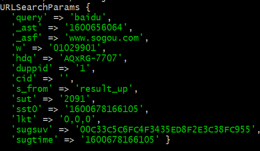
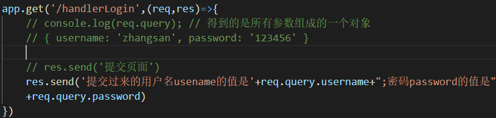
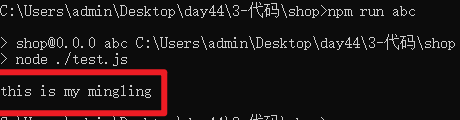
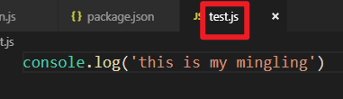
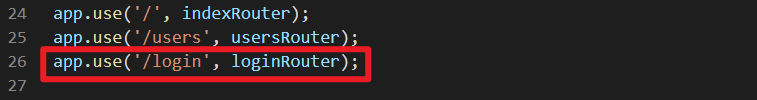
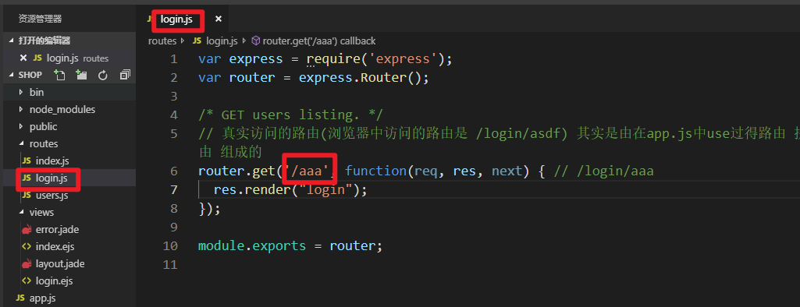
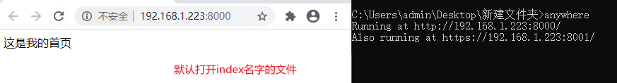
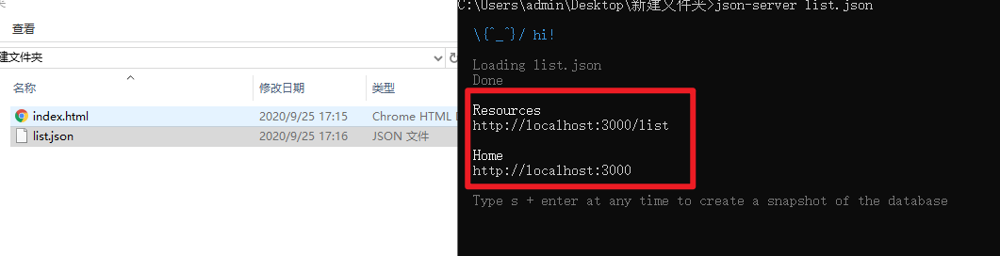
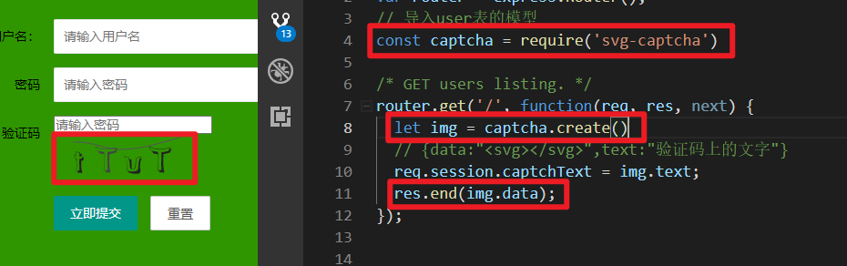

# NodeJS

## 复习

### 概念

nodejs是基于浏览器的js解析器的一个软件，是一个js的运行环境。

有了个这个软件，js可以脱离浏览器运行。

既然脱离了浏览器，也就不能运行有关BOM和DOM的代码。

### 常用命令

nodejs运行js代码，需要用到命令，window命令在今后工作中使用的较少，使用的linux的命令比较多：

> 进入某个目录： cd 目录（回到上级目录：cd ..）
>
> 查看当前文件夹下所有的文件夹：ls（-a参数：包含隐藏的文件夹和文件；-l参数：更加详细的包含权限和类型；-al参数：两个参数一起使用）
>
> 清屏：clear
>
> 创建文件夹：mkdir 目录名称
>
> 删除文件夹：rm -rf 目录路径
>
> 创建文件：touch 文件名称
>
> 写入内容：echo 内容 >> 文件路径
>
> 创建并打开文件：vi 文件名称
>
> 移动文件或文件夹：mv 源文件或源文件夹路径 新的文件或文件夹路径
>
> 拷贝文件或文件夹：cp 源文件或文件夹路径 新的文件或文件夹路径

### 运行

安装好nodejs之后，就在系统中可以运行一个命令：`node`：

> 检测nodejs安装成功或版本：node -v

nodejs要运行js的代码，有两种运行方式：

1. 在控制台运行js代码

   > node
   >
   > 然后就像在控制台运行js代码一样，写一行代码，敲回车就能运行

2. 运行js文件

   > node 文件路径

### 模块化

使用nodejs开发，不可能将所有代码写在文件中，但是又没有html引入js文件，那如何进行多个js文件共同组合一个项目呢？

将一个js文件可以当做是一个函数一样模块，在另一个文件中导入即可。

关于模块化开发，不同的语言版本或不同的应用场景使用的语法是不一样的，例：在es6中，可以将一个js文件导入到另一个文件中，使用一种语法，在nodejs中有自己的导入语法，在gulp中也有自己导入的语法。。。

<https://www.jianshu.com/p/19fe94030485>

<https://www.cnblogs.com/lsj-xl/p/9811548.html>

#### 导出导入

只有经过导出的数据，才能被别的文件使用，就像一个函数只有返回了值，在调用之后才能接受到值一样。

##### 导出

module变量代表当前模块。这个变量是一个对象，module对象会创建一个叫exports的属性，这个属性的默认值是一个空的对象，用于返回当前模块的数据

> module.exports = { 键值对 }
>
> exports.键 = 值

<font color="red">**注意：不要直接给exports赋值，这样会改变原本module.exports的地址，因为直接写exports相当于是将module.exports赋值给了exports变量，给exports重新赋值，就是在改变原来的内存地址，有可能会造成导出失败。**</font>

##### 导入

使用require函数导入模块，通常都需要使用一个变量来接收导出的内容，相当于调用函数后要使用一个变量来接收函数返回的数据，但是接收不是必须的，如果只需要执行另一个模块的代码，而不需要返回值的话，是不需要接收的。

> const 变量 = require(模块)

<font color="red">**注意：如果导入的是自定义模块的话，可以省略后缀，但不可以省略./，因为省略./后，nodejs查找模块的过程，是先在全局中查找模块，如果全局中没有就会去node_modules文件夹中查找，省略掉./是会导入失败的**</font>

#### 模块分类

##### 自定义模块

自己定义好的一个js文件是一个自定义模块

##### 内置模块

nodejs系统内置的js文件是内置模块

###### fs

fs模块用来操作文件。

文件写入

fs.writeFile()
fs.writeFileSync

文件追加

fs.appendFile()
fs.appendFileSync()

文件读取

fs.readFile
fs.readFileSync

重命名

fs.rename()
fs.renameSync

删除文件夹

fs.rmdir

fs.rmdirSync

删除文件

fs.unlink(path,cb);

###### http

创建服务器

```js
// 使用http模块
const http = require('http')
// 创建服务器
const server = http.createServer((req,res)=>{
    // req请求

    // res是相应
    res.end('123') // 给客户端相应内容
}).listen(3000)

// 监听端口
// server.listen(3000)
```


##### 第三方模块

别人写好的js文件就是一个第三方模块，需要下载后才能使用。

### 包管理器

#### npm

初始化:`npm init [-y]`

下载:`包名[@版本][-g] --save-dev --save`    `-D  -S`

安装依赖:`npm i`

卸载:`npm uninstall 包名[@版本][-g] --save-dev --save`

安装的时候，如果是在安装项目依赖，到了线上环境需要安装的包，可以不加参数，也可以加`--save`的参数，简写成`-S`

```shell
npm i jquery
npm i jquery --save
npm i jquery -S
```


如果到线上的环境，不需要安装这些依赖包，在下载的时候就要加`--save-dev`的参数，简写成`-D`

```shell
npm i gulp-sass --save-dev
npm i gulp-sass -D
```


#### yarn

下载安装工具：`npm i yarn -g`

初始化：`yarn init  package.json`
下载包：

> `yarn add 包名  默认是生产环境依赖  npm i 包名 -S`
> `yarn add 包名 --dev 开发环境依赖`

全局安装：`yarn global add 包名 全局安装`

删除：`yarn remove [package] 移除一个包`

安装依赖：`yarn add` 如果add不行，就换install：`yarn install`


### 镜像管理器

#### nrm

> nrm ls：显示进行源地址
>
> nrm test：显示网速的
>
> nrm use 镜像名称
>
> 切换镜像源：`npm config set registry 镜像源地址`

### nodejs全局变量

> `console.log(__dirname);`
> //返回的是当前文件所在的 目录的绝对路径
> `console.log(__filename);`
> //返回的是当前文件的完成路径  绝对路径
>
> `console.log(process.cwd());`
> // nodejs 运行目录

### 常用模块

#### path

> path.join("/a","/b","/c")
> 单纯拼接   结果/a/b/c
> path.resolve("/a","/b","./c","d")
> 解析每一个路径 拼接为一个绝对路径
> 结果：
> 	C:/b/c/d


#### url

```js
const url = require('url')
var p = 'https://www.sogou.com/sie?query=baidu&_ast=1600656064&_asf=www.sogou.com&w=01029901&hdq=AQxRG-7707&duppid=1&cid=&s_from=result_up&sut=2091&sst0=1600678166105&lkt=0%2C0%2C0&sugsuv=00C33C5C6FC4F3435ED8F2E3C38FC955&sugtime=1600678166105';
p = new URL(p)
// var res = p.pathname // 获取到请求的路径
// var res = p.search // 获取到所有的参数
var res = p.searchParams // 将url中所有参数解析出来成一个对象
console.log(res); 
```

| url解析路径中的参数                       |
| ----------------------------------------- |
|  |


### http请求案例

```js
// 导入http
const http  = require('http')
const fs = require('fs')
http.createServer((req,res)=>{
    // console.log(req.url); // 请求路径
    if(req.url=="/" || req.url=="/index.html"){
        // 给客户端响应页面的时候都是将页面读取出来，然后响应出去的
        var data = fs.readFileSync("./snowli/shouye.html")
        res.writeHead(200,{"content-type":"text/html;charset=utf8"});
        res.end(data)
    }else if(req.url.includes("css") || req.url.includes("js")){
        var data = fs.readFileSync("./snowli"+req.url);
        res.end(data)
    }else if(req.url.includes("/img")){ // 批量处理图片
        var data = fs.readFileSync("./snowli"+req.url); // ./snowli/img/1.png
        res.writeHead(200,{"content-type":"image/png"});
        res.end(data)
    }
    res.end()
}).listen(3000)
```


### 爬虫案例

```js
const http = require("http")
const cheerio = require("cheerio")
http.get('http://sc.chinaz.com/tupian/rentixiezhen.html', (res) => {
    let arr = [];
  let str = "";
  res.on('data', (chunk) => { 
    str+=chunk.toString();
   });
  res.on('end', () => {
  
    // 分析数据
    let $ = cheerio.load(str);
    $("img").each(function(i,el){
        arr.push( $(el).attr("src2") );
    });
    console.log(arr);
  });
}).on('error', (e) => {
  console.error(`出现错误: ${e.message}`);
});
```


### node连接数据库

需要依赖一个mysql第三方模块

```js
// 链接数据库
const mysql = require('mysql')
// 创建链接
const db = mysql.createConnection({
    host:'localhost', 
    port:"3306",
    user:'root',
    password:'root',
    database:'ceshi'
})

db.connect()

// 查
// let sql = 'select * from region where pid=1';
// db.query(sql,(err,result)=>{
//     if(err){
//         console.log("查询失败，错误是："+err);
//         return;
//     }
//     console.log(result);
// })

// // 增
// let sql = 'insert user(name) values("张三")';
// db.query(sql,err=>{
//     if(err){
//         console.log("新增失败，错误是："+err);
//         return 
//     }
//     console.log("新增成功");
// })

// 改
// let sql = 'update user set name="李四" where id=1';
// db.query(sql,err=>{
//     if(err){
//         console.log("修改失败，错误是："+err);
//         return 
//     }
//     console.log("修改成功");
// })

// 删除
let sql = 'delete from user where id=1';
db.query(sql,err=>{
    if(err){
        console.log("删除失败，错误是："+err);
        return 
    }
    console.log("删除成功");
})
```


## express

### 介绍

nodejs的框架 基于nodejs原生的代码做了一层封装
nodejs框架： koa2 sail.js egg.js

### 下载

```shell
npm i express -S
```

### 热启动工具

nodemon

```shell
# 下载
npm i nodemon -g
# node命令一样使用
node test.js
nodemon test.js
```

当服务器代码改变之后，会自动重启，不用每次手动重启

### 使用

#### 创建并启动服务器

```js
// 导入
const express = require('express')
// 创建服务器
const app = express();
// 托管静态文件
app.use(express.static("snowli"))
// 监听端口
app.listen(3000)
// 处理请求
app.get("/",(req,res)=>{
    res.end("hello express")
})
```

总结：

1.导入 - 得到的是一个函数

2.调用这个函数 - 得到服务器

3.服务器监听端口

4.处理请求

#### 处理请求并响应

app的get方法用来处理get请求

两个参数：

参数1：

​	请求的路径 - 必须和在network里面看到的那个请求路径保持一致

参数2：回调函数

​	参数1：req 包含所有的请求信息

​	参数2：res 用来响应的


post方法用来处理post请求，参数和get一致

all方法用来处理任意请求，参数和get一样

use方法

​	处理不完全匹配请求路径的请求

例：请求路径： /api/login  

use方法中的路径：  '/api'


响应的方法：

res.end() - 只能响应字符串 - 没有设置响应头

res.send() - 封装好了响应头，不用手动设置

res.json() - 用来响应json数据的

#### 获取get参数

req里面的query属性就是传过来的get参数 - 对象

| 获取get参数                               |
| ----------------------------------------- |
|  |


#### 获取post参数

方法1：

```js
app.post('/handlerLogin',(req,res)=>{
    // 方法1：获取post数据
    let str = '';
    req.on('data',chunk=>{
        str += chunk
    })
    req.on('end',()=>{
        console.log(str);
    })
    res.send("post提交过来了")
})
```

方法2：

```js
const bodyParser = require('body-parser')
app.use(
  bodyParser.urlencoded({
    extended: true
  })
)

app.use(bodyParser.json())


app.post('/handlerLogin',(req,res)=>{
    // 方法2：获取post数据
    console.log(req.body)
    res.send("post提交过来了")
})
```


#### 静态资源托管

```js
app.use([要访问的时候，携带的前缀],express.static(要托管的静态文件的目录名))
```

例：

```js
const express = require('express')
const app = express()
app.use('/aaa',express.static('public'))
app.listen(3000)
```

在访问的时候

| 访问示例                                  |
| ----------------------------------------- |
|  |


### express项目处理

```js
// 导入express和mysql
const express = require('express')
const mysql = require('mysql')
const fs = require('fs')
// 接收post数据需要的
const bodyParser = require('body-parser')
// 创建服务器
const app = express()
app.use(
  bodyParser.urlencoded({
    extended: true
  })
)
app.use(bodyParser.json())


 // 连接数据库
const db = mysql.createConnection({
    host:'localhost',
    port:'3306',
    user:'root',
    password:'root',
    database:'2004'
})
db.connect()
// 监听端口
app.listen(3000)
// 处理 /list的请求显示list.html页面
app.get('/list',(req,res)=>{
    // 显示list页面，读取，响应出去
    let data = fs.readFileSync('./static/list.html','utf-8')
    res.end(data)
})

// 处理所有css请求
app.use('/css',(req,res)=>{
    // req.url === /css/list.css
    // req.url === /css/bootstrap.min.css
    let data = fs.readFileSync('./static/css/'+req.url,'utf-8')
    res.end(data)
})

// 处理所有的js请求
app.use('/js',(req,res)=>{
    // req.url === /css/list.css
    // req.url === /css/bootstrap.min.css
    let data = fs.readFileSync('./static/js/'+req.url,'utf-8')
    res.end(data)
})

// 处理ajax的get请求
app.get('/api/list',(req,res)=>{
    // 查询所有列表
    let sql = 'select * from tour order by id desc';
    db.query(sql,(err,result)=>{
        if(err){
            console.log("查询失败，错误是："+err);
            return;
        }
        res.json(result)
    })
})

// 处理详情页的请求
app.get('/detail',(req,res)=>{
    // 读取detail.html 响应出去
    let data = fs.readFileSync('./static/detail.html','utf-8')
    res.end(data)
})

// 处理detai的ajax请求
app.get('/api/detail',(req,res)=>{
    // 获取ajax传过来的数据
    let id = req.query.id;
    let sql = `select * from tour where id=${id}`;
    db.query(sql,(err,result)=>{
        if(err){
            console.log("查询失败，错误是："+err);
            return;
        }
        // res.json(result)
        // console.log(result[0]);
        res.json({
            meta:{
                status:1,
                msg:'查询成功'
            },
            data:result[0]
        })
    })
})

// 处理/register 的get请求
app.get('/register', (req,res) => {
    let data = fs.readFileSync('./static/register.html', 'utf-8')
    res.end(data)
})

// 处理register提交的注册
app.post('/api/register', (req, res) => {
    // 接收post的数据
    let postData = req.body;
    let sql = `select * from user where username="${postData.username}"`;
    db.query(sql,(err,result)=>{
        if(err){
            console.log('查询失败');
            return;
        }
        let obj = {};
        // 如果没有查到数据 result是一个空数组
        if(result.length==0){
            let sql = `insert user(username,password,email,tel) values('${postData.username}','${postData.password}','${postData.email}',${postData.tel})`
            db.query(sql,err=>{
                if(err){
                    console.log("新增失败，错误："+err);
                    return;
                }
                obj = {
                    meta:{
                        status:102,
                        msg:'注册成功'
                    },
                    data:null
                }
                res.json(obj)
            })
        }else{
            obj = {
                meta:{
                    status:103,
                    msg:'用户名被占用'
                },
                data:null
            }
            res.json(obj)
        }
    })
})
```


### 模板引擎

模板引擎就是为了在html中书写逻辑代码的一种

ejs

在express中使用ejs模板引擎

```js
// 平常显示页面是html，html中不能直接写循环
// 学习模板引擎，在html中写js逻辑代码

// ejs模板引擎
const express = require('express')
const app = express()
const mysql = require('mysql')
const db = mysql.createConnection({
    host:'localhost',
    user:"root",
    password:'root',
    database:'2004'
})
db.connect()
app.listen(3000)
// 设置模板引擎所在的目录
app.set('views',"public") // 第一个参数是固定的：views  第二个的参数是要设置的文件夹
// 设置要使用的模板引擎是哪个
app.set('view engine','ejs') // 第一个参数是固定的，第二个参数是引擎名称 - ejs
// 处理请求
app.get('/',(req,res)=>{
    // 显示某个模板 - 使用res的render方法
    // res.render('home') // 参数是模板名称 - ejs的文件名称
    // 需要给模板中传数据，第二个参数是用来传数据的，参数必须是一个对象，数据属于对象的一个键值对
    let arr = ['a','b','c'];
    res.render('home',{
        arr
    })
})

// 处理 /list 请求路径
app.get('/list',(req,res)=>{
    let sql = 'select * from tour';
    db.query(sql,(err,result)=>{
        res.render('list',{
            data:result,
            title:"列表页"
        })
    })
})
```


## MongoDB

### 介绍

数据库分两种：1.关系型 2.非关系型

mongodb是一个非关系型的数据库

傻瓜式安装，然后在安装目录执行命令：

```shell
mongod 
```

会报错，需要在根目录创建data文件夹，在data下床架db文件夹，启动才能成功

如果想要在任何地方都能使用这个命令，需要配置环境变量

在任何一个目录下启动mongodb，就需要在根目录下创建这两个文件夹


这样就能将mongodb安装成一个服务，以后开机就能自启动

```shell
# 64位：
mongod --dbpath C:\data\db

# 32位：
mongod  --journal --storageEngine=mmapv1
mongod --dbpath c:\data\db --journal --storageEngine=mmapv1
```


### 命令操作

首先，启动mongodb的命令窗口不要关，另外打开一个命令窗口

创建库：

```shell
use 库名
```


插入：

```shell
# 一条
db.库名.insert({对象})
# 多条
db.库名.insert([{对象1},{对象2}])
```

改：

```js
db.库名.update({条件},{新数据})
```

如果条件满足多条数据，改的是第一条

查：

```shell
# 查询所有
db.库名.find()
# 限制条件
db.库名.find({条件})
# 条件
# 等于
db.库名.find({age:11}) # 查询age=11 的数据
# 小于
db.库名.find({age:{$lt:12}}) # 查询 age<12的数据
# 多个条件
db.库名.find({age:{$lt:13,$gt:11}})
db.库名.find({age:11,name:"zhouba"})
```

删：

```shell
# 删除数据 - 删除一条数据
db.库名.deleteOne({条件})
```


### node操作

连接库，创建模型 - 约束表的类型

```js
var mongoose = require('mongoose');
// 不需要端口号，后面的test指的是库名
mongoose.connect('mongodb://localhost/test');
var db = mongoose.connection;
db.on('error', console.error.bind(console, 'connection error:'));
db.once('open', function() {
  console.log("连接成功");
});

var Schema = mongoose.Schema;
// 定义表的字段类型
var userSchema = new Schema({
    username:String,
    password:String,
    tel:Number,
    regTime:{
        type:Date,
        default:Date.now
    }
});
// 根据表的类型创建模型 - user指的是表名
var user = mongoose.model('user', userSchema);
```


增：

```js
// user.insertMany({
//     username:'张三',
//     password:'123456',
//     tel:13212345678,
//     regTime:new Date()
// },(err,docs)=>{
//     if(err){
//         console.log("新增失败，错误："+err);
//         return;
//     }
//     console.log("新增成功");
//     console.log(docs);
// })


user.insertMany([
    {
        username:'李四',
        password:'123456789',
        tel:13333333333,
        regTime:new Date()
    },
    {
        username:'王五',
        password:'123123',
        tel:13222222222,
        regTime:new Date()
    }
],(err,docs)=>{
    if(err){
        console.log("新增失败，错误："+err);
        return;
    }
    console.log("新增成功");
    console.log(docs);
})
```

删：

```js
// 删：
user.deleteOne({
    username:"王五"
},err=>{
    if(err){
        console.log("删除失败，错误是："+err);
        return;
    }
    console.log("删除成功");
})
```

改：

```js
// 改：
// user.update({
//     username:"张三"
// },{
//     username:'王五',
//     password:'111111',
//     tel:13222222222,
//     regTime:new Date()
// },err=>{
//     if(err){
//         console.log("修改失败，错误："+err);
//         return;
//     }
//     console.log("修改成功");
// })
```

查：

```js

// 查：
// user.find({},(err,docs)=>{
//     if(err){
//         console.log("查询失败，错误是："+err);
//         return
//     }
//     console.log(docs);
// })
```


### 其他模块

#### multer

用来上传文件使用的

```js
const express = require('express')
var multer  = require('multer')
var fs  = require('fs')
// var upload = multer({ dest: 'images/' })
const path = require('path')
const app = express()
app.listen(3000)
app.get('/',(req,res)=>{
    let formHtml = `
        <center>
            <form action="/upload" method="post" enctype="multipart/form-data">
                <table>
                    <caption><h2>文件上传</h2></caption>
                    <tr>
                        <td>文件上传：</td>
                        <td><input type="file" name="img"></td>
                    </tr>
                    <tr>
                        <td></td>
                        <td>
                            <input type="submit">
                        </td>
                    </tr>
                </table>
            </form>
        </center>
    `
    res.send(formHtml);
})

let upload = multer({
    storage: multer.diskStorage({
        //设置文件存储位置
        destination: function (req, file, cb) {
            let date = new Date();
            let year = date.getFullYear();
            let month = (date.getMonth() + 1).toString().padStart(2, '0');
            let day = date.getDate();
            let dir = "./images/" + year + month + day;
 
            //判断目录是否存在，没有则创建
            if (!fs.existsSync(dir)) {
                fs.mkdirSync(dir, {recursive: true});
            }
 
            //dir就是上传文件存放的目录
            cb(null, dir);
        },
        //设置文件名称
        filename: function (req, file, cb) {
            let fileName = file.fieldname + '-' + Date.now() + path.extname(file.originalname);
            //fileName就是上传文件的文件名
            cb(null, fileName);
        }
    })
});


app.post("/upload",upload.single('img'),(req,res)=>{
    console.log(req.file);
    // cb(null,file.filename+file.originalname.slice(file.originalname.lastIndexOf('.')))
    // console.log(req.file);
    // cb()
    res.send("结束了")
})
```


#### bcryptjs

加密，用于密码的加密

```js
var bcrypt = require('bcryptjs');

// 加密
var password = 'abc123';
// 参数1：明文
// 参数2：盐
var hash = bcrypt.hashSync(password, 8);  // 返回密文
console.log(hash); // $2a$08$NevGpiP55Pf3vd3YFTbSXOB/BZTuKq8qs8MrUMjkpfchsxBtCXe.y

// 验证
// 参数1：明文
// 参数2：密文
var res = bcrypt.compareSync(password,"$2a$08$NevGpiP55Pf3vd3YFTbSXOB/BZTuKq8qs8MrUMjkpfchsxBtCXe.y"); // 返回一个布尔值
console.log(res);
```


## 脚手架

项目代码生成器 - 搭建整个项目目录，核心代码都实现了

express脚手架

```shell
# 下载
npm i express-generator -g
```

安装完这个工具后，得到一个命令：`express`

创建项目目录：

```shell
express 项目名称文件夹
```

进入这个目录，安装依赖：

```shell
cd shop
npm i 
```

在app.js所在目录启动项目：

```shell
npm start
```

补充：

在package.json文件里面的scripts这个键中，是可以配置自定义命令：

```json
"scripts": {
    "start": "node ./bin/www",
    "abc": "node ./test.js"
  },
```

运行：

| 运行自定义命令                            |
| ----------------------------------------- |
|  |
|  |


### 使用步骤

1. 在app.js中，处理路由 - 自定义的路由

   | 处理路由                                  |
   | ----------------------------------------- |
   |  |

   

2. 处理路由使用一个变量来处理 - 未定义

3. 定义这个变量 - 导入一个文件，文件不存在

   | 定义变量                                  |
   | ----------------------------------------- |
   |  |

   

4. 创建文件，处理路由 - 代码copy隔壁的index或users

   | 创建文件处理路由                          |
   | ----------------------------------------- |
   |  |

   

5. 


### 项目开发


## 项目开发

生成项目：

```shell
express project -e # -e就是将项目的模板引擎设置为ejs
```

安装依赖

```shell
cd project
npm i
```

### MVC

是一种框架的设计模式，由三部分组成：model view controller

model：模型 - 数据

view：视图

controller：控制器 - 决定什么请求响应什么数据，哪里请求响应哪里

使用前端框架：layui


layui写js代码：

```js
//JavaScript代码区域
<script src="https://cdn.jsdelivr.net/npm/js-cookie@2/src/js.cookie.min.js"></script>
layui.use(['element','jquery'], function(){ // 数组，表示需要用到的layui提供的模块
  var element = layui.element;
  var $ = layui.jquery;
  $('.logout').click(function(){
    // 删除cookie
    Cookies.remove('username'); // 删除cookie
    location.href = '/admin';
  })
});
```

express服务器设置cookie - 依赖一个模块，在app.js中的

```js
var cookieParser = require('cookie-parser');
res.cookie('username',username)
```

在服务器获取cookie

```js
let username = req.cookies.username;
```

因为cookie，在请求头和响应头之间传来传去的


在随时随地开启服务器，使用anywhere工具，先下载：

```shell
npm i anywhere -g
```

想将哪一个文件夹作为服务器的根目录，就在这个文件夹中执行命令：

```shell
anywhere
```

启动后，会生成一个服务器，并打开服务器根目录

| 启动anywhere                              |
| ----------------------------------------- |
|  |


模拟假数据做增删改查，需要利用一个工具：json-server

下载：

```shell
npm i json-server -g
```

需要将数据写入一个json文件中，数据格式如下：

```json
{
  "list": [
    {
      "id": 1,
      "name": "张三",
      "age": 12
    },
    {
      "id": 2,
      "name": "李四",
      "age": 13
    },
    {
      "name": "王五,age=16",
      "id": 3
    }
  ]
}
```

启动服务器

```shell
json-server json文件名称
```

就会生成一个服务器地址，并生成请求json文件的地址：

| 启动json-server                           |
| ----------------------------------------- |
|  |


可以发送ajax请求到这个数据，并做增删改查

```html
<script>
var xhr = new XMLHttpRequest;
xhr.onreadystatechange = function(){
	if(xhr.readyState==4){
		if(xhr.status<300 && xhr.status>=200){
			var res = xhr.responseText;
			console.log(res);
		}
	}
}
xhr.open('post','http://localhost:3000/list')
xhr.setRequestHeader('content-type','application/x-www-form-urlencoded');
xhr.send('name=王五,age=16')
</script>
```

就多了一条数据


验证码模块：svg-captcha

下载：

```shell
npm i svg-captcha
```

使用：

```js 
// 导入
const cpatcha = require('captcha')
// 创建验证码
const data = captcha.create()
// 返回的data是一个对象：
/*
{
	data:"<svg></svg"，  // svg标签其实和img标签一样，是一个图片标签
	text:"验证码图片中的文字"
}
*/
res.end(data.data)  // 前端就接收到了svg标签，放到一个标签中就是一个图片
```

例：

| 生成验证码                                |
| ----------------------------------------- |
|  |

data.text可以用来验证验证码，需要提前将她存起来，通常会存在session中


