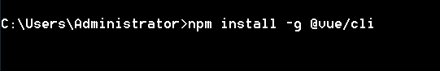
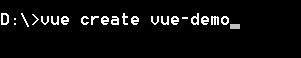

### vue-cli

vue-cli是基于webpack 构建vue自动化开发环境的脚手架。

啥是脚手架?

 

虽然大家没有在建筑工地上搬过砖，但是肯定都见过农民工兄弟在建造大楼前,先通过钢管结构,搭建起大楼的框架吧

 

对，如果我们写的项目是一栋大厦的话，那么vuecli就是,勤劳的农民工兄弟，帮我们在写项目前,把项目的基础结构搭建起来。好啦，接下来我们看看脚手架如何使用吧。

### 安装

在 cmd中 输入以下命令安装

```js
npm install -g @vue/cli
// OR
yarn global add @vue/cli
```

 

静静等待安装成功后在控制台中输入

以下命令,验证是否安装成功

```js
vue --version
```

如果出现版本号,恭喜你安装成功了,可以愉快的玩耍了!

### 启动项目

在合适的位置,打开cmd,输入

```js
vue create <project-name>  // 注意 目录名不能出现大写字母（不要使用驼峰）
```

 

回车之后

 

让我们选择两个预设：default默认的，只有babel和讨厌的eslint,显然满足不了我们的需求,我们选择Manually select features 自定义选择我们需要的配置

我们选择的配置如下

 

选择是否使用路由 history router，其实直白来说就是是否路径带 # 号，建议选择 N，否则服务器还要进行配置


css 的预处理器我选择的是 Sass/SCSS(with dart-sass) 。node-sass是自动编译实时的、选择node-sass


选择 ESLint 代码校验规则，提供一个插件化的javascript代码检测工具，选择ESLint + Standard config


然后选择什么时候进行代码校验，Lint on save 保存就检查，Lint and fix on commit  fix 或者 commit 的时候检查，建议第一个

 

下面就是如何存放配置了，In dedicated config files 存放到独立文件中，In package.json 存放到 package.json 中

本着项目结构简单的想法，我选择了第二个


最后就是是否保存本次的配置了，N 不记录，如果选择 Y 需要输入保存名字

我这里就不保存了，原因是熟能生巧！哈哈哈


然后就等待创建项目吧

 

出现如图红框所示的提示，就搭建成功，进入项目目录，直接输入 npm run serve 就可以了


你以为这样就完了吗？我也是这样认为的，可它不是这样的！


很明显，虽然项目能够正常启动，但是我的 nodeJs 版本用的太高了，然后我给回退到了 11.11.0 版本

虽然没影响太大的影响，但是我不想看见 WARN！回退之后，重新跑项目就不会有问题了。


### 三、目录结构

接下来我们看看脚手架替我们生成了哪些文件吧

```js
 node-modules // 包文件
 public // 静态资源目录
    index.html // 当前项目中 唯一的 html
    favicon.ico // 标题 图标
 src  // 源码目录 这是我们写代码的目录哦
    assets //  放静态资源目录 （代码中的 css js img 字体图标等 放在这里） 
    components // 放公共组件的目录
    router // 路由配置文件
    store // vuex的目录
    views // 放路由组件
    App.vue // 全局的根组件
    main.js // 入口函数
  .browserslistrc  // 配置 postCss自动给css加 浏览器前缀的规则
  .eslintrc.js //  eslint的配置文件
  babel.config.js // babel配置文件
```


### 四、环境配置

下面就是关于项目的环境配置了，我这边一般喜欢用 test、preview、production分别表示测试，预览，生产三种环境

修改 package.json 文件如下

```javascript
"scripts": {


    "serve": "vue-cli-service serve",

    "test": "vue-cli-service build --mode test",           //测试

    "preview": "vue-cli-service build --mode preview",     //预览

    "build": "vue-cli-service build --mode production",    //生产

    "lint": "vue-cli-service lint"

},
```

在项目根目录下新建 .env.test、.env.preview、 .env.production 文件，分别对应三个环境的配置文件，注意，名字要与 --mode 后面的名字分别对应

.env.test 代码如下

```javascript
NODE_ENV="test"


VUE_APP_BASE_URL="测试环境域名"
```

.env.pre 代码如下

```javascript
NODE_ENV="preview"


VUE_APP_BASE_URL="预览环境域名"
```

.env.prod 代码如下

```javascript
NODE_ENV="production"


VUE_APP_BASE_URL="生产环境域名"
```

ok，这样环境就配置好了，分别用以下命令来打包不同环境的包就可以了

```javascript
npm run test    //测试


npm run pre     //预发布


npm run prod    //生产
```

另外需要说明一点的是，本地环境会默认从 .env.development 文件中读取配置

所以记得有需要记得新建一个然后存放配置

我的 .env.development 代码如下

```javascript
NODE_ENV="development"


VUE_APP_BASE_URL="本地环境域名"
```

### 五、项目配置

从 vue-cli3.0 开始 build 和 config 目录就取消了，如果需要修改配置，可以在项目的根目录新建一个 vue.config.js 文件来覆盖项目的配置，因为项目的配置比较多，下面简单列举常用的配置

```js
const path = require('path')
module.exports = {
  outputDir:"build", // 定义 构建生产环境的 目录 默认是dist
  assetsDir:"static",  // 构建生产环境时，静态资源存放的目录，默认是存放在根目录
  productionSourceMap:false, // 移除 讨厌的.map文件，加快 服务器响应速度
  devServer: {
    port: 3000, // 自定义端口
    open: true, // 启动时自动打开浏览器
    proxy: { // 请求的反向代理 解决跨域的问题哦，
      '/conner': { // 请求 接口 以 /conner开头，自动匹配
        target: 'https://api.it120.cc', // 目标地址
        ws: false,
        changeOrigin: true, // 开启代理：在本地会创建一个虚拟服务端，然后发送请求的数据，并同时接收请求的数据，这样服务端和服务端进行数据的交互就不会有跨域问题
        pathRewrite: { // 路径重写
          '^/conner': '/conner'
        } // 这里重写路径
      }
    }
   
  },
  lintOnSave: false, // 定义eslint的 检查
  chainWebpack:(config)=>{  // 配置路径别名 这个很重要哦
    config.resolve.alias
    .set('@', path.join(__dirname, 'src'))
    .set('components', path.join(__dirname, 'src/components'))
    .set('views', path.join(__dirname, 'src/views'))
    .set('api', path.join(__dirname, 'src/api'))
    .set('utils', path.join(__dirname, 'src/utils'))
    .set('mixins', path.join(__dirname, 'src/mixins'))
    .set('plugins', path.join(__dirname, 'src/plugins'))
  }
}
```


