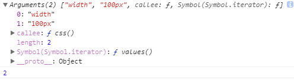
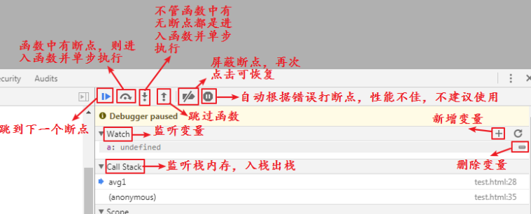

## 函数-上

引入：

先问大家一个问题，大家洗过衣服吧？

手动怎么洗？那个盆，接水，放衣服，倒洗衣粉，洗，涮，拧干

挺费劲的，有没有简便的方法？

使用洗衣机，衣服放进去，倒上洗衣粉，按开关，一切就都搞定了

在生活中这样的例子有很多，大到洗衣机空调，小到水龙头剪刀。每个工具都有自己不同的功能。为了生活方便简洁，就会使用这些工具。

程序员是一群很会享受生活的群体，所以在代码中也有很多这样的工具，就是咱们今天要学习的函数。

总结：代码中工具----函数

### 概念：

函数就是具备某个功能的一个工具。是完成某个功能的一段代码。

大家以前有没有用过函数呀？

parseInt() alert()  这都是函数，是系统提供的，直接拿来就能用。

系统提供了很多函数，但是并不能包含所有的功能，所以有些功能需要我们自己来写----自定义函数。函数定义好以后，就可以像系统函数一样使用了，不用再重复写了。

所以经常写的代码，就写一个函数，需要的时候调一下好了。

自定义函数怎么写？

### 定义语法：

```shell
function 函数名(){
	代码段
}
# function是一个关键字，函数名自定义，定义规则和变量的定义规则相同
```

当我们定义好函数，并在页面中刷新的时候，会发现这段代码并没有被执行。因为函数定义好后，是不会自动执行的，需要我们进行调用。

### 函数的调用：

```shell
语法：
	函数名()
```

调用的语法很简单，这样我们以后还需要执行函数中的代码的时候，就不用再重写那么多的代码了，只需要简单的将原来定义好的函数进行调用即可。

```javascript
// 定义函数:求两个数的和
function fn(){
    var a = 1;
    var b = 2;
    var c = a + b;
    console.log(c);
}
// 函数定义好以后，不会自动执行，需要手动调用
fn();
```

### 函数的优点：

1. 实现了代码的可重用性
2. 实现了模块化编程

我们在使用工具的时候，很多工具需要我们带东西进去，比如洗衣服要放衣服进去，用函数这个工具来说的话，就是需要带参数。

### 带参数的函数：

函数代码中会发生改变的值用变量来代替，入口是声明函数时的小括号

```js
function zizeng(a){  // 叫做形参 - 形式上的参数
    var b = a + 1;
    console.log(b);
}
```


调用函数的时候，需要给参数赋值

```js
zizeng(1); // 实参 - 实际上的参数，实参其实就是给形参赋值
```

### 获取函数的实参

函数中还有一个关键字arguments可以获取到所有的实参

```javascript
function css(){
	// 打印实参
	console.log(arguments);
	// 打印实参的个数
	console.log(arguments.length);
}
css("width","100px");
```

效果：

| 获取实参和个数                            |
| ----------------------------------------- |
|  |

如果有形参的话，也是一样的，通过下标取到其中的每一个值

### 匿名函数（赋值式的函数）

概念：顾名思义，匿名函数就是没有名字的函数。

定义：

```shell
语法：
	function(){
        代码段
	}
```

当然匿名函数也可以传递参数。

调用：匿名函数的调用是在定义的时候调用

```shell
语法：
	(function(形参){
        代码段
	})(实参)
```

很简单，就是在大括号后面加小括号就是调用。

```javascript
(function(a,b){
    var c = a + b;
    document.write(c);
})(1,2);
```


也可以将匿名函数赋值给变量，调用的时候使用变量名来调用。

```shell
语法：
# 定义
	var fun = function(){
        代码段
	}
# 调用
	fun()
```

例：

```javascript
var fun = function(a,b){
    var c = a + b;
    document.write(c);
}
fun(1,2);
```


通过事件来调用匿名函数

```html
<style>
#myid{
	width:200px;
	height:200px;

	background:#f00;
}
</style>
<body>
	<div id="myid"></div>
</body>
<script>
var oDiv = document.getElementById("myid");
oDiv.onclick=function(){
	alert(123);
}
</script>
```


### 带返回值的函数

```shell
语法：
	function 函数名(){
        return 返回的结果
	}
```

将结果返回的关键字是return，这样可以将函数运算的结果返回给调用者

```javascript
// 定义一个让指定数字递增的函数
function increase(x){ // 带有参数的函数
	var y = x + 1;
	return y
}
// 让2递增，得到结果赋值给变量3
var a = increase(2);
document.write(a%2); // 1
// 让5递增，得到结果赋值给变量b
var b = increase(5);
alert(b/2); // 3
// 让10递增，得到结果赋值给变量c
var c = increase(10); 
console.log(c+a-b); // 8
```

带有返回值的函数，当调用函数的时候得到一个结果，这个结果可以参加运算，也可以进行赋值。

带有返回值的函数，当函数执行到return关键字的时候，函数就终止了，在return后面的代码不会运行。

```javascript
// 定义一个让指定数字递增的函数
function increase(x){ // 带有参数的函数
	var y = x + 1;
	return y
    // 下面的代码不会被执行
	y += 2;
	alert(y);
}
// 让2递增，得到结果赋值给变量3
var a = increase(2);
document.write(a);
```

return的作用：

1. 终止代码继续运行
2. 在函数中返回<font color="red">**一个**</font>内容


### 变量的声明提升

浏览器中有一段程序专门用来解析js代码， 叫做js解析器。js解析器在执行js代码的时候，分两步进行：

1. 预解析js代码

   预解析的过程，就是查找代码中的var和function这两个关键字，找到以后，将变量和函数存到了一个地方，就叫仓库吧，并给他们赋一个初始值，变量的初始值为undefined，函数的初始值为代码段。

2. 开始按顺序一行一行解读代码

   解读代码的时候，仓库中的变量和函数的值会随着代码的解读而发生变化，也就是变量的赋值和函数的调用。

预解析分为变量的预解析和函数的预解析，也就是代码在执行之前先进行解析，将变量和函数的声名放在当前作用域的最前面。

```javascript
console.log(a); // 因为变量a没有声名过，所以会报错

test(); // 函数未定义，所以报错

```

但是在打印之后声名过变量的话，情况就不一样了。

```javascript
// 变量预解析
console.log(a); // 因为变量a在执行之前进行了预解析，也就是已经放到内存中了，只是没有值，所以是undefined
var a = 1;
/* 预解析相当于下面的过程 */
var a; // 将变量的声名放到当前作用域的最前面
console.log(a);
a = 1;

// 函数预解析
test(); // 结果：123   代码在执行之前经过预解析，将函数的内容放到了内存了，所以在下面的定义函数也能调用执行
function test(){
	console.log(123);
}
/* 预解析过程如下： */
function test(){ // 将函数声名放到当前作用域的最前面
	console.log(123);
}
test();


```

案例：

```javascript
// 1.匿名函数赋值给变量
fn();
var fn = function(){
    console.log(123);
}
// 2.函数内部的变量预解析
function test(){
    console.log(a);
    var a = 10;
}
test();
```

总结：

1. 用var关键字声名的变量，将变量的声名提升到当前作用域的最前面，赋值不提升
2. 自定义的函数整体提升到当前作用域的最前面
3. 函数同名，后面的会覆盖前面的
4. 变量和函数同名，函数优先提升

面试题：

```javascript
//1. 
var num = 10;
fn1();
function fn1() {
  console.log(num);
  var num = 20;
}

//2. 
var a = 18;
fn2();
function fn2() {
    var b = 9;
    console.log(a);
    console.log(b);
}

//3.
fn3();
console.log(c);
console.log(b);
console.log(a);
function fn3() {
  var a = b = c = 9;
  console.log(a);
  console.log(b);
  console.log(c);
}

//4. 思考题
var a = 4;
console.log(a);
a = 6;
console.log(a);
function a() {
    console.log('哈');
}
a();
a = 10;
console.log(a);
```

### 形参和实参

声明函数时候带进去的那个参数叫形参

调用函数的时候给形参进行赋值的实际值是实参


不是所有的程序的结果都需要输出在页面中，有时候，我们只是想让这一段代码得出一个结果，后续代码得到这个结果后进行后续处理。那么上面的函数显然已经不适用了。我们需要使用函数的返回。

### 函数的嵌套

函数的嵌套就是在函数中调用函数：

```javascript
// 求数组中所有元素的平均数
/*
分析：
	1.先求和
	2.再求平均数
 */
// 求和函数
function sum1(arr) {
	var s = 0;
	for(var i in arr){
		s += arr[i];
	}
	return s;
}
// 求平均数函数
function avg1(arr) {
	var sum = sum1(arr);
	var length = arr.length;
	var a = sum/length;
	return a;
}
// 调用
var arr = [1,6,9,7,2];
var avg = avg1(arr);
console.log(avg);
```

### 函数的调试

| 示意图                                    |
| ----------------------------------------- |
|  |
