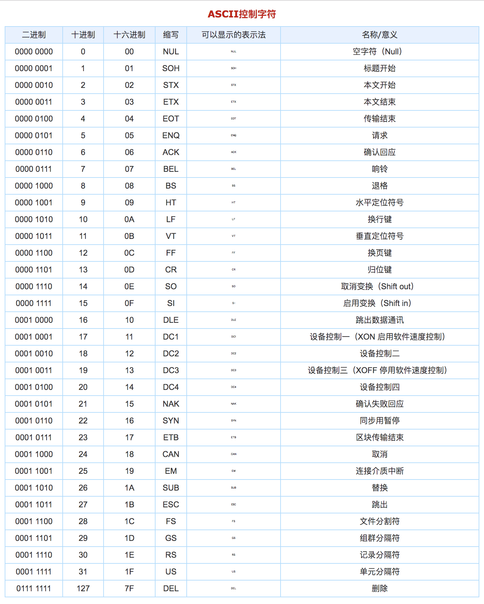
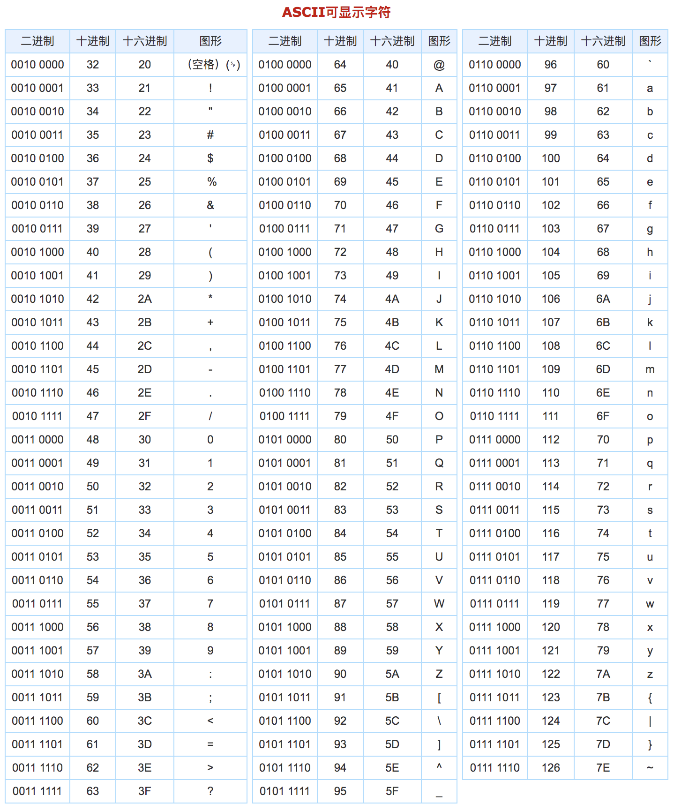

编程语言和我们平时使用软件一样，也会随着使用的人群增多，添加一些新的功能。

js语言也有很多版本。我们平常所使用的语法，大部分都是ES3的语法。ES3代表ECMAScript第三个版本。后面还有ES5、ES6、ES7。。。等版本。

ES5这个版本的语法是公认兼容性最好的语法。ES5的语法和ES3的语法相差不多，只是在ES3的基础上新增了一些特性。

## ES5的语法

### 严格模式

由于js的作用域和隐式声明变量等语法会造成很多预想不到的错误，所以ES5中新增了一个严格模式的语法，用于严格规范代码的书写。

使用语法：

```shell
"use strict";
```

使用说明：

1. 要放在代码的最前面，也就是在script标签中的第一行或者某个函数中的第一行，否则会失效
2. 严格模式可以规范当前script标签或者当前函数中的代码，不能规范别的script标签中的代码和别的函数

规范的语法：

1. 不允许隐式声明变量
2. 禁止函数中的形参重名
3. 禁止函数中的this代表window

为什么要使用严格模式？

1. 可以让代码更加规范
2. 可以让代码运行起来更快，提高运行效率

<font color="red">**注意：当合并文件时，第一行的严格模式代码回失效，建议包在一个自执行函数中**</font>

### 新增数组方法

#### indexOf方法

查找某个元素在数组中第一次出现的位置

语法：

```shell
arr.indexOf(元素,[开始查找的起始下标]);
# 参数1：将要查找的元素
# 参数2：可选项。从哪个下标开始往后查找
# 返回值：如果找到了，就返回这个元素在数组中的下标，如果没有找到，就返回-1
```

例：

```js
var arr = [1,3,5,7,7,5,3,1];
console.log(arr.indexOf(5)); //2
console.log(arr.lastIndexOf(5)); //5
console.log(arr.indexOf(5,2)); //2
console.log(arr.lastIndexOf(5,4)); //2
console.log(arr.indexOf("5")); //-1
```

#### forEach方法

用于遍历数组

语法：

```shell
arr.forEach(function(值, 下标, 当前数组){
	// 代码段
});
# 在这个方法中需要传入一个函数参数，这个函数的参数说明如下：
# 参数1：数组遍历出来的每个值
# 参数2：可选项。数组遍历出来的每个值对应的下标
# 参数3：可选项。被遍历的当前数组
```

例：

```js
var arr = [1, 2, 3, 4, 5];
arr.forEach(function(x, index, a){
console.log(x + '|' + index + '|' + (a === arr));
});
// 输出为：
// 1|0|true
// 2|1|true
// 3|2|true
// 4|3|true
// 5|4|true
```

使用说明：

这个方法没有返回值，返回值为undefined，不会改变原来数组的值。

#### map方法

遍历数组，并将每个元素传入回掉函数中处理后，组成新的数组并返回

语法：

```shell
arr.map(function(值，下标，当前数组){
	// 对v进行处理并返回处理后的每个v组成的数组
});
```

例：

```js
var arr = [1, 2, 3, 4, 5];
var arr2 = arr.map(function(item){
	return item*item;
});
console.log(arr2); //[1, 4, 9, 16, 25]
```

使用说明：

这个方法主要用于以同样的规则处理数组中的每个值，并组成新的数组返回

#### filter方法

遍历数组，根据过滤条件，筛选出数组中满足条件的元素，组成新数组并返回

语法：

```shell
arr.filter(function(值, 下标, 当前数组){
	// 筛选条件
});
```

例：

```js
var arr = [1, 2, 3, 4, 5, 6, 7, 8, 9, 10];
var arr2 = arr.filter(function(x, index) {
	return index % 3 === 0 || x >= 8;
}); 
console.log(arr2); //[1, 4, 7, 8, 9, 10]
```

使用说明：

使用方法和功能跟map方法很像，只是运行规则不一样。map方法中的函数，用于返回新的元素，而filter方法中的函数，根据返回true或false来筛选元素

#### reduce方法

归并，其中调用回掉函数，回掉函数中有两个参数，第一个参数是上一次操作的返回值，第二个参数是从第二个元素开始到最后一个元素

语法：

```shell
arr.reduce(function(prev,next){
	// 逻辑代码
});
```

例：

```js
var arr = [1,2,3,4,5,6];
document.write("prev------next<br>");
var res = arr.reduce(function(prev,next){
    document.write(prev + "------" + next + "<br>");
    // prev 表示上一次操作返回的结果，第一次是第一个数
    // next 表示是下一个数，第一次是第二个数
    return prev + next; // 将每一次操作的结果返回给下一次的prev（数组求和）
});
console.log(res);
```

效果：

| 归并示意图                                |
| ----------------------------------------- |
|  |

## 字符串

计算机产生之初，内部只能识别二进制数字，无法识别英文字母和符号。为了能让计算机识别字母、数字和符号，科学家们制定了一个对照表，字母、数字、符号跟二进制数字相对应，这样当人们输入字母的时候，计算机使用对应的二进制数字处理，这样就相当于计算机能识别字母、符号和数字了。这个对照表叫做ASCII，翻译成中文叫阿斯克码。

### 阿斯克码

阿斯克码计算机中用得最广泛的字符集及其编码，是由美国国家标准局(ANSI)制定的ASCII码（American Standard Code for Information Interchange，美国标准信息交换码）。所以对于英文字母和符号的支持是很全面的。

阿斯克码的具体内容如下：

|  |
| ---------------------------- |
|  |

为什么要学习阿斯克码？

因为两个字符串也是可以比较大小的，比较的规则是逐字符进行比较，字符的大小由字符对应的阿斯克码决定。

### 字符串的比较

我们曾经碰到过一个问题，接收到文本框的两个值，一个是"3"，另一个是"10"，这两个值进行大小比较的时候，结果是：`"3">"10" === true`，出现这个结果的原因是，两个字符串进行比较的时候，是逐字符进行比较，也就是字符"3"先和字符"1"进行比较，如果第一个字符相等再进行第二个字符的比较。

从阿斯克码表中，可以找到字符"3"和字符"1"相对应的值，很明显，字符"3"是要大于字符"1"的。

通过阿斯克码表，我们可以得出一些字符串比较的规律：

1. 字母比数字大
2. 小写字母比大写字母大
3. 字母越靠后越大


<font color="blue">思考：如何比较两个中文汉字字符的大小？</font>

阿斯克码总共128个，包含符号、大小写英文字母、数字。阿斯克码是由美国人创建的，所以对于英文的支持非常好。后来随着计算机的普及，各个国家在使用计算机的时候，没办法使用本国文字，这样用起来非常困难。所以众多国家的科学家一起制定了一个更大的对照表，包含各个国家的文字符号，所以称之为万国码，也叫作unicode。

其实unicode就是更大的阿斯克码。

### 字符串的基本操作

<font color="red">字符串也可以通过下标获取字符</font>

例：

```js
var str = '你好吗';
// 输出下标为1的字符
console.log(str[1]); // 好
```

每个字符都有对应的下标，所以，字符串也可以进行遍历。

<font color="red">字符串是只读数据类型，不能添加新字符，不能修改字符串中的字符，不能删除某个字符</font>

例：

```js
var str = '你好吗';
// 修改下标为1的字符
str[1] = "帅"
console.log(str); // 你好吗
```

### 字符串常见API

#### length属性

求字符串中字符的个数 - 字符串的长度

语法：

```shell
字符串.length
```

例：

```js
var str = 'asdfvczx';
// 输出字符串的长度
console.log(str.length);
```

#### charAt方法

根据指定的下标获取对应的字符

语法：

```shell
字符串.charAt(下标)
```

例：

```js
var str = 'abcdef';
// 获取下标为3的字符
var res = str.charAt(3);
console.log(res); // d
```

使用说明：如果下标存在就返回对应的字符，如果下标不存在就返回空字符串

#### charCodeAt方法

根据指定下标获取对应的字符的阿斯克码

语法：

```shell
字符串.charCodeAt(下标);
```

例：

```js
var str = 'abcdef';
// 获取下标为3的字符的阿斯克码
var res = str.charCodeAt(0);
console.log(res); // 97
```

#### String.fromCharCode方法

根据指定的阿斯克码得到对应的字符

语法：

```shell
String.fromCharCode(阿斯克码)
```

例：

```js
// 获取98对应的字符
var res = String.fromCharCode(98);
console.log(res); // b
```

#### indexOf方法

查找字符或子字符串在大字符串中第一次出现的位置

语法：

```shell
大字符串.indexOf(字符/子字符串[,开始查找的下标])
```

例：

```js
var str = 'i love you';
// 找到o字符在str中第一次出现的位置
var res = str.indexOf('o');
console.log(res); // 3
```

使用说明：

1. 如果找到这个字符在字符串中的位置，就返回这个字符对应的下标，如果找不到，就返回-1
2. 第二个参数可选项。表示从哪个下标开始查找

#### lastIndexOf方法

查找字符或子字符串在大字符串中最后一次出现的位置

语法：

```shell
大字符串.lastIndexOf(字符/子字符串[,开始查找的下标])
```

例：

```js
var str = 'i love you';
// 找到o字符在str中最后一次出现的位置
var res = str.lastIndexOf('o');
console.log(res); // 8
```

使用说明：

1. 如果找到这个字符在字符串中的位置，就返回这个字符对应的下标，如果找不到，就返回-1
2. 第二个参数可选项。表示从哪个下标开始查找

#### substr方法

截取字符串

语法：

```shell
字符串.substr(开始下标[,截取长度])
```

例：

```js
var str = '你的头发还好吗';
// 从下标2开始截取2个字符
var res = str.substr(2,2);
console.log(res); // 头发
```

使用说明：

1. 第二个参数是可选项。如果省略掉第二个参数，默认截取到字符串末尾。
2. 开始下标可以使用负数表示，从右往左的下标依次是-1，-2，。。。
3. 截取字符的时候都是从做向右截取的

例：

```js
var str = '你的头发还好吗';
// 从下表2开始截取
var res = str.substr(2);
console.log(res); // 头发还好吗

// 从下标-5开始截取2个字符
var res = str.substr(-5,2);
console.log(res); // 头发

// 从下标-1开始截取2个字符
var res = str.substr(-1,2);
console.log(res);// 吗
```

使用说明：截取到最后也不满足长度的时候，就返回能截取到的所有字符

#### substring方法

截取字符串

语法：

```shell
字符串.substring(开始下标[，结束下标])
```

例：

```js
var str = '你的头发还好吗';
// 从下标2开始截取到下标4
var res = str.substr(2,4);
console.log(res); // 头发
```

使用说明：

1. 第二个参数是可选项。如果省略掉第二个参数的话，默认截取到字符串末尾。
2. 截取的结果包含开始下标对应的字符，不包含结束下标对应的字符
3. 如果开始下标和结束下标相等，则返回空字符串；如果开始下标大于结束下标，则先交换两个参数，然后再截取；如果开始下标或结束下标为负数，则先将负数替换成0，然后再截取

例：

```js
var str = '你的头发还好吗';
// 从下标2开始截取
var res = str.substring(2);
console.log(res); // 头发还好吗

// 从下标2截取到下标-2
var res = str.substring(2,-2);
console.log(res); // 你的
/*
过程分析：
首先开始下标大于结束下标，所以先交换两个参数，相当于： str.substring(-2,2);
开始下标为负数，所以替换成0，相当于： str.substring(0,2);
所以结果为：你的
*/
```

#### slice方法

截取字符串

语法：

```shell
字符串.slice(开始下标[，结束下标]);
```

例：

```js
var str = '你的头发还好吗';
// 从下标2截取到下标4
var res = str.slice(2,4);
console.log(res); // 头发
```

使用说明：

1. 第二个参数是可选项。如果省略第二个参数默认截取到字符串的末尾
2. 返回的结果包含开始下标对应的字符，不包含结束下标对应的字符
3. 截取的时候，下标可以使用负数表示
4. 开始下标对应的字符一定要在结束下标对应的字符左边，否则返回空字符串。因为截取的顺序是从左向右的

例：

```js
var str = '你的头发还好吗';
// 从下标2开始截取
var res = str.slice(2);
console.log(res); // 头发还好吗

// 从下标-5开始截取到下标4
var res = str.slice(-5,4);
console.log(res); // 头发

// 从下标-1截取到下标-3
var res = str.slice(-1,-3);
console.log(res); // 空
```

#### split方法

使用指定的分隔符将字符串分割成多部分组成数组

语法：

```shell
字符串.split([分隔符，[最后数组中要保留的个数]])
```

例：

```js
var str = 'open_door_now';
// 以下划线为分隔符，分割字符串为数组
var arr = str.split("_");
console.log(arr); // ["open", "door", "now"]
```

使用说明：

1. 分隔符是可选项。如果省略了分隔符，则将整个字符串当做数组的元素，如果是空字符串，则会在每个字符中间进行分割
2. 要保留的个数是可选项。如果省略了个数，则返回全部的个数，如果加上个数，则是设置了数组中元素的个数。

例：

```js
var str = 'open_door_now';
// 省略分隔符将字符串分割为数组
var arr = str.split();
console.log(arr); // ["open_door_now"]

// 以空字符串进行分割字符串
var arr = str.split("");
console.log(arr); // ["o", "p", "e", "n", "_", "d", "o", "o", "r", "_", "n", "o", "w"]

// 以空字符串分割字符串，并在数组中保留4个元素
var arr = str.split("",4);
console.log(arr); // ["o", "p", "e", "n"]
```

#### replace方法

使用新的字符或子字符串替换原来在字符串中的一部分

语法：

```shell
字符串.replace(将要被替换的部分,要替换进来的新内容);
```

例：

```js
var str = '你的头发还好吗';
// 使用"眉毛"将"头发"替换掉
var res = str.replace("头发","眉毛");
console.log(res); // 你的眉毛还好吗
```

使用说明：如果第一个参数是空字符串，则会将新内容拼接到原字符串前面

例：

```js
var str = '你的头发还好吗';
// 使用"眉毛"将""替换掉
var res = str.replace("","眉毛");
console.log(res); // 眉毛你的头发还好吗
```

#### trim方法

去除字符串左右两边的空白

语法：

```shell
字符串.trim();
```

例：

```js
var str = '    ab c  ';
// 取出str左右两边的空白
var res = str.trim();
console.log(res); // 'ab c'
```

使用说明：

1. 去除的是左右两边的空白，不会去除字符串中间的空白
2. 只去除左边的空白使用：`trimLeft`方法；只去除右边的空白使用：`trimRight`方法

#### 大小写转换方法

将字符串中所有小写字母转为大写字母，使用：`toUpperCase`方法

将字符串中所有小写字母转为大写字母，使用：`toLowerCase`方法

语法：

```shell
字符串.toUpperCase(); # 转为大写
字符串.toLowerCase(); # 转为小写
```

### 字符串案例

对象数组模糊查找 ：

```js
var data=[
    {id:1001,icon:"img/1.png",name:"计算机",num:1,price:10},
    {id:1002,icon:"img/2.png",name:"手机",num:1,price:20},
    {id:1003,icon:"img/3.png",name:"电脑",num:1,price:30},
    {id:1004,icon:"img/4.png",name:"显示器",num:1,price:40},
    {id:1005,icon:"img/5.png",name:"飞行器",num:1,price:50},
    {id:1006,icon:"img/6.png",name:"计时器",num:1,price:60},
    {id:1007,icon:"img/7.png",name:"笔记本",num:1,price:70},
    {id:1008,icon:"img/8.png",name:"草稿本",num:1,price:80},
    {id:1009,icon:"img/9.png",name:"公示牌",num:1,price:90},
    {id:1010,icon:"img/10.png",name:"手机线",num:1,price:100}
];
function searchStr(search) {
    return data.filter(function (t) {
        return t.name.indexOf(search)>-1;
    });
}
```

找到字符串中 '' 某个字出现过几次 第几位

```js
while(str.indexOf(s,i) != -1){
    alert(str.indexOf(s,i))
    i = str.indexOf(s,i)+s.length
}
```


