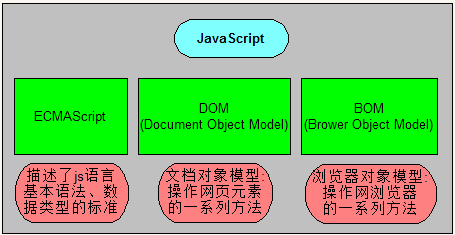
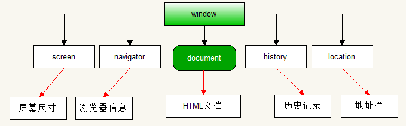
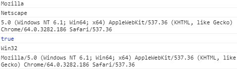
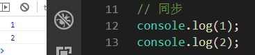
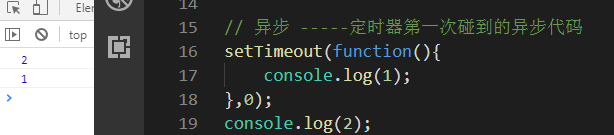
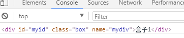

| js的组成部分                              |
| ----------------------------------------- |
|  |

前面学习的部分是ECMAScript部分，都是基础语法部分。基础语法只是规定的代码如何写，并不能实现很多主流的操作，比如跳转页面，获取浏览器的尺寸等操作。再比如让HTML元素动起来。

所以需要学习BOM来操作浏览器。学习DOM来操作HTML标签。

## BOM

BOM是三个单词的首拼--Browser Object Model，即浏览器对象模型。

既然是对象模型，那么所有内容，都是用对象来描述的。

BOM中最大的对象叫window，是浏览器窗口对象。他包含了很多浏览器的操作。

| window对象中包含的对象                    |
| ----------------------------------------- |
|  |

### 浏览器的信息

浏览器的名称、版本等信息。关于浏览器的信息，window交给了他的子对象navigator去记录。

```js
console.log(navigator.appCodeName); // 返回浏览器的代码名
console.log(navigator.appName); // 返回浏览器的名称
console.log(navigator.appVersion); // 返回浏览器的平台和版本信息
console.log(navigator.cookieEnabled); // 返回指明浏览器是否启用cookie的布尔值
console.log(navigator.platform); // 返回运行浏览器的操作系统平台
console.log(navigator.userAgent); // 返回由客户机发送服务器的user-agent头部的值
```

结果：

| 浏览器信息                                |
| ----------------------------------------- |
|  |

使用说明：其实navigator对象是属于window对象的，但是window是所有对象的顶级对象，所以通常在写的时候，可以省略掉window。

### 浏览器的历史记录

历史记录的操作是window的子对象history。可以操作网页的前进和后退。

```shell
history.back(); # 返回到上一个页面，相当于浏览器的后退按钮
history.forward(); # 前进到下一个页面（下一个页面必须是点击以后的页面），相当于浏览器的前进按钮
history.go(); #可以前进可以后退  go里面的值  正为前进  负数为后退  值的大小为前进或后退的页面数
```

### 浏览器的地址栏信息

浏览器的地址栏操作，window对象交给了自己的子对象location对象去处理。

```js
console.log(location.hash); // 设置或返回从#开始的url --- 锚点
console.log(location.href); // 设置或返回完整的的url
console.log(location.search); // 设置或返回url中的参数部分
```

方法：

```shell
语法：
	location.assign("要跳转的地址"); # 这个方法是设置要跳转的地址
	location.reload(); # 重新加载本页面
	location.replace() # 使用新地址替换掉旧地址（跳转）
```

```
注：用函数将url编码的数据还原
res = decodeURI(res)  //decodeURI解码 - url编码
```


### 浏览器的弹出

```js
window.alert("恭喜你！");
window.prompt("请输入数字：",1);
window.confirm("你确定要删除吗？")
```

### 浏览器窗口尺寸

- window.innerHeight - 浏览器窗口的高度
- window.innerWidth - 浏览器窗口的宽度

```js
var w = window.innerWidth;
console.log(w);
var h = window.innerHeight;
console.log(h);
```

说明：

1. 这两个属性返回的单位是像素
2. 这两个属性计算的范围包含滚动条的区域
3. 可以省略window

### 浏览器的事件

onload事件：当网页中的所有资源都加在完成之后执行这个事件

```js
window.onload = function(){
	console.log("当网页中所有资源加载完成才打印");
}
```

使用说明：通常是将script标签放到head标签中的时候使用。因为放在head中默认是获取不到body中的内容的，但是有了这个事件后，就可以了。

onunload事件：当浏览器关闭的时候触发这个事件

```js
window.onunload=function(){
    alert("浏览器要关闭了");
}
```

使用说明：只有在ie浏览器中能看到效果

onscroll 滚动事件：当网页滚动条的位置发生改变的时候触发这个事件

```js
window.onscroll = function () {
  console.log('浏览器滚动了')
}
```

使用说明：浏览器要有滚动条才行。

浏览器窗口改变事件：resize

```js
window.onresize = function(){
    // 当浏览器的窗口大小发生改变的时候触发这个事件
}
```

### 浏览器滚动的距离

获取文档向下滚动的距离，以下两个都可以：

- document.documentElement.scrollTop 

- document.body.scrollTop

```js
window.onscroll = function () {
  var t = document.documentElement.scrollTop;
  console.log(t);
  var t1 = document.body.scrollTop;
  console.log(t1);
}
```

使用说明：这两个的区别在于当前文档有没有`doctype`，有就用`document.documentElement.scrollTop`，没有就用`document.body.scrollTop`

获取页面向右滚动的距离：

- document.body.scrollLeft 

- document.documentElement.scrollLeft

使用方式同上。

这两个方法在ie和edge下有兼容性问题。

使用兼容写法：

```js
var t = document.documentElement.scrollTop || document.body.scrollTop;
var t = document.documentElement.scrollLeft || document.body.scrollLeft;
```


滚动距离可以赋值，如果给向上的滚动距离赋值为0，就实现了回到顶部的效果。但效果时瞬间返回，体验感不好。

思考：如果才能让回到顶部有动画的效果？

使用定时器。每隔一段时间让滚动距离减小。

```html
<style>
#backTop{
    display:none;
    width:80px;
    text-align: center;
    height: 30px;
    line-height:30px;
    border:3px solid #000;
    position:fixed;
    top:500px;
    right:50px;

}
</style>
<body>
    <div style="width: 20px;">
            一类是以机场为主导，通过与其他机场航空公司或者第三方合作的方式，为在本机场中转的旅客提供服务；第二类是以航司为主导，以代码共享、
            通程联运和合作联营的方式，在既定的中转机场，为旅客提供跨航司的行李直挂服务。
    </div>
    <span id="backTop">
        回到顶部
    </span>
</body>
<script type="text/javascript">
    window.onscroll=function(){
        var t = document.documentElement.scrollTop;
        console.log(t);
        if(t>=600){
            backTop.style.display='block';
        }else{
            backTop.style.display='none';
        }
    }
    var speed = 1;
    backTop.onclick=function(){
        var tt = document.documentElement.scrollTop;
        setInterval(function(){
            tt -= speed;
            document.documentElement.scrollTop = tt;
        },1);
    }
</script>
```


### 定时器

延迟执行：

```js
var timerId = setTimeout(function () {
  console.log('我执行了')
}, 1000)
console.log(timerId) // 1
```

使用说明：第一个参数是要执行的函数，第二个参数延迟的时间（单位毫秒）。返回一个数字，表示当前页面中第几个定时器。只执行一次

每间隔一段时间执行：

```js
var timerId = setInterval(function () {
  console.log('我执行了')
}, 1000)
```

使用说明：第一个参数是要执行的函数，第二个参数是间隔的时间（单位毫秒）。返回一个数字，表示当前页面中第几个定时器。不停的执行

关闭定时器：

定时器返回的数字，就是用来关闭定时器的

```js
clearTimeout(timerId); // 关闭延迟执行的定时器
clearInterval(timerId); // 关闭间隔执行的定时器
```

使用说明：其实这两个方法可以混用。

```js
var timerId = setTimeout(function () {
  console.log('倒计时定时器')
}, 1000)
// 关闭延迟执行定时器
clearInterval(timerId)

var timerId2 = setInterval(function () {
  console.log('间隔定时器')
}, 1000)
// 关闭间隔定时器
clearTimeout(timerId2)
```

案例：让回到顶部有动画效果。（模拟京东顶部随着滚动条出现过程）

### 异步操作

异步和同步的概念

张三叫李四一起去吃饭，张三说他还有作业没做完，让李四先去，李四去吃饭，张三在写作业，这两个人做的事情不一样，但是在同一时间段内，两个人的事情在同时做，这就是异步。

张三叫李四一起去吃饭，张三说他还有作业没做完，让李四等一下，李四就等张三做完作业后两个人才一起去吃饭。这就是同步。

同步的操作需要等待，执行起来是有顺序可循的；异步的操作不需要等待，两件事情是同行进行的。

我们平常写的代码都是同步代码，定时器我们接触到的第一个异步代码。

<font color="red">js的异步操作，是在所有同步代码执行完成以后才执行异步代码</font>

一般情况代码是按顺序执行的，上一行代码执行结束之前，下一行代码一直在等待，这是同步机制

| 同步执行示意图                            |
| ----------------------------------------- |
|  |

异步代码是等待同步代码都执行完成以后，才运行异步代码，如下图：

| 异步执行示意图                            |
| ----------------------------------------- |
|  |

## DOM

DOM的全拼是：Document Object Model，叫做文档对象模型，主要用于操作html文档。例如，改变标签的北京颜色，让标签移动产生动画。。。。

DOM中的顶级对象是document，言外之意，DOM其实是属于BOM的。

例如：

```javascript
window.document.write();
window.document.bgColor="red";
```

### 获取元素

通过document获取节点

```javascript
document.getElementById("标签id名"); // 通过标签的id名获取标签
document.getElementsByTagName("标签名"); // 通过标签名获取标签
document.getElementsByClassName("标签类名"); // 通类名获取标签 
document.getElementsByName("标签的name属性的值"); // 通过标签的name属性获取标签
// 上述4种获取标签的方法，除了通过id可以准确获取到元素，别的方法都是只能获取到元素的集合（类数组/伪数组 - 不是数组）////伪数组可以取下标，可以变遍历  - 不能使用数组的方法
```

注：所有dom元素，使用console.log( )  打印出来的都是标签的样子

​		如果希望打印出对象的样子使用 console.dir( )


使用css选择器获取元素：

```js
documen.querySelector(css选择器); // 获取到匹配css的第一个元素
documen.querySelectorAll(css选择器); // 获取到匹配css的所有元素
```

通过id名直接获取到元素：

```html
<div id="myid" class="box" name="mydiv">盒子1</div>
<script>
	console.log(myid);
</script>
```

效果图：

| 通过id名直接获取到元素                    |
| ----------------------------------------- |
|  |

getElements和querySelectorAll获取到的都是伪数组，但是当遍历元素的时候，querySelectorAll可以使用forEach方法遍历，但是getElements不行，只能使用for来遍历。

获取元素的操作中，通过类名和通过css选择器获取元素的方式在ie中不兼容。

### 属性操作

#### 自定义属性

```shell
元素.setAttribute(属性名,属性值) # 设置元素的属性  设置的属性覆盖原来的全部属性
元素.getAttribute(属性名); # 获取元素属性
元素.removeAttribute(属性名); # 删除元素属性
```

#### 元素自带属性

```shell
元素.属性名 = 值;
console.log(元素.属性名);

```

例：

```js
btn.onclick=function(){
    img.src = '2.jpg';
}
```


### 内容操作

```shell
语法：
	元素.innerHTML # 代表元素中的所有内容（包含标签）
	元素.innerText # 代表元素中的文本内容
	表单元素.value
	# 单标签操作内容其实就是在操作元素的属性
```

例：

```html
<body>
<div id="box" introduce="区域"><p>我是盒子</p></div>
</body>
<script type="text/javascript">
	document.getElementById("box").innerText = "今天你要嫁给我";
	var text = document.getElementById("box").innerText;
	document.write(text);
	document.getElementById("box").innerHTML = "<a href='http://www.baidu.com'>百度</a>";
	var content = document.getElementById("box").innerHTML;
	console.log(content);
```

### 样式操作

```shell
元素.style.css属性名 = css属性值; # 给标签设置样式
带有连字符的属性写法--例子：oDiv.style["background-color"] = ""
oDiv.style.backgroundcolor = ""
```

例：

```html
<body>
<style type="text/css">
	#box{
		width:100px;
		height:100px;
		background:#f00;
	}
</style>
	<input type="button" id="btn" value="走你">
	<div id="box"></div>
</body>
<script type="text/javascript">
	var n = 0;
	document.getElementById("btn").onclick=function(){
		n += 100;
		document.getElementById("box").style.marginLeft = n + "px";
	}
</script>
```

### html基本结构的操作：

1. document.body :body比较常用, 并且在页面中是唯一的, 因此可以使用document.body直接获取   
2. document.documentElement :  可以获取html元素及其所有内容
3. document.head : 可以直接获取head元素
4. document.title : 可以直接获取title的文本  ---  可以设置

### 元素类名操作

使用元素的className属性可以操作元素的类名

```html
<body>
  <div class="box"></div>

  <script>
    var div = document.querySelector('div')
   	div.className = 'test'
    console.log(div) // <div class="test"></div>
  </script>
</body>
```


