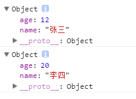
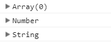
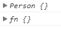
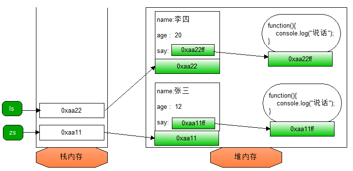
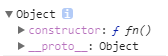
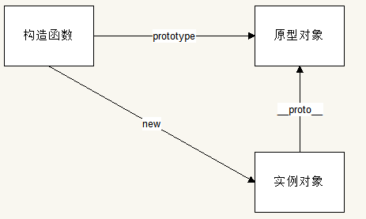
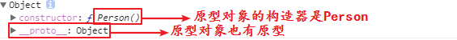
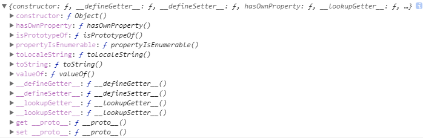
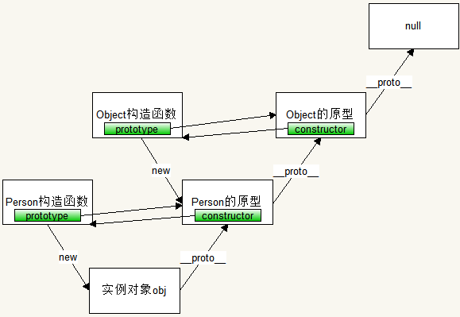

在学习今天内容之前，先看以下两种描述同一件事件的描述方式：

1. 下班回家，去做饭，做好了吃，吃完了饭去洗碗，然后去卫生间放热水，然后去洗澡。
2. 下班回家，保姆已经将饭做好了，只需要吃就好，吃完了保姆会洗碗的。然后去洗澡，保姆已经把热水放好了。

第一种，还处于奋斗状态的生活，任何事情都需要亲力亲为。

第二种，是功成名就的人的生活，任何事情都不需要自己做，找一个保姆来做即可。

第一种，就想我们之前写的效果，任何操作任何逻辑都是需要自己去写先执行什么，再执行什么。。。

学了面向对象之后，我们的效果，只需要让一个对象去做就好了。。。

以前在写效果的时候，都是通过分析逻辑，先做什么，再做什么，代码编写是按照顺序的，这种思维方式叫做面向过程思想。何谓面向，脸面朝向的意思，也就是关注的意思，即以前编程的思想是关注着过程。

今天要学习的面向对象，就是关注着对象的编程思想。

# 面向对象

### 概念

什么是面向对象？

OOP代表面向对象的英文单词的首拼，单词全拼是Object Oriented Programming。

面向对象不是一种语法，是一种编程的思想。

面向的意思就是“脸朝向”，表示关注的意思。那面向对象就是脸朝着对象，关注着对象的意思。

之前的编程模式：关注每一个元素，然后是他们的顺序，关系。。。这种编程的模式称之为面向过程。

之后的编程模式：找一个对象来做这件事情，等待结果即可。这就是面向对象。


js中的面向对象编程，就是<font color="red">**创建对象，给对象添加属性和方法**</font>

既然是要创造对象，让对象做自己的事情，首先就需要创建对象。

### 创建对象

直接创建：

```js
var obj = {}
```

这种创建也叫字面量的方式。字面量其实就是你一眼看到就能知道具体是什么是多少的值。比如变量x，你看到后不知道x是什么类型，是什么值，但是3你就知道这是个数字类型，值是3，那么3就是字面量。

构造函数方式创建：

```js
var obj = new Object();
```

Object是一个系统提供的构造函数，这个构造函数专门用来创建对象使用的。

给这样的对象添加属性和方法，语法：

```shell
对象.属性名 = 值;
对象.方法名 = 函数;
```

如下：保存多个人的信息，需要这样创建多次。

```js
var obj1 = new Object();
obj1.name = "张三";
obj1.age = 12;
obj1.sex = '男';

var obj2 = new Object();
obj2.name = '李四';
obj2.age = 13;
obj2.sex = '女';

var obj3 = new Object();
obj3.name = '王五';
obj3.age = 11;
boj3.sex = '女';
。。。
```

从上面的代码可以看出来，每次创建对象都是在重复动作

这时候，应该用函数来处理重复动作

### 工厂函数创建对象

定义一个函数，每次调用都能得到一个对象

```js
function createObj(name,age,sex){
    var obj = new Object();
    obj.name = name;
    obj.age = age;
    obj.sex = sex;
    return obj;
}
var obj1 = createObj("张三",12,"男");
var obj2 = createObj("李四",13,"女");
var obj3 = createObj("王五",11,"女");
```

这种调用就能创建对象的函数，叫做工厂函数。创建出来的每个对象的结构一致，如：电商网站中的商品对象。

练习：

```javascript
// 1. 学生对象
// name : 张三  age: 18岁 打招呼:大家好我是张三
// name : 李四  age: 19岁 打招呼:大家好我是李四

// 2. 老师对象
// name : 伟哥  爱好:篮球  打: 伟哥正在打篮球
// name : 马哥  爱好:台球  打: 马哥正在打台球
```

优点：可以同时创建多个对象

缺点：创建出来的没有具体的类型（比如是Array和Number），都是object类型的，但我们看到自己的对象只是object，不知道具体是什么类型。

代码：

```js
function factory(name,age){
    var obj = new Object();
    obj.naem = name;
    obj.age = age;
    return obj;
}
var zs = factory("张三",12);
var ls = factory("李四",20);
console.log(zs);
console.log(ls);
```

效果：

| 看不到具体类型的对象                      |
| ----------------------------------------- |
|  |

解决方案：自定义构造函数。其实相当于自己写一个函数，专门用来new对象。从之前接触过的Number、String构造函数来看，他们创建创建出来的对象能准确看出具体是什么类型的对象，他们都是通过构造函数创建出来的对象。我们自己创建出来的对象之所以都是Object，是因为我们创建对象的时候使用的是`new Object`，Object也是系统内置的一个构造函数。

代码：

```js
var arr = new Array();
var obj = new Number();
var str = new String();
console.log(arr);
console.log(obj);
console.log(str);
```

输出结果：

| 系统内置构造函数创建出来的对象            |
| ----------------------------------------- |
|  |

所以我们也要自定义一个构造函数，创建出来的对象也就能看出具体是什么类型的对象了。

例：

```js
function Person(){
   
}
var zs = new Person();
function fn(){

}
var ls = new fn();
console.log(zs);
console.log(ls);
```

输出结果：

| 使用构造函数创建出来的对象                |
| ----------------------------------------- |
|  |

### 自定义构造函数

```js
function Person(name,age,sex){
    this.name = name;
    this.age = age;
    this.sex = sex;
}
var obj1 = new Person("张三",12,"男");
var obj1 = new Person("李四",13,"女");
var obj1 = new Person("王五",11,"女");
```

这时候，我们会奇怪，因为函数并没有被对象调用，那this指的是谁？函数并没有返回值，得到的是什么？

构造函数和普通函数不同的地方在于使用new的时候，中间发生了很多看不见的过程：

1. 创建了一个新对象
2. this指向了这个新对象（新对象就有了属性，创建了属性）
3. 执行构造函数，也就是调用了这个函数（给对象添加属性和方法，给属性和方法赋值）
4. 返回这个新对象

使用new构造函数来创建对象的过程称之为<font color="red">**实例化**</font>

练习：

```javascript
// 1. 学生对象
// name : 张三  age: 18岁 打招呼:大家好我是张三
// name : 李四  age: 19岁 打招呼:大家好我是李四

// 2. 老师对象
// name : 伟哥  爱好:篮球  打: 伟哥正在打篮球
// name : 马哥  爱好:台球  打: 马哥正在打台球

// 3. 英雄对象  (构造函数)
// name : 马哥  学习 : 马哥正在学前端
```

**构造函数注意事项：**

1. 构造函数天生就是用来创建对象的，所以必须和new配合使用，否则就不具备创建对象的能力
2. 构造函数内部不能有return关键字，因为构造函数会自动返回对象。如果返回基本数据类型，和不加效果一样，如果返回复杂数据类型，构造函数就没意义了。
3. 如果new的时候，不需要参数，那么小括号可以省略
4. 人们通常将构造函数的首字母大写

此时的构造函数有个缺点：

一个构造函数中给对象添加了一个方法，然后创建了两个对象，这两个对象都有这个方法，并且这两个方法一模一样，但是这个方法在内存中却是两个空间，这样对于内存空间来说有点浪费，因为两个对象的方法是一样的但是却占了两个空间。

```js
function Person(name){
	this.name = name;
    this.say=function(){
        console.log("说话");
    }
}
var obj1 = new Person("张三");
var obj2 = new Person("李四");
console.log(obj1.say == obj2.say); // false  表示这是两个空间
```

存储对象方法的具体过程如下图：

| 对象方法存储示意图                        |
| ----------------------------------------- |
|  |

如果将方法定义在对象外面，可以解决这个问题。

```js
function Person(name,age){		
	this.name = name;
	this.age = age;
	this.sayHi = fn;
}
function fn(){
	console.log("我是" + this.name + "，今年" + this.age + "岁");
}
var zs = new Person("张三",12);
var ls = new Person("李四",13);
```

但是在后期我们使用插件或者定义别的函数的时候有可能会造成覆盖的现象。所以这个解决方案解决不彻底。

使用原型可以完美解决这个问题。

### 原型

概念：<font color="red">**任何函数在创建好的时候，浏览器会分配一个对象给这个函数，通过函数的prototype可以访问到这个对象。这个对象叫做原型对象，简称原型。通过new构造函数实例化出来的对象默认可以访问到这个对象的属性和方法。**</font>

```js
function fn(){}
console.log(fn.prototype);
```

访问结果：

| 原型                                      |
| ----------------------------------------- |
|  |

给这个原型添加属性和方法，使用实例对象可以访问到。

```js
function Person(){
    
}
Person.prototype.name = '赵六';
Person.prototype.say=function(){
	console.log("说话");
}
var obj = new Person();
console.log(obj); // 赵六
obj.say(); // 说话
```

<font color="red">对象访问属性的时候，先找自己有没有，自己有就直接使用，自己没有就去原型对象上找。</font>

再来观察一个现象：

```js
function Person(){
    
}
Person.prototype.name = '赵六';
Person.prototype.say=function(){
	console.log("说话");
}
var obj1 = new Person();
var obj2 = new Person();
console.log(obj1.say == obj2.say); // true 表示这是同一个内存空间，因为两个对象访问的这个方法是Person这个函数对应的原型对象上的方法，两个对象用的是同一个构造函数Person，所以是相等。这样就能解决上面构造函数的问题了
```

我们以后创建对象就使用构造函数，多个对象要使用同一个方法或属性，就把这个属性或方法绑定到原型上。

实例对象想访问到原型对象，可以使用`__proto__`属性。

<font color="red">**任何对象都有一个属性叫做`__proto__` 这个属性可以访问到对应的构造函数的原型对象，也就是构造函数的`prototype`属性的值**</font>

构造函数、实例对象、原型对象三者之间的关系如下图：

| 实例原型构造函数的关系                    |
| ----------------------------------------- |
|  |

### 面向对象版Tab

```html
<!DOCTYPE html>
<html lang="en">
<head>
<meta charset="UTF-8">
<title>Document</title>
</head>
<style>
    .box{
        height:430px;
        width:500px;
        border:1px solid #000;
        overflow:hidden;
        cursor:pointer;
    }
    .box ul,.box ol{
        list-style: none;
        padding: 0;
        margin: 0;
        width:500px;
    }
    .box ul{
        height:30px;
        background:#ccc;
        line-height: 30px;
        display:flex;
        justify-content: space-evenly;
        color:#fff;
    }
    .box ul li{
        float:left;
        width:150px;
        background:#0f0;
        text-align:center;
    }   
    .box ol{
        height:400px;
    }
    .box ol li{
        display:none;
    }
    .box ol li.current{
        display:block;
    }
    .box ol li img{
        width:500px;
        height: 400px;
    }
    .box ul li.current{
        background:#999;
        display:block;
    }
</style>
<body>
<div class="box">
    <ul>
        <li class="current">绿色</li>
        <li>粉色</li>
        <li>蓝色</li>
    </ul>
    <ol>
        <li class="current"></li>
        <li></li>
        <li></li>
    </ol>
</div>
</body>
<script type="text/javascript">
function Tab(className){
    var box = document.querySelector("."+className);
    this.ulis = box.querySelectorAll(".box ul li");
    this.olis = box.querySelectorAll(".box ol li");
    for(var i=0;i<this.ulis.length;i++){
        this.ulis[i].index = i;
        var ele = this;
        this.ulis[i].onclick=function(){
            ele.toggle(this);
        }
    }
}
Tab.prototype.toggle=function(ele){
    for(var i=0;i<this.ulis.length;i++){
        this.ulis[i].className = '';
        this.olis[i].className = '';
    }
    ele.className = 'current';
    this.olis[ele.index].className = 'current';
}
var TabBox = new Tab("box");
</script>
</html>
```

### 构造器

每一个原型对象天生带有一个属性叫做`constructor`，这个属性指的是这个原型对象所属的构造函数。

```js
function Person(){
    
}
var obj1 = new Person();
console.log(obj1.__proto__.constructor === Person); // true  
console.log(obj1.constructor === Person); // true  obj1对象中没有constructor属性，所以去原型对象上找
```

### 原型链

对象访问属性的时候，如果自己么有，就去原型对象上找，找到了访问。那如果找不到怎么办？

对象天生就有一个属性叫做`__proto__`，那么，原型对象也是对象，他也有这个属性，也就是说，原型对象也有原型自己的构造函数和原型对象。

```js
function Person(){
	
}
var obj = new Person(); // 通过构造函数创建了对象obj
var proto = obj.__proto__; // 通过实例对象访问到原型对象
console.log(proto);
```

访问结果：

| 原型对象                                  |
| ----------------------------------------- |
|  |

继续访问原型对象的原型：

```js
function Person(){
	
}
var obj = new Person(); // 通过构造函数创建了对象obj
var proto = obj.__proto__; // 通过实例对象访问到原型对象
var proto1 = proto.__proto__; // 访问原型对象的元素
console.log(proto1);
```

访问结果：

| 原型对象的原型                            |
| ----------------------------------------- |
|  |

其实这个对象，就是Object构造函数的原型对象。

这也是个对象，他的原型是什么？

```js
function Person(){
	
}
var obj = new Person(); // 通过构造函数创建了对象obj
var proto = obj.__proto__; // 通过实例对象访问到原型对象
var proto1 = proto.__proto__; // 访问原型对象的元素
var proto2 = proto1.__proto__; // 访问Object的原型对象的原型
console.log(proto2); // null
```

最后访问到null，也就是说到头了，这是最顶级的对象。

通过一张图来将上面几个对象的关系画出来：

| 原型链                                    |
| ----------------------------------------- |
|  |

这样向上的一条链式结构，我们称之为原型链。

对象查找属性的规则：

​	先在自己身上找,如果有,直接使用,如果没有,顺着原型链往上找,找到了就使用,找不到就继续往上找,如果找到了null,都没有的话,就返回undefined;

但是<font color="red">**对象属性赋值和原型没关系，有就修改，没有就增加。**</font>

作业：使用面向对象将轮播图封装。