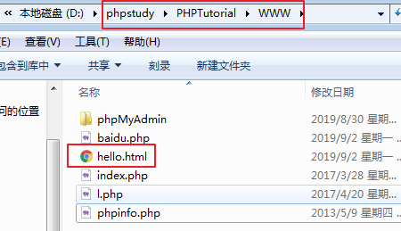

# PHP

为什么要学习PHP？因为网页中的数据不能持久，但是数据库的数据能持久。前端不能操作数据库，后端语言可以。PHP在网页应用中很广泛，所以我们要学习PHP。

我们前端攻城狮对php学习的要求：能看懂PHP代码就ok。

## 服务器介绍

### 网页访问过程

我们访问一个网站的时候，输入网址，出现页面，中间的过程经历了什么？

| 请求过程                                  |
| ----------------------------------------- |
|  |

之前写好一个文件，直接在浏览器打开，并没有经历服务器返回。因为我们写的是客户端的文件。

访问过服务器的标志：访问的时候要有协议（http）。

### 服务端

以前写好的页面，页面上也有数据，页面上的数据经过操作（增删改查），会在页面中发生变化。但是只要一刷新页面，就会恢复原样，数据并不能持久。因为本身数据是写死的。所以，之前的页面叫做静态页面。

让页面中的数据能持久，需要访问服务器，让服务器对数据做支持。直白的说，就是需要操作数据库。

数据库唯一的功能就是提供数据。要操作数据库，需要使用服务器端的语言。js并不能操作数据库。所以今天要学习的PHP就是一门服务器端语言。

服务器端语言需要写在服务器上才能使用，不能直接用浏览器打开。服务器其实就是一台电脑，给我们提供服务的，一般访问网页的服务叫做http服务。一般情况，一个服务对应一个软件。

### 程序员工作流程

用户 => 前端 => 后端 => 数据库

- 用户向前端人员要一个网页
- 前端人员准备一个网页给用户，但是网页中的数据是找后端人员要的
- 后端人员接受到前端人员要数据以后，去数据库里面找到对应的数据，给到前端人员
- 前端人员拿到数据以后渲染在页面上
- 最后把这个页面给到用户看

例：

用户登陆一个网站

- 当用户书写完表单内容以后，点击提交按钮的时候
- 前端人员拿到用户填写的内容，把数据整合好传送给后端人员
- 后端人员接收到数据以后，去数据库中进行比对，看看有没有对应的数据
- 然后告诉前端人员，你给我的用户名和密码是否正确
- 前端把信息反馈给客户看到
  - 如果正确就是跳转页面
  - 如果不正确提示用户名或者密码有问题

### 服务器的访问细节

url：表示我们访问服务器的地址

url的组成部分：

- 传输协议：http https
- 域名：www.baidu.com
- 端口号：80 443

协议：规定用户和服务器交互的规则和方式，常见的有http，https，ftp，sftp，tcp。。。

域名：本来访问服务器都需要ip地址，但是ip地址不方便记忆，万维网就将每个ip都设置一个英文名字

端口号：服务器上只有一个文件夹，里面有256个文件夹，每个文件夹里面又有256个文件夹，共65536个文件，通过0~65535作为入口访问。

## PHP

### 环境

能提供http服务的软件有很多，Tomcat、Apache、nginx等等。服务器上还需要一个数据库，数据库的种类也有很多，最常用的是mysql数据库。服务器要运行php代码，还需要php编译器。这就是一台服务器要运行起来的条件。

| 服务器示例                                |
| ----------------------------------------- |
|  |

在自己电脑上也可以使用一个软件来模拟服务器，网上提供了很多这样的软件，我们选用phpstudy。这个软件中集成了Apache服务器、MySql数据库和PHP编译器。

每个服务要运行起来，都需要开启服务。Apache和MySql都需要开启。php编译器不需要，因为他不是一个服务。

phpstudy安装的时候，安装路径不能有中文汉字和空格字符。

自己访问自己：localhost(127.0.0.1) -- 代表WWW文件夹 - /文件夹/文件

| localhost/hello.html                      |
| ----------------------------------------- |
|  |


使用注意事项：

1. 使用http访问文件，都要放在WWW的文件夹中
2. 提前开启phpstudy
3. 文件名和文件夹名不允许出现空格和中文
4. 访问文件，必须使用域名或者ip地址


### 基本语法

文件后缀是php，其中的代码放在一个结构中：`<?php `开头 ，`?>`结尾，每行结束必须有`;`

#### 输出方式

```php
echo 1; // 文本方式输出，输出基本类型
$arr = [1,2,3];
var_dump($arr); // 基本类型和复杂类型都能输出
```

注释和js中使用一致。

#### 变量

使用$来定义变量

```php
$a = 10;
```

php中的基本数据类型：

- 整型
- 浮点型
- 布尔型
- 字符串

还有数组和null。

运算符和js中一致，字符串拼接使用`.`

#### 条件语句

和js中的用法一致。

#### 循环语句

和js中的用法一致。

没有for in的语法。

```php
foreach($arr as $k=>$v){
    // 专门用来遍历关联数组的方法
}
```

#### 数组

创建数组两种方式。

```php
$arr = [1,2,3];
$arr = array(1,2,3); // 索引数组
```

数组类型有两种：

```php
$arr = [1,2,3]; // 索引数组
$arr = ["name"=>"张三","age"=>20]; // 关联数组，理解为js中的对象
```

前端和PHP进行交互的时候，大多数据用的都是数组，但是数组直接传送，需要转换为字符串。

PHP将数组转为字符串：

```php
json_encode(PHP数组);
```

PHP将json字符串转为数组：

```php
json_decode(json字符串);
```


### 数据库

存储的数据，存到了本地磁盘。

#### 简介

mysql/sqlserver/oracle。。。

MySQL 是最流行的<font color="red">关系型数据库</font>管理系统。

非关系型数据库：mongleDb，redis等。每个数据之间没有关系。都存在内存缓存中。

数据库就是用来存储数据的，结构类似于excel表格。

组成部分：库、表、字段、数据

```
* 关系数据库管理系统(Relational Database Management System)的特点
	* 数据以表格的形式出现
	* 每行为各种记录名称
	* 许多的行和列组成一张表单
	* 若干的表单组成database
* 主键：主键是唯一的。一个数据表中只能包含一个主键。你可以使用主键来查询数据。
```

#### 数据类型

```
* 数值类型

| 类型 | 大小 | 用途 |
| ------ | ------ | ------ |
| TINYINT | 1 字节 | 小整数值 |     -127~127   unsign   0~255
| SMALLINT | 2 字节 | 大整数值 |
| MEDIUMINT | 3 字节 | 大整数值 |
| INT或INTEGER | 4 字节 | 大整数值 |   10位数  
| BIGINT | 8 字节 | 极大整数值 |     
| FLOAT | 4 字节 | 单精度 浮点数值 |
| DOUBLE | 8 字节 | 双精度 浮点数值 |
| DECIMAL |  | 小数值 |

* 日期和时间类型

| 类型 | 格式 | 用途 |
| ------ | ------ | ------ |
| DATE | YYYY-MM-DD | 日期值 |
| TIME | HH:MM:SS | 时间值或持续时间 |
| YEAR | YYYY | 年份值 |
| DATETIME | YYYY-MM-DD HH:MM:SS | 混合日期和时间值 |
| TIMESTAMP | YYYYMMDD HHMMSS | 时间戳 |

* 字符串类型

| 类型 | 大小 | 用途 |
| ------ | ------ | ------ |
| CHAR | 0-255字节 | 定长字符串 |
| VARCHAR | 0-65535 字节 | 变长字符串 |
# char 和 varchar
varchar节省空间 - 根据实际数据的长度占用空开关键
char定长的空间，不管数据有多长，占用的空间都是固定的
| TINYBLOB | 0-255字节 | 不超过 255 个字符的二进制字符串 |
| TINYTEXT | 0-255字节 | 短文本字符串 |
| BLOB | 0-65 535字节 | 二进制形式的长文本数据 |
| TEXT | 0-65 535字节 | 长文本数据 |
| MEDIUMBLOB | 0-16 777 215字节 | 二进制形式的中等长度文本数据 |
| MEDIUMTEXT | 0-16 777 215字节 | 中等长度文本数据 |
| LONGBLOB | 0-4 294 967 295字节 | 二进制形式的极大文本数据 |
| LONGTEXT | 0-4 294 967 295字节 | 极大文本数据 |
```

#### 数据库操作

增：

```shell
insert [into] 表名(字段1，字段2，。。。) values(值1，值2，。。。)[,(值1，值2，。。。)];
```

如果是所有字段可以将字段列表省略。

为了避免关键字，在字段名称和表名上面加反引号。

删：

```shell
delete from 表名 [条件];
```

改：

```shell
update 表名 set 字段=值[,字段=值] [条件];
```

可以在值中使用字段。

查：

```shell
# 查所有
select * from 表名;
# 按字段查
select 字段1[,字段2] from 表名;
# 按条件查
select * from 表名 where 条件;
# 分页查
select * from 表名 limit 开始条数,显示条数;
# 排序查
select * from 表名 order by 字段;
# 模糊查
select * from 表名 字段 like '%值%';
```

条件：

```shell
# 等于 
字段=值
# 不等于 
字段!=值
# 大于
字段>值
# 小于
字段<值
# 之间 
字段 between 开始值 and 结尾值
```

Navicat 数据库操作

步骤：

1. 创建连接
2. 打开数据库
3. 操作表

### PHP操作数据库

PHP连接数据库

```php
// 创建连接
$con = mysqli_connect(主机名,用户名,密码,数据库名); // 返回连接信息
// 执行语句
$res = mysqli_query(连接信息，sql语句); // 返回查询的表里的信息
// 从结果中将数据取出来
$arr = [];
while($row = mysqli_fetch_assoc($res)){
    $arr[] = $row;
}
```


作业：完成登录