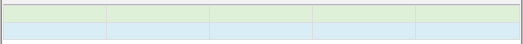

## bootstrap

bootstrap是一个前端框架。在这个框架中别人已经将很多样式写好了，我们只需要拿标签选择使用类型即可。

使用步骤：

下载：https://v3.bootcss.com/

引入包：`<link rel="stylesheet" href="bootstrap.css"`

使用：写标签，加类名

初体验：

按钮

```html
<span class="btn btn-primary btn-sm">按钮</span>
<a href="javascript:;" class="btn btn-danger btn-md">按钮</a>
<div class="btn btn-warning btn-lg">按钮</div>
```

显示效果：

| 按钮效果                                  |
| ----------------------------------------- |
|  |

表格

```html
<table class="table table-bordered">
    <tr class="success">
        <td></td>
        <td></td>
        <td></td>
        <td></td>
        <td></td>
    </tr>
    <tr class="info">
        <td></td>
        <td></td>
        <td></td>
        <td></td>
        <td></td>
    </tr>
</table>
```

访问效果：

| 响应式表格                                |
| ----------------------------------------- |
|  |

字体图标

```html
<span class="glyphicon glyphicon-heart"></span>
<i class="glyphicon glyphicon-refresh"></i>
```

访问效果：

| 字体图标                                  |
| ----------------------------------------- |
|  |

bootstrap栅格布局：

> container类名：响应式容器 - 版心 - 会随着屏幕大小的改变而改变 - 左右各有padding:15px;
>
> row类名：表示行，可以让容器的文件靠左对齐，左右各有margin:-15px;
>
> col类名：表示列，表示在什么样的屏幕下占据父元素宽度的12分支几
>
> ​	col-lg-数字
>
> ​	col-md-数字
>
> ​	col-sm-数字
>
> ​	col-sx-数字

## 案例

bootstrap+ajax+php+mysql


