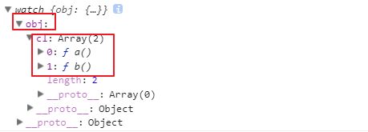
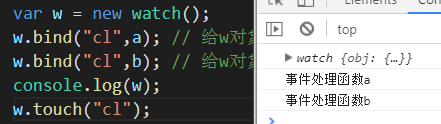
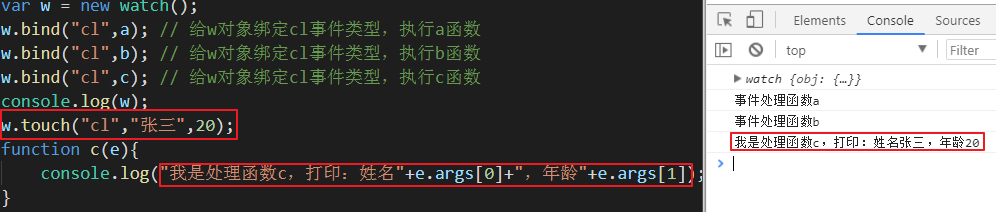
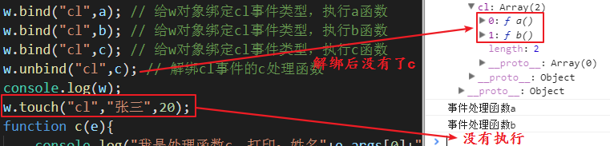

## 设计模式

### 概念

设计模式是为了解决某种问题，而设计的一套最佳解决方案。

常见的设计模式：

- 单例模式
- 组合模式
- 观察者模式
- 命令模式
- 代理模式
- 工厂模式
- 策略模式
- 适配器模式
- 。。。

### 单例模式

让一个类创建出来的所有对象，里面的所有属性和方法都一模一样。比如封装一个类，将一些常用的操作函数作为方法放进去，以后每次都使用同一个对象来调用这些方法

正常情况，一个类创建出来的每个对象都是不一样的。

```js
class Carousel{
    
}
var a = new Carousel();
var b = new Carousel();
console.log(a === b); // false
```

单例模式就是让这两个对象是一样的，也就是说，一个类永远只有一个实例对象

```js
var single = (function(){
    class Carousel{
       
    }
    var res = undefined;
    return function(){
        if(!res){
           res = new Carousel();
        }
        return res;
    }
})();
var s1 = single();
var s2 = single();
console.log(s1 === s2); // true
```

单例模式的应用场景在封装工具库。

例：封装封装一个工具库

```js
(function(){
    class Tool{
        constructor(){
            if(window.getComputedStyle){
                this.onOff = true;
            }else{
                this.onOff = false;
            }
        }
        // 获取元素样式
        getStyle(ele,attr){
            if(this.onOff){
                return window.getComputedStyle(ele)[attr];
            }else{
                return ele.currentStyle[attr];
            }
        }
        // 给元素设置样式
        setStyle(ele,styleObj){
            for(var attr in styleObj){
                ele.style[attr] = styleObj[attr];
            }
        }
        // 生成一个范围内的随机数
        getRandom(a,b){
            var max = a;
            var min = b;
            if(min>max){
                max = b;
                min = a;
            }
            return Math.floor(Math.random()*(max-min))+min
        }
        // 生成一个随机颜色值
        getColor(){
            return `rgb(${this.getRandom(0,255)},${this.getRandom(0,255)},${this.getRandom(0,255)})`;
        }
        // 获取cookie
        getCookie(key){
            var cookies = document.cookie;
            var arr = cookies.split("; ");
            var length = arr.length;
            for(var i=0;i<length;i++){
                if(arr[i].indexOf(key) != -1){
                    return arr[i].split("=")[1];
                }
            }
        }
        // 设置cookie
        setCookie(key,value,second){
            var date = new Date();
            date.setTime(date.getTime()-8*3600*1000+second*1000);
            document.cookie = `${key}=${value};expires=${date};path=/`;
        }
        // 删除cookie
        removeCookie(key){
            this.setCookie(key,"",-1);
        }
        // 运动函数
        sport(ele,obj,cb){
            let timerObj = {};
            for(let attr in obj){ 
                let target = obj[attr]; 
                let currentStyle = window.getComputedStyle(ele)[attr]; 
                if(attr == 'opacity'){
                    currentStyle = parseFloat(currentStyle)*100;
                    target = target * 100;
                }else{
                    currentStyle = parseInt(currentStyle);
                }
                timerObj[attr] = setInterval(function(){
                    let percent = (target - currentStyle)/10;
                    if(percent>0){
                        percent = Math.ceil(percent);
                    }else{
                        percent = Math.floor(percent); 
                    }
                    currentStyle += percent;
                    if(currentStyle == target){
                        clearInterval(timerObj[attr]);
                        delete timerObj[attr];
                        let k=0;
                        for(let i in timerObj){
                            k++;
                        }
                        if(k==0){
                            console.log("运动结束了");
                            cb();
                        }
                    }else{
                        if(attr == 'opacity'){
                            box.style[attr] = currentStyle/100;
                        }else{
                            box.style[attr] = currentStyle + 'px';
                        }
                    }
                },20);
            }
        }
        // 发送ajax
        sendAjax(obj){
            obj.method = obj.method || "get";
            if(Object.prototype.toString.call(obj.method) != "[object String]"){
                throw new Error("请求方式method的值不正确，请输入正确的ajax请求方式");
            }
            if(obj.url == undefined){
                throw new Error("请求地址url不能为空！");
            }
            if(obj.async === undefined){
                obj.async = true;
            }
            if(Object.prototype.toString.call(obj.async) != "[object Boolean]"){
                throw new Error("是否异步async的值不正确，请输入正确的布尔值！");
            }
            if(obj.data != undefined){
                if(Object.prototype.toString.call(obj.data) == "[object Object]"){
                    var params = '';
                    var f = '';
                    for(var attr in obj.data){
                        params += f+attr+"="+obj.data[attr];
                        f = '&';
                    }
                }else{
                    params = obj.data; // name=张三&age=20
                }
                if(obj.method == "get"){
                    obj.url += "?"+params;
                }
            }
            if(obj.success == undefined){
                obj.success=function(res){}
            }
            if(obj.error == undefined){
                obj.error=function(){}
            }
            var ajax = new XMLHttpRequest();
            ajax.open(obj.method,obj.url,obj.async);
            ajax.onreadystatechange=function(){
                if(ajax.readyState==4){
                    if(ajax.status>=200 && ajax.status<300){
                        var res;
                        switch(obj.dataType){
                            case undefined:
                            case "json":
                                res = ajax.responseText;
                                res = JSON.parse(res);
                            break;
                            case "xml":
                                res = ajax.responseXML;
                            break;
                            case "string":
                                res = ajax.responseText;
                            break;
                            default:
                                throw new Error("需要返回的数据类型的参数dataType不正确，请在['json','string','xml']中选择一个");
                            break;
                        }
                        obj.success(res);
                    }else{
                        obj.error();
                    }
                }
            }
            if(obj.method == "post"){
                ajax.setRequestHeader("content-type","application/x-www-form-urlencoded");
                if(obj.data == undefined){
                    ajax.send();
                }else{
                    ajax.send(params);
                }
                return;
            }
            ajax.send();
        }
        // 发送promise
        Pajax(obj){
            var _this = this;
            return new Promise(function(resolve,reject){
                _this.sendAjax({
                    method:obj.method,
                    url:obj.url,
                    async:obj.async,
                    data:obj.data,
                    dataType:obj.dataType,
                    success:function(res){
                        resolve(res);
                    },
                    error:function(){
                        reject();
                    }
                });
            })
        }
        // 数组去重复
        noprepeat(arr){
            var newArr = [arr[0]];
            for(var i=1;i<arr.length;i++){
                var onOff = true;
                for(var j=0;j<newArr.length;j++){
                    if(newArr[j] == arr[i]){
                        onOff = false;
                        break;
                    }
                }
                if(onOff){
                    newArr.push(arr[i]);
                }
            }
            return newArr;
        }
    }
    var obj;
    var tool = (function(){
        if(!obj){
            obj = new Tool();
        }
        return obj;
    })()
    window.Tool = window.tool = tool;
})();
```


### 组合模式

组合模式就是制作启动器。多个类在实例化以后，执行起来使用一个同名的方法来启动，这时候可以做一个启动器，让多个类一起启动。

```js
class Carousel{
    init(){
        console.log("轮播图开始运行");
    }
}
class Tab{
    init(){
        console.log("选项卡开始运行");
    }
}
class Enlarge{
    init(){
		console.log("放大镜开始运行");
    }
}
// 这3个类要运行起来需要各自实例化，并调用每个类中的init方法，此时就可以使用组合模式做一个启动器
```

组合模式制作启动器：

```js
class Starter{
    constructor(){
		this.arr = []; // 定义一个数组
    }
    add(className){
        this.arr.push(className); // 将这个多个类放进数组
    }
    run(){
        for(var i=0;i<this.arr.length;i++){
            arr[i].init(); // 让数组中的每个类都调用init方法
        }
    }
}
var starts = new Starter();
starts.add(new Carousel);
starts.add(new Tab);
starts.add(new Enlarge);
starts.run();
```


### 观察者模式

观察者模式，又称发布-订阅模式。意思是让一个人不停的监控某件某件东西，当这个东西要发生某种行为的时候，这个人就通知一个函数执行这个行为的操作。

例：当事件的代码写好以后，其实这个事件就不停的监控用户在页面中的行为，一旦用户触发这个事件的时候，就调用函数处理这个事件。

```js
div.addEventListener("click",function(){});
// 这个事件写好以后，就一直在页面中监控用户行为，用户点击这个元素的时候，就调用函数
```

观察者模式就是类似的操作，写观察者模式的目的，是为了给一个非元素的数据绑定一个自定义事件。

例：给一个obj绑定一个abc的事件

分析：

给一个元素绑定事件，有绑定方法，有触发条件，有取消绑定。

要给一个对象绑定一个自定义事件。那么这个事件如何绑定，如何触发，如何解绑这个事件。

所以：

- 需要一个方法处理事件的绑定。
- 需要一个方法处理如何触发这个事件。
- 需要一个方法处理如何解绑这个事件。

元素的事件，一个事件类型可以绑定多个处理函数。

对象的自定义事件如何让一个事件类型绑定多个函数。

所以：

需要一个空间，存储事件类型对应的处理函数们。

#### 雏形：

```js
class watch{
    bind(){
        
    }
    touch(){
        
    }
    unbind(){
        
    }
}
var w = new watch();
```

此时，如要给这个对象绑定事件和处理函数的话，需要事件类型和处理函数作为参数，所以调用时要传入实参

```js
var w = new watch();
w.bind("cl",a); // 给w对象绑定cl事件类型，执行a函数
w.bind("cl",b); // 给w对象绑定cl事件类型，执行b函数
function a(){
    console.log("事件处理函数a");
}
function b(){
    console.log("事件处理函数b");
}
```

#### 绑定

在bind方法中接收参数，并将事件类型和处理函数对应存储起来：

```js
constructor(){
    this.obj = {} // 存储格式：{事件类型：[函数1,函数2]}
}
bind(type,handle){
    this.obj[type] = [handle]; // 对象存储方式{"cl":[a]}
}
```

如果给这个事件再绑定一个函数b的话，会将原来的a覆盖掉，所以，应该先判断，如果对应的这个数组中没有数据就直接放进去，如果有了就应该追加

```js
bind(type,handle){
    if(!this.obj[type]){
        this.obj[type] = [handle]; // 对象存储方式{"cl":[a]}
    }else{
        this.obj[type].push(handle);
    }  
}
```

打印w对象的结果：

| 绑定后的存储结果                          |
| ----------------------------------------- |
|  |

#### 触发

触发这个事件需要传入触发哪个事件类型

```js
touch(type){
    // 首先要判断，这个事件类型是否绑定，没有绑定不能触发
    if(!this.obj[type]){
        return false;
    }else{
        // 将这个事件的所有绑定的处理函数一起调用
        for(var i=0;i<this.obj[type].length;i++){
            this.obj[type][i]();
        }
    }
}
```

测试：

| 触发测试                                  |
| ----------------------------------------- |
|  |

这两个处理函数都没有参数，如果要传入参数的时候该怎么处理？

触发事件的时候就要传入实参

```js
w.touch("cl","张三",20);
```

触发事件的方法就应该处理这些参数

```js
touch(type,...arr){ // 因为参数不定长，所以使用合并运算符
    // 首先要判断，这个事件类型是否绑定，没有绑定不能触发
    if(!this.obj[type]){
        return false;
    }else{
        // 处理参数：模拟系统事件的参数事件对象，将所有参数都集中在一个对象中
        var e = {
            type:type,
            args:arr
        }
        // 将这个事件的所有绑定的处理函数一起调用
        for(var i=0;i<this.obj[type].length;i++){
            this.obj[type][i](e);
        }
    }
}
```

添加一个带参数的处理函数，并触发事件执行：

```js
w.bind("cl",c); // 给w对象绑定cl事件类型，执行c函数
w.touch("cl","张三",20);
function c(e){
    console.log("我是处理函数c，打印：姓名"+e.name+"，年龄"+e.age);
}
```

结果：

| 带参数的处理函数处理结果                  |
| ----------------------------------------- |
|  |

#### 解绑

解绑也需要知道解绑的事件类型和处理函数

```js
unbind(type,handle){
    // 先判断是否绑定了这个事件
    if(!this.obj[type]){
        return false;
    }else{
        // 从数组中将这个处理函数删除
        for(var i=0;i<this.obj[type].length;i++){
            if(this.obj[type][i] === type){
                this.obj[type].splice(i,1);
                i--; // 放置数组塌陷
            }
        }
    }
}
```

解绑测试：

| 解绑测试结果                              |
| ----------------------------------------- |
|  |

如果绑定事件的时候使用的匿名函数，就无法进行解绑了，所以再添加一个解绑事件所有处理函数的方法：

```js
clear(type){
    if(!this.obj[type]){
        return false;
    }else{
        // 直接从对象中将这个属性删除
        delete this.obj[type];
    } 
}
```

### 数组塌陷

例：删除数组中的所有元素

```js
var arr = [1,2,3,4,5];
for(var i=0;i<arr.length;i++){
    arr.splice(i,1);
}
console.log(arr); // [2,4]
```

上面的代码没能将数组中的元素都删掉，原因是：第一次删除第一个元素以后，数组的长度剩下了4，且第二个元素的下标变成了0，当i++以后，变成1，删除的是当前这个数组中的第二个元素，也就是原来的数组中的第三个元素，但是第二个元素没有被删除，所以就这样剩下了2和4。这种现象就叫做数组塌陷。

解决方法：

1.倒着删

```js
for(var i=arr.length-1;i>=0;i--){
    arr.splice(i,1);	
}
```

2.让变量不递增

```js
for(var i=0;i<arr.length;i++){
    arr.splice(i,1);
    i--;
}
```

3.每次删除第一个元素

```js
var length = arr.length;
for(var i=0;i<length;i++){
    arr.splice(0,1);
}
```

4.使用while循环删

```js
while(arr.legnth>0){
      arr.splice(0,1);
}
```

### 数据劫持

```html
<body>
<div></div>
</body>
<script type="text/javascript">
function edit(val){
    document.querySelector("div").innerText = val;
}
var obj = {
    name:"张三",
    age:12
}
edit(obj.age);
Object.defineProperty(obj,"age",{
    configurable:true, // 允许配置
    get(){ // 设置值
        return 18;
    },
    set(val){ // 值发生改变的时候要做的事情
        console.log("正在将obj的age属性修改为"+val);
        edit(val);
    }
});
obj.age = 20;
console.log(obj);
</script>
```


