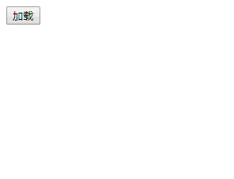
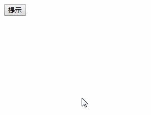

## JQ高级

### jquery发送ajax请求

#### get请求

语法：

```js
$.get('请求地址', 参数, 成功的回调函数, 'json');
参数1：请求地址
参数2：请求携带的数据，可以是拼接的字符串形式，也可以是对象形式
参数3：成功的回调函数，参数为响应回来的的数据
参数4：希望返回的数据格式
```

例：

```js
$.get("get.php",{id:1},function(res){console.log(res);},"json");
```

#### post请求

语法：

```js
$.post('请求地址', 参数, 成功的回调函数, 'json');
参数1：请求地址
参数2：请求携带的数据，可以是拼接的字符串形式，也可以是对象形式
参数3：成功的回调函数，参数为响应回来的的数据
参数4：希望返回的数据格式
```

例：

```js
$.post("post.php",{id:1},function(res){console.log(res);},"json");
```

#### ajax请求

语法：

```js
$.ajax({
    url: 请求地址,   // 必填，请求的地址
    type: 请求方式,   // 选填，请求方式，默认是 GET（忽略大小写）
    data: {},   // 选填，发送请求是携带的参数
    dataType: 'json',   // 选填，期望返回值的数据类型，默认是 string
    async: true,   // 选填，是否异步，默认是 true
    success () {},   // 选填，成功的回调函数
    error () {},   // 选填，失败的回调函数，参数有xhr，是ajax对象，status状态，err错误信息
    cache: true,   // 选填，是否缓存，默认是 true
    timeout: 1000,   // 选填，超时时间，单位毫秒
    context: div,   // 选填，回调函数中的 this 指向，默认是 ajax 对象
})
```

例：

```js
$.ajax({
    type:"post",
    url:"ajax.php",
    dataType:"json",
    success:function(res){
        console.log(res);
    }
});
```

#### jsonp请求

语法：

```js
$.ajax({
    url: 请求地址,
    dataType: 'jsonp',
    data: { name: 'Jack', age: 18 },
    success (res) {
        console.log(res)
    },
    jsonp: 'cb',  // jsonp 请求的时候回调函数的 key
    jsonpCallback: 'fn'   // jsonp 请求的时候回调函数的名称
})
```

#### 全局ajax函数

全局ajax函数指的ajax的钩子函数。钩子函数指的是一件事情执行到某个阶段的时候自动调用的函数。

第一个请求在开始的时候就会触发这个函数：

```js
$(window).ajaxStart(function () {
    console.log('有一个请求开始了')
})
```

任意一个请求在 准备 send 之前 会触发这个函数：

```js
$(window).ajaxSend(function () {
    console.log('有一个要发送出去了')
})
```

任意一个请求在 成功 的时候就会触发这个函数：

```js
$(window).ajaxSuccess(function () {
    console.log('有一个请求成功了')
})
```

任意一个请求在 失败 的时候就会触发这个函数：

```js
$(window).ajaxError(function () {
    console.log('有一个请求失败了')
})
```

任意一个请求在 完成 的时候就会触发这个函数：

```js
$(window).ajaxComplete(function () {
    console.log('有一个请求完成了')
})
```

任意一个请求在 结束 的时候就会触发这个函数：

```js
$(window).ajaxStop(function () {
    console.log('有一个请求结束了')
})
```

### jquery的标识符

jquery的开头都是$获取时jQuery。如果在页面引入别人的插件，别人的插件写的也是要用$或jQuery开头的，那么会和引入的jquery产生冲突。jquery早已预料到了这种情况，所以jquery可以将$或jQuery的使用权交出，或换成其他的操作符。

```js
jQuery.noConflict()； // 交出了$使用权，$符号不能使用了，只能使用jQuery
jQuery.noConflict(true)； // 交出了$和jQuery的使用权，$符号和jQuery都不能使用了
var 变量 = jQuery.noConflict(true); // 使用自定义的变量代替$和jQuery
```

### jquery扩展

jquery总共提供了两类方法，一类是元素集合调用，一类是自己调用：

```js
$("div").css();
$.get();
```

jquery提供的方法在情况下，会写的很复杂，所以提供了一个插件机制，可以向jquery中扩展自己的方法。

向元素集合扩展方法：

```js
jQuery.fn.extend({
    fn:function(){
        console.log(123);
    }
})
// 参数是一个对象，对象中的方法是对每个元素集合扩展的方法
```

这样写好以后，就可以使用元素集合调用这个方法了：

```js
$("div").fn(); // 123
```

向jquery自身扩展方法：

```js
jQuery.extend({
    fn:function(){
        console.log(456);
    }
});
// 参数是一个对象，对象中的方法是对自身扩展的方法
```

调用：

```js
$.fn();
```

### jquery插件

网址：

jquery之家：http://www.htmleaf.com/jQuery

jq22:www.jq22.com

#### 表单验证插件

jquery-validation

下载地址：http://static.runoob.com/download/jquery-validation-1.14.0.zip

使用：

1.引入jquery

2.引入jquery.validate.js

3.引入语言包

4.form标签调用validate方法

```js
$("form").validate(function(){
    rules:{ // 定义规则
        // 键是表单元素name属性值，值是规则项 -- 单一规则
        uname:"required",
        // 键是表单元素name属性值，值是对象
        pass:{
			// 键是规则名称，值是规则的值
            maxlength:12,
            minlength:6
            required:true
        }
    },
    messages:{ // 自定义提示内容，要和上面的规则对应
        uname:"用户名必填",
        pass:{
			maxlength:"不能大于12位",
            minlength:"不能小于6位",
            required:"密码必填", // 如果要使用插件默认的提示信息则可以省略
        }
    },
    submitHandler:function(form){ // 处理表单提交
         // jQuery序列化表单数据
        var data = $(form).serialize();
        /* 
        	手动提交表单或发送ajax
        	form.submit()
        	ajax
        	
        */
    }
});
```

5.自定义错误信息样式，使用类名error

6.自定义验证方法：

```js
jQuery.validator.addMethod("checkTel",function(v){ 
    var reg = /^[1][345789]\d{9}$/;
    if(!reg.test(v)){
    	return false;   
    }else{
        return true;
    }
},"手机号不正确");
// 验证规则是checkTel，提示信息是固定的
```


#### 颜色动画插件

下载网址：https://github.com/jquery/jquery-color

jquery.color.js

引入插件即可，写颜色动画就好了

#### 图片懒加载

下载网址：https://github.com/pedromenezes/jQuery-lazyload

jquery.lazyload

1. 引入jquery
2. 引入插件名
3. 将图片的src属性换成data-original属性，给图片标签加宽高
4. 给图片加类名，用于控制
5. js代码中调用方法：`$("img.类名").lazyload();`

自定义占位图片：

```javascript
$("img.lazy").lazyload(function(){
    placeholder:"image/1.gif",
});
```

#### laydate时间插件

官网：<http://www.layui.com/laydate/>

下载插件，引入核心的js文件

```html
<body>
	<input type="text" id="time">
</body>
<script src="laydate.js"></script>
<script>
// 初始化时间，执行一个laydate实例
laydate.render({
	elem:"#time",
	type:"datetime", // 可以指定类型：month,year,datetime,time
	mark:{ // 标记
		'0-6-2':"儿童节",
		'0-0-5':'发工资',
		'2019-6-30':'离职',
		'2019-6-28':'',
	},
});
</script>
```

效果：

| 时间插件效果                              |
| ----------------------------------------- |
|  |

#### layer弹出层插件

弹出层网址：<http://layer.layui.com/> 

加载层

```html
<body>
	<button id="loading">加载</button>
</body>
<script src="jquery.js"></script>
<script src="layer.js"></script>
<script>
// loading层
$("#loading").click(function(){
		var index1 = layer.load(1,{
		shade:[0.1,'#666'], // 0.1表示透明度，#666表示背景颜色
		shadeClose:true, // 表示点击遮罩关闭弹出层，默认为false
	});
	// 关闭指定的弹出层:layer.close(弹出层id);
	setTimeout(function(){layer.close(index1);},3000);
});
</script>
```

效果：

| 效果图                |
| --------------------- |
|  |

提示层：

```html
<body>
	<button id="tip">提示</button>
</body>
<script src="jquery.js"></script>
<script src="layer.js"></script>
<script>
// 提示层
$("#tip").click(function(){
	layer.msg("提交失败！！！",{time:2000}); // 设置2秒钟之后自动关闭
});
</script>
```

效果：

| 效果图               |
| -------------------- |
|  |

