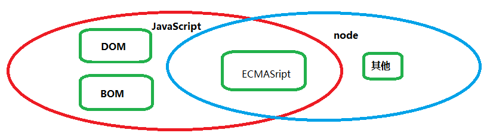
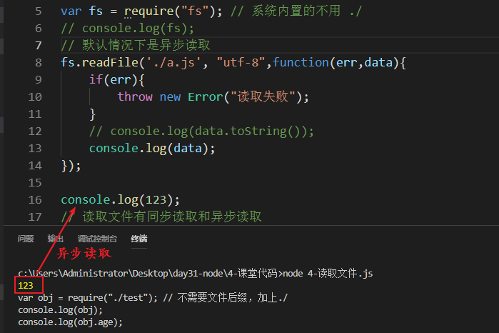

## node

### 简介

node.js是浏览器的js引擎。

浏览器中有一个js引擎用来解析js代码，只能解析js代码中的ECMAScript，dom和bom的解析依赖的是浏览器本身。

将这个js引擎单独拿出来，就是node了。

node.js和js的关系

| node.js和js的关系                         |
| ----------------------------------------- |
|  |

要让这个引擎运行起来，有人将他做成了一个软件，安装在电脑上，js代码就不用依赖浏览器运行了，在电脑的命令行也能运行js代码。

为什么要这么做？因为这样的话，js就能写后台了。

官网：https://nodejs.org/en/

中文网：http://nodejs.cn/

### 初体验

在命令行运行js代码：

```js
node
console.log(123);
Math.max(1,3,6,9,3,2,5,8);
```

运行结果和浏览器的控制台中的结果是一致的。

退出命令行：

```js
.exit // 或者按两次ctrl+c
```

在命令行运行js文件：

新建test.js文件写入下面代码：

```js
for(let i=1;i<=3;i++){
    console.log(i);
}
```

在命令行中输入：

```js
node 文件路径
```

执行结果：

| 运行一个文件                              |
| ----------------------------------------- |
|  |


### 简单的命令

```shell
盘符: # 进入某个盘符
cd 目录 # 进入某个目录  -  cd /
cd .. # 回到上一级目录 - 一样
dir # 查看当前文件夹中的文件和文件夹 - ls  
tree # 查看当前文件夹中的所有文件和文件夹包括子文件夹及其文件，树状结构
cls # 清屏 - clear
ipconfig # 查看当前电脑的网管信息 - ifconfig
systeminfo # 查看当前电脑的配置信息
md 文件夹名 # 新建文件夹 - mkdir   make directory
rd 文件夹名 # 删除文件夹 - rm -rf 文件夹   remove  directory
xcopy 文件夹 新文件夹名 # 复制文件夹，并起新的名字 - cp 源文件 目标文件
type nul> 文件名 # 新建文件 - touch  文件名
copy 文件名 新文件名 # 复制文件，并起新的名字
echo 内容 > 文件名 # 给文件中写入内容
move 文件路径 新的路径 # 将文件移动到新的路径
ren 文件名 新的文件名 # 将文件重命名
del 文件名 # 删除一个文件 - rm -rf 文件名
```

在vscode中，自带了命令行，可以直接在编辑器中执行命令：

```shell
ctrl+` # 打开编辑器的命令行
或者： 在文件上右击 “用命令打开”
```

### 导入导出

在实际开发中，一般是每个人完成一个功能，然后将多个功能组合在一起，从而完成整个项目。我们将这个过程叫做模块化开发。每个文件都是一个单独的模块。

每个人开发的功能都是一个单独的文件，要将多个文件组合在一起，需要将这多个文件导出，然后在一个最终的项目文件中导入。

导出：

每个文件都有一个对象：module。这个对象中有一个属性叫做exports，值也是一个对象，默认是一个空对象。当前文件默认导出的就是这个exports对象，导出的内容都写在这个对象中。

```js
module = {
    exports:{
        name:"张三"
    }
}
```

这个对象默认是存在的，所以不用重新赋值，直接添加内容即可。例：

```js
module.exports.name = '张三';
module.exports.age = 20;
```

导入：

将另一个文件中导出的内容接收起来。

```js
var res = require(要导入的文件); // 返回值就是文件导出的内容：module.exports对象
```

### 内置模块

在node中，模块分三种：

1. 内置模块，node系统自带的一些文件模块
2. 自定义模块，自己的一些文件
3. 第三方模块，雷锋写好的，下载来使用

#### fs模块

这个模块主要用来操作文件：读取、写入文件。

node系统自带的，直接引入进来使用。

```js
const fs = require("fs");
```

##### 写入文件

###### 异步写入

```js
fs.writeFile(被写入的文件，写入的内容，写入完成后执行的回调函数); // 这个操作是异步的
```

使用说明：

1. 文件存在则写入，文件不存在则创建文件写入。
2. 文件中没内容就直接写，有内容会覆盖写入。

例：

```js
const fs = require("fs");
fs.writeFile("./test.txt","hello node",function(){
    console.log("写入完成！");
});
console.log(123);
```

执行结果：

| 异步写入结果                              |
| ----------------------------------------- |
|  |

###### 同步写入

```js
fs.writeFileSync(被写入的文件，写入的内容); // 这个操作是同步的
```

例：

```js
const fs = require("fs");
fs.writeFileSync("./test.txt","hello node",function(){
    console.log("写入完成！");
});
console.log(123);
```

执行结果：

| 同步写入结果                              |
| ----------------------------------------- |
|  |

##### 读取文件

###### 异步读取

```js
fs.readFile(要读取的文件，[读取文件编码方式],读取成功后执行的回调函数);
```

使用说明：

1. 可选项参数是读取文件使用的编码方式，可以写utf-8
2. 回调函数中需要两个参数，参数1为错误对象，读取成功为undefined，读取失败为错误信息；参数2为读取的结果。如果没有编码方式，读取的是一个buffer，使用16进制来描述二进制数据，需要转为字符串查看。

例：

```js
var fs = require("fs");
/*fs.readFile("./a.txt",(err,data)=>{
	if(err){
		console.log("读取失败，错误为：",err);
		return 
	}
	console.log("读取成功，数据为：",data.toString());
});*/
fs.readFile("./a.txt","utf-8",(err,data)=>{
	if(err){
		console.log("读取失败，错误为：",err);
		return 
	}
	console.log("读取成功，数据为：",data);
});
console.log(123);
```

读取结果：

| 异步读取文件结果                          |
| ----------------------------------------- |
|  |

###### 同步读取

```js
fs.readFileSync(要读取的文件[,读取文件的编码]);
```

使用说明：返回读取的结果

例：

```js
var fs = require("fs");
/*
var data = fs.readFileSync("./a.txt");
console.log("读取成功，数据为：",data);
*/
var data = fs.readFileSync("./a.txt","utf-8");
console.log("读取成功，数据为：",data);
console.log(123);
```

读取结果：

| 同步读取文件结果                          |
| ----------------------------------------- |
|  |

#### http模块

node做后端，没有现成的服务器，需要使用http这个模块。

引入模块：

```js
const http = require("http");
```

利用这个模块做服务器：

```js
// 创建服务器，返回这个服务的名称
var server = http.createServer(function(){
    // 处理客户端的请求
    console.log("有请求");
});
// 监听端口
server.listen(9988); // 端口号要大于5000，不要使用6661~6669
```

启动文件，服务器就启动了，一直是阻塞状态，等待客户端的请求进来：

| 启动服务器结果                            |
| ----------------------------------------- |
|  |

创建服务器的回调函数有两个参数：参数1是请求的信息，参数2是响应信息：

```js
http.createServer(function(request,response){
    // 处理客户端的请求
    console.log(request);
    response.end("你的请求成功");
});
```

request中包含所有请求的信息，请求行，请求头，请求空行，请求主体，如下图：

| 请求信息                                  |
| ----------------------------------------- |
|  |

response是服务器给客户端响应的信息，可以自己设置，常用的属性和方法：

```shell
res.write(data): 给浏览器发送请求体，可以调用多次，从而提供连续的请求体
res.end();   通知服务器，所有响应头和响应主体都已被发送，即服务器将其视为已完成。
res.end(data); 结束请求，并且响应一段内容，相当于res.write(data) + res.end()
res.statusCode: 响应的的状态码 200 404 500
res.statusMessage: 响应的状态信息， OK Not Found ,会根据statusCode自动设置。不能赋值中文
res.setHeader(name, value); 设置响应头信息， 比如content-type
res.writeHead(statusCode, statusMessage, options); 设置响应头，同时可以设置状态码和状态信息。
```

<font color="red">**注意：必须先设置状态码，再设置响应头，最后设置响应主体，顺序不能乱。** </font>

例：

```js
const http = require("http");
const server = http.createServer();
server.on("request",function(req,res){
	// 设置状态行和响应头
	// 语法：res.writeHead(状态码，状态文本，{响应头});
	res.writeHead(404,'ccc',{'content-type':'text/html'});
	res.end("ok");
});
server.listen(9988,function(){
	console.log("服务器启动成功");
});
```

查看响应信息：

| 自定义的响应结果                          |
| ----------------------------------------- |
|  |

### npm

第三方模块是别人写好的一些文件，我们要使用这些文件，就需要下载。

node提供了一个工具，叫做npm，专门用来管理这些模块。可以下载，可以更新。。。，npm除了可以管理第三方模块，还可以管理一些框架、插件和库。所以npm叫做包管理器，我们将模块、插件、库统称为包。

npm这个工具在安装node的时候会自带npm。

npm可以连接到各个插件、框架、模块、库的下载地址，使用的时候需要在命令执行命令。

下载命令：

```shell
npm install 包名 # 下载一个包
```

例：下载jquery

```shell
npm install jquery # 下载jquery
```


下载完成后，会在当前文件夹中新建一个文件叫`node_modules`，在这个文件夹中有一个文件夹叫做jquery，这就是下载成功的包。

| 下载jquery的示意图                        |
| ----------------------------------------- |
|  |

使用说明：

1. `install`关键字可以简写为`i`
2. 默认下载的是最新版本，要下载指定版本可以在包名后面加@版本号
3. 可以同时下载多个包，多个包名中间用空格隔开
4. 每次下载会自动生成一个文件：`package-lock.json`，里面下载的各种信息

如果某个包不想使用了，可以使用命令进行卸载：

```shell
npm uninstall 包名
```

`package.json`这个文件用来描述当前项目的各种信息。通常一个项目中会使用到很多的包、库、模块、插件等等，到项目完成的时候，`node_modules`这个文件夹会很大，如果要上线了或者要放到别的地方运行，将这个文件夹复制的话，会很大。解决这个问题，可以使用`package.json`。在这个文件中可以将项目依赖的包的信息，写进去，以后别人拿到这个文件就能知道，这个项目依赖的包有哪些。

如何使用这个文件：

```shell
npm init
```

命令执行后，需要根据提示输入项目的信息。

如果不想输入很多信息，可以全部使用默认值：

```shell
npm init -y
```

<font color="red">如果要使用默认的话，当前文件夹名不能是中文</font>

有了这个文件后，再下载包的话，文件中就会添加依赖的包的信息：

```json
{
  "name": "03-npm",  //描述了包的名字，不能有中文
  "version": "1.0.0",  //描述了包的的版本信息， x.y.z  如果只是修复bug，需要更新Z位。如果是新增了功能，但是向下兼容，需要更新Y位。如果有大变动，向下不兼容，需要更新X位。
  "description": "", //包的描述信息
  "main": "index.js", //入口文件（模块化加载规则的时候详细的讲）
  "scripts": {  //配置一些脚本，在vue的时候会用到，现在体会不到
    "test": "echo \"Error: no test specified\" && exit 1"
  },
  "keywords": [],  //关键字（方便搜索）
  "author": "",  //作者的信息
  "license": "ISC",  //许可证，开源协议
  "dependencies": {   //重要，项目的依赖， 方便代码的共享  通过 npm install可以直接安装所有的依赖项
    "bootstrap": "^3.3.7",
    "jquery": "^3.3.1"
  }
}
```

别人拿到这个文件，只需要执行命令就可以将项目依赖的包都下载下来：

```js
npm i
```

如果安装失败， 可以通过以下命令清除npm缓存：

```shell
npm cache clean -f  // -f 强制清除
# 或者在执行完命令再删除缓存文件夹
```

上面安装的包，都是只能在当前文件夹使用，如果将项目文件放到别的地方，就找不到安装的依赖包了，我们将这种安装方式叫做局部安装。

还有一种安装方式叫做全局安装，只需要在当前电脑上安装一次，在电脑的任何地方都能使用。

局部安装只是在当前文件夹中安装，全局安装是安装在当前电脑上。

全局安装命令：

```shell
npm install --global 包名;
npm install -g 包名;
```

### nrm

npm在下载包的时候，默认下载地址在国外，有时候网速不太好。所以node提供了一个工具用来管理npm下载工具，可以改变npm的下载地址，这个工具就是nrm。

nrm这个工具不自带，需要手动下载安装：

```shell
npm i -g nrm
```

检测是否安装成功：

```shell
nrm --version
```

nrm的使用：

```shell
nrm test # 用来检测哪个地址下载速度快一些，当前使用地址前面会带*
```

现在有很多网址，将常用的工具放上去，供人们下载，我们将这些网址叫做镜像源。

测试出来的结果：`镜像源名称 ---- 网速`，我们挑选网速最快的镜像源地址使用：

```shell
nrm use taobao # 将下载地址切换成taobao的镜像源
```

