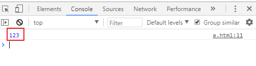
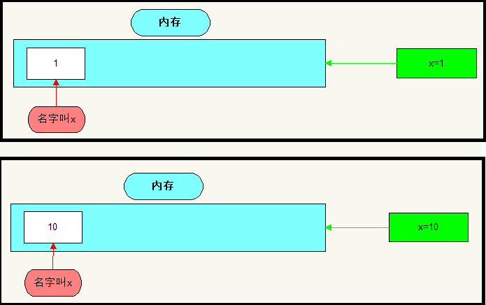
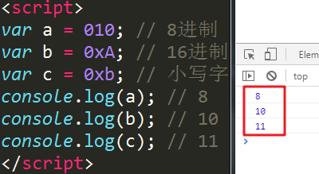
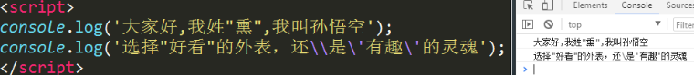
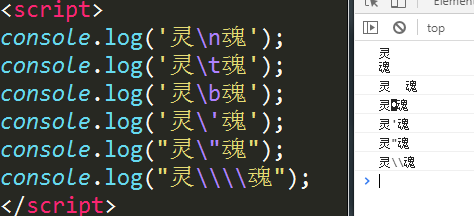
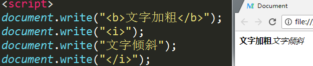

# 基本语法

### javascript基本介绍

#### JavaScript的历史：

​		在95年以前，就有很多上网的用户了，当时的带宽只有28.8kb/s，用户要进行表单的验证时，点击提交按钮，直接就将数据发送到服务器了，受限于带宽的关系，浏览器和服务器的通信很慢，大概一次通信需要30s的时间。

​		这样，问题就出现了，我们平常注册一个用户，需要填写很多信息，当我们将所有信息填写好，点击提交按钮后，等待30s以后，提示我们用户名被占用了，修改，提交，等待30s，提示用户名不符合规范，修改，提交，等待30s，密码不符合规范，修改，等待。。。这样的用户体验感很差，给网民造成很大的烦恼。随着上网的用户越来越多，问题越来越严重。

​		这时候，网景公司（Netscape ，这是一家浏览器公司）下定决心要解决这个问题，并将这个问题交给[布兰登·艾奇](https://baike.sogou.com/lemma/ShowInnerLink.htm?lemmaId=41517897)（Brendan Eich，1964年～，当时在网景公司工作的一个程序员）来解决，他用了10个工作日的时间，设计了一个门语言，叫做LiveScript，专门用来解决客户端上的问题。网景公司和Sun公司合作，在发布的时候，改名为Javascript，目的是为了利用 Java 这个因特网时髦词汇。JavaScript 从此变成了因特网的必备组件。

​		因为 JavaScript 1.0 如此成功，微软推出了JScript脚本语言，后来陆续有好几家公司都创建了自己的客户端脚本语言。

​		此时，JavaScript 并没有一个标准来统一其语法或特性，随着互联网的发展，分久必合的趋势越来越有必要，最终，1997年，ECMA（欧洲计算机制造商协会）邀请了Netscape、Sun、微软、Borland等公司的一些程序员组成了TC39，定义了标准，名为ECMAScript。

​		ECMAScript是一个标准，而javascript是语言。

#### js概念

> 概念：支持面向对象的跨平台脚本语言。

理解：

1. 脚本语言：依赖别的语言才能运行

   html必须在浏览器中才能运行，js嵌套在html中才能运行

2. 跨平台：可以在不同的平台上运行

   windows、linux、安卓。。。

3. 支持面向对象

   使用面向对象的思想编程

#### 应用场景：

1. 表单验证：规范用户输入数据，和后台数据进行交互
2. 网页特效：给页面内容加行为，让页面动起来
3. 游戏开发：飞机大战、打砖块
4. 物联网：https://zhuanlan.zhihu.com/p/45509947

### JS和H5的关系

> h5，是html的下一个版本，很强大，就目前而言，我们知道的h5只是一些标签，并不能完美的展示出他的强大之处，加入js后，才能激活这些标签深层次的功能。

随着h5应用越来越多，js的使用方式和各种框架及插件也越来越多，甚至已经从前端语言可以实现后台服务器的功能。js的发展已经成为一种潮流。

### js的组成

| js的组成示意图                            |
| ----------------------------------------- |
|  |

ECMAScript：基础语法

BOM：提供了操作浏览器对象的一套方法

DOM：核心内容，提供了操作文档对象的方法

### 编写Js及如何运行JS

#### js的书写位置

- 第一种 : 写在`script`标签中

```html
<script>
  alert('Hello World!');
</script>
```

- 第二种 : 引入一个js文件

```html
<script src="main.js"></script>
```

说明：

1. `script`标签可以被放在网页的任何地方，但是我们初学建议放在`body`结束和`html`结束中间。
2. `script`标签使用`src`引入了js文件后，这个标签中不能再写js代码，写进去的代码是无效的。
3. 因为是嵌套在html中运行的，所以直接打开浏览器就能运行

#### js的注释

> 注释代码不会被执行，仅仅起到一个提示的作用。注释可以对复杂的代码进行解释，方便后期的维护和开发。

单行注释：

```javascript
// js的单行注释是双斜杠
```

多行注释：

```javascript
/*
js的多行注释：
开头是斜杠星号
结尾是星号斜杠
*/
```

#### js的输出

> 所谓输出，其实就是将内容显示在网页中，和html不同，js代码不会主动显示在网页中，需要使用一些方法才能显示在网页中。

以弹窗的形式显示：

```javascript
alert(11);
```


| 弹窗显示示意图                            |
| ----------------------------------------- |
|  |

以文本的形式显示：

```javascript
document.write(123456);
```


| 文本显示示意图                            |
| ----------------------------------------- |
|  |

可输入内容的弹窗：

```javascript
prompt(12345)
```


| 可输入内容的弹窗                          |
| ----------------------------------------- |
|  |

可判断的弹窗：

```javascript
confirm(12345)
```


| 可判断的弹窗                              |
| ----------------------------------------- |
|  |

调试工具中输出：

```javascript
console.log(123);
```


| 代码调试工具中输出                        |
| ----------------------------------------- |
|  |

<font color="red">注意：在js代码中，每行结束可以加分号，也可以不加分号，但是建议加上。</font>

### 变量

我们每天吃饭都用碗吃，碗里面的食物是每天都会改变的，我们代码中也有这样一种容器，叫变量。

#### 概念

可变的量。

```javascript
x + 1 = 2 -------- x = 1
x + 10 = 20------- x = 10
```

#### 理解

变量是内存中的一个空间，用来存放一些结果。

```javacript
x = 1 ------- 内存中有一个空间，空间名字是x，里面存放了1
x = 10 ------ 内存中有一个空间，空间名字是x，里面存放了10
```


| 变量示意图                                |
| ----------------------------------------- |
|  |

#### 变量的命名规则

以字母、下划线开头，后面跟数字、字母、下划线

```javascript
m
m2
mp3
3m
user_id
_start
2_m
```

#### 变量声明

`var`关键字，空格，后面跟变量名

```javascript
// 声明变量
var x // 在内存中开辟了一个空间，给这个空间起名叫x，里面没有放内容
var a,b // 一次性声名多个变量
// 声明变量并赋值
var y = 10 // 在内存中开辟了一个空间，这个空间的名字叫y，把10存了进去
var a=1,b=2; // 一次性声明多个变量并赋值
```

说明：

1. 变量名区分大小写，也就是说小写a变量和大写A变量是两个不同的变量。
2. 可以一次性声名多个变量，使用一个var关键字，变量名用逗号隔开。
3. 变量声名省略掉var关键字也是可以的。叫做隐式声明，有var关键字的就叫做显式声明。

不能使用关键字作为变量名，关键字就是系统已经占用的名字。


> <font color="blue">思考：如何输出一句话？</font>

```javascript
alert("你的头发还好吗？")
alert(123456)
```

输出一句话需要加引号，输出数字则不需要。因为一句话和数字的类型是不一样的。

房间是一个容器，里面放了床，就是卧室，用来睡觉的，里面放了猪，就是猪圈，用来养猪的，卧室和猪圈都是房间，但是类型不一样。变量是一个容器，里面放不同的东西，他的类型就不一样。

### 数据类型

| 类型                  | 示例                         | 备注                                       |
| --------------------- | ---------------------------- | ------------------------------------------ |
| 数字型（number）      | 1   -2   3.14   300          | 包括整数、小数、负数                       |
| 字符串型（string）    | "你好吗？"    '今天嫁给我'   | 用引号引起来的一串字符，单引号和双引号都行 |
| 布尔型（boolean）     | true   false                 | 代表事物的两面性，真和假                   |
| 未定义型（undefined） | var a                        | 代表定义过未赋值的变量                     |
| 对象（object）        | null   [1,2,3]   {name:张三} | 代表一个集合                               |

使用`typeof(被检测的内容)`可以得出一个内容的类型。

```javascript
console.log(typeof(-123456)); // 数字型
console.log(typeof("明天会更好")); // 字符串型
console.log(typeof(true)); // 布尔型
console.log(typeof(x)); // 布尔型
console.log(typeof([1,2,3])); // 对象
console.log(typeof({name:"张三",age:12})); // 对象
console.log(typeof(null)); // 对象
```

结果如下图：

| 类型检测示意图                            |
| ----------------------------------------- |
|  |

多学一招：`typeof(x)` 可以写成 `typeof x` 。使用小括号和空格都可以。

#### 数字类型

在结果中可以看到使用number来代表数字类型。

##### 不同进制的数字

我们一般使用使用的数字是十进制的，但是在js中我们还可以使用八进制和十六进制。

```javascript
var a = 010; // 8进制
var b = 0xA; // 16进制
var c = 0xb; // 小写字母和大写字母都可以
console.log(a); // 8
console.log(b); // 10
console.log(c); // 11
```

结果：

| 示意图                                    |
| ----------------------------------------- |
|  |

NaN

```javascript
var a = "abc";
var b = 2;
var c = a - b;
console.log(c); // NaN
```

结果：

| 示意图                                    |
| ----------------------------------------- |
|  |

> NaN: not a number, 表示一个非数字

在js中，NaN用来表示一个非数字的特殊值，当发现无法进行运算时，js不会报错，而是会返回一个NaN

NaN的注意事项：

- NaN的类型是number类型的，表示一个非数字
- NaN不等于任何值，包括NaN本身
- 通过isNaN()可以判断是否是一个数字，返回false的时候，表示是一个数字。

```js
var a = 123;
var b = "abc";
console.log(isNaN(a)); // false
console.log(isNaN(b)); // true
```

结果：

| 示意图                                    |
| ----------------------------------------- |
|  |

##### 小数

- 科学计数法

```javascript
//当一次数字很大的时候，可以用科学计数法来表示
var num = 5e+5;  //5乘以10的5次方
var num = 3e-3;//3乘以10的-3次方

```

- 浮点数精度丢失问题

```javascript
//在进行浮点数运算的时候，可能会出现精度丢失的问题
0.1 + 0.2 = 0.30000000000000004;
0.2 + 0.2 = 0.4;
//尽量少用浮点数进行运算，不要让浮点数进行比较。

    解决办法 : 根据小数点后面的位数量 乘以对应的整数;
    0.1 + 0.2  ==> (0.1*10+0.2*10) / 10 = 0.3
0.01 + 0.02 呢?
```

##### 数值范围

```shell
最小值：Number.MIN_VALUE，这个值为： 5e-324
最大值：Number.MAX_VALUE，这个值为： 1.7976931348623157e+308
无穷大：Infinity    1/0
无穷小：-Infinity
```

#### 字符串类型

在类型打印中，可以看到在结果使用string来代表字符串类型。

我们说，字符串其实就是很多字符的集合，用引号引起来，但是单引号和双引号也是字符，如果作为字符串的字符？

<font color="blue">思考，如何打印以下内容：</font>

```shell
大家好,我姓"熏",我叫孙悟空
选择"好看"的外表，还\是'有趣'的灵魂
```

分析：

1. 引号可以嵌套，但是不能嵌套自己，需要交叉嵌套（单引号嵌套双引号或者双引号嵌套单引号）。
2. 使用转义符

```javascript
console.log('大家好,我姓"熏",我叫孙悟空');
console.log('选择"好看"的外表，还\\是\'有趣\'的灵魂');
```

效果：

| 示意图                                    |
| ----------------------------------------- |
|  |

一些带有特殊含义的字符需要进行转义，例：

| 符号 | 意义   |
| ---- | ------ |
| \n   | 换行   |
| \t   | 制表符 |
| \b   | 空格   |
| \    | 斜杠   |
| '    | 单引号 |
| "    | 双引号 |

示例：

| 示意图                                    |
| ----------------------------------------- |
|  |

<font color="red">**注意：js可以输出标签，让页面中的元素具备标签的特性，但是在输出标签的时候一定要将标签当做字符串输出。**</font>

| js输出标签                                |
| ----------------------------------------- |
|  |

字符串里面的字符个数：`字符串.length`

#### 对象类型

在浏览器的结果中使用object来代表对象类型。

null代表一个空的对象，通常使用过的对象以后将不再使用，需要将它手动销毁的时候给它赋值为null。

### 运算符

#### 赋值运算一

在编程中`=`不叫“等于号”，叫“赋值符”，<font color="red">**作用是将右边的值赋值给左边的变量，反过来讲，赋值符右边是值，左边是变量 **</font>

```javascript
var x = 1 // 将右边的数字1赋值给左边的变量x
```

其实就是将右边的数字1放到叫做x的那个内存空间中。

注意：变量是可变的，也就是说<font color="red">**同一个变量可以多次赋值，后面的值覆盖前面的值**</font>。

```javascript
var x = 1; // 声明变量x并给他赋值1
x = 10; // 给变量x重新赋值为10
alert(x); // 现在x变量的值就是10
```

第二次赋值的时候，是纯赋值操作，不是声明变量，所以就不用var关键字了。

#### 算术运算

| 运算符    | 示例                                 | 备注           |
| --------- | ------------------------------------ | -------------- |
| +（求和） | var a = 1; var b = 2; var c = a + b; | 数学中的加法   |
| -（求差） | var a = 2; var b = 1; var c = a - b; | 数学中的减法   |
| *（求积） | var a = 1; var b = 2; var c = a * b; | 数学中的乘法   |
| /（求商） | var a = 1; var b = 2; var c = a / b; | 数学中的除法   |
| %（求余） | var a = 5; var b = 2; var c = a % b; | 数学中的求余数 |

#### 字符串的拼接运算

上面的`+`，如果两边都是数字，那进行的是数学中的加法运算。但是两边只要一边是字符串的话，那是将两边的值连接成一个。也就是所谓的字符串的拼接。

```javascript
var a = 12345;
var b = "上山打老虎"
var c = a + b;
console.log(c); // 结果：12345上山打老虎
```

也就是将a变量和b变量拼接在一块，组成一个新的字符串，赋值给了c变量。

拼接运算的`+`左右两边，只要有一边是字符串就进行拼接运算，具体情况有：数字+字符串、字符串+数字、字符串+字符串。

#### 关系运算（比较运算）

| 运算符 | 描述                                                         |
| ------ | ------------------------------------------------------------ |
| `>`    | 大于                                                         |
| `>=`   | 大于等于                                                     |
| `<`    | 小于                                                         |
| `<=`   | 小于等于                                                     |
| `==`   | 等于（主要用于判断两边的值是否相等）                         |
| `===`  | 全等于（先判断两边的类型是否相等，类型相等再判断值是否相等） |

<font color="red">关系运算最后的结果只有两种，一种是真，一种是假，也就是布尔型的`true`和`false`</font>

```javascript
console.log(2>3); // false
var a = 2>1;
console.log(a); // true
```

结果

| 运行结果                                  |
| ----------------------------------------- |
|  |

等于和全等于

```javascript
var a = 123;
var b = "123";
console.log(a==b); // true
console.log(a===b); // false
```

结果

| 运行结果                                  |
| ----------------------------------------- |
|  |

a变量和b变量在内存中占用大小一样，里面的存的内容也一样，所以是相等的

但类型不一样，所以不全等。

#### 赋值运算二

| 符号 | 描述                     | 示例                                         |
| ---- | ------------------------ | -------------------------------------------- |
| +=   | 自己先加后，再赋值给自己 | var a = 1; a += 2; 相当于a先加2，结果赋值给a |
| -=   | 自己先减后，再赋值自己   | var a = 1; a -= 1; 相当于a先减1，结果赋值给a |
| *=   | 自己先乘后，再赋值自己   | var a = 1; a *= 3; 相当于a先乘3，结果赋值给a |
| /=   | 自己先除后，再赋值自己   | var a = 4; a /= 2; 相当于a先除2，结果赋值给a |
| %=   | 自己先余后，再赋值自己   | var a = 5; a %= 2; 相当于a先余2，结果赋值给a |

代码：

```javascript
var a = 1;
a += 2; // 将a先加2，得到结果3，再将3赋值给a
console.log(a); // 3
```

要理解上面的代码，首先理解给变量重新赋值。

```javascript
var a = 1; // 先声明，给a赋值为1
a = 3; // 给变量a重新赋值为3
console.log(a); // 3
```

然后理解自己运算后再赋值给自己（回想一下：赋值符左边是变量，右边是值）

```javascript
var a = 1;
a = a + 2; // 自己加2后再赋值给自己
console.log(a); // 3
```

练习：最后的a变量是多少？

```javascript
var a = 5;
a %= 3;
console.log(a); // 2
```

### 类型转换

#### 强制转换

1. 转换为布尔型

   ```shell
   语法：
   	Boolean(arg)
   ```

   - 非0数字转换为布尔型为true，0转换为布尔型为false
   - 非空字符串转换为布尔型为true，空字符串转换为布尔型为false
   - undefined转换为布尔型为false
   - null转换为布尔型为false

2. 转换为字符串

   ```shell
   语法：
   	String(arg)
   ```

   - true转换为字符串仍为 true，false转换为字符串仍为false
   - null转换为字符串扔为null
   - undefined转换为字符串仍为undefined

3. 转换为数字

   ```shell
   语法：
   	Number(str)
   ```

   - NaN代表不是数字，但是他是数字类型（没有意义的数字）
   - 非数字字符串转换后都是NaN（NaN是一个不是数字的数字类型）
   - true转为数字为1，false转为数字为0
   - undefined转换为数字为NaN
   - null转化为数字为0

4. 使用函数强制转换为数字

   ```shell
   语法：
   	parseInt(arg) # 强制转换为整数
   	parseFloat(arg) # 强制转换为小数
   ```

   - 小数转换为整数只取整数，向下取整

   - 首位非数字的字符串强转为整数为NaN，首位是数字的字符串强转为整数是首位的数字

   - 布尔型强转为**数字**为NaN

   - undefined强转为**数字**为NaN

   - null强转为**数字**为NaN

     

5. 使用`toString()`方法强制转换为字符串，转换结果和String()函数一样

   ```javascript
   var a = 123456;
   b = true;
   var c = a.toString();
   var d = b.toString();
   console.log(c);
   console.log(typeof c);
   console.log(d);
   console.log(typeof d);
   ```

   注意：这个方法不能给undefined和null使用

#### 隐形转换

数学运算时转换为数字型，例：

```javascript
var str = "100"
var a = str%10; // 乘和除以及求余都行
var b = true + 1
console.log(a);
console.log(b);
```

比较运算时发生隐形转换，例：

- 如果两个值都是字符串，则进行比较编码值
- 如果有一个值为数字或布尔型，则转换为数字进行比较
- 字符串进行比较的时候首字符进行比较，相等再进行后面的字符比较。参照阿斯克码表。

拼接运算时发生字符串转换，例：

```javascript
var a = "1";
console.log(a+12); // 112
```


### 逻辑运算

逻辑运算一般用于判断多个关系运算，得出最后结果。

| 运算符         | 描述                                                    |
| -------------- | ------------------------------------------------------- |
| &&（与，并且） | 左右两边都为true，最后结果才为true，否则就是false       |
| \|\|（或者）   | 左右两边只要有一个true，最后结果就为true，否则就是false |
| ！（非，取反） | 将true处理为false，将false处理为true                    |

逻辑运算最后得出的结果也是布尔型。

例题：

模特的要求：年龄在18岁以上，30岁以下。小红今年20岁，看看小红是否满足条件。

```javascript
var age = 20; // 小红的年龄
var result = age > 18 && age < 30;
console.log(result); // true    说明小红满足条件了
```

如果小红今年31岁呢？

```javascript
var age = 20; // 小红的年龄
var result = age > 18 && age < 30;
console.log(result); // false    说明小红不满足条件
```


小红嫁人：小红想嫁给小明。小明说：除非你身高160cm以上，或者你有50000元的嫁妆。小红身高155cm，做模特攒了100000元。看看小红是否满足小明的条件。

```javascript
var height = 155; // 小红的身高
var money = 100000; // 小红的钱
var result = height > 160 || money > 50000;
console.log(result); // true 说明小红满足了小明的条件
```

如果小红只攒了30000元呢？

```javascript
var height = 155; // 小红的身高
var money = 30000; // 小红的钱
var result = height > 160 || money > 50000;
console.log(result); // false 说明小红不满足小明的条件
```


双重否定等于肯定。

年龄小于18或年龄大于30都不满足小红嫁人的条件。

```javascript
var age = 20; // 小红的年龄
var result = !(age < 18 || age > 30); // 不满足条件，再取反就满足了
console.log(result); // true   说明这种表达方式也是可以的
```

小红身高小于160cm，并且钱财小于50000元，就不满足小明的条件。

```javascript
var height = 155; // 小红的身高
var money = 100000; // 小红的钱财
var result = !(height < 160 && money < 50000); // 不满足条件再取反表达满足
console.log(result); // true 说明小红还是满足条件的
```

### 自增自减运算

符号：++	表示让一个数字递增1

```javascript
var a = 1;
a++
console.log(a); // 2
```

++可以放在后面，也可以放到前面，表示的意思是一样的

```javascript
var a = 1;
++a;
console.log(a); // 2
```

当递增运算碰到赋值或者输出的时候，++放在前面和后就有了区别：

放在后面

```javascript
var a = 1;
console.log(a++); // 1
console.log(a); // 2
var b = 1;
var c = b++;
console.log(c); // 1
console.log(b); // 2
```

当++放在后面的时候，就最后进行递增运算，先进行输出或者赋值。

放在前面

```javascript
var a = 1;
console.log(++a); // 2
console.log(a); // 2
var b = 1;
var c = ++b;
console.log(c); // 2
console.log(b); // 2
```

当++放在前面的时候，就先进行递增运算， 后进行输出或赋值。

符号：--	表示让一个数字递减1

使用方法和注意事项与递增一样。

<font color="red">递增递减运算需要使用变量，不能使用具体数字</font>

### 进制介绍

我们平常使用的数字是十进制的，由0~9这10个数字组成，没有一个单独的数字代表10，要表示10，需要向前进一位，所以是10进制。

计算机内部还会使用二进制、八进制和十六进制。

二进制由0和1两个数字组成，没有一个数字表示2，要表示2，需要向前进一位。

同理八进制由0~7这8个数字组成。表示8的时候要向前进一位。

十六进制由0~9和a~f这16个数字组成，使用f来表示15，表示1要向前进一位。

进制转换：

转成10进制：以进制为底，幂从右往左依次为0次方，1次方，2次方…，乘以当前当前数字在10进制中的结果，所有乘积相加

例：

1.16进制的FF转为10进制：

| 示意图                       |
| ---------------------------- |
|  |

2.2进制的11011转为10进制

| 示意图                                    |
| ----------------------------------------- |
|  |

3.10进制的11转2进制-----反向取余数

| 示意图                                    |
| ----------------------------------------- |
|  |


githubcom

gitee.com - 码云


