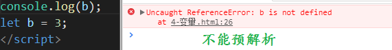
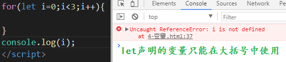
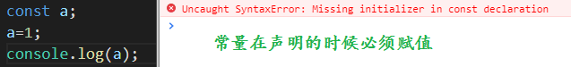
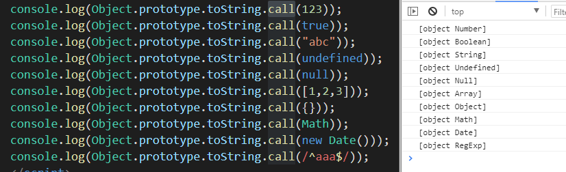
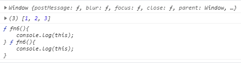
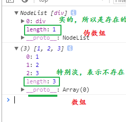

## ES5

### 严格模式

使用方式：在代码最前面加

```js
"use strict"
```

优点：

- 代码规范了
- 效率提高了

对代码的约束：

- 不能隐式声明变量
- 函数形参不能重名
- 不让函数的this指向window

### 数组新增的方法

- indexOf：查找元素在数组中第一次出现的位置下标

- ```
  var str="Hello world, welcome to the universe.";
  var n=str.indexOf("welcome");
  n 输出结果:13
  ```

  

- forEach：遍历数组

- |  |
  | ------------------------------------------------------------ |
  |  |

  

- map：遍历所有元素，将所有元素给一个函数处理，处理后的新元素组成一个新数组返回

- |  |
  | ------------------------------------------------------------ |
  |  |

- reduce：归并----  该`reduce()`方法将数组减少为单个值。

  该方法为数组的每个值（从左到右）执行提供的函数。` reduce()`

  函数的返回值存储在累加器中（结果/总计）。

  **注意：** 不对没有值的数组元素(空数组)执行该功能。` reduce()`

  **注意：**此方法不会更改原始数组。

  ```
  array.reduce(function(total, currentValue, currentIndex, arr), initialValue)
  
  total   必需。初始值, 或者计算结束后的返回值。
  currentValue   必需。当前元素
  currentIndex   可选。当前元素的索引
  arr             可选。当前元素所属的数组对象。
  ```

  filter：过滤----将数组中所有满足条件的元素组成一个新数组返回

- some方法先遍历数组，如果至少有一个元素满足条件，则返回true，否则返回false。

  ```javascript
  var arr = [2,4,6,10,15,21];
  var f = arr.some(function(element,index,array){
      if(element > 20){
         return true;
      }else{
          return false;
      }
  });
  ```

- every方法先遍历数组，判断所有元素是否满足条件，返回布尔值

  ```javascript
  var arr = [2,4,6,10,15,21];
  var f = arr.some(function(element, index, array){
      return element > 10;
  });
  ```

- find方法返回数组中满足条件的<font color="red">第一个值</font>，找不到元素则返回false

  ```javascript
  var arr = [2,4,6,10,15,21];
  var f = arr.find(function(element, index, array){
      return element > 10;
  });
  ```

- findIndex方法返回数组中满足条件的<font color="red">第一个值的下标</font>，找不到元素则返回-1

  ```javascript
  var arr = [2,4,6,10,15,21];
  var f = arr.findIndex(function(element, index, array){
      return element > 10;
  });
  ```

  

## ES6

js一直被各个语言诟病，因为js的作用域让开发者困扰，也因为js在以前不算是面向对象的语言。ES6的出现，让js语言上了一个台阶。js在发展过程中，一直在完善自己的漏洞。ES6将弱类型的js提升为中弱类型。所以我们必须要学习ES6。

好的东西，兼容性总是不太好，不过，没关系，后期我们会学习一个工具将es6的语法转为兼容最好的es5的语法。

### 定义变量

以前定义变量一直使用var关键字，es6中可以使用另外两个关键字let和const。

let是声明变量的关键字，特点：

1. 不允许重复声明

2. 不存在预解析

3. 在大括号中声明的变量只能在大括号中使用，如if、for的大括号中声明的变量

   使用场景：如果在一个循环中使用了事件、异步操作 - 建议将循环中的变量使用let定义
   
   4、暂时性死区，在代码块内，使用let命令声明变量之前，该变量都是不可用的这在语法上，称之为‘暂时性死区’

| 不允许重复声明                            |
| ----------------------------------------- |
|  |

不能预解析

| 不能预解析                                |
| ----------------------------------------- |
|  |

限制作用域

| 限制作用域                                |
| ----------------------------------------- |
|  |

const是声明常量的，特点：

1. 不允许重复声明
2. 不允许重新赋值（可以给对象中新增属性）
3. 声明的时候必须赋值
4. 不存在预解析
5. 在大括号中声明的变量只能在大括号中使用，如if、for的大括号中声明的变量

| 不能改变值                                |
| ----------------------------------------- |
|  |

声明的时候必须赋值

| 声明的时候必须赋值                        |
| ----------------------------------------- |
|  |

思考：什么时候使用let，什么时候使用const？

定义好就不会修改的变量用const，会改变的使用let

### 箭头函数

es6中的箭头函数是用来简写函数的

```js
let fn = function(){
    console.log(111);
}
```

】使用箭头函数简写

```js
let fn = ()=>{console.log(111);}
```

带参数的写法：

```js
let fn = function(a,b){
    console.log(a+b);
}
```

使用箭头函数改写

```js
let fn = (a,b)=>{console.log(a+b);}
```

<font color="red">注意：如果只有一个形参的时候，小括号可以省略：</font>

```js
let fn = function(a){
    console.log(a);
}
```

使用箭头改写

```js
let fn = a = > {console.log(a);}
```

<font color="red">注意：如果代码块中只有一行代码，箭头函数可以省略大括号，并将这行代码作为返回值</font>

```js
let fn = function(a){
    return a + 1;
}
```

箭头函数的写法

```js
let fn = a = > a+1;
```

例：使用箭头函数定义一个返回m到n范围内的随机数的函数：

```js
let fn = (m,n) => parseInt(Math.random()*(n-m+1))+m;
```

箭头函数使用注意事项：

1. 箭头函数中的this比较混轮，所以在函数和方法中使用到this的时候，就不要用箭头函数
2. 箭头函数中没有arguments

### 函数默认值

以前的函数不能有默认值，es6的函数中可以定义默认值：

```js
function add(a,b=2){
    return a + b;
}
console.log(add(5));
```

可以用箭头函数改写：

```js
let add = (a,b=2) => a+b;
console.log(add(5));
```

### 模板字符串

es6新增了定义字符串的方式，使用反引号

1. 可以换行书写，保持字符串中的换行和空格（可以使用trim()方法消除它）
2. 模板字符串中可以识别变量，使用美元符大括号：`${变量}`

### 解构赋值

解析一个数据结构并赋值，可以快速的从对象或数组中取出需要的内容，对象使用大括号，数组使用中括号

#### 解构对象

之前从对象中取到内容的方式

```js
let obj = {
    name:"张三",
    age:12,
    sex:"男",
}
let name = obj.name;
let age = obj.age;
```

解构的方式：

```js
let obj = {
    name:"张三",
    age:12,
    sex:"男",
}
let {name} = obj;
/*
表示从obj中获取name属性，并赋值给声明的name变量
*/
```

使用说明：

1. obj必须是一个对象
2. obj中必须有name属性

还可以一次性解构多个变量：

```js
let obj = {
    name:"张三",
    age:12,
    sex:"男",
}
let {name,age} = obj; // 声明并赋值了两个变量
```

可以将变量名换成一个别的名字：

```js
let obj = {
    name:"张三",
    age:12,
    sex:"男",
}
let {name:username,age:a} = obj; // 将obj的name属性值赋值给username变量，age属性值赋值给变量a
```

多级解构：

```js
let obj = {
    name:"张三",
    age:12,
    sex:"男",
    wife:{
        name:"翠花",
        age:11,
    }
}
let {wife} = obj;
let {name} = wife;
// 写为一行
let {wife:{name:wname}} = obj;
```

#### 解构数组

```js
let arr = [1,2,3];
let [num1] = arr; // 从数组中拿出第一个元素赋值给num1变量
```

使用说明：

> 解构数组的时候是按顺序取出数组中的值，解构一个变量，只能拿到第一个元素

解构多个元素：

``` js
let arr = [1,2,3];
let [num1,num2] = arr; // num1 = arr[0]   num2 = arr[1]
```

多维数组解构：

```js
let arr = [1,2,3,[4,5,6]];
let [a,b,c,[aa,bb]] = arr;
console.log(aa,bb); // 4 5
```

利用结构交换两个变量的值：

```js
let num1 = 1;
let num2 = 2;
[num2,num1] = [num1,num2]
```


### 展开运算符

将一个数组展开为多个变量赋值给多个形参

```js
let arr = [1,2,3];
function fn(a,b,c){
    console.log(a,b,c); // 1 2 3
}
fn(...arr);
```

利用展开运算求数组的最大值

```js
let arr = [5,3,6,9,8,1,7];
let max = Math.max(...arr); 
console.log(max); // 9
```

利用展开运算合并数组

```js
// 之前的写法
let arr = [1,2,3];
let arr1 = [4,5,6].concat(arr);
// 利用展开运算合并
let arr2 = [4,5,6].concat(...arr);
// 再简化
let arr3 = [4,5,6,...arr]
```

利用展开运算合并对象：

```js
const obj = {
    name:"Jack",
    age:20,
    sex:"男",
}
const obj1 = {
    ...obj,
    wife:{
        name:"Rose",
        age:18
    }
}
console.log(obj1);
```

### 合并运算符

将多个实参合并为一个数组

```js
function fn(...arr){
    console.log(arr);
}
fn(1,2,3); // [1,2,3]
```

箭头函数中没有arguments，可以使用合并运算符来模拟arguments

```js
var fn = (...arr) => {console.log(arr)};
fn(1,2,3); // [1,2,3]
```

### 对象的简写方式

```js
let name = '张三';
let age = 12;
let obj = {
    name,
    age
}
console.log(obj);
```

如果对象的属性名和变量名同名，则可以光写属性名

### 字符串方法

1. startsWith()  是否以谁开头，返回布尔值

   ```js
   let str1 = "file:///C:/Users/iTAze/Desktop/1.html";
   let str2 = "https://mp.csdn.net/postedit";
   console.log(str1.startsWith("https://"))// false;
   console.log(str1.startsWith("file:///"))// true;
   ```

2. endsWith()   是否以谁结尾，返回布尔值

3. includes()    判断一个字符串或数组是否包含一个指定的值

   ```js
   'Blue Whale'.includes('blue'); // return false
   ```


## 其他

### 检测数据类型

之前使用typeof检测数据类型，但这种方式只能检测基本数据类型。在判断数组或对象的时候不能准确判断。

有一个比较长的方法，可以检测所有数据类型：

```shell
Object.prototype.toString.call(被检测的数据类型)
```

例：

```js
console.log(Object.prototype.toString.call(123));
console.log(Object.prototype.toString.call('abc'));
console.log(Object.prototype.toString.call(true));
console.log(Object.prototype.toString.call(undefined));
console.log(Object.prototype.toString.call(null));
console.log(Object.prototype.toString.call([]));
console.log(Object.prototype.toString.call({}));
console.log(Object.prototype.toString.call(function(){}));
console.log(Object.prototype.toString.call(/^abc$/));
console.log(Object.prototype.toString.call(new Date()));
```

访问结果：

| 检测数据类型                              |
| ----------------------------------------- |
|  |

### this 关键字

每个函数内容都有一个关键字叫做this。不同的情况下，this代表的内容也是不一样的。

1. 普通函数中的this代表window对象

   ```js
   function fn(){
       console.log(this);
   }
   fn(); // window
   ```

   

2. 定时器中的this代表window

   ```js
   var obj = {
       eat:function(){
           setTimeout(function(){
               console.log(this);
           });
       }
   };
   obj.eat(); // window
   ```

   

3. 自调用函数中的this代表window

   ```js
   document.querySelector("button").onclick=function(){
       (function(){
           console.log(this);
       })()
   }
   // window
   ```

   

4. 对象方法中的this代表调用这个方法的对象

   ```js
   var obj = {
       eat:function(){
           console.log(this);
       }
   };
   obj.eat(); // obj
   ```

   

5. 事件函数中的this代表当前事件的事件源

   ```js
   document.querySelector("button").onclick=function(){
       console.log(this);
   }
   // <button>按钮</button>
   ```

   

6. 箭头函数的this在定义箭头函数的时候就知道了，代表上一行代码的this

   ```js
   document.querySelector("button").onclick=function(){
       // 这里的this代表button按钮，所以箭头函数的this也是button按钮
       setTimeout(()=>{console.log(this);});
   }
   // <button>按钮</button>
   ```

   

**重点：函数内部的 this 只和函数的调用方式有关系，和函数的定义方式没有关系。箭头函数在定义的时候就知道this代表什么**


### 上下文调用模式

也叫作方法借用模式。任何函数都能调用call、apply、bind这三个方法。这三个方法主要用于改变函数中this的指向。

#### call

call方法也可以用来调用函数：

```js
function fn1(){
    console.log(123);
}
// fn1();
fn1.call(); // 使用call方法调用函数和小括号调用时一样的
```

call方法不仅可以用来调用函数，还可以指定调用函数的this指向。call的第一个参数就可以改变函数内的this指向：

```js
function fn2(){
    console.log(this);
} 
fn2.call([1,2,3]); // 打印结果就是这个数组
```

这时候的this就变成了call的第一个参数，也就是这个数组

call的参数可以有若干个，第一个参数用来改变函数内的this指向，其余的函数是作为调用函数的实参

```js
function fn3(num1,num2){
    console.log(this);
    console.log(num1+num2);
}

// fn3(10,20);
var arr = [10,20];
fn3.call(arr,arr[0],arr[1]); //结果： Array  30
```

如果call没有参数或第一个参数为null，那么函数中的this执行window

```js
function fn4(){
    console.log(this);
}
fn4.call(); // window
fn4.call(null); // window
fn4.call(undefined); // window
```

#### apply

apply的作用和call是一样的，区别只在于写法，apply只有两个参数，第二个参数是一个数组或者伪数组

```js
function fn5(num1,num2){
    console.log(this);
    console.log(num1+num2);
}
var arr = [10,20];
fn5.apply(null,arr); // window  30
```

apply的特性： apply的平铺性： 将数组的中每一项取出来，作为借用函数的实参

什么时候用什么方法（call、apply）

1. 如果参数比较少的情况下，使用call比较方便
2. 如果参数已经存放在数组中，使用apply

#### bind

语法：` var fn2 = fn.bind(thisArg);`

作用： bind会创建并返回一个新的函数， 新的函数和借用的函数是一模一样的, 但是新函数内的this已经被改变成了bind的参数thisArg

```js
function fn6(){
    console.log(this);
}
fn6(); // window
var arr = [1,2,3];
var fn7 = fn6.bind(arr);
fn7(); // Array(1,2,3)
console.log(fn6,fn7);
```

结果：

| bind                                      |
| ----------------------------------------- |
|  |

bind 是不会去调用fn函数的，不像call、apply会去调用函数。bind会创建并返回一个新的函数，和借用的函数是一模一样的，但是新函数内部的this变成了指定的对象

使用场景：经常用于将定时器的this（window）变成指定的对象：

```js
var obj = {
    name:'张三',
    lover:'李四',
    sayLove:function(){
        // 使用bind将属于window的setTimeout变成当前对象的setTimeout
        setTimeout(function(){
            console.log(this.name+"爱"+this.lover);
        }.bind(this),500); 
    }
}
obj.sayLove(); // 张三爱李四
```

如果没有bind的话，打印结果是：`""爱undefined`

### json

#### json对象

js中的数组或者对象都可以是json对象

#### json字符串

json格式的字符串叫做json字符串

#### 字符串和对象的转换

`JSON.stringify` 是将 js 的对象或者数组转换成为 json 格式的字符串

```js
var obj = {
    "name":"张三",
    "age":12
}
var str = JSON.stringify(obj);
console.log(str); // {"name":"张三","age":12}  这是个字符串
```

`JSON.parse`  是将 json 格式的字符串转换为 js 的对象或者数组

```js
var str = '{"name":"张三","age":12}';
var obj = JSON.parse(str);
console.log(obj); // {"name":"张三","age":12} 这是个对象
```

### 伪数组

伪数组是一个对象。

这个对象中必须有length属性，如果length不为0，那么这个对象中必须有下标和对应的数据。

```js
var farr = {
    0:123;
    length:1;
}
```

这就是伪数组。

常见的伪数组有：

```js
arguments
DOM对象列表----HTMLCollection
```

伪数组转为数组的方法：

```js
Array.prototype.slice.call(fakeArray) 
```

也可以进行遍历放入数组中。

| 伪数组和数组的对比                        |
| ----------------------------------------- |
|  |


### 类

在es6之前，可以说没有类这个概念，es6中新增了定义类（构造函数的方式）

语法：

```js
class Animal{
    
}
var animal = new Animal();
console.log(animal); // Animal {}
```

这种方式定义的类，也必须和new配合使用。

如果在实例化需要传递参数的话，就在这个类中，写一个函数，名字必须是constructor

```js
class Animal{
    constructor(name){
        this.name = name;
    }
}
var animal = new Animal("动物");
console.log(animal); // Animal {name: "动物"}
```

要给类添加方法，就像写constructor一样写一个函数，这种写法和我们以前给构造函数的原型上添加方法是一样的

```js
class Animal{
    constructor(name){
        this.name = name;
    }
    dong(){
        console.log("能动");
    }
}
var animal = new Animal("动物");
console.log(animal); // Animal {name: "动物"}
animal.dong(); // 能动
```

这种方式的类继承很容易，而且是固定语法：

```shell
class 子类 extends 父类{
    constructor(){
		super();
	}
}
```

例：

```javascript
class Animal{
    constructor(name){
        this.name = name;
    }
    dong(){
        console.log("能动");
    }
}
class Dog extends Animal{
    constructor(name){
        super(name);
        this.jiao = "汪汪";
    }
}
var ergou = new Dog("狗");
console.log(ergou); // Dog {name: "狗", jiao: "汪汪"}
ergou.dong(); // 能动
```

<font color="red">**总结：继承就是让一个类拥有另一个类的属性和方法。**</font>