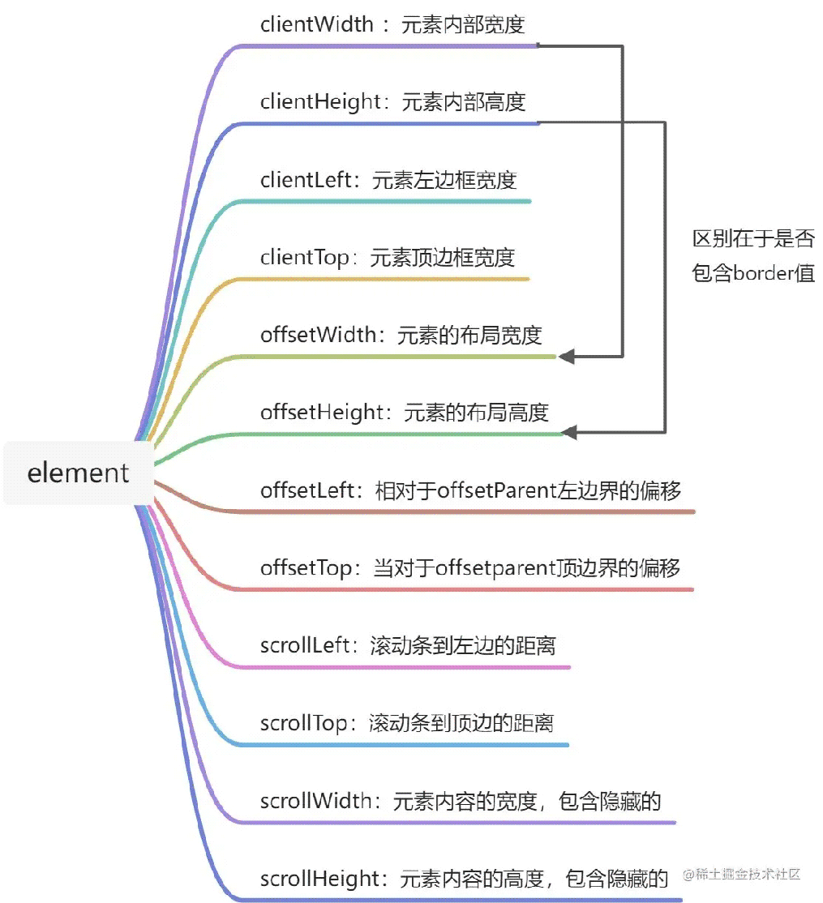

##### 目录

- [引言](http://www.45fan.com/article.php?aid=1D5kSfLJ681WstkV#_label0)

- [1.clientWidth、clientHeight、clientLeft、clientTop](http://www.45fan.com/article.php?aid=1D5kSfLJ681WstkV#_label1)

- - [1.1 clientWidth](http://www.45fan.com/article.php?aid=1D5kSfLJ681WstkV#_lab2_1_0)

  - [1.2 clientHeight](http://www.45fan.com/article.php?aid=1D5kSfLJ681WstkV#_lab2_1_1)

  - [1.3 clientLeft](http://www.45fan.com/article.php?aid=1D5kSfLJ681WstkV#_lab2_1_2)

  - [1.4 clientTop](http://www.45fan.com/article.php?aid=1D5kSfLJ681WstkV#_lab2_1_3)

  - [1.5 示例演示](http://www.45fan.com/article.php?aid=1D5kSfLJ681WstkV#_lab2_1_4)

  - - [（1）首先控制台获取Dom元素：](http://www.45fan.com/article.php?aid=1D5kSfLJ681WstkV#_label3_1_4_0)
    - [（2）然后在 Eelments->Computed 看盒模型：](http://www.45fan.com/article.php?aid=1D5kSfLJ681WstkV#_label3_1_4_1)
    - [（3）查看clientWidth的值：](http://www.45fan.com/article.php?aid=1D5kSfLJ681WstkV#_label3_1_4_2)
    - [（4）查看clientHeight的值：](http://www.45fan.com/article.php?aid=1D5kSfLJ681WstkV#_label3_1_4_3)
    - [（5）查看clientLeft和clientTop值：](http://www.45fan.com/article.php?aid=1D5kSfLJ681WstkV#_label3_1_4_4)

- [2.offsetWidth、offsetHeight、offsetLeft、offsetTop](http://www.45fan.com/article.php?aid=1D5kSfLJ681WstkV#_label2)

- - [2.1 offsetWidth](http://www.45fan.com/article.php?aid=1D5kSfLJ681WstkV#_lab2_2_5)

  - 
  - [2.2 offsetHeight](http://www.45fan.com/article.php?aid=1D5kSfLJ681WstkV#_lab2_2_6)

  - 
  - [2.3 offsetLeft](http://www.45fan.com/article.php?aid=1D5kSfLJ681WstkV#_lab2_2_7)

  - 
  - [2.4 offsetTop](http://www.45fan.com/article.php?aid=1D5kSfLJ681WstkV#_lab2_2_8)

  - 
  - [2.5 示例演示](http://www.45fan.com/article.php?aid=1D5kSfLJ681WstkV#_lab2_2_9)

  - - [（1）获取内部div Dom元素](http://www.45fan.com/article.php?aid=1D5kSfLJ681WstkV#_label3_2_9_5)
    - [（2）查看offsetWidth的值](http://www.45fan.com/article.php?aid=1D5kSfLJ681WstkV#_label3_2_9_6)
    - [（3）读取offsetHeight值](http://www.45fan.com/article.php?aid=1D5kSfLJ681WstkV#_label3_2_9_7)
    - [（4）读取offsetTop和offsetLeft的值](http://www.45fan.com/article.php?aid=1D5kSfLJ681WstkV#_label3_2_9_8)

- [3.scrollLeft、scrollTop、scrollWidth、scrollHeight](http://www.45fan.com/article.php?aid=1D5kSfLJ681WstkV#_label3)

- - [3.1 scrollLeft](http://www.45fan.com/article.php?aid=1D5kSfLJ681WstkV#_lab2_3_10)

  - 
  - [3.2 scrollTop](http://www.45fan.com/article.php?aid=1D5kSfLJ681WstkV#_lab2_3_11)

  - 
  - [3.3 scrollWidth](http://www.45fan.com/article.php?aid=1D5kSfLJ681WstkV#_lab2_3_12)

  - 
  - [3.4 scrollHeight](http://www.45fan.com/article.php?aid=1D5kSfLJ681WstkV#_lab2_3_13)

  - 
  - [3.5 示例演示](http://www.45fan.com/article.php?aid=1D5kSfLJ681WstkV#_lab2_3_14)

  - - [（1）查看scrollLeft的值](http://www.45fan.com/article.php?aid=1D5kSfLJ681WstkV#_label3_3_14_9)
    - [（2）查看scrollTop的值](http://www.45fan.com/article.php?aid=1D5kSfLJ681WstkV#_label3_3_14_10)
    - [（3）查看crollWidth的值](http://www.45fan.com/article.php?aid=1D5kSfLJ681WstkV#_label3_3_14_11)
    - [（4）查看scrollHeight的值](http://www.45fan.com/article.php?aid=1D5kSfLJ681WstkV#_label3_3_14_12)

- [4.彼此之间的数量关系以及应用](http://www.45fan.com/article.php?aid=1D5kSfLJ681WstkV#_label4)

- 
- [5.总结](http://www.45fan.com/article.php?aid=1D5kSfLJ681WstkV#_label5)


## 引言

在开发中我们常常会用到判断滚动条是否触底的逻辑。我一般都会在网上搜一段代码，这段代码有用到scrollTop、clientHeight、 scrollHeight 。接着我简单看一下好像理解了，再在项目里用一下好使了就没去深入研究相关概念。等下次用到了还是搜一下，自己写不出来...于是笔者想想深入研究一下这些概念好摆脱尴尬的局面。

看了很多的文章，感觉有一些写的不够详细具体，要么就是概念的堆砌没有例子和图，要么就是一张图写满了各种概念不易于理解。于是笔者自己对照MDN文档总结了一下这些概念，并结合示例加深对这些概念的理解，并总结了这些概念彼此之间的数量关系和应用场景。欢迎大家阅读，有写错或者理解错的地方请不吝指正。


## 1.clientWidth、clientHeight、clientLeft、clientTop


### 1.1 clientWidth

（1）含义：只读属性，表示元素的内部宽度，单位为像素。

（2）从盒子模型角度看：包含padding，但不包含border, margin 以及垂直滚动条。

（3）注意：内联元素clientWidth为0。

（4）语法：`element.clientWidth;`


### 1.2 clientHeight

（1）含义：只读属性，表示元素的内部高度，单位为像素。

（2）从盒子模型角度看：包含padding，但不包含border, margin 以及水平滚动条。

（3）注意：内联元素clientHeight为0。

（4）语法：`element.clientHeight;`


### 1.3 clientLeft

（1）含义：只读属性，表示一个元素左边框的宽度，单位为像素。

（2）从盒子模型角度看：clientLeft 不包括左外边距和左内边距.

（3）语法：`element.clientLeft`

（4）备注：如果元素的文本方向是从右向左（RTL, right-to-left），并且由于内容溢出导致左边出现了一个垂直滚动条，则该属性包括滚动条的宽度。


### 1.4 clientTop

（1）含义：只读属性，表示一个元素顶部边框的宽度，单位为像素。

（2）从盒子模型角度看：不包括顶部外边距或内边距

（3）语法：`element.clientTop`


### 1.5 示例演示

以如下的盒子模型来验证来看一下这些值以及计算过程（采用的例子是[MDN](https://developer.mozilla.org/zh-CN/docs/Web/API/Element/clientLeft)上的，您可以打开控制台自己试一下）：


#### （1）首先控制台获取Dom元素：

```
const div = document.getElementById('iddiv')
```


#### （2）然后在 Eelments->Computed 看盒模型：


#### （3）查看clientWidth的值：


clientWidth计算：内容宽度+左右padding即 182+28*2 = 182 + 56 = 238


#### （4）查看clientHeight的值：


clietentHeight计算：内容高度+上下padding即 102 + 0 = 102


#### （5）查看clientLeft和clientTop值：


clientLeft和clientTop计算：左边框 24 ； 上边框24

注意以上的计算过程是笔者在盒模型的设置为：`box-sizing: content-box`时的计算方法，如果盒模型设置为 `box-sizing: border-box;` 则计算clientWidth 和 clientHeight的方法为：

（1）clientWidth ：clientWidth 可以通过 CSS width+ CSS padding - 垂直滚动条宽度 (如果存在) 来计算

（2）clientHeight：clientHeight 可以通过 CSS height + CSS padding - 水平滚动条高度 (如果存在) 来计算

以clientWidth的计算为例说明一下


首先按照正常算法计算： 95 + 28*2 = 95 + 56 = 151 。151大于134 , 时因为还没有扣除滚动条的宽度，滚动条的宽度 为 151- 134 = 17 ， 量了一下滚动条的宽度确实为17，如下图所示：


## 2.offsetWidth、offsetHeight、offsetLeft、offsetTop


### 2.1 offsetWidth

（1）含义：只读属性，返回元素的布局宽度，单位像素。

（2）从盒子模型角度看：包含通过css设置的width，border, padding以及竖直方向滚动条的宽度。

（3）语法：`element.offsetWidth`

（4）备注：各浏览器的 offsetWidth 可能有所不同。


### 2.2 offsetHeight

（1）含义：只读属性，元素的布局高度，单位像素。

（2）从盒子模型角度看：包含通过css设置的height, border, padding以及水平方向滚动条的高度。

（3）语法：`element.offsetHeight`

（4）备注：如果元素被隐藏则返回0。

接下来要介绍offsetLeft和offsetTop的含义，在这之前要明白offsetParent的含义：

HTMLElement.offsetParent 是一个只读属性。

返回一个指向最近的（指包含层级上的最近）包含该元素的定位元素或者最近的 table,td,th,body元素。

当元素的 style.display 设置为 "none" 时，offsetParent 返回 null


### 2.3 offsetLeft

（1）含义：只读属性，当前元素左上角相对于offsetParent左边界的偏移。

（3）语法：`element.offsetLeft`

（4）备注：如果元素被隐藏则返回0。


### 2.4 offsetTop

（1）含义：只读属性，当亲元素相对于offsetParent元素的顶部内边距的距离。

（3）语法：`element.offsetTop`

（4）备注：如果元素被隐藏则返回0。


### 2.5 示例演示

笔者写了一个demo用来说明如上概念，代码如下：

```
<html lang="en">
    <head>
        <style>
            .parent {
                    width: 400px;
                    height: 400px;
                    border: 1px solid #ccc;
                    padding-top: 50px;
                    padding-left: 20px;
            }
            .child {
                    width: 200px;
                    height: 200px;
                    padding: 10px;
                    border: 10px solid black;
                    overflow: auto;
            }
        </style>
    </head>
    <body>
        <div class="parent">
            <div class="child" id="child-id">
                    <!-- 省略内部内容 -->
            </div>
        </div>
    </body>
</html>
```

代码运行效果以及盒子模型如下图所示：


#### （1）获取内部div Dom元素

```
const div = document.getElementById('child-id')
```


#### （2）查看offsetWidth的值


其计算过程：border 20 + pading 20 + content 183 + 滚动条 17 = 240。

也就是： 20 + 20 + 200= 240

如果设置 `box-sizing:border-box `则对应的盒子模型变为：


此时查看offsetWidth的值：


其计算过程： content 160 + padding 20 + border 20 = 200 。我们观察实际效果：


发现虽然computed的盒子模型显示padding是10 ，但实际上并不是10了，而且由于滚动条的存在左右显示的padding所占空间已经不相等。


#### （3）读取offsetHeight值


计算过程与offsetWidth类似： 183 content + 17 滚动条 +20 padding + 20 border = 240。如果设置 `box-sizing:border-box `则offsetHeight值如下：


#### （4）读取offsetTop和offsetLeft的值


如上我们发现offsetParent为body元素， 那么offsetTop值为59 ， offsetLeft的值为29,都是怎么算出来的啊？看一下body以及class为parent的外层div的盒模型结构：


参考盒子模型结构我们可以得到计算过程：

> offsetTop : 8 (body padding) + 1 (parent border) +50 (parent padding) = 59
>
> offsetLeft: 8 (body padding) + 1 (parent border) + 20 (parent padding) = 29


## 3.scrollLeft、scrollTop、scrollWidth、scrollHeight


### 3.1 scrollLeft

（1）含义：可读取可设置，一个元素的内容水平滚动的像素数（滚动条到元素左边的距离）。

（2）语法：`Element.scrollLeft`

（3）备注：注意如果这个元素的内容排列方向是rtl (right-to-left) ，那么滚动条会位于最右侧（内容开始处），并且scrollLeft值为 0。此时，当你从右到左拖动滚动条时，scrollLeft 会从 0 变为负数。


### 3.2 scrollTop

（1）含义：可读取可设置，一个元素的内容垂直滚动的像素数。

（2）语法：`Element.scrollTop`

（3）备注：一个元素的 scrollTop 值是这个元素的内容顶部（卷起来的）到它的视口可见内容（的顶部）的距离的度量。注意，这里并没有描述为滚动条距离顶部的距离，当然这样理解也没问题。当一个元素的内容没有产生垂直方向的滚动条，那么它的 scrollTop 值为0。


### 3.3 scrollWidth

（1）含义：只读属性，是一个元素内容宽度的度量，包括由于溢出导致的视图不可见内容。

（2）语法：`Element.scrollWidth`

（3）备注：没有水平滚动条的情况下，scrollWidth 值与元素视图填充所有内容所需要的最小值clientWidth相同。


### 3.4 scrollHeight

（1）含义：只读属性，是一个元素内容高度的度量，包括由于溢出导致的视图不可见内容。

（2）语法：`element.scrollHeight`

（3）备注：没有垂直滚动条的情况下，scrollHeight 值与元素视图填充所有内容所需要的最小值clientHeight相同。

为了说明scrollHeight 的含义，[MDN文档](https://developer.mozilla.org/zh-CN/docs/Web/API/Element/scrollHeight)给出了如下的示意图：


### 3.5 示例演示

示例代码任然沿用2.5 节的demo示代码， 运行效果如下：


#### （1）查看scrollLeft的值


如上图所示：水平方向上滚动条没有向右滚动时，则scrollLeft的值为0。


如上图所示：水平方向滚动条向右滚动了一定距离，则此时scrollLeft的值为58。


#### （2）查看scrollTop的值


如上图所示：竖直方向上滚动条没有向下滚动时，则scrollTop的值为0。


如上图所示：竖直方向上滚动条没有向下滚动了一定距离，则此时scrollTop的值为59。


#### （3）查看crollWidth的值


如上图所示：scrollWidth的值为704，代表内容的宽度。


#### （4）查看scrollHeight的值


如上图所示：scrollHeight的值为262，代表内容的高度。


## 4.彼此之间的数量关系以及应用

（1）关系1

没有竖直方向上的滚动条： scrollHeight = clientHeight

应用：判断竖直方向是是否有滚动条

（2）关系2

没有水平方向上的滚动条：scrollWidth = clientWidth

应用：判断水平方向是否有滚动条

（3）关系3

> scrollTop + clientHeight >= scrollHeight

因为scrollTop是一个非整数，而scrollHeight和clientHeight是四舍五入的，因此确定滚动区域是否滚动到底的唯一方法是查看滚动量是否足够接近某个阈值：

```
Math.abs(element.scrollHeight - element.clientHeight - element.scrollTop) < 1
```


## 5.总结

一图胜千言，本文的全部内容如下：



以上就是JS属性scrollTop clientHeight scrollHeight理解学习的详细内容，更多关于JS属性scrollTop clientHeight scrollHeight的资料请关注其它相关文章！