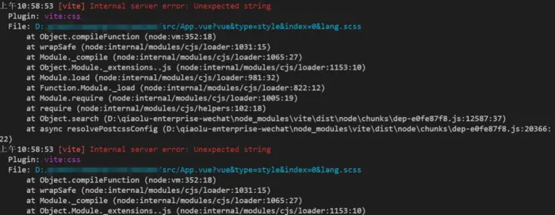

这里不考虑大屏,所以不做amfe-flexible的配置

首先是安装依赖

```
yarn add postcss-loader postcss-pxtorem -D
yarn add autoprefixer -D
```

然后新建postcss.config.js文件

```
module.exports = {
  'plugins': {
    'autoprefixer': {
      overrideBrowserslist: [
        'Android 4.1',
        'iOS 7.1',
        'Chrome > 31',
        'not ie <= 11',  //不考虑IE浏览器
        'ff >= 30', //仅新版本用“ff>=30
        '> 1%',//  全球统计有超过1%的使用率使用“>1%”;
        'last 2 versions', // 所有主流浏览器最近2个版本
      ],
      grid: true ,// 开启grid布局的兼容(浏览器IE除外其他都能兼容grid，可以关闭开启)
    },
    'postcss-pxtorem': {
      rootValue: 37.5, // 设计稿宽度除以 10，  开头大写的Px 不转换 => height: 100Px, 内联样式不转换，需要 / 75 转成 rem
      unitPrecision: 6, // 计算结果保留 6 位小数
      selectorBlackList: ['.no-rem', 'no-rem'], // 要忽略的选择器并保留为px。
      propList: ['*'], // 可以从px更改为rem的属性  感叹号开头的不转换
      replace: true, // 转换成 rem 以后，不保留原来的 px 单位属性
      mediaQuery: true, // 允许在媒体查询中转换px。
      minPixelValue: 2, // 设置要替换的最小像素值。
      exclude: /node_modules/i // 排除 node_modules 文件(node_modules 内文件禁止转换)
    }
  }
}
```

**不要用require的方式引入,否则会报错,就像下面的这种引入方式会报样式错误**

 

```
module.exports = {
  "plugins": [
    require('postcss-import'),
    require('postcss-url'),
    require('autoprefixer')({browsers: ['Android >= 4.0', 'iOS >= 7']}),
    require('postcss-pxtorem')({
      rootValue: 75, // 设计稿宽度除以 10，  开头大写的Px 不转换 => height: 100Px, 内联样式不转换，需要 / 75 转成 rem
      unitPrecision: 6, // 计算结果保留 6 位小数
      selectorBlackList: ['am-'], // 排除，am-开头的class，不进行rem转换
      propList: ['*', '!font-weight', '!letter-spacing'], // 可以从px更改为rem的属性  感叹号开头的不转换
      replace: true, // 转换成 rem 以后，不保留原来的 px 单位属性
      mediaQuery: true, // 允许在媒体查询中转换px。
      minPixelValue: 0, // 设置要替换的最小像素值。
      exclude: /node_modules/i // 排除 node_modules 文件(node_modules 内文件禁止转换)
    })
  ]
}
```

 

报错如图,会有三个这样的报错

[vite] Internal server error: Unexpected string
Plugin: vite:css

