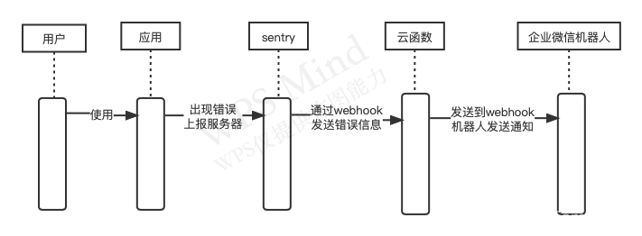
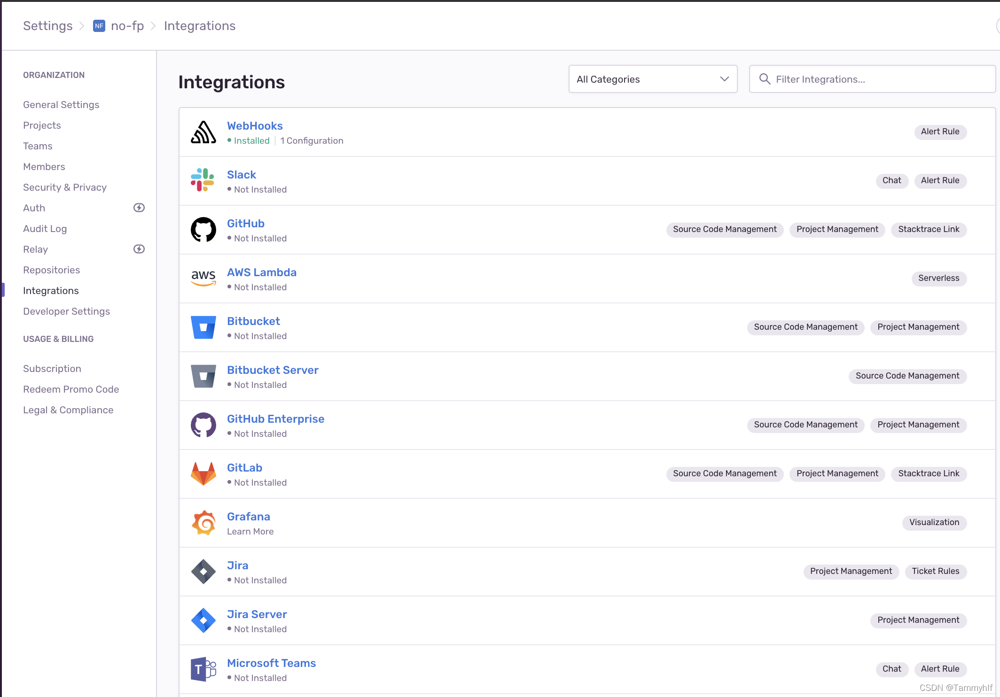

## 一、背景和痛点

​       目前公司监控线上情况的方式仅有服务端的日志，而且预警和通知的方式也不够完善，通过排障群，对大量报错的接口进行通知，然后对应的开发再查看日志排查对应的错误和异常；亦或是用户反馈某个功能有问题，然后开发重现后再定位问题。

       这两种方式都太过被动，而且链路太长，如果线上发生错误的时候我们能第一时间收到预警并及时把问题修复掉，那是不是会比前面那两种方法的体验更好呢？那就需要建立起我们前端错误监控系统

## 二、前言

首先我们需要在少数用户使用产品出错时知道有用户出错，而且尽量定位到是什么错误。由于用户的运行环境是在浏览器端的，因此可以在前端页面脚本执行出错时将错误信息上传到服务器，然后打开服务器收集的错误信息进行分析来改进产品的质量，下面我们分四个部分来讨论前端错误监控

+ 前端的错误分类
+ 错误上报
+ 错误的可视化
+ 预警、通知

## 三、错误分类和捕获错误

+ JS 语法错误、代码异常
+ AJAX 请求异常
+ 静态资源加载异常
+ Promise 异常
+ 跨域 Script error
+ 崩溃和卡顿

### 1、JS 语法错误、代码异常

大部分的语法和代码问题，在开发和测试的时候已经排查掉了，但是不排除有一些特殊场景下出现的漏网之鱼，所以这个问题也不能忽视。

+ 使用try-catch

  try catch finally只能捕获运行时的错误，无法捕获语法错误，可以拿到出错的信息，堆栈，出错的文件、行号、列号。try catch finally语句标记要尝试的语句块，并指定一个出现异常时抛出的响应。

```js
try {
  let name = 'aaa';
  console.log(nam);
} catch(e) {
  console.log('捕获到异常：', e);
}

控制台：
捕获到异常： ReferenceError: nam is not defined
    at <anonymous>:3:15

```

+ window.onerror

window.onerror可以捕捉语法错误，也可以捕捉运行时错误，可以拿到出错的信息，堆栈，出错的文件、行号、列号，只要在当前window执行的Js脚本出错都会捕捉到，通过window.onerror可以实现前端的错误监控。出于安全方面的考虑，当加载自不同域的脚本中发生语法错误时，语法错误的细节将不会报告。

/*
    message：错误信息（字符串）。
    source：发生错误的脚本URL（字符串）
    lineno：发生错误的行号（数字）
    colno：发生错误的列号（数字）
    error：Error对象（对象）
    若该函数返回true，则阻止执行默认事件处理函数。
*/
window.onerror = function(message, source, lineno, colno, error) { 
    // onerror_statements
}
不论是静态资源异常，或者接口异常，语法错误都无法捕获到。 

window.addEventListener

当一项资源（如图片或脚本）加载失败，加载资源的元素会触发一个 Event 接口的 error 事件，并执行该元素上的onerror() 处理函数。这些 error 事件不会向上冒泡到 window ，不过（至少在 Firefox 中）能被单一的window.addEventListener 捕获。

/*
    ErrorEvent类型的event包含有关事件和错误的所有信息。
*/
window.addEventListener('error', function(event) { 
    // onerror_statements
})
需要注意：

不同浏览器下返回的 error 对象可能不同，需要注意兼容处理。
需要注意避免 addEventListener 重复监听。
在vue中使用errorHandler
app.config.errorHandler = (err, vm, info) => {
  // 处理错误
  // `info` 是 Vue 特定的错误信息，比如错误所在的生命周期钩子
}
或者生命周期钩子 errorCaptured

### 2、请求异常在响应拦截器中处理

请求错误可以分为有响应的异常和无响应的异常

有响应：业务处理逻辑出错、数据库出错等；这种错误会收到服务端的错误码和对应的错误信息

无响应：40x，50x，网络错误，请求超时等

instance.interceptors.response.use(
  (res) => {},  (error) => {
    // 处理错误逻辑
})

### 3、promise异常使用Promise Catch

没有写 catch 的 Promise 中抛出的错误无法被 onerror 或 try-catch 捕获到，所以我们务必要在 Promise 中不要忘记写 catch 处理抛出的异常

解决方案： 为了防止有漏掉的 Promise 异常，建议在全局增加一个对 unhandledrejection 的监听，用来全局监听Uncaught Promise Error。使用方式：

window.addEventListener("unhandledrejection", function(e){
  console.log(e);
});

### 6、Script error 脚本错误是什么

因为我们在线上的版本，经常做静态资源 CDN 化，这就会导致我们常访问的页面跟脚本文件来自不同的域名，这时候如果没有进行额外的配置，就会容易产生 Script error

Script error 是浏览器在同源策略限制下产生的，浏览器处于对安全性上的考虑，当页面引用非同域名外部脚本文件时中抛出异常的话，此时本页面是没有权利知道这个报错信息的，取而代之的是输出 Script error 这样的信息

### 7、崩溃和卡顿

卡顿也就是网页暂时响应比较慢， JS 可能无法及时执行。但崩溃就不一样了，网页都崩溃了，JS 都不运行了，还有什么办法可以监控网页的崩溃，并将网页崩溃上报呢？

1.利用 window 对象的 load 和 beforeunload 事件实现了网页崩溃的监控。

2、可以使用 Service Worker 来实现网页崩溃的监控

## 四、使用sentry上报错误

### 4.1、sentry安装

 sentry官方文档： Configuration for Vue | Sentry Documentation

安装参考文档：https://segmentfault.com/a/1190000019304469

yarn add @sentry/vue @sentry/tracing
import { createApp } from "vue";
import { createRouter } from "vue-router";
import * as Sentry from "@sentry/vue";
import { Integrations } from "@sentry/tracing";

const app = createApp({
  // ...
});
const router = createRouter({
  // ...
});

Sentry.init({
  app,
  dsn: "https://77c14fc1c41541568320723f56753519@o1104244.ingest.sentry.io/6130866"
});

app.use(router);
app.mount("#app");
上传的错误信息是压缩后的，并不能定位到代码的实际位置，所以需要上传source-map 定位实际报错的位置

### 4.2、基本用法和上报错误

基础配置项：

Sentry.init({
    sdn: '', // 事件发送的地址，如果该变量也不存在，SDK 将不会发送任何事件。
    debug: false, // 打开或关闭调试模式。如果启用调试，如果发送事件出现问题，SDK 将尝试打印有用的调试信息。
    environment: '', // 设置环境。此字符串是自由格式的，默认情况下未设置。
    tunnel: '', // 捕获事件的 URL。此选项需要实现自定义服务器端点。
    sampleRate: '', // 配置错误事件的采样率，范围为0.0至1.0。默认值1.0表示发送 100% 的错误事件。如果设置为0.1仅发送 10% 的错误事件。事件是随机挑选的。
    initialScope: {}, // 初始数据
    tracesSampleRate: Number // 一个介于 0 和 1 之间的数字，控制发送错误事件到 Sentry 的百分比
    beforeSend(event) {
        delete event.user.email;
        return event;
    }, // beforeSend通过使用回调方法和配置、启用或禁用集成，配置您的 SDK 以过滤错误事件。
})
错误捕获：

ErrorEvent被触发时

Pomise错误

Sentry.captureEvent  // 可以传递一个Error对象以captureException()将其作为事件捕获

### 4.3、上报Source map

经过前面一些步骤，可以在sentry 平台issues中可以上报的错误。


虽然能看到报错的信息， 但上线的代码经过压缩、合并、编译，非常难定位到具体是哪行代码出现的错误，对定位错误没有多大的帮助。这时候就需要用到Source map了

什么是Source map，简单说，Source map就是一个信息文件，里面储存着位置信息。也就是说，转换后的代码的每一个位置，所对应的转换前的位置。有了它，出错的时候，除错工具将直接显示原始代码，而不是转换后的代码。这无疑给开发者带来了很大方便。  

sentry上报Source map文档https://docs.sentry.io/platforms/javascript/sourcemaps/

## 五、sentry + 企业微信机器人预警




产生错误后，我们如何能快速收到通知呢？sentry集成了很多应用的警报通知，但是没有发现发现企业微信。但是它有提供了一Webhook，那我们就可以使Webhook+企业微信群机器人实现警报。



具体的思路是：sentry服务端收到错误日志时候给配置的钩子发一条通知，钩子接收到告警通知后，然后再发送到企业微信机器人的钩子上去，这时群用户就能收到一条错误信息。        

思路比较简单，具体的步骤如下：

### 5.1 处理并转发sentry的错误信息

 这里使用的是腾讯云的云函数服务，详见文档：概述 | 云开发 CloudBase - 一站式后端云服务

创建目录和云函数文件 
发布云函数
使用 HTTP 调用云函数
 新建云函数，接收sentry服务器发送的参数，并进行处理，然后发送给企业微信群机器人的钩子上

### 5.2 配置sentry Webhook和配置警报规则

配置webhook:

callback urls中填入上一个步骤新建的云函数地址

设置警报规则：


 如上图所设置，如果问题发生超过五次，就会触发webhooks，可以看到云函数的日志有一条被调用成功的记录，此时企业微信群也会收到一条机器人发送的消息。
————————————————
版权声明：本文为CSDN博主「Tammyhlf」的原创文章，遵循CC 4.0 BY-SA版权协议，转载请附上原文出处链接及本声明。
原文链接：https://blog.csdn.net/weixin_38984030/article/details/122277542