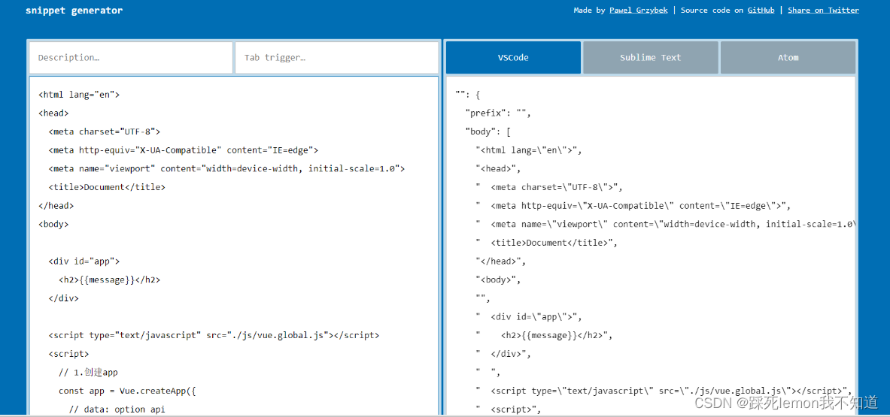
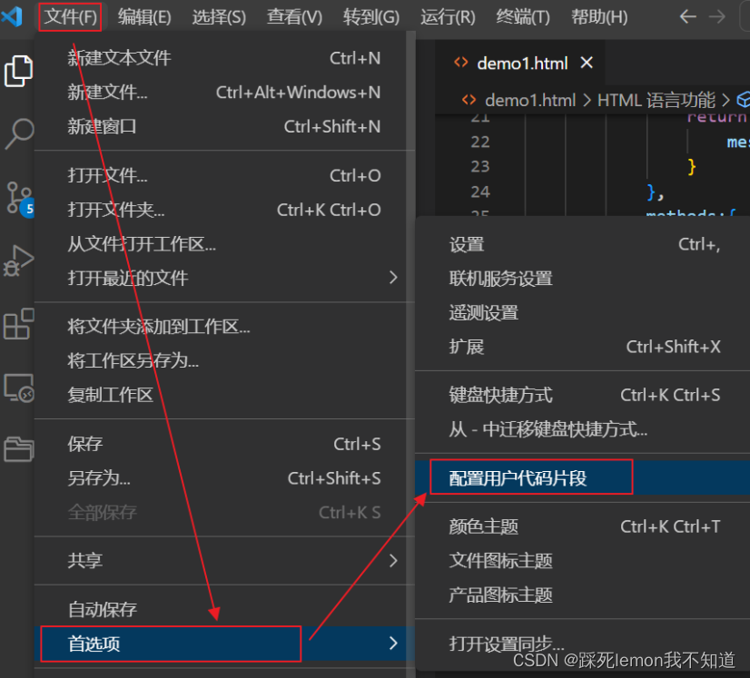
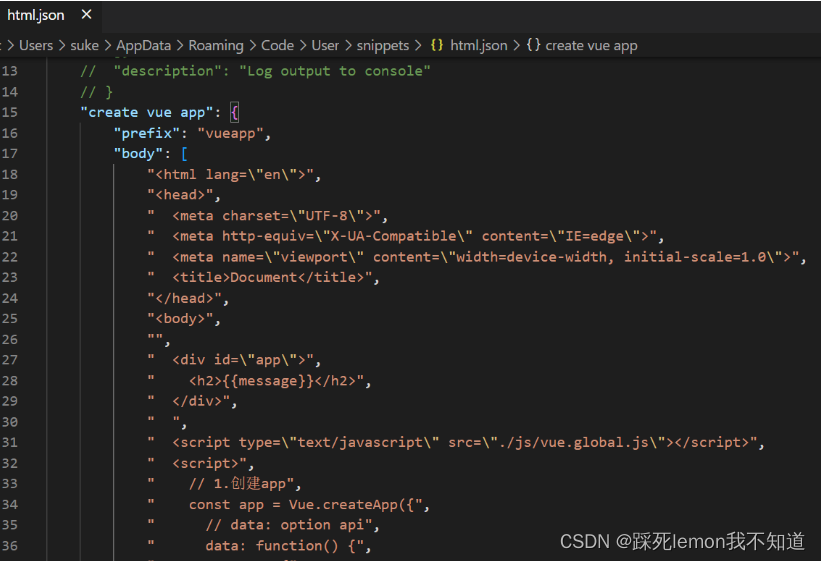
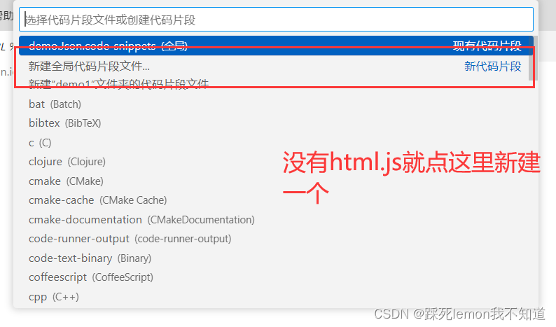

为什么要这样做？
例如在写html界面时，我们需要按照固定的格式，我们可以通过 !  来快速生成html基本格式

而我们在前面练习Vue的过程中，有些代码片段是需要经常写的，所以我们在VSCode中我们可以生成一个代码片段，方便我们快速生成。VSCode中的代码片段有固定的格式，所以我们一般会借助于一个在线工具来完成。

怎么做 ？
第一步，复制自己需要生成代码片段的代码
例如下图 ，以下是我们经常需要用到的代码片段，当我们输入vue的时候就可以出现下列代码片段

```
<html lang="en">
<head>
  <meta charset="UTF-8">
  <meta http-equiv="X-UA-Compatible" content="IE=edge">
  <meta name="viewport" content="width=device-width, initial-scale=1.0">
  <title>Document</title>
</head>
<body>
 
  <div id="app">
    <h2>{{message}}</h2>
  </div>
  
  <script type="text/javascript" src="./js/vue.global.js"></script>
  <script>
    // 1.创建app
    const app = Vue.createApp({
      // data: option api
      data: function() {
        return {
          message: "Hello Vue"
        }
      },
    })
 
    // 2.挂载app
    app.mount("#app")
  </script>
</body>
</html>
```

第二步在，snippet generator 在该网站中复制粘贴生成代码片段；

 

 第三步，在VSCode中配置代码片段 如下图 

 

 




最后我们只要在html页面输入"vueapp",敲回车键,就生成了整体的页面  

```
注意:

1) 所有的Vue方法和属性都必须在对应挂载根标签的内部使用

2) 所有Vue的数据都应该在date函数返回的对象中

3) 我们要遵循一个原则:由Vue管理的函数,一定不要写箭头函数,一旦写了箭头函数,this就不再是Vue实例了.

data:()=>{
console.log("$this:",this); //this不在是vue对象,而是window对象
    return {
      message:'hello world',
    }
}
```

